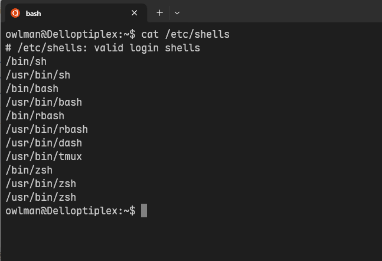
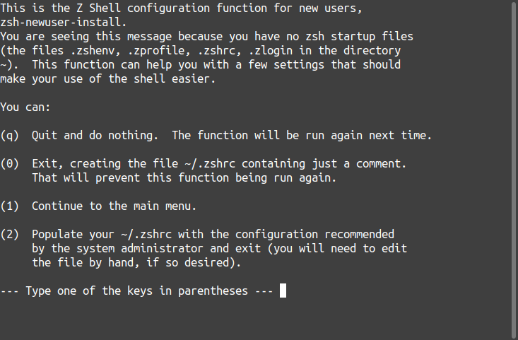

## Zsh 简介

Z shell（以下简称 Zsh）是保罗·弗斯塔德（Paul Falstad）于 1990 年在普林斯顿大学求学时编写的、一款可用作交互式登录的 Shell 及脚本编写的命令解释器。Zsh 对 [Bourne shell](https://zh.wikipedia.org/wiki/Bourne_shell)做出了大量改进，同时加入了 [Bash](https://zh.wikipedia.org/wiki/Bash)、[ksh](https://zh.wikipedia.org/wiki/Korn_shell) 及 [tcsh](https://zh.wikipedia.org/wiki/Tcsh) 的某些功能。

2019 年，由于 Bash 的版本已經很旧，而新版本的 Bash v5 改采 GPLv3 授权，这是 Apple 公司无法接受的。于是自从那时起，macOS 系统上的预置 Shell 就已从 Bash 改为了 Zsh。另外，[Kali Linux](https://zh.wikipedia.org/wiki/Kali_Linux) 也使用 Zsh 作为预置 Shell。其主要特性包括：

- 提供可编程的命令行补全功能，该功能可帮助用户键入常用命令选项及参数；
- 提供可编程的命令行界面，包括将提示行信息显示在屏幕右侧，以及自动隐藏过长指令等功能；
- 提供可与任意 Shell 共享的命令行历史记录；
- 可在不借助外部程序的情况下实现文件的查找；
- 改进了针对变量/数组的处理方式；
- 允许在单缓冲区内编辑多行命令；
- 支持针对命令的拼写检查；
- 支持多种兼容模式（例如，Zsh 可在运行为`/bin/sh`的情况下伪装成 Bourne shell）
- 支持以加载模块的方式引入额外的功能，包括支持 Unix 域套接字控制、FTP 客户端等；
- 提供有`where`命令，该命令的使用方法与`which`命令类似，但返回的是指定指令在`$PATH`中的全部位置，而不是它当前最优先匹配的位置；
- 允许用户为指定目录设置别名，例如，用户可以为`/usr/bin`设置别名`/u`，这样在输入`/u`时，Zsh 会自动将其替换为`/usr/bin`；

## 安装步骤

在安装之前，我希望读者确定自己是在类 UNIX 系统下，因为 Zsh 是在类 UNIX 系统下运行的 Shell 程序，如果您使用的是 Windows 系统，推荐使用 Windows Subsystem for Linux（WSL）。下面书归正传，Zsh 在每个操作系统中的安装方式并不完全相同，下面是其在几种常见 Linux/UNIX 系统下的安装命令：

```bash
# macOS 系统下的安装命令：
brew install zsh

# ubuntu/debian 系统下的安装命令：
sudo apt install zsh

# CentOS 系统下的安装命令：
sudo yum install zsh

# ArchLinux/Manjaro 系统下的安装命令：
sudo pacman -S zsh
```

如果您使用的是上述操作系统之一，在执行完相应的安装命令之后，就可以使用`cat /etc/shells`命令查看当前系统可以用的 Shell 了。然后，只要在该命令返回的结果中看到`/bin/zsh`，就说明 Zsh 已经安装好了，如图 1 所示。



**图 1**：当前可用的 Shell

接下来，我们可以使用`chsh -s /bin/zsh`命令将 Zsh 设置为系统默认 Shell 了。如果到目前为止的操作一切顺利，现在只需要重新启动一个 Shell 会话（通常是一个命令行终端窗口），就会看到 Zsh 的初始配置了，如图 2 所示。



**图 2**：Zsh 的配置引导界面

在上述界面中，如果我们输入`q`会直接退出配置引导，下一次运行 zsh 时会再次进入配置引导。如果输入`0`，也会退出配置引导，但是会在当前用户目录生成一个空白的文件`.zshrc`（路径为`~/.zshrc`），并且不会再进入配置引导界面。换言之，Zsh 会不会在启动时进入配置引导界面取决于当前用户目录下是否存在`.zshrc`文件，该文件是 Zsh 的默认配置文件，人们可以使用 vim 编辑器打开它并进行源码级别的手动配置。而如果我们在这里输入`1`，就会开始进行一系列自定义的配置。但通常情况下，考虑到`.zshrc`文件的复杂性，我们在这里并不推荐读者直接进行手动配置，使用 oh-my-zsh 来进行配置会是更好的选择。

## Oh-my-zsh

oh-my-zsh 是一款 Zsh 的配置管理工具，它提供了丰富的主题和插件，可以极大地美化命令行界面，并提高工作效率。我们需要这项工具的原因在于：原生的 Zsh 虽然很强大，但存在着以下几个问题：

- 稍复杂一些的配置就需要使用编码的方式修改`.zshrc`文件；
- 命令的自动补全和提示需要手动调教；
- 引入第三方主题与插件的相关配置就更为复杂了。

而 Oh My Zsh 的作用就是把这些复杂的配置一次性打包好，确保开箱即用。这其中最重要的是它的**主题和插件**，它们极大地美化并增强了 Zsh 的功能。首先是插件，这是 Zsh 核心竞争力所在，以下是一些常见的插件：

| 插件       | 作用                                   |
| ---------- | -------------------------------------- |
| `git`      | Git 命令补全、分支显示、快捷别名。     |
| `z`        | 智能目录跳转。                         |
| `sudo`     | 双击 `Esc` 自动给命令加 sudo。         |
| `docker`   | Docker 命令补全。                      |
| `python`  | Python / virtualenv 相关增强。          |
| `zsh-autosuggestions` | 命令行命令自动建议。        |
| `zsh-completions`    | 命令行补全。                 |
| `zsh-syntax-highlighting` | 命令行语法高亮。        |
| `you-should-use`       | 命令行错误提示。           |
| `zsh-history-substring-search` | 命令行历史记录搜索。|

在 Oh-my-zsh 中安装和启用插件通常可按照以下三个步骤来进行（如果是 Oh-My-Zsh 自带插件，则可跳过第一步）：

1，如果我们要启用的不是 Oh-My-Zsh 自带的插件，那该插件通常会在 github 上有独立的仓库，人们需要先使用`git clone`命令将其下载到 Oh-My-Zsh 安装目录下的`custom/plugins`目录中，例如，我们要启用`zsh-autosuggestions`插件，就需要执行以下命令：

```bash
git clone https://github.com/zsh-users/zsh-autosuggestions $ZSH_CUSTOM/plugins/zsh-autosuggestions
```

2，使用编辑器打开`.zshrc`文件，并在其中找到`plugins`字段，并将要启用的插件名称添加到该字段中（该字段是一个用空格符/换行符分隔的字符串），例如，我们现在要启用的插件包括`git`、`z`、`sudo`、`zsh-autosuggestions`、`zsh-completions`、`zsh-syntax-highlighting`、`you-should-use`、`zsh-history-substring-search`，那么`.zshrc`文件中`plugins`字段的值就该被设置如下：


```bash
plugins=(
    git
    z 
    sudo 
    zsh-autosuggestions 
    zsh-completions 
    zsh-syntax-highlighting 
    you-should-use 
    zsh-history-substring-search
)
```

3，保存并关闭`.zshrc`文件，然后执行`source ~/.zshrc`命令使配置生效。

<!-- 以下待整理 -->

### 2️⃣ 主题（Themes）

决定你终端的外观（提示符）。

最常见的：

* `robbyrussell`（默认）
* `agnoster`
* `powerlevel10k`（现代、强大、**最推荐**）

示例：

```zsh
ZSH_THEME="robbyrussell"
```

---

### 3️⃣ 自动补全 & 高亮

Oh My Zsh 默认就给你：

* 命令补全
* 参数补全
* 路径补全
* Git 分支补全

搭配插件还能获得：

* 命令历史提示
* 错误命令高亮

---

### 4️⃣ 别名（Aliases）

内置大量实用别名，例如：

```bash
gst   → git status
gco   → git checkout
ll    → ls -lh
```

不用自己记。

---

## 三、Oh My Zsh 是如何工作的？

安装后会生成：

```text
~/.oh-my-zsh/        # 框架本体
~/.zshrc             # 用户配置入口
```

启动 Zsh 时：

```
zsh → ~/.zshrc → oh-my-zsh.sh → 插件 → 主题
```

你只需要编辑 `.zshrc`，不碰核心代码。

---

## 四、Oh My Zsh 适合谁？

### ✅ 非常适合：

* 程序员 / 运维 / DevOps
* 经常用 Git、Docker、Python
* 希望终端“即装即用”
* 想要可维护的 shell 配置

### ⚠ 不太适合：

* 极度追求启动速度（插件多会变慢）
* 想完全掌控每一行配置（会觉得“太多”）

---

## 五、和 Bash / 原生 Zsh 的对比

| 项目   | Bash | 原生 Zsh | Oh My Zsh |
| ---- | ---- | ------ | --------- |
| 自动补全 | 基础   | 强      | **非常强**   |
| 配置难度 | 低    | 高      | **低**     |
| 插件系统 | 无    | 无      | **有**     |
| 主题   | 基本无  | 有      | **大量现成**  |
| 上手速度 | 快    | 慢      | **最快**    |

---

## 六、你刚才那个报错和 Oh My Zsh 的关系

你之前看到的：

```text
[oh-my-zsh] Insecure completion-dependent directories detected
```

这说明：

* Oh My Zsh **会检查安全性**
* 它发现 `.oh-my-zsh` 目录权限太宽（777）
* 为了防止被注入恶意脚本，**主动禁用了补全**

这恰恰说明：
👉 **Oh My Zsh 比普通 shell 更“谨慎”**

---

## 七、我的实用建议（不拐弯）

* **继续用 Oh My Zsh**，这是正确选择
* 配合：

  * `powerlevel10k`
  * `direnv`
  * `zsh-autosuggestions`
  * `zsh-syntax-highlighting`
* 修好权限问题即可（你已经在处理）

---

如果你愿意，我可以：

* 帮你 **整理一份极简但专业的 `.zshrc`**
* 给你一套 **“程序员标准 Oh My Zsh 配置”**
* 或直接 **帮你优化启动速度**

你更关心哪一个？

安装 oh-my-zsh 之前，需要确保本地已经安装了 git。

使用 curl 下载脚本并安装：

sh -c "$(curl -fsSL https://raw.github.com/ohmyzsh/ohmyzsh/master/tools/install.sh)"
或者使用 wget 下载脚本并安装：

sh -c "$(wget https://raw.github.com/ohmyzsh/ohmyzsh/master/tools/install.sh -O -)"
然后同意使用 Oh-my-zsh 的配置模板覆盖已有的 .zshrc：


安装 oh-my-zsh
在配置过程中，脚本会提示将 zsh 设为默认的 shell:


设置 zsh 为默认shell
这样就安装好 oh-my-zsh 了，下面我们开始通过 oh-my-zsh 来配置 zsh 。

配置 zsh
修改主题
在 https://github.com/ohmyzsh/ohmyzsh/wiki/Themes 中查看内置的主题样式和对应的主题名。这些内置主题已经放在 ～/.oh-my-zsh/themes 目录下，不需要再下载。


oh-my-zsh 内置主题
除了内置主题外，还可以选择其他开源的主题，强烈推荐尝试一下 powerlevel10k 主题，一个顶十个，项目地址为：https://github.com/romkatv/powerlevel10k

oh-my-zsh 安装这个款主题的方法：使用 git 将文件 clone 只指定文件夹 ～/.oh-my-zsh/custom/themes/powerlevel10k ，命令如下：

git clone --depth=1 https://github.com/romkatv/powerlevel10k.git ${ZSH_CUSTOM:-$HOME/.oh-my-zsh/custom}/themes/powerlevel10k
使用 vim 编辑 .zshrc，键入以下内容并保存：

ZSH_THEME="powerlevel10k/powerlevel10k"
最后，执行 source ~/.zshrc 配置生效，这时会提示对主题进行配置，按照提示进行即可。

安装插件

oh-my-zsh 已经内置了 git 插件，内置插件可以在 ～/.oh-my-zsh/plugins 中查看 ，下面介绍一下我常用的三个插件，更多插件可以在 awesome-zsh-plugins 里查看。

zsh-autosuggestions
zsh-autosuggestions 是一个命令提示插件，，当你输入命令时，会自动推测你可能需要输入的命令，按下右键可以快速采用建议。效果如下：


zsh-autosuggestions 插件效果

安装步骤：

把插件下载到本地的 ~/.oh-my-zsh/custom/plugins 目录：

git clone https://github.com/zsh-users/zsh-autosuggestions ${ZSH_CUSTOM:-~/.oh-my-zsh/custom}/plugins/zsh-autosuggestions

2. 在 .zshrc 中，把 zsh-autosuggestions 加入插件列表：

plugins=(
    # other plugins...
    zsh-autosuggestions  # 插件之间使用空格隔开
)
3. 开启新的 Shell 或执行 source ~/.zshrc，就可以开始体验插件。

zsh-syntax-highlighting
zsh-syntax-highlighting 是一个命令语法校验插件，在输入命令的过程中，若指令不合法，则指令显示为红色，若指令合法就会显示为绿色。效果如下：


zsh-syntax-highlighting 插件效果
安装步骤：

把插件下载到本地的 ~/.oh-my-zsh/custom/plugins 目录:
git clone https://github.com/zsh-users/zsh-syntax-highlighting.git ${ZSH_CUSTOM:-~/.oh-my-zsh/custom}/plugins/zsh-syntax-highlighting 
2. 在 .zshrc 中，把 `zsh-syntax-highlighting` 加入插件列表：

plugins=(
    # other plugins...
    zsh-autosuggestions
    zsh-syntax-highlighting
)
3. 开启新的 Shell 或执行 source ~/.zshrc，就可以开始体验插件了。

z
z 是一个文件夹快捷跳转插件，对于曾经跳转过的目录，只需要输入最终目标文件夹名称，就可以快速跳转，避免再输入长串路径，提高切换文件夹的效率。效果如下：


z 插件效果
安装步骤：

由于 oh-my-zsh 内置了 z 插件，所以只需要在 .zshrc 中，把 z 加入插件列表：
plugins=(
     # other plugins...
     zsh-autosuggestions
     zsh-syntax-highlighting
     z
)
2. 开启新的 Shell 或执行 source ~/.zshrc，就可以开始体验插件了。

设置 alias
zsh 支持为较长命令设置一个别名，这样在使用时可以快捷输入。

这里以 cd ~/projects/alicode/blog 这个命令来举例：

在 .zshrc 中键入：
alias cdblog="cd ~/projects/alicode/blog" 
2. 开启新的 Shell 或 source ~/.zshrc，以使配置生效。生效后就可以使用 cdblog 进行跳转了。

除了自己设置 alias 之外，一些插件也内置内很多 alias。最常用的是 git 插件内置的 alias。例如，ga 就代表 git add，更多 git 插件内置 alias 可以在 git plugin alias 中查看。

其他

遇事不决，多敲 Tab。

原文地址：zsh 安装与配置：9步打造高效命令行

在 https://www.alicode.pro从零件开始组装自己的开发机、安装环境，开发自己的软件，欢迎关注。

<!-- 以下来自Wikipedia -->


[](https://zh.wikipedia.org/wiki/File:Zsh-agnoster.png)

运行于[Konsole](https://zh.wikipedia.org/wiki/Konsole "Konsole")终端模拟器上使用Agnoster主题的Zsh

用户社区网站"Oh My Zsh"收集Z shell的第三方插件及主题。<sup id="cite_ref-8"><a href="https://zh.wikipedia.org/wiki/Z_shell#cite_note-8"><span>[</span>8<span>]</span></a></sup>截止于2018年，其[GitHub](https://zh.wikipedia.org/wiki/GitHub "GitHub")源共有超过1000位贡献者、200多款插件和超过140款主题。同时也带有更新已安装插件及主题的自动更新工具。<sup id="cite_ref-9"><a href="https://zh.wikipedia.org/wiki/Z_shell#cite_note-9"><span>[</span>9<span>]</span></a></sup>

-   [Shell对比](https://zh.wikipedia.org/w/index.php?title=Shell%E5%AF%B9%E6%AF%94&action=edit&redlink=1 "Shell对比（页面不存在）")
