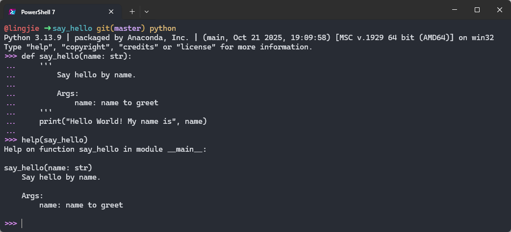
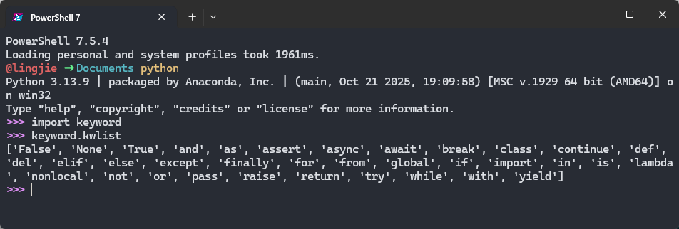
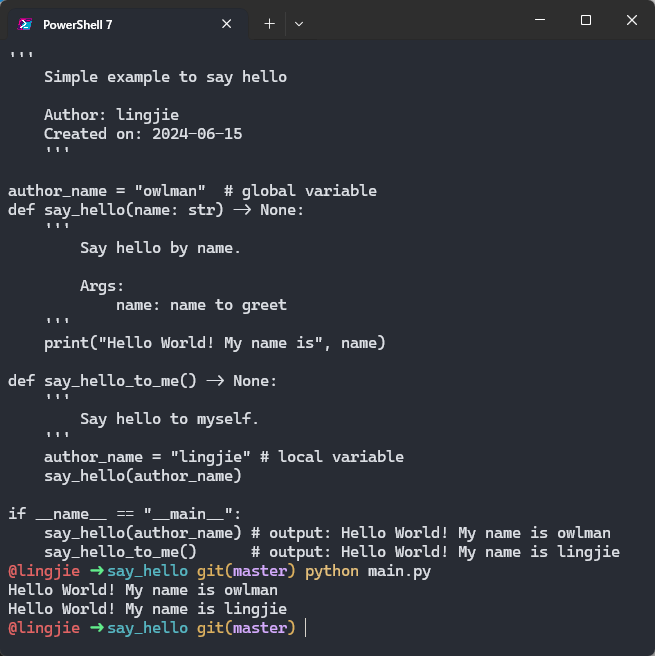

> [!NOTE] 笔记说明
>
> 根据之前在《[[关于Python的学习|Python 学习路系统图规划]]》一文中的规划，这篇笔记中将会具体记录我在学习 Python 的基础语法规则过程中的一些心得体会与编程练习，它们将主要聚焦于以下议题：
>
> - 了解在 Python 代码中会出现的注释、变量、操作符以及表达式等基本元素；
> - 了解 Python 的内置数据类型、自定义类型以及它们可执行的相关操作；
> - 了解如何在 Python 中使用函数、对象以及模块来实现面向过程/对象的编程；

自《The C Programming Language》这本在编程语言领域中被誉为“圣经”的经典教材问世以来，在命令行终端环境中输出带有“Hello World”字样的信息已经成为了人们学习一门新的编程语言，或者测试该语言的执行环境是否正常的第一个演示程序。这样做不仅可以先让我们对自己要学习的编程语言及其执行环境有一个整体的印象，同时也为该语言的基础语法学习提供了一个切入点。接下来，就让我们闲话少说，先从《[[编程环境配置]]》那篇笔记末尾的那版 Hello World 程序开始聊起吧，其代码如下所示。

```python
#! /usr/bin/env python
'''
    Simple example to say hello
    
    Author: lingjie
    Created on: 2024-06-15
    '''

author_name = "owlman"
def say_hello(name: str) -> None:
    '''
        Say hello by name.
     
        Args:
            name: name to greet
    '''
    print("Hello World! My name is", name)

if __name__ == "__main__":
    say_hello(author_name)
```

## 为代码编写注释

在上述代码中，我们首先看到的应该是注释信息。通常情况下，程序员们编写注释的目的是让阅读代码的人能更好地理解自己的设计意图，这对于代码的后期测试和维护工作有着非常重要的现实意义。在 Python 的语法规则中，注释主要有以下两种形式。

- **以`#`符号开头的单行注释**：这种形式的注释可以在代码的任意地方以`#`符号开头编写注释信息，直至其所在行结束为止，例如像下面这样。

    ```python
    # Python 支持加法运算
    x = 7
    y = 8
    z = x + y # 请问 z = ？
    ```

- **用三个单引号包括起来的字符串**：严格来说，这种形式的字符串并不属于真正的注释语法。但由于它可以被放置在代码中的任何位置上，并且可用于呈现包含换行符的长文本信息，所以常被程序员们用来编写多行注释，例如像下面这样。

    ```python
    '''
    示范 Python 中的加法运算
    涉及变量：x、y、z
    '''

    x = 7
    y = 8
    z = x + y
    print("z = ", z)
    ```

    **需要再次强调的是**，如果严格按照 Python 的语法规则来说，上述字符串的作用与纯粹的注释语法并不完全相同。虽然在大多数情况下，这种形式的字符串不会对代码的执行产生任何影响，但如果我们将这种字符串放置在了函数或类定义的开头，它就会被当作该函数或类的**文档字符串（docstring）**来处理，这可以通过`help()`函数来查看该函数或类的文档说明。例如在上面的 Hello World 程序中，我们就使用了这种多行字符串对象为`say_hello()`函数编写了一个文档字符串。读者可以通过在 Python 的交互式界面中输入`help(say_hello)`命令来查看该函数的文档说明，具体如图 1 所示。

    

正如我们之前所说，注释存在的目的是说明程序员编写相关代码的意图，以此来提高代码的可读性，方便日后的测试与维护工作。例如在上面这段示例代码中，我们用注释说明了它用于示范在 Python 中执行加法运算，并使用了`x`、`y`、`z`三个变量，当然了，编写这种画蛇添足式的注释在实际生产环境中并不值得鼓励。因为，我们必须考虑到 Python 本身就是一门用于表达信息的语言，它的作用除了让机器按照它的意图正确执行之外，也应该让使用这门语言的人类看得懂它的意图。**注释的作用只能是辅助说明，可不是充当 Python 自身的翻译**。换而言之，我们应该尽量用代码本身来表达它所要表达的意图，而不是处处都借助注释。

除了说明代码的意图之外，注释还有一个额外的作用：**在调试过程中临时去除某一行代码**。举个例子，如果我在调试下面这几行代码的时候发现自己的命令行终端不能显示中文，为了确定这不是代码本身的问题，我可能会选择像下面这样，临时注释掉中文的输出，然后增加一条英文的输出。在很多时候，这种利用注释语法来临时切换要执行的代码，也是一种很常用的代码调试技巧。

```python
name = "lingjie"
# print("你好！", name)
print("Hello ", name)
```

## 变量与函数

下面，让我们继续之前 Hello World 程序的讲解。读者在看完该程序的注释说明之后，接下来会看到的是一个用于定义变量或函数的语句。众所周知，由于编程语言是一种表达思维更接近于数学的人类语言，所以我们在用它描述一件事物时，通常需要先完成对它的定义，例如，描述一个数据，通常需要先定义一个变量，描述一组操作，通常需要先定义一个函数。下面，就让我们从变量的定义开始，带读者逐步了解如何使用 Python 来描述一件自己想让计算机完成的事情吧！

### 变量的定义

“变量"这个概念最早源自于数学中的代数运算，为了方便演算过程的书写，我们通常会用一些简单的字母来指代演算过程中不断变化的已知量或未知量，毕竟在公式中写`x`、`y`、`z`这样的字母总是要比写 $10^{55}$ 这样的数字或者 $\sum_{i=0}^{n}$ 这样的表达式简单方便多了。而到了计算机编程语言中，变量的概念得到了进一步扩展，除了是某个数据值的指代外，它还关联着计算机中用于存储该数据的一块内存空间，换而言之，变量现在还是程序用来存储某个数据的容器。当然了，这些容器既然能被称为“变”量，也就说明它们所存储的数据是会随着程序的执行而变化的。由于变量是程序所要操作的基本对象，所以在编写程序时，定义变量往往是我们首先要做的工作。具体到 Python 中，用于定义变量的语法规则如下。

```python
[变量名] = [变量值]
```

在这里，`[变量名]`是我们要定义的变量名称，`[变量值]`则是我们要使用该变量描述的数据。例如在之前的 Hello World 程序中，`author_name = "lingjie"`就是一个标准的变量定义语句，其中的`author_name`就是`[变量名]`，而`"lingjie"`则是`[变量值]`。

下面，让我们先来具体讨论一下`[变量名]`的设置问题。和绝大多数编程语言一样，Python 中的变量名可以由字母、数字与下划线以任何顺序排列组合而成，其中不能包含空格符以及`-`、`$`这样的特殊符号，并且只能以字母、下划线开头，像下面这些变量名都是不被允许的：

```python
$dollar = 100
2day = 10
'Week =11
\Month = 12
/Year = 14
my-name = "lingjie"
```

除此之外，我们所使用的变量名还需要注意避开 Python 语言自身要使用的关键字，我们可以利用语言标准库中一个名为`keyword`的模块来获取当前已被 Python 占用的所有关键字，具体如图 2 所示。



当然了，出于代码可读性方面的考虑，我们在选择变量名的时候还应该尽量使用有意义的单词或单词组合，不能太过随意。在这里，笔者个人更倾向于建议读者应在变量的命名上遵守某种一致的命名规范。譬如驼峰命名法，遵守这种命名规范的变量名通常由一个以上的单词组成，除了首个单词的字母不是大写，其余所有单词的首字母均为大写，例如`myName`、`myBook`、`someValue`、`getObject`等。而在 Python 社区中，人们通常更倾向于使用下划线来分隔英文单词的蛇形命名法来命名变量，例如`my_name`、`my_book`、`some_value`、`get_object`等。虽然这些命名规范并不是强制性的，但它们可以帮助我们更好地理解代码的意图，尤其是在团队协作中，遵守统一的命名规范更是至关重要。

在掌握了`[变量名]`的设置方法之后，我们就可以接着来讨论`[变量值]`的设置问题了。如果读者之前学习过 C/C++/Java 这类编程语言，想必一定会发现在 Python 中定义变量是不需要声明变量类型的。因为 Python 是一门动态类型语言，它会在运行时自动根据变量值的类型来决定该变量的类型。也就是说，Python 语言中的变量是可以随时改变其存储的数据类型的。例如，我们可以先将一个整数值赋给一个变量，然后再将一个字符串值赋给同一个变量，这样就可以让该变量的类型从整数变成字符串了，就像下面这样：

```python
x = 100          # 将整数值赋给变量 x
print(x)         # 输出变量 x 的值为 100
x = "lingjie"    # 再将字符串值赋给同一个变量 x
print(x)         # 输出变量 x 的值为 "lingjie"
```

至于 Python 的变量中究竟可以存储哪些类型的数据，我稍后会在讨论“对象与数据类型”这一议题时再详细介绍。现在，读者只需要知道在 Python 中定义变量时，我们只需要指定变量名和变量值即可。

### 函数的定义

和变量一样，“函数”这个概念最早也源自于数学，用于描述运算变量之间的关系。例如三角函数中的正弦函数 $y = sin(x)$，它描述的是一个变量 $x$ 与另一个变量 $y$ 之间的关系。随着计算机编程语言的发展，函数的概念也得到了相应的扩展，它现在不仅可以表示两个变量之间的关系，还可以表示一组操作的集合，这些操作可以接受输入并返回输出。换而言之，函数就是一组可以被调用来执行特定任务的代码块。在 Python 中，函数定义语句的语法规则如下。

```python
def [函数名称]([参数列表]) -> [返回值类型]:
    '''
    [功能说明]
    '''
    [函数主体]
```

正如读者所见，按照 Python 的语法规则，函数的定义语句必须要以`def`这个关键字开头，然后需依次定义`[函数名称]`、`[参数列表]`、`[功能说明]`以及要执行的`[函数主体]`，其具体说明如下：

- `[函数名称]`是被定义函数的名称，在 Python 中，函数的命名规则与变量是一样的，读者可以自行参考之前关于变量命名规则的介绍来了解更多细节。
- `[参数列表]`是调用函数时需要传入的参数列表，它可以为空，也可以包含一个或多个参数。每个参数之间用逗号隔开，参数的命名规则同样与变量名一致。在 Python 3.5 之后的版本中，我们还可以通过`参数名:参数类型标注`的形式来标注相应参数的类型，例如`name:str`、`age:int`、`height:float`等。但需要注意的是，参数类型的标注语法是可选的、也不具备强制性的约束，换言之，它并不会在函数被调用时对传入的参数值进行实际的类型检查，但它可以帮助我们更好地理解代码的意图。
- `-> [返回值类型]`是函数返回值的类型标注语法，它也是可选的，用于说明该函数的返回值类型。同样需要注意的是，它也不会在函数被调用时对返回值进行实际的类型检查。
- `[功能说明]`是之前演示过的文档字符串，它是一个用于描述函数功能和用法的多行字符串，通常位于函数定义的第一行。在函数的功能过于简单时，这个说明可以省略不写，但在函数的功能较为复杂时，编写一个清晰的功能说明是非常有必要的。
- `[函数主体]`是函数的具体实现部分，其中包含了该函数执行的所有代码。

如果具体到 Hello World 程序中，`[函数名称]`对应的就是`say_hello`，`[参数列表]`在这里就是一对小括号中的`name:str`，而`[功能说明]`则是我们之前在 Python 交互式终端中使用`help`函数展示过的那个文档字符串。最后，其`[函数主体]`中只有一条用于打印文本信息的语句。

### 作用域与命名空间

与 C/C++/Java 这类大家熟悉的编程语言相比，Python 语法的最大特色之一就是：它不是使用大括号，而是使用文本缩进格式来表示不同的作用域。因此，我们可以在用于函数定义的语法规则中看到，`[函数主体]`所在的区域与`def`所在的行之间存在着四个空格的文本缩进，这代表着它们属于不同的作用域。**需要注意的是**：虽然在 Python 的语法规则上，定义作用域的缩进所使用的空格数是可变的，但同一级作用域使用的缩进必须保持相同的空格数，否则就会出现错误。

在同一个作用域内，我们通常都有一个独立的变量命名空间可以使用，读者可以在其中定义多个局部变量，并编写多行语句来执行与这些变量相关的操作，完全不必担心当前作用域所使用的变量名与某个全局作用域或其他作用域中的变量冲突。例如，如果我们在之前的 Hello World 程序中新增一个名为`say_hello_to_me`的函数，并在该函数重新定义一个名为`author_name`的变量，那么它就会覆盖掉之前定义的全局变量`author_name`，从而使得该函数内部的代码可以使用这个变量名来引用新的值，具体如下。

```python
author_name = "owlman"  # 全局变量   

def say_hello(name: str) -> None:
    '''
        Say hello by name.
     
        Args:
            name: name to greet
    '''
    print("Hello World! My name is", name)

def say_hello_to_me() -> None:
    '''
        Say hello to myself.
    '''
    author_name = "lingjie" # 局部变量
    say_hello(author_name)

if __name__ == "__main__":
    say_hello(author_name)  # 输出：Hello World! My name is owlman
    say_hello_to_me()       # 输出：Hello World! My name is lingjie
```

上述修改的执行结果如图 3 所示，读者可以看到，在`say_hello_to_me`函数中重新定义的`author_name`变量并没有影响到全局变量的值。



## 对象与数据类型

现在，让我们再回过头来重点关注一下变量中可以存储的数据类型。在计算机中，如果程序想要对某一块内存空间中数据进行存储和操作，首先要明确的是该空间内数据的存储形式和操作方法。譬如，变量中存储的是数据本身还是数据在内存中的位置？这将决定着这些数据的复制方式。再譬如，变量中的数据可以执行什么操作？是算术运算还是逻辑判断，亦或是文本处理？这就需要我们对这些内存空间中的数据，即变量的值进行归类，譬如用来做算术运算的数据归为一类，用于文本处理的数据则归为另一类，在编程术语上，这些归类被人们约定俗成地称之为“类型（type）”。简而言之，就是变量中的值所属的类型决定了该变量的存储形式及其可以执行的操作。下面，我们具体介绍一下在 Python 中可以使用的数据类型，先从该语言支持的基本数据类型开始。

### 基本数据类型

在编程语言中，基本数据类型指的是语言本身内置的、可以直接使用的数据类型。Python 语言中支持的基本数据类型主要有以下六种：

- **`number`类型**：即数字类型，Python 主要支持的数字类型分别是：`int`（整数类型）、`float`（浮点类型）、`bool`（布尔类型）、`complex`（复数类型）。这些数据类型可用于执行各种数学运算，包括加法、减法、除法、整除、取余、乘法和乘方等，下面是一些操作示例：

    ```python
    print(3+2)         # 加法运算，输出结果是 5
    print(10.4-3)      # 减法运算，输出结果是 7.4
    print(15/4)        # 除法运算，输出结果是 3.75
    print(15//4)       # 整除运算，输出结果是 3
    print(15%4)        # 取余运算，输出结果是 3
    print(2*3)         # 乘法运算，输出结果是 6
    print(2**3)        # 乘方运算，输出结果是 8
    ```

    *值得一提的是*，Python 在 3.x 版本之后采用了非固定大小的`int`类型，这让它可以自动适应任意大小的整数值（唯一的限制是计算机的可用内存量）。在处理较小的整数时，Python 会使用计算机底层的`int`类型来表示它们。当需要处理较大的整数时，Python 就会自动转换为占用位数更多的表示形式。当然，为了能对较大的整数值执行运算，Python 必须要将这些运算拆解成若干个能直接交给计算机硬件处理的小型运算单元，其拆解过程与我们用笔算的方式来进行长除法运算非常类似。尽管这种运算方式的效率并不高（因为这需要执行更多步骤），但是它们允许 Python 将`int`类型扩展至任意大小。

- **`string`类型**：即字符串类型。在 Python 语言中，字符串类型的数据就是由一对单引号、双引号或三引号括住的一段文本信息，这段文本中所有的空格和制表符都照原样保留。在三种字符串的表示方式中，单引号与双引号的作用在大多数时候是一样的，只有当字符串本身的内容中包含单引号时，它就只能用双引号或三引号来表示。而三引号则通常用于表示包含多行文字的字符串，同样的，我们也可以在三引号中自由使用单引号和双引号。在编程活动中，字符串类型的数据主要用于执行各种文本处理操作，包括文本的输入、输出、存储、拼接和截取等，下面是一些操作示例：

    ```python
    name = "lingjie"                   # 存储一般的字符串数据
    I_am = "I'm "                      # 存储带单引号的字符串数据
    other = '''
    age:  42
    job: writer
    '''                                # 存储多行字符串数据
    message = I_am + name + other      # 拼接字符串数据并存储
    
    print(message)                     # 输出变量 message 中存储的字符串数据
    print(message[0:11])               # 截取变量中的某一段字符串并输出
    print(r"Newlines are indicated by \n") # 忽略字符串中的转义字符并输出
    ```

    另外，如果读者想要让 Python 运行时环境忽略字符串数据中所有的转义字符，也可以在表示字符串的单引号或双引号之前加一个前缀`r`。例如在上面的最后一行代码中，如果我们希望的是原样输出下面字符串中的换行符`\n`，而不是让它发挥换行效果。

- **`list`类型**：即列表类型。在 Python 语言中，列表类型的数据就是由一对中括号括住的对象序列，序列中的这些对象彼此之间需用逗号隔开，通常被称为列表的元素。这些元素可以是 Python 支持的任意数据类型，既可以是这里正在介绍的六大基本数据类型，也可以是我们稍后要介绍的自定义类型，或者通过引入第三方库获得的扩展数据类型。在基于 Python 的编程中，列表类型的数据可用于执行针对一整个元素序列的相关操作，例如成批量地执行增、删、改、查以及排序等操作，下面是一些操作示例：

    ```python
    list_1 = [                  # 将三个不同类型的数据存储为列表的元素
        10,                     # 列表的第一个元素为数字类型的数据
        "string data",          # 列表的第二个元素为字符串类型的数据
        [1, 2, 3]               # 列表的第三个元素为列表类型的数据
    ]
    print(list_1)               # 输出列表中的所有元素
    print(list_1[1])            # 输出索引值为 1 的元素
    print(list_1[0:2])          # 使用切片操作指定要输出的列表子序列
    # 请注意：列表的索引值是从 0 开始的，所以这里输出的是第二个元素
    list_1[0] = 100             # 将索引值为 0 的元素修改为 100
    list_1.remove([1,2,3])      # 找到并删除列表中的第三个元素
    print(list_1)               # 重新输出列表中的所有元素
    list_1.append([7, 8, 9])    # 在列表末尾重新添加元素
    print(list_1)               # 重新输出列表中的所有元素
    ```

- **`tuple`类型**：即元组类型。在 Python 语言中，元组类型的数据可以被视为一个只读的列表。元组中的元素也可以是任意类型的数据，这些元素会被放置在一对小括号中，并用逗号隔开。由于元组中的元素是不可修改的，所以该数据类型通常用于执行一次性的批量数据存储以及各种查找、遍历等只读操作，下面是一些操作示例:

    ```python
    tuple_1 = ("abcd", 706, "lyy", 898, 5.2)    # 将一些数据存储为元组的元素
    print(tuple_1)                              # 输出元组中的所有元素
    print(tuple_1[0])                           # 输出索引值为 0 的元素 
    print(tuple_1[1:3])                         # 使用切片操作指定要输出的元组子序列
    ```

- **`set`类型**：即集合类型。在 Python 语言中，集合类型的数据可以被视为一个元素不能重复的列表。集合中的元素被放置在一对大括号中，并用逗号隔开。当然，考虑到`{}`同时也是稍后要介绍的字典类型所使用的符号，空集合就需要调用`set()`函数来完成初始化了。由于集合中的元素是不能重复的，所以该数据类型通常用于在执行数据存储时需要删除冗余数据的操作，下面是一些操作示例：

    ```python
    set_0 = set()               # 空集合需要通过调用 set() 来完成初始化
    set_1 = {18,19,18,20,21,20} # 如果存储到集合中的元素存在重复
    print(set_1)                # 我们就会看到相同的元素只会被保留一个
    ```

- **`dictionary`类型**：即字典类型。在 Python 语言中，字典类型的数据可以被视为一个元素为`[键]:[值]`结构的列表。字典中的每个元素都必须是一个`[键]:[值]`结构的数据，它们将会被放置在一对大括号中，并用逗号隔开。该数据类型通常用于执行一些键值查找相关的操作，下面是一些操作示例：

    ```python
    map_1 = { # 将两个[键]:[值]结构的数据存储为字典的元素
        "name" : "lingjie",    # name 是键，lingjie 是值
        "age" : "25"           # age 是键，25 是值
    }
    print(map_1)               # 输出字典中的所有元素
    map_1["sex"] = "boy"       # 添加一个键为 sex，值为 boy 的元素 
    print(map_1)               # 重新输出字典中的所有元素

    # 如果想删除字典中的指定元素时，可以使用 del 语句来完成
    del map_1["age"]           # 删除键为 age 的元素
    print(map_1)               # 重新输出字典中的所有元素
    ```

### 自定义类型

除了上述基本数据类型之外，Python 语言还支持程序员通过自定义类型的方式来引入更复杂的数据类型，以便获得更强大的表达能力。和绝大多数支持面向对象的编程语言一样，这一扩展可用数据类型的能力是通过一种叫做“类定义”的语句来完成的，该语句的语法规则具体如下。

```python
class [类型名称]([父类]):
    '''
    [类型的功能说明]
    '''
    [类型的属性和方法]
```

在面向对象设计的概念中，“类”可以被视为是对某一种数据类型的结构描述。这种描述通常是抽象的，Python 解释器需要负责将该抽象描述具现化为内存中实际可操作的数据，这一过程被称为“实例化”，实例化的结果则被称为该类型的“实例”或“对象”。而这种抽象化的描述通常主要由 **属性** 和 **方法** 两部分组成。在了解了这些概念之后，我们就可以开始对上述语法规则做一个具体的解释了。

在 Python 中，类定义语句通常会以`class`关键字开头。紧接着，我们需要为其指定一个`[类型名称]`，自定义类型的命名规则与变量是完全一致的，只不过在习惯上，我们通常会选择首字母大写的名称。再接着是需要在一对小括号中指定当前类型继承自哪一个`[父类]`，在 Python 3.x 中，所有自定义的类型都会默认继承自`object`类，所以如果没有特别指定的父类，这里其实是可以省略的。再接下来，`[类型的功能说明]`的部分其实就是用于描述该类型的文档字符串，我们可以用它对该类型的设计意图做个说明，包括该类型在被实例化时所需的参数、该类型所拥有的属性以及可执行的操作等。最后，我们就可以开始定义`[类型的属性和方法]`了。

类型的属性通常指的是可以存储在该类及其实例中的数据，例如，如果我们想自定义一个表示“书”这个概念的自定义类型，它的书名、作者、出版社等子数据都属于“书”这个类型的属性。具体到了 Python 这门编程语言中，自定义类型的属性包括实例属性与类属性两种，它们的主要区别如下。

- 在数据的归属问题上：实例属性中的数据由该类型的每个实例各自拥有，相互独立；而类属性中的数据有且只有一份，由该类型的所有实例共有的属性。也就是说，类属性可以直接通过`[类型名称]`来访问的数据，而实例属性则是需要先将类型实例化成具体的对象，然后通过该对象才能访问的数据。

- 属性的定义方式上：实例属性需要在一个名为`__init__()`特殊方法中通过`self`这个关键字来定义，该方法会在类型被实例化时被自动调用，并对该属性执行初始化操作，实例属性的定义就属于该初始化操作的一部分。而类属性的定义只需在上述语法规范中`[类型的属性和方法]`所在的缩进区域执行变量添加操作即可，没有特定的位置。例如，如果我们想为之前讨论的“书”这个类型添加一个名为`help`的类属性和书名、作者、出版社等实例属性，我们可以像下面这样来定义它们。

```python
class Book:
    help = '''这里定义的是一个类属性。'''

    def __init__(self, book_data):
        # 这里将定义三个实例属性：
        self.name = book_data["name"]
        self.author = book_data["author"]
        self.pub = book_data["pub"]
```

在上述代码中，`__init__`就是该自定义类型的一个方法。在面向对象的概念中，类型的方法通常指的是该类型可以执行的操作。我们可以使用`def`关键字在上述语法规范中`[类型的属性和方法]`所在的缩进区域为自定义的类型添加方法。具体添加方式与之前介绍的函数定义语句是一样的，只不过在定义方法时需要记住一点：**它的参数列表中必须要有一个名为`self`的参数，且必须是第一个参数**。这个`self`参数用于指涉当前被称作的实例，它可以让我们在方法中访问该实例的属性和其他方法。下面是一个示例，展示了如何为之前的“书”类型添加一个名为`update_name`的方法，用于修改书名。

```python
class Book:
    help = '''这是一个类属性，用于提供当前类帮助信息。'''

    def __init__(self, book_data):
        self.name = book_data["name"]
        self.author = book_data["author"]
        self.pub = book_data["pub"]

    def update_name(self, new_name):
        '''修改书名的方法'''
        self.name = new_name
```

值得一提的是，虽然`__init__()`方法在使用方式上与传统面向对象编程语言中的构造函数非常类似，但它其实只是会被构造函数自动调用的初始化方法，而 Python 中真正的构造函数是另一个名为`__new__()`的特殊方法。只不过在大多数情况下，我们是不需要重新定义构造方法的，定义好初始化方法就足够了。与之相对地，如果我们需要在销毁一个自定义类型的实例时需要执行某些指定的操作，就需要通过定义另一个名为`__del__()`的特殊方法来实现。当然，考虑到该方法只会在我们显式调用`del`操作符或 Python 的垃圾回收机制销毁相关实例时才会被调用，而垃圾回收销毁实例的时机是不确定的，我并不建议读者在非必要的情况下去定义这个方法，它一般只会在需要手动释放某些重要的运行时资源时才会被定义。下面，让我们来完整地展示一下在 Python 语言中自定义一个`Book`类的全部代码：

```python
class Book:
    help = '''这是一个类属性，用于提供当前类帮助信息。'''
    
    def __init__(self, book_data):
        '''
        定义 Book 类的初始化方法，该方法需要定义以下两个参数：
            self：这是初始化方法必须要有的参数，
                用于指涉将被初始化的实例；
            book_data：这是字典类型的数据对象，
                    用于提供初始化时所要提供的数据；
        '''
        # 定义三个实例属性：
        self.name = book_data["name"]
        self.author = book_data["author"]
        self.pub = book_data["pub"]
    
    def update_name(self, new_name) :
        '''
        定义 Book 类中用于修改书名的方法，它需要定义以下两个参数：
            self：用于指涉当前被称作的实例；
            new_name：用于指定新书名的字符串对象；
        '''

        self.name = new_name

    def __del__(self):
        '''
        定义 Book 类中用于销毁实例的方法，它需要定义以下参数：
            self：用于指涉当前被称作的实例；
        '''
        print("delete ", self.name)        
```

在完成自定义类型的动作之后，我们就可以对该类型进行实例化并仔细相关操作了。例如，我们在下面以`Book`类为例，演示了如何查看该类的帮助信息、创建一个实例、修改书名以及销毁实例等操作。

```python
# 通过类属性来查看 Book 类提供的帮助信息：
print(Book.help)
# 创建实例：
my_book = Book({
    "name" : "Python 快速入门",
    "author" : "lingjie",
    "pub" : "人民邮电出版社" 
})
# 修改书名：
my_book.update_name("Python 3 快速入门")
# 销毁实例（这里只做演示之用，不建议手动销毁实例）：
del my_book
```

## 表达式与语句

众所周知，计算机程序本质上就是一组用某一门编程语言编写而成的指令序列，人类用这门语言表达自己的意图，而计算机则利用这门语言的解释器或编译器理解人类的意图，并将该意图转换成机器指令并执行它。所以，程序员的任务就是要学会用编程语言来表述自己的意图。和所有的语言一样，人们表述意图的基本单元通常被称为“语句”。我们在上一节中学习的变量及其数据类型就相当于人类语言中的“名词”和“动词”，它们所表达的是程序要载入到内存中的数据及其可执行的操作，而现在就是要学习如何按照自己的意图将这些“名词”和“动词”组织成控制程序流程的“语句”了。下面，让我们从最基本的表达式语句开始介绍。

### 表达式与赋值

无论我们使用的是人类语言还是计算机编程语言，编写语句的第一步是要明确自己要表达的内容。该内容可以是执行某个动作，也可以是呈现某个状态。当然，在没有习惯用 Python 语言表达自己意图之前，不妨先用自己熟悉的人类语言将要表达的内容写出来，然后再试着将其翻译成编程语言。举个例子，如果我们想用自然语言来描述将人民币的币值换算成美元的过程，通常会用以下三个短句来描述其具体要执行的步骤：

- 先获取人民币的币值：100。
- 再取得人民币对美元的汇率：0.1404。
- 将人民币的币值乘以汇率，即为美元币值。

下面，让我们再用 Python 语言来翻译一下上面这三个短句：

```python
CNY = 100
ex_rate = 0.1404
USD = CNY * ex_rate
```

上述代码中出现了三条 Python 语句。它们都是需按照`[变量名称] = [表达式])`这样的语法规则编写而成，主要作用是将赋值操作符（`=`）右侧的表达式赋给左侧的变量，通常被称为**赋值语句**。另外，如果被赋值的`[变量名称]`是第一次出现当前作用域中的话，它们同时也充当了变量定义语句的角色。在这类语句中，变量被赋予的值及其数据类型就取决于赋值操作符右侧的表达式了。另外在 Python 中，通常一个逻辑行代表着一条独立的语句。如果某一条赋值语句因右侧的表达式过长而影响了代码的可读性，代码编辑器可能会对其进行自动换行，但它在 Python 运行时环境看来依然属于同一逻辑行。例如，我们可以对之前的`say_hello`函数做一些修改，让它输出的内容丰富一些。

```python
def say_hello(name):
    # 省略之前的代码
    message = "\nThis is an object-oriented,open-source programming language often used for rapid application development.Python's simple syntax emphasizes readability,reducing the cost of program maintenance, while its large library of functions and calls encourages reuse and extensibility."
    print(message)
```

上述代码在 VS Code 编辑器中的显示效果如下图所示，读者可以看到，我们在`say_hello`函数的作用域中新增了一个名为`message`的变量，给它赋值了一个比较长的字符串，虽然编辑器将其自动换行成了三行内容，但它们在逻辑上依然被视为同一行内容来输出的，如图 4 所示。


在编程语言中，**表达式**通常是由一个或多个变量和运算符（或操作符）组合而成，主要作用是执行某种计算或逻辑判断，并返回一个结果。表达式可以是简单的，也可以是复杂的，具体取决于它们包含的运算符或操作符。下面，让我们来对编程中会用到的表达式做一个简单的整理。

- **常量表达式**： 这种表达式通常就是某一数据类型的字面常量，即直接使用具体的字面值来表示某一数据。譬如，我们在之前示例中使用的`100`、`0.1404`、`"lingjie"`等都属于常量表达式。在 Python 中，我们可以使用整数、浮点数、字符串等字面常量来表示常量表达式。

- **变量表达式**： 这种表达式就是存储了某一类型数据的变量，即直接使用已被定义的变量来表示某一数据。譬如，我们在之前示例中使用的`CNY`、`ex_rate`、`USD`等都属于变量表达式。

- **算术表达式**： 这种表达式通常由一个或多个变量和算术运算符组成，它的主要作用是执行算术运算。譬如上面的例子中，`CNY * ex_rate`就是一个典型的算术表达式。在 Python 中，我们常用到的算术运算符主要包括加法`+`、减法`-`、乘法`*`、除法`/`、整除`//`、取余`%`和乘方`**`这七种。

- **关系表达式**： 这种表达式通常由一个或多个变量和关系运算符组成，它的主要作用是执行关系判断。譬如，`CNY >= 0`就是一个典型的关系表达式。在 Python 中，我们常用到的关系运算符主要包括大于`>`、小于`<`、大于等于`>=`、小于等于`<=`、等于`==`和不等于`!=`这六种。

- **逻辑表达式**： 这种表达式通常由一个或多个变量和逻辑运算符组成，它的主要作用是执行逻辑判断。譬如，`CNY >= 0 and ex_rate >= 0`就是一个典型的逻辑表达式。在 Python 中，我们常用到的逻辑运算符主要包括与`and`、或`or`和非`not`这三种。

- **函数调用表达式**： 这种表达式通常需按照`[函数名称]([参数列表])`这样的语法规则编写而成，它的主要作用是通过调用函数的动作来执行某一组预先定义好的操作。譬如，`print(USD)`就是一个典型的函数调用达式。

- **三元表达式**： 这种表达式通常需按照`[表达式_1] if [条件] else [表达式_2]`这样的语法规则编写而成，它的主要作用是根据某一条件来决定返回哪个表达式的值。譬如，`"Positive" if CNY >= 0 else "Negative"`就是一个典型的三元达式，它会在`CNY`的值大于或等于`0`时返回字符串`"Positive"`，否则返回字符串`"Negative"`。

- **成员访问表达式**：这种表达式通常需按照`[对象名称].[属性]`或`[对象名称].[方法]([参数列表])`这样的语法规则编写而成，它的主要作用是通过点符号来访问指定对象的属性和方法。譬如，读者在上一节中看到的`my_book.update_name("Python 3 快速入门")`就是一个典型的对象操作达式。

- **元素测试表达式**： 这种表达式通常需按照`[元素] in [可迭代对象]`或`[元素] not in [可迭代对象]`这样的语法规则编写而成，它的主要作用是测试某个指定的值是否存在于指定的可迭代对象中。在这里，`[可迭代对象]`通常指的是列表、元组、集合或字典等数据类型的实例。譬如，如果`name_list`是一个包含多个字符串的列表，那么`"lingjie" in name_list`就是一个成员测试表达式，它会在`name_list`中包含字符串`"lingjie"`时返回`True`，否则返回`False`。

- **元素访问表达式**： 这种表达式通常需按照`[可迭代对象][索引]`或`[可迭代对象][键]`这样的语法规则编写而成，它的主要作用是通过索引或键来访问指定的可迭代对象中的元素。在这里，`[可迭代对象]`通常指的是列表、元组、集合或字典等数据类型的实例。譬如，如果`name_list`是一个包含多个字符串的列表，那么`name_list[0]`就是一个元素访问表达式，它会返回列表中第一个元素的值。

- **集合切片表达式**： 这种表达式通常需按照`[可迭代对象][起始索引:结束索引]`这样的语法规则编写而成，它的主要作用是通过切片操作来访问指定的可迭代对象中的一段元素序列。在这里，`[可迭代对象]`通常指的是列表、元组或字符串等数据类型的实例。譬如，如果`name_list`是一个包含多个字符串的列表，那么`name_list[0:2]`就是一个集合切片表达式，它会返回列表中第一个和第二个元素组成的子序列。

- **同一性测试表达式**：这种表达式通常需按照`[变量名称_1] is [变量名称_2]`或`[变量名称_1] is not [变量名称_2]`这样的语法规则编写而成，它的主要作用是测试`[变量名称_1]`和`[变量名称_2]`是否指向的是相同的对象。同一性运算符（`is`和`is not`）和关系运算符（`==`和`!=`）的区别是，前者比较的是对象在内存中的位置，而后者比较的是对象中存储的值。下面，让我们用几个具体的示例来帮助读者加深理解：
  
    ```Python
    # 示例1：相同的值，不同的对象
    list1 = [1, 2, 3]
    list2 = [1, 2, 3]  # 值相同但不同对象

    print(list1 == list2)  # 输出: True (值相等)
    print(list1 is list2)  # 输出: False (不是同一个对象)

    # 示例2：相同的对象
    list3 = list1
    print(list1 == list3)  # 输出: True (值相等)
    print(list1 is list3)  # 输出: True (同一个对象)

    # 示例3：小整数驻留现象（驻留是 Python 的一种内存优化机制）
    a = 256
    b = 256
    print(a == b)  # 输出: True
    print(a is b)  # 输出: True (Python 对小整数进行缓存优化)

    c = 257
    d = 257
    print(c == d)  # 输出: True
    print(c is d)  # 输出: False (大于 256 的整数不缓存)

    # 示例4：None 比较
    x = None
    y = None
    print(x == y)  # 输出: True
    print(x is y)  # 输出: True (None 是单例对象)

    # 示例5：字符串驻留
    s1 = "hello"
    s2 = "hello"
    print(s1 == s2)  # 输出: True
    print(s1 is s2)  # 输出: True (短字符串会被驻留)

    s3 = "hello world!"
    s4 = "hello world!"
    print(s3 == s4)  # 输出: True
    print(s3 is s4)  # 输出: False (长字符串不会驻留)
    ```

- **Python 推导式**：这种表达式通常需按照`[元素] for [元素] in [可迭代对象]`或`[元素] for [元素] in [可迭代对象] if [条件表达式]`这样的语法规则编写而成，它的主要作用是通过遍历指定的可迭代对象来生成一个新的可迭代对象。在这里，`[可迭代对象]`通常指的是列表、元组或集合等数据类型的实例。譬如：
  - 如果`name_list`是一个包含多个字符串的列表，那么`[name for name in name_list]`或`[name for name in name_list if len(name) > 3]`就是一个列表推导式，前者会用`name_list`中的所有元素创建一个新的列表，而后者则会用`name_list`中所有长度大于 3 的元素创建一个新的列表。
  - 如果`phone_book`是一个包含多个电话号码的字典，那么`{name:phone for name, phone in phone_book.items()}`或`{name:phone for name, phone in phone_book.items() if len(phone) == 11}`就是一个字典推导式，前者会用`phone_book`中的所有元素创建一个新的字典，而后者则会用`phone_book`中所有电话号码长度为 11 的元素创建一个新的字典。
  - 如果`number_set`是一个包含多个整数的集合，那么`{num for num in number_set}`或`{num for num in number_set if num % 2 == 0}`就是一个集合推导式，前者会用`number_set`中的所有整数创建一个新的集合，而后者则会用`number_set`中所有偶数创建一个新的集合。
  - 如果`name_tuple`是一个包含多个字符串的元组，那么`(name for name in name_tuple)`或`(name for name in name_tuple if len(name) > 3)`就是一个生成器推导式，前者会用`name_tuple`中的所有元素创建一个生成器对象，而后者则会用`name_tuple`中所有长度大于 3 的元素来创建一个生成器对象。在这里，它之所以被称为生成器推导式，而不是元组推导式，是因为它执行的是一种被称为“惰性求值”的操作。也就是说，该推导式返回的是一个生成器对象，而不是一个新的元组。这个生成器对象需要通过调用`next()`函数或使用`for`循环来动态、按需地生成元素，而不是一次性地生成所有元素，这有助于在处理大量数据时节省内存空间。例如，如果我们想要从一个包含大量字符串的元组中筛选出所有长度大于 3 的字符串，我们可以使用生成器推导式来实现这一点，而不是一次性地将所有符合条件的字符串都存储在内存中，就像下面这样：

    ```python
    # 这里假设我们有一个包含大量字符串的文本文件 large_data.txt，
    # 每行一个字符串，我们可以先将其读取为一个元组。
    with open("large_data.txt", "r") as f:
        name_tuple = tuple(f.read().splitlines())
    # 使用生成器推导式来筛选出所有长度大于 3 的字符串
    long_names = (name for name in name_tuple if len(name) > 3)
    # 使用 for 循环来动态地生成并处理这些字符串
    for name in long_names:
        print(name) # 这里会逐个输出所有长度大于 3 的字符串
    ```

    当然，如果非要一次性地获得一个新的元组，我们也可以使用`tuple()`函数来将生成器推导式的结果转换为一个元组对象，例如，我们可以对上述`long_names`生成器对象执行如下操作：

    ```python
    # 使用 tuple() 函数将生成器推导式的结果转换为一个新的元组
    long_names_tuple = tuple(long_names)
    # 现在 long_names_tuple 就是一个包含所有长度大于 3 的字符串的新元组
    print(long_names_tuple) # 这里会输出所有长度大于 3 的字符串
    ```

### 流程控制语句

在实际编程工作中，我们更多时候使用的是由表达式和其他流程控制语法共同组合而成的，这些语句往往被用于表述比简单的赋值操作更复杂的流程控制意图，我们将其统称为流程控制语句。按照具体的作用，我们可以将流程控制语句细分为条件、循环和跳转三种语句。下面，让我们分别来介绍一下它们。

到目前为止，我们所看到的所有程序都是按照语句出现的顺序一路执行到底的，基本没有任何应变能力。如果我们希望自己编写的程序能具备一定的“随机应变”能力，就得让它执行条件判断。在编程语言中，我们用来表述条件判断的语句叫做**条件语句**。条件语句在编程设计概念中属于流程控制语句中的一种，它的主要作用是根据某一由程序员预先指定的条件来决定是执行还是跳过某部分的语句（这些语句通常被称之为条件分支）。

在 Python 中，条件语句主要指的是以`if`关键字开头的条件判断语句，这种语句也是编程设计中最常见、最基本的一种流程控制语句，它根据条件分支的多少，可以分为以下三种形式。

- 单分支形式：这种形式的`if`语句只用于指定在某条件成立时需要执行的条件分支，具体语法如下：

    ```python
    if [条件表达式]:
        [分支语句]
    ```

- 双分支形式：这种形式的`if`语句会同时指定在某条件成立或不成立时需要执行的条件分支，具体语法如下：

    ```python
    if [条件表达式]:
        [分支语句]
    else:
        [分支语句]
    ```

- 多分支形式：这种形式的`if`语句会根据多个条件来决定程序需要执行的条件分支，具体语法如下：

    ```python
    if [条件表达式]:
        [分支语句]
    elif [条件表达式]:
        [分支语句]
    elif [条件表达式]:
        [分支语句]
    ...
    else:
        [分支语句]
    ```

在这里，`[条件表达式]`主要会是一些返回布尔类型的表达式，譬如关系表达式、逻辑表达式等。而`[分支语句]`的部分则既可以是简单的表达式语句，也可以是一个采用同一缩进格式的语句块。下面，我们通过一个具体的例子来演示一下`if`语句的用法。大家都知道，货币的币值通常不会为负数，基于这一点，我们可以对之前币值换算代码做出如下修改：

```python
ex_rate = 0.1404
CNY = 200
if CNY >= 0:
    USD = CNY * ex_rate
    print("换算的美元币值为：", USD)

# 继续后面的代码...
```

在这种情况下，我们只会在`CNY`的值大于或大于`0`时才会看到输出结果。但是这种做法有个问题，那就是一旦`CNY`的值为负数，我们在执行这段代码时将看不到任何反馈信息，甚至不确定程序是否运行过。为了解决问题，我们要让代码在条件不成立时也输出一条提示信息：

```python
ex_rate = 0.1404
CNY = 200
if CNY >= 0:
    USD = CNY * ex_rate
    print("换算的美元币值为：", USD)
else:
    print("人民币的币值不能为负数！")

# 继续后面的代码...
```

当然，如果我们还想确保`ex_rate`的值也不是负数，也可以继续将代码修改成一个多分支判断：

```python
ex_rate = -0.1404  # 现在汇率为负值。
CNY = 200
if CNY < 0:
    print("人民币的币值不能为负数！")
elif ex_rate < 0:
    print("人民币对美元的汇率不能为负数！")
else:
    USD = CNY * ex_rate
    print("换算的美元币值为：", USD)

# 继续后面的代码...
```

在测试上面这些条件语句时，细心的读者可能已经发现了一个问题，那就是这些条件语句都只能执行一次。而我们如果想测试不同的数据，就得去修改代码本身，这种测试方法不仅操作不方便，而且根本没有办法面对海量的测试数据。如果想要解决这个问题，我们就得想办法让程序能根据我们所指定的条件来重复执行某部分的语句，而这就涉及到了编程语言中另一种流程控制语句：**循环语句**。

在 Python 中，循环语句主要有`for`语句和`while`语句两种形式。下面，就让我们分别来介绍一下它们。从使用习惯上来说，`for`语句的整个循环过程通常会由某种遍历操作来驱动，其具体语法如下：

```python
for [循环变量] in [被遍历对象]：
    [被循环语句]
```

下面具体解释一下上述语法格式中涉及到的语法单元。首先，`[循环变量]`的作用是读取`[被遍历对象]`中的每一个值，由于这个变量将被用于驱动整个循环的执行，故而被称之为循环变量；然后，`[被遍历对象]`通常会是一个可被遍历的数据结构对象，只要该对象中的最后一个元素尚未被`[循环变量]`读取，循环就会一直执行下去；最后，`[被循环语句]`就是该循环要重复执行的语句，它既可以是简单的表达式语句，也可以是一个采用了同一缩进格式的语句块。例如，如果你想在命令行终端中逐行输出从 0 到 9 这十个数字，就可以像下面这样做：

```python
for item in range(0, 10): # 生成一个包含 0 到 9 的整数序列
    print(item)
```

`while`语句与`for`语句相比，最大的区别在于它并没有为`[循环变量]`预留固定的语法单元，其具体语法如下：

```python
while [循环条件测试]:
    [被循环语句]
else: # 可选的语句
    [循环结束后执行的语句]
```

正如读者所见，`while`语句中的语法单元只有两个：在`[循环条件测试]`处，我们只需要设置一个能返回布尔类型的表达式即可。只要该表达式测试的结果`True`，循环就会一直执行下去，直到它因满足某一条件而返回`False`为止；而`[被循环语句]`就是该循环要重复执行的语句，同样的，它既可以是简单的表达式语句，也可以是一个采用了同一缩进格式的语句块。另外，如果我们想在`while`循环结束后执行某些特定的操作，也可以在`while`语句的末尾添加一个可选的`else`语句块来实现。需要注意的是，`else`语句块中的语句只会在循环正常结束时才会被执行，而不会在循环被提前终止时被执行。

与`for`语句的语法格式相比，`while`语句显然具有更高的自由度，它允许程序员更灵活地安排循环的执行方式（当然了，这也意味着它更容易出错），因此在习惯上更适合用来描述一些执行次数不确定的循环操作。例如，如果我们需要基于`readLine(text)`函数来编写一个循环语句来实现一个逐行读取多行文本的功能，由于`text`对象所指向的多行文本是由其调用方指定的，所以我们无法事先知道该循环语句究竟需要读取多少行文本，但只要能确定该函数会在读取完所有文本之后会返回`False`，就可以利用下面这个`while`语句来使用这个函数。

```python
num = 1
while line := readLine(text): # 这里使用了 Python 3.8+ 提供的海象运算符
    print(f"{num}. {line}") # 这里使用了 f-string 来实现格式化输出
    num = num + 1
else:
    print(f"读取完毕，共读取了 {num - 1} 行文本。")
```

需要特别说明的是，我们在上述`while`语句的`[循环条件测试]`处使用了 Python 3.8 版本引入的海象运算符（`:=`），它的作用是将右侧的表达式结果赋值给左侧的变量，并返回该变量的值。这样，我们就可以在每次循环中直接读取文本行并将其存储到`line`变量中，而不需要在循环体内再单独执行一次赋值操作了，否则，和我们所熟悉的 C/C++/Java 语言不一样，Python 的语法规则是不允许在`while`语句的`[循环条件测试]`处直接执行赋值操作的。如果读者使用的是 Python 3.8 之前的版本，就需要将上述代码修改成下面这样：

```python
num = 1
line = readLine(text) # 先读取第一行文本
while line: # 只要 line 不为空，就继续循环
    print(f"{num}. {line}") # 使用 f-string 格式化输出
    num = num + 1
    line = readLine(text) # 再读取下一行文本
else:
    print(f"读取完毕，共读取了 {num - 1} 行文本。
```

当然了，如果我们硬要用`for`循环实现上面这样的循环，也是可以做到的，而且`while`循环也可以用来执行循环次数确定的遍历操作，这里只是笔者在使用习惯上所做的建议，并不存在绝对的一定之规。另外，在程序执行过程中，我们常常会遇到一些需要提前结束当前执行单元（譬如条件语句、循环语句）的特殊情况，这时候就会需要用到一种能让程序直接改变执行位置的语句，我们称之为**跳转语句**，下面来介绍一下 Python 语言中常用的几种跳转语句。

- `break`语句：该跳转语句的作用就是让程序的流程直接跳出当前正在执行的条件语句与循环语句。例如，如果我们希望之前那个读取文本的循环在遇到空行时就停止读取，就可以像下面这样做：

    ```python
    num = 1
    while line := readLine(text):
        if line == "":
            break
        print(f"{num}. {line}") 
        num = num + 1
    else:
        print(f"读取完毕，共读取了 {num - 1} 行文本。")
    ```

- `return`语句：该跳转语句的作用是让程序的流程终止当前函数的执行，并将指定的数据（如果有的话）返回给该函数的调用方。例如，如果我们希望将之前那个读取文本的循环放到一个名为`process_text`的函数中，并让它在遇到空行时就停止读取，并返回给调用方一个`False`值，就可以像下面这样做：

    ```python
    def process_text(text):
        num = 1
        while line := readLine(text):
            if line == "":
                return False
            print(f"{num}. {line}") 
            num = num + 1
        else:
            print(f"读取完毕，共读取了 {num - 1} 行文本。")
        return True  # 返回 True 表示读取成功
    ```

    这样一来，我们就可以在调用该函数时根据返回值来判断要读取的文本中是否包含空行了。例如：

    ```python
    text = '''这是一个多行文本示例。
    下面是一个空行。

    这是最后一行。'''
    if not process_text(text):
        print("读取文本时遇到空行，停止读取。")
    else:
        print("文本读取成功。")
    ```

- `continue`语句：该跳转语句只能被运用在循环语句中，作用是让程序的流程停止当前这一轮的循环操作，直接进入下一轮循环。例如，如今有很多文本格式是用空行来分割段落的（例如 Markdown）。这时候，如果我们觉得遇到空行就直接停止读取的方式不妥当，程序只需不输出空行就可以了，也可以像下面这样做：

    ```python
    num = 1
    while line := readLine(text):
        if line == "":
            continue
        print(f"{num}. {line}")
        num = num + 1
    else:
        print(f"读取完毕，共读取了 {num - 1} 行文本。
    ```

- `pass`语句：该语句表示程序在当前位置不执行任何操作，并继续执行当前迭代中的下一行语句。它通常被用来占位，表示当前这一行语句是空的。例如，对于上面使用`continue`语句实现的功能，我们也可以使用`pass`语句来实现同样的效果，具体做法如下：

    ```python
    num = 1
    while line := readLine(text):
        if line == "":
            pass  # 不执行任何操作
        else:
            print(f"{num}. {line}")
            num = num + 1
    else:
        print(f"读取完毕，共读取了 {num - 1} 行文本。")
    ```

### 一些专用语句

在 Python 语言中，除了基本的流程控制语句之外，还有一些专门用于处理特定场景的语句。下面，我们来介绍一下这些专用语句。

- `with`语句：该语句的作用是用于简化资源管理，通常被用来处理文件、网络连接等需要在使用后释放的资源。它会自动处理资源的打开和关闭，确保资源在使用完毕后被正确释放。例如，如果我们希望读取一个文件中的内容，可以像下面这样做：

    ```python
    with open("example.txt", "r") as file:
        for line in file:
            print(line.strip())
    ```

- `try`、`except`、`finally`语句：这些语句的作用是用于处理异常情况，确保程序在遇到错误时不会崩溃。它们通常被用来捕获和处理运行时错误。例如，如果我们希望在读取文件时处理可能出现的文件不存在错误，可以像下面这样做：

    ```python
    try:
        with open("example.txt", "r") as file:
            for line in file:
                print(line.strip())
    except FileNotFoundError:
        print("文件不存在，请检查文件路径。")
    finally:
        print("文件读取操作结束。")
    ```

    在上述代码中，`try`语句块中的代码会尝试执行，如果出现`FileNotFoundError`异常，则会跳转到`except`语句块中执行相应的错误处理逻辑。无论是否发生异常，`finally`语句块中的代码都会被执行，通常用于清理资源或记录日志。

- `yield`语句：该语句的作用是用于定义生成器函数，它可以在函数执行过程中暂停并返回一个值，等待下一次调用时继续执行。生成器函数通常被用来处理大量数据或无限序列。例如，如果我们希望创建一个生成器函数来逐行读取文件内容，可以像下面这样做：

    ```python
    def read_lines(file_path):
        with open(file_path, "r") as file:
            for line in file:
                yield line.strip()  # 使用 yield 返回每一行内容
    ```

    在使用该生成器函数时，我们可以像下面这样逐行读取文件内容：

    ```python
        for line in read_lines("example.txt"):
            print(line)
    ```

- `assert`语句：该语句的作用是用于在程序运行时检查某个条件是否成立，如果不成立，则会抛出一个`AssertionError`异常。它通常被用来进行调试和测试。例如，如果我们希望在读取文本时确保每一行都不是空行，就可以像下面这样做：

    ```python
    num = 1
    while line := readLine(text):
        assert line != "", "读取到空行，程序终止。"
        print(f"{num}. {line}")
        num = num + 1
    else:
        print(f"读取完毕，共读取了 {num - 1} 行文本。")
    ```

## 标准库的使用

除了掌握基本语法之外，程序员的编程能力实际上是取决于他如何根据自己面对的问题找到适用的程序库（包括框架），并在合理的时间内掌握它们的使用方法，并用它快速地构建自己的项目。在 Python 语言中，我们可以使用的程序库（与框架）通常可以被分为两大类：一类是由 Python 官方提供的标准库；另一类则是由程序员自己或特定第三方开发的扩展库。下面，让我们先来具体介绍一下标准库的使用方法。

标准库是 Python 运行时环境的一部分，通常会随着该运行时环境一同被安装到我们的计算机设备中。Python 官方提供的标准库非常庞大，涉及的范围也十分广泛，其中包含了多个内置模块 (以 C 编写)，程序员们必须依靠它们来实现系统级的功能（例如文件的输入输出），此外还有大量以 Python 编写的模块，提供了日常编程中许多问题的标准解决方案。下面，我们来列举一些在实际开发中常常会用到标准库模块。

- `sys`模块：该模块主要用于访问和修改系统相关信息，例如查看当前使用的 Python 版本、系统环境变量、模块信息和 Python 解释器相关信息等。
- `os`模块：该模块主要用于支持执行操作系统相关的操作，它提供了访问操作系统底层 API 的方式。例如，调用可执行输入输出、文件读写、读取异常错误信息、进程线程管理、文件管理、调度程序等操作的 API。
- `re`模块：该模块主要用于支持正则表达式操作。通常情况下，在面对大量字符串处理需求的时候，使用正则表达式是最快速有效的方式。
- `math`模块：该模块主要用于支持数学运算，它提供了对 C 语言标准定义的数学函数访问。例如，实现数论的各种表示方法、幂和对数函数、三角函数、常量圆周率和自然常数等。
- `random`模块：该模块主要用于生成伪随机数，可以模拟现实世界中随机取数、随机抽奖等。需要注意的是，真实的随机数原本是通过物理过程实践得出结论，而伪随机数则是通过计算机的特定算法生成的数，所以后者是可预测的、有规律的，只是循环周期较长，并不能与现实场景相切合。
- `logging`模块：该模块是主要用于支持执行与日志记录相关的工作，它提供了对应用程序和库函数的日志记录，日常开发中我们经常需要通过日志打印出当前程序的运行状态，实时查看可能出现的堆栈异常和错误信息。
- `json`模块：该模块主要用于支持 JSON 数据的编码和解码。在日常开发中，我们经常需要在程序的前后端之间传输 JSON 格式的数据，并对其进行序列化和反序列化操作，而序列化和反序列化本质上就是编码和解码的工作。
- `socket`模块：该模块主要用于执行与底层网络相关的操作，它提供了 BSD 标准的 Socket API，可以通过访问底层操作系统 Socket 的相关接口进行网络通讯。
- `urllib`模块：该模块主要用于执行与 URL（统一资源定位符）处理相关的操作，其中集成了用于向指定 URL 发送请求并处理其响应数据的各种函数。
- `threading`模块：该模块主要用于执行与多线程并行相关的操作，针对多线程并发的问题可以给数据加同步锁，一次只能让一个线程处理数据，从而避免出现数据读写混乱。在 CPython 解释器上，因为 GIL（全局解释器锁）锁机制的存在的，被设计成线程安全，所以同一时间只能执行一个线程，这就导致了多线程不能发挥出计算机的多核特性。
- `multiprocessing`模块：该模块主要用于执行与多进程并行相关的操作，它的功能与`threading`模块很类似，不同的是进程库可以创建子进程避开 GIL，从而弥补线程库存在的劣势和发挥计算机的多核特性。
- `asyncio`模块：这是一个支持用`async/await`关键字编写并发操作的模块，它为多个异步框架提供基础功能，能够帮助程序员们实现高性能的网络、Web 服务器、数据库连接和分布式任务队列等。
- `copy`模块：该模块主要用于执行与浅层、深层复制相关的操作。我们都知道要制作对象副本，是无法通过简单值传递创建新变量的方式做到，因为新变量所指向的内存空间依旧是原对象本身，所以对新变量进行任何操作都会改变原对象。那么， `copy`模块就提供了制作对象副本的各种方法，会开辟一个新的内存空间存放副本对象，修改操作不会对原对象有任何干预。
- `profile`、`pstats`模块：这两个模块主要用于执行与性能分析相关的操作。其中，`profile`模块提供了`profile`和`cProfile`两种不同实现的性能分析工具，可用来描述程序各个部分的执行时间和频率，统计后的信息可以通过`pstats`模块保存并使用。
- `unittest`模块：该模块主要用于执行与单元测试相关的操作，它在设计上受到 JUnit 和其他主流测试库的启发，因此在使用方式方面与它们有着相似的风格。

在 Python 语言中，使用标准库的方式是非常简单且直观的，大体上只需要执行两个步骤即可。下面，让我们借助一个使用`threading`模块的示例来为读者演示一下这两个步骤。具体做法是在之前创建的`HelloPython`目录创建一个名为的`example_threading.py`文件，并在其中输入如下代码：

```python
# 第一步：使用 import 语句在当前作用域中导入要使用的模块：
import threading
import time
# 如果只需要导入 time 模块中的 sleep 函数，
# 也可以使用 from ... import 语句，例如：
# from time import sleep 

# 第二步：根据官方文档中的说明，根据自己的需要来调用模块提供的方法：
def loop():
    print('thread %s is running...' % threading.current_thread().name)
    n = 0
    while (n < 5):
        n = n + 1
        print('thread %s >>> %s' % (threading.current_thread().name, n))
        time.sleep(1) # 等待 1 秒
        # 如果之前是使用 from ... import 语句导入的 sleep 函数，
        # 这里就只需调用 sleep(1) 即可

    print('thread %s ended.' % threading.current_thread().name)

print('thread %s is running...' % threading.current_thread().name)
t = threading.Thread(target=loop, name='LoopThread')
t.start()
t.join()
print('thread %s ended.' % threading.current_thread().name)
```

在保存了上述代码之后，我们就可以在终端中运行`python example_threading.py`命令来执行它。如果一切顺利，我们将会看到类似下面的输出：

```Python
thread MainThread is running...
thread LoopThread is running...
thread LoopThread >>> 1
thread LoopThread >>> 2
thread LoopThread >>> 3
thread LoopThread >>> 4
thread LoopThread >>> 5
thread LoopThread ended.
thread MainThread ended.
```

正如读者所见，使用标准库的步骤非常简单，第一步是使用`import`语句将需要使用的模块导入到当前作用域中；第二步则是根据 Python 标准库的文档来选择要调用的方法，用于实现自己的需求。关于这方面的信息，读者可以前往Python 官方的[线上文档](https://docs.python.org/3/library/index.html)来查阅。需要注意的是，Python 的标准库是非常庞大的，包含了大量的模块和函数，因此在实际开发中，我们通常只会使用其中的一小部分。为了更好地掌握标准库的使用方法，建议读者在编写代码时多参考官方文档，并结合实际需求进行学习和实践。

## 学习成果验收

现在，我们就基本介绍完了 Python 这门编程语言的基本语法规则。如果想要使用这门语言完成各种具体应用的开发工作，掌握它的基本语法规则及其标准库的使用方法无疑是先决条件。虽然在这个系列的后续笔记中，我会假设读者已经满足了这一先决条件，但对于“掌握”程度，我们还是希望先和读者约定以下标准。首先，读者需要掌握的是 Python 语言的标准语法，包括灵活运用各种表达式语句、条件语句、循环语句，以及会使用标准库提供的各种数据类型和数据结构，掌握这一能力的标准是能理解下面代码中实现的各种排序算法，并能正确地调用它们：

```python
import random

# 线性搜索
def linear_search(arr, target):  
    for i in range(len(arr)):
        if arr[i] == target:
            return i
    return -1

# 二分搜索
def binary_search(arr, target):
    left, right = 0, len(arr) - 1
    while left <= right:
        mid = (left + right) // 2
        if arr[mid] == target:
            return mid
        elif arr[mid] < target:
            left = mid + 1
        else:
            right = mid - 1
    return -1

# 选择排序
def selection_sort(arr):
    n = len(arr)
    for i in range(n - 1):
        min_idx = i
        for j in range(i + 1, n):
            if arr[j] < arr[min_idx]:
                min_idx = j
        arr[i], arr[min_idx] = arr[min_idx], arr[i]
    return arr

# 快速排序
def quick_sort(arr):
    if len(arr) <= 1:
        return arr
    pivot = arr[0]
    left = [x for x in arr[1:] if x < pivot]
    right = [x for x in arr[1:] if x >= pivot]
    return quick_sort(left) + [pivot] + quick_sort(right)
```

最后，在最理想的情况下，读者还应该具备一些能基于标准库来编写自动化脚本的能力，例如能理解并复述下面这段实现 Git 提交操作的自动化脚本。

```Python
# -*- coding: utf-8 -*-
"""
本脚本适用于在 Linux 或 macOS 系统上自动化执行 Git 提交操作，
Windows 用户可以自行调整一下脚本中执行的命令。
使用方法：将脚本保存为 git_commit.py，并在终端中运行 python git_commit.py <git_dir> [commit_message]
其中 <git_dir> 是 Git 仓库的路径，commit_message 是可选的提交信息。
"""

import os
import sys
import time

if not len(sys.argv) in range(2, 4):
    print("Usage: git_commit.py <git_dir> [commit_message]") 
    exit(1)

title = "=    Starting " + sys.argv[0] + "......    ="
n = len(title)
print(n*'=')
print(title)
print(n*'=')

os.chdir(sys.argv[1])
print("work_dir: " + sys.argv[1])
if len(sys.argv) == 3 and sys.argv[2] != "":
    commit_message = sys.argv[2]
else:
    commit_message = "committed at " + time.strftime("%Y-%m-%d",time.localtime(time.time()))

os.system("git add .")
os.system("git commit -m '"+ commit_message + "'")

print("Commit is complete!")

print(n*'=')    
print("=     Done!" + (n-len("=     Done!")-1)*' ' + "=")
print(n*'=')
```

需要说明的是，由于我们在这里为了让上述示例显得浅显易懂一些，选择了用`os`标准库模块中的`system()`方法来执行脚本的外部命令，但这会带来诸如 shell 注入之类的安全风险（例如恶意执行`rm -rf /`这样的命令）。因此在实际开发中，我们更推荐使用`subprocess`这个标准库模块来执行脚本的外部命令，虽然使用起来会更复杂一些，但它会让脚本的执行更安全，也能更好处理与用户的交互。

如果读者在基于以上标准的自我检验中遇到了一些不可回避的问题，我们会强烈建议先回过头去补习一下 Python 语言的基础知识，例如去阅读一下我在《[[关于Python的学习|Python 的学习路线图]]》一文中推荐的基础教材，等达到了我们在这里约定的对基础知识的“掌握”标准，再继续学习后面的内容，以便实现最好的学习效果。
、