> [!NOTE] 笔记说明
>
> 根据之前在《[[关于Python的学习]]》一文中的规划，这篇笔记中将会具体记录配置 Python 编程环境所需执行的操作步骤，这些操作将着重于解决以下问题：
>
> - 如何根据具体需求来配置运行时环境；
> - 如何基于具体的项目来搭建编程环境；

## 安装 Python 解释器

正所谓“工欲善其事，必先利其器”。虽然 Python 被广泛认为是一门跨平台编程语言，但这种跨平台能力并非语言本身直接提供，而是依赖于各个平台上对应的 Python 运行时实现（runtime implementation）来完成的。换言之，Python 代码能够在不同操作系统平台上运行，前提是目标平台上安装有相应的 Python 解释器及其运行环境。就当前主流的应用场景来说，我们所使用的 Python 运行时实现大致可分为以下两种体系：

- **官方实现体系**：该体系由 Python 官方社区主导开发和维护，其核心是 CPython 解释器，同时包含标准库，以及围绕其构建的包管理与环境管理工具，例如 `pip`、`venv`，以及近年来逐渐流行的 `uv` 等。这一体系强调对语言规范（PEP）的忠实实现，是 Python 语言事实上的参考实现，也是绝大多数第三方扩展默认支持的运行环境。

- **Conda 实现体系**：该体系由 Anaconda 公司主导维护，在提供 Python 解释器和标准库的同时，引入了以 `conda` 命令行工具为核心的包管理与环境管理机制。`conda` 命令不仅可以管理 Python 的第三方扩展（包或框架），还能够统一管理 C/C++、Fortran 等编译型依赖，因此在科学计算和数据分析领域具有较强的工程优势。此外，Conda 官方维护了一套经过严格测试的第三方扩展仓库，使其在可复现性和环境一致性方面表现尤为突出。

因此，在正式开始学习 Python 这门编程语言之前，我们首先需要根据自身的使用场景（学习、工程开发、科研计算等）选择合适的运行时实现体系，并正确配置 Python 解释器及其运行环境。这一步骤虽然看似琐碎，却直接决定了后续学习与开发过程的顺畅程度。下面，让我们先从 Python 解释器的安装开始介绍。

### 官方 Python 解释器

如果读者是 Python 这门编程语言本身的初学者，那么使用严格按照该语言官方规范（PEP）来实现的 CPython 解释器无疑是最稳妥的选择。下面，就让我们根据 Python 官方社区提供的指导文档，来了解如何在不同操作系统平台上安装这一解释器。

- 如果读者选择使用 `apt`、`pacman`、`Homebrew` 这一类软件包管理器来安装 Python 解释器及其运行环境，那么通常是不需要根据自己所在设备的 CPU 架构与操作系统平台来选择要安装的软件包的。但这种方式通常都是以 Shell 命令的方式来使用的，这就意味着读者必须要了解各种操作系统使用的包管理器，以及这项包管理器在安装该运行时环境时所需要执行的 shell 命令。下面是各种常见的包管理器安装官方 Python 解释器及其运行环境的命令。

    ```bash
    # 在 Ubuntu、Deepin 等以 Debian 项目为基础的 Linux 发行版中，
    # 我们使用的是 apt 包管理器，这里需要安装的是 Python 3.x，
    # 以及用于将 python3 命令设置为默认 python 命令的 python-is-python3：
    sudo apt install python3 python-is-python3

    # 在以 Arch Linux 项目为基础的 Linux 发行版中，
    # 我们使用的是 pacman 包管理器，它安装 Python 3.x 的命令如下：
    sudo pacman -S python3   

    # 在 macOS 操作系统中，我们可以使用 Homebrew 包管理器来安装 Python 3.x：
    brew install python3

    # 在 Windows 7 以上的 Microsoft Windows 操作系统中，
    # 我们可使用 Scoop 这款包管理器来安装 Python 3.x：
    scoop install python
    ```

- 如果读者选择在 macOS 或 Windows 这样的图形化操作系统中以 GUI 的方式来安装官方 Python 解释器及其运行环境，那么就需先找到并下载与自己所在设备的 CPU 架构与操作系统相匹配的二进制安装包（在 Windows 中通常是一个扩展名为`.exe`的文件，在 macOS 中则是扩展名为`.img`的文件），然后启动它的图形化向导来完成相关的安装操作。例如在 Windows 系统中，Python 3.x 运行时环境的安装步骤主要如下。

    1. 访问 Python 官方网站的下载页面，并根据自身所在设备的 CPU 架构及其所运行的 Windows 版本来下载相应的二进制安装包，其官方下载页面如图 1 所示。

        <!--  -->
        

        **图 1**：Python 官方下载页面

    2. 待上述二进制安装包被成功下载到本地计算机上之后，以系统管理员的身份打开该安装包，以便启动其图形化安装向导，如图 2 所示。

        <!--  -->
        

        **图 2**：Python 图形化安装向导

        上述界面中，我们需要先勾选“Add Python.exe to PATH”选项，然后再单击“Customize installation”选项。这个选项用于将 Python 加入到系统的 PATH 环境变量中，这样会让我们日后直接在系统的终端环境中使用 Python 运行时环境，否则我们在后面的操作中可能就需要在该环境变量中手动添加路径。

    3. 在图形化向导的第二个页面中，我们需要选择要安装的 Python 组件，其中的选项“Documentation”表示安装 Python 的帮助文档；选项“pip”表示安装 Python 的第三方包管理工具；选项“tcl/tk and IDLE”表示安装 Python 的集成开发环境；选项“Python test suite”表示安装 Python 的标准测试套件，后两个选项则表示允许版本更新。在这里，我们会建议读者勾选该页面上列出的所有选项，然后单击“Next”按钮继续下一步的安装设置，如图 3 所示。

        <!--  -->
        

        **图 3**：选择要安装的组件

    4. 在图形化向导的第三个页面中，我们需要设置 Python 的安装路径。通常情况下，读者只需要保持该页面上所有的默认选项即可，当然，也可以选择单击“Browse”按钮，设置好自己想要安装路径，如图 4 所示。

        <!--  -->
        

        **图 4**：设置安装路径

    5. 在设置好安装路径之后，我们就可以单击“Install”按钮正式开始执行 Python 运行时环境的安装操作，读者只需等待安装向导中的进度条显示完成即可，如图 5 所示。

        <!--  -->
        

        **图 5**：安装进度条

    6. 待上述安装过程完成之后，我们就会看到如图 6 所示界面，安装过程已经顺利完成，读者可以通过单击“Close”按钮来退出这个图形化安装向导。

         <!--  -->
         

         **图 6**：安装结束界面

- 最后，如果我们想验证 Python 运行时环境是否已经安装成功，就只需要在自己所在的操作系统中打开 Shell 终端环境，例如 Windows 系统下的 Powershell 或 Unix-like 系统下的 Bash、Zsh 等命令行终端程序，并在其中执行`python`命令（如果计算机上同时安装了多个版本的 Python 解释器，可能需要在命令中指定版本号），如果看到如图 7 所示的脚本交互界面，其中会显示当前 Python 解释器及其运行环境的相关信息，这证明它已经成功安装到了我们的计算机上。

    <!-- 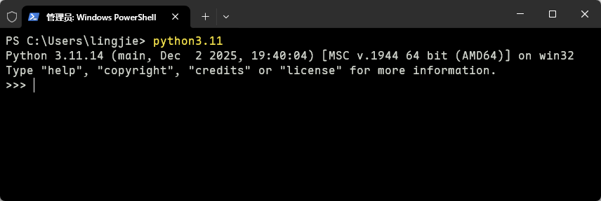 -->
    

    **图 7**：Python 的脚本交互界面

### Anaconda Python 解释器

如果读者使用 Python 的场景主要集中在科学计算、数据科学等领域，且不想花费大量的时间在配置运行环境之类的问题上，那么安装基于 Conda 体系的 Python 运行时实现无疑是一个更为合适的选择。下面，就让我们根据 Anaconda 官方网站提供的指导文档，来了解如何在不同操作系统平台上安装基于这一体系的 Python 运行时实现。

- 如果读者选择在 macOS 或 Windows 这样的图形化操作系统中以 GUI 的方式来安装 Anaconda Python 解释器及其运行环境，那么就需先找到并下载与自己所在设备的 CPU 架构与操作系统相匹配的二进制安装包（在 Windows 中通常是一个扩展名为`.exe`的文件，在 macOS 中则是扩展名为`.pkg`的文件），然后启动它的图形化向导来完成相关的安装操作。例如在 Windows 10/11 系统中，其安装步骤主要如下。

    1. 在使用网页浏览器中打开 Anaconda 官方网站的下载页面（如图 8 所示）之后，读者会在该页面中看到“Anaconda Distribution”与“Miniconda Distribution”两个选项，它们之间的区别在于前者除了 Python 解释器及其运行环境之外，还包含了 Anaconda 官方维护的绝大多数第三方扩展，而后者则只包含 Python 解释器及其运行环境。考虑到我们选择 Conda 体系的目的是节省配置运行时环境的时间，在这里应该下载的是“Anaconda Distribution”。

        <!--  -->
        

        **图 8**：Anaconda 的官方下载页面

    2. 待上述二进制安装包被成功下载到本地计算机上之后，用该安装包启动其图形化安装向导，其界面如图 9 所示。

        <!-- 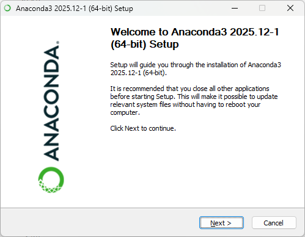 -->
        

        **图 9**：Anaconda 的图形化安装向导

    3. 根据图形化向导一路单击“Next”或“I Agree”按钮，直到出现如图 10 所示界面，这里需要读者选择 Anaconda 的安装路径，通常情况下，读者只需要保持该页面上所有的默认选项即可，当然，也可以选择单击“Browse”按钮，设置好自己想要安装路径。

        <!-- 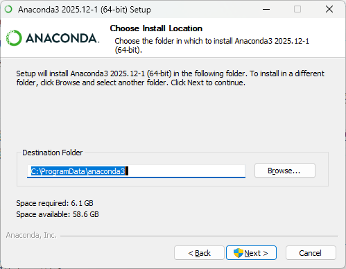 -->
        

        **图 10**：设置安装路径

    4. 在设置好安装路径之后，继续单击“Next”按钮，就会看到如图 11 所示界面，上面有四个可勾选的配置项，分别是“Create Shartouls（创建快捷方式）”、“Add Anaconda3 to my PATH environment variable（将 Anaconda3 添加到系统的 PATH 环境变量中）”、"Register Anaconda3 as the system Python 3.x（将 Anaconda3 注册为默认的 Python 3.x 版本）”，以及"Clear the packages cache upon completion（安装完成后清除缓存）"，读者可根据需要勾选这些选项，然后单击“Install”按钮正式开始执行 Anaconda Python 运行时环境的安装操作，读者只需等待安装向导中的进度条显示完成即可。

        <!-- 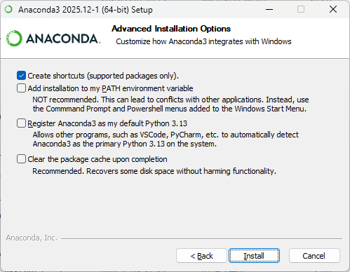 -->
        

        **图 11**：安装进度条

    5. 待上述安装过程完成之后，我们就会看安装结束界面，接下来只需单击“Next”按钮就可退出这个图形化安装向导，如图 12 所示。

        <!-- 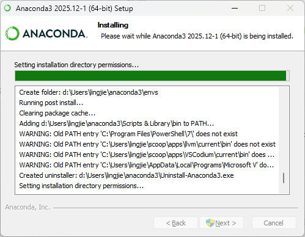 -->
        

        **图 12**：安装结束界面

- 如果读者选择在 Linux 这样的 Unix-like 操作系统中安装 Anaconda Python 解释器及其运行环境，那么就需先找到并下载与自己所在设备的 CPU 架构与操作系统相匹配的安装脚本文件（通常是一个扩展名为`.sh`的文件），然后启动它的图形化向导来完成相关的安装操作。例如在 CentOS 7 操作系统中，其安装步骤主要如下。

    1. 在 Bash、Zsh 这样的 Shell 应用中执行刚刚下载到的安装脚本，执行命令如下：

        ```bash
        # 此处的 <version> 用于指代 Anaconda 的版本号
        bash Anaconda3-<version>-Linux-x86_64.sh
        ```

    2. 在执行上述命令之后，就会看到一个字符界面的安装向导，读者可按以下提示执行安装操作：

        - ****阅读许可协议****：可按空格键翻页，并通过输入 yes 接受协议。
        - **选择安装路径**：默认路径为 `~/anaconda3`，推荐直接按回车键确认，保留默认设置（避免权限问题）。如需自定义路径，应输入绝对路径（如 `/opt/anaconda3`，但需管理员权限）。
        - **是否初始化 conda**：安装向导会询问 Do you wish the installer to initialize Anaconda3 by running conda init?，建议输入 yes。此步骤会自动将 conda 添加到 Shell 配置文件（如 `.bashrc` 或 `.zshrc`），避免手动配置环境变量。

    3. 待安装完成后，关闭当前终端并重新打开，或执行以下命令可使上述配置生效：

        ```bash
        source ~/.bashrc  # 若使用 zsh，替换为 source ~/.zshrc
        ```

- 最后，如果我们想验证 Python 运行时环境是否已经安装成功，就只需要在自己所在的操作系统中打开 Shell 终端环境，例如 Windows 系统下的 Powershell 或 Unix-like 系统下的 Bash、Zsh 等命令行终端程序，并在其中执行`conda --version`查看版本信息，或执行`python`命令打开脚本交互界面，查看其中显示的 Python 运行环境信息，如果信息如图 13 所示，这证明它已经成功安装到了我们的计算机上。

    <!-- 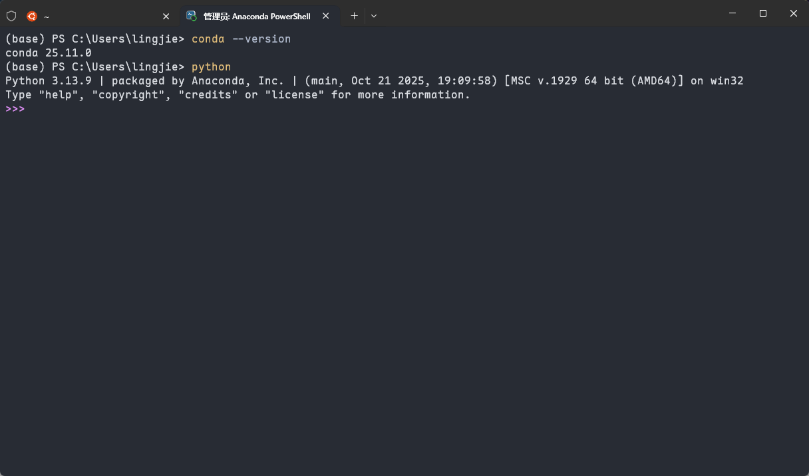 -->
    

    **图 13**： Anaconda 的脚本交互界面

在成功安装了 Python 解释器之后，我们接下来就可以根据自己要运行的项目/应用来配置 Python 的运行时环境了。然而，由于近些年 Python 在数据科学、人工智能等领域的爆炸式发展，如今市场上同时存在着多个版本的 Python 解释器，每个版本的解释器还存在着多种不同的实现，这让运行时环境的配置工作变得比十年前要复杂得多。

## 从虚拟环境开始创建项目

为了应对近年来由人工智能应用迅猛发展所带来的各种变化，Python 社区在运行时环境的配置方面逐渐确立起了一个极其重要的项目配置原则：“**任何非一次性的小脚本开发，都应当从创建虚拟环境开始**"。该原则是工程师们从长期工作实践中总结出来的经验，因为他们发现绝大多数新手在使用 Python 过程中所遇到的大部分头痛问题，都并非因为语言本身，而是来自对其运行时环境及其依赖管理机制的误解。具体来说就是：在现有条件下，如果我们直接在当前系统或用户权限下使用 Python 解释器来开发具体的项目，大概率就会遇到依赖管理方面的问题。

这是因为 Python 的第三方扩展默认是“全局可见”的，当我们在执行诸如`pip install numpy`这样的命令时，它所安装的扩展包会被放入当前 Python 解释器所对应的`site-packages`目录中。这意味着：

- 当前 Python 解释器所运行的所有 Python 项目都会“看到”这个包；
- 如果升级、降级或删除某个包，就会影响到当前 Python 解释器运行的**所有项目**。

在语言的初学阶段，这样做也许一时半会并不会带来明显的问题；但一旦进入到工程化的环境中，我们就会陆续遇到以下情形，风险也就随之暴露了出来：

- 昨天还能跑的项目，今天什么都没改却报错了。
- 因新项目升级了相关的依赖，导致旧项目无法运行；
- 不同的项目依赖同一扩展包的**不同版本**，导致冲突；
- 教程代码在你本地无法复现，但在作者环境中可以正常运行；

这些问题都是因为项目中的*依赖关系缺乏隔离*。那么为什么虚拟环境可以解决这个问题呢？事实上，虚拟环境（Virtual Environment）并不是某种“高级技巧”，它本质上就是在 **为每一个 Python 项目提供一套彼此独立、互不干扰的运行时环境** 。即在一个虚拟环境中：

- Python 解释器是“看似独立”的；
- 第三方扩展只对当前环境可见；
- 依赖版本可以被精确锁定；
- 项目可以被完整复现。

换言之，虚拟环境解决的并不是“如何安装更多库”的问题，而是如何让一个项目在时间、空间和他人机器上保持可控性。从工程角度看，这一点甚至比语法熟练程度更加重要。

在当前的 Python 生态中，虚拟环境的实现方式并不唯一，但它们的目标高度一致。下面，让我们来具体介绍几种基于虚拟环境来创建 Python 开发项目的常见解决方案。

### Python 官方解决方案

Python 官方在 3.3 及其之后的版本中引入了内置的虚拟环境管理工具，它允许我们先通过`venv`模块来创建虚拟环境，然后在该虚拟环境中使用 pip 管理项目依赖。该工具链在 Windows、macOS 以及各种 Linux 发行版上均可使用，用该工具创建项目的步骤如下。

1. 在 Bash、Zsh 这类的命令行终端中进入到目标项目所在的目录中（例如`examples/say_hello`目录），然后执行`python -m venv <虚拟环境目录>`命令创建一个新的虚拟环境，并使用`source <虚拟环境目录>/bin/activate`命令激活该虚拟环境，具体如图 14 所示。

    <!-- 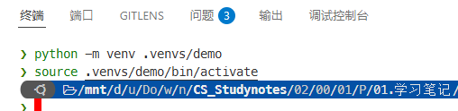 -->
    

    **图 14**：Python 官方虚拟环境创建与激活

    **请注意**：`<虚拟环境目录>`除了是虚拟环境存放运行时环境文件的目录之外，它的最底层目录名也是该虚拟环境的唯一标识符，读者可根据自己的需要自行设置。另外，如果读者使用的命令行终端是 Windows 系统下的 PowerShell 或 CMD，那么激活虚拟环境的命令就应改为`.\<虚拟环境目录>\Scripts\Activate.ps1`或`.\\<虚拟环境目录>\Scripts\activate.bat`。

2. 在成功创建并激活了虚拟环境之后，Shell 会优先使用虚拟环境中的 pip 可执行文件，因此此时执行的 pip 命令将仅作用于当前虚拟环境，而不会影响系统中的其他 Python 项目。接下来，我们就可以在虚拟环境中独立安装 Python 的第三方扩展了。例如，如果读者现在到`examples/say_hello`目录下执行`pip install numpy`命令，就可以在该项目的`<虚拟环境目录>`下的`lib/<python-version>/site-packages`子目录中看到新安装的 numpy 包了，如图 15 所示。

    <!-- 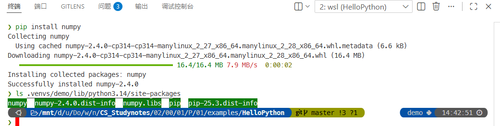 -->
    

    **图 15**：Python 官方虚拟环境中的第三方扩展

    **请注意**：`<python-version>`是 Python 解释器的版本号，例如`python3.11`、`python3.14`等。

关于具体如何使用 pip 来管理 Python 项目中的第三方扩展，我将会将在《[[具体项目实践]]》这篇笔记中做详细讲解，在这里就先暂且按下不表了。

### Anaconda 解决方案

在基于 Conda 体系的 Python 运行时实现中，基于虚拟环境来创建项目，并管理项目依赖的解决方案则要简单得多，基本上只靠 `conda` 命令就可以完成。而该工具同样在 Windows、macOS 以及各种 Linux 发行版上均可使用，用该工具创建项目的步骤如下。

1. 在命令行终端中进入到目标项目所在的目录中（例如`examples/say_hello`目录），然后执行`conda create -n <虚拟环境名称> python=<python-version>`命令创建一个新的虚拟环境，具体如图 16 所示。

    <!-- 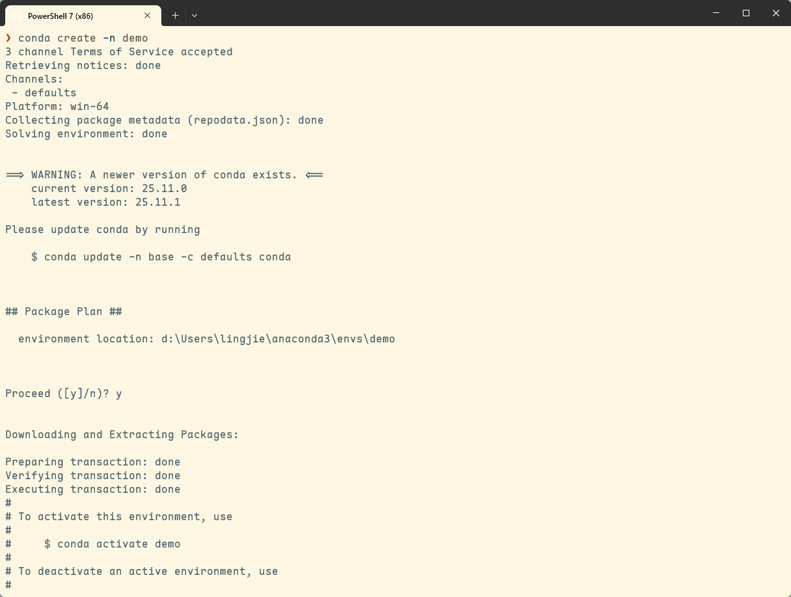 -->
    

    **图 16**：Anaconda 虚拟环境创建与激活

    **请注意**：`<虚拟环境名称>`是虚拟环境的唯一标识符，另外，`python=<python-version>`是可选参数，其中的`<python-version>`用于指定当前项目要使用的 Python 版本号，例如`python=3.11`、`python=3.14`等。

2. 在成功创建虚拟环境之后，我们接下来就可以使用`conda env list`命令来查看当前计算机中所有基于 Conda 体系的虚拟环境及其所在的目录，如图 17 所示。

    <!-- 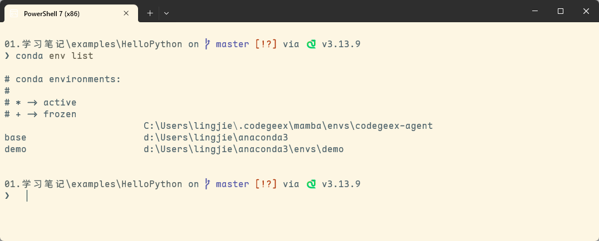 -->
    

    **图 17**：Anaconda 虚拟环境列表

    **请注意**：与 Python 官方解决方案不同的是，基于 Conda 体系的虚拟环境并不被保存在当前项目所在的目录中，而是被保存在 Anaconda 安装目录下的`envs`子目录中。当然，这也意味着同一个 Conda 虚拟环境通常会被多个项目复用，因此在具体的项目实践中需要格外注意环境命名与用途划分。

3. 我们接下来要做的就是使用`conda activate <虚拟环境名称>`命令来激活刚刚创建的虚拟环境，然后就可以使用`conda install <扩展包名称>`命令来安装 Python 的第三方扩展了。例如，通过执行`conda install numpy`命令来安装 numpy 扩展，如图 18 所示。

    <!-- 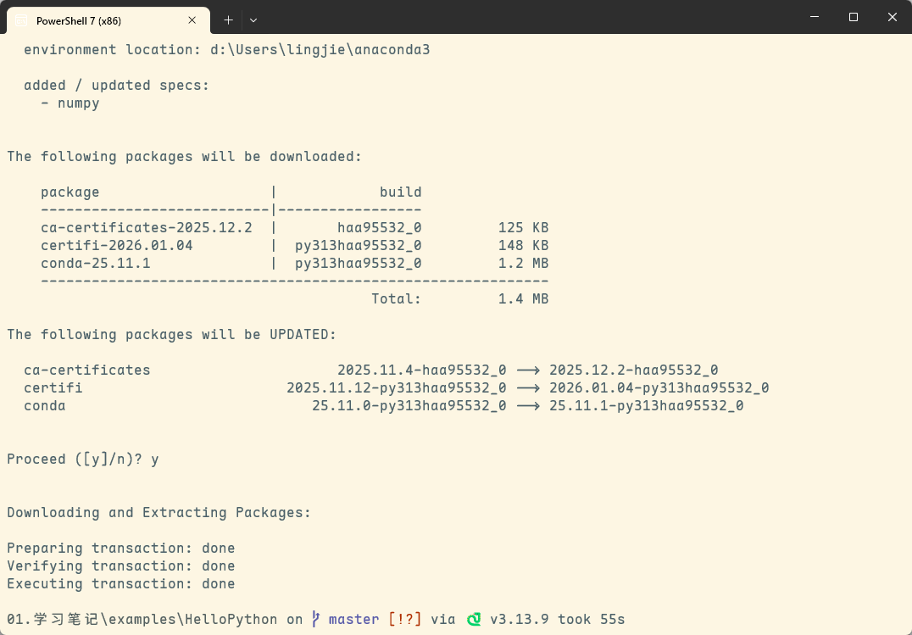 -->
    

    **图 18**：在 Anaconda 虚拟环境中安装第三方扩展

4. 如果上述命令执行顺利，我们就可以通过执行`conda list <扩展包名称>`命令来确认刚刚安装的扩展包是否已经成功安装到了虚拟环境中，如图 19 所示。

    <!-- 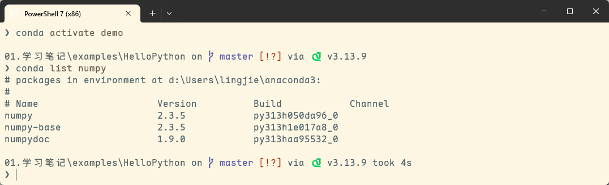 -->
    

    **图 19**：在 Anaconda 虚拟环境中查看第三方扩展

同样的，关于具体如何使用 Conda 来管理 Python 项目的第三方扩展及其依赖关系，我将会在《[[具体项目实践]]》这篇笔记中做详细讲解，在这里就先暂且按下不表了。

### 第三方解决方案

考虑到基于 Conda 体系的解决方案毕竟来自第三方实现，会导致 Python 的解释器在版本上会有些落后于官方，而 Python 官方提供的 pip 又缺乏管理复杂依赖关系的能力（例如它在移除项目的某一直接依赖时，无法自动移除其间接依赖）。近些年来，Python 社区为了解决此类问题又陆续发展出了基于 `uv` 、`poetry`等第三方工具来创建 Python 项目并管理项目依赖的解决方案。由于这些解决方案既可作用于官方的 Python 解释器，也可作用于 Conda 体系中的 Python 解释器，因此它们在项目实践中也变得越来越流行。下面，我就以 `uv` 这款工具为例，来介绍一下如何使用这类工具创建 Python 项目。

1. 如果读者现在还没有安装 `uv`，可先通过在命令行终端中执行`pip install uv`命令来安装这款工具，然后再使用`uv --version`命令来查看其版本信息，如果信息如图 20 所示，这证明它已经成功安装到了我们的计算机上。

    <!--  -->
    

    **图 20**：uv 的安装与确认

2. 在成功安装了 `uv` 工具之后，我们就可以使用该工具来创建 Python 项目了。例如，如果读者现在到`examples/say_hello`目录下执行`uv init`命令，就会看到该目录被初始化成了一个标准的 Python 项目，我们可以使用`ls`命令来查看一下这个项目的目录结构，如图 21 所示。

    <!-- 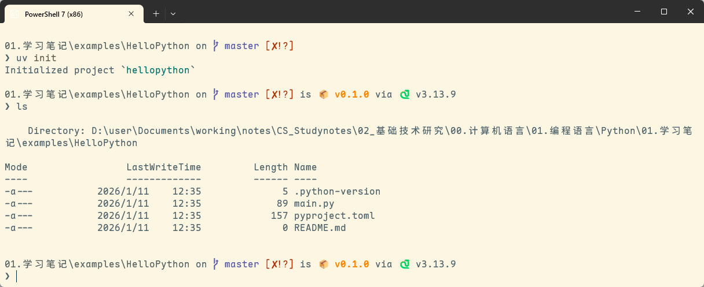 -->
    

    **图 21**：使用 uv 初始化的 Python 项目

    正如读者所见，`uv` 这款工具会为该项目创建以下一系列文件：

    - `pyproject.toml`：该文件用于保存 Python 项目的基本配置；
    - `README.md`：该文件用于保存 Python 项目的说明性信息；
    - `main.py`：该文件用于保存 Python 项目的入口代码。
    - `.python-version`：该文件用于保存 Python 项目的 Python 解释器版本号。

3. 在成功完成 Python 项目的初始化工作之后，我们接下来就可以使用`uv add <扩展包名称>`命令来安装 Python 的第三方扩展了。例如，通过执行`uv add numpy`命令来安装 numpy 扩展，如图 22 所示。

    <!-- 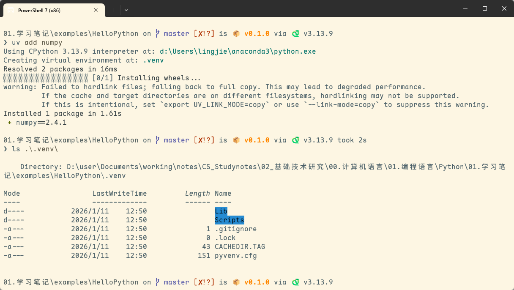 -->
    

    **图 22**：使用 uv 安装项目的第三方扩展

    正如读者所见，`uv` 这款工具会在第一次为项目安装扩展时自动为其创建虚拟环境，并将其依赖关系写入到`pyproject.toml`文件中，以便日后自动处理项目中的依赖关系。

4. 如果上述命令执行顺利，我们就可以通过执行`uv pip list`命令来确认刚刚安装的扩展包是否已经成功安装到了虚拟环境中，如图 23 所示。

    <!-- 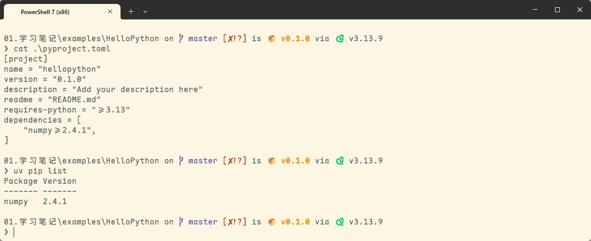 -->
    

    **图 23**：使用 uv 查看项目的第三方扩展

当然了，`uv` 除了可以管理项目中的第三方扩展及其依赖关系之外，甚至还可以为项目指定要使用的 Python 解释器版本号，关于这些高级功能的详细使用方法，我将会在《[[具体项目实践]]》这篇笔记中做详细讲解，读者在这里暂时只需要知道 `uv` 这款工具的基本使用方法即可。

## 选择合适的编程工具链

从理论的角度上来说，要想编写一个基于 Python 语言及其运行时环境的应用程序，通常只需要使用任意一款纯文本编辑器就可以了。但在具体的项目实践中，为了在工作过程中获得代码的语法高亮与智能补全等功能以提高编码体验，并能方便地使用各种强大的程序调试工具和版本控制工具，我们通常还是会选择使用一款专用的代码编辑器或集成开发环境来完成项目开发。在这里，我个人会倾向于推荐读者使用 Visual Studio Code 编辑器（以下简称 VS Code）来构建所有的项目。读者可以参考下面这篇笔记来学习这款编辑器的安装方法，以及如何将其打造成一款用于编写 Python 应用程序的集成开发环境。

> 关联笔记：[[VS Code 配置笔记]]：[博客园链接](https://www.cnblogs.com/owlman/p/17537015.html)

除此之外，Atom 与 Sublime Text 这两款编辑器也与 VS Code 编辑器有着类似的插件生态系统和使用方式，如果读者喜欢的话，也可以使用它们来打造属于自己的项目开发工具，方法是大同小异的。而除了上述专用的代码编辑器之外，如果读者更习惯使用传统的集成开发环境（IDE），JetBrains 公司旗下的 PyCharm 无疑会是一个不错的选择，它在 Windows、macOS 以及各种 Linux 发行版上均可做到所有的功能都是开箱即用，无需进行多余的配置，这对初学者是相对比较友好的。当然了，令人比较遗憾的是，PyCharm 的专业版本并非是一款免费的软件，而免费的社区版在功能上则多多少少会受到一些限制。如果考虑到程序员们在实际生产环境中各种可能的需要及其带来的相关开销等因素，我个人还是会倾向于建议大家尽可能地选择开源软件，这个系列的笔记接下来也将会以 VS Code 编辑器为主要编程工具来展开后续的各种实例演示。

## 学习成果验收：Hello World

现在，为了验证我们已经成功配置好了使用 Python 语言的编程工具，接下来就需要尝试着使用这些工具来编写一个 Python 版本的 Hello World 程序，看看它能否在我们所在的计算机设备上成功运行起来。编写该程序的具体步骤如下。

1. 使用 VS Code 编辑器打开之前创建的`examples/say_hello`目录，并在其集成终端中使用`uv init`命令将其初始化为一个 Python 项目。

2. 在编辑器中打开项目的入口文件`main.py`，然后将其中的代码修改如下：

    ```python
    #! /usr/bin/env python
    '''
        Simple example to say hello
        
        Author: lingjie
        Created on: 2024-06-15
        '''

    author_name = "owlman"    
    def say_hello(name: str) -> None:
        '''
            Say hello by name.
        
            Args:
                name: name to greet
        '''
        print("Hello World! My name is", name)

    if __name__ == "__main__":
        say_hello(author_name)
    ```

    在这里，读者暂时不必理会这段代码中使用的具体语法，只需要知道它会在程序运行时输出一条包含用户 ID（即`author_name`变量的值）的问候语即可。稍后，我们将会在《[[基础语法学习]]》这篇笔记中详细讲解 Python 语言的语法规则。

3. 在保存上述文件之后，回到编辑器的集成终端环境中并执行`python main.py`命令，如果终端中输出了如图 24 所示的信息，就说明我们已经成功配置好了使用 Python 语言的编程工具。

    <!-- 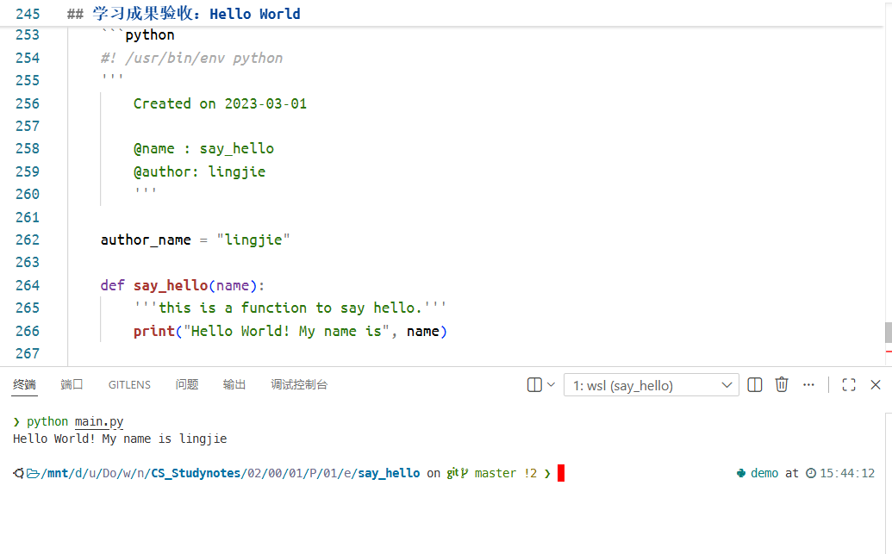 -->
    

    **图 24**：学习成果验收

## 小结

在本篇笔记中，我首先介绍了如何安装 Python 解释器，并使用它来创建 Python 项目，然后又介绍了如何使用 Conda 来管理 Python 项目的第三方扩展及其依赖关系，最后又介绍了如何选择合适的编程工具链。在完成上述配置之后，我们就可以使用这些工具来编写 Python 程序了。
