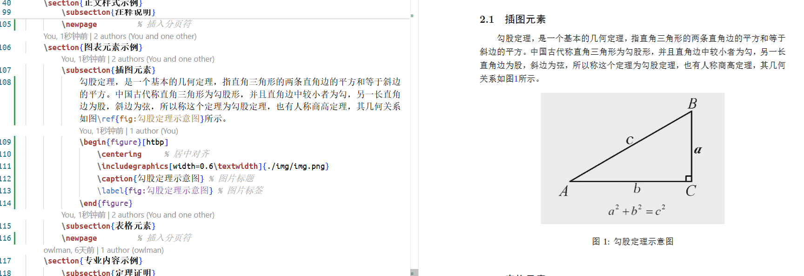
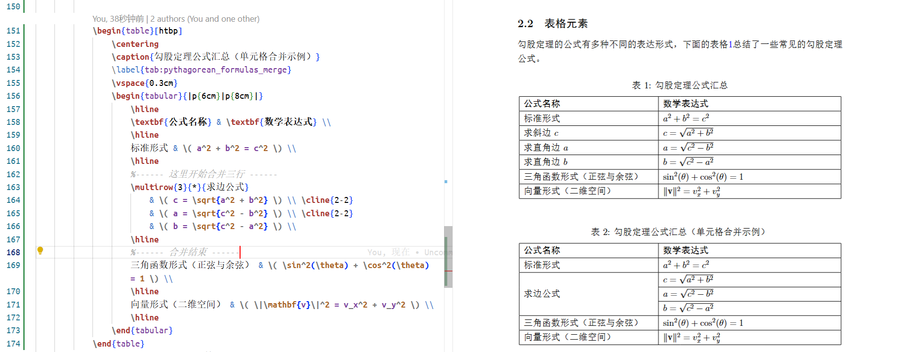
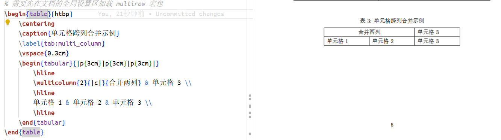
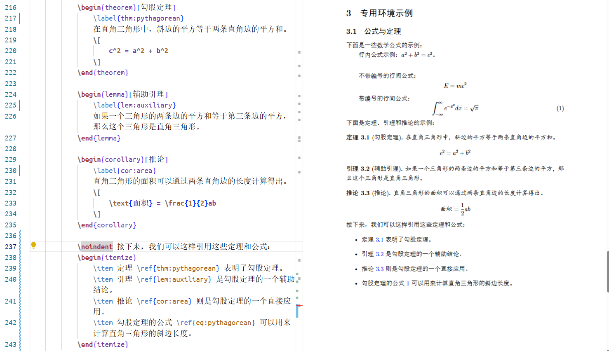
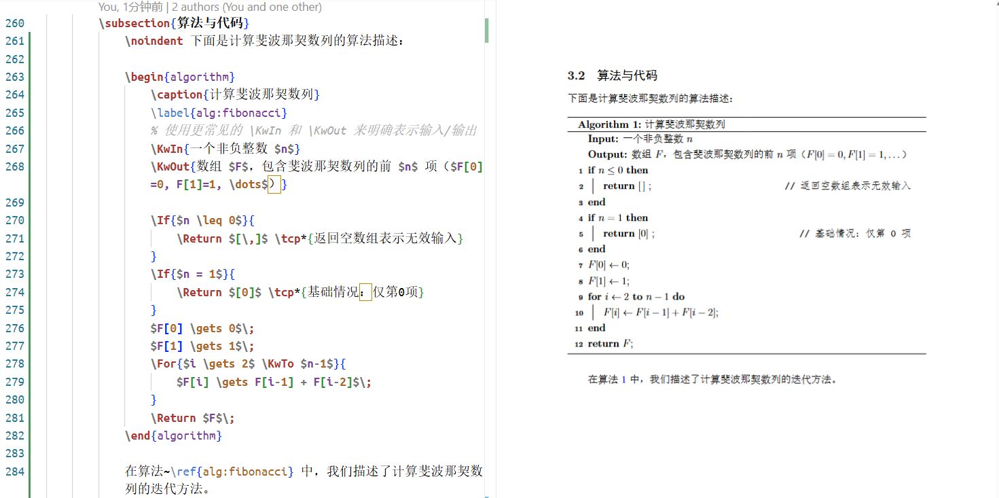
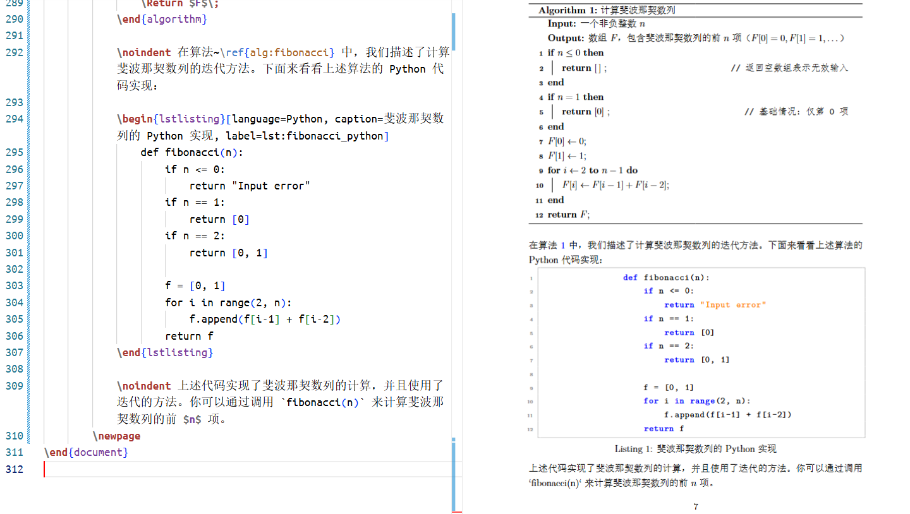

## 引言

在实际应用中，如果我们仅仅需要完成的是《[[LaTeX学习笔记：文档排版基础]]》中所介绍的那些纯文本排版工作，其实并不一定需要用到 $\LaTeX$ 这样复杂的排版系统。毕竟，$\LaTeX$ 的核心优势主要在于其对数学公式、图表、参考文献等复杂文档元素所提供的高质量与高度一致性的支持。因此，当目标是撰写结构严谨、内容复杂的学术文档时，$\LaTeX$ 往往是最稳健，最专业的选择。

在本篇笔记中，我们将沿用之前的示例文稿（即《$\LaTeX$ 排版示例》）继续为读者演示如何使用 $\LaTeX$ 对这些复杂元素进行排版，以帮助读者系统掌握撰写完整学术文档所需的主要技能。

## 图表元素排版

作为以科普宣传、学术研究为目的的专业文档来说，插图与表格都是不可或缺的元素。它们有助于更为直观地展示数据、分析函数、解释概念等，从而帮助读者更好地理解文档内容。在 $\LaTeX$ 排版系统中，插入这些元素通常都需要加载相应的宏包，并按照特定的语法规则执行这些宏包提供的命令。下面，我们从最简单的插图元素开始介绍吧。

### 插入图片

在撰写学术文档时，我们会经常需要在正文中插入一些图片元素，以便用更直观的形式说明学术理论，并提供相关的数据证明。在 $\LaTeX$ 中，图片元素会通常被视为一种称为“浮动体（float）”的文档元素，因此在执行插入图片的操作时，我们首先需要定义 一个浮动体环境，然后在其中使用由`graphicx`宏包提供的`\includegraphics`命令插入图片元素，具体语法如下所示：

```tex
\begin{浮动体环境名}[环境参数]
    \centering
    \includegraphics[图片参数]{图片文件的路径}
    \label{fig:插图标签}
    \caption{插图标题}
\end{浮动体环境名}
```

下面，让我们来详细介绍一下上述语法中的一些关键元素：

- `浮动体环境名`：在 $\LaTeX$ 中，常用于插图元素的环境主要有`figure`、`wrapfig`两种。其中，`figure`是 $\LaTeX$ 的标准浮动体环境，可直接使用，而`wrapfig`则是一种可以“环绕”文本的浮动体环境，需要预先加载`wrapfig`宏包才能使用。

- `环境参数`：用于设置插图元素在文档中的排版方式，具体可设置的值主要如下：
  - `[h]`：建议将插图元素放在当前位置。
  - `[t]`：建议将插图元素放在页面顶部。
  - `[b]`：建议将插图元素放在页面底部。
  - `[p]`：建议将插图元素单独成页放置。
  - `[H]`：将插图元素强制放在当前位置，该参数值需预先加载`float`宏包才能使用。
  - `[T]`：将插图元素强制放在页面顶部，该参数值需预先加载`floatrow`宏包才能使用。
  - `[B]`：将插图元素强制放在页面底部，该参数值需预先加载`floatrow`宏包才能使用。
  - `[P]`：将插图元素强制放在单独成页，该参数值需预先加载`floatrow`宏包才能使用。

- `图片参数`：用于设置插图元素的显示效果，具体可设置的值主要如下：
  - `width`：设置插图的宽度，可以设置为相对值（例如`0.6\textwidth`，`\textwidth`代表的是当前文本区域的宽度）或绝对值（例如`3cm`）。
  - `height`：设置插图的高度，可以设置为相对值（例如`0.6\textheight`，`\textheight`代表的是当前文本区域的高度）或绝对值（例如`3cm`）。
  - `scale`：设置插图的缩放比例，可以设置为相对值（例如`0.6`）或绝对值（例如`3`）。
  - `angle`：设置插图的旋转角度，可以设置为相对值（例如`90`）或绝对值（例如`3`）。
  - `keepaspectratio`：设置图片是否保持原始比例。
  - `clip`：设置图片是否裁剪，例如`clip=true`表示图片将自动裁剪以适应指定的尺寸。

- `图片文件的路径`：用于指定插图所在的文件路径，可以设置为相对路径（例如`./img/img.png`）或绝对路径（例如`/home/user/img/img.png`）。
- `插图标签`：用于为插图元素添加标签，它会自动为插图元素进行编号，以便在文档中引用。
- `插图标题`：用于为插图元素添加标题文本，通常会连同编号一起显示在插图元素的下方。

下面来做些实例演示。在之前的《$\LaTeX$ 排版示例》文稿中，如果我们想在“插图元素”这个二级标题下面分别添加一段与勾股定理相关的介绍和一张相应的示意图，就可以像下面这样写：

```tex
% 省略之前的文档结构定义部分
\usepackage{graphicx} % 用于插入图片
% 开始组织文档内容
\begin{document}
    % 省略之前的章节
    \section{图表元素示例}
        \subsection{插图元素}
            勾股定理，是一个基本的几何定理，指直角三角形的两条直角边的平方和等于斜边的平方。中国古代称直角三角形为勾股形，并且直角边中较小者为勾，另一长直角边为股，斜边为弦，所以称这个定理为勾股定理，也有人称商高定理，其几何关系如图\ref{fig:勾股定理示意图}所示。
            \begin{figure}[htbp]
                \centering
                \includegraphics[width=0.6\textwidth]{./img/img.png}
                \caption{勾股定理示意图}
                \label{fig:勾股定理示意图}
            \end{figure}
    % 省略之后的章节
\end{document}
```

在上述示例中，我们首先使用了名为`figure`的环境定义了一个浮动体， `[htbp]`参数表示我们建议 $\LaTeX$ 依次尝试将浮动体放在当前位置（`h`）、页面顶部（`t`）、页面底部（`b`）或单独成页（`p`）。换言之，该浮动体的实际位置是由 $\LaTeX$ 自动决定的，并非是严格指定。

然后在该浮动体的内部，我们除了使用`\includegraphics`命令指定要插入的图片之外，还分别使用`\label{}`命令为浮动体添加标签（以便能在文档中使用`\ref`命令对其进行引用），`\caption{}`命令为浮动体添加了标题，使用`\centering`命令将浮动体居中显示（如果想要将其设置为左对齐或右对齐，可以使用`\raggedleft`或`\raggedright`命令）。现在，如果我们再次编译这个文档，就可以看到“插图元素”这个二级标题下面已经出现了这个勾股定理的示意图，如图 1 所示：



**图 1**：在文档中插入图片

当然，如果我们只是想这样在文章中简单地插入一张图片，使用 Markdown 这样的轻量级工具就可以做得很好了，并不需要动用到 $\LaTeX$，后者更多时候是用于实现一些复杂的图文排版的。例如，如果我们想将图 1 中的文字与图片改为并排显示，就可以像下面这样写：

```tex
% 省略之前的文档结构定义部分
\usepackage{graphicx} % 用于插入图片
% 开始组织文档内容
   \begin{document}
    % 省略之前的章节
    \section{图表元素示例}
        \subsection{插图元素}
            \begin{figure}[htbp]
                \centering
                \begin{minipage}[c]{0.6\linewidth}
                    \raggedright
                    勾股定理，是一个基本的几何定理，指直角三角形的两条直角边的平方和等于斜边的平方。中国古代称直角三角形为勾股形，并且直角边中较小者为勾，另一长直角边为股，斜边为弦，所以称这个定理为勾股定理，也有人称商高定理，其几何关系如图\ref{fig:勾股定理示意图}所示。
                \end{minipage}
                \hfill
                \begin{minipage}[c]{0.35\linewidth}
                    \includegraphics[width=\linewidth]{./img/img.png}
                    \caption{勾股定理示意图}
                \end{minipage}
                \label{fig:勾股定理示意图}
            \end{figure}
    % 省略之后的章节
\end{document}
```

在上述示例中，我将原本位于图片之前的说明文字放到了`figure`环境的定义中，并用两个名为`minipage`的环境将图片与文字分割成左右两个部分。在 $\LaTeX$ 中，`figure`环境会被视为一个独立的行单位，而`minipage`环境则被视为一个小盒子或格子，将这独立的行分割成不同的列，具体到这里，我们用`minipage`环境将浮动体分割成了左右两列，左边的那列用于放置文字，右边则用于放置插图，他们都被设置了两个参数，第一个参数设置的是其将采用的垂直对齐方式，它可设置的值包括`t`（顶部对齐）、`c`（中线对齐）、`b`（底部对齐）；第二个参数设置的是其宽度，左右两列分别为`0.6\linewidth`和`0.35\linewidth`（在这里，`\linewidth`表示当前环境的行宽，即浮动体的宽度）。在左右两个`minipage`环境之间，我还使用了`\hfill`命令插入了一个可伸缩的空白，这样左右两个`minipage`环境就可以尽可能对称地排列在浮动体的左右两端，如图 2 所示：


**图 2**：在文档1中插入并排显示的图片

另外，需要特别提醒的是，虽然我们在这里将`\caption{勾股定理示意图}`放在了右边图片所在的列中，但它依然是`figure`环境所定义浮动体的标题，换而言之，这个浮动体是一个整体，当我们使用`\ref{fig:勾股定理示意图}`命令引用“图 1”时，它指的是整个浮动体，而不是这个浮动体右侧的图片元素。这多少有点违背我们的设计语义。如果读者想更为精确地表达排版的设计意图，我们更推荐使用`wrapfig`宏包定义的`wrapfigure`环境来实现文字环绕的排版效果，例如像下面这样：

```tex
% 省略之前的文档结构定义部分
\usepackage{graphicx} % 用于插入图片
\usepackage{wrapfig} % 用于实现文字环绕
% 开始组织文档内容
\begin{document}
    % 省略之前的章节
    \section{图表元素示例}
        \subsection{插图元素}
            \begin{wrapfigure}{r}{0.4\textwidth}
                \vspace{-14pt} % 调整图片与上方文本的间距
                \centering
                \includegraphics[width=\linewidth]{./img/img.png}
                \caption{勾股定理示意图}
                \label{fig:勾股定理示意图}
            \end{wrapfigure}
            \noindent
            勾股定理，是一个基本的几何定理，指直角三角形的两条直角边的平方和等于斜边的平方。中国古代称直角三角形为勾股形，并且直角边中较小者为勾，另一长直角边为股，斜边为弦，所以称这个定理为勾股定理，也有人称商高定理，其几何关系如图\ref{fig:勾股定理示意图}所示。

            在这里，我们使用了 wrapfig 宏包提供的 wrapfigure 环境，该环境会自动将图片元素放置在右侧，并让文字环绕在图片的左侧。
    % 省略之后的章节
\end{document}
```

在上述示例中，我们首先在文档的全局设置区使用`\usepackage`命令加载了`wrapfig`宏包，然后在“插图元素”这个二级标题下面使用`wrapfigure`环境定义了一个浮动体，并为其设置了两个参数，第一个参数设置的是浮动体的水平对齐方式，这里设置的`r`表示的是向右浮动，如果想让它向左浮动就需将其设置为`l`；第二个参数设置的是浮动体的宽度，这里设置的是`0.4\textwidth`（`\textwidth`表示当前文本区域的宽度，这里指的是浮动体宽度为当前文本区宽度的 40%）。在`wrapfigure`环境中，我们同样可以使用`\includegraphics`命令来插入图片元素，并为其添加了标题和标签。

现在，如果我们再次编译这个文档，就可以看到“插图元素”这个二级标题下面已经出现了这个勾股定理的示意图，如图 3 所示：


**图 3**：由`wrapfigure`环境定义的文字环绕效果

当然，这里介绍的`wrapfigure`环境并不是我们设置文本环绕效果的唯一选择（况且该环境还存在着诸如不能跨页、不能与表格元素混排等问题），我们还可以使用`floatrow`宏包提供的`figure*`环境来实现类似的效果，如有需要，读者可自行参考相关资料，我们在这里就不赘述了。

### 绘制表格

除了插图元素之外，表格也是学术文档中经常会出现的元素。我们经常使用它来罗列一些统计性的、汇总性的数据，以便对要说明的学术理论进行进一步的论证。在 $\LaTeX$ 中，表格元素有很多种不同的排版方式，最简单的方式是先通过`table`环境定义一个浮动体，用于设置标题和引用标签，然后在该浮动体中通过定义名为`tabular`或`array`的环境来设置表格本身。从习惯上来说，`tabular`环境主要适用于以文本内容为主的表格，而`array`环境则主要适用于以数字内容为主的表格，但这不是绝对的。现在，让我们来看看这两种环境的基本定义语法：

```tex
\begin{table}[htbp]
    \centering
    \caption{表格标题}
    \label{tab:表格标签}
    \begin{tabular}[垂直对齐方式]{列格式说明}
        \hline                     % 用于设置表格行间线
        列1 & 列2 & 列3 \\         % 各列之间用 & 符号分隔
        \hline
        内容1 & 内容2 & 内容3 \\   % 各行之间用 \\ 符号分隔
        \hline
    \end{tabular}
\end{table}

\begin{table}[htbp]
    \centering
    \caption{表格标题}
    \label{tab:表格标签}
    \begin{array}[垂直对齐方式]{列格式说明}
        \hline
        列1 & 列2 & 列3 \\
        \hline
        内容1 & 内容2 & 内容3 \\
        \hline
    \end{array}
\end{table}
```

下面来详细介绍一下上述表格定义语法中的一些关键元素：

- **表格标题**：默认情况下会出现在表格本体的上方，内容为当前表格的编号加上我们在此处设置的文本，如果希望标题出现在下方，可以在文档的全局设置区使用`\captionsetup[table]{position=bottom}`命令进行设置；
- **表格标签**：用于设置当前表格的引用标签，以便在文档的正文中使用`\ref{tab:表格标签}`命令来引用它；
- **垂直对齐方式**：用于设置表格中各行的垂直对齐方式，可设置的值包括`t`（顶部对齐）、`c`（中线对齐）、`b`（底部对齐）；
- **列格式说明**：用于设置表格中各列的对齐方式，可设置的值包括`l`（左对齐）、`c`（居中对齐）、`r`（右对齐）、`p{列宽}`（左对齐，并设置列宽）、`m{列宽}`（居中对齐，并设置列宽）、`b{列宽}`（右对齐，并设置列宽）。其中，在使用`m{列宽}`或`b{列宽}`之前，需要先在文档的全局设置区加载`array`宏包。另外，如果参数之间使用`|`符号分隔，则表示该列需要添加竖线，如果参数之间使用`@{内容}`符号分隔，则表示在该列中插入指定的内容，例如`@{\hspace{1cm}}`表示在该列中插入一个宽度为 1cm 的空白。

下面继续以之前的《$\LaTeX$ 排版示例》文稿为例来做个演示，我们可以在其“表格元素”这个二级标题下面以表格的形式列出勾股定理的所有公式，具体代码如下：

```tex
% 省略之前的文档结构定义部分
\usepackage{amsmath} % 用于插入数学公式
% 开始组织文档内容
\begin{document}
    % 省略之前的章节
    \section{图表元素示例}
        % 省略之前的插图元素
        \subsection{表格元素}
            \noindent
            勾股定理的公式有多种不同的表达形式，下面的表格\ref{tab:pythagorean_formulas}总结了一些常见的勾股定理公式。
            \begin{table}[htbp]
                \centering  % 表格居中
                \caption{勾股定理公式汇总} % 表格标题
                \label{tab:pythagorean_formulas} % 表格标签
                \vspace{0.3cm} % 设置表格与标题之间的间距
                \begin{tabular}{|p{6cm}|p{8cm}|} % 定义两列，均为左对齐，并设置列宽
                    \hline   % 表格行间线
                    \textbf{公式名称} & \textbf{数学表达式} \\
                    \hline   % 表格行间线
                    标准形式 & \( a^2 + b^2 = c^2 \) \\
                    \hline   % 表格行间线
                    求斜边 \(c\) & \( c = \sqrt{a^2 + b^2} \) \\
                    \hline  % 表格行间线
                    求直角边 \(a\) & \( a = \sqrt{c^2 - b^2} \) \\
                    \hline  % 表格行间线
                    求直角边 \(b\) & \( b = \sqrt{c^2 - a^2} \) \\
                    \hline  % 表格行间线
                    三角函数形式（正弦与余弦） & \( \sin^2(\theta) + \cos^2(\theta) = 1 \) \\
                    \hline  % 表格行间线
                    向量形式（二维空间） & \( \|\mathbf{v}\|^2 = v_x^2 + v_y^2 \) \\
                    \hline  % 表格行间线   
                \end{tabular}
            \end{table}
        \newpage
    % 省略之后的章节
\end{document}
```

在上述示例中，我们之所以选择`tabular`环境来定义表格本体，是因为这是一个由文本与数学公式混合而成的表格，而`array`环境只支持纯数字或数学公式的内容。现在，如果我们再次编译这个文档，就可以看到“表格元素”这个二级标题下面已经出现了这个勾股定理公式汇总的表格，如图 4 所示：


**图 4**：由`tabular`环境定义的表格元素

同样的，如果我们只是需要在文档中插入上面这样一张简单的表格，也大可不必用到 $\LaTeX$ 这样复杂的工具，直接使用 Markdown 这样轻量级的标记工具即可。$\LaTeX$ 真正的优势在于它能够排版出一些比较复杂的表格，譬如实现单元格的跨列或跨行合并等效果，这些在 Markdown 中就无法做到了。举个例子，如果我们想在图 4 所示表格中将“公式名称”这一列下面的“求斜边 $c$”、“求直角边 $a$”以及“求直角边 $b$”这三个单元格进行跨行合并，就可以使用`multirow`宏包提供的`\multirow`命令来实现，具体代码如下：

```tex
% 省略之前的文档结构定义部分
\usepackage{amsmath}   % 用于插入数学公式
\usepackage{multirow}  % 用于合并单元格
% 开始组织文档内容
\begin{document}
    % 省略之前的章节
    \section{图表元素示例}
        % 省略之前的插图元素
        \subsection{表格元素}
            % 省略之前的表格示例
            \begin{table}[htbp]
                \centering
                \caption{勾股定理公式汇总（单元格合并示例）}
                \label{tab:pythagorean_formulas_merge}
                \vspace{0.3cm}
                \begin{tabular}{|p{6cm}|p{8cm}|}
                    \hline
                    \textbf{公式名称} & \textbf{数学表达式} \\
                    \hline
                    标准形式 & \( a^2 + b^2 = c^2 \) \\
                    \hline
                    %------ 这里开始合并三行 ------
                    \multirow{3}{*}{求边公式} 
                        & \( c = \sqrt{a^2 + b^2} \) \\ \cline{2-2}
                        & \( a = \sqrt{c^2 - b^2} \) \\ \cline{2-2}
                        & \( b = \sqrt{c^2 - a^2} \) \\ 
                    \hline
                    %------ 合并结束 ------
                    三角函数形式（正弦与余弦） & \( \sin^2(\theta) + \cos^2(\theta) = 1 \) \\ 
                    \hline
                    向量形式（二维空间） & \( \|\mathbf{v}\|^2 = v_x^2 + v_y^2 \) \\
                    \hline
                \end{tabular}
            \end{table}
        \newpage
    % 省略之后的章节
\end{document}
```

上述示例中的表格定义大部分与之前相同，只是将原本“求斜边 $c$”、“求直角边 $a$”以及“求直角边 $b$”这三个单元格换成了一条`\multirow{行数}{列宽}{内容}`命令，其中，`行数`表示要合并的行数，`列宽`表示合并单元格的宽度，`内容`表示合并单元格中的内容。例如在这里，我们使用`\multirow{3}{*}{求边公式}`命令将原表格第一列下的第 3 到 5 行合并为一个单元格，并将该单元格的宽度设置为自动调整（即`*`）。而对于原表格第二列下未被合并的单元格，我们只需要在`\multirow`命令后面通过添加`&`符号来继续原样补齐即可。另外，`\cline{2-2}`命令用于在合并单元格的下方绘制一条横线，以示该单元格跨越了多行。

现在，如果我们再次编译这个文档，就可以看到“表格元素”这个二级标题下面已经出现了这个勾股定理公式汇总的表格，如图 5 所示：



**图 5**：跨行合并单元格的表格示例

当然，我们在这里只演示了如何使用`\multirow`命令来实现单元格的跨行合并，它也可以用于整个表格行的合并，另外，$\LaTeX$ 还提供了`\multicolumn`命令用于实现跨列合并，它的使用方法与`\multirow`命令大致相同，只是要设置的参数略有所不同，下面是一个简单的示例：

```tex
% 需要先在文档的全局设置区加载 multirow 宏包
\begin{table}[htbp]
    \centering
    \begin{tabular}{|p{3cm}|p{3cm}|p{3cm}|}
        \hline
        \multicolumn{2}{|c|}{合并两列} & 单元格 3 \\
        \hline
        单元格 1 & 单元格 2 & 单元格 3 \\
        \hline
    \end{tabular}
\end{table}
```

上述代码在我们示例文档中的编译效果如图 6 所示：



**图 6**：跨列合并单元格的表格示例

除了`tabular`环境之外，$\LaTeX$ 还提供了`longtable`、`tabularx`、`ctable`等环境用于定义更复杂的表格。关于这些环境的具体使用，读者也可以参考 $\LaTeX$ 的官方文档，我们在这里同样不再赘述。

## 专用环境排版

除了图表元素之外，学术文档中经常还会包含一些需要进行特殊处理的元素，譬如需自动编号的定理和公式，需高亮显示的算法描述与实现代码等。这些元素在 $\LaTeX$ 中都是通过定义专业的环境来进行排版的，在这一节中，我们就来专门介绍一下这些环境的使用方法。

### 公式与定理

在专业文档中，我们常常会需要使用“定理–引理–推论”结构搭配公式来进行相关的学术论述，这就需要对随时需要指涉到的定理、推论等进行自动编号，以便在文档中引用。在 $\LaTeX$ 中，我们通常通过加载`amsthm`宏包来获得用于书写定理类结构的功能。该宏包提供了预定义的`proof`环境，并允许我们使用`\newtheorem`命令定义诸如`theorem`、`lemma`、`corollary`等定理环境，以实现定理、引理、推论等的自动编号与引用。

另外，和我们之前在《[[LaTeX学习笔记：数学公式编辑]]》这篇笔记中所介绍的一样，在文档中插入数学公式主要有行内公式和行间公式两种方式。但与在 Markdown 中插入数学公式略有不同的是，在 $\LaTeX$ 的源文档中插入数学公式时，我们首先要明确地在文档的全局设置区加载`amsmath`宏包，然后再根据以下语法规则来插入数学公式：

- 行内公式：主要用于在正文中编写简易的数学运算式，可使用`$…$`的形式来进行编辑。

    ```tex
    行内公式示例：$a^2 + b^2 = c^2$。
    ```

- 行间公式：主要用于在文档中用独立的行展示重要的数学公式，它可以有带编号（`\begin{equation}…\end{equation}`）和不带编号（`\[… \]`）两种编辑形式。

    ```tex
    不带编号的行间公式：
    \[
        E = mc^2
    \]

    带编号的行间公式：
    \begin{equation}
        \int_{-\infty}^{\infty} e^{-x^2} dx = \sqrt{\pi}
    \end{equation}
    ```

下面继续以之前的《$\LaTeX$ 排版示例》文稿为例来做个演示，我们可以在其"公式与定理"这个二级标题下面插入一组以勾股定理为中心的定理、引理、证明来进行论述，具体代码如下：

```tex
% 省略之前的文档结构定义部分
\usepackage{amsmath}   % 用于插入数学公式
\usepackage{amsthm}    % 用于插入定理

% 定义定理环境，按章节编号
\newtheorem{theorem}{定理}[section] % 定义定理环境，按章节编号
\newtheorem{lemma}[theorem]{引理}    % 定义引理环境，与定理共享编号
\newtheorem{corollary}[theorem]{推论} % 定义推论环境，与定理共享编号

% 开始组织文档内容
\begin{document}
    % 省略之前的章节
    \section{专用环境示例}
        \subsection{公式与定理}
            % 省略之前的数学公式示例
            \noindent 下面是定理、引理和推论的示例：

            \begin{theorem}[勾股定理]
                \label{thm:pythagorean}
                在直角三角形中，斜边的平方等于两条直角边的平方和。
                \[
                    c^2 = a^2 + b^2
                \]
            \end{theorem}

            \begin{lemma}[辅助引理]
                \label{lem:auxiliary}
                如果一个三角形的两条边的平方和等于第三条边的平方，那么这个三角形是直角三角形。
            \end{lemma}

            \begin{corollary}[推论]
                \label{cor:area}
                直角三角形的面积可以通过两条直角边的长度计算得出。
                \[
                    \text{面积} = \frac{1}{2}ab
                \]
            \end{corollary}

            接下来，我们可以这样引用这些定理和公式：
            \begin{itemize}
                \item 定理 \ref{thm:pythagorean} 表明了勾股定理。
                \item 引理 \ref{lem:auxiliary} 是勾股定理的一个辅助结论。
                \item 推论 \ref{cor:area} 则是勾股定理的一个直接应用。
                \item 勾股定理的公式 \ref{eq:pythagorean} 可以用来计算直角三角形的斜边长度。
            \end{itemize}
        \newpage
    % 省略之后的章节
\end{document}
```

现在，如果我们再次编译这个文档，就可以看到“公式与定理”这个二级标题下面已经出现了这个勾股定理相关的定理、引理、推论，以及我们在后续正文中对它们的引用（使用`\ref`命令），如图 7 所示：



**图 7**：定理与公式的示例

### 算法与代码

在计算机类的学术文档中，我们常常需要使用一些伪代码来描述针对某一问题的算法设计结果，而后还会用某一具体的编程语言来展示该算法的实现代码。在 $\LaTeX$ 中，我们通常通过加载`algorithm`或`algorithm2e`宏包来获得用于书写算法描述与实现代码的功能，其基本语法如下：

```tex
% 需要先在文档的全局设置区加载 algorithm2e 宏包
\begin{algorithm}
    \caption{算法标题}
    \label{alg:算法标签}
    \KwIn{输入数据}
    \KwOut{输出结果}
    \For{$i \gets 1$ \KwTo $n$}{
        \If{$i$ 是偶数}{
            \Return $i$
        }
    }
\end{algorithm}
```

在上述语法中，我们首先定义了一个名为`algorithm`的环境，这是一个专用于进行算法描述的环境（需要预先加载`algorithm2e`宏包）。在该环境的定义中，我们可以使用`\caption`和`\label`命令来为该算法添加标题和引用标签，而`\KwIn`和`\KwOut`命令可分别用于定义该算法的输入数据和输出结果，`\For`和`\If`命令则可用于定义该算法中的循环和条件语句。另外，`\KwTo`命令用于定义循环的终止条件，`\Return`命令用于定义函数的返回值。例如在之前的《$\LaTeX$ 排版示例》文稿中，如果我们想在其"算法与代码"这个二级标题下面插入一段用于计算斐波那契数列的算法描述，就可以像下面这样写：

```tex
% 省略之前的文档结构定义部分
\usepackage[ruled, linesnumbered]{algorithm2e} 
    % 提供算法描述环境，其设置参数如下：
    % ruled: 设置算法主体部分有顶部和底部的横线
    % linesnumbered: 设置算法主体部分显示行号

% 开始组织文档内容
\begin{document}
    % 省略之前的章节
    \section{专用环境示例}
        \subsection{算法与代码}
            \noindent 下面是计算斐波那契数列的算法描述：

            \begin{algorithm}
                \caption{计算斐波那契数列}
                \label{alg:fibonacci}
                % 使用更常见的 \KwIn 和 \KwOut 来明确表示输入/输出
                \KwIn{一个非负整数 $n$}
                \KwOut{数组 $F$，包含斐波那契数列的前 $n$ 项（$F[0]=0, F[1]=1, \dots$）}
                
                \If{$n \leq 0$}{
                    \Return $[\,]$ \tcp*{返回空数组表示无效输入}
                }
                \If{$n = 1$}{
                    \Return $[0]$ \tcp*{基础情况：仅第0项}
                }
                $F[0] \gets 0$\;
                $F[1] \gets 1$\;
                \For{$i \gets 2$ \KwTo $n-1$}{
                    $F[i] \gets F[i-1] + F[i-2]$\;
                }
                \Return $F$\;
            \end{algorithm}

            在算法~\ref{alg:fibonacci} 中，我们描述了计算斐波那契数列的迭代方法。
        \newpage
    % 省略之后的章节
\end{document}
```

现在，如果我们再次编译这个文档，就可以看到“算法与代码”这个二级标题下面已经出现了这个计算斐波那契数列的算法描述，如图 8 所示：



**图 8**：算法描述的示例

在完成了对算法设计的描述之后，我们通常会需要用一种具体的编程语言来展示该算法的实现代码。在 $\LaTeX$ 中，我们通常通过加载`listings`宏包来获得用于书写代码的功能，其基本语法如下：

```tex
% 需要先在文档的全局设置区加载 listings 宏包
\begin{lstlisting}[language=编程语言, caption=代码标题, label=代码标签]
    % 代码内容
\end{lstlisting}
```

在上述语法中，我们首先定义了一个名为`lstlisting`的环境，这是一个专用于进行代码展示的环境（需要预先加载`listings`宏包，并进行相应的全局设置）。在该环境的定义中，我们可以使用`language`参数来指定该代码所使用的编程语言，使用`\caption`和`\label`命令来为该代码添加标题和引用标签。例如在之前的《$\LaTeX$ 排版示例》文稿中，如果我们想在其"算法与代码"这个二级标题下面插入一段用 Python 语言实现的计算斐波那契数列的代码，就可以像下面这样写：

```tex
% 省略之前的文档结构定义部分
\usepackage{listings} % 提供代码展示环境
\usepackage{xcolor}   % 用于定义颜色

\lstset{
    basicstyle=\ttfamily\small,        % 基本字体：等宽、小号
    numbers=left,                       % 行号在左侧
    numberstyle=\color{gray}\tiny,      % 行号样式：灰色、更小
    frame=single,                       % 边框：单线框
    framesep=3pt,                       % 边框与代码内容的间隔
    rulecolor=\color{lightgray},        % 边框颜色：浅灰
    breaklines=true,                    % 自动换行
    captionpos=b,                       % 标题位置：底部 (bottom)
    tabsize=4,                          % 制表符等效空格数
    % 以下为语法高亮色彩配置 (可自定义)
    keywordstyle=\color{blue}\bfseries, % 关键字样式：蓝色粗体
    commentstyle=\color{green!60!black}\itshape, % 注释样式：墨绿色斜体
    stringstyle=\color{orange},         % 字符串样式：橙色
    showstringspaces=false,             % 不显示字符串中的空格
    xleftmargin=15pt,                   % 代码块整体左侧边距，为行号留出空间
}

% 开始组织文档内容
\begin{document}
    % 省略之前的章节
    \section{专用环境示例}
        \subsection{算法与代码}
            % 省略之前的算法描述
            \noindent 下面是上述算法的 Python 代码实现：

            \begin{lstlisting}[language=Python, caption=斐波那契数列的 Python 实现, label=lst:fibonacci_python]
                def fibonacci(n):
                    if n <= 0:
                        return "Input error"
                    if n == 1:
                        return [0]
                    if n == 2:
                        return [0, 1]
                    
                    f = [0, 1]
                    for i in range(2, n):
                        f.append(f[i-1] + f[i-2])
                    return f
            \end{lstlisting}
        \newpage
\end{document}
```

现在，如果我们再次编译这个文档，就可以看到“算法与代码”这个二级标题下面已经出现了这个用 Python 语言实现的计算斐波那契数列的代码，如图 9 所示：



**图 9**：代码展示的示例

## 参考文献管理

### 文献管理工具

专业文献中，参考文献往往篇幅较多、格式规范。推荐使用 `\usepackage{biblatex}` 或经典的 `\usepackage{natbib}`。以 biblatex 为例：

```tex
\usepackage[
  backend=biber,
  style=ieee,     % 或 numeric、alphabetic 等
]{biblatex}
\addbibresource{refs.bib}
```

然后在文中用：

```tex
如文献\cite{smith2022deep}所示，…
```

最后在文末：

```tex
\printbibliography
```

### 参考文献格式

根据期刊或出版社的要求，参考文献可能需要按照 IEEE、ACM、APA、GB/T 7714 等格式排列。biblatex 的 style 参数通常能满足；如需定制，可手动修改 .bbx/.cbx 模块。

### 引用规范建议

- 文中引用应简洁明了，如 “Smith 等人在 \cite{smith2022deep} 中提出…”；
- 避免 “作者在其论文中” 而不注明文献编号；
- 多篇引用可用 `\cite{ref1,ref2,ref3}`；
- 保持与正文、表格、图中的引用一致；即使文献量大，也应通过自动化工具统一管理。

## 使用排版模板

若你经常撰写论文或报告，建议构建一个个人 LaTeX 模板，包含常用宏包、页眉页脚、定理环境、算法环境、图表样式、参考文献设定等。每次写作时只需复制模板，替换标题、作者、内容即可，使撰写流程更高效。

## 笔记小节
