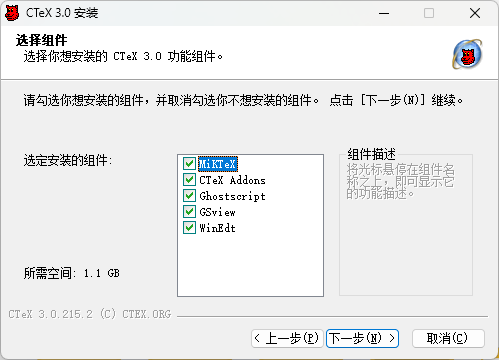
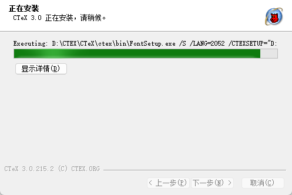
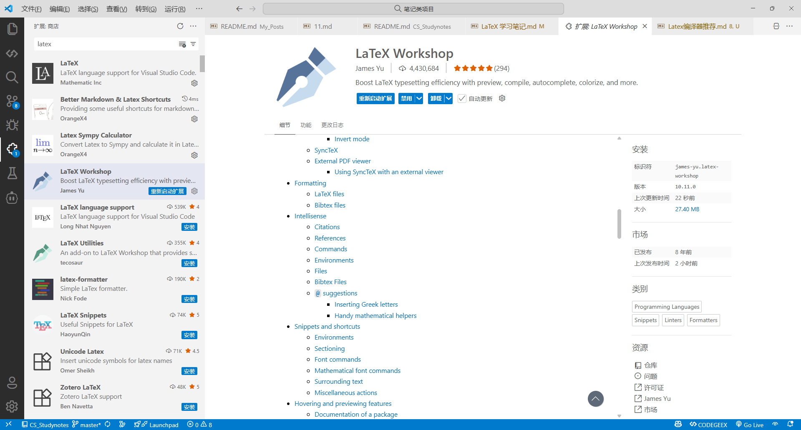
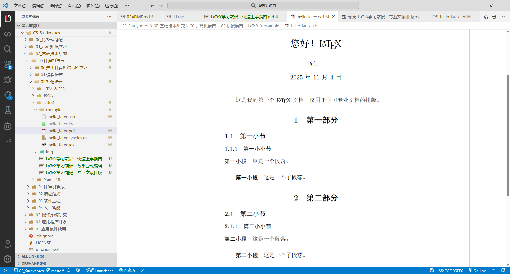
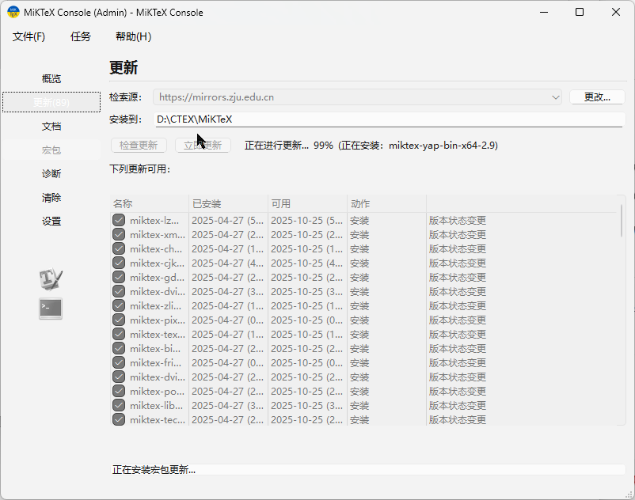

# LaTeX 学习笔记：快速上手指南

从这篇笔记开始，我将会开始记录一系列自己学习 $\LaTeX$ 这门标记语言的心得体会，包括介绍它的前世今生，基本使用方式。以及在数学公式编辑、专业文献排版等方面的具体应用。下面是这一系列笔记的索引：

- [[LaTeX学习笔记：快速上手指南]]
- [[LaTeX学习笔记：数学公式编辑]]
- [[LaTeX学习笔记：专业文献排版]]

## LaTeX 的前世今生

事情得先从 $\TeX$ 说起，众所周知，$\TeX$ 是美国著名的计算机教授高德纳（Donald Ervin Knuth）[^1]为撰写其伟大著作《计算机程序设计艺术》专门开发的一套排版系统语言。由于《计算机程序设计艺术》是一部讨论计算机算法的鸿篇巨作，其中涉及了大量的数学问题，所以为其开发的排版系统自然就在编辑复杂的数学公式方面具备了与生俱来的优势，这种先天优势使得它在数学、物理学和计算机科学等与数学表述密切相关的学术领域中非常流行，甚至很多人学习 $\TeX$ 就是为了使用它在数学领域中的强大表述能力。

但 $\TeX$ 的功能过于强大，它会要求我们在排版过程中精确描述到每一个细节，有时甚至是一个字母或标点也要照顾到。这对于大多数人来说，可能就学习成本太高，并且用起来太过繁琐和费时了。于是在上个世纪八十年代，美国计算机科学家莱斯利·兰伯特（Leslie Lamport）[^2]在 $\TeX$ 的基础上开发出了 $\LaTeX$ 这个新的排版系统（目前的版本为 $\LaTeX2e$）。从本质上来说，该排版系统其实就是一组封装了 $\TeX$ 处理细节的宏，它可以让那些不了解排版和程序设计相关知识的人们也能使用 $\TeX$ 所提供的强大功能，并在几天甚至几个小时之内就能排版出具有专业质感的印刷品，而不必深陷于琐碎的排版细节中。

在中文支持方面，$\LaTeX$ 目前主要使用的 XeTeX 排版引擎，该引擎支持 UTF-8 编码和现代字体，可以直接使用本地计算机中安装的字体，这大大降低了 $\LaTeX$ 的使用难度。

## LaTeX 的基本使用方式

正如上面所说的，$\LaTeX$ 语言本质上是一套封装了 $\TeX$ 处理细节的宏，其中使用的每一个标记实际上都是一个宏。下面，让我们先来简单了解一下 $\LaTeX$ 标记的基本使用，因为这种形式也会出现在复杂的公式中。这种形态的 $\LaTeX$ 标记通常会以一个反斜杠开头，后面紧接着该命令的名称，这个名称既可能是个单一符号，也可能是一个字符串。命令名称之后还可以有一些指定参数，我们通常会用花括号将它们括起来（如果该参数只有一个字符，花括号可以省略）。除此之外，如果有可选参数，则用方括号括起来，具体如下：

- 无参数形式：`\command`。
- 有参数形式：`\command{参数1}{参数2}……{参数N}`。
- 带可选参数形式：`\command[可选参数]{参数1}{参数2}……{参数N}`。

例如，我们现在这里所显示的“$\LaTeX$”字样，使用的就是一个无参数形式的标记`\LaTeX`。再例如，我们之前所使用开方标记`\sqrt`，就需要有一个指定参数来表示被开方数。另外，我们还可以用该标记的可选参数来指定开方的次数。当然，关于这些标记的具体应用，我们稍后会开辟专题讨论。眼下，先让我们来初步了解一下 $\LaTeX$ 的基本使用方式，以便实现对这门语言的快速上手。

### 在 Markdown 文档中的使用

在 Markdown 文档中使用 $\LaTeX$ 标记编写数学公式，是我们目前使用 $\LaTeX$ 语言最简单的方式之一。这项功能是基于 [Mathjax](https://www.mathjax.org) 库来实现的，后者是一个跨浏览器的 JavaScript 程序库，它使用`MathML`、`LaTeX`和`ASCIIMathML`标记在Web浏览器中显示数学符号。当然，在使用这个库之前，必须要先确认我们所使用的 Markdown 编辑器是支持 Mathjax 库的，譬如在 VS Code 编辑器中，我们需要安装 Markdown+Math 插件，具体安装方法可参考《[[VS Code 使用笔记]]》中的相关内容。

在设置好编辑环境之后，我们就可以在 Markdown 文档中插入 $\LaTeX$ 标记了。具体来说，$\LaTeX$ 标记的引用方式主要有以下两种：

- **行内引用**：采用行内引用方式的 $\LaTeX$ 标记通常与正常文本处于同一逻辑行中（软件界面导致的自动换行不算），具体语法就是*在待引用标记的前后各加一个美元符号*。例如，如果我们想显示“我正在使用 $\LaTeX$ 来排版论文。”这句话，只需进行如下编码即可：
  
  ```Markdown
  我正在使用$\LaTeX$来排版论文。
  ```

- **单独引用**：采用单独引用方式的 $\LaTeX$ 标记通常会独立于正常文本，自成一行，具体语法就是*在待引用标记的前后各加两个美元符号*。例如，如果我们想在 Markdown 文档中讨论勾股定理，就可以使用如下编码来描述该定理：

  ```Markdown
  在平面上的一个直角三角形中，如果设直角三角形的两条直角边长度分别是a和b，斜边长度是c，那么按照勾股定理，这三边的关系如下：
  
  $$ a^{2} + b^{2} = c^{2} $$
  
  这也就意味着：
  
  $$ a = \sqrt{c^{2} - b^{2}} $$
  $$ b = \sqrt{c^{2} - a^{2}} $$
  $$ c = \sqrt{a^{2} + b^{2}} $$
  ```

  其渲染效果如下

    > 在平面上的一个直角三角形中，如果设直角三角形的两条直角边长度分别是a和b，斜边长度是c，那么按照勾股定理，这三边的关系如下：
    >
    > $$ a^{2} + b^{2} = c^{2} $$
    >
    > 这也就意味着：
    >
    > $$ a = \sqrt{c^{2} - b^{2}} $$  
    > $$ b = \sqrt{c^{2} - a^{2}} $$  
    > $$ c = \sqrt{a^{2} + b^{2}} $$

请注意，读者暂时不用担心看不懂上面这些数学公式中使用的 $\LaTeX$ 标记，因为我稍后会在《[[LaTeX学习笔记：数学公式编辑]]》这篇笔记中开专题讨论这些标记的具体使用。在这里，我们只需要对 $\LaTeX$ 标记的引用方式有清楚的认知就可以了。

### 在专业排版软件中的使用

如果我们使用 $\LaTeX$ 的目的并不局限于编辑数学公式，而是希望更充分地发挥它在学术文档排版方面的专业能力，那么就需要使用像 TeX Live、MiKTeX 这样的 $\LaTeX$ 专用软件。在专业术语中，这类软件被称为 **$\TeX$ 发行版（distribution）**，它们能够提供完整的 $\LaTeX$ 编译环境，支持从命令行到图形化界面的多种使用方式。

在简体中文写作环境中，为了简化排版配置，我们通常会选择安装 CTeX 套装（基于 MiKTeX 的发行版），或在 TeX Live 中添加 ctex 宏包，以搭建专用的 $\LaTeX$ 编译与编辑环境。下面，让我们来介绍一下 $\LaTeX$ 专用环境的搭建及其使用方法。

#### 基于 CTeX 套装的使用

CTeX 套装是在 Windows 系统中最为常见的中文 $\LaTeX$ 发行版之一。它以 MiKTeX 为核心发行版，集成了常用的中文宏包（如 `ctex`、`xeCJK` 等）和若干常用编辑器（如 WinEdt、TeXworks 等），从而为用户提供了一个**即装即用**的中文 $\LaTeX$ 编译与编辑环境。与手动配置相比，CTeX 套装最大的优点在于安装简单、中文支持完善，提供有独立的 Windows 安装包。虽然该项目已多年未更新，但其稳定性和兼容性仍然能够满足一般的中文排版需求，非常适合以 Windows 系统为主要工作环境的初级用户。下面，让我们来介绍一下安装和使用 CTeX 套装的具体步骤。

1. 在网页浏览器中打开 [CTeX 官方主页](http://www.ctex.org)在[清华大学开源软件镜像站](https://mirrors.tuna.tsinghua.edu.cn/ctex/legacy/)。[^3]

2. 根据自己所在的操作系统（例如 64 位的 Windows）下载最新版本的安装包，例如`CTeX_3.0.215.2.exe`。

3. 双击下载好的安装包文件，启动 CTeX 的图形化安装界面，并根据界面的提示执行如下设置：

   1. 在下面的界面中选择[简体中文]，并点击“下一步”按钮。

      

   2. 勾选下面界面中所有的组件以确保安装 CTeX 所有的功能，然后点击“下一步”按钮。

      

   3. 在下面界面中设置安装路径（我在这里将其设置为`D:\CTeX`），然后点击“安装”按钮。

      

   4. 安装过程可能持续数分钟，请耐心等待安装完成。

      

   5. 待安装完成之后，我们将会看到如下界面，现在只需点击“完成”按钮即可结束安装。

      

4. 待安装完成之后，系统会自动将 CTeX 的可执行文件路径加入到 Windows 的环境变量中。若在命令行终端环境（例如 Bash 或 Powershell）中运行 `latex`、`xelatex` 或 `pdflatex` 时出现“命令未找到”等提示，可以手动检查路径设置：

   1. 打开“系统属性 → 高级 → 环境变量”。

   2. 在“系统变量”中找到`Path`，根据自己安装时的设置确保其中包含类似以下路径：

      ```text
      D:\CTeX\MiKTeX\miktex\bin\
      D:\CTeX\CTeX\bin\
      ```

5. 现在，如果问你想要在 VS Code 编辑器中编写 $\LaTeX$ 文档，就可以通过如下步骤来实现（这也可用于验证 CTeX 是否安装成功）：

   1. 打开 VS Code 编辑器，并安装 LaTeX Workshop 和 LaTeX 这两个插件。

      

   2. 在 VS Code 编辑器的命令面板中执行`[首选项：打开工作区设置（JSON）]`命令。

      

   3. 在`settings.json`文件中添加如下内容，完成插件的配置工作：

        ```json
        {
            //---------LaTeX Workshop 配置开始-----------
            // 设置是否自动编译,可选："never", "onSave", "onFileChange"
            "latex-workshop.latex.autoBuild.run":"never",
            //文件输出路径，会自动创建temp文件
            //"latex-workshop.latex.outDir": "./temp",
            //右键菜单
            "latex-workshop.showContextMenu":true,
            //从使用的包中自动补全命令和环境
            "latex-workshop.intellisense.package.enabled": true,
            //编译出错时设置是否弹出气泡设置
            "latex-workshop.message.error.show": false,
            "latex-workshop.message.warning.show": false,
            // 编译工具和命令
            "latex-workshop.latex.tools": [
                {
                    "name": "xelatex",
                    "command": "xelatex",
                    "args": [
                        "-synctex=1",
                        "-interaction=nonstopmode",
                        "-file-line-error",
                        //"-output-directory=temp", //自定义辅助文件输出路径
                        //"-outdir=%OUTDIR%", //辅助文件输出路径
                        "%DOCFILE%"
                    ]
                },
                {
                    "name": "pdflatex",
                    "command": "pdflatex",
                    "args": [
                        "-synctex=1",
                        "-interaction=nonstopmode",
                        "-file-line-error",
                        //"-output-directory=temp", //自定义辅助文件输出路径
                        //"-outdir=%OUTDIR%", //辅助文件输出路径
                        "%DOCFILE%"
                    ]
                },
                {
                    "name": "latexmk",
                    "command": "latexmk",
                    "args": [
                        "-synctex=1",
                        "-interaction=nonstopmode",
                        "-file-line-error",
                        "-pdf",
                        "-outdir=%OUTDIR%",
                        "%DOCFILE%"
                    ]
                },
                {
                    "name": "bibtex",
                    "command": "bibtex",
                    "args": [
                        "%DOCFILE%"
                    ]
                }
            ],
            // 用于配置编译链
            "latex-workshop.latex.recipes": [
                {
                    "name": "XeLaTeX",
                    "tools": [
                        "xelatex"
                    ]
                },
                {
                    "name": "XeLaTeX*2",
                    "tools": [
                        "xelatex",
                        "xelatex"
                    ]
                },
                {
                    "name": "PDFLaTeX",
                    "tools": [
                        "pdflatex"
                    ]
                },
                {
                    "name": "PDFLaTeX*2",
                    "tools": [
                        "pdflatex",
                        "pdflatex"
                    ]
                },
                {
                    "name": "BibTeX",
                    "tools": [
                        "bibtex"
                    ]
                },
                {
                    "name": "LaTeXmk",
                    "tools": [
                        "latexmk"
                    ]
                },
                {
                    "name": "xelatex -> bibtex -> xelatex*2",
                    "tools": [
                        "xelatex",
                        "bibtex",
                        "xelatex",
                        "xelatex"
                    ]
                },
                {
                    "name": "pdflatex -> bibtex -> pdflatex*2",
                    "tools": [
                        "pdflatex",
                        "bibtex",
                        "pdflatex",
                        "pdflatex"
                    ]
                }
            ],
            //文件清理。此属性必须是字符串数组
            "latex-workshop.latex.clean.fileTypes": [
                "*.aux",
                "*.bbl",
                "*.blg",
                "*.idx",
                "*.ind",
                "*.lof",
                "*.lot",
                "*.out",
                "*.toc",
                "*.acn",
                "*.acr",
                "*.alg",
                "*.glg",
                "*.glo",
                "*.gls",
                "*.ist",
                "*.fls",
                "*.log",
                "*.fdb_latexmk"
            ],
            //设置为onFaild 在构建失败后清除辅助文件
            "latex-workshop.latex.autoClean.run": "onFailed",
            // 使用上次的recipe编译组合
            "latex-workshop.latex.recipe.default": "lastUsed",
            // 用于反向同步的内部查看器的键绑定。ctrl/cmd +点击(默认)或双击
            "latex-workshop.view.pdf.internal.synctex.keybinding": "double-click",
            //设置查看PDF的工具，可选"browser","tab","external"
            "latex-workshop.view.pdf.viewer": "tab", 
            //---------LaTeX Workshop 配置结束-----------
        }
        ```

   4. 在用于演示的`example`目录中新建一个名为`hello_latex.tex`的文件，并在其中输入以下内容：

        ```latex
        \documentclass{ctexart}
        \begin{document}
            \title{您好！\LaTeX}
            \author{张三}
            \date{\today}
            \maketitle
            这是我的第一个\LaTeX 文档，仅用于学习专业文档的排版。    
            \section{第一部分}
            \subsection{第一小节}
            \subsubsection{第一小小节}
            \paragraph{第一小段} 这是一个段落。
            \subparagraph{第一小段} 这是一个子段落。
            \section{第二部分}
            \subsection{第二小节}
            \subsubsection{第二小小节}
            \paragraph{第二小段} 这是一个段落。
            \subparagraph{第二小段} 这是一个子段落。
        \end{document}
        ```

   5. 在 VS Code 编辑器的命令面板中执行`[LaTeX workshop: 构建 LaTeX 项目]`命令。

      

   6. 如果一切顺利，我们就会在`example`目录中一个文件名为`hello_latex.pdf`，内容包含“你好，LaTeX！”字样的 PDF 文件，这表明基于 CTeX 套件的中文排版环境已配置成功。

      

这里需要提醒读者注意的是：CTeX 套装自带的宏包版本是比较老旧的，如果在使用过程中遇到了兼容性问题，我们可通过 **MiKTeX Console** 进行在线更新来修复问题，该程序界面如下所示：



如果 MiKTeX Console 启动失败，通常会看到类似“this application failed to start because no Qt platform plugin could be initialized”的错误信息。这通常是由于缺少或损坏的 Qt 插件导致的。该问题可通过执行`miktex --admin packages update`命令升级 MiKTeX 的版本来解决。

另外，如果读者计划编写大型文档或需要使用现代字体与宏包，我会更建议大家使用 **TeX Live + ctex 宏包** 的方案，以获得更好的可维护性和长期支持。 总而言之，CTeX 套装为中文用户提供了一个开箱即用的 $\LaTeX$ 工作环境，它简化了复杂的配置过程，使用户能够专注于内容创作与排版逻辑的学习。虽然其更新频率较低，但作为入门与教学用途，依然具有较高的实用价值。

同样的，读者现在暂时也不用担心看不懂`hello_latex.tex`文件中所用到的这些 $\LaTeX$ 标记，因为我稍后也会在《[[LaTeX学习笔记：专业文献排版]]这篇笔记中开专题介绍这些标记，目前只需知道如何搭建 $\LaTeX$ 的中文排版环境即可。

<!-- 以下是注释区 -->

[^1]:注释：高德纳教授是现代计算机科学的先驱人物，他创立了算法分析理论，并在数个计算机理论分支上都做出了犹如基石一般的贡献，于1974年荣获图灵奖。
[^2]:注释：莱斯利·兰伯特是来自纽约的一位计算机科学家，LaTeX排版系统的开发者，2013年荣获图灵奖。
[^3]:注释：CTeX的官方网站已经停止维护多年，但我们可以通过它在国内的各种镜像站点下载到CTeX套装。
