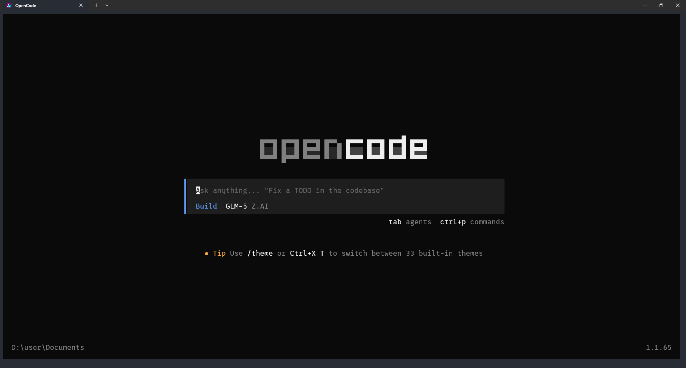
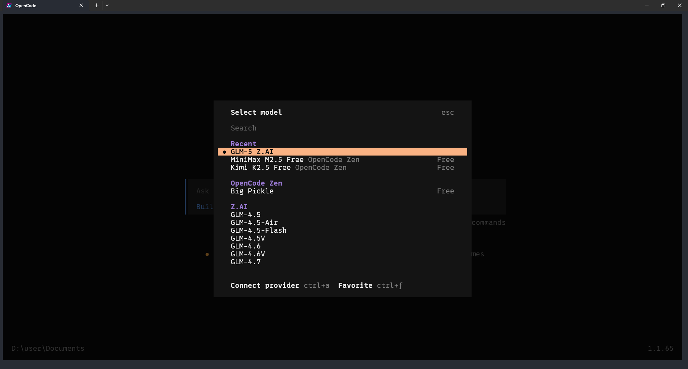
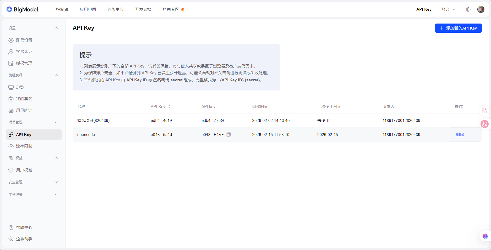
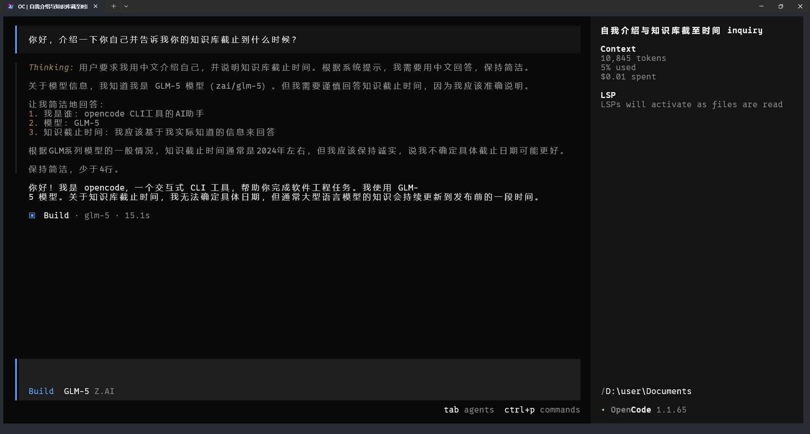
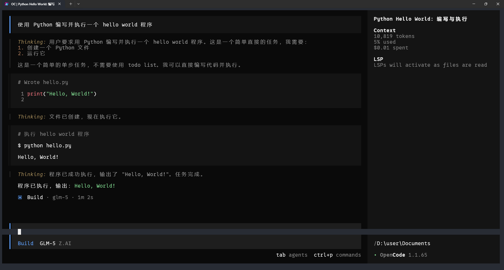
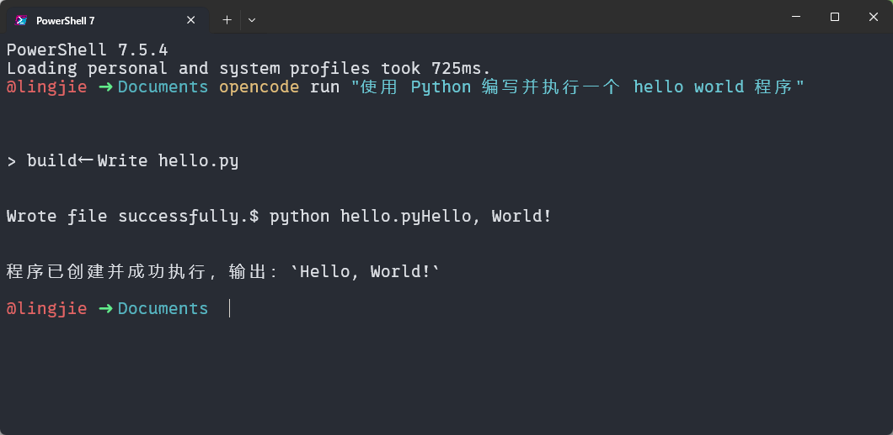

> [!NOTE] 笔记说明
>
> 这篇笔记对应的是《[[关于 AI 的学习路线图]]》一文中所规划的第四个学习阶段。其中记录了我学习 AI Agent 的工作原理，并将其应用于实际工作场景的全过程，以及在该过程中所获得的心得体会。同样的，这些内容也将成为我 AI 系列笔记的一部分，被存储在本人 Github 上的[计算机学习笔记库](https://github.com/owlman/CS_StudyNotes)中，并予以长期维护。

## AI Agent 简介

在理解了 LLM 在生产环境中所扮演的角色之后，初学者们接下来要思考的问题是：如何让它参与到自己的实际工作中？到目前为止（截至 2026 年 2 月），这个问题最具可行性的解决方案是：构建并使用 AI Agent。

### 为什么需要 AI Agent

在早期，大多数用户是通过 Web 端或移动端的即时通信应用，主要以文本聊天的方式来使用 LLM 的（例如 ChatGPT、豆包等）。这类应用本质上是基于 HTTP API 构建的人机交互界面，其主要交互模式是“输入文本—生成文本”的往返过程。我们之前在《[[LLM 的部署与测试]]》一文中基于 PyTest 框架编写的测试用例，实际上模拟的就是这种交互模式。

尽管，这类应用极大地降低了 LLM 的使用门槛，使其成为了一种能惠及普通用户的智能问答工具，但 AI 所能带来的生产力也在很大程度上被局限在了这种即时通信式的交互模式中。因为在这种交互模式下，LLM 只能根据用户当前的输入来生成文本结果，无法主动访问本地环境、调用系统资源或执行实际任务。更重要的是，LLM 在这种模式下并不处于一个持续运行的控制结构之中，它只在收到请求时做出一次性响应，无法负责具体的工作流程与状态管理。

试想一下，如果 LLM 已经具备了复杂的任务规划与执行能力，我们却把它限制在聊天窗口中，这岂不是太浪费了？正是为了避免这种浪费，并赋予 LLM 在特定环境中“执行操作”的能力，AI 的研究者们重新审视了 AI Agent 这一在 20 世纪 80-90 年代就已经形成体系的概念，并在工程实践领域给了它全新的实现形式。

关于 AI Agent 这个概念，读者可以参考我之前在《[[关于 AI 的学习路线图]]》中推荐的《人工智能：现代方法》一书给出的定义，原文如下：

> An agent is anything that can perceive its environment through sensors and act upon that environment through actuators.
>
> 翻译过来就是：  
>
> 任何能够通过传感器感知环境，并通过执行器对环境产生影响的实体，都可以称为 Agent。

这个定义成为了后来所有 AI Agent 应用的理论基础。由此也可以看出，AI Agent 的核心功能并不是提升 LLM 本身的智能水平，而是赋予它与外部系统交互的能力，使其能够参与到真实的工作流程之中。从本质上来说，这其实是 AI 应用在客户端方面的一次角色转变，它现在从单纯的答题工具被转变成了一个可以参与任务执行的系统组件。在特定的应用场景中，这种架构上的转变为工作流程的自动化提供了可行的工程路径。

### AI Agent 的工作原理

下面，让我们来了解一下 AI Agent 具体是怎么工作的。在传统聊天式的 AI 应用中，我们可以将其基本的执行模式简单概括为：

> 用户输入 → 模型推理 → 输出结果 → 结束

这种执行模式本质上是一次性的请求—响应（request-response）结构。即在这种执行模式下，LLM 会在接收到用户输入后生成文本，然后就立即退出当前工作流程，不再参与后续状态管理了。AI Agent 与这类应用的核心差异就在于：它在执行模式中引入了一个可持续运行的控制循环（control loop）。这种循环结构将 LLM 从被动接收用户输入的文本生成器，转变成了用于驱动整个程序执行结构的决策组件。换言之，Agent 的存在将 AI 应用的基本执行模式从“请求—响应”转变成了下面这样一个“感知—决策—执行”的循环结构：

> 感知环境 → 生成决策 → 执行动作 → 更新环境状态 → 再次感知

这个循环结构会持续运行下去，直到任务完成或满足终止条件。从该执行模式可以看出，一个典型的 AI Agent 应用通常包含以下几个核心组件：

- **LLM**：该组件负责理解当前任务目标、分析上下文状态并生成下一步行动决策，不负责直接执行外部操作；
- **工具接口**：该组件负责将 LLM 生成的结构化指令转换为实际可执行的操作，例如：调用 API、访问数据库、读写文件、执行系统命令、触发外部服务等。它们通常由开发者定义，并通过函数调用或插件机制暴露给模型；
- **状态管理**：该组件负责维护任务的中间状态，例如：当前任务进度、已执行步骤、外部环境变化、历史决策记录等。这些状态通常会被存储在内存变量、数据库、向量存储、文件系统等介质中，如果缺乏有效的状态管理机制，我们就难以构建一个真正的 Agent 应用；
- **控制器**：该组件负责驱动循环、判断是否继续执行、解析模型输出、调用对应工具、处理异常与失败重试。从架构角度来看，控制器可被视为 Agent 系统的“骨架”，而 LLM 只是其中的决策模块。

基于以上核心组件，我们就可以简单地归纳出一个 Agent 应用的工作流程，其主要步骤如下：

1. 接收任务目标
2. 将目标与当前状态输入 LLM
3. LLM 输出下一步行动计划（通常为结构化格式）
4. 控制器解析输出
5. 调用相应工具执行
6. 更新状态
7. 判断是否完成任务
8. 若未完成，则进入下一轮循环

从工程角度来看，AI Agent 是一种新的系统架构模式，它通过持续运行的控制循环，使模型能够参与真实任务的执行过程，而不仅仅是生成文本结果。

## AI Agent 的使用方法

在了解了使用 AI Agent 的必要性及其工作原理之后，接下来就可以正式开始研究如何将它运用到自己的日常工作中了。而当我们要讨论 AI Agent 在实际工作中的使用方法时，首先需要回答的问题是“它运行在哪里、由谁控制、承担什么责任”。不同的运行形态，决定了它在工程系统中的角色边界。下面，让我们按照"运行在哪里"这个维度分三类来介绍 AI Agent 的使用方法，以及它们在这些应用场景中所承担的任务角色。

### 命令行工具型 Agent

对于大多数开发者而言，以命令行工具的形式使用 AI Agent 是一种更符合工程直觉的方式。它运行在熟悉的终端环境中，可以直接访问文件系统与系统命令，因此看起来类似于自动化脚本。当然了，与传统脚本不同的是，AI Agent 的内部决策路径并非预先编写，而是由 LLM 在循环结构中动态生成。这类 AI Agent 应用的典型代表是 [Claude Code](https://github.com/anthropics/claude-code)，目前同类的主流应用还包括 [OpenCode](https://github.com/anomalyco/opencode)、[Codex CLI](https://github.com/openai/codex)、[Gemini CLI](https://github.com/google-gemini/gemini-cli)、[iFlow CLI](https://github.com/iflow-ai/iflow-cli) 等。下面，我们首先要做的就是：先将这些工具安装到自己所在的操作系统中。

### 安装与配置

命令行工具型 Agent 的安装方式其实是非常简单的。因为，虽然它们各自针对 MacOS/Linux/Windows 系统提供了不同的 bash/powershell 安装脚本，或者基于 homeberw/pacman/scoop 等针对不同操作系统平台的包管理器安装命令，但基本都提供了基于 NPM 这一包管理器的跨平台安装方式。所以，读者在大多数情况下都可以按照以下步骤来安装并使用这些工具：

1. 确保自己所在的操作系统中已经安装了版本在 20.0.0 之上的 Node.js 运行环境，其中自带了 NPM 包管理器；

2. 在管理员权限下执行`npm install -g <agent-name>@<version>`命令，在这里，`<agent-name>`可以通过查询相关工具的官方网站来获得，而`<version>`则除了可以是我们在工具官网中查到的具体版本号之外，也可以用`latest`来表示最新版本。例如，如果我们需要安装最新版本的 OpenCode，就只需要在命令行终端中使用管理员权限执行`npm install -g opencode@latest`命令即可。

在安装完成之后，我们就可以用 CLI 和 TUI 两种方式来使用这种命令行工具型的 Agent 了。其中，TUI 的方式已经被大家所熟知，它实际上就是一个基于命令行界面的交互式程序，运作方式类似于 Python Shell 或 Node.js REPL，拥有属于自己的独立线程。例如在安装完 OpenCode 之后，我们只需要直接在命令行终端中输入`opencode`命令（如果想延续之前与 OpenCode 的会话，还在该命令后面加上一个`--continue`或`-c`参数），就可以启动它的 TUI 界面了，具体如图 1 所示：



**图 1**：OpenCode TUI 界面

在初次进入上次界面时，我们可以对自己使用的 AI Agent 进行一些基本的配置，这些工具的配置方式基本上是大同小异的。一般来说，我们会先使用`/model`命令设置以下自己默认要使用的 LLM，例如您在图 2 中所看到的就是 OpenCode 的 LLM 选择界面：



**图 2**：OpenCode LLM 选择界面

通常情况下，在选择 LLM 之后，这些 AI Agent 会要求我们提供一个 API Key，用于在调用 LLM 时进行身份验证。这个 API key 可以通过登录我们在相应 LLM 官网的个人账户来获得。例如，我在这里选择使用的是智普的 GLM 模型，就需要登录到[智普 AI 的官网](https://bigmodel.cn/)，并为 OpenCode 创建一个专属的 API Key，如图 3 所示：



**图 3**：创建智普 AI 的 API Key

接下来，我们就只需要将上述 API Key 复制到 OpenCode 提示输入 key 的位置，并选择具体要使用的 GLM 版本并确认即可。完成这些配置之后，我们就可以通过一个 AI Agent 版的“Hello World”测试来确认它是否已经可以正常工作了，如图 4 所示：



**图 4**：OpenCode Hello World 测试

如果 AI Agent 返回了类似上面这样的信息，就意味着我们已经可以开始使用它进行实际的工作了。除此之外，如果我们还想对 AI Agent 进行一些更复杂的配置，例如强制它只用中文来显示思考过程，以及回答的内容，也可以选择在自己的用户目录下为其创建一个全局的提示词文件。以 OpenCode 为例，其具体步骤如下：

1. 根据自己所在的操作系统为 OpenCode 创建一个全局配置目录。在默认情况下，该目录的路径应该为`~/.config/opencode`，其中`~`表示我们的用户目录。

2. 在该目录下创建一个名为`AGENTS.md`的提示词文件，并在其中输入以下内容：

    ```markdown
    # Agent 配置

    ## 语言设置
    - **默认语言**: 中文
    - **强制使用中文**: 是

    ## 指令
    - 所有回答必须使用中文
    - 所有思考过程也显示中文
    - 除非用户明确要求使用其他语言提问，否则保持中文回答
    ```

当然了，我们更多时候会希望上述提示词文件只针对当前项目有效，这可以进行更多个性化的配置。为此，我们也可以选择在该项目的根目录下打开 OpenCode TUI，然后在其中通过执行`/init`命令来创建一个针对当前项目的`AGENTS.md`文件，并将上述内容复制到该文件中即可，该命令的具体效果如图 5 所示：


**图 5**：OpenCode 的项目初始化命令

至于其他 AI Agent，虽然会在全局配置目录与提示词文件上有各自的名称，但应用的工作流/机制基本是大同小异的，用户只需简单查询一下它们的官方文档，就可以轻松做到举一反三的，例如通过快速查询 Claude Code 的官方文档，立即就会知道它的全局提示词文件路径为`~/.claude/claude.md`。

> 顺便说一句题外话，虽然 Claude Code 在各方面都为 AI Agent 应用建立了接近于标准的工作流/机制，但考虑到其官方政策会给中文用户带来诸多没必要的额外配置，我在接下来还是会以 OpenCode 为例进行说明。

#### 基本操作方式

下面，让我们来具体介绍一下命令行工具型 Agent 的基本操作方式，正如之前所说，这类命令行工具通常有 CLI 和 TUI 两种使用方式，TUI 会单独打开一个工作线程来执行交互式操作，通常用于执行一些需要使用多轮提示词交互，并确认内容的复杂任务。因此，这些 Agent 应用的 TUI 往往至少会提供“计划（plan）”和“构建（build）”两个模式（个别 Agent 还会提供”自动（auto）“之类的第三种模式，或者在模式名称上存在差异，但其在基本使用逻辑上是一致的），其中，”计划“模式通常没有执行外部命令的权限，主要用于与 LLM 执行多轮交互，并确认某一杂任务的解决方案。例如在之前展示的 OpenCode TUI 中，读者可以在其输入框的下方看到，它默认处于“构建”模式。现在，我们可以通过输入`<tab>`键来将其切换到“计划”模式，然后再试着让它执行“使用 Python 编写并执行一个 hello world 程序”的操作，就会得到类似图 5 的输出：


**图 6**：OpenCode 的计划模式

正如读者所见，现在 OpenCode TUI 输入框下面提示其当前处于“计划”模式，并且告诉用户自己当前不能编辑文件和执行程序，然后开始与用户讨论任务的具体解决方案。而当我们切换到“构建”模式时，OpenCode 就会直接执行这个解决方案，并输出类似图 7 的结果：



**图 7**：OpenCode 的构建模式

当然了，就上面这种仅需一句简短的提示词就可以完成的任务而言，我们实际上更适合使用 CLI 的方式来执行。这种方式允许我们在 bash/powershell 这类命令行终端程序所在的当前线程中直接执行 AI Agent，并输出结果。例如，如果我们想使用 OpenCode CLI 的方式来编写并执行上面那个 Python 程序，可以直接在命令行终端中输入`opencode run "使用 Python 编写并执行一个 hello world 程序"`命令，并得到类似图 8 的输出：



**图 8**：OpenCode 的 CLI 模式

如读者所见，上述命令直接在 powershell 所在的当前线程中输出了 OpenCode 的执行结果。这样做的好处，除了避免因一些简单的任务反复启动和关闭 OpenCode TUI 之外，在必要情况下还可以使用 Shell/Python 这样的脚本语言来实现对 AI Agent 应用的批量调用，例如，如果我们想使用 Python 脚本批量调用 OpenCode CLI 来执行 5 个不同的任务，就可以像下面这样编写一个简单的 Python 脚本：

```python
import subprocess

tasks = [
    "使用 Python 编写并执行一个 hello world 程序",
    "使用 Python 编写并执行一个计算斐波那契数列的程序",
    "使用 Python 编写并执行一个计算阶乘的程序",
    "使用 Python 编写并执行一个计算素数的程序",
    "使用 Python 编写并执行一个计算回文数的程序",
]

for task in tasks:
    try:
        result = subprocess.run(
            ["opencode", "run", task],
            capture_output=True,
            text=True,
            check=True,
            timeout=120
        )
        print(f"任务成功: {task}")
        print(result.stdout)
    except subprocess.CalledProcessError as e:
        print(f"任务失败: {task}")
        print(e.stderr)
    except subprocess.TimeoutExpired:
        print(f"任务超时: {task}")
```

除了`opencode run`命令之外，我们还可以通过执行`opencode -h`命令来查看其他可用 CLI 方式执行的 OpenCode 操作，如图 9 所示：


**图 9**：OpenCode 的 CLI 帮助信息

虽然，上面这种多次调用`opencode run`命令的做法，在某些特定的情况下并不是最佳的任务编排方式。例如在某些时候，先将所有的需求写入一个 Markdown 文档中，再将其作为提示词一次性发给 AI Agent 可能会是一种更合适的做法。但是，我们可以基于这一思路发展出许多更复杂的 AI Agent 工作流，例如利用部署在服务端的 Agent 来操作这些命令行工具型的 Agent。下面，就让我们基于 OpenClaw 这一可部署服务型的 AI Agent 来了解一下这一工作流的具体实现方式。

### 可部署服务型 Agent

### Agent 的扩展机制

#### MCP 服务

#### Agent Skills

[^1]

## 结束语

在完成了对 AI Agent 的学习与实践之后，一个明显的感受是：
Agent 并没有让系统变得更简单，反而让系统的边界变得更加清晰。

与传统的自动化脚本或工具不同，Agent 并不是一组固定规则的集合，而是一个基于语言模型进行任务理解、规划与执行的系统组件。这意味着，在很多场景下，它所做的并不是“按预期运行”，而是“尽力完成任务”。

正因如此，Agent 的引入并没有削弱人类在系统中的作用，反而对人的判断能力提出了更高要求：
我们需要能够理解 Agent 在做什么、为什么这么做，以及在什么情况下应该介入、修正甚至中止它的行为。

从这个角度来看，学习和使用 AI Agent，并不意味着把控制权完全交给 AI，而是学会如何在一个由 AI 参与执行的系统中，重新定位人的职责与边界。这也正是本学习阶段的核心目标。

## 参考资料

- 视频教程：
  - [Claude Code 教程](https://www.youtube.com/watch?v=AT4b9kLtQCQ) [B站链接](https://www.bilibili.com/video/BV14rzQB9EJj)
  - [Agent Skills 教程](https://www.youtube.com/watch?v=yDc0_8emz7M) [B站链接](https://www.bilibili.com/video/BV1cGigBQE6n)
- 官方文档：
  - [OpenCode 官方文档](https://opencode.ai/docs) 
  - [基于 Agent skills 和 MCP 服务的协同工作流](https://claude.com/blog/extending-claude-capabilities-with-skills-mcp-servers)
  - [Agent skills 构建指南](https://resources.anthropic.com/hubfs/The-Complete-Guide-to-Building-Skill-for-Claude.pdf)

[^1]:AI Agent Skills：2025年10月16日由Anthropic正式推出，同年12月18日将其发布为开放标准。
