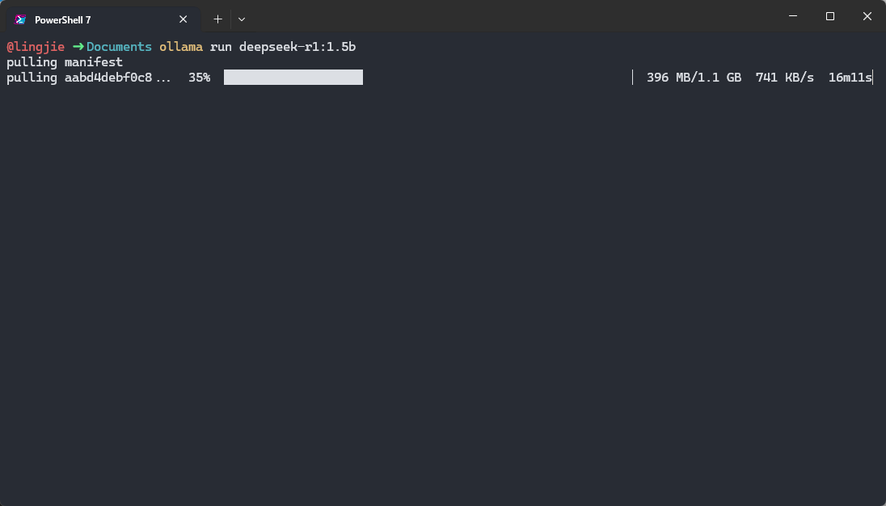

> [!NOTE] 笔记说明
>
> 这篇笔记对应的是《[[关于 AI 的学习路线图]]》一文中所规划的第三个学习阶段。其中记录了我尝试将 LLM 部署到生产环境中，并对其进行相关测试的全过程，以及在该过程中所获得的心得体会。同样的，这些内容也将成为我 AI 系列笔记的一部分，被存储在本人 Github 上的[计算机学习笔记库](https://github.com/owlman/CS_StudyNotes)中，并予以长期维护。

## 关于 LLM 的本地部署

正如我之前在《[[关于 AI 的学习路线图]]》一文中所提到的，从学习的角度来说，如果我们要想切实了解 LLM 在计算机软件系统中所处的位置，以及它在生产环境中所扮演的角色，最直接的方式就是尝试将其部署到我们自己所在的计算机环境中，并通过测试来观察它与用户的交互方式。但是，如果想要实现在本地部署 LLM 这种大型应用，我们首先要解决一个很现实的问题：*如何用有限的硬件资源、以可控的方式将其运行起来？*

很显然，就目前阶段的学习任务来看，如果我们从直接编译源码、手动配置推理引擎、管理模型权重与依赖环境来着手，大概率会让自己的学习重心过早地偏向底层细节，而模糊了我们真正想观察的目标 —— LLM 在生产环境中所扮演的角色。因此，我个人会推荐读者从一款名为 Ollama 的开源模型管理工具来着手，该工具可以让人们在不必关心底层实现细节的情况下，快速地完成 LLM 的部署与测试。下面，就让我们来具体介绍一下 Ollama 及其使用方法。

### 了解并安装 Ollama

Ollama 是一款基于 MIT 协议开源的、面向本地环境的 LLM 运行与管理工具，它的核心设计目标是以尽可能低的使用门槛，将“运行一个 LLM”这件事变成一项标准化、可重复的工程操作。具体来说就是，Ollama 在整个与 LLM 相关的系统中大致承担了以下职责：

- **模型生命周期管理**：负责模型的拉取、存储、版本管理与运行；
- **推理环境封装**：屏蔽底层推理引擎、量化方式与硬件差异；
- **统一的调用接口**：通过 CLI 或 API 的形式，对外提供一致的使用方式。

这意味着，用户在使用 Ollama 时并不需要关心模型权重具体存放在哪里、底层使用了哪种推理后端，也不必在一开始就纠结于 CUDA、Metal 或 CPU 优化等问题。很显然，我们在这里选择 Ollama，本质上是一种刻意降低系统复杂度的学习策略，目的是将学习重点放在观察模型本身的行为以及**它与系统其他部分的交互方式**上，但它并不足以应对实际生产环境中的所有问题。

Ollama 的安装过程本身非常简单，读者可以自行前往它的[官方下载页面](https://ollama.com/download)，并根据该页面中的提示，基于自己所在的操作系统完成安装即可，具体如图 1 所示。


**图 1**：Ollama 的下载页面

如果安装过程一切顺利，我们就可以通过在命令行中输入 `ollama` 命令来验证安装是否成功。如果安装成功了，该命令会返回 Ollama 的使用提示信息，如图 2 所示。


**图 2**：Ollama 的使用提示信息

接下来，我们要做的就是选择一款适合当前学习任务的 LLM，并尝试使用 Ollama 来将其部署到我们的本地环境中。

### 选择并部署 LLM

关于应该选择什么模型来完成我们在这一阶段的学习，这主要取决于我们**要实验的任务类型**和**电脑配置**。以下这张表是我基于这篇笔记写作的时间点（即 2026 年 2 月），整理出的当前主流的候选模型。

| 推荐模型 | 主要特点与优势 | 适用场景 | 硬件要求参考 |
| -------- | -------------- | -------- | ------------ |
| **通用最佳平衡** | | | |
| **Qwen2.5-7B** | 7B 级别综合性能强，指令跟随、长上下文支持好，通用性高。 | 文档总结、内容创作、知识问答、轻量级智能体任务。 | 16GB+ 内存，量化后可降低需求。 |
| **Llama 3.3 系列** | Meta 出品，生态完善，工具调用支持好，3B 版本速度极快。 | 快速对话、多语言任务、对响应速度要求高的应用。 | 3B 模型：8-16GB 内存；8B 模型需求更高。 |
| **专注编程任务** | | | |
| **Qwen3-Coder 系列** | 阿里出品，在代码理解和生成任务上表现优异，有不同尺寸可选。 | 代码解释、补全、测试、学习编程。 | 1.7B/4B/8B 等不同规格，可按需选择。 |
| **Mistral 系列** | Mistral AI 的编程专用模型，擅长生成、测试和解释代码。 | 专注于软件开发辅助的各类任务。 | 推荐 16GB 以上内存。 |
| **资源受限环境** | | | |
| **SmolLM3-3B** | 完全开源，性能优秀，在 3B 级别中表现出色，可控性强。 | 对开源合规要求高，或需要在低配硬件上部署。 | 可在普通笔记本电脑上运行。 |
| **Llama 3.2 3B** | 体积小、速度快，适合部署在多种设备上，对硬件要求低。 | 需要即时响应的嵌入式应用或移动端场景。 | 8-16GB 内存即可。 |

根据上面的表格，我们可以先参照以下提示来确定选择：

- 如果硬件资源不给力（例如内存容量只有 16GB 或更少，没有独立显卡），可以选择`SmolLM3-3B`或`Llama 3.2 3B`；
- 如果想优先考虑通用对话和写作，可以选择`Qwen2.5-7B`或`Llama 3.3 8B`；
- 如果想优先考虑将其用于编程辅助，`Qwen3-Coder`或`Mistral`系列可能是更好的选择；

由于这篇笔记的任务是基于学习的目的来部署 LLM，它最好能让读者在最普通的个人笔记本上进行过程相对流畅的实验，因此我决定接下来就选择`Llama 3.2 3B`来进行演示了。

基本上，使用 Ollama 部署 LLM 的操作步骤与使用 docker 部署服务端应用的过程非常类似，具体如下：

1. **拉取模型**：打开命令行终端并输入`ollama pull llama3.2:3b`命令，即可从 Ollama 的官方服务器上拉取我们所选择的 LLM 镜像，如图 3 所示。

    

    **图 3**：使用 Ollama 拉取 LLM 镜像

    正如读者所见，如果镜像被顺利拉取到本地，当我们继续在命令行终端输入`ollama list`命令时，就可以看到`llama3.2:3b`这个镜像已经存在于 Ollama 在本地管理的镜像列表中了。

2. **运行测试**：继续在图 3 所示命令行界面中输入 `ollama run llama3.2:3b`命令即可开始交互测试。在这里，我们演示的是一个 LLM 版的“Hello World”，如图 4 所示。

    

    **图 4**：使用 Ollama 运行 LLM 镜像

至此，我们就算完成了一次基于 Ollama 的 LLM 本地部署作业。需要特别强调的是，由于受到硬件资源的限制，我们在这里所部署的这个 LLM 在功能上是远远不能满足实际生产需求的，它在这里的任务只是供我们用测试的方式来观察 LLM 在生产环境中所扮演的角色。

## 针对 LLM 的测试与观察

下面，让我们来具体测试一下这个基于 Ollama 完成本地部署的 LLM。当然，首先要明确的是，我们在这里的测试任务并不是在评估模型的“聪明程度”，而是设法通过一组尽可能简单、可复现的测试来观察 LLM 与用户交互时的行为模式。换句话说，我们希望通过测试来了解 **LLM 作为系统组件时的响应方式、失败模式以及可控性边界。**

因此，在测试方式的选择上，我刻意避开了交互式对话，而是选择使用 Python 脚本通过 API 的方式来调用本地运行的模型，以模拟更接近实际生产环境中的使用场景。

### 使用 Python 调用本地 Ollama 模型

Ollama 在本地启动后，会默认提供一个 HTTP API，用于模型的程序化调用。我们可以通过普通的 HTTP 客户端，在 Python 中直接与其交互。

以下示例展示了一个最基本的调用方式。

```python
import requests

url = "http://localhost:11434/api/generate"

payload = {
    "model": "llama3.2:3b",
    "prompt": "请用一句话解释什么是操作系统。",
    "stream": False
}

response = requests.post(url, json=payload)
result = response.json()

print(result["response"])
```

这个示例的意义并不在于输出内容本身，而在于确认以下几点：

- 模型是否能够被稳定调用；
- 请求—响应链路是否完整；
- 返回结果是否符合预期的数据结构。

一旦上述代码可以稳定运行，我们就具备了一个**最小可用的 LLM 测试环境**。

### 测试一：响应延迟与阻塞行为

在工程环境中，一个最常见、但又容易被忽视的问题是：**模型调用是否会阻塞系统流程**。

为此，我们可以通过简单的计时方式，对模型响应延迟进行观察。

```python
import time
import requests

start_time = time.time()

response = requests.post(
    "http://localhost:11434/api/generate",
    json={
        "model": "llama3.2:3b",
        "prompt": "请简要说明 TCP 和 UDP 的区别。",
        "stream": False
    }
)

elapsed = time.time() - start_time
print(f"Response time: {elapsed:.2f} seconds")
```

在多次运行后，可以观察到一个非常直观的现象：
**即便是同一模型、同一输入，其响应时间也存在明显波动**。

这说明，在系统设计中：

- LLM 调用不应被放在强实时或低延迟要求的关键路径上；
- 模型推理更适合作为**异步、可延迟处理的组件**。

这一点与模型“是否聪明”完全无关，而是其作为计算资源密集型组件的天然属性。

### 测试二：非确定性输出与重复调用差异

接下来，我们测试一个经常在工程实践中引发问题的特性：**非确定性输出**。

```python
prompt = "请给出一个 JSON，对象中包含 name 和 age 两个字段。"

for i in range(3):
    response = requests.post(
        "http://localhost:11434/api/generate",
        json={
            "model": "llama3.2:3b",
            "prompt": prompt,
            "stream": False
        }
    )
    print(f"Run {i+1}:")
    print(response.json()["response"])
    print("-" * 30)
```

即使提示词完全一致，多次运行后也可以观察到：

- 字段顺序可能不同；
- 输出格式可能出现自然语言混杂；
- 个别情况下甚至会出现无法直接解析的内容。

这说明一个关键事实：

> **LLM 的输出不应被直接当作结构化数据使用。**

如果系统的下游组件依赖稳定的数据格式，那么在模型输出之后，必须引入额外的校验、解析与纠错机制。

### 测试三：模糊指令下的“过度推断”行为

为了观察模型在输入不充分时的行为，我们可以刻意提供一个信息不足的指令。

```python
response = requests.post(
    "http://localhost:11434/api/generate",
    json={
        "model": "llama3.2:3b",
        "prompt": "请判断这个方案是否合理。",
        "stream": False
    }
)

print(response.json()["response"])
```

在这种情况下，模型通常会：

* 主动假设不存在的背景信息；
* 构造一个“看似合理”的上下文；
* 给出逻辑完整但事实基础不足的回答。

这类现象在工程语境中常被称为“幻觉”，但从系统角度来看，它更像是一种：

> **在输入约束不足时的必然补全行为。**

因此，这并不能简单归咎为模型缺陷，而是提醒我们：
**系统必须对模型的输入进行严格约束，而不是依赖模型自行理解上下文。**

### 小结：测试得到的关键观察结论

通过上述基于 Python 的简单测试，我们可以得到几条与工程实践直接相关的结论：

1. LLM 调用具有明显的延迟与波动性，不适合放在关键同步路径中；
2. 模型输出具有非确定性，不能被直接作为结构化数据使用；
3. 在输入信息不足时，模型会主动进行推断与补全；
4. 这些现象并非“模型 bug”，而是 LLM 作为概率模型的自然结果。

也正因如此，在后续的系统设计中，LLM 更适合作为一个**受约束、被监控、可回退的智能组件**，而不是系统逻辑的直接执行者。

## 参考资料

<!-- 以下为待整理的资料 -->
