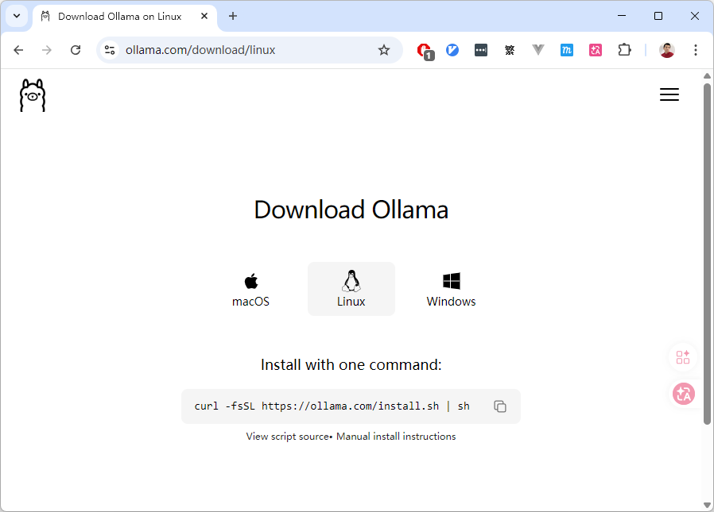

> [!NOTE] 笔记说明
>
> 这篇笔记对应的是《[[关于 AI 的学习路线图]]》一文中所规划的第三个学习阶段。其中记录了我尝试将 LLM 部署到生产环境中，并对其进行相关调试的全过程，以及在该过程中所获得的心得体会。同样的，这些内容也将成为我 AI 系列笔记的一部分，被存储在本人 Github 上的[计算机学习笔记库](https://github.com/owlman/CS_StudyNotes)中，并予以长期维护。

## LLM 的本地部署

正如我之前在《[[关于 AI 的学习路线图]]》一文中所提到的，从学习的角度来说，如果我们要想切实了解 LLM 在计算机软件系统中所处的位置，以及它在生产环境中所扮演的角色，最直接的方式就是尝试将其部署到我们自己所在的计算机环境中，并通过调试来观察它与用户的交互方式。但是，如果想要实现在本地部署 LLM 这种大型应用，我们首先要解决一个很现实的问题：*如何用有限的硬件资源、以可控的方式将其运行起来？*

很显然，就目前阶段的学习任务来看，如果我们从直接编译源码、手动配置推理引擎、管理模型权重与依赖环境来着手，大概率会让自己的学习重心过早地偏向底层细节，而模糊了我们真正想观察的目标 —— LLM 在生产环境中所扮演的角色。因此，我个人会推荐读者从一款名为 Ollama 的开源模型管理工具来着手，该工具可以让人们在不必关心底层实现细节的情况下，快速地完成 LLM 的部署与调试。下面，就让我们来具体介绍一下 Ollama 及其使用方法。

### 了解并安装 Ollama

Ollama 是一款基于 MIT 协议开源的、面向本地环境的 LLM 运行与管理工具，它的核心设计目标是以尽可能低的使用门槛，将“运行一个 LLM”这件事变成一项标准化、可重复的工程操作。具体来说就是，Ollama 在整个与 LLM 相关的系统中大致承担了以下职责：

- **模型生命周期管理**：负责模型的拉取、存储、版本管理与运行；
- **推理环境封装**：屏蔽底层推理引擎、量化方式与硬件差异；
- **统一的调用接口**：通过 CLI 或 API 的形式，对外提供一致的使用方式。

这意味着，用户在使用 Ollama 时并不需要关心模型权重具体存放在哪里、底层使用了哪种推理后端，也不必在一开始就纠结于 CUDA、Metal 或 CPU 优化等问题。很显然，我们在这里选择 Ollama，本质上是一种刻意降低系统复杂度的学习策略，目的是将学习重点放在观察模型本身的行为以及**它与系统其他部分的交互方式**上，但它并不足以应对实际生产环境中的所有问题。

Ollama 的安装过程本身非常简单，读者可以自行前往它的[官方下载页面](https://ollama.com/download)，并根据该页面中的提示，基于自己所在的操作系统完成安装即可，具体如图 1 所示。

**图 1**：Ollama 的下载页面

如果安装过程一切顺利，我们就可以通过在命令行中输入 `ollama` 命令来验证安装是否成功。如果安装成功了，该命令会返回 Ollama 的使用提示信息，如图 2 所示。

**图 2**：Ollama 的使用提示信息

接下来，我们要做的就是选择一款适合当前学习任务的 LLM，并尝试使用 Ollama 来将其部署到我们的本地环境中。

### 选择要部署的模型

关于应该选择什么模型来完成我们在这一阶段的学习，这主要取决于我们**要实验的任务类型**和**电脑配置**。以下这张表是我基于这篇笔记写作的时间点（即 2026 年 2 月），整理出的当前主流的候选模型。

| 推荐模型 | 主要特点与优势 | 适用场景 | 硬件要求参考 |
| -------- | -------------- | -------- | ------------ |
| **通用最佳平衡** | | | |
| **Qwen2.5-7B-Instruct** | 7B 级别综合性能强，指令跟随、长上下文支持好，通用性高。 | 文档总结、内容创作、知识问答、轻量级智能体任务。 | 16GB+ 内存，量化后可降低需求。 |
| **Llama 3.3 系列** | Meta 出品，生态完善，工具调用支持好，3B 版本速度极快。 | 快速对话、多语言任务、对响应速度要求高的应用。 | 3B 模型：8-16GB 内存；8B 模型需求更高。 |
| **专注编程任务** | | | |
| **Qwen3-Coder 系列** | 阿里出品，在代码理解和生成任务上表现优异，有不同尺寸可选。 | 代码解释、补全、调试、学习编程。 | 1.7B/4B/8B 等不同规格，可按需选择。 |
| **Mistral** | Mistral AI 的编程专用模型，擅长生成、调试和解释代码。 | 专注于软件开发辅助的各类任务。 | 推荐 16GB 以上内存。 |
| **资源受限环境** | | | |
| **SmolLM3-3B** | 完全开源，性能优秀，在 3B 级别中表现出色，可控性强。 | 对开源合规要求高，或需要在低配硬件上部署。 | 可在普通笔记本电脑上运行。 |
| **Llama 3.2 3B Instruct** | 体积小、速度快，适合部署在多种设备上，对硬件要求低。 | 需要即时响应的嵌入式应用或移动端场景。 | 8-16GB 内存即可。 |

根据上面的表格，我们可以先参照以下提示来确定选择：

- 如果硬件资源不给力（例如内存容量只有 16GB 或更少，没有独立显卡），可以选择`SmolLM3-3B`或`Llama 3.2 3B Instruct`；
- 如果想优先考虑通用对话和写作，可以选择`Qwen2.5-7B-Instruct`或`Llama 3.3 8B`；
- 如果想优先考虑将其用于编程辅助，`Qwen3-Coder`或`Mistral`是更好的选择；

由于这篇笔记的任务是基于学习的目的来部署 LLM，它最好能让读者在最普通的个人笔记本上进行过程相对流畅的实验，因此我决定接下来就选择`Llama 3.2 3B Instruct`来进行演示了。

### LLM 的具体部署演示

1. **拉取模型**：打开终端，输入命令，例如 `ollama pull llama3.2:3b-instruct`，即可开始拉取模型。
2. **运行测试**：输入 `ollama run llama3.2:3b-instruct`，即可开始交互测试。**强烈建议用你的实际任务去测试**，看看生成质量是否满足要求。

## LLM 的本地调试

- 调试的不是“回答质量”，而是“系统行为”
- 常见失败模式（超时、幻觉、不可解析输出）
- 为什么这些不是“模型 bug”

## LLM 在系统中的角色边界

- 什么决策不能交给模型
- 什么输入必须被结构化
- 为什么 LLM 不应该直接驱动系统状态变化

## 从部署中得到的工程结论

- 哪些问题是部署前没意识到的
- 哪些风险是模型引入后才出现的
- 本阶段对后续 Agent 学习的影响

<!-- 以下为待整理的资料 -->
