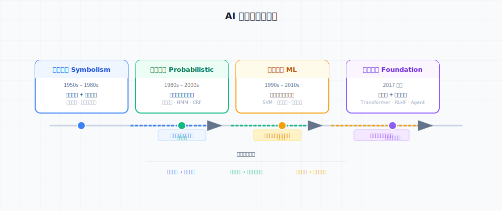
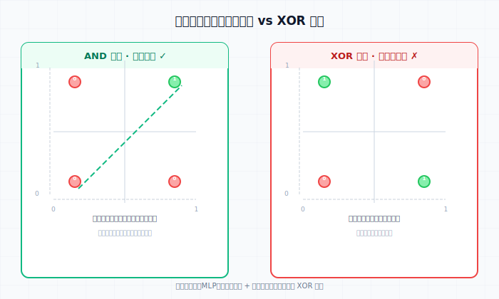
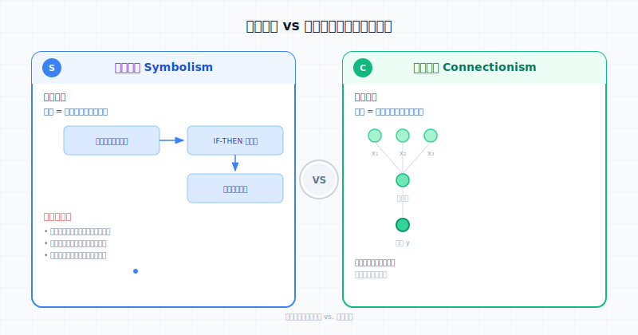
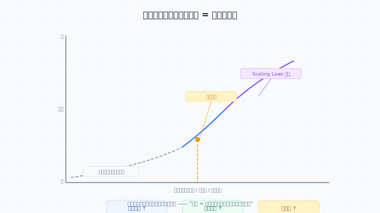

> [!NOTE] 笔记说明
>
> 这篇笔记对应的是我在《[[关于 AI 的学习路线图]]》（该文属私人笔记，未收入公开仓库）中所规划的第一个学习阶段。其中记录了我对 AI 研究方法及其背后数学模型的理解，以及对 AI 能力边界所展开的分析。同样的，这些内容也将成为我 AI 系列笔记的一部分，被存储在本人 Github 上的[计算机学习笔记库](https://github.com/owlman/CS_StudyNotes)中，并予以长期维护。

人工智能（Artificial Intelligence，以下简称 AI），直到目前为止也仍属于一门混合了数学与计算机两大领域的探索性学科，对于究竟应该用何种方法来赋予机器以“智能”这件事，很大程度上取决于学术界对于何谓 AI 的定义。所以，如果想要了解 AI 研究方法的演变，就得先了解学术界在不同阶段对 AI 的定义，以及基于这些定义所提出的数学模型。然后，在使用计算机实现这些数学模型的过程中，我们就会看到各种定义下的 AI 所存在的能力边界。在这篇笔记中，我会顺着这个思路来整理一下 AI 研究方法的演变过程，目的是基于这些方法所使用的数学模型来了解 AI 的能力边界。首先，让我们先通过图 1 来鸟瞰一下 AI 研究方法四个阶段的演进路径。

**图 1**：AI 研究方法的演变路径。

正如读者所见，从符号主义到基础模型时代，每个阶段都以特定 "暴露的边界" 为驱动力向下一个阶段过渡。下面，我将会从符号主义开始，来依次详细介绍这些阶段。

## 从符号主义到联结主义（1950s–1980s）

如今，人们普遍认为 AI 诞生于 1956 年的达特茅斯会议。当时，学术界对 "智能是什么" 就存在着两派不同的研究路线。其中一派认为智能的本质是符号操作与逻辑推理。他们觉得既然人类可以用语言和逻辑来完成思考，机器也应当可以基于符号操作来模拟人类的思考过程，这一派的后来被称为**符号主义（Symbolism）**。另一派则认为人类智能源于大量神经元相互连接的并行计算，他们觉得认知并非是可被显式编程的逻辑规则，而应该是从底层单元的相互作用中涌现出来的，这一路线后来被称为**联结主义（Connectionism）**。

需要说明的是，"符号主义" 与 "联结主义" 的明确划分，是 1980 年代神经网络研究复兴后才被回顾性建构的范式标签，AI 诞生时这两条研究路线并非以对立学派的形式存在。除这两派外，AI 研究的方法还有第三条路线：**行为主义（Actionism）**，这条研究路线强调智能体需通过与环境的实时交互来产生行为（如今我们所熟悉的强化学习方法可视为这一路线在工程化方面的后续延伸）。下面，让我们先重点来看前两条路线的起源与发展。

### 符号主义：智能 = 符号操作与逻辑推理

关于符号主义其背后的数学模型，最早可追溯到戈特弗里德·莱布尼茨（Gottfried Leibniz）提出的"普遍字符"设想。这种设想认为，我们可以先将一切现有的知识编码为符号，然后用某种确定的机械规则来推导出新的知识。1950 年代，赫伯特·西蒙（Herbert Simon）和艾伦·纽厄尔（Allen Newell）提出的**物理符号系统假设（Physical Symbol System Hypothesis）**将这一设想提升成为了当时进行 AI 研究的核心纲领。他们 1976 年对此给出了严格定义：物理符号系统是由一组称为"符号"的物理模型所组成的系统，符号可作为组分出现在另一符号实体之中，系统拥有建立、复制、删除等作用于符号结构的过程。一个系统只要具备智能，就必然能执行对符号的输入、输出、存储、复制、条件转移和建立符号结构这六种操作；反之，能执行这六种操作的系统也一定能够表现出智能。由此推出三个推论：人具有智能，因此人是一个物理符号系统；而计算机本来就是一个物理符号系统，因此它必然具有智能，一定能模拟人脑的思维过程。

#### 典型应用：专家系统

这一假设迅速得到了实践验证。1955-1956 年间，西蒙、纽厄尔与另一位名叫约翰·肖（John Shaw）的计算机科学家合作开发出了一套名为 “逻辑理论家（Logic Theorist，以下简称 LT）” 的系统，这后来被公认为是人类历史上第一个真正可运行的 AI 程序。LT 证明了数学名著《数学原理》52 个定理中的 38 个（后续的改进版本可证明全部 52 个），被公认为是 “用计算机探讨人类智力活动的第一个真正成果”，也是艾伦·图灵（Alan Turing）关于 “机器能否思考” 这个可能性设想的第一次里程碑性质的实验。到了 1960 年，三人又推出了一套名为 “通用问题求解器（General Problem Solver，以下简称 GPS）” 的系统，它可以解决 11 种不同类型的问题，使启发式搜索从特定领域推广为通用的解题框架。

> [!info] 顺带一提
>
> 在开发 LT 的过程中，他们还设计出了 IPL 语言（Information Processing Language），这是世界上最早的 AI 编程语言之一，它将列表（List）设置成了程序的基本数据结构，并使用了递归子程序，这些语言特性后来被约翰·麦卡锡（John McCarthy）借鉴，并重新设计成了如今在学术界大名鼎鼎的 Lisp 语言。

在 LT 和 GPS 奠定了符号主义路线的可行性之后，西蒙和纽厄尔进一步系统化发展了符号主义的两条技术路线：

- **知识表示**：如何用符号结构来描述世界。谓词逻辑（Predicate Logic）用来表达事实与关系，产生式规则（Production Rules）以 IF-THEN 形式编码条件性知识，框架（Frame）和语义网络（Semantic Network）则尝试表达概念间的层次与关联。
- **推理机制**：如何在符号表示上进行逻辑推导。前向链（Forward Chaining）从已知事实出发推导新结论，后向链（Backward Chaining）从目标出发反向寻找证据路径。

上面这些方法的集大成者就是大家所知的 **专家系统（Expert Systems）**。这类系统将某个狭窄领域的人类专家知识提炼为规则库，配上推理引擎来实现自动决策。代表系统包括：用于化学分析的 **DENDRAL**（1965）、用于血液感染诊断的 **MYCIN**（1976），以及用于计算机配置的 **XCON**（1980）。XCON 每年为 DEC 公司节省约 4000 万美元，展示了符号主义路线的商业潜力。

#### 暴露的边界：知识获取瓶颈与脆性

然而，随着专家系统想要进入更广泛的应用领域，符号主义的局限性逐渐暴露出来，因为人们发现：

1. **知识获取瓶颈（Knowledge Acquisition Bottleneck）**：规则需要领域专家逐条提炼和编码，这个过程极其耗时，且专家的知识往往是隐性的、"只可意会不可言传"的，难以形式化为显式规则。
2. **脆性（Brittleness）**：专家系统在知识范围内表现出色，但只要输入稍微超出编码好的规则边界，系统就会完全失效，不会像人类一样"猜一下"或"承认不知道"。
3. **组合爆炸（Combinatorial Explosion）**：当规则数量增多，推理过程中可能的路径组合呈指数级增长，搜索空间变得不可控。
4. **有限理性（Bounded Rationality）**：西蒙在其决策理论研究（并因此获得 1978 年诺贝尔经济学奖）中发现，现实中的决策者不可能获取全部信息、也不可能穷尽所有方案来 "优化" 决策，只能在有限信息和有限计算能力的约束下寻求 "足够好" 的方案。这一洞见同样适用于 AI：无论是符号推理还是概率方法，都无法达到 "完美理性" 所要求的完备信息与无限计算。真正的智能是在资源约束下做出"满意"决策的能力，而非追求全局最优解。

**留下的追问**：如果智能可以被显式编码，为什么编码的知识越多，系统反而越脆弱、越难以维护？是不是 "智能" 这件事本身就不适合自顶向下地写进规则里？

### 联结主义的早期探索：智能 = 神经元连接的计算

与符号主义从"逻辑"出发不同，联结主义从"大脑"出发。1943 年，沃伦·麦卡洛克（Warren McCulloch）和沃尔特·皮茨（Walter Pitts）提出了**人工神经元**的数学模型——一个简单的二值单元，接收加权输入，当总和超过阈值时激活输出。这个模型直接受生物神经元的启发：树突接收信号、胞体整合、轴突输出。

#### 典型应用：感知机

1958 年，弗兰克·罗森布拉特（Frank Rosenblatt）基于麦卡洛克-皮茨神经元模型设计出了一台被称为“感知机（Perceptron）”的计算机，这是一个不仅停留在纸面、还真正在硬件上实现了的系统。从数学的角度来说，该系统的执行逻辑可被描述为：对于给定的输入向量 $\mathbf{x} = (x_1, x_2, \dots, x_n)$ 和权重向量 $\mathbf{w} = (w_1, w_2, \dots, w_n)$，加上偏置项 $b$，它的输出应为：

$$
y = \begin{cases}
1, & \text{if } \sum_{i=1}^{n} w_i x_i + b > 0 \\
0, & \text{otherwise}
\end{cases}
$$

在这里，权重通过**感知机学习算法**自动更新：每次遍历训练样本，若预测错误，则按 $w_i \leftarrow w_i + \eta (y_{\text{true}} - y_{\text{pred}}) x_i$ 调整权重（其中 $\eta$ 为学习率）。

罗森布拉特由此提出并证明了**感知机收敛定理**。即如果训练数据是线性可分的，那么感知机算法一定能在有限步内收敛到一个能正确分类所有样本的解。这意味着机器可以从数据中自动学习知识，而无需人工编写规则——这在当时是对符号主义方法论的直接挑战。

后来，罗森布拉特还将理论付诸工程实践，在 Cornell 航空实验室建造了 **Mark I 感知机**，一台重达数吨的模拟硬件设备。它使用 400 个光电单元作为输入，通过可调电位器实现权重调整，能识别字母和简单图案。罗森布拉特甚至乐观地预言感知机”将能走路、说话、看、写、复制自己”。Mark I 后来被陈列于史密森尼博物馆，作为神经网络早期探索的重要历史见证。

#### 暴露的边界：线性模型与计算瓶颈

然而事实远没有那么乐观，到了 1969 年，马文·明斯基（Marvin Minsky）和西摩·帕珀特（Seymour Papert）在《Perceptrons》一书中严格证明：单层感知机连 XOR（异或）这样的基本逻辑问题都无法解决。这一理论打击直接导致联结主义路线陷入**第一次 AI 寒冬**，研究资金锐减，神经网络方向几乎停滞了近二十年。虽然，后来的研究也证明，多层感知机（MLP）通过引入隐藏层和非线性激活函数完全可以解决 XOR 问题，并具备通用逼近能力。但 1970 年代的计算能力根本无法支撑多层网络的训练，也没有足够的数据来驱动这种数据密集型的方法。联结主义的想法在数学上是正确的，但在当时的工程条件下是实现不了的——这恰好呼应了后来"AI 的每一次突破背后都是算力与数据的量变积累"这一规律。

**图 2** 感知机与 XOR 问题

在图 2 中，我们可以清楚地看到感知机在面对 AND（左）和 XOR（右）时的不同表现。AND 是线性可分的（虚线可以分割两类点），感知机收敛定理保证能找到解；XOR 是线性不可分的，单层感知机无法用一条直线分割点集，这正是明斯基和帕珀特证明的核心结论。

**留下的追问**：如果 AI 不该靠逻辑规则实现，那么从数据中自动学习权重的路能否走通？当前的技术瓶颈是"方向错了"还是"条件未到"？

### 阶段总结

在这里，我们还可以再通过图 3 来直观地对比一下符号主义与联结主义的范式在 1950 年代到 1970 年代的演变。图中的左侧为知识驱动的编码-推理路径，右侧为数据驱动的神经元连接学习路径。

**图 3** 符号主义 vs 联结主义

总而言之，符号主义与联结主义的第一次交锋，以联结主义的失败告终，但留下了此后 AI 发展的核心张力——**知识工程 vs. 数据驱动**。在之后的几十年里，这两种范式此消彼长，最终在深度学习的时代以联结主义的全面胜出而告一段落。但这场争论在今天又以新的形式重现了：大语言模型到底是"学会了符号规则"还是"做对了模式匹配"？

## 概率转向：智能 = 不确定性下的推理（1980s–2000s）

符号主义的困局让学界开始反思：如果 "智能" 不是靠完美逻辑运转的，那它到底是什么？一个越来越清晰的答案是：**智能是在不确定性中做出合理决策的能力**。人类的知识本质上是不完备的，感知是有噪声的，语言是有歧义的——真正的智能不是像欧几里得几何那样从公理推出所有结论，而是能够在信息不完整的情况下做出概率意义上最优的判断。

这一认识催生了 **概率转向（Probabilistic Turn）**：AI 的研究重心从"逻辑推理"转向了"概率推理"。

### 概率图模型：用图结构描述不确定性

概率图模型（Probabilistic Graphical Model, PGM）是这个时期的核心数学工具，它把概率论和图论结合起来，用节点表示随机变量、用边表示变量间的依赖关系，从而将复杂的联合概率分布分解为局部因子的乘积。主要分支包括：

- **贝叶斯网络（Bayesian Network）**：用有向无环图表示因果关系。例如，在医疗诊断中，"吸烟"指向"肺癌"、"肺癌"指向"咳嗽"，给定观测到咳嗽，网络可以反向推断患肺癌的概率。贝叶斯网络的数学基础是贝叶斯定理，推理过程本质上是计算后验概率。
- **隐马尔可夫模型（HMM）**：用于建模随时间演化的序列数据。系统有一个隐藏的状态序列（如语音中的音素），每个状态以一定概率"发射"观测（如声学信号），状态之间的转移也服从概率分布。HMM 曾是语音识别和生物信息学（如基因预测）的标配工具。
- **条件随机场（CRF）**：HMM 的判别式变体，直接建模给定观测条件下的状态序列概率，在序列标注任务（如命名实体识别、词性标注）上表现出色。

### 从知识驱动到数据驱动的范式转变

概率方法的引入带来了一深层次转变：**研究的重心从"如何把知识编码成规则"变成了"如何从数据中估计概率分布"**。这不是一个技术细节的变化，而是对"智能从何而来"这一根本问题的回答发生了变化。

- 在符号主义时代，知识来自于领域专家；
- 在概率方法时代，概率参数来自于数据统计——词频、共现频率、转移概率、条件概率。

这标志着 AI 开始从 **知识驱动（Knowledge-driven）** 走向 **数据驱动（Data-driven）**。虽然当时的数据集规模和计算能力都还非常有限，但这一范式的确立，为后来机器学习时代的全面爆发铺平了道路。

**→ 暴露的边界**：概率方法虽然有效，但它有一个关键短板——**模型的能力上限取决于特征工程的质量**。概率图模型仍然需要人工设计特征（如 n-gram、词性标签、句法特征），这些特征的质量直接决定了模型的表现。模型自己不具备"发现好特征"的能力，它只是在已经选好的特征之间估计概率关系。这一点成为后来表征学习（Representation Learning）突破的直接靶心。

**留下的追问**：如果概率推理比逻辑推理更接近智能的本质，那"智能"是否就只是"在不确定性中做最优推断"？还是说，在这之上还需要更高级的抽象能力？

### 典型应用

概率方法在几个关键任务上取得了显著进展：

- **语音识别**：弗雷德里克·杰里内克（Frederick Jelinek）等人在 IBM 提出的**噪声信道模型（Noisy Channel Model）**将语音识别建模为：给定观测声学信号 $O$，寻找最可能的词序列 $W$，即 $W^* = \arg\max_W P(W|O) \propto \arg\max_W P(O|W)P(W)$。其中 $P(O|W)$ 由声学模型（GMM-HMM）刻画，$P(W)$ 由语言模型（n-gram）刻画。HMM 的形式化定义为：隐藏状态序列 $X_1, X_2, \dots, X_T$ 满足马尔可夫性质 $P(X_t|X_{1:t-1}) = P(X_t|X_{t-1})$，每个状态以发射概率 $P(O_t|X_t)$ 生成观测。HMM 的三个基本问题——评估（前向算法）、解码（维特比算法）、学习（Baum-Welch 算法，即 EM 算法在 HMM 上的特例）——都有高效的动态规划解法。这一框架统治了语音识别长达二十年，直到 2010 年代初被深度神经网络取代。
- **机器翻译**：彼得·布朗（Peter Brown）等人在 IBM 开发的**统计机器翻译系统**以 IBM Model 1–5 为代表，核心思路是用平行语料中的词对齐概率来建立翻译模型。给定源语言句子 $F$ 和目标语言句子 $E$，翻译问题同样被建模为噪声信道：$E^* = \arg\max_E P(E|F) \propto \arg\max_E P(F|E)P(E)$。其中翻译模型 $P(F|E)$ 通过 EM 算法在未标注的双语语料上估计词对齐概率——这可能是 EM 算法最早的大规模成功应用之一。IBM Model 1 从均匀的词对齐概率出发，通过迭代重估逐步收敛到合理的对齐；后续模型逐步引入了词序扭曲（distortion）、fertility（一个源语言词对应几个目标语言词）等更丰富的结构。IBM Model 3 甚至能生成"一个英文词对应多个法文词"这样的不对称对齐。
- **信息检索与排序**：向量空间模型（TF-IDF）和概率检索模型（BM25）为搜索引擎提供了理论基础。BM25 的核心思想是：**一个词在文档中的权重，与其在文档中出现的频率正相关，但受文档长度和全局词频的饱和压制**。这套公式至今仍是搜索引擎召回阶段的事实标准。拉里·佩奇（Larry Page）和谢尔盖·布林（Sergey Brin）在斯坦福提出的 **PageRank** 算法则从另一个角度融入了概率视角——将网页浏览建模为**随机游走（Random Walk）**：一个"随机冲浪者"从当前页面以概率 $d$ 随机点击一个链接，以概率 $1-d$ 跳转到任意页面。PageRank 的稳态分布（即该随机游走的平稳分布）等价于转移矩阵最大特征值对应的特征向量，可以通过幂迭代法高效计算。

### 概率方法的意义

概率转向虽然没有直接解决"如何让机器理解语言"的问题，但它提供了一种重要的方法论：**不要追求完美的确定性模型，而是拥抱不确定性，用概率的语言来描述知识和决策**。这一思路不仅影响了自然语言处理和计算机视觉，也深刻塑造了后来的机器学习——今天几乎所有深度学习模型都可以被理解为在优化某种概率目标函数。例如，图像分类中的 softmax 交叉熵损失，本质上就是多项式逻辑回归的极大似然估计；语言模型的自回归下一个词预测，等价于在最大化序列的条件概率。概率论的框架为"学习"提供了统一的数学语言，无论深度学习的工程表象多么复杂，其底层的优化目标始终是概率性的。

## 统计学习：智能 = 从数据中归纳函数（1990s–2010s）

概率方法确立了"从数据中学习"的基本路线，但它主要关注的是**在已知特征空间上估计概率分布**。下一个阶段的突破来自一个更激进的提问：如果连特征都让机器自己从数据中学呢？这引出了**统计学习理论**的系统发展——将"学习"本身形式化为"从数据中归纳函数"的数学问题。

### 浅层学习时代：三大范式与特征工程

1990 年代到 2000 年代中期，机器学习作为 AI 的一个独立分支正式成型。学界逐步确立了三种基本学习范式：

- **监督学习（Supervised Learning）**：从标注数据中学习输入到输出的映射函数。代表性任务包括分类（垃圾邮件检测）、回归（价格预测）、序列标注（词性标注）。
- **无监督学习（Unsupervised Learning）**：从无标注数据中发现隐藏结构。典型任务包括聚类（用户分群）、降维（可视化）、密度估计（异常检测）。
- **强化学习（Reinforcement Learning）**：智能体通过与环境的交互和奖励信号来学习最优策略。这一范式的独立发展线将在后面专门讨论。

这一时期的核心方法包括 **核方法（Kernel Methods）** 和 **集成方法（Ensemble Methods）**。

**支持向量机（SVM）** 是核方法的代表。它的核心思想是将数据映射到高维空间，使得原本线性不可分的问题在高维空间中变得线性可分，然后找到最大间隔分类超平面。核技巧（Kernel Trick）的巧妙之处在于：不需要显式计算高维映射，只需要定义一个核函数来计算两个样本在高维空间中的内积。SVM 在 1990 年代末到 2000 年代初是分类任务的事实标准，在手写数字识别、文本分类等任务上取得了当时最优的结果。

**集成方法** 的核心思想是"三个臭皮匠顶个诸葛亮"——组合多个弱学习器来得到一个强学习器。主要分支有：

- **Bagging**（如随机森林）：并行训练多个模型，取其预测的平均或投票结果，核心是降低方差。
- **Boosting**（如 AdaBoost、GBDT、XGBoost）：串行训练模型，每个新模型重点关注前一个模型犯错的样本，核心是降低偏差。

XGBoost 在 2010 年代中期的 Kaggle 竞赛中几乎统治了表格数据的预测任务，至今仍有很多生产系统在使用。

**→ 暴露的边界**：浅层学习模型的效果高度依赖于**特征工程（Feature Engineering）**的质量。SVM 的核函数选择、Boosting 的特征组合、随机森林的特征筛选——所有这些都需要人工来"喂给"模型好特征。模型本身不具备从原始数据（像素、音频波形、原始文本）中自动提取有用特征的能力。这成为这一时期最明显的天花板。

**留下的追问**：如果学习的本质是从数据中归纳函数，那为什么特征需要人来设计？能不能让模型自己学习特征表示？

### 表征学习革命：让模型自己学特征（2012–2017）

浅层学习的"特征工程天花板"最终被**深度学习（Deep Learning）**打破。深度学习的关键洞察是：**不用人工设计特征，让模型通过多层非线性变换自动学习层次化的特征表示**。低层学到简单模式（边缘、纹理），中层学到部件（眼睛、轮子），高层学到抽象概念（人脸、汽车）。这被称为**表征学习（Representation Learning）**。

**AlexNet 与 ImageNet 时刻（2012）**

2012 年，亚历克斯·克里热夫斯基（Alex Krizhevsky）、伊利亚·苏茨克维（Ilya Sutskever）和杰弗里·辛顿（Geoffrey Hinton）的 AlexNet 在 ImageNet 大规模视觉识别竞赛中，将 top-5 错误率从 26% 大幅降至 16%，远超所有传统方法。这一突破被称为 **ImageNet 时刻**。它的成功不是来自某个单一理论的突破，而是**数据 + 算力 + 算法**三者同时到达临界点的结果：

- **数据**：ImageNet 数据集包含 1400 万张标注图片，提供了以前无法想象的训练规模。
- **算力**：GPU 的并行计算能力使得训练深层网络成为工程上可行的方案。AlexNet 用两块 GTX 580 GPU 训练了 5–6 天。
- **算法**：ReLU 激活函数缓解了梯度消失问题，Dropout 提供了正则化，数据增强扩展了有效训练样本。

**关键架构演进**

- **卷积神经网络（CNN）**：通过局部连接、权重共享和池化操作，在图像数据上天然具有平移不变性和参数效率优势。CNN 成为此后十年计算机视觉的骨干架构，从 VGG、GoogLeNet 演进到 ResNet、DenseNet。
- **循环神经网络（RNN/LSTM）**：通过循环连接处理序列数据。LSTM（1997）通过门控机制解决了长序列中的梯度消失问题，在机器翻译、语音识别、文本生成等序列任务上取得了突破性进展，直到被 Transformer 取代。

**→ 暴露的边界**：深度学习虽然解决了"特征工程"问题，但它引入了一个新的局限——**任务专用模型的泛化困境**。一个在 ImageNet 上训练的视觉模型无法用在文本上，一个翻译模型不会写摘要。每个任务都有一个独立训练的专用模型，彼此之间不共享知识。这就像一个人学了几十种互不相通的手艺，但没有一个统一的大脑来整合它们。这个问题成为下一阶段——基础模型时代——的突破方向。

**留下的追问**：如果深度网络可以自动学到好特征，那能不能用一个模型同时学会所有任务？表征学习能否通约为一个通用架构？

### 强化学习的独立发展线

与监督/无监督学习主要关注"感知与识别"不同，强化学习关注的是**智能体如何在环境中通过试错来学习最优决策策略**。这套范式始于 1980 年代的动态规划与时间差分学习（TD Learning），但直到 2010 年代才与深度学习结合后展现出真正的潜力。

**从 TD-Gammon 到 DQN**

1992 年，杰拉尔德·特索罗（Gerald Tesauro）的 **TD-Gammon** 利用 TD 学习训练神经网络玩 Backgammon，达到了人类大师水平。这是 RL 的早期亮点，但此后近二十年，RL 在更复杂的环境中进展缓慢。转折发生在 2013–2015 年：DeepMind 的 **DQN（Deep Q-Network）** 将深度神经网络和 Q-Learning 结合起来，在 Atari 2600 游戏上直接从像素输入学习策略，在 49 个游戏中超越了人类专业玩家。

**AlphaGo（2016）的里程碑意义**

2016 年，AlphaGo 在围棋这一被认为是"AI 最难攻克的棋类游戏"中战胜了世界冠军李世石。围棋的状态空间远超国际象棋（约 10¹⁷⁰ vs 10⁴⁷），传统搜索方法不可能穷举。AlphaGo 的创新在于将**蒙特卡洛树搜索（MCTS）** 与 **深度神经网络** 结合——策略网络指导搜索方向，价值网络评估局面。这一成就让 "AI 可以处理人类最复杂的智力活动" 的形象深入公众认知。

**模型无关的通用方法**

在 AlphaGo 之后，RL 社区向更通用的方向发展。**策略梯度方法**（Policy Gradient）直接优化策略参数，不再需要价值函数；**Actor-Critic** 方法融合了策略梯度与价值学习两者的优势；**PPO**（2017）通过裁剪更新幅度解决了 RL 训练不稳定的问题，成为实际的工业标准。这些方法都是**模型无关（Model-Free）**的——智能体不显式建模环境，而是直接从交互经验中学习策略。

**→ 暴露的边界：样本效率与奖励设计。** RL 面临的根本困境是：解决简单的任务需要海量的试错。一个 Atari 游戏需要数千万帧的训练数据，而在现实世界中，这样的试错成本是不可接受的。此外，奖励函数的设计本身就是一门学问——奖励给得稀疏，模型学不会；奖励给得密集，模型学到"刷分"策略而非真正的能力。这些问题在后续 RLHF 的研究中又以新的形式出现了。

## 基础模型时代：智能 = 大规模预训练 + 涌现（2017 至今）

深度学习的成功证明了"让模型自动学习特征"这条路是走通的。但正如上一节结尾所说，**任务专用模型**带来了新的问题：每个任务都需要重新训练一个完整网络，知识无法跨任务迁移，训练成本居高不下。解决这个问题需要一次根本性的转变——从"为每个任务训练一个模型"转向"先训练一个通用模型，再适配到具体任务"。这就是**基础模型（Foundation Model）** 时代的核心思路。

### Transformer 架构的范式革命（2017）

2017 年，Google 在论文《Attention Is All You Need》中提出了 **Transformer** 架构，这是 AI 历史上最重要的单一架构创新之一。Transformer 的核心创新是**自注意力机制（Self-Attention）**：

- 它让每个位置的表示可以通过加权聚合所有其他位置的信息来生成，权重由当前位置与其他位置的相关性动态计算。
- 相比 RNN 的逐步顺序处理，自注意力可以**并行计算**所有位置的表示，大大提升了训练效率。
- 多头注意力（Multi-Head Attention）让模型从多个不同的表示子空间中同时关注信息，进一步增强了表达能力。

自注意力机制的形式化定义是**缩放点积注意力（Scaled Dot-Product Attention）**。将输入序列的每个位置分别投影为查询（Query）、键（Key）和值（Value）三个向量，则输出为：

$$
\text{Attention}(Q, K, V) = \text{softmax}\left(\frac{QK^\mathsf{T}}{\sqrt{d_k}}\right)V
$$

其中 $Q$、$K$、$V$ 分别是查询、键、值矩阵，$d_k$ 是键向量的维度。$QK^\mathsf{T}$ 计算每个位置与其他所有位置的相似度得分；$\sqrt{d_k}$ 的缩放因子防止内积随维度增长过大导致 softmax 梯度消失；softmax 将得分归一化为注意力权重，最后用权重对 $V$ 加权求和得到输出。Transformer 的深远影响在于它提供了一个**通用架构基础**：同一个架构，换不同的输入和训练方式，就可以处理文本、图像、语音、视频等多种模态。CNN 和 RNN 不再不可替代。后续几乎所有重要模型——BERT、GPT 系列、ViT、CLIP、Stable Diffusion——都是在 Transformer 这个公共骨架上的演化和扩展。

### 预训练范式的确立（2018–2022）

有了 Transformer 这个"骨架"，下一步是找到训练它的正确方法。2018 年出现的两个模型分别定义了两条研究路线：

- **BERT**（Google，2018）：采用 **掩码语言模型（Masked Language Model）** 的预训练目标——随机遮盖输入文本中的部分 token，让模型根据上下文预测被遮盖的词。这种双向上下文的理解能力让 BERT 在 GLUE 等自然语言理解基准上取得了巨大突破。BERT 路线倾向于"理解"，适合分类、推理、问答等任务。
- **GPT 系列**（OpenAI，2018–2020）：采用**自回归语言模型**的预训练目标——从左到右逐词预测下一个词。GPT-2（2019）展示了"零样本迁移"的初步迹象，GPT-3（2020）则让学界看到了 **涌现能力（Emergent Abilities）** ——当模型规模超过某个阈值时，突然出现了在较小模型中不存在的能力（如上下文学习、推理、代码生成）。

这一阶段最关键的理论成果是 **规模化定律（Scaling Laws）**。贾里德·卡普兰（Jared Kaplan）等人（2020）的研究揭示了三个可预测的关系：

- 模型性能与**参数数量**、**数据规模**、**计算量**之间存在幂律关系；
- 在合理的范围内，增大这三者中的任何一个都能可预测地提升性能；
- **同时增大三者比单独增大一个更有效**。

Scaling Laws 给出了一个清晰而有力的工程指导：**"更大 = 更好，而且好多少是可以算出来的"**。这直接推动了此后数年"军备竞赛"式的模型规模扩展。

**图 4**：规模化定律的示意图。模型性能随参数量/数据量/计算量的增长呈稳定的幂律提升。当模型规模超过某一阈值时（图中橙色标记点），会涌现出小模型中不存在的能力。

预训练 → 微调（Pre-train → Fine-tune）成为这一时期默认的工作流：在通用大规模数据上预训练一个基础模型，然后在下游任务的小规模标注数据上微调适配。

**→ 暴露的边界**：预训练范式带来了**涌现能力**，但也引入了新的挑战——**价值对齐问题**。预训练模型学到的只是互联网文本的统计分布，而互联网文本中包含了偏见、有毒内容、错误信息和价值观冲突。一个纯粹的"最大似然"模型并不能保证在交互中表现出符合人类期望的行为。这就引出了下一个主题：对齐。

### 对齐与可控性（2022 至今）

**指令微调（Instruction Tuning）** 是朝着可控性的第一步——让模型在特定指令格式的数据上微调，学会"听懂人话"。Flan-T5 等模型证明了：即使不改变模型大小，单纯通过多样化的指令数据微调就能显著提升模型遵循指令的能力。

真正改变行业格局的是 **RLHF（Reinforcement Learning from Human Feedback，人类反馈强化学习）**。InstructGPT（2022）和后续的 ChatGPT 采用了如下训练流程：

1. **监督微调（SFT）**：在人类编写的指令-回答对上进行初始微调。
2. **奖励建模（Reward Modeling）**：训练一个奖励模型，学会判断"哪个回答更好"。
3. **强化学习微调（RL Fine-tuning）**：用 PPO 算法根据奖励模型来优化语言模型的输出策略。

RLHF 的本质是**将"符合人类偏好"作为优化目标显式引入训练过程**，而不仅仅是拟合文本分布。这让模型的输出更加有用、安全和符合指令要求，是 ChatGPT 成功的关键技术因素。

与 RLHF 并行的还有**直接偏好优化（DPO）** 等方法，它们绕过了单独的奖励模型，直接在偏好数据上优化策略，降低了 RLHF 的工程复杂度。**红队测试（Red Teaming）** 则是对抗性地发现模型安全漏洞，形成持续的安全对齐闭环。

**→ 暴露的边界：价值对齐的根本困难。** 对齐技术虽然有效，但无法从根本上解决一个哲学层面的问题——**价值观的多元性**。在开放领域中，"什么是对的"本身就是一个没有唯一答案的问题。RLHF 实质上将开发团队（或其所依赖的标注者群体）的价值观固化到了模型中，这在跨文化、跨政治体制的场景下会引发持续的争议和挑战。此外，对齐过程本身会降低模型的输出多样性，存在"过度对齐"的风险。从技术层面看，RLHF 中的奖励建模阶段也遭遇了经典 RL 中同样的奖励设计困境——人类偏好难以用精确的标量分数来捕捉，标注者之间的一致性、奖励模型的泛化能力以及 Reward Hacking 风险，都是尚未完全解决的问题。

**留下的追问**：对齐更多是在"约束"能力，而不是在"扩展"能力。那下一步，我们如何让模型在可控的前提下做更多的事？

### 工具使用与 Agent 化

对齐让模型变得更可控，但模型仍然是"静态"的——训练完成后，它的知识就冻结在参数中了，无法与外部世界交互。**Agent 化（Agentification）** 将语言模型从"对话引擎"扩展为"行动引擎"。

- **Function Calling**：模型可以输出结构化的函数调用指令，由外部系统执行（如查询数据库、调用 API、操作文件）。这本质上是将模型的输出端口从"纯文本"扩展为"文本 + 可执行动作"。
- **检索增强生成（RAG）**：在生成回答时，先从外部知识库中检索相关文档，然后将检索结果作为上下文输入模型生成回答。RAG 在不重新训练模型的前提下，部分解决了知识更新（训练数据过时）和幻觉（缺乏事实支持）的问题。后续演化出 Self-RAG、Corrective RAG 等变体。
- **多智能体协作（Multi-Agent Systems）**：多个 AI 智能体各自承担不同角色，通过对话和工具调用协作完成复杂任务。AutoGen（Microsoft）、CrewAI、MetaGPT 等框架将这一理念付诸实践，展示了"分工协作"在 AI 系统中的潜力。
- **规划与推理增强**：**思维链（Chain-of-Thought, CoT）** 通过引导模型"一步步思考"来提升推理正确率，本质上是给模型提供了一个"显式推理工作区"。**思维树（Tree-of-Thoughts, ToT）** 在此基础上引入搜索——同时探索多条推理路径，用回溯机制选择最优分支，处理需要规划和探索的复杂问题。

**→ 暴露的边界 | 长程一致性与规划能力的局限**：当前的模型在短程推理（"一步步想"）上表现不错，但在需要长程规划的任务中（如写一个完整的小说、制定一个复杂项目计划），仍然容易出现前后矛盾、"遗忘"早期做出的决策、局部优化导致全局次优等问题。部分研究者认为，这是由 Transformer 的注意力机制本身的天花板决定的——固定长度的上下文窗口使得信息必须经过压缩，而压缩就意味着丢失。

### 多模态与统一架构

基础模型时代的最后一个趋势是**模态统一**。最初的语言模型只能处理文本，视觉模型只能处理图像——但现实世界的智能需要同时处理多种感官输入。

在统一的端到端多模态模型成熟之前，生成式方法已经以独立任务的形式展现了潜力。伊恩·古德费洛（Ian Goodfellow）在 2014 年提出的**生成对抗网络（GAN）** 将生成器与判别器的对抗博弈作为训练信号，开创了 AI 生成内容的先河，但其训练不稳定和模式坍塌等问题也暴露了纯粹对抗训练的局限。

- **CLIP**（OpenAI，2021）通过对比学习将文本和图像映射到同一个表示空间，用 4 亿个图文对训练，实现了图文检索和零样本图像分类，成为多模态模型的基础组件。
- **GPT-4V**（2023）等模型将视觉理解和语言推理整合到一个端到端的模型中，用户可以直接输入图片并与之对话。
- **文生图/视频** 方面，**Stable Diffusion** 基于潜在扩散模型，将 Transformer 架构用于图像生成；**Sora**（OpenAI，2024）则将类似的思路扩展到视频生成，展示了模型对物理世界运动规律的一定程度理解。

**→ 暴露的边界：物理常识与真正世界模型的缺失。** 即使是最先进的多模态模型，也经常违反基本的物理常识（如物体消失后不会重新出现、水杯倒置后水会流出来）。Sora 生成的视频中，物体的轨迹、遮挡关系、光影一致性往往在几秒内就会出现违反物理规律的偏差。这表明模型学到的是**视觉统计模式**而非**物理世界模型**——它知道"看起来像什么"，但不真正理解"为什么是这样"。

## 能力边界的系统审视

前四节中，我们在每个历史阶段都标注了当时暴露出的具体边界——知识获取瓶颈、特征工程天花板、样本效率、幻觉、长程一致性、价值对齐困难、物理常识缺失等。但还有一些边界是**跨阶段、跨范式的**，它们不是某个特定方法的问题，而是"智能"这件事本身在理论、工程和社会层面上的根本约束。将这些硬约束放在一起审视，有助于我们对 AI 在当前阶段的能力上限形成一个更清醒的判断。

### 理论层面的硬约束

以下约束来自数学和计算机科学的底层定理，它们不随技术进步而改变——是任何计算系统都无法逾越的边界。

**没有免费午餐定理（No Free Lunch, NFL）**

大卫·沃尔珀特（David Wolpert）和威廉·麦克里迪（William Macready）（1997）证明：对所有可能的目标函数求平均，任何两个算法的表现是一样的。换句话说，**不存在一个在所有问题上都优于其他算法的通用学习器**。如果你把所有可能的数据分布等权平均，没有哪个算法比随机猜测更好。NFL 定理的实际含义是：我们所谓的"模型 A 比模型 B 好"，永远是在特定数据分布和任务上的表现。这提醒我们，不能期望"通用人工智能"在所有任务类别上都同样出色——它必然在某些任务上优于人类，在另一些任务上不如人类。

**计算复杂度与可学习性（PAC 学习框架）**

莱斯利·瓦利安特（Leslie Valiant）的 **PAC（Probably Approximately Correct）学习理论** 为"什么是可以从样本中学习的"提供了形式化的数学框架。PAC 理论的一个重要结论是：学习一个概念所需的样本数量（样本复杂度）取决于假设空间的复杂度——学的目标越复杂，需要的数据就越多。这正好对应了基础模型时代"万亿 token 的预训练"这一事实。但 PAC 学习框架也暴露了一个更深层次的约束：**即使样本无限多，某些问题在多项式时间内也是不可学习的**。这意味着算力规模不是万能钥匙。

**哥德尔不完备与形式系统内的自我指涉**

哥德尔不完备定理（1931）证明：在任何包含初等算术的一致形式系统中，都存在无法在该系统内证明的真命题。这一定理在 AI 领域的含义仍然值得深思：如果一个 AI 系统基于一套形式化的规则（无论是显式逻辑规则还是隐式参数规则），那么它是否也无法"理解"超出自身形式边界的东西？图灵在 1936 年关于停机问题的证明给出了类似的结论——任何计算系统都无法完美地判断自身的终止状态。这些结论是否意味着以"形式计算"为基础的 AI 永远有一个"看不见的盲点"？这是一个还没有定论的问题，但它提醒我们，AI 系统的自我理解和自我修正存在理论上的天花板。

### 工程与社会的软约束

与理论硬约束不同，以下约束在当前条件下成立，但可能随着技术进步或社会共识的演变而发生变化。

**能源与算力可持续性**

Scaling Laws 让"更大 = 更好"成为过去十年 AI 发展的主旋律。但这条路的可持续性正在受到质疑：训练 GPT-4 的估算能耗在数万兆瓦时级别，单次训练耗电量相当于数百个家庭的年用电量。这不仅是成本问题，也是环境问题。此外，算力本身受制于半导体工艺的物理极限——摩尔定律正在放缓，而 AI 对算力的需求仍在指数增长。这促使研究者开始探索"高效 AI"路线——模型压缩、蒸馏、稀疏化——但到目前为止，压缩后的模型在能力上仍然不如同等规模的从头训练模型。

**数据版权与隐私**

基础模型的训练数据包含了大量受版权保护的文本和图像，由此引发的诉讼和争议正在成为行业的核心风险。与此同时，隐私保护（如训练数据中是否包含个人信息）和安全审查也在不断收紧。数据瓶颈可能是比算力瓶颈更先到来的约束——如果说芯片还可以换代，那互联网上高质量的文本数据可能已经接近消耗殆尽（一些估计认为，人类可用的公开文本数据将在 2026–2027 年前被完全消耗）。

**评估危机：基准饱和与 Goodhart 定律**

"如何衡量 AI 的能力"本身就是 AI 研究的瓶颈之一。当某个基准被作为公开目标后，研究者会针对性地优化，导致基准分数快速饱和——最终分数不能代表模型在该任务上的真实能力。这就是 **Goodhart 定律** 的体现：当一个指标成为目标时，它就不再是一个好指标了。MMLU 在推出后不到两年就被多个模型"刷满"，HellaSwag、GSM8K 等基准也相继饱和。这导致了一个困境：我们越来越难以判断模型到底是在"真正变强"还是在"更好地迎合测试"。

### 开放问题：什么可能仍是禁区

什么是目前的 AI 范式在原理上最难突破的问题？以下三个方向被普遍认为是当前的"边界"，而不是短期内的"进展"。

**真正的世界模型与物理常识**

如前所述，当前模型学到的是数据中的统计模式，而不是因果结构。一个没有物理常识的系统能否通过大量视频数据的训练"悟出"物理定律？还是说，真正的世界理解需要一种不同的学习范式（如具身认知、因果推理的显式建模）？这个问题还在争论之中。

**主观体验（意识问题）与 Qualia**

"感觉"——红色的红、疼痛的痛、快乐的心情——这些主观体验在哲学上被称为 **Qualia**。一个系统是否可以拥有 Qualia？如果它表现出来的行为完全像一个有感受的人，那它在"功能"上已经具备了同理心和自我报告的能力，但这是否等同于"真正感觉到"？这个问题已经超出 AI 研究范畴，进入心灵哲学领域。目前的主流共识是：无论大语言模型表现得多么像"有意识"，它仍然没有理由被认为拥有主观体验——但这只是一个哲学判断，而非可验证的科学结论。

**创造性理解 vs. 统计重组**

AI 能生成诗歌、绘画、音乐，但这些生成本质上是"在训练数据的分布空间中进行插值和重组"，还是"真正理解了创造对象的本质"？这个问题可以追溯到第一节留下的追问——大语言模型到底是在操作符号还是在做模式匹配？如果创造力仅仅是"在高维空间中找到一条新颖但合理的路径"，那当前的模型已经具备一定程度的创造力。但如果创造力需要"有意识地选择表达什么"，那当前的模型距离真正的创造力还很遥远。

## 演变规律与启示

回顾整个 AI 研究方法的演变，我们可以看到几条贯穿性的规律。它们既是过去七十年的总结，也可能暗示未来的方向。

### 三次转向

**从知识驱动到数据驱动。** AI 的起点是"把人类的知识编码给机器"（符号主义），然后变成"从数据中自动学习知识"（概率方法 → 机器学习），再到"不只是学知识，还学怎么表示知识"（表征学习 → 基础模型）。每一次转向，都是将更多原本需要人工完成的工作交给数据和算法。这条路线已经走了很远，但我们也应该看到：人工参与的环节并没有消失，而是向上游迁移了——标注者、架构设计师、对齐工程师替代了规则工程师。

**从专用系统到通用基础模型。** 早期的 AI 系统都是为单一任务设计的（一个专家系统只能诊断血液感染，不能做化学分析）。预训练范式打破了这一格局：一个基础模型经过微调后可以处理成百上千种任务，甚至涌现出预训练阶段没有明确训练过的能力。这是 AI 从"工具"走向"平台"的关键一步。但这个转向是否意味着"真正的通用智能"正在到来，还是仅仅是"能力覆盖范围的扩展"？目前来看更倾向于后者——通用基础模型在越来越多的任务上达到或超过专业水平，但在"理解自己在做什么"的意义上，与人类智能仍有本质差异。

**从独立组件到端到端学习。** 传统 NLP/视觉系统由多个独立模块串联而成（分词 → 词性标注 → 句法分析 → 语义解释），每个模块的错误会积累传递。深度学习推动了 **端到端学习（End-to-End Learning）**——原始输入直接映射到最终输出，中间表示由模型自动学习。这种"大一统"的方法大幅降低了工程复杂度，但同时也带来了可解释性的丧失——我们不再知道"模型到底是靠什么特征做出决策的"。

### 不变的核心问题

在上述变迁中，有三个问题始终处于 AI 研究的核心位置：

**泛化（Generalization）始终是第一性原理。** 无论技术如何变迁，"模型在未见过的数据上表现如何"始终是衡量 AI 能力的最终标准。符号主义依靠逻辑规则的泛化，统计方法依靠概率分布的泛化，深度学习依靠表征的泛化——方法在变，但问题没变。

**表示（Representation）决定了能力的上限。** 整部 AI 研究方法演变史，本质上是一部**表示方式**的进化史：符号表示 → 概率图表示 → 手工特征向量 → 深度网络自动学习的分层表示 → 预训练模型的上下文相关表示。每一次"表示"的突破都带来了能力的跃迁。可以说，**"智能"在很大程度上就是"找到一个好的表示"**。

**数据质量始终 >= 模型大小。** 尽管 Scaling Laws 吸引了大量关注，但在同等算力约束下，数据质量对模型性能的影响往往大于模型规模——甚至在很多场景下决定性地大。这从反面印证了一个更根本的观察：既然模型的能力源自对训练数据分布的拟合，那么数据的质量、覆盖度和多样性就从根本上决定了模型的能力天花板。

**约束（Constraints）始终定义了可行方案的边界。** 西蒙的有限理性理论指出，任何智能系统都只能在有限的信息、有限的计算资源和有限的时间内做出"足够好"的决策——这一洞见贯穿了整部 AI 历史。符号主义受制于专家知识的获取成本，概率方法受制于手工特征的表征上限，深度学习受制于样本效率和算力开销，基础模型时代则受制于数据耗尽与能源消耗。每一次"更大的模型"看似突破了旧约束，但随之而来的是新的、更高量级的约束。理解这一点有助于保持清醒：AI 的进步不是"解除约束"的过程，而是"在更高效的量级上重新面对约束"的过程。

### 对学习者的建议

最后，作为一个学习者的个人笔记，我想记录下几点对自己后续学习的提醒：

1. **追溯思想源头，而非追逐 SOTA。** AI 的发展节奏越来越快，每年数千篇论文、数十个新模型。但如果只盯着最新结果，很容易理解表面的"变化"而错过底层的"不变"。回来读 1950 年代的原始论文、读 1990 年代的统计学习理论、读 2017 年的 Transformer 原论文，这些"思想源头"往往比当下流行的变体版本更加清晰和本质。
2. **动手验证关键论文的核心假设。** 纸上得来终觉浅。对于自己在学习路线图中遇到的关键论文，至少应该做到：搞懂它的数学假设、跑通一个最小实现、理解它在什么条件下成立、在什么条件下失效。这个习惯的价值在长期积累中会越来越明显。
3. **在学习路线图各阶段中交叉印证。** AI 的各个子领域（逻辑、概率、统计、神经网络、强化学习、多模态）并不是孤立的。在学一个新领域时，试着回到本文中的"定义"框架来问自己：这个分支如何定义智能？它的数学模型和之前学过的有什么不同？它暴露了什么新的边界？这种交叉印证能帮你把碎片知识织成一张网。

## 参考资料

- 文档资料：
  - [雪球网：赫伯特·西蒙和艾伦·纽厄尔——人工智能符号主义学派的创始人](https://xueqiu.com/3993902801/83453267)；

- 视频资料：
  - 从小学数学到 MoE：LLM进化史：[YouTube 链接](https://www.youtube.com/watch?v=nySTPhneEjw) / [Bilibili 链接](https://www.bilibili.com/video/BV1CgZABxEcy)；
