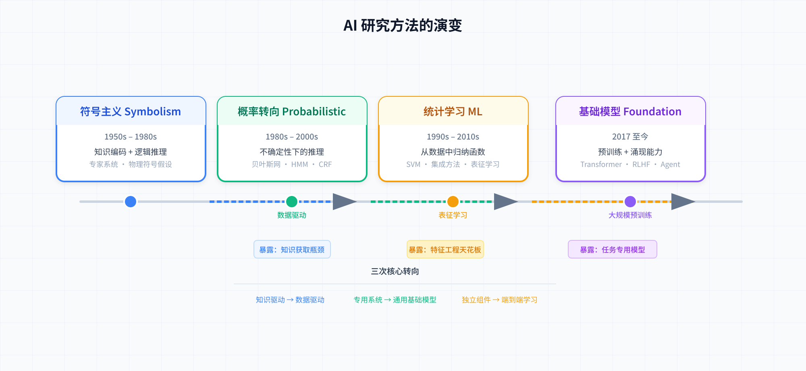
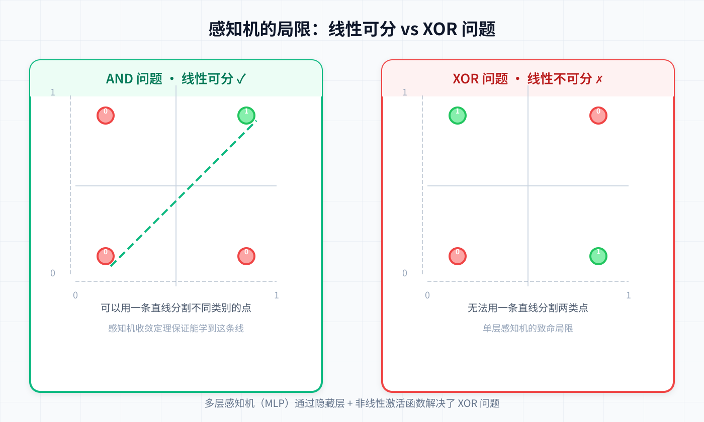
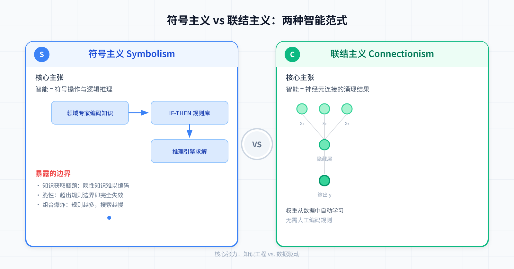
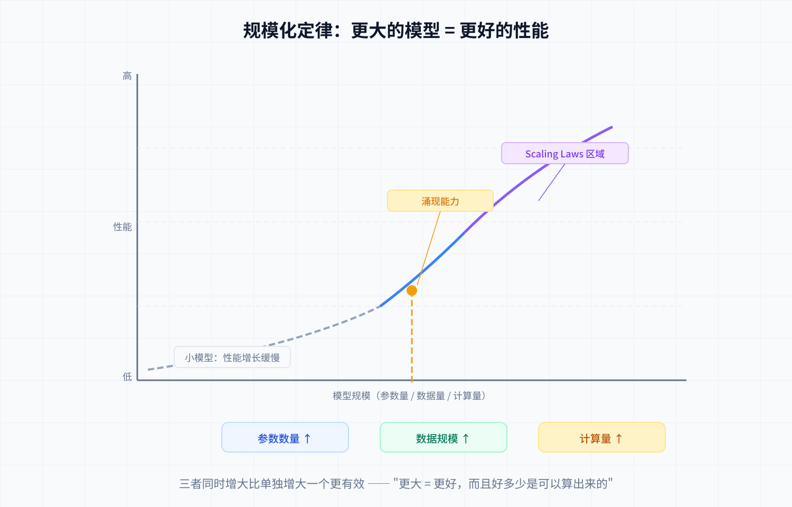

> [!NOTE] 笔记说明
>
> 这篇笔记对应的是我在《[[关于 AI 的学习路线图]]》中所规划的第一个学习阶段。其中记录了我对 AI 研究方法及其背后数学模型的理解，以及对 AI 能力边界所展开的分析。同样的，这些内容也将成为我 AI 系列笔记的一部分，被存储在本人 Github 上的[计算机学习笔记库](https://github.com/owlman/CS_StudyNotes)中，并予以长期维护。

人工智能（Artificial Intelligence，以下简称 AI），直到目前为止也仍属于一门混合了数学与计算机两大领域的探索性学科，对于究竟应该用何种方法来赋予机器以“智能”这件事，很大程度上取决于学术界对于何谓 AI 的定义。所以，如果想要了解 AI 研究方法的演变，就得先了解学术界在不同阶段对 AI 的定义，以及基于这些定义所提出的数学模型。然后，在使用计算机实现这些数学模型的过程中，我们就会看到各种定义下的 AI 所存在的能力边界。在这篇笔记中，我会顺着这个思路来整理一下 AI 研究方法的演变过程，目的是基于这些方法所使用的数学模型来了解 AI 的能力边界。首先，让我们先通过图 1 来鸟瞰一下 AI 研究方法四个阶段的演进路径。

<!--  -->

**图 1**：AI 研究方法的演变路径。

正如读者所见，从符号主义到基础模型时代，每个阶段都以特定 "暴露的边界" 为驱动力向下一个阶段过渡。下面，我将会从符号主义开始，来依次详细介绍这些阶段。

## 从符号主义到联结主义（1950s–1980s）

如今，人们普遍认为 AI 诞生于 1956 年的达特茅斯会议。当时，学术界对 "智能是什么" 就存在着两派不同的研究路线。其中一派认为智能的本质是符号操作与逻辑推理。他们觉得既然人类可以用语言和逻辑来完成思考，机器也应当可以基于符号操作来模拟人类的思考过程，这一派的后来被称为**符号主义（Symbolism）**。另一派则认为人类智能源于大量神经元相互连接的并行计算，他们觉得认知并非是可被显式编程的逻辑规则，而应该是从底层单元的相互作用中涌现出来的，这一路线后来被称为**联结主义（Connectionism）**。

需要说明的是，"符号主义" 与 "联结主义" 的明确划分，是 1980 年代神经网络研究复兴后才被回顾性建构的范式标签，AI 诞生时这两条研究路线并非以对立学派的形式存在。除这两派外，AI 研究的方法还有第三条路线：**行为主义（Actionism）**，这条研究路线强调智能体需通过与环境的实时交互来产生行为（如今我们所熟悉的强化学习方法可视为这一路线在工程化方面的后续延伸）。下面，让我们先重点来看前两条路线的起源与发展。

### 符号主义：智能 = 符号操作与逻辑推理

关于符号主义其背后的数学模型，最早可追溯到戈特弗里德·莱布尼茨（Gottfried Leibniz）提出的"普遍字符"设想。这种设想认为，我们可以先将一切现有的知识编码为符号，然后用某种确定的机械规则来推导出新的知识。如果使用现代数学语言来表述，我们大致可以将这一设想描述为一个由以下要素构成的形式系统 $\mathcal{L}$：

- **基本符号集** $\Sigma = \{c_1, c_2, \dots, c_n\}$：每个 $c_i$ 表示一个原子概念（如"人"、"动物"、"有死"）；
- **合式表达式集** $\text{Expr}(\Sigma)$：由 $\Sigma$ 中的符号按语法规则组合而成的所有合法表达式，用于表示复合概念与命题；
- **推理规则集** $R = \{r_1, r_2, \dots, r_m\}$：一组机械可计算的规则，每条规则 $r_i: \text{Expr}(\Sigma)^k \to \text{Expr}(\Sigma)$ 接受 $k$ 个表达式并输出一个新表达式。例如三段论可表示为 $r_{\text{syllogism}}(A \to B,\; B \to C) = A \to C$。

令初始知识库 $K_0 \subseteq \text{Expr}(\Sigma)$ 为已知真理的集合，一次推导就是从 $K_0$ 出发反复应用 $R$ 中的规则进行迭代：

$$
K_{t+1} = K_t \cup \{\, r(e_1,\dots,e_k) \mid r \in R,\; e_1,\dots,e_k \in K_t \,\}
$$

1950 年代，赫伯特·西蒙（Herbert Simon）和艾伦·纽厄尔（Allen Newell）就是基于以上这个用数学工具所做的设想进一步提出了 **物理符号系统假设（Physical Symbol System Hypothesis）**，并将其提升成为了当时进行 AI 研究的核心纲领。

依据他们在 1976 年给出的严格定义：物理符号系统是由一组称为 "符号" 的物理模型所组成的系统，符号可作为组分出现在另一符号实体之中，系统拥有建立、复制、删除等作用于符号结构的过程。一个系统只要具备智能，就必然能执行对符号的输入、输出、存储、复制、条件转移和建立符号结构这六种操作；反之，能执行这六种操作的系统也一定能够表现出智能。

由此推出两个核心推论：人具有智能，因此人是一个物理符号系统；而计算机本来就是一个物理符号系统，因此它必然具有智能，一定能模拟人脑的思维过程。当然了，哥德尔不完备定理后来证明：在任何足够丰富的 $\mathcal{L}$ 中都存在真而不可证的命题。这是后话。

#### 典型应用：专家系统

这一假设迅速得到了实践验证。1955-1956 年间，西蒙、纽厄尔与另一位名叫约翰·肖（John Shaw）的计算机科学家合作开发出了一套名为 “逻辑理论家（Logic Theorist，以下简称 LT）” 的系统，这后来被公认为是人类历史上第一个真正可运行的 AI 程序。LT 证明了数学名著《数学原理》52 个定理中的 38 个（后续的改进版本可证明全部 52 个），被公认为是 “用计算机探讨人类智力活动的第一个真正成果”，也是艾伦·图灵（Alan Turing）关于 “机器能否思考” 这个可能性设想的第一次里程碑性质的实验。到了 1960 年，三人又推出了一套名为 “通用问题求解器（General Problem Solver，以下简称 GPS）” 的系统，它可以解决 11 种不同类型的问题，使启发式搜索从特定领域推广为通用的解题框架。

> [!info] 题外话
>
> 在开发 LT 的过程中，他们还设计出了 IPL 语言（Information Processing Language），这是世界上最早的 AI 编程语言之一，它将列表（List）设置成了程序的基本数据结构，并使用了递归子程序，这些语言特性后来被约翰·麦卡锡（John McCarthy）借鉴，并重新设计成了如今在学术界大名鼎鼎的 Lisp 语言。

在 LT 和 GPS 奠定了符号主义路线的可行性之后，西蒙和纽厄尔进一步系统化发展了符号主义的两条技术路线：

- **知识表示**：如何用符号结构来描述世界。谓词逻辑（Predicate Logic）用来表达事实与关系，产生式规则（Production Rules）以 IF-THEN 形式编码条件性知识，框架（Frame）和语义网络（Semantic Network）则尝试表达概念间的层次与关联。
- **推理机制**：如何在符号表示上进行逻辑推导。前向链（Forward Chaining）从已知事实出发推导新结论，后向链（Backward Chaining）从目标出发反向寻找证据路径。

上面这些方法的集大成者就是大家所知的 **专家系统（Expert Systems）**。这类系统将某个狭窄领域的人类专家知识提炼为规则库，配上推理引擎来实现自动决策。代表系统包括：用于化学分析的 **DENDRAL**（1965）、用于血液感染诊断的 **MYCIN**（1976），以及用于计算机配置的 **XCON**（1980）。XCON 每年为 DEC 公司节省约 4000 万美元，展示了符号主义路线的商业潜力。

#### 暴露的边界：知识获取瓶颈与脆性

然而，随着专家系统想要进入更广泛的应用领域，符号主义的局限性逐渐暴露出来，因为人们发现：

1. **知识获取瓶颈（Knowledge Acquisition Bottleneck）**：规则需要领域专家逐条提炼和编码，这个过程极其耗时，且专家的知识往往是隐性的、"只可意会不可言传"的，难以形式化为显式规则。
2. **脆性（Brittleness）**：专家系统在知识范围内表现出色，但只要输入稍微超出编码好的规则边界，系统就会完全失效，不会像人类一样"猜一下"或"承认不知道"。
3. **组合爆炸（Combinatorial Explosion）**：当规则数量增多，推理过程中可能的路径组合呈指数级增长，搜索空间变得不可控。
4. **有限理性（Bounded Rationality）**：西蒙在其决策理论研究（并因此获得 1978 年诺贝尔经济学奖）中发现，现实中的决策者不可能获取全部信息、也不可能穷尽所有方案来 "优化" 决策，只能在有限信息和有限计算能力的约束下寻求 "足够好" 的方案。这一洞见同样适用于 AI：无论是符号推理还是概率方法，都无法达到 "完美理性" 所要求的完备信息与无限计算。真正的智能是在资源约束下做出"满意"决策的能力，而非追求全局最优解。

**留下的追问**：如果智能可以被显式编码，为什么编码的知识越多，系统反而越脆弱、越难以维护？是不是 "智能" 这件事本身就不适合自顶向下地写进规则里？

### 联结主义的早期探索：智能 = 神经元连接的计算

与符号主义从"逻辑"出发不同，联结主义从"大脑"出发。1943 年，沃伦·麦卡洛克（Warren McCulloch）和沃尔特·皮茨（Walter Pitts）提出了 **人工神经元** 的数学模型：一个简单的二值单元，接收加权输入，当总和超过阈值时激活输出。这个模型直接受生物神经元的启发：树突接收信号、胞体整合、轴突输出。

#### 典型应用：感知机

1958 年，弗兰克·罗森布拉特（Frank Rosenblatt）基于麦卡洛克-皮茨神经元模型设计出了一台被称为“感知机（Perceptron）”的计算机，这是一个不仅停留在纸面、还真正在硬件上实现了的系统。从数学的角度来说，该系统的执行逻辑可被描述为：对于给定的输入向量 $\mathbf{x} = (x_1, x_2, \dots, x_n)$ 和权重向量 $\mathbf{w} = (w_1, w_2, \dots, w_n)$，加上偏置项 $b$，它的输出应为：

$$
y = \begin{cases}
1, & \text{if } \sum_{i=1}^{n} w_i x_i + b > 0 \\
0, & \text{otherwise}
\end{cases}
$$

在这里，权重通过**感知机学习算法**自动更新：每次遍历训练样本，若预测错误，则按 $w_i \leftarrow w_i + \eta (y_{\text{true}} - y_{\text{pred}}) x_i$ 调整权重（其中 $\eta$ 为学习率）。

罗森布拉特由此提出并证明了**感知机收敛定理**。即如果训练数据是线性可分的，那么感知机算法一定能在有限步内收敛到一个能正确分类所有样本的解。这意味着机器可以从数据中自动学习知识，而无需人工编写规则：这在当时是对符号主义方法论的直接挑战。

后来，罗森布拉特还将理论付诸工程实践，在 Cornell 航空实验室建造了 **Mark I 感知机**，一台重达数吨的模拟硬件设备。它使用 400 个光电单元作为输入，通过可调电位器实现权重调整，能识别字母和简单图案。罗森布拉特甚至乐观地预言感知机 ”将能走路、说话、看、写、复制自己”。Mark I 后来被陈列于史密森尼博物馆，作为神经网络早期探索的重要历史见证。

#### 暴露的边界：线性模型与计算瓶颈

然而事实远没有那么乐观，从下面的图 2 中，我们可以清楚地看到感知机在面对 AND（左）和 XOR（右）时的不同表现。AND 是线性可分的（虚线可以分割两类点），感知机收敛定理保证能找到解；XOR 是线性不可分的，单层感知机无法用一条直线分割点集。

<!--  -->

**图 2** 感知机与 XOR 问题

这正是马文·明斯基（Marvin Minsky）和西摩·帕珀特（Seymour Papert）在 1969 年于《Perceptrons》一书中提出的严格证明：单层感知机连 XOR（异或）这样的基本逻辑问题都无法解决。这一理论打击直接导致联结主义路线陷入 **第一次 AI 寒冬**，研究资金锐减，神经网络方向几乎停滞了近二十年。

虽然，后来的研究也证明，多层感知机（MLP）通过引入隐藏层和非线性激活函数完全可以解决 XOR 问题，并具备通用逼近能力。但 1970 年代的计算能力根本无法支撑多层网络的训练，也没有足够的数据来驱动这种数据密集型的方法。联结主义的想法在数学上是正确的，但在当时的工程条件下是实现不了的：这恰好呼应了后来 "AI 的每一次突破背后都是算力与数据的量变积累" 这一规律。

### 阶段总结

我们还可以再通过图 3 来鸟瞰式地对比一下符号主义与联结主义的范式在 1950-1970 这二十年间的演变过程。图中的左侧为知识驱动的编码-推理路径，右侧为数据驱动的神经元连接学习路径。

<!--  -->

**图 3** 符号主义 vs 联结主义

总而言之，符号主义与联结主义的第一次交锋，以联结主义的失败告终，但留下了此后 AI 发展的核心张力：**知识工程 vs. 数据驱动**。在之后的几十年里，这两种范式此消彼长，最终在深度学习的时代以联结主义的全面胜出而告一段落。

不过，符号主义的搜索路线并未就此消亡。1997 年，IBM 的 **深蓝（Deep Blue）** 依靠暴力搜索与人工编写的评估函数击败了国际象棋世界冠军加里·卡斯帕罗夫（Garry Kasparov）。这是 AI 首次在智力博弈中正面战胜人类顶尖选手。深蓝的成功证明了在封闭博弈领域，穷举搜索与手工知识仍能达到人类巅峰；但它也暴露了符号主义的终极局限：深蓝是一个只会下国际象棋的机器，无法理解任何其他任务，也无法从对局中自主学习。这支余脉与联结主义此后的发展形成了鲜明对比。

但这场争论在今天又以新的形式重现了：大语言模型到底是 "学会了符号规则" 还是 "做对了模式匹配"？

值得注意的是，与这两条主线并行的还有第三条路线：**行为主义**。它关心的不是"如何编码知识"或"如何从数据中学习特征"，而是"智能体如何通过与环境的交互来产生智能"。这条路线在早期受限于交互环境的复杂度而进展缓慢，但在 2010 年代与深度学习结合后展现出巨大潜力。它将在后文关于行为主义的专题章节中统一展开。

**留下的追问**：如果 AI 不该靠逻辑规则实现，那么从数据中自动学习权重的路能否走通？当前的技术瓶颈是 "方向错了" 还是 "条件未到"？

## 概率方法与统计学习：从不确定性推理到函数归纳（1980s–2010s）

符号主义的困局让学界开始反思：如果 "智能" 不是基于完美逻辑来运转的，那么它究竟该如何在计算机中被定义出来呢？一个越来越清晰的答案是：人类的知识本质上就是不完备的，感知是有噪声的，语言是有歧义的，*智能是在不确定性中做出合理决策的能力*。换言之，人们认知到了真正的智能要能够在信息不完整的情况下做出概率意义上最优的判断。这一认识催生了 AI 研究的 **概率转向（Probabilistic Turn）**，让其所使用的数学模型从以公理与规则为核心的逻辑推理，转向了基于分布与统计量的概率推理。

### 概率方法：从不确定性推理到概率分布建模

概率图模型（Probabilistic Graphical Model，以下简称 PGM）是 1980s–2000s 这个时期的主要数学工具。它的核心思想是：用一个图结构来表示随机变量之间的依赖关系，从而将复杂的联合概率分布分解为局部因子的乘积。如果改用数学语言来描述大致就是：对于一个包含 $n$ 个随机变量 $X_1, X_2, \dots, X_n$ 的系统，其联合概率分布可以因式分解为：

$$
P(X_1, X_2, \dots, X_n) = \frac{1}{Z} \prod_{j=1}^{m} \psi_j(\mathbf{X}_j)
$$

其中每个 $\psi_j$ 是定义在变量子集 $\mathbf{X}_j$ 上的势函数（factor），$Z$ 是归一化常数。图结构中的节点对应变量，边对应势函数中变量之间的依赖关系。需要说明的是，这里展示的是无向图模型的因式分解形式（也称马尔可夫随机场）；有向图模型（如后文中的贝叶斯网络和 HMM）的分解式为 $P(X) = \prod_i P(X_i | \text{Pa}(X_i))$，无需归一化常数。基于 PGM 框架的主要分支包括：

- **贝叶斯网络（Bayesian Network）**：用有向无环图表示因果关系。例如，在医疗诊断中，"吸烟"指向"肺癌"、"肺癌"指向"咳嗽"。给定观测到咳嗽，网络可以通过贝叶斯定理反向推断患肺癌的概率：$P(\text{肺癌}|\text{咳嗽}) \propto P(\text{咳嗽}|\text{肺癌})P(\text{肺癌})$。
- **隐马尔可夫模型（HMM）**：用于建模随时间演化的序列数据。系统有一个隐藏的状态序列 $X_1, X_2, \dots, X_T$，满足马尔可夫性质 $P(X_t|X_{1:t-1}) = P(X_t|X_{t-1})$，每个状态以发射概率 $P(O_t|X_t)$ 生成观测。HMM 曾是语音识别和生物信息学（如基因预测）的标配工具。
- **条件随机场（CRF）**：HMM 在序列标注任务上的判别式对应物，直接建模给定观测条件下的状态序列概率 $P(Y|X)$，避免了生成式模型中对观测分布建模的冗余约束，在序列标注任务上表现出色。

另外，概率方法的引入也让 AI 在计算机上的实现重心从 *如何把知识编码成规则* 变成了 *如何从数据中估计概率分布*。这代表着人类对 "智能从何而来" 这一根本问题的回答发生了变化，具体来说就是：

- 在符号主义时代，知识来自于领域专家：由人将经验编码为 IF-THEN 规则；
- 在概率方法时代，概率参数来自于数据统计：词频、共现频率、转移概率、条件概率。

这标志着 AI 开始从 *知识驱动（Knowledge-driven）* 走向 *数据驱动（Data-driven）*。虽然当时的数据集规模和计算能力都还非常有限，但这一范式的确立，为后来机器学习时代的全面爆发铺平了道路。

概率转向确立了概率语言描述智能的认识论基础，但要让机器真正从数据中学习，还需要一套可操作的算法框架和理论工具。接下来的思想突破来自一个更加激进的提问：*如果连特征本身都让机器从数据中学呢？* 这就引出了 **统计学习理论** 的系统发展，它试图使用 *从数据中归纳函数* 的思路将 "学习" 这个行为本身形式化为一个数学问题。

### 统计学习的系统化：SVM 与集成方法

从 1990 年代到 2000 年代中期，机器学习作为 AI 的一个独立分支正式成型，学界逐步确立了三种基本学习范式：监督学习、无监督学习与强化学习。这些范式的重心都放在了如何设计有效的算法上，以下是其中两种最具代表性的方法：

- **支持向量机（SVM）** 是核方法的代表。对于线性不可分的数据，SVM 的核心思路是将其映射到高维空间 $\phi(\mathbf{x})$，使得在该空间中线性可分，然后找到最大间隔分类超平面。SVM 的优化目标可以写成：

    $$
    \min_{\mathbf{w}, b} \frac{1}{2}\|\mathbf{w}\|^2 \quad \text{s.t.} \quad y_i(\mathbf{w}^\mathsf{T}\phi(\mathbf{x}_i) + b) \geq 1, \forall i
    $$

    核技巧（Kernel Trick）的巧妙之处在于：定义一个核函数 $K(\mathbf{x}_i, \mathbf{x}_j) = \phi(\mathbf{x}_i)^\mathsf{T}\phi(\mathbf{x}_j)$ 即可计算样本在高维空间中的内积，完全不用显式地计算 $\phi(\cdot)$。SVM 在 1990 年代末到 2000 年代初一直是分类任务的事实标准，在手写数字识别、文本分类等任务上取得了当时最优的结果。

- **集成方法** 的核心思路是组合多个弱学习器来得到一个强学习器。主要分支包括：
  - **Bagging**（如随机森林）：并行训练多个模型，取预测的平均或投票结果，核心是降低方差；
  - **Boosting**（如 AdaBoost、GBDT、XGBoost）：串行训练模型，每个新模型重点关注前一个模型犯错的样本，核心是降低偏差。

  XGBoost 在 2010 年代中期的 Kaggle 竞赛中几乎统治了表格数据的预测任务，至今仍有很多生产系统在使用。

### 典型应用：语音识别、机器翻译与信息检索

在这一时期，概率方法在几个关键任务上取得了显著进展，我在这里只选取三个领域做简要说明。

- **语音识别**：弗雷德里克·杰里内克（Frederick Jelinek）等人在 IBM 提出的 *噪声信道模型（Noisy Channel Model）* 将语音识别建模为：对于给定的观测声学信号 $O$，可用以下公式寻找最可能的词序列 $W^*$：

    $$
    W^* = \arg\max_W P(W|O) \propto \arg\max_W P(O|W)P(W)
    $$

    其中 $P(O|W)$ 由声学模型（GMM-HMM）刻画，$P(W)$ 由语言模型（n-gram 等）刻画。这一框架的核心思想是将识别问题转化为概率计算问题。HMM 的引入为时序建模提供了优雅的形式化基础，前向算法（评估）、维特比算法（解码）和 Baum-Welch 算法（学习）各自以不同的动态规划策略解决了 HMM 的三个基本问题。GMM-HMM 框架统治了语音识别长达二十年，直到 2010 年代初被深度神经网络取代。

- **机器翻译**：彼得·布朗（Peter Brown）等人在 IBM 开发的统计机器翻译系统以 IBM Model 1–5 为代表，核心思路是用平行语料中的词对齐概率来建立翻译模型。即，对于给定源语言句子 $F$ 和目标语言句子 $E$，翻译问题同样可被建模为噪声信道：$E^* = \arg\max_E P(E|F) \propto \arg\max_E P(F|E)P(E)$。翻译模型 $P(F|E)$ 通过 EM 算法在未标注的双语语料上估计词对齐概率：这可能是 EM 算法最早的大规模成功应用之一。IBM Model 1 从均匀的词对齐概率出发，通过迭代重估逐步收敛；后续模型逐步引入了词序扭曲（distortion）、fertility（一个源语言词对应几个目标语言词）等更丰富的结构。

- **信息检索与排序**：向量空间模型（TF-IDF）和概率检索模型（BM25）为搜索引擎提供了理论基础。BM25 的核心思想是：一个词在文档中的权重，与其在文档中出现的频率正相关，但受文档长度和全局词频的饱和压制：即出现太频繁的词反而不具备区分度。拉里·佩奇（Larry Page）和谢尔盖·布林（Sergey Brin）在斯坦福提出的 **PageRank 算法** 则从另一个角度融入了概率视角：将网页浏览建模为随机游走，一个 "随机冲浪者" 从当前页面以概率 $d$ 随机点击链接，以概率 $1-d$ 跳转到任意页面。PageRank 值即为该随机游走的平稳分布，等价于转移矩阵最大特征值对应的特征向量，可通过幂迭代法高效计算。

### 暴露的边界：特征工程天花板

所谓浅层学习（shallow learning），指的是深度学习之前依赖手工特征工程的传统机器学习方法，如之前介绍的 SVM、Boosting、随机森林等。概率图模型和这些浅层学习方法虽然在数学框架上各有不同，但它们共享同一个根本局限：执行效果高度依赖于 **特征工程** 的质量。PGM 需要人工设计 n-gram、词性标签、句法特征来定义图结构；SVM 需要人工选择合适的核函数；Boosting 需要人工构造特征组合；随机森林需要人工筛选特征子集。在整个 1980s–2010s 时期，AI 模型本身都不具备从原始数据中自动提取有用特征的能力，人类始终需要替代机器来完成 "什么是值得关注的特征" 这一最关键决策。这正是 **特征工程天花板（Feature Engineering Ceiling）** 的含义。

**留下的追问**：如果学习的本质是从数据中归纳函数，那为什么特征需要人来设计？能不能让模型自己学习特征表示？

### 强化学习：第三条路线

与主要关注 "感知与识别" 的监督和无监督学习不同，强化学习关心的是智能体如何在环境中通过试错来学习最优决策策略。换言之，强化学习并不依赖预先标注的静态数据集，这一路线属于 **行为主义** 范式在工程化方面的实现，我将在后文关于行为主义的专题讨论中统一展开其形式化基础（MDP）、核心算法（DQN、PPO），以及这种路线所存在的样本效率等关键能力边界。

### 阶段总结

概率方法与统计学习的四十年（1980s–2010s）是 AI 从 "知道得多" 走向 "学得快" 的关键过渡期。在认识论层面，概率转向打开了从确定性逻辑到不确定性推理的大门，"智能" 被重新定义为在不确定性中做出最优推断的能力。在工具层面，统计学习为这一新定义提供了可操作的算法框架：SVM、集成方法、概率图模型让机器能在有限的数据上实现有意义的预测与分类。在实践层面，这一时期的积累，包括噪声信道模型、核技巧、三大基本范式，为后续深度学习时代准备了数据驱动的思维方式。

然而，这一时期始终未能突破一个核心边界：**特征工程天花板**。无论是概率图模型还是浅层机器学习，效果都高度依赖人工设计的特征，模型不具备从原始数据中自动提取有用特征的能力。如果说符号主义的边界是"知识写不进去"，那么概率与统计时代的边界就是"特征选不明白"。

**留下的追问**直接引出了下一个时代：如果智能被定义为从数据中归纳函数，那为什么特征还得靠人来设计？能不能让模型自己学习特征表示？这正是表征学习革命将要回答的问题。

## 表征学习革命：让模型自己学特征（2012–2017）

浅层学习的 "特征工程天花板" 最终被 **深度学习（Deep Learning）** 打破。该方法论的核心思路是：放弃人工设计特征，让模型通过多层非线性变换自动学习层次化的特征表示。低层学到简单模式（边缘、纹理），中层学到部件（眼睛、轮子），高层学到抽象概念（人脸、汽车）。这是 **表征学习（Representation Learning）**，一个包含至少一个隐藏层的前馈神经网络在适当的激活函数下可以逼近任意连续函数：这一性质为深度网络的表达能力提供了理论支撑。

### 典型应用：AlexNet 与 ImageNet 时刻

2012 年，由亚历克斯·克里热夫斯基（Alex Krizhevsky）、伊利亚·苏茨克维（Ilya Sutskever）和杰弗里·辛顿（Geoffrey Hinton）三人合作开发的 AlexNet 在 ImageNet 大规模视觉识别竞赛中，将 top-5 错误率从 26% 大幅降至 16%，远超所有传统方法。这一突破被称为 "ImageNet 时刻"。值得注意的是，AlexNet 的成功并非某个单一理论的突破，它是数据、算力与算法三者同时到达临界点的结果，具体情况如下：

- **数据**：ImageNet 全库约包含 1400 万张图像，常用于 ILSVRC 比赛的训练子集仅约为 120 万张；
- **算力**：GPU 的并行计算能力使深层网络的训练成为了工程意义上的可行方案，AlexNet 用两块 GTX 580 GPU 只训练了 5–6 天就达到了当时的成果；
- **算法**：ReLU 激活函数缓解了梯度消失问题，Dropout 提供了正则化，数据增强则扩展了有效训练样本。

在图像领域的突破之外，表征学习的另一个关键里程碑来自于自然语言处理。托马斯·米科洛夫（Tomas Mikolov）等人在 2013 年提出的 **Word2Vec 模型** 证明了分布式表示的力量：通过浅层神经网络将词映射到低维稠密向量，这些向量不仅编码了语义信息，还展现出令人惊讶的线性推理能力（如 $\text{king} - \text{man} + \text{woman} \approx \text{queen}$）。这标志着 "分布式表示" 从早期的自编码器思想正式进入了实用阶段。同时，该模型也为后续的 sequence-to-sequence 模型和 Transformer 框架中的连续表示奠定了基础。

此后，卷积神经网络（CNN）通过局部连接、权重共享和池化操作，在图像数据上天然具备平移不变性和参数效率优势，架构从 VGG、GoogLeNet 演进到 ResNet（引入残差连接解决了极深网络的退化问题）、DenseNet。与此同时，循环神经网络（RNN/LSTM）通过循环连接处理序列数据，LSTM（1997）通过输入门和输出门的门控机制解决了长序列中的梯度消失问题，后续引入的遗忘门（2000）进一步让网络学会主动丢弃过时信息，在机器翻译、语音识别、文本生成等序列任务上取得了突破。2014 年，德米特里·巴赫达瑙（Dzmitry Bahdanau）等人在机器翻译中提出的 **注意力机制** 首次在 seq2seq 模型中引入了 "对齐" 的概念：解码器在生成每个目标词时动态关注源句中不同位置的相关信息，而非依赖一个固定长度的上下文向量。这种 "软对齐" 思想后来被 Transformer 框架发扬光大，演化为自注意力机制，最终彻底改变了序列建模的方式。

### 暴露的边界：任务专用模型的泛化困境

深度学习虽然解决了特征工程问题，但它引入了一个新的局限：*任务专用模型的泛化困境*。一个在 ImageNet 上训练的视觉模型无法处理文本，一个翻译模型不会写摘要。每个任务都有一个独立训练的专用模型，彼此之间不共享知识。这就像一个人学了几十种互不相通的手艺，但没有一个统一的大脑来整合它们。

### 阶段总结

表征学习革命是 AI 研究方法演变中承前启后的关键转折。在方法层面，它用深度神经网络彻底替代了手工特征工程，证明"让模型自己学特征"这条路是走得通的。在能力层面，深度学习在计算机视觉、语音识别、机器翻译等任务上实现了质的突破，让 AI 从实验室走向了大规模工业应用。

但这一阶段使用的数学模型也暴露了一个新的能力边界：**任务专用模型的泛化困境**。每个模型都只能在单一任务上发挥能力，知识无法跨任务迁移。这引出了整篇笔记中最重要的追问之一：能不能用一个模型同时学会所有任务？这个追问，直接导向了下一个时代：基础模型时代。

与此同时，行为主义路线也在深度学习的基础上迎来了自己的突破。深度 Q 网络（DQN, 2013）解决了高维状态空间的表示问题，AlphaGo（2016）在围棋上战胜人类冠军。深度学习不仅推动表征学习走向成熟，也为行为主义提供了长期缺失的函数逼近能力，使强化学习从理论框架变成了工程现实。

**留下的追问**：如果深度网络可以自行学习到好的特征，那能不能用一个模型同时学会所有任务？表征学习能不能通约为一个通用架构？

## 基础模型时代：智能 = 大规模预训练 + 涌现（2017 至今）

深度学习证明了 "让模型自行学习特征" 这条路确实走得通。但正如前面所说，任务专用模型带来了一个很现实的问题：如果每个任务都需要重新训练一个完整的网络，知识无法跨任务迁移，训练成本就会居高不下。解决这个问题需要做一次方法论上的转向：从 "为每个任务训练一个模型" 转向 "先训练一个通用模型，再适配到具体任务"。这就是 **基础模型（Foundation Model）** 时代的核心思路。

### 典型应用：Transformer 框架与预训练范式

2017 年，Google 在论文《Attention Is All You Need》中提出了 **Transformer 框架**，后来被普遍认为是 AI 历史上最重要的单一架构创新。它的核心创新是 **自注意力机制（Self-Attention）**，它为序列建模提供了一种与 RNN 完全不同的思路：每个位置的表示通过加权聚合所有其他位置的信息来生成，权重由当前位置与其他位置的相关性动态计算。相比 RNN 的逐步顺序处理，自注意力可以并行计算所有位置的表示，训练效率大幅提升。而多头注意力（Multi-Head Attention）则让模型能从多个不同的表示子空间中同时关注信息。

如果用数学公式来描述自注意力的计算过程，大致是这样的：

$$
\text{Attention}(Q, K, V) = \text{softmax}\left(\frac{QK^\mathsf{T}}{\sqrt{d_k}}\right)V
$$

在这里，$Q, K, V \in \mathbb{R}^{n \times d_k}$ 分别是查询、键和值矩阵，$n$ 为序列长度，$d_k$ 是键向量的维度。$QK^\mathsf{T}$ 计算每对位置之间的相似度得分；$\sqrt{d_k}$ 的缩放因子防止内积随维度增长导致 softmax 梯度消失；softmax 将得分归一化为注意力权重，最后加权聚合 $V$。

Transformer 的深远影响在于它提供了一个真正的通用架构基础：同一个架构，换不同的输入编码和训练方式，就能处理文本、图像、语音、视频等多种模态。后续几乎所有重要模型，包括 BERT、GPT 系列、ViT、CLIP、Stable Diffusion，都是在 Transformer 这个公共骨架上演化和扩展的。

有了 Transformer 这个"骨架"，下一步就是找到训练它的正确方法。2018 年出现的两个模型分别定义了两条研究路线：

- **BERT**（Google，2018）采用 *掩码语言模型（Masked Language Model）* 的预训练目标：随机遮盖输入文本中的部分 token，让模型根据上下文预测被遮盖的词。双向上下文的理解能力让 BERT 在 GLUE 等自然语言理解基准上取得了巨大突破。BERT 路线倾向于 "理解"，适合分类、推理、问答等任务。
- **GPT 系列**（OpenAI，2018–2020）采用 *自回归语言模型* 的预训练目标：从左到右逐词预测下一个词。GPT-2（2019）展示了零样本迁移的初步迹象，GPT-3（2020，1750 亿参数）则让学界看到了 *涌现能力（Emergent Abilities）*：当模型规模超过某个阈值时，突然出现了在较小模型中不存在的能力，比如上下文学习（In-Context Learning）、推理、代码生成等。

这一阶段最关键的理论成果是 **规模化定律（Scaling Laws）**。贾里德·卡普兰（Jared Kaplan）等人（2020）在对自回归语言模型进行系统研究后发现：

- 模型性能与参数数量、数据规模、计算量之间存在稳定的幂律关系；
- 在合理范围内，增大三者中的任何一个都能可预测地提升性能；
- 同时增大三者比单独增大一个更有效。

规模化定律给出了一个非常清晰的工程指导：更大 = 更好，而且好多少是可以算出来的。这直接推动了此后数年军备竞赛式的模型规模扩展。除此之外，该定律背后还有一个更深刻的哲学陈述，来自强化学习之父理查德·萨顿（Richard Sutton）在 2019 年发表的短论《The Bitter Lesson》。他回顾 AI 七十年的历史后发现，所有长期获胜的方法都是 "利用算力规模化的通用方法"，而非注入人类知识的特定方法。

换言之，与其煞费苦心地教机器人类的专业知识，不如设计能通过大量计算自主学习的方法：这一洞见恰好与规模化定律的实证发现互为表里，如图 4 所示。

<!--  -->

**图 4** 规模化定律示意图

正如读者所见，模型性能随参数量/数据量/计算量的增长呈稳定的幂律提升。当模型规模超过某一阈值时（图中橙色标记点），会涌现出小模型中不存在的能力。总而言之，预训练 → 微调（Pre-train → Fine-tune）成了这一时期默认的工作流：在通用大规模数据上预训练一个基础模型，然后在下游任务的小规模标注数据上微调适配。

### 暴露的边界：价值对齐问题

同样的，预训练范式虽然带来了涌现能力，但也引入了新的能力边界：*价值对齐问题*。具体来说就是，预训练模型学到的只是基于互联网文本的统计分布，而互联网文本中往往包含了偏见、有毒内容、错误信息和价值观冲突。一个纯粹的 "最大似然" 模型并不能保证在交互中表现出符合人类期望的行为。

### 典型应用：模型对齐技术

对于价值对齐之类的 AI 可控性问题，人们所能提出的第一个解决方案是：对模型进行 **指令微调（Instruction Tuning）**，让它处理特定指令格式的数据时与人类的认知进行对齐，以便达到某种接近于 "听懂人话" 的学习效果。在这方面，Flan-T5 等模型的成果证明了：即使不改变模型大小，单纯通过多样化的指令数据微调就能显著提升模型遵循指令的水平。

当然了，真正改变行业格局的是一项名为 **RLHF（Reinforcement Learning from Human Feedback，人类反馈强化学习）** 的方法。采用这一训练方法的典型应用是 InstructGPT（2022）和后来的 ChatGPT，它们采用了下面这样一个三阶段的训练流程：

1. **监督微调（SFT）**：在人类编写的 “指令-回答” 数据对上进行初始微调，例如，如果想对齐 AI 与人类在机器学习领域的认知，我们可以先基于 AI 的论文库生成数万组类似下面这样的数据对（将其保存为 JSON 或 CSV 文件）：

   > 指令：”请用一句话解释什么是强化学习。”
   > 回答：”强化学习是一种通过与环境交互试错来学习最优决策策略的机器学习方法。”

   然后用这些数据对对预训练模型进行微调，得到一个初步的 SFT 模型。

2. **奖励建模（Reward Modeling）**：训练一个奖励模型 $r_\phi(s)$，学会判断”哪个回答更好”。例如，对于同一指令，让标注者对以下两个回答排序：

   > 回答 A：”强化学习是一种机器学习方法。”
   > 回答 B：”强化学习是一种通过与环境交互试错来学习最优策略的机器学习方法。”

   标注者倾向于 B，奖励模型便学会给 B 更高分数，从而将 ”更完整、更准确” 编码为奖励信号。

3. **强化学习微调（RL Fine-tuning）**：用 PPO 算法根据奖励模型优化语言模型的输出策略，目标函数为：

    $$
    \max_{\pi_\theta} \mathbb{E}_{x \sim \mathcal{D}, y \sim \pi_\theta(y|x)}[r_\phi(x,y)] - \beta \cdot D_{\text{KL}}(\pi_\theta \| \pi_{\text{SFT}})
    $$

    其中，$\beta$ 决定的是 KL 散度惩罚的强度，防止模型偏离 SFT 阶段学到的语言能力过远。RLHF 的本质，就是把"符合人类偏好"作为优化目标显式引入训练过程，而不是仅仅拟合文本分布。

与 RLHF 并行的还有 **直接偏好优化（DPO）** 等方法，它们绕过了单独的奖励模型，直接在偏好数据上优化策略，降低了工程复杂度。而 **红队测试（Red Teaming）** 则是对抗性地发现模型安全漏洞，形成持续的安全对齐闭环。

### 暴露的边界：价值对齐的根本困难

当然了，价值对齐的解决方法虽然能有效地增强 AI 的可控性，但它无法从根本上解决一个哲学层面的问题：**价值观的多元性**。在开放领域中，关于是非对错本身就没有唯一答案。RLHF 实质上是将开发团队的价值观固化到了模型中，这在跨文化、跨政治体制的场景下必然会引发持续的争议。此外，价值对齐的过程几乎必然会降低模型的输出多样性，始终会存在 "过度对齐" 的风险。从技术层面看，RLHF 中的奖励建模阶段也遭遇了经典 RL 中同样的奖励设计困境，它主要来自于标注者间一致性、奖励模型的泛化能力以及 Reward Hacking 风险，这些都是尚未完全解决的问题。

**留下的追问**：对齐既然更多是在 "约束" 能力，而非 "扩展" 能力。那下一步，我们到底该如何在可控的前提下扩展模型的能力边界呢？

### 典型应用：Agent 的工具化

对齐技术主要用途是增强模型的可控性，但模型训练完成后知识就冻结在参数中了，这意味着它仍然是静态的，无法与外部世界交互。基于这一局限性，人们进一步实现了 *Agent 的工具化应用（Agentification）*，目的是将语言模型从 "对话引擎" 扩展成了 "执行引擎"，这其中包含了以下几项关键技术：

- **函数调用（Function Calling）**：模型可以输出结构化的函数调用指令，由外部系统执行（比如查询数据库、调用 API、操作文件）。在此基础上，Anthropic 于 2024 年提出的 **MCP（Model Context Protocol，模型上下文协议）** 进一步标准化了模型与外部工具的通信接口，使得一套工具适配多个模型成为可能，加速了 Agent 工具化生态的发展。
- **检索增强生成（RAG）**：在生成回答时先从外部知识库中检索相关文档，然后将检索结果作为上下文输入模型。这种 "检索-生成" 双组件设计在不重新训练的前提下，部分解决了知识更新和幻觉问题。后续演化出 Self-RAG、Corrective RAG 等变体。
- **多智能体协作（Multi-Agent Systems）**：多个 AI 智能体各自承担不同角色，通过对话和工具调用协作完成复杂任务。
- **规划与推理增强**：思维链（Chain-of-Thought, CoT）通过引导模型 "一步步思考" 来提升推理正确率。思维树（Tree-of-Thoughts, ToT）在此基础上引入搜索：同时探索多条推理路径，用回溯机制选择最优分支。

### 暴露的边界：长程一致性与规划能力的局限

当前模型在短程推理上表现不错，但一旦遇到需要长程规划的任务，比如写一部完整的小说、制定一个复杂的项目计划，就很容易出现前后矛盾、"遗忘"早期决策等问题。部分研究者认为这是 Transformer 注意力机制本身的天花板：固定长度的上下文窗口使得信息必须经过压缩，而压缩就意味着丢失。

### 典型应用：多模态与统一架构

基础模型时代的最后一个趋势是 *模态统一*。现实世界的智能需要同时处理多种感官输入，而最初的语言模型只能处理文本、视觉模型只能处理图像，这种模态割裂显然不可能是智能的终极形态。

在统一的端到端多模态模型成熟之前，生成式方法已经以独立任务的形式展现了潜力。伊恩·古德费洛（Ian Goodfellow）在 2014 年提出的 **生成对抗网络（GAN）** 将生成器与判别器的对抗博弈作为训练信号，开创了 AI 生成内容的先河。随后，以下几个模型进一步拓展了多模态与生成的能力边界：

- **CLIP**（OpenAI，2021）通过对比学习将文本和图像映射到同一个表示空间，用 4 亿个图文对训练，实现了图文检索和零样本图像分类，成了多模态模型的基础组件。
- **GPT-4V**（2023）等模型把视觉理解和语言推理整合到了一个端到端的模型中，用户可以直接输入图片并与之对话。
- **文生图/视频**方面，**Stable Diffusion** 基于潜在扩散模型，在潜在空间中使用条件 U-Net 进行图像生成；一些近期的视频生成模型（如 Google Imagen Video、Runway Gen-2 等）则展示了将生成框架扩展到短视频的潜力。

### 暴露的边界：物理常识与真正世界模型的缺失

同样需要指出的是，即使是最先进的多模态模型，由于它们自始至终都基于概率的数学模型，所以依然免不了经常会违反基本的物理常识。例如，一些视频生成模型在若干秒级的输出中就会出现物体轨迹、遮挡关系或光影不一致等违反物理规律的偏差。这说明模型学到的是视觉统计模式而非 *真实物理世界模型*。换言之，它知道某段视频 "看起来应该像什么"，但并不真正理解其中内容的 “因果关系”。

### 阶段总结

基础模型时代是到目前为止 AI 研究方法演变的收束点。在范式层面，它完成了从 "为每个任务训练一个模型" 到 "预训练一个通用模型再适配所有任务" 的根本转变。这意味着，AI 借助规模化定律提供的可预测性找到了一条可以稳定提升的方向，即更大规模的模型、更海量的数据、更充沛的算力。在能力层面，基础模型首次展现出了涌现能力：那些在预训练阶段没有明确训练过、仅仅因为规模增长就突然出现的能力，这让联结主义关于 "让模型自己从数据中学" 的最初设想第一次在工程实现的层面上得到了大规模的验证。

不过，基础模型时代暴露出的能力边界也是前所未有的复杂。在技术层面，价值对齐、幻觉、长程一致性、物理常识缺失，每个问题都触及了人们对当前范式的核心质疑：统计学习到底能不能产生真正的理解？在社会层面，能源消耗、数据版权、评估危机这些软约束正在成为比技术瓶颈更紧迫的挑战。哲学层面，Qualia 与创造力的问题则直接拷问着 "智能" 本身的定义。换言之，如果一个系统在行为上完全像人，但它只是在做统计模式匹配而非真正的理解，那我们到底该不该叫它"智能"？

基础模型时代留下的核心追问，与第一节中符号主义时代的追问遥相呼应：大语言模型到底是 "学会了符号规则" 还是 "做对了模式匹配"？这个问题至今没有确定的答案，我们人类在创造真正具有理解能力的智能系统这件事上依然任重而道远。

## 能力边界的系统审视

在以上关于 AI 研究方法的四个阶段描述中，我为每个发展阶段都标注了当时暴露出的相应边界：知识获取瓶颈、特征工程天花板、样本效率、价值对齐困难、物理常识缺失等等。不过，还有一类边界是跨阶段、跨范式的，它们不是某个特定方法的问题，而是 "智能" 这件事本身在理论、工程和社会层面上的根本约束。

### 理论层面的硬约束

以下这些能力边界来自数学和计算机科学的底层定理，它们不随技术进步而改变：是任何计算系统都无法逾越的。

- **没有免费午餐定理（No Free Lunch，以下简称 NFL）**：大卫·沃尔珀特（David Wolpert）和威廉·麦克里迪（William Macready）在 1997 年证明，对所有可能的目标函数求平均，任何两个算法的表现其实是一样的：换句话说，*不存在一个在所有问题上都优于其他算法的通用学习器*。NFL 定理的实际含义是：我们所谓的 "模型 A 比模型 B 好"，永远是在特定数据分布和特定任务上的表现。这提醒人们，不能指望通用人工智能在所有任务类别上都同样出色。

- **PAC 学习框架**：这是由莱斯利·瓦利安特（Leslie Valiant）提出的一个系统性理论，用数学的形式回答了 "什么是可以从样本中学习的" 这个根本问题。PAC 理论的一个重要结论是：学习一个概念所需的样本数量（也就是样本复杂度）取决于假设空间的复杂度：学的目标越复杂，需要的数据就越多。这正好对应了我们今天看到的 "万亿 token 预训练" 的现象。但 PAC 学习框架也暴露了一个更深层次的约束：即使我们在将来的某一时刻拥有了无限多的样本，某些问题在多项式时间内也是不可学习的。这意味着算力规模并不是万能钥匙。

- **哥德尔不完备与形式系统内的自我指涉**：哥德尔不完备定理（1931）证明，在任何包含初等算术的一致形式系统中，都存在无法在该系统内证明的真命题。这个定理在 AI 领域的含义值得深思：如果一个 AI 系统基于一套形式化的规则运作（无论是显式的逻辑规则还是隐式的参数规则），那么它是不是也无法 "理解" 超出自身形式边界的东西？图灵在 1936 年关于停机问题的证明给出了类似的结论：任何计算系统都无法完美地判断自身的终止状态。这些结论是不是意味着以 "形式计算" 为基础的 AI 永远有一个 "看不见的盲点"？这是一个还没有定论的问题。

### 工程与社会的软约束

与理论硬约束不同，下面这些约束在当前条件下成立，但可能随着技术进步或社会共识的演变而发生变化。

- **能源与算力可持续性**：规模化定律让 "更大 = 更好" 成了过去十年 AI 发展的主旋律。但训练大型基础模型的能耗估算通常在数十到数千兆瓦时（MWh）量级（具体数值随模型规模和训练设置而大幅变化）。摩尔定律正在放缓，而 AI 对算力的需求仍在指数增长，这促使研究者开始探索 "高效 AI" 路线，包括模型压缩、蒸馏、稀疏化，但压缩后的模型在能力上通常很难完全匹配同等规模的从头训练模型。

- **数据版权与隐私**：基础模型的训练数据包含了大量受版权保护的文本和图像，由此引发的诉讼和争议正在成为行业的核心风险。数据瓶颈可能是比算力瓶颈更先到来的约束：高质量的公开文本数据正在趋于饱和；至于是否会在特定年份 "消耗殆尽"，很大程度上取决于对 "可用语料" 的定义以及是否包含私有或合成数据。

- **评估危机：基准饱和与 Goodhart 定律**：当某个基准被当作公开目标后，研究者会针对性地优化，导致基准分数快速饱和，最终分数不能代表模型的真实能力：这就成了 **Goodhart 定律** 所描述的情况：当一个指标成为目标时，它就不再是一个好指标了。SuperGLUE 在推出后不到两年就被多个模型"刷满"，HellaSwag、GSM8K 等基准也相继饱和。MMLU 虽然规模更大且更全面，但同样面临压力：我们越来越难判断模型到底是在 "真正变强" 还是在 "更好地迎合测试"。

### 开放问题：什么可能仍是禁区

目前 AI 范式在原理上最难突破的问题到底是什么？以下三个方向被普遍认为是 AI 当前的 "能力边界"，这些可能都不是短期内可以突破的。

- **真正的世界模型与物理常识**：当前模型学到的终究是数据中的统计模式，而不是因果结构。一个没有物理常识的系统能不能通过大量视频数据的训练 "悟出" 物理定律？还是说，真正的世界理解需要一种完全不同的学习范式（比如具身认知或因果推理的显式建模）？这个问题目前仍在争论之中。

- **主观体验（意识问题）与 Qualia**："感觉"，比如红色的红、疼痛的痛、快乐的心情，这些主观体验在哲学上被称为 *Qualia*。一个系统能不能拥有 Qualia？如果它表现出来的行为完全像一个有感受的人，那么在 "功能" 上它已经具备了同理心和自我报告的能力，但这是不是就等于 *真正感觉到了*。这个问题已经超出了 AI 研究的范畴，进入了心灵哲学领域。目前的主流共识是：无论大语言模型表现得多么像 "有意识"，它仍然没有理由被认为拥有主观体验。但需要强调的是：这共识只是一个哲学判断，而非可验证的科学结论。

- **创造性理解 vs. 统计重组**：AI 能生成诗歌、绘画、音乐，但这本质上到底是 *在训练数据的分布空间中进行插值和重组*，还是 *真正理解了创造对象的本质*？这个问题可以追溯到我在本文第一节留下的追问：大语言模型到底是在操作符号还是在做模式匹配？如果创造力仅仅是 *在高维空间中找到一条新颖但合理的路径*，那么当前的模型已经具备了一定程度的创造力。但如果创造力需要"有意识地选择表达什么"，那当前的模型距离真正的创造力还很遥远。

## 演变规律与启示

回顾整个 AI 研究方法的演变，我们可以看到几条贯穿性的规律。它们既是过去七十年的总结，也可能暗示未来的方向。

### 三次转向

**从知识驱动到数据驱动。** AI 的起点是 *把人类的知识编码给机器*（符号主义），然后变成 *从数据中自行学习知识*（概率方法 → 机器学习），再到 *不只是学知识，还学怎么表示知识*（表征学习 → 基础模型）。每一次转向，都把更多原本需要人工完成的工作交给了数据和算法。但人工参与的环节并没有消失，只是向上游迁移了：标注者、架构设计师、对齐工程师替代了规则工程师。

**从专用系统到通用基础模型。** 早期的 AI 系统都是为单一任务设计的（一个专家系统只能诊断血液感染，不能做化学分析）。预训练范式打破了这一格局：一个基础模型经过微调后可以处理成百上千种任务。但这是不是意味着 "真正的通用智能" 正在到来？目前来看恐怕更倾向于：通用基础模型在越来越多的任务上达到或超过专业水平，但在 *理解自己在做什么* 这个意义上，与人类智能仍有本质区别。

**从独立组件到端到端学习。** 传统 NLP 系统由多个独立模块串联而成（分词 → 词性标注 → 句法分析 → 语义解释），每个模块的错误会积累传递。深度学习推动了端到端学习：原始输入直接映射到最终输出，中间表示由模型自动学习。这种方式大幅降低了工程复杂度，但同时也带来了可解释性的丧失。

### 不变的核心问题

在上述变迁中，有几个问题始终处于 AI 研究的核心位置。

**泛化（Generalization）始终是第一性原理。** 无论技术怎么变，*模型在未见过的数据上表现如何* 始终是衡量 AI 能力的最终标准。方法在变，但问题没变。

**表示（Representation）决定了能力的上限。** 整部 AI 研究方法演变史，本质上就是一部表示方式的进化史：符号表示 → 概率图表示 → 手工特征向量 → 深度网络自动学习的分层表示 → 预训练模型的上下文相关表示。每一次 "表示" 的突破都带来了能力的跃迁。可以说，"智能" 在很大程度上就是 *找到一个好的表示*。

**数据质量始终 >= 模型大小。** 尽管规模化定律吸引了大量关注，但在同等算力约束下，数据质量对模型性能的影响往往大于模型规模。既然模型的能力源自对训练数据分布的拟合，那么数据的质量、覆盖度和多样性就从根本上决定了模型的能力天花板。

**约束始终定义了可行方案的边界。** 西蒙的有限理性理论指出，任何智能系统都只能在有限的信息、有限的计算资源和有限的时间内做出 "足够好" 的决策：这一洞见贯穿了整部 AI 历史。换言之，AI 的进步其实是一个 *在更高效的量级上重新面对约束* 的过程，而并非是约束的彻底消除。

### 对学习者的建议

最后，作为一个学习者的个人笔记，我想记下几点对自己后续学习的提醒：

1. **追溯思想源头，而非追逐新近最佳技术。** AI 的发展节奏越来越快，但如果只盯着最新结果，很容易看懂表面的 "变化" 而错过底层的 "不变"。回来读 1950 年代的原始论文、读 1990 年代的统计学习理论、读 2017 年的 Transformer 原论文，这些"思想源头"往往比当下的变体版本更清晰、更本质。
2. **动手验证关键论文的核心假设。** 对于在学习路线图中遇到的关键论文，至少要做到：搞懂它的数学假设、跑通一个最小实现、理解它在什么条件下成立、在什么条件下失效。
3. **在学习路线图各阶段中交叉印证。** AI 的各个子领域并不是孤立的。在学一个新领域时，试着回到本文中的"定义"框架问自己：这个分支怎么定义智能？它的数学模型和之前学过的有什么不同？它暴露了什么新的边界？这种交叉印证能帮你把碎片知识织成一张网。

## 补充路线：主张在交互中学习的行为主义

在以上全文的叙述中，符号主义与联结主义占据了各阶段的主流叙事。但作为第三条路线的 **行为主义（Actionism）**，强调智能体通过与环境的交互来产生智能，它以 **强化学习（Reinforcement Learning，以下简称 RL）** 为主要的工程化形态，贯穿了 AI 的发展史。在这一节中，我会从基本主张出发，统一补充讨论行为主义的形式化基础、核心算法与应用进展。

### 行为主义的基本主张

行为主义路线的核心理念是：*智能既不来自先验的逻辑规则（符号主义），也不来自对数据的静态模式匹配（联结主义），而是来自智能体与环境的持续交互*。换言之，我们可以将行为主义的理念简单地概括为下面这样的基本公式：

> 智能 = 自主智能体 × 环境交互 × 奖惩信号

按照这种理念的主张，智能体会通过试错来发现什么样的行为能带来正面回报、什么样的行为会导致负面后果，并在这一过程中逐步地迭代并优化自己的行为策略。很明显，行为主义对 "智能从何而来" 的回答介于符号主义与联结主义之间：它既不像符号主义那样假设智能可以被显式编码，也不像联结主义那样单纯地依赖静态数据集中的统计分布，而是强调智能必须在动态过程中通过交互来涌现。

### RL 方法：行为主义的工程化实现

在行为主义这条路线中，RL 方法一直被公认为是最系统的工程化表达。它所基于的数学模型是 **马尔可夫决策过程（MDP）**，这是一个由 $(\mathcal{S}, \mathcal{A}, P, R, \gamma)$ 构成的五元组，其中 $\mathcal{S}$ 是状态空间，$\mathcal{A}$ 是动作空间，$P(s'|s,a)$ 是状态转移概率，$R(s,a)$ 是即时奖励，$\gamma$ 是折扣因子。RL 的目标就是找到最优策略 $\pi^*(a|s)$，使得期望累积奖励 $\mathbb{E}[\sum_{t=0}^\infty \gamma^t R(s_t,a_t)]$ 最大化。

这一领域始于 1980 年代的动态规划与时间差分学习（TD Learning），但一直要到 2010 年代与深度学习结合后，才真正展现出潜力。

#### 典型应用：DQN 与 AlphaGo

1992 年，杰拉尔德·特索罗（Gerald Tesauro）的 **TD-Gammon** 利用 TD 学习训练神经网络玩 Backgammon，达到了人类大师水平。这是 RL 早期的一个亮点，但此后近二十年进展缓慢。转折点出现在 2013–2015 年：DeepMind 的 **DQN（Deep Q-Network）** 将深度神经网络和 Q-Learning 结合起来，它的损失函数为：

$$
L(\theta) = \mathbb{E}\left[(r + \gamma \max_{a'} Q(s',a';\theta^-) - Q(s,a;\theta))^2\right]
$$

其中 $\theta$ 是当前网络的参数，$\theta^-$ 是目标网络的参数。DQN 引入的两项关键创新：经验回放（Experience Replay）和目标网络（Target Network），有效解决了深度神经网络与强化学习结合时的训练不稳定性。在 49 个 Atari 2600 游戏中，DQN 在 29 个上超越了人类专业玩家。

2016 年，**AlphaGo** 在围棋（状态空间约 $10^{170}$）中战胜了世界冠军李世石，其创新在于将蒙特卡洛树搜索与深度神经网络结合起来：策略网络指导搜索方向，价值网络评估局面。AlphaGo 之后，RL 社区朝着更通用的方向发展，例如 *策略梯度方法* 直接优化策略参数 $\nabla_\theta J(\theta) = \mathbb{E}[\nabla_\theta \log \pi_\theta(a|s) \cdot R]$；*Actor-Critic* 方法融合了策略梯度与价值学习的优势；而 **PPO**（2017）通过裁剪更新幅度解决了 RL 训练不稳定问题，成了实际的工业标准。这些都是 **模型无关（Model-Free）** 的方法：智能体不显式建模环境，直接从交互经验中学习策略。

#### 暴露的边界：样本效率与奖励设计

RL 面临的根本困境是：解决即使是简单的任务也需要海量的试错。一个 Atari 游戏需要数千万帧的训练数据，放到现实世界中，这样的试错成本根本不可接受。更麻烦的是，奖励函数的设计本身就是一门学问：奖励给得太稀疏，模型学不会；奖励给得太密集，模型学到的就只是 "刷分" 策略而非真正的能力。这些问题在后续 RLHF 的研究中又以新的形式出现了。

### 基础模型时代的行为主义延伸

行为主义路线在基础模型时代出现了两个重要的新形态：

1. **RLHF（人类反馈强化学习）**：前文已介绍的 RLHF 将强化学习框架应用于语言模型对齐。它把人类偏好作为奖励信号，用 PPO 优化模型输出，使语言模型在抽象交互环境中表现更符合人类期望。

2. **Agent 化（工具使用与多智能体协作）**：Function Calling、RAG、多智能体协作等技术也体现了行为主义基因：模型不再仅生成文本，而是通过与环境（数据库、API、其他智能体）的交互完成任务。

### 行为主义与另外两条路线的关键差异

| 维度 | 符号主义 | 联结主义 | 行为主义 |
| ------ | --------- | --------- | --------- |
| 智能的来源 | 显式编码的逻辑规则 | 神经元连接的权重参数 | 环境交互的奖惩信号 |
| 核心问题 | 如何表示知识并推理 | 如何从数据中学习特征 | 如何在交互中优化策略 |
| 训练信号 | 人为编写的规则 | 标注数据集 | 环境反馈的奖励 |
| 典型系统 | 专家系统、GPS | CNN、Transformer | DQN、PPO、AlphaGo |
| 暴露的边界 | 知识获取瓶颈、脆性 | 数据依赖、泛化困境 | 样本效率、奖励设计 |

### 行为主义的历史定位

行为主义所以在我的这篇笔记中没有像另外两条路线那样占据独立的历史阶段，主要是因为行为主义的方法论在 AI 的前五十年中长期处于辅助地位。由于早期缺乏足够复杂的交互环境，RL 方法仅在小规模问题（如 TD-Gammon）上展示潜力。直到 2010 年代深度学习为其提供了函数逼近能力，RL 才真正迎来爆发。但即便如此，行为主义所主张的 **交互式学习** 理念在今天正在获得新的关注，尤其在当预训练数据趋于饱和、静态数据集上的范式不再能持续推动进步时，*让智能体在交互中自己生成训练数据* 这一设想或许会成为下一阶段 AI 研究的重要方向。

在基础模型时代中，AlphaGo 的自我对弈、RLHF 的人类反馈、乃至 Agent 框架中的工具调用与环境反馈，都可以被看作行为主义"交互中学习"这一核心理念在不同层面上的重现。正因如此，即使行为主义现在仍未成为主流范式，它始终是 AI 方法论拼图中不可或缺的一块。

以上是这篇笔记的全部内容。下面是文中引用的参考资料，按主题分类整理以便查阅。

## 参考资料

- 图书教材：
  - Stuart Russell & Peter Norvig. *Artificial Intelligence: A Modern Approach*（《人工智能：一种现代方法》）：AI 领域最经典的综合性教材，覆盖本文全部四个阶段。
  - 李航. 《统计学习方法》（第 2 版）. 清华大学出版社：统计学习与浅层机器学习的权威中文教材，SVM、集成方法、HMM 等均有详细推导。
  - Ian Goodfellow, Yoshua Bengio & Aaron Courville. *Deep Learning*（《深度学习》）：深度学习领域的奠基性教材，涵盖 CNN、RNN 以及表征学习的理论基础。
  - 周志华. 《机器学习》（西瓜书）. 清华大学出版社：中文世界最受欢迎的机器学习入门教材，对三大范式和集成方法的讲解尤为清晰。

- 论文与原始文献：
  - **符号主义时期**：
    - McCulloch, W. & Pitts, W. (1943). A Logical Calculus of Ideas Immanent in Nervous Activity. *Bulletin of Mathematical Biophysics*：人工神经元的数学建模原点。
    - Turing, A. (1950). Computing Machinery and Intelligence. *Mind*：提出"机器能否思考"的经典问题与图灵测试。
    - Newell, A. & Simon, H. (1976). Computer Science as Empirical Inquiry: Symbols and Search. *Communications of the ACM*：物理符号系统假设的正式定义。
  - **联结主义与感知机**：
    - Rosenblatt, F. (1958). The Perceptron: A Probabilistic Model for Information Storage and Organization in the Brain. *Psychological Review*：感知机的原始论文，包含收敛定理证明。
    - Minsky, M. & Papert, S. (1969). *Perceptrons*. MIT Press：严格证明单层感知机对 XOR 等线性不可分问题的局限。
  - **概率方法**：
    - Jelinek, F. (1976). Continuous Speech Recognition by Statistical Methods. *Proceedings of the IEEE*：噪声信道模型在语音识别中的奠基性工作。
    - Brown, P. et al. (1993). The Mathematics of Statistical Machine Translation: Parameter Estimation. *Computational Linguistics*：IBM Model 1–5 的完整数学推导。
    - Brin, S. & Page, L. (1998). The Anatomy of a Large-Scale Hypertextual Web Search Engine. *WWW Conference*：PageRank 算法的原始论文。
  - **深度学习与表征学习**：
    - Rumelhart, D., Hinton, G. & Williams, R. (1986). Learning Representations by Back-propagating Errors. *Nature*：反向传播算法的原点。
    - Hochreiter, S. & Schmidhuber, J. (1997). Long Short-Term Memory. *Neural Computation*：LSTM 的原始论文，通过输入门与输出门解决长程梯度消失问题。
    - Krizhevsky, A., Sutskever, I. & Hinton, G. (2012). ImageNet Classification with Deep Convolutional Neural Networks. *NeurIPS*：AlexNet 的原始论文，"ImageNet 时刻"的第一手文献。
    - Mikolov, T. et al. (2013). Efficient Estimation of Word Representations in Vector Space. *arXiv*：Word2Vec 的原始论文，展示分布式表示的语义线性推理能力。
    - Goodfellow, I. et al. (2014). Generative Adversarial Nets. *NeurIPS*：GAN 的原始论文。
    - Bahdanau, D., Cho, K. & Bengio, Y. (2015). Neural Machine Translation by Jointly Learning to Align and Translate. *ICLR*：注意力机制的原始论文，首次在 seq2seq 中引入软对齐。
  - **强化学习**：
    - Mnih, V. et al. (2015). Human-level Control through Deep Reinforcement Learning. *Nature*：DQN 的原始论文，提出经验回放与目标网络。
    - Silver, D. et al. (2016). Mastering the Game of Go with Deep Neural Networks and Tree Search. *Nature*：AlphaGo 的原始论文。
    - Schulman, J. et al. (2017). Proximal Policy Optimization Algorithms. *arXiv*：PPO 的原始论文，RL 领域的工业标准算法。
  - **基础模型与预训练**：
    - Vaswani, A. et al. (2017). Attention Is All You Need. *NeurIPS*：Transformer 架构的原始论文。
    - Devlin, J. et al. (2018). BERT: Pre-training of Deep Bidirectional Transformers for Language Understanding. *NAACL*：BERT 的原始论文。
    - Radford, A. et al. (2019). Language Models are Unsupervised Multitask Learners. *OpenAI*：GPT-2 论文。
    - Brown, T. et al. (2020). Language Models are Few-Shot Learners. *NeurIPS*：GPT-3 的原始论文，首次大规模展示涌现能力。
    - Kaplan, J. et al. (2020). Scaling Laws for Neural Language Models. *arXiv*：规模化定律的系统研究。
    - Ouyang, L. et al. (2022). Training Language Models to Follow Instructions with Human Feedback. *NeurIPS*：InstructGPT / RLHF 的原始论文。
    - Sutton, R. (2019). The Bitter Lesson. *Incomplete Ideas*：提出"利用算力 scaling 的通用方法长期获胜"的哲学洞见。
  - **理论基础**：
    - Valiant, L. (1984). A Theory of the Learnable. *Communications of the ACM*：PAC 学习框架的原始论文。
    - Wolpert, D. & Macready, W. (1997). No Free Lunch Theorems for Optimization. *IEEE Transactions on Evolutionary Computation*：NFL 定理的原始论文。

- 网络文章与中文资料：
  - [雪球网：赫伯特·西蒙和艾伦·纽厄尔：人工智能符号主义学派的创始人](https://xueqiu.com/3993902801/83453267)；
  - 李沐. 论文精讲系列（Bilibili/YouTube）： 对 AlexNet、Transformer、BERT、GPT 等经典论文的逐段讲解，适合中文读者配合原文阅读。

- 视频课程：
  - Stanford CS231n: Convolutional Neural Networks for Visual Recognition：CNN 与计算机视觉的经典课程；
  - Stanford CS224n: Natural Language Processing with Deep Learning：NLP 与 Transformer 的经典课程；
  - 3Blue1Brown. Neural Networks（YouTube 系列）： 神经网络的直觉可视化讲解。
