> [!NOTE] 笔记说明
>
> 这篇笔记对应的是《[[关于 AI 的学习路线图]]》一文中所规划的第三个学习阶段。其中记录了我尝试在个人开发环境中对一款轻量型的 LLM 进行微调的实验过程，以及个人在该过程中所获得的心得体会。同样的，这些内容也将成为我 AI 系列笔记的一部分，被存储在本人 Github 上的[计算机学习笔记库](https://github.com/owlman/CS_StudyNotes)中，并予以长期维护。

在正式开始实验之前，我首先需要与读者建立一些约定，用于确保这篇笔记所记录的实验过程与相关内容能真正发挥它的作用。由于这个实验的目的是通过实际操作过程来观察 LLM 微调的实际作用，并进而观察这项技术在 AI 系统中所扮演的角色，所以我认为实验环境应该是面向普通的个人开发者的。换言之，这篇笔记应该记录的是基于普通笔记本电脑或 Mini PC 这类设备环境所进行的实验，它们通常没有独立显卡，基本配置如图 1 所示。这意味着，我在实验中只能使用 CPU 版本的微调工具环境，针对`Qwen 2.5-0.5B`这种微小规模的 LLM，**进行力所能及的基础微调实践**。

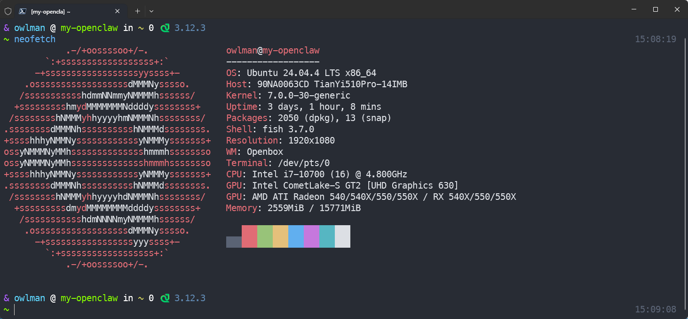

**图 1** 这篇笔记所使用的硬件环境

正因如此，对于我在这篇笔记中的所有观察以及得出的结论，读者应将其严格限定在 ‘消费级 CPU 硬件 + 小参数量模型’的范畴内，不涉及分布式训练或大模型全量微调。这既是这篇笔记的局限所在，也是实验最真实的参考坐标。

> [!WARNING] 友情提示
>
> 如果不是出于体验流程、理解其工作方式的实验目的，强烈建议读者不要像我一样在一台没有独立显卡的设备上运行 LLM 的微调。因为，在 CPU 上运行微调任务不仅有速度极慢，很容易失败等问题，而且微调的效果也不具备任何现实意义。

## 知识准备

现在，让我们先来了解一下什么是 LLM 微调（Fine-tuning）。简单来说就是，在经历了我在《[[深度学习的训练与评估]]》这篇笔记中所介绍的、被称为 “预训练” 的处理之后，我们会得到一个各方面都具备一定知识的 LLM。但是，它的知识新旧取决于预训练的截止日期，知识的广度和深度取决于预训练使用的语料，以及在后续有监督微调（Supervised Fine-Tuning，以下简称 SFT）阶段引入的、由其他 LLM 通过知识蒸馏或合成生成的训练数据。所以在通常情况下，人们在将它部署为网络服务之前，都会使用一系列小批量数据做一次再训练，以便将它调整更符合某一特定市场的法律法规、用户习惯，或者更适用于它将要执行的任务类型。换言之，读者可以将 LLM 的预训练与微调的关系理解成：**预训练 = 教 LLM 学会人类的语言和世界知识；微调 = 在这个基础上对 LLM 进行针对性培训。** 举个例子，假设你有一个已经训练好的通用 LLM，在没有经过微调之前，它可能只能做下面这样的一般性问答：

```Markdown
输入：解释一下什么是 HTTP
输出：HTTP 是超文本传输协议的缩写，用于在互联网上传输数据。
```

现在，如果我们希望它能在输出回答时做一些**代码审查**，就需要准备一批像下面这样的训练数据：

```Markdown
输入：
    检查下面这段代码……
    [Python 代码]

输出：
    1. 这里存在……
    2. 原因是……
    3. 建议修改为……
```

然后让 LLM 在这些数据上进行再训练，在这轮训练完成之后，它就能实现一些更偏向于代码审查任务的问答了，例如像下面这样。

```Markdown
输入：
    检查下面这段 Python 代码：

    ```Python
    def load_jsonl(path):
        """从 jsonl 文件加载训练样本。每行一个 JSON 对象。"""
        samples = []
        with open(path, 'r') as f:
            for line in f:
                samples.append(json.loads(line.strip()))
        return samples
    ```

输出：
    1. 这里存在：函数没有指定文件编码，同时对每一行的 JSON 解析失败没有任何处理。
    2. 原因是：在 Windows 平台上以默认编码打开 UTF-8 文件很容易触发 UnicodeDecodeError；而数据集只要有一行 JSON 格式损坏，整个加载流程就会立刻中断，导致后续训练无法继续。
    3. 建议修改为：在 open() 中显式声明 encoding='utf-8'，并对 json.loads 用 try/except 包裹，捕获 json.JSONDecodeError 后跳过坏行。
```

需要注意的是，正确理解上面所说的 “更倾向” 这个词是非常重要的。在我们继续讨论具体的微调技术之前，先厘清一个常见的误解：微调并不是简单地给 LLM 增加一个可在运行时进行查询的数据库（那是 RAG 的工作方式，我会在《[[Agent 的记忆机制]]》这篇笔记中具体介绍它），它本质上是通过改变参数的方式，使 LLM 在面对特定输入时更容易产生人们希望得到的输出。截止到我写这篇笔记的时间（2026-08-21），市面上常用的微调技术主要有三大类，具体如表 1 所示。

| 大类 | 主要思路 | 代表方法 | 资源开销 | 典型适用场景 |
| ---- | -------- | -------- | -------- | ------------ |
| **全参数微调 (FFT)** | 在下游任务上更新模型的所有参数 | — | 极高（与模型参数量线性相关） | 数据中心 / 多卡集群上的基础模型继续训练 |
| **参数高效微调 (PEFT)** | 冻结原模型，只更新一小部分参数或新增的可学习模块 | LoRA / QLoRA / DoRA / AdaLoRA / LoHa / LoKr / Adapter / IA³ 等 | 低（通常只占原参数量的不到 1%） | 单卡 / 个人开发者 / 在已有基座上做领域适配 |
| **偏好对齐类** | 在 SFT 基础上进一步让模型行为对齐人类偏好 | RLHF (PPO) / DPO / KTO / ORPO | 中到高 | 对齐对话模型的行为、安全、风格 |

**表 1** LLM 微调技术的主要分类

在上述几类方法之中，PEFT 在过去几年间已经从一种 "在资源受限时不得不用的妥协方案"，逐步演变为几乎所有主流 LLM 微调工作的默认起点。而我们在这里将要用到的 LoRA 则是这一众 PEFT 方法之中，被使用得最多、被研究得最透、对生态支持最完善的那一个。下面我们就来重点介绍一下它。

### LoRA 简介

LoRA 这个微调方法最早出自一篇名为 *[LoRA: Low-Rank Adaptation of Large Language Models](https://arxiv.org/abs/2106.09685)* 的论文。其核心思想可以概括为一句话：**LLM 在适配下游任务时，权重矩阵的更新量 $\Delta W$ 具有较低的本征秩（intrinsic rank），因此无需更新完整的权重矩阵 $W$，只需要用两个低秩矩阵的乘积来近似 $\Delta W$ 即可**。如果将这句话翻译成更精确的数学语言来描述，那就是：对于 Transformer 中任意一个需要适配的权重矩阵 $W$（维度为 $d \times k$），我们都可以用两个小矩阵 $B$（维度 $d \times r$）与 $A$（维度 $r \times k$）的乘积 $BA$ 来表达 $\Delta W$，即 $\Delta W = BA$，其中 $r$ 远小于 $d$ 与 $k$（实践中通常取 4、8、16、32 这样的值），具体公式如下：

$$
W' = W + \Delta W = W + \frac{\alpha}{r} B A
$$

在该公式中，$W$ 在训练期间始终保持冻结，$A$ 与 $B$ 为可训练参数，$\alpha$ 是一个缩放系数（通常与 $r$ 同阶），用于控制 LoRA 更新的整体强度。在推理阶段，可以直接把 $BA$ 合并回 $W$，得到一个与原始模型结构完全一致的权重矩阵，因此 LoRA 不会给推理带来任何额外的延迟。

当然，在那篇最早提出 LoRA 方法的论文中，作者们将 self-attention 中的 $W_q$、$W_k$、$W_v$、$W_o$ 作为潜在适配目标，并在 Section 7.1 的实证研究中发现**同时适应 $W_q$ 与 $W_v$ 在相同参数预算下效果最佳**，这也正是 HuggingFace PEFT 库默认只把这两个矩阵设置为`target_modules`的原因；而在 LLaMA-Factory 等工程框架的默认配置（如本文 YAML 中实际使用的 `lora_target: all`）中，LoRA 适配则会进一步扩展到全部线性层，以增强在中小规模数据集上的适配稳定性。不过在后续的工程实践中，LoRA 已经被普遍推广到了前馈网络中的矩阵以及 embedding、LM head 等位置中，研究者们也沿着 "低秩分解" 这条主线发展出了多条改进路径：

- **QLoRA**（由 Dettmers 等人于 2023 年提出，相关论文是 [arXiv:2305.14314](https://arxiv.org/abs/2305.14314)）：先把用于充当基座的 LLM 量化到 4-bit NormalFloat（NF4），再在其上挂载 LoRA，从而将原本需要多卡高端 GPU 才能完成的、65B 规模的 LLM 微调，压缩到单卡 48GB GPU（如 RTX A6000 48GB、A100 40GB）即可完成的规模；
- **DoRA**（由 Liu 等人于 2024 年提出，相关论文是 [arXiv:2402.09353](https://arxiv.org/abs/2402.09353)）：把权重矩阵拆成幅值（magnitude）与方向（direction）两部分，其中，方向的部分沿用 LoRA 处理，幅值的部分则用一个可训练的缩放向量来表达，在许多任务上获得了比 LoRA 更好的效果；
- **AdaLoRA**：自适应地为不同层、不同模块分配不同的秩 $r$；
- **LoHa / LoKr**：分别用低秩 Hadamard 积与低秩 Kronecker 积来表示 $\Delta W$，进一步丰富了 "低秩适配" 的表达形式。

这些方法在思路上都与 LoRA 同源，因此读者只要把 LoRA 的原理弄清楚了，再去理解后续的改进工作就会顺畅很多。

### 为什么选择 LoRA

现在，让我们回到接下来要进行的实验设定上了。根据我们在笔记开篇时的硬件约定，实验使用的是普通笔记本电脑或 Mini PC 这类基本没有独立显卡的设备。这就意味着，设备的**显存与内存容量**是制约我们能跑多大参数的 LLM、能训练多久的主要瓶颈。在这种情况下，LoRA 在资源开销上所具备的以下这几项优势，让它几乎成为了我们进行这个实验的唯一选择。

- **可训练参数大幅减少**：LoRA 方法需要训练的参数量通常都只有 LLM 全部参数的 1% 以下，这就直接降低了 Adam 等优化器所需要维护的状态（动量、方差等）的存储开销；
- **激活显存与梯度显存显著下降**：在 LoRA 方法中，被冻结的 $W$ 在反向传播中不需要保存梯度，反向传播也只在小矩阵 $A$、$B$ 上进行；
- **训练产物小巧且易于管理**：一次训练只产出一个体积通常只有几十到几百 MB 的 adapter 文件，便于在不同数据集、不同超参配置下进行多轮实验，并按需切换、叠加；
- **生态成熟**：Hugging Face PEFT、LLaMA-Factory 等主流的 LLM 微调框架都对 LoRA 方法提供了完善的支持，从命令行工具到 WebUI 都有现成的封装。

具体到本实验的目标对象`Qwen 2.5-0.5B`，它的参数量虽然不大，但即使是 0.5B 这种轻量级模型，全量微调在 CPU 环境下仍然会占用相当可观的内存与计算资源，训练时长也往往会拉长到令人难以接受的水平；而改用 LoRA 之后，单次训练的内存峰值与时长都能降到本实验硬件可以承受的范围内，训练产物也便于我们在后续阶段对它进行二次评估与对比。

最后，还需要说明的是，我在这次实验中之所以选择 LoRA 而不是 QLoRA、DoRA 等更新的改进方法，主要是因为 LoRA 是整个 LoRA 家族中最为经典、对 CPU 环境最友好、社区资料最丰富的那一种，对一名初学者来说，它是理解 "PEFT" 这条技术路线最合适的起点。

## 实验过程记录

在完成了上述知识准备之后，现在让我们正式开始 LLM 的微调实验吧，其具体步骤如下。

1. 安装 uv 并创建一个基于 Python 3.12 的虚拟环境。关于这部分的操作方法，我已经在《[[编程环境配置|Python 学习笔记：编程环境配置]]》（[博客园链接](https://www.cnblogs.com/owlman/p/19501012)）这篇笔记中做过详细介绍，这里就不再赘述了。总而言之，在完成这些操作之后，我们会得到如图 2 所示的结果。

    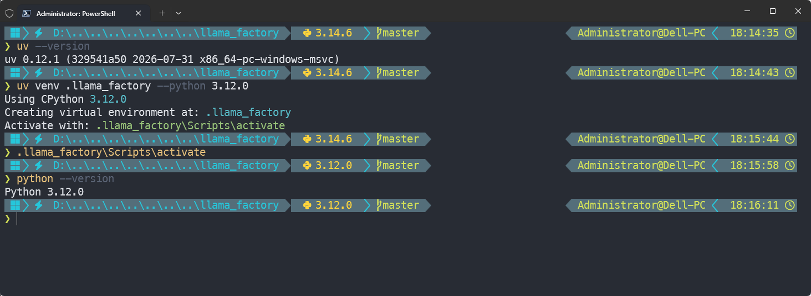

    **图 2** 创建基于 Python 3.12 的虚拟环境

2. 基于《论语》这本书的文本准备一个极小规模的微调数据集，这可以使用 OpenCode 这样的 Agent 工具帮我们自动生成，提示词为：*“我需要基于 LLaMA-Factory 来进行一次 LLM 微调实验，帮我生成一份基于《论语》的微调数据集，数据集格式为 JSON Lines，每条数据包含一个问题和对应的答案，数据集大小为 10 条。”* 具体如图 3 所示。

   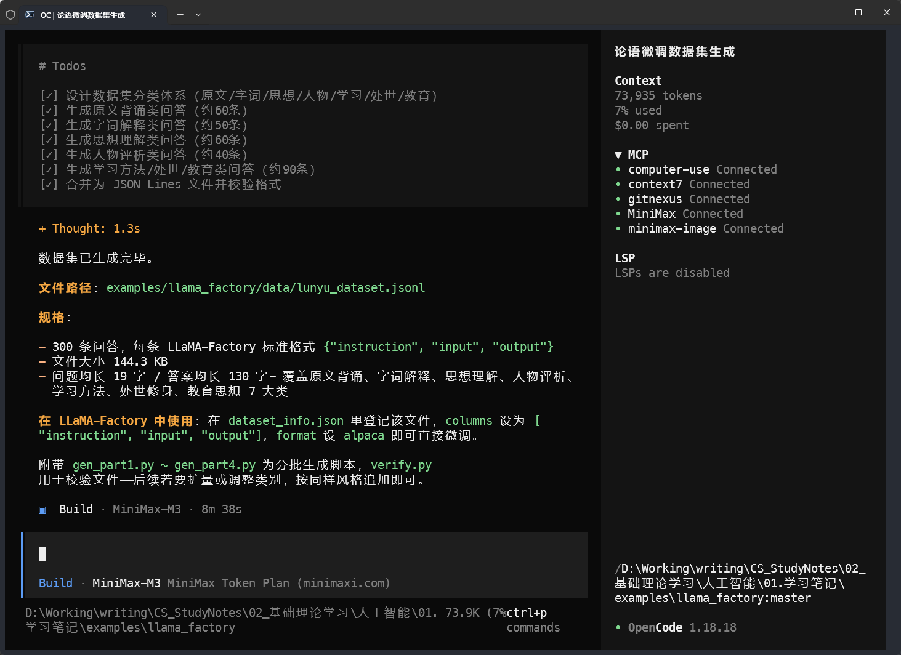

   **图 3** OpenCode 自动生成微调数据集

3. 安装 LLaMA-Factory 及其 CPU 版的依赖，这需要我们打开命令行终端，并依次执行以下命令：

    ```bash
    # 安装 LLaMA-Factory
    pip install llamafactory

    # 安装 CPU 版 PyTorch
    pip install torch torchvision torchaudio --index-url https://download.pytorch.org/whl/cpu
    ```

    如果一切顺利，待上述操作执行完成之后，我们在命令行终端中输入`llamafactory-cli help`，应该会看到如图 4 所示的结果。

    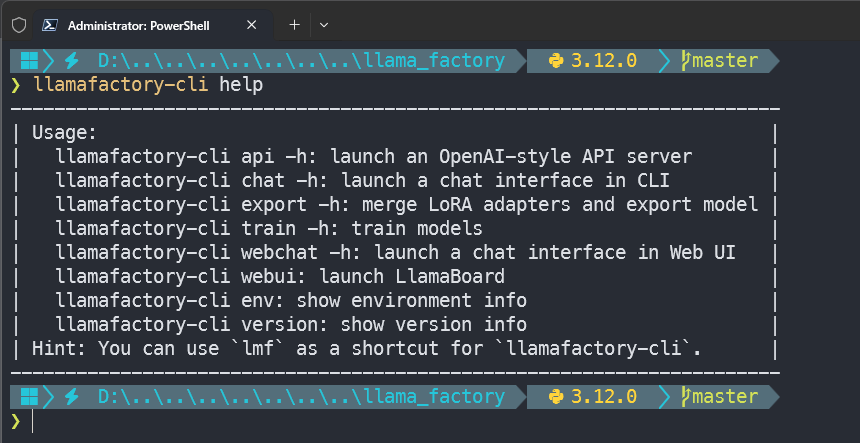

    **图 4** LLaMA Factory 帮助信息

4. 配置并运行 CPU 版的 LoRA 微调，这需要我们执行`llamafactory-cli webui`命令，打开 LLaMA-Factory 的 Web 操作界面，并按照图 5 所示的步骤，选择我们接下来要使用的 LLM 权重文件与微调数据集。

    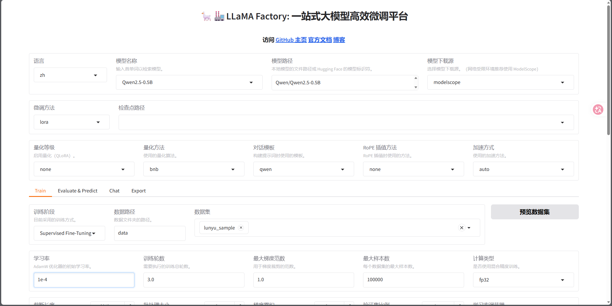

    **图 5** LLaMA-Factory 的 Web 操作界面

5. 默认情况下，LLaMA-Factory 的最新版本会自行从 Hugging Face 或 ModelScope 平台上获取到我们在上述界面中指定的 LLM 权重文件，但如果是使用旧版，且无法连接 Hugging Face 的用户，那就得亲自去 ModelScope 网站上搜索到`Qwen 2.5-0.5B`，并按照图 6 中所示的步骤下载权重文件。

    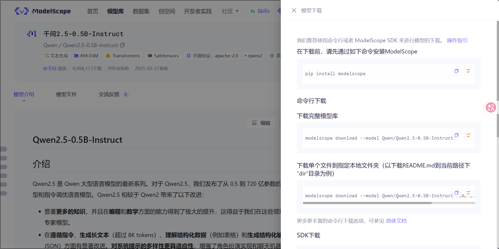

    **图 6** 找到 Qwen 2.5-0.5B 权重文件

    其具体操作过程如图 7 所示。读者可以注意到，待`Qwen 2.5-0.5B`的权重文件下载完成之后，ModelScope 的下载器会自动告诉我们文件的存储位置，如果需要的话，我们也可以将它另存到一个比较方便管理的位置上。然后再将该位置填写到图 5 所示界面的 “模型路径” 字段中，这样，我们就可以在后续的微调过程中使用本地的权重文件了。

    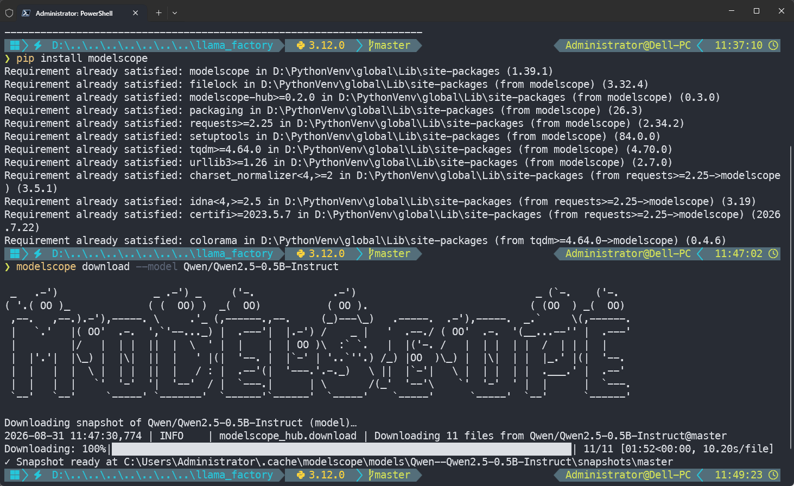

    **图 7** 下载 Qwen 2.5-0.5B 权重文件

6. 按照图 3 中 OpenCode 给出的提示，将它替我们准备好的数据集注册到 LLaMA-Factory 中，并将该数据集命名为`lunyu_sample`，然后在刷新 Web 界面之后，我们就可以顺利将该数据集加载到 LLaMA-Factory 中了，如图 8 所示。

    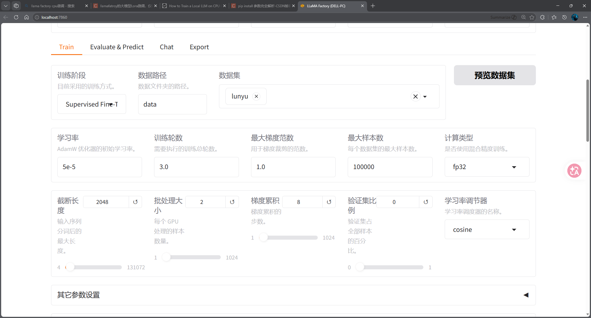

    **图 8** 注册并加载微调数据集

7. 由于我们执行的是 CPU 版的 LoRA 微调，因此需要按照表 2 所示的配置，在 LLaMA Factory 的 Web 界面中设置训练参数。

    | 参数 | 本实验使用值 | 相关说明 |
    |---|---|---|
    | `finetuning_type` | `lora` | 全参数微调要更新 LLM 里几亿个参数，CPU 上既吃内存又慢到没法等；LoRA 只额外训练几个小矩阵、其余全部冻结，是 CPU 上唯一现实的选择 |
    | `model_name_or_path` | `Qwen/Qwen2.5-0.5B` | 没独立显卡时，显存就是内存。LLM 越大，加载占用的内存和每一步的计算量就越大；0.5B 是这个条件下既能跑起来、又有基本智能的最小模型之一 |
    | `bf16` / `fp16` | `false` / `false` | bf16/fp16 是给 GPU 的半精度加速玩法：在 CPU 上要么直接不支持（报错 "expected scalar type Float but found Half"），要么精度损失让训练结果变差；保持两者均为 false 即走 fp32，最稳，慢一点但不会翻车 |
    | `cutoff_len` | `256` | 序列越长，单步计算量越大，CPU 就越慢；Qwen2.5 虽支持 3 万 token 长上下文，但《论语》问答样本最长也不超过 200 token，主动截到 256 能省大量时间，效果几乎不受影响 |
    | `batch_size` | `2` | GPU 一次能并行处理几十条样本，CPU 上只能串行；本实验实测将 batch_size 设为 2 时，6 核 CPU 的负载比较均衡，单步耗时比 1 反而更短 |
    | `gradient_accumulation_steps` | `2` | batch 太小会让梯度噪声大、训练不稳；本实验的有效 batch size 为 2×2=4（小数据集下 GA 设大反而拖慢训练且不改善 loss 曲线） |
    | `learning_rate` | `1e-4` | LoRA 只更新少量参数，本质就是在已有的 LLM 上轻轻推一把，所以可以用比全参数微调更大的学习率；本实验取推荐区间下界 1e-4，配合极小数据集更稳妥 |

    **表 2** CPU 版 LoRA 微调的参数配置（与下方 YAML 一一对应）

8. 在完成上述参数设置之后，我们就可以点击页面中的 “开始” 按钮来启动 LoRA 微调了，如图 9 所示。

    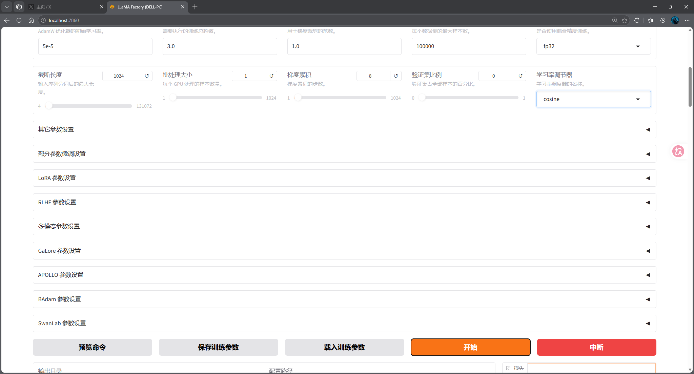

    **图 9** 开始 LoRA 微调

    **补充：等价的命令行方式**。上面的 WebUI 操作也可以通过一份 YAML + 一行命令来等价复现，便于脚本化或在 SSH 远程机上运行：

    ```bash
    llamafactory-cli train train_lunyu_sample_fast.yaml
    ```

    其中 `train_lunyu_sample_fast.yaml` 中的主要参数设定与表 2 一一对应，具体如下：

    ```yaml
    model_name_or_path: Qwen/Qwen2.5-0.5B      # 模型名称
    dataset: lunyu_sample                      # 数据集名称
    dataset_dir: data                          # 数据集存储路径
    template: qwen                             # 模板名称
    finetuning_type: lora                      # 微调类型
    lora_rank: 8                               # LoRA 矩阵的秩
    lora_alpha: 16                             # LoRA 矩阵的缩放因子
    lora_dropout: 0                            # LoRA 矩阵的丢弃率
    lora_target: all                           # LoRA 矩阵的目标层
    stage: sft                                 # 微调阶段
    do_train: true                             # 是否进行训练
    output_dir: saves\Qwen2.5-0.5B\lora\train_lunyu_sample_fast # 输出目录
    overwrite_output_dir: true                 # 是否覆盖输出目录
    cutoff_len: 256                            # 截断长度
    per_device_train_batch_size: 2             # 每个设备的训练批次大小
    gradient_accumulation_steps: 2             # 梯度累积步数
    learning_rate: 0.0001                      # 学习率
    num_train_epochs: 3.0                      # 训练轮数
    lr_scheduler_type: cosine                  # 学习率调度器类型
    warmup_steps: 0                            # 预热步数
    max_grad_norm: 1.0                         # 最大梯度范数
    logging_steps: 1                           # 日志记录步数
    save_steps: 6                              # 保存步数
    plot_loss: true                            # 是否绘制损失曲线
    preprocessing_num_workers: 6               # 预处理工作线程数
    dataloader_num_workers: 4                  # 数据加载工作线程数
    flash_attn: auto                           # 是否使用 Flash Attention
    bf16: false                                # 是否使用 bf16
    fp16: false                                # 是否使用 fp16
    gradient_checkpointing: false              # 是否使用梯度检查点
    optim: adamw_torch                         # 优化器类型
    packing: false                             # 是否使用打包
    enable_thinking: false                     # 是否启用思考
    report_to: none                            # 报告类型
    trust_remote_code: true                    # 是否信任远程代码
    seed: 42                                   # 随机种子
    ```

    这份 YAML 与 WebUI 表单的最大差异在于：它可被纳入到 Git 版本控制系统中进行管理，这是当前任务做成 "可复现实验" 的关键一步。后续如果我们的设备条件允许，需要换成`Qwen2.5-1.5B`或切换到`Qwen3-1.7B`，只需要修改`model_name_or_path`和`cutoff_len`，其他参数都不用动，就能复现同样的实验结果。

9. 待训练开始之后，我们就能在 LLaMA-Factory 的 Web 界面的底部看到训练过程的实时输出框了，并且在训练持续一段时间之后，训练进度条也会在实时输出框的上方出现，如图 10 所示。由于我们使用的纯 CPU 的微调方式，这个过程会非常慢，基本上都要持续 2-5 个小时不等，且失败几率很高。

    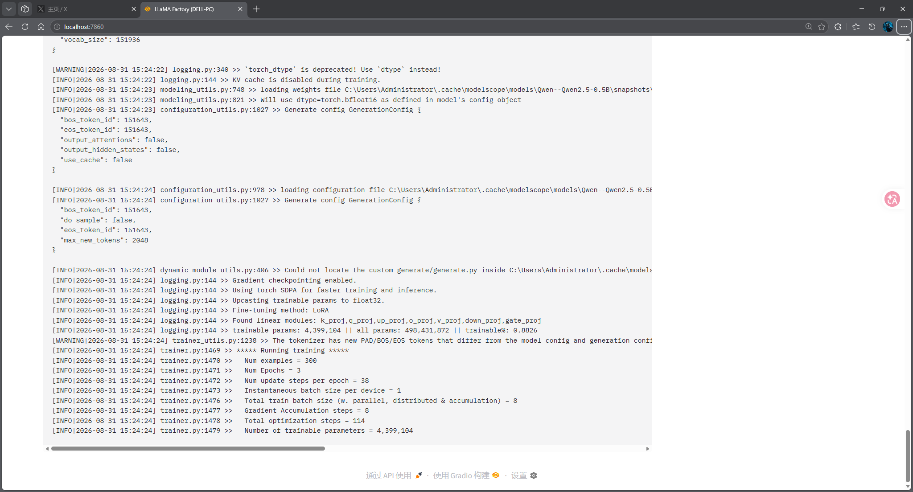

    **图 10** LoRA 微调训练进度

10. 一旦训练完成，我们就会在 LLaMA-Factory 的 Web 界面中看到上面的训练进度条走到了 100%。同时，”中断“ 按钮的下方会出现一张完整的 loss 曲线图，如图 11 所示。

    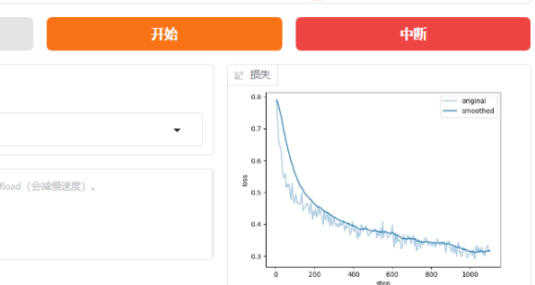

    **图 11**  ”中断“ 按钮下方出现的 loss 曲线图

    至于训练的具体成果究竟如何，我们可以从以下几个关键信号来判断：

    - **loss 曲线持续下降并最终趋于平稳**：`train_loss` 在前几个 epoch 出现明显下降（起步通常在 1.5\~3.0 区间，收敛后稳定在 0.1\~0.5）；`eval_loss` 与 `train_loss` 趋势一致（若 `train_loss` 下降而 `eval_loss` 上升，则视为过拟合）。一个粗略的经验阈值：`train_loss` > 1.0 多为欠拟合，< 0.3 可视为基本收敛。
    - **grad_norm 稳定在 0.1-10 之间**：如果突然飙升到 100+ 或者出现 NaN，说明训练崩溃，需要回退学习率或检查数据。
    - **没有 OOM / RuntimeError**：CPU 训练里常见的报错包括 "DataLoader worker (pid X) is killed by signal: Out of memory"（需减小`batch_size`）以及 "expected scalar type Float but found Half"（即 PyTorch CPU 版本与 bf16 不兼容，需切回 fp32）。

    当以上信号都出现时，就基本可以确认 LoRA 微调已经成功完成。下一步，我们就可以进入实验结果的分析环节了。

## 实验结果与分析

完成上述 10 个步骤后，整个实验就基本跑完了。需要说明的是，根据《[[关于 AI 的学习路线图]]》第三阶段的规划，我进行这个实验的核心任务是要通过 LLM 在微调前后的行为差异，来观察 "当训练数据和优化目标发生变化后，LLM 的行为如何变化" —— 也就是回答我在路线图第三阶段中提出的两个核心问题：

1. LLM 在 AI 系统中是核心决策单元，还是能力增强模块？
2. 哪些是 LLM 本身能力的问题，哪些是 AI 系统的设计问题？

接下来，我会从 "预期可观察到的结果" 和 "失败模式与边界" 两个维度展开分析。

### 预期可观察到的结果

结合我在这次实验中采取的是 "10 条《论语》样本 + 0.5B 参数规模 + i5-9500T CPU" 组合，参照之前在步骤 10 中所列的成功信号，应该预期可以从三个维度观察到结果：

1. **训练日志维度**：如果在 LLaMA-Factory 的输出日志中看到：loss 曲线持续下降并最终趋于平稳、grad_norm 稳定在 0.1-10 之间、训练无 OOM / RuntimeError、总时长在 1-2 小时内。如果这 4 个信号同时出现，就意味着 LoRA 微调在工程上**确实跑通了**。
2. **行为维度**：微调前，`Qwen 2.5-0.5B`在与《论语》相关任务上的输出能力与一般性问答无异；微调后，该 LLM 应该在回答《论语》相关问题时有了**更好的模式匹配能力**，输出格式更稳定、内容更可预测。
3. **局限维度**：在 0.5B 参数规模 + 10 条数据样本的组合下，LLM 对 "论语" 主题知识的吸收**不会有显著提升**。换言之，LLM 在微调后**不会**突然变成 "国学大师"，而只是对特定问答格式有了模式匹配能力。这对于理解 "LLM 在 AI 系统中的角色" 至关重要。

### 失败模式与边界

呼应路线图第三阶段 "当 LLM 输出不可靠时，AI 系统该如何处理能力的退化" 这一关键问题，这次实验在以下几种情况下应当视为 "未达到预期" 或 "需要重新设计"：

- **过拟合**：train_loss 持续下降但 eval_loss 反而上升（步骤 10 第 1 条）。这说明微调输出的 adapter 只 "记住" 了训练集而没有学到《论语》的语言模式。
- **欠拟合**：train_loss 始终在 1.5-2.0 之间下不来。这说明可能学习率过低、rank 过小、或者数据集质量有问题。
- **行为漂移**：微调后 LLM 对一般性问答的回答质量明显下降。这说明数据集分布过于狭窄（全部是《论语》），导致模型丧失了原有的 "通识" 能力。
- **训练崩溃**：loss 出现 NaN 或 grad_norm 飙升到 100+。这说明我们需要回退学习率或检查数据标注。

### 在 AI 系统中的角色讨论

基于上述结果，我们可以从两个层面回答路线图第三阶段的核心问题：

1. **LLM 在 AI 系统中更接近 "能力增强模块" 而非 "核心决策单元"**：我在实验中所采用的 "在极小数据集上做轻量级 LoRA 微调" 这一过程，本质上是为一个通才 LLM 增加了一个**针对特定任务的小型插件**。很显然，这样做没有让`Qwen 2.5-0.5B`这个 LLM 变成 "国学大师"，只是让它在 "《论语》风格问答" 这个特定场景下，输出格式更稳定、内容更可预测。这与路线图第三阶段 "LLM 是一个不稳定但有价值的外部能力源" 的核心论断完全一致。

2. **失败模式主要是 AI 系统的设计问题，而非 LLM 本身的能力问题**：上述 4 种失败模式——过拟合、欠拟合、行为漂移、训练崩溃——都可以通过**调整数据集、调整超参、调整 prompt template** 等 AI 系统设计手段来缓解，而不是 "Qwen 2.5-0.5B 本身不够好"。这与路线图第三阶段 "哪些是 LLM 本身能力的问题，哪些是 AI 系统的设计问题" 的提问框架完全对齐。

需要强调的是，这篇笔记所记录的实验是在 **i5-9500T（6 核 6 线程、2.2GHz 基频、不支持 AVX-512）+ 16GB 内存 + 0.5B 模型 + 10 条《论语》样本** 这一 **消费级 CPU + 极小参数规模 + 极小数据集** 的组合下完成的——与路线图第三阶段 "建议读者根据自身所拥有的设备条件选择路径" 中的 "路径 2（设备条件允许）" 一致，只是本实验走的是路径 2 的 "低端边缘"。因此，本节中所有观察都应该被严格限定在 "消费级 CPU + 小参数量模型 + 极小数据集" 这个范畴内，不涉及分布式训练或更大规模的微调实验。

## 参考资料

- 论文资料
  - *LoRA: Low-Rank Adaptation of Large Language Models*（Edward J. Hu 等人，2021）：[arXiv:2106.09685](https://arxiv.org/abs/2106.09685)
  - *QLoRA: Efficient Finetuning of Quantized LLMs*（Tim Dettmers 等人，2023）：[arXiv:2305.14314](https://arxiv.org/abs/2305.14314)
  - *DoRA: Weight-Decomposed Low-Rank Adaptation*（Shih-Yang Liu 等人，2024）：[arXiv:2402.09353](https://arxiv.org/abs/2402.09353)

- 视频资料
  - 什么是 LoRA？大模型微调是怎么回事？：[YouTube 链接](https://www.youtube.com/watch?v=hZ6fSjPGQWM&t=2s) / [Bilibili 链接](https://www.bilibili.com/video/BV1PvwYzxE9D)
  - 使用 LLaMA-Factory 微调 Qwen3-1.7B 模型：[YouTube 链接](https://www.youtube.com/watch?v=jmZb90Yen0A) / [Bilibili 链接](https://www.bilibili.com/video/BV1cE1KBeEVn)
