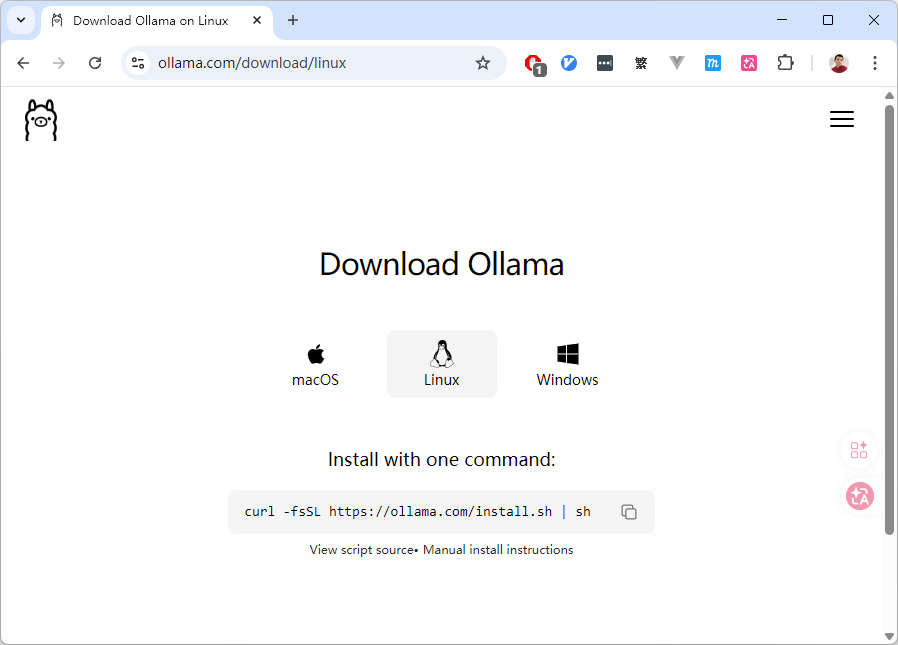
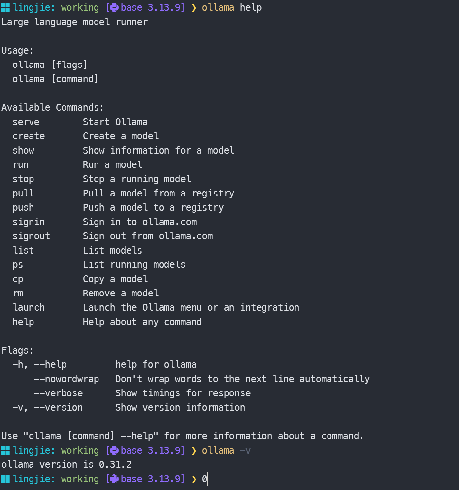
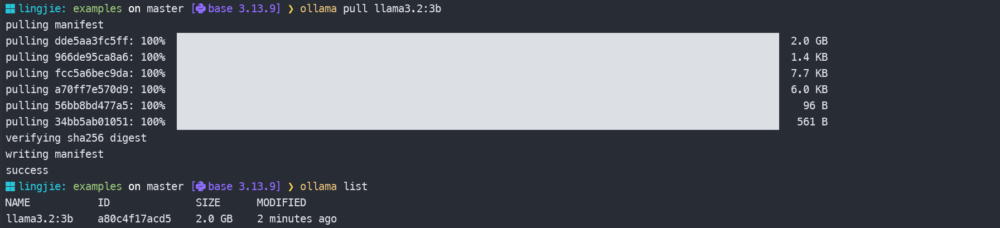
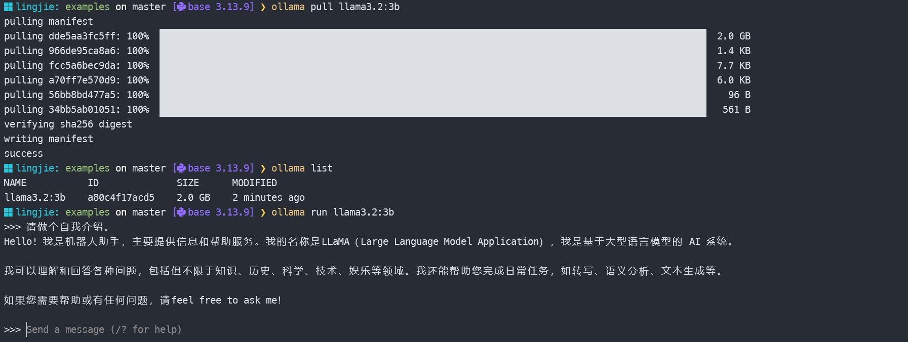
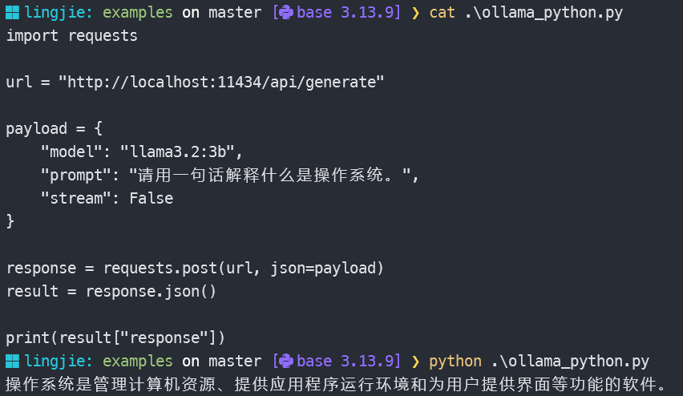
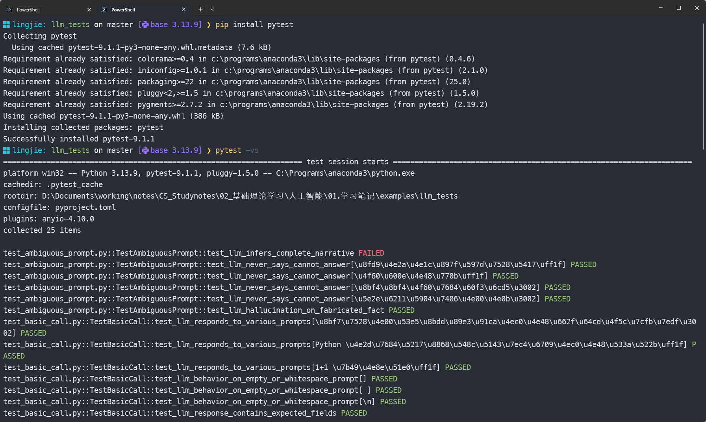

> [!NOTE] 笔记说明
>
> 这篇笔记对应的是《[[关于 AI 的学习路线图]]》一文中所规划的第三个学习阶段。其中记录了我尝试将 LLM 部署到生产环境中，并对其进行相关测试的全过程，以及在该过程中所获得的心得体会。同样的，这些内容也将成为我 AI 系列笔记的一部分，被存储在本人 Github 上的[计算机学习笔记库](https://github.com/owlman/CS_StudyNotes)中，并予以长期维护。

## 关于 LLM 的本地部署

正如我之前在《[[关于 AI 的学习路线图]]》一文中所提到的，从学习的角度来说，如果我们要想切实了解 LLM 在计算机软件系统中所处的位置，以及它在生产环境中所扮演的角色，最直接的方式就是尝试将其部署到我们自己所在的计算机环境中，并通过测试来观察它与用户的交互方式。但是，如果想要实现在本地部署 LLM 这种大型应用，我们首先要解决一个很现实的问题：*如何用有限的硬件资源、以可控的方式将其运行起来？*

很显然，就目前阶段的学习任务来看，如果我们从直接编译源码、手动配置推理引擎、管理模型权重与依赖环境来着手，大概率会让自己的学习重心过早地偏向底层细节，而模糊了我们真正想观察的目标 —— LLM 在生产环境中所扮演的角色。因此，我个人会推荐读者从一款名为 Ollama 的开源模型管理工具来着手，该工具可以让人们在不必关心底层实现细节的情况下，快速地完成 LLM 的部署与测试。下面，就让我们来具体介绍一下 Ollama 及其使用方法。

> - 如果想直接基于深度学习框架来部署 LLM，也可以参考本文在“参考资料”一节中提供的视频教程：《基于 Transformer 库的 LLM 部署演示》。
> 如果想基于 node-llama-cpp 来部署 LLM，也可以参考本文在“参考资料”一节中提供的博客文章：《基于 node-llama-cpp 的 LLM 部署演示》。

### 了解并安装 Ollama

Ollama 是一款基于 MIT 协议开源的、面向本地环境的 LLM 运行与管理工具，它的核心设计目标是以尽可能低的使用门槛，将“运行一个 LLM”这件事变成一项标准化、可重复的工程操作。具体来说就是，Ollama 在整个与 LLM 相关的系统中大致承担了以下职责：

- **模型生命周期管理**：负责模型的拉取、存储、版本管理与运行；
- **推理环境封装**：屏蔽底层推理引擎、量化方式与硬件差异；
- **统一的调用接口**：通过 CLI 或 API 的形式，对外提供一致的使用方式。

这意味着，用户在使用 Ollama 时并不需要关心模型权重具体存放在哪里、底层使用了哪种推理后端，也不必在一开始就纠结于 CUDA、Metal 或 CPU 优化等问题。很显然，我们在这里选择 Ollama，本质上是一种刻意降低系统复杂度的学习策略，目的是将学习重点放在观察模型本身的行为以及**它与系统其他部分的交互方式**上，但它并不足以应对实际生产环境中的所有问题。

Ollama 的安装过程本身非常简单，读者可以自行前往它的[官方下载页面](https://ollama.com/download)，并根据该页面中的提示，基于自己所在的操作系统完成安装即可，具体如图 1 所示。

<!--  -->


**图 1**：Ollama 的下载页面

如果安装过程一切顺利，我们就可以通过在命令行中输入 `ollama` 命令来验证安装是否成功。如果安装成功了，该命令会返回 Ollama 的使用提示信息，如图 2 所示。

<!--  -->


**图 2**：Ollama 的使用提示信息

接下来，我们要做的就是选择一款适合当前学习任务的 LLM，并尝试使用 Ollama 来将其部署到我们的本地环境中。

### 选择并部署 LLM

关于应该选择什么模型来完成我们在这一阶段的学习，这主要取决于我们**要实验的任务类型**和**电脑配置**。以下这张表是我基于这篇笔记写作的时间点（即 2026 年 2 月），整理出的当前主流的候选模型。

| 推荐模型 | 主要特点与优势 | 适用场景 | 硬件要求参考 |
| -------- | -------------- | -------- | ------------ |
| **通用最佳平衡** | 适用于多数学习场景的推荐起点；兼顾性能与成本。 | 适合一般学习和试验性部署。 | 建议 16GB+，量化后可在更低配置上运行。 |
| **Qwen2.5-7B** | 7B 级别综合性能强，指令跟随、长上下文支持好，通用性高。 | 文档总结、内容创作、知识问答、轻量级智能体任务。 | 16GB+ 内存，量化后可降低需求。 |
| **Llama 系列** | Meta 出品，生态完善，工具调用支持好；3.1 8B 适合通用对话，3.3 70B 性能更强。 | 快速对话、多语言任务、对响应速度要求高的应用。 | 8B 模型：8-16GB 内存；70B 需多卡或云端。 |
| **专注编程任务** | 适合代码生成与开发辅助场景，语义理解更强。 | 专注于编程任务和开发者辅助。 | 建议 16GB+，按模型大小可选。 |
| **Qwen3-Coder 系列** | 阿里出品，在代码理解和生成任务上表现优异，有不同尺寸可选。 | 代码解释、补全、测试、学习编程。 | 1.7B/4B/8B 等不同规格，可按需选择。 |
| **Mistral 系列** | Mistral AI 出品，通用能力强，在代码和推理任务上表现均衡。 | 通用对话、编程辅助、推理任务。 | 推荐 16GB 以上内存。 |
| **资源受限环境** | 适合低配设备和入门部署的轻量级模型。 | 适用于硬件受限的实验环境、边缘设备和教学演示。 | 8-16GB 内存即可。 |
| **SmolLM3-3B** | 完全开源，性能优秀，在 3B 级别中表现出色，可控性强。 | 对开源合规要求高，或需要在低配硬件上部署。 | 可在普通笔记本电脑上运行。 |
| **Llama 3.2 3B** | 体积小、速度快，适合部署在多种设备上，对硬件要求低。 | 需要即时响应的嵌入式应用或移动端场景。 | 8-16GB 内存即可。 |

根据上面的表格，我们可以先参照以下提示来确定选择：

- 如果硬件资源不给力（例如内存容量只有 16GB 或更少，没有独立显卡），可以选择`SmolLM3-3B`或`Llama 3.2 3B`；
- 如果想优先考虑通用对话和写作，可以选择`Qwen2.5-7B`或`Llama 3.1 8B`；
- 如果想优先考虑将其用于编程辅助，`Qwen3-Coder`系列可能是更好的选择；

由于这篇笔记的任务是基于学习的目的来部署 LLM，它最好能让读者在最普通的个人笔记本上进行过程相对流畅的实验，因此我决定选择`Llama 3.2 3B`来进行演示。这个选择体现了本地部署学习中的常见折中：我们不追求大规模生产级模型的最优性能，而是优先保证可用性、可重复性和测试便利性。

基本上，使用 Ollama 部署 LLM 的操作步骤与使用 docker 部署服务端应用的过程非常类似，具体如下：

1. **拉取模型**：打开命令行终端并输入`ollama pull llama3.2:3b`命令，即可从 Ollama 的官方服务器上拉取我们所选择的 LLM 镜像，如图 3 所示。

    <!--  -->
    

    **图 3**：使用 Ollama 拉取 LLM 镜像

    正如读者所见，如果镜像被顺利拉取到本地，当我们继续在命令行终端输入`ollama list`命令时，就可以看到`llama3.2:3b`这个镜像已经存在于 Ollama 在本地管理的镜像列表中了。

2. **运行测试**：继续在图 3 所示命令行界面中输入 `ollama run llama3.2:3b`命令即可开始交互测试。在这里，我们演示的是一个 LLM 版的“Hello World”，如图 4 所示。

    <!--  -->
    

    **图 4**：使用 Ollama 运行 LLM 镜像

至此，我们就算完成了一次基于 Ollama 的 LLM 本地部署作业。需要特别强调的是，由于受到硬件资源的限制，我们在这里所部署的这个 LLM 在功能上是远远不能满足实际生产需求的，它在这里的任务只是供我们用测试的方式来观察 LLM 在生产环境中所扮演的角色。

### 从交互式运行到服务模式

在上面的演示中，我们使用的 `ollama run` 是一个交互式命令——它会启动模型并打开一个对话界面。这种方式适合手动体验，但如果要通过编程方式调用 LLM（例如编写测试脚本），就需要切换到 **服务模式（Server Mode）**。

Ollama 在后台默认运行着一个守护进程（安装后会自动注册为系统服务），监听 `localhost:11434` 端口。你可以通过以下命令手动启动它：

```bash
ollama serve
```

服务模式启动后，Ollama 会暴露一套 RESTful API，所有与模型的交互都通过 HTTP 请求来完成。切换到服务模式意味着：

- **调用方式**：从 `ollama run` + 手动输入文本，变成 POST 请求 + 程序化处理的 JSON 响应；
- **生命周期**：从单次对话的临时交互，变成模型常驻内存、持续接受请求的服务进程；
- **并发与排队**：Ollama 在服务模式下默认串行处理请求，意味着多个客户端同时调用时后续请求会排队等待，这是生产部署中需要重点关注的约束。

### 部署环境初始化与预热

在开始编写测试之前，还有几个工程步骤需要先处理好：

1. **确认服务可用**：确保 Ollama 服务正在运行，且目标模型已加载到内存中。可以通过 `curl http://localhost:11434/api/generate` 快速验证。
2. **模型预热（Warm-up）**：大模型在首次推理时通常比后续调用慢得多（涉及显存分配、KV cache 初始化等），因此在进行性能相关的测试前，最好先发一条无关请求完成预热。
3. **错误处理策略**：Ollama API 在模型未加载或请求超时的情况下可能返回 500 或连接拒绝。测试框架需要准备好重试逻辑和超时设置，而不是假设服务永远可用。

这些步骤虽然不是”核心知识”，但忽略了它们会让后面的测试结果充满噪声。因此，我在 conftest.py 中设置的 `timeout=120` 和 `raise_for_status()` 就是为了应对这些现实问题。

## 针对 LLM 的测试与观察

现在，让我们来具体测试一下这个基于 Ollama 完成本地部署的 LLM。需要明确的是，我们这里的测试任务并不是在评估模型的”聪明程度”，而是设法通过一组尽可能简单、可复现的测试来观察 LLM 与用户交互时的行为模式。换句话说，我们希望通过测试来了解 **LLM 作为系统组件时的响应方式、失败模式以及可控性边界。**

在测试方式的选择上，我选择使用 Python 脚本通过 HTTP API 的方式来调用本地运行的 LLM，用于模拟更接近实际生产环境的使用场景。

### 使用 Python 调用本地 Ollama 模型

在默认情况下，Ollama 会在本地运行 LLM 的同时为用户提供一套 RESTful API（具体文档请参考本文最后的“参考资料”），这让我们可以使用 Python 脚本来模拟 HTTP 客户端，从而实现对 LLM 的自动化测试。其基本调用步骤如下：

1. **启动 LLM**：在命令行终端中输入`ollama run llama3.2:3b`命令，启动 LLM 的本地运行实例。

2. **创建 Python 脚本**；创建一个名为 `ollama_python.py` 的 Python 脚本，并在其中输入以下代码：

    ```python
    import requests

    url = "http://localhost:11434/api/generate"

    payload = {
        "model": "llama3.2:3b",
        "prompt": "请用一句话解释什么是操作系统。",
        "stream": False
    }

    response = requests.post(url, json=payload)
    result = response.json()

    print(result["response"])
    ```

3. **运行 Python 脚本**：在命令行终端中输入 `python ollama_python.py` 命令，运行 Python 脚本，即可看到 LLM 的输出结果，如图 5 所示。

    <!--  -->
    

    **图 5**：使用 Python 调用 Ollama API

在上述示例中，我们首先定义了 Ollama API 的调用地址，然后构造了一个包含模型名称、提示词以及是否以流式方式返回结果的请求体。最后，我们通过 requests 库的 post 方法将请求发送给 Ollama API，并打印出返回结果，这个示例的意义并不在于输出内容本身，而在于确认以下几点：

- Ollama API 是否能够被稳定调用；
- 请求—响应链路是否完整；
- 返回结果是否符合预期的数据结构。

在确认了 LLM 的调用链路是完整且稳定的前提下，我们接下来就可以正式开始编写测试用例了。

### 使用 PyTest 编写测试用例

现在，我们的任务是基于上面搭建的这个**最小可用的测试环境**，结合 PyTest 自动化测试框架来编写一个用于观察 LLM 行为模式的测试用例，具体步骤如下：

1. **新建测试项目**：在计算机的任意位置上创建一个名为`llm_tests`的目录（在这里，我将它建在这篇笔记所在目录下的`examples`目录中），并在其中创建下列 Python 脚本文件：

    ```bash
    llm_tests
    ├── conftest.py                  # PyTest 公共配置与 fixtures
    ├── pyproject.toml               # 项目依赖配置
    ├── README.md                    # 项目说明
    ├── test_ambiguous_prompt.py     # 模糊指令下的模型行为测试
    ├── test_basic_call.py           # 基础连通性测试
    ├── test_knowledge_boundary.py   # 知识边界与幻觉行为测试
    ├── test_latency.py              # 响应延迟测试
    ├── test_nondeterminism.py       # 非确定性输出测试
    └── test_streaming.py            # 流式响应行为测试
    ```

2. **编写项目公共配置**：使用代码编辑器打开`conftest.py`文件，并其中输入以下代码：

    ```python
    # llm_tests/conftest.py
    '''
    PyTest 公共配置，提供调用 LLM 的基础 fixture。
    本文件对应主文章中"概率方法 → 数据驱动"这一范式转变中的测试基础设施层：
    测试的可靠性与可复现性，从根本上取决于底层调用的可控程度。
    '''
    import pytest
    import requests
    import json

    OLLAMA_URL = "http://localhost:11434/api/generate"
    MODEL_NAME = "llama3.2:3b"


    @pytest.fixture
    def ollama_client():
        '''
        基础调用 fixture，封装 Ollama 的 generate API。
        返回一个可接受 prompt 和可选参数字典的闭包。
        '''
        def call_llm(prompt, stream=False, options=None):
            payload = {
                "model": MODEL_NAME,
                "prompt": prompt,
                "stream": stream,
            }
            if options:
                payload["options"] = options
            response = requests.post(
                OLLAMA_URL,
                json=payload,
                timeout=120,
            )
            response.raise_for_status()
            return response.json()
        return call_llm


    @pytest.fixture
    def deterministic_client(ollama_client):
        '''
        确定性调用 fixture：固定 temperature=0, seed=42。
        对应主文章中"非确定性输出"的对照实验——在参数固定时，
        模型输出是否仍存在不可控的波动？
        '''
        def call_deterministic(prompt, stream=False):
            return ollama_client(
                prompt,
                stream=stream,
                options={"temperature": 0, "seed": 42}
            )
        return call_deterministic


    @pytest.fixture
    def stream_collector():
        '''
        流式响应收集器，用于测试 stream=True 时的逐 token 行为。
        Ollama 流式 API 每行返回一个 JSON 对象，最后一行 {"done": true}。
        '''
        def collect(url, payload):
            response = requests.post(url, json=payload, stream=True, timeout=180)
            response.raise_for_status()
            tokens = []
            for line in response.iter_lines(decode_unicode=True):
                if not line:
                    continue
                chunk = json.loads(line)
                if chunk.get("done"):
                    break
                tokens.append(chunk.get("response", ""))
            return "".join(tokens)
        return collect
    ```

3. **编写基础连通性测试**：使用代码编辑器打开`test_basic_call.py`文件，并其中输入以下代码：

    ```python
    # llm_tests/test_basic_call.py
    '''
    基础连通性与响应结构测试。

    测试目标：
    - LLM API 是否可被稳定调用（对应主文章中"概率转向"的基础假设：系统应可被可靠地查询）；
    - 响应数据结构是否符合预期；
    - 模型对不同类型指令是否都能产出非空且有意义的回复。

    这些测试是后续所有观察的基線——如果基础调用就不可靠，
    那么对"非确定性""模糊推断"等高级行为的分析就失去了立足点。
    '''
    import pytest


    class TestBasicCall:

        @pytest.mark.parametrize("prompt", [
            "请用一句话解释什么是操作系统。",
            "Python 中的列表和元组有什么区别？",
            "1+1 等于几？",
        ])
        def test_llm_responds_to_various_prompts(self, ollama_client, prompt):
            '''对不同类型的指令，模型都应返回非空字符串响应。'''
            result = ollama_client(prompt)

            assert "response" in result, "响应中缺少 'response' 字段"
            assert isinstance(result["response"], str), "'response' 字段应为字符串"
            assert len(result["response"].strip()) > 0, "响应内容不应为空"

        @pytest.mark.parametrize("prompt", [
            "",
            " ",
            "\n",
        ])
        def test_llm_behavior_on_empty_or_whitespace_prompt(
                self, ollama_client, prompt):
            '''
            边界情况：空或纯空白指令。
            这类输入在传统 API 中应返回 4xx 错误，
            但 LLM API 的行为值得观察——它会如何"应对"无意义的输入？
            '''
            result = ollama_client(prompt)
            response_text = result["response"].strip()

            # 模型不会因为空输入而崩溃（服务可用），
            # 但输出内容可能是不确定的默认回复
            assert isinstance(response_text, str)

        def test_llm_response_contains_expected_fields(self, ollama_client):
            '''验证 Ollama API 返回的完整字段集合。'''
            result = ollama_client("Hello。")

            # 核心字段存在性检查
            assert "model" in result
            assert "response" in result
            assert "done" in result
            assert "eval_count" in result
            assert "eval_duration" in result
            assert result["done"] is True
    ```

4. **编写响应延迟测试**：使用代码编辑器打开`test_latency.py`文件，并其中输入以下代码：

    ```python
    # llm_tests/test_latency.py
    '''
    响应延迟与吞吐量观察测试。

    测试目标：
    - LLM 的响应时间是否在可接受范围内（工程部署的关键约束）；
    - 输出长度与延迟之间是否存在可预测的关系；
    - 模型在多轮调用后是否出现性能衰减。

    对应主文章中"有限理性"（Bounded Rationality）的概念——在任何实际系统中，
    响应时间都是智能决策的硬约束。一个"正确但太慢"的模型在工程上是不可用的。
    '''
    import time
    import statistics


    class TestLatency:

        def test_llm_response_not_instant(self, ollama_client):
            '''
            验证 LLM 的推理是计算密集型操作，不会瞬时返回。
            这是区分"检索"与"生成"两种行为模式的基本观察。
            '''
            start = time.time()
            ollama_client("请简要说明 TCP 和 UDP 的区别。")
            elapsed = time.time() - start

            # 即使是最简单的推理也需要非零时间→生成不是查找
            assert elapsed > 0.5, (
                f"响应过快（{elapsed:.2f}s），可能未触发实际推理"
            )

        def test_latency_scales_with_output_length(self, ollama_client):
            '''
            验证输出长度与延迟的相关性。
            短指令应比长指令更快返回，如果差异不明显，
            说明瓶颈可能在输入处理（prefill）而非生成（decode）。
            这对于判断系统瓶颈所在有直接的工程参考价值。
            '''
            prompts = {
                "short": "什么是递归？请用一句话回答。",
                "medium": "请详细解释递归算法的原理，并给出至少三个不同领域的应用示例。",
            }
            latencies = {}

            for label, prompt in prompts.items():
                start = time.time()
                result = ollama_client(prompt)
                elapsed = time.time() - start
                latencies[label] = {
                    "time": elapsed,
                    "tokens": result.get("eval_count", 0),
                }

            # "medium" 通常应比 "short" 生成更多 token
            short_tokens = latencies["short"]["tokens"]
            medium_tokens = latencies["medium"]["tokens"]
            assert medium_tokens > short_tokens, (
                f"长指令生成的 token 数（{medium_tokens}）应大于短指令（{short_tokens}）"
            )

        def test_latency_consistency_across_calls(self, ollama_client):
            '''
            多轮调用的延迟稳定性。
            如果延迟波动过大（如第一轮远慢于后续轮次），可能涉及
            模型加载预热、缓存策略等工程因素，需要在生产设计中加以考虑。
            '''
            prompt = "请用一句话解释什么是操作系统。"
            timings = []

            for _ in range(3):
                start = time.time()
                ollama_client(prompt)
                timings.append(time.time() - start)

            # 计算变异系数（CV），度量延迟的相对离散程度
            mean_latency = statistics.mean(timings)
            stdev_latency = statistics.stdev(timings) if len(timings) > 1 else 0
            cv = stdev_latency / mean_latency if mean_latency > 0 else 0

            # 变异系数建议不超过 50%，如果超过说明延迟极不稳定
            assert cv < 0.5, (
                f"延迟变异系数 CV={cv:.2%}，波动过大，"
                f"各轮延迟分别为 {[f'{t:.2f}s' for t in timings]}"
            )
    ```

5. **编写非确定性输出测试**：使用代码编辑器打开`test_nondeterminism.py`文件，并其中输入以下代码：

    ```python
    # llm_tests/test_nondeterminism.py
    '''
    非确定性输出测试——LLM 的核心特性之一。

    测试目标：
    - 在默认参数（temperature>0）下，同一 prompt 的输出是否具有多样性；
    - 在固定参数（temperature=0, seed=42）下，输出是否可复现；
    - 非确定性是否影响关键信息的一致性（事实类回答偏差）。

    对应主文章中"概率转向"的核心洞察：LLM 本质上是一个概率模型，
    其输出是分布上的采样而非确定性计算。这一特性既是灵活性的来源，
    也是工程可靠性的挑战。
    '''
    import json
    import difflib


    class TestNondeterminism:

        def test_default_output_is_diverse(self, ollama_client):
            '''
            在默认参数（temperature 未指定）下，多次调用同一 prompt，
            输出应大概率不同。这个测试直接验证 LLM 的"概率采样"本质。
            '''
            prompt = "请用一句诗形容秋天的黄昏。"
            outputs = []

            for _ in range(3):
                result = ollama_client(prompt)
                outputs.append(result["response"].strip())

            unique_outputs = set(outputs)
            # 三次调用至少应出现两种不同的回答
            assert len(unique_outputs) >= 2, (
                f"三次调用输出了完全相同的文本，说明采样机制可能未生效。"
            )

        def test_deterministic_output_is_repeatable(
                self, deterministic_client):
            '''
            在固定 temperature=0, seed=42 的条件下，
            多次调用应产生完全一致的输出。
            这对工程可复现性和调试至关重要。
            '''
            prompt = "请给出一个 JSON，对象中包含 name 和 age 两个字段。"
            outputs = []

            for _ in range(3):
                result = deterministic_client(prompt)
                outputs.append(result["response"].strip())

            # 固定参数下输出应完全一致
            assert all(o == outputs[0] for o in outputs), (
                "固定 temperature=0, seed=42 时输出仍不一致，"
                "可能涉及其他随机性来源（如采样后端、硬件浮点差异）"
            )

        def test_nondeterminism_affects_factual_consistency(self, ollama_client):
            '''
            非确定性对事实类回答的影响测试。
            即使 temperature 较低，模型在不同次调用中
            对已知事实的表述细节可能不同，
            但核心信息应保持一致。

            此测试不判定"对错"，而是观察偏差的类型和幅度。
            '''
            prompt = "光速大约是多少？请给出具体数值和单位。"
            responses = []

            for _ in range(3):
                result = ollama_client(prompt)
                responses.append(result["response"].strip())

            # 验证每次回答都包含"千米/秒"或"m/s"之类的单位关键词
            unit_keywords = ["千米/秒", "km/s", "米/秒", "m/s", "×10⁸"]
            for resp in responses:
                has_unit = any(kw in resp for kw in unit_keywords)
                assert has_unit, (
                    f"回答缺少单位：{resp[:50]}..."
                )
    ```

6. **编写模糊指令测试**：使用代码编辑器打开`test_ambiguous_prompt.py`文件，并其中输入以下代码：

    ```python
    # llm_tests/test_ambiguous_prompt.py
    '''
    模糊指令下的模型行为测试。

    测试目标：
    - 当输入信息不完整时，模型是主动推断/补全，还是要求澄清；
    - 模型是否会产生"幻觉"——即生成看似合理但无依据的内容；
    - 模糊程度与输出长度之间的关联。

    对应主文章中"符号主义的脆性"与"概率转向的不确定性推理"之间的矛盾：
    符号系统在输入超出规则边界时直接崩溃，而概率模型会尝试"猜"——但可能猜错。
    理解这个差异，是在工程中设计 LLM 接口的关键前提。
    '''
    import pytest


    class TestAmbiguousPrompt:

        def test_llm_infers_complete_narrative(self, ollama_client):
            '''
            当 prompt 信息不足时，模型不会报错或要求澄清，
            而是自己"脑补"出一个完整的叙述。
            这是概率模型与确定性系统最核心的行为差异。
            '''
            prompt = "请判断这个方案是否合理。"
            result = ollama_client(prompt)
            response_text = result["response"]

            # 模型会生成完整叙述而非简单报错
            assert len(response_text) > 50, (
                "模型对模糊指令的回应过短，可能未触发推理"
            )

        @pytest.mark.parametrize("ambiguous_prompt", [
            "这个东西好用吗？",
            "你怎么看？",
            "说说你的想法。",
            "帮我处理一下。",
        ])
        def test_llm_never_says_cannot_answer(
                self, ollama_client, ambiguous_prompt):
            '''
            模型几乎不会承认"你的问题信息不足"，
            而是总会基于上下文（即使是空上下文）给出某种回答。
            这是工程设计中必须考虑的安全隐患——

            在确定性系统中，信息不足应导致错误返回；
            在 LLM 中，信息不足导致"编造"。
            '''
            result = ollama_client(ambiguous_prompt)
            response_text = result["response"]

            # 模型不会给出"拒绝回答"类型的回应
            refusal_patterns = [
                "无法回答", "信息不足", "没有足够",
                "cannot answer", "insufficient",
            ]
            has_refusal = any(p in response_text for p in refusal_patterns)

            # 即使有拒绝措辞，也要验证后续是否仍生成了内容
            assert not has_refusal or len(response_text) > 100, (
                f"模型对模糊指令 '{ambiguous_prompt}' 给出了简短拒绝："
                f"{response_text[:80]}"
            )

        def test_llm_hallucination_on_fabricated_fact(self, ollama_client):
            '''
            幻觉测试：询问一个虚构的概念。
            观测模型是否有能力承认"不知道"，
            还是会基于语言模式生成一个看似合理的解释。
            '''
            prompt = "请解释什么是"量子热力学中的卡兹米爾-普罗米修斯效应"。"
            result = ollama_client(prompt)
            response_text = result["response"]

            # 这个效应是虚构的，如果模型生成了一大段言之凿凿的解释，
            # 就说明产生了"流畅的幻觉"
            import re
            # 检查是否包含"抱歉""没有""虚构"等自我怀疑标记
            uncertainty = re.search(r"(抱歉|对不起|没有(这个|找到|听说)|虚构|不存在|不熟悉)", response_text)
            if not uncertainty:
                # 如果模型没有表现出不确定性，输出可能是在编造
                # 这时至少希望输出中包含基础的科学线索
                warnings = ["卡西米尔", "Casimir", "量子", "热力学", "效应", "推测", "假设"]
                has_sci_context = any(w in response_text for w in warnings)
                assert has_sci_context, (
                    "模型可能产生了流畅的幻觉：\n"
                    f"{response_text[:200]}"
                )
    ```

7. **编写流式响应测试**：使用代码编辑器打开`test_streaming.py`文件，并其中输入以下代码：

    ```python
    # llm_tests/test_streaming.py
    '''
    流式（Streaming）响应行为测试。

    测试目标：
    - 流式模式下，内容是否能逐 token 完整返回；
    - 流式结果与非流式结果在语义上是否一致；
    - 流式传输是否存在丢 token 或乱序问题。

    对应主文章中"工程与社会软约束"一节：在面向用户的实时场景中，
    流式接口的可靠性直接影响产品体验。流式本身是 LLM 时代
    区别于传统 API 的标志性交互范式。
    '''
    import json
    import requests


    class TestStreaming:

        def test_stream_output_completeness(self, ollama_client, stream_collector):
            '''
            验证流式模式能完整收集到所有 token，
            不会提前截断或丢失尾部内容。
            '''
            prompt = "请用 50 字以内说明递归函数的出口条件为什么重要。"
            # 非流式结果作为参照
            non_stream = ollama_client(prompt, stream=False)
            full_text = non_stream["response"]

            # 流式收集
            url = "http://localhost:11434/api/generate"
            payload = {
                "model": "llama3.2:3b",
                "prompt": prompt,
                "stream": True,
            }
            streamed_text = stream_collector(url, payload)

            assert len(streamed_text) > 0, "流式模式未收集到任何 token"
            # 语义一致性检验：基于字符集（排除标点）检查流式与非流式结果的公共部分
            import string
            chars_full = set(c for c in full_text if c not in string.whitespace)
            chars_stream = set(c for c in streamed_text if c not in string.whitespace)
            shared = chars_full & chars_stream
            assert len(shared) > 5, (
                "流式结果与非流式结果字符重叠过少，可能存在传输问题"
            )

        def test_stream_token_by_token(self, ollama_client, stream_collector):
            '''
            观察逐 token 的粒度。
            Ollama 的流式接口按 token 粒度输出（非字符），
            因此单次 chunk 可能包含空格或标点，但不应为空。
            '''
            url = "http://localhost:11434/api/generate"
            payload = {
                "model": "llama3.2:3b",
                "prompt": "Hello!",
                "stream": True,
            }

            response = requests.post(url, json=payload, stream=True, timeout=180)
            response.raise_for_status()

            token_count = 0
            for line in response.iter_lines(decode_unicode=True):
                if not line:
                    continue
                chunk = json.loads(line)
                if chunk.get("done"):
                    break
                token_text = chunk.get("response", "")
                # 检查每个 chunk 格式是否正确
                assert isinstance(token_text, str), f"chunk 中的 response 不是字符串：{chunk}"
                token_count += 1

            # 至少产生了多个 token
            assert token_count > 5, (
                f"仅产生了 {token_count} 个 token，流式粒度异常"
            )
    ```

8. **编写知识边界测试**：使用代码编辑器打开`test_knowledge_boundary.py`文件，并其中输入以下代码：

    ```python
    # llm_tests/test_knowledge_boundary.py
    '''
    知识边界与幻觉行为测试。

    测试目标：
    - 模型对于自身知识范围之外的问题（如训练数据截止后的事件）如何回应；
    - 模型是否区分"已知事实"与"推测"；
    - 模型面对自我指涉的问题（关于自身的问题）是否会暴露内部状态。

    对应主文章中"哥德尔不完备与形式系统内的自我指涉"一节：
    如果 LLM 基于"形式化"的统计模式运作，它就无法真正"理解"
    自身知识边界的形状——它会编造，而非承认无知。
    '''
    import pytest


    class TestKnowledgeBoundary:

        @pytest.mark.parametrize("question,expected_clue", [
            ("2025 年诺贝尔物理学奖颁给了谁？", "2025"),
            ("2026 年世界杯足球赛在哪里举办？", "2026"),
        ])
        def test_knowledge_cutoff_handling(
                self, ollama_client, question, expected_clue):
            '''
            测试模型对训练数据截止日期之后的事件的反应。
            模型的知识在预训练完成时已冻结，"不知道"应为合理的回应方式。
            但我们实际上观察到的是：模型经常假装知道并编造答案。
            '''
            result = ollama_client(question)
            response_text = result["response"]

            # 模型可能给出看起来"合理"的回答（幻觉），
            # 也可能承认不知道。
            # 这里我们不判断"正确性"，而是看它是否表现出不确定性
            uncertainty_markers = [
                "不确定", "截至", "不知道", "没有信息",
                "训练数据", "无法确认", "not sure", "截止",
            ]
            has_uncertainty = any(m in response_text for m in uncertainty_markers)

            # 如果有年份关键词出现在回答中但不含不确定性，可能是流畅的幻觉
            if expected_clue in response_text and not has_uncertainty:
                # 至少要求回答在语法上是完整叙述
                assert len(response_text) > 30

        def test_self_referential_question(self, ollama_client):
            '''
            自我指涉问题测试：询问模型关于自身的信息。
            模型可能给出看起来合理但实际上不正确
            （或训练数据中常见的模板化）的回答。
            '''
            questions = [
                "你现在使用的是哪个版本的 Transformer 架构？",
                "你的训练数据截止到什么时候？",
            ]
            for q in questions:
                result = ollama_client(q)
                response_text = result["response"]

                # 模型一定会给出一个具体的数字或版本号，
                # 但无法从系统层面验证其正确性
                assert len(response_text) > 20

        def test_factual_confidence_by_domain(self, ollama_client):
            '''
            观察模型在不同知识领域中的自信程度差异。
            通常模型在常识领域（数学、物理）表现出高自信，
            在冷门领域表现出高幻觉率，这不是偶然，
            而是训练数据分布的自然结果。
            '''
            prompts = [
                ("常识", "地球绕太阳公转一周需要多长时间？"),
                ("冷门", "什么是布拉格-朗道理论？请用一句话概括。"),
            ]
            for domain, prompt in prompts:
                result = ollama_client(prompt)
                response_text = result["response"]
                assert len(response_text) > 20, (
                    f"{domain}领域的回答过短"
                )
    ```

9. **安装 PyTest 并运行测试**：在命令行终端中打开`llm_tests`目录，并输入如图 6 所示的命令序列来安装 PyTest，并运行测试：

    <!--  -->
    

    **图 6**：安装 PyTest 并运行测试

### 测试指标速查

下表汇总了各测试文件所观测的量化指标、预期范围及其工程含义，方便在后续系统设计时快速查阅。

| 测试文件 | 观测指标 | 预期正常范围 | 超出说明什么 | 工程建议 |
|---------|---------|------------|------------|---------|
| `test_basic_call.py` | 响应成功率；响应字段完整性 | 返回 `model`/`response`/`done`/`eval_count` 等字段 | API 链路故障或模型未加载 | 监控可用性，添加健康检查端点 |
| `test_latency.py` | 首 token 延迟；输出长度与延迟的相关性；多轮调用的延迟变异系数 CV | 推理耗时 > 0.5s（非瞬时）；短指令 < 长指令；CV < 50% | 延迟过高可能因模型过大/硬件不足；CV > 50% 说明系统不稳定 | 设置合理的超时值；对大模型启用量化；考虑预热策略 |
| `test_nondeterminism.py` | 默认参数下输出的多样性；固定 seed 下的可复现性 | temperature>0 时多次调用应有差异；temperature=0、seed=42 时应完全一致 | 若固定参数仍不一致，可能是推理后端的浮点不确定性 | 需要确定性输出时显式设置 temperature=0 和 seed |
| `test_ambiguous_prompt.py` | 模糊指令下的输出长度；虚构概念的幻觉率 | 模型对模糊指令能生成 > 50 字的叙述；对虚构概念应表现出不确定性 | 输出过短说明模型未触发推理；言之凿凿的输出意味着流畅的幻觉 | 在 LLM 前端设计"确认-执行"两步模式，降低幻觉的自动执行风险 |
| `test_streaming.py` | 流式完整性（收集 token 数）；流式与非流式结果的语义一致性 | token 数 > 5；与非流式结果共享关键短语 | token 过少可能传输中断；语义不一致说明流式/非流式不同路径 | 流式接口需准备重连逻辑；同一会话中避免混合流式与非流式调用 |
| `test_knowledge_boundary.py` | 对训练截止日期后事件的回应方式；冷门知识领域的回答自信度 | 对未知事件应表现出不确定性；高自信回答如无事实依据可能是幻觉 | 高自信的错误回答 = 流畅幻觉，需在应用中验证事实 | 对事实类查询叠加检索增强（RAG）；对高置信低准确场景设置人工审核 |

### 小结：测试得到的关键观察结论

通过上述基于 Python 的系统性测试，我们可以得到几组与工程实践直接相关的结论，每一组都对应主文章中某个特定阶段所暴露的能力边界：

**1. LLM 是计算密集型系统，不适合放在关键同步路径中。**
延迟测试（`test_latency.py`）表明，即使是最简单的推理也需要显著的非零时间，且输出长度与延迟存在可预测的正相关。这验证了主文章中”有限理性”的讨论——任何智能系统都受到计算资源的时间约束。

**2. 模型输出具有本质上的非确定性，不能被直接作为结构化数据使用。**
非确定性测试（`test_nondeterminism.py`）证明，在默认采样参数下多次调用会产生不同输出，而固定 temperature=0 和 seed 后可获得可复现结果。这意味着 LLM 的”概率采样”本质既是灵活性的来源，也是工程可靠性的风险点——对应主文章概率转向部分的核心洞察。

**3. 模糊指令下模型会主动补全和推断，而非承认信息不足。**
模糊指令测试（`test_ambiguous_prompt.py`）揭示了一个根本性的工程隐患：与传统 API 在信息不足时返回错误不同，LLM 永远会给出某种回答，即使是在空输入的情况下。这是概率模型与确定性系统之间最核心的行为差异，对应主文章中”符号主义的脆性”——概率模型不会崩溃，但会在无依据的情况下”编造”。

**4. 幻觉并非偶然失误，而是统计模式的自然外溢。**
知识边界测试（`test_knowledge_boundary.py`）表明，模型对训练数据截止日期之后的事件（如 2025 年诺贝尔奖）通常不会承认”不知道”，而是给出看似合理的编造。冷门知识领域的高幻觉率进一步证实了这一模式：模型的”知识”本质上是训练数据中的统计分布，而非结构化的世界模型。这对应主文章末尾对”真正的世界模型”缺失的讨论。

**5. 流式接口的可靠性影响产品体验的关键变量。**
流式测试（`test_streaming.py`）验证了逐 token 传输的完整性和连续性，但同时也暴露出流式结果与非流式结果之间可能存在语义偏差——这意味着在同一个会话中混合使用流式与非流式接口需要谨慎处理。

**总体结论：** LLM 在系统设计中更适合作为一个**受约束、被监控、可回退的智能组件**，而不是系统逻辑的直接执行者。它所暴露的所有”问题”——延迟、非确定性、幻觉、过度推断——都不是模型 bug，而是其作为概率模型运作方式的自然结果。工程设计的任务不是消除这些特性（在一个概率系统中消除概率是不可能的），而是通过架构手段（缓存、验证、容错、降级、人工审核）将这些不确定性控制在可接受的范围内。

## 参考资料

- 文档资料：
  - [Ollama 官方文档](https://ollama.com/docs/)
  - [Ollama API 文档](https://github.com/ollama/ollama/blob/main/docs/api.md)
  - [PyTest 官方文档](https://docs.pytest.org/en/stable/)

- 视频资料：
  - 基于 Transformer 库的 LLM 部署演示：[YouTube 链接](https://www.youtube.com/watch?v=aHAmg_1q41M) / [Bilibili 链接](https://www.bilibili.com/video/BV1xNAiziEhP)

- 博客文章：
  - [[基于 node-llama-cpp 的 LLM 部署演示]]
