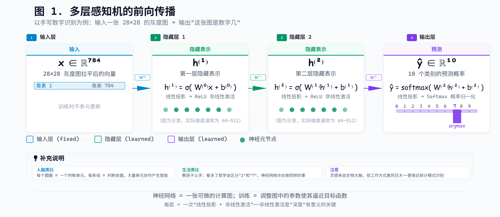
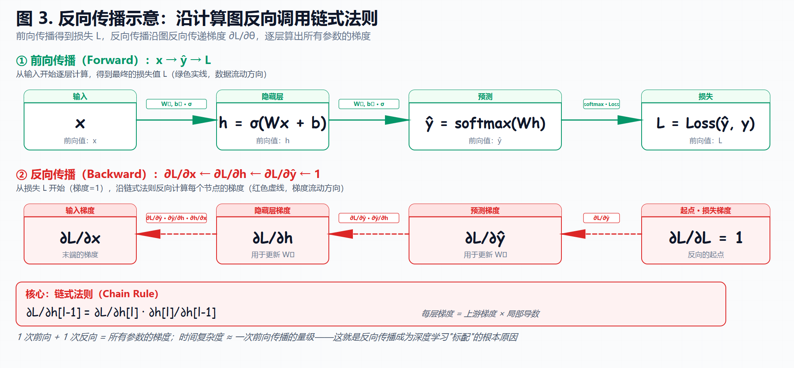
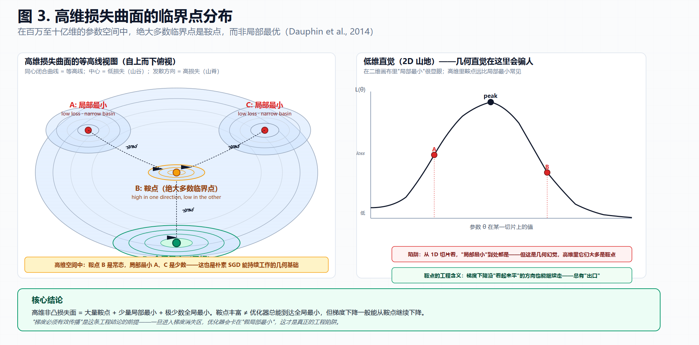

> [!NOTE] 笔记说明
>
> 这篇笔记对应的是《[[关于 AI 的学习路线图]]》一文中所规划的第二个学习阶段。其中记录了我对深度神经网络的具体理解，以及对 LLM 所进行的架构剖析。同样的，这些内容也将成为我 AI 系列笔记的一部分，被存储在本人 Github 上的[计算机学习笔记库](https://github.com/owlman/CS_StudyNotes)中，并予以长期维护。

在《[[AI 研究方法的演变]]》那篇笔记中，我已经基于各种 AI 研究方法中所使用的数学模型，系统性地介绍了 AI 的能力边界。接下来的任务，是沿着学习路线图所规划好的坐标系继续往下走，把注意力由*了解能力边界*转向*理解工作机制*。具体来说，这篇笔记将要讨论的主题如表 1 所示：

| 主题                     | 要讨论的内容                             |
|--------------------------|------------------------------------------|
| 函数逼近视角下的神经网络 | 如何用数学视角给出神经网络的基础定义。   |
| 损失函数                 | 如何对机器学习的目标进行标准化描述。     |
| 优化过程                 | 如何用反向传播与优化器谱系进行 AI 训练。 |
| 训练动力学               | 如何用训练曲线与评估方法进行成果诊断。   |
| 调优策略                 | 如何用调优策略解决训练中的问题。         |
| 能力边界与判断力         | 如何用工程视角判断 LLM 的能力边界。      |

**表 1** 本笔记要讨论的主题及其内容

需要首先说明的是，我们在这讨论上述主题时并不打算讨论训练架构的选择（例如选择 CNN 还是 Transformer、采用几层注意力机制等）、训练框架的对比（PyTorch 还是 JAX）、以及其他与 LLM 实现细节相关的问题。这些问题属于我们下一个学习阶段的内容。这篇笔记的侧重点是理解训练过程。换言之，我们就是要用数学模型解释 LLM 的工作机制，这其中关心的问题是参数空间的更新机制、损失的梯度流向、训练的收敛与发散。虽然这些在 LLM 训练完成之后就不再可见，但 **它们决定了 LLM 在被调用时的行为上限**。

至于提示词怎么写、上下文怎么管、输出怎么解析，这些都是应用层要做的工作。多数 LLM 使用者在做后者，但只有前者才能解释为什么相同的提示词在不同 LLM 上行为差异巨大，而这才是工程上反复出现的问题。总而言之，我接下来要做的工作是接着《[[AI 研究方法的演变]]》这篇笔记中所做的学习思路，继续用 *数学模型 → 典型应用 → 暴露的边界* 的论述方式将 LLM 训练成果中的 "内部黑箱" 翻译成可诊断的工程现象。

## 神经网络：通用函数逼近器

在《[[AI 研究方法的演变]]》那篇笔记中，我们从方法论演变的角度出发，为读者解释了 AI 当前主流的研究方法为什么会走向深度神经网络。简而言之，就是在逻辑符号无法对所有规则进行编码，而概率方法又卡在了特征工程的情况下。深度神经网络在后一问题上为人们提供了一种激进的解决思路：放弃人工设计特征，让 AI 自己从数据中学。而接下来，我们需要进一步解释的是，这个解决思路背后的数学基础究竟是什么。

### 通用逼近定理

**通用逼近定理（Universal Approximation Theorem）**是神经网络能成为 AI 主流研究方法所依赖的第一个数学基础，它在 1989 年由乔治·塞本科（George Cybenko）首次证明（对 sigmoid 类激活函数成立），同年由库尔特·霍尼克（Kurt Hornik）等人放宽到任意非常数有界连续激活函数（"挤压" 类函数），并由摩谢·莱什诺（Moshe Leshno）等人在 1993 年进一步扩展到包括 ReLU 在内的非多项式激活函数。根据该定理，我们可以认为在任一仅含**单个隐藏层**的前馈神经网络中，只要隐藏神经元数量足够多，并且使用某种非线性激活函数，就能在任意精度上逼近**任意紧集**上的任意连续函数。如果换用数学语言来描述就是：

$$
\forall \epsilon > 0,\; \exists f_\theta \in \mathcal{F},\; \sup_{x \in \mathcal{X}} |f_\theta(x) - f^*(x)| < \epsilon
$$

其中，$f^*: \mathcal{X} \to \mathcal{Y}$ 就是任意紧集上的连续函数，$f_\theta$ 则是神经网络所表示的参数化函数族 $\mathcal{F} = \{f_\theta \mid \theta \in \Theta\}$ 中的某个成员，而 $\theta$ 是网络中所有的权重与偏置。这个定理证明了神经网络*在理论上能够表示*任意精度的连续函数近似。

这里需要特别指出的是，通用逼近定理证明的只是神经网络的**存在性**，并不是**可学习性**。换言之，只要参数调得够好，神经网络确实能逼近到任意精度，但这并不保证其使用的优化算法能找到那个 "够好" 的参数。这一点呼应了《[[AI 研究方法的演变]]》中关于 "通用逼近能力" 的论断：网络表达能力只是必要条件，不是充分条件。为了进一步理解这种表达能力在工程中的边界，我们可以把神经网络形式化为下面这个参数化映射：

$$
f_\theta: \mathcal{X} \to \mathcal{Y}, \quad \theta \in \Theta
$$

在该映射中，$\mathcal{X}$ 是输入空间（例如 $28 \times 28$ 的灰度图像），$\mathcal{Y}$ 是输出空间（例如 10 个数字类别的概率分布），$\theta \in \Theta$ 是参数空间（所有权重与偏置的集合）。基于神经网络的 AI 训练，本质上就是在 $\Theta$ 这个高维空间中寻找一组参数 $\theta^*$，使得 $f_{\theta^*}$ 在既定目标下接近我们想要的函数 $f^*$。

从这个视角看，神经网络的工程边界可以分成两层：网络架构与参数化方式决定它能够表示哪些函数，数据、损失函数和优化过程则决定训练能否找到其中有效的成员。后文讨论损失函数与优化过程时，我们会分别看到这两层边界的具体表现。

### 典型应用：多层感知机

既然神经网络可以看作参数化映射，那么它究竟如何完成 "输入一张图、输出一个分类概率" 的过程呢？工程上，这个过程通过**前向传播（Forward Propagation）**实现：输入沿着**计算图（Computational Graph）**依次经过矩阵乘法、加法和激活等运算，最终得到输出。下面，我们以多层感知机（MLP）完成 MNIST 手写数字分类的应用为例，用数学的形式来直观地感受一下神经网络的工作方式。

$$
h^{(0)} = x
$$

$$
h^{(l+1)} = \sigma\!\left(W^{(l)} h^{(l)} + b^{(l)}\right), \quad l = 0, 1, \dots, L-1
$$

$$
\hat{y} = \text{softmax}\!\left(W^{(L)} h^{(L)} + b^{(L)}\right)
$$

其中，$x \in \mathbb{R}^{784}$ 是把 $28 \times 28$ 灰度图拉平后的向量，$W^{(l)} \in \mathbb{R}^{d_{l+1} \times d_l}$ 和 $b^{(l)} \in \mathbb{R}^{d_{l+1}}$ 是第 $l$ 层的权重矩阵和偏置向量，$\sigma$ 是非线性激活函数（如 ReLU），$h^{(l)}$ 是第 $l$ 层的隐藏表示，$\hat{y} \in \mathbb{R}^{10}$ 是 10 个数字类别的预测概率。下面，让我们再通过图 1 来展示一下这个多层感知机的前向传播过程。

**图 1** 多层感知机的前向传播

从上面这张图中，读者可以非常直观地看到这个多层感知机应用的整个计算过程，它的每一层都在做以下两件事：

1. 把上一层的表示 $h^{(l)}$ 通过 $W^{(l)} h^{(l)} + b^{(l)}$ 投影到一个新的空间，这个投影本身是线性的；
2. 通过 $\sigma$ 函数把该线性结果折一下，以便让 AI 模型能表示非线性关系。

这意味着，如果只有线性投影，无论堆多少层，最终都等价于一个单层线性变换（这是矩阵乘法的结合律决定的）。所以 $\sigma$ 函数不是装饰，而是让神经网络的 "深度" 真正有意义的关键。最经典的反例是**XOR 问题**：XOR 仅在两个输入取值不同时输出 1，其四个输入点无法用一条直线分开，因此无隐藏层的线性感知机无法正确分类。Minsky 与 Papert 在 1969 年系统揭示了这类感知机的表示局限。含隐藏层且使用非线性激活的 MLP 可以把 XOR 的输入映射到一个线性可分的表示空间，从而完成分类。对函数表示能力而言，增加网络深度只有在层间包含非线性变换时才有意义，如图 2 所示。

**图 2** 感知机的局限：线性可分与 XOR 问题

需要特别强调的是：通用逼近定理告诉我们，含一个隐藏层且足够宽的前馈网络就能逼近任意连续函数；而 Eldan & Shamir（2016）、Telgarsky（2016）等关于 **深度分离（Depth Separation）** 的研究进一步证明，对某些特定函数类，深网络可以用远少于浅层网络的参数完成表示。不过，这些结论依赖特定的函数类别与网络条件，尚不能构成对所有实际深度网络参数效率的统一解释。至于计算图本身，它不只是教学工具，同时也是执行反向传播的基础数据结构。PyTorch 和 JAX 这类框架之所以能做到自动微分，本质上就是维护了这一数据结构，之后在反向阶段只需沿着图结构进行反向计算梯度即可。关于这一点，我们稍后会详细讨论。目前，读者只需要记住：神经网络 = 一张可微的计算图，训练 = 调整图中的参数。

### 暴露的边界

基于上述数学视角，读者可以直观地理解到：基于神经网络的 AI 训练本质上就是基于一个参数化的函数族在寻找它的最佳参数。但同样的，这种视角也同时暴露出该方法在工程实现上绕不开的三个能力边界。

1. **逼近能力 ≠ 拟合能力。** 通用逼近定理归根结底只是在数学方法上指导 AI 去寻找 "存在够好的参数"，但是不是真的能在具体工程实现中找到这些参数，这其实是另一个问题。优化过程中的局部最优、鞍点、梯度消失都会让训练停在某个远未逼近 $f^*$ 的位置。这就是为什么 "理论可学" 和 "实际能训出来" 是截然不同的两件事，后者是优化算法要解决的问题。

2. **高维空间中的几何直觉失效。** 我们对二维平面上的函数拟合有很好的几何直觉，但 $\Theta$ 的维度往往是百万级甚至十亿级。在这个量级的空间里，局部最优和全局最优的概念本身就变得微妙。毕竟，绝大多数临界点不是局部最优，而是鞍点。这导致训练过程的几何性质远不如低维情形那么直观。好在，我们还可以通过一种被称为 **流形假设（Manifold Hypothesis）** 的方法来进行部分补救：在很多真实任务中，尽管输入空间 $\mathcal{X}$ 维度极高，但有意义的数据其实分布在一个低维流形上。这意味着神经网络实际需要学习的函数，其有效定义域远小于 $\mathcal{X}$ 的标称维度。这个假设目前仍是经验性的而非普遍成立的定理，但它是理解 *为什么深度学习在图像、文本上有效* 的认知桥梁。Fefferman、Mitter 与 Narayanan（2016）的 *Testing the Manifold Hypothesis* 讨论了如何从有限样本检验数据是否接近低维流形，为这一假设提供了形式化的检验框架。

3. **函数逼近无法区分 "学到了规则" 与 "做对了模式"。** 这是《[[AI 研究方法的演变]]》在符号主义与联结主义交锋时提出的那个追问。神经网络能拟合任何函数，但拟合成功的内部权重配置，到底是在编码某种 "规则"，还是仅仅在做高维插值？我们从训练曲线和参数值上读不出来。

## 损失函数：学习目标的标准化

在"神经网络：通用函数逼近器"那一节中，我们用数学语言将神经网络形式化成了一个参数化的函数族 $f_\theta: \mathcal{X} \to \mathcal{Y}$，并指出用它训练 AI 的本质就是在 $\Theta$ 这个高维空间中寻找一组参数 $\theta^*$。但对于*用什么标准来判断够好*，还是一个亟待解决的问题。换言之，我们在 AI 的训练过程中不能盲目地反复修改 $\theta$，这就需要一个可计算的信号来指引当前神经网络的优化方向。

### 损失函数的定义

这个信号的生成器在专业术语中被称为 **损失函数（Loss Function）**，它的作用是在单样本上定义下面这样一个实值函数：

$$
\mathcal{L}: \mathcal{Y} \times \mathcal{Y} \to \mathbb{R}_{\geq 0}, \quad \mathcal{L}(y, \hat{y}) \geq 0
$$

其中，$y$ 是真值标签，$\hat{y} = f_\theta(x)$ 是模型预测，$\mathcal{L}$ 返回的是一个非负实数，用来刻画 "这一次预测偏离真值多远"。把它对数据集 $\mathcal{D}$ 取期望，就会得到如下 **经验风险（Empirical Risk）** 函数：

$$
R(\theta) = \mathbb{E}_{(x, y) \sim \mathcal{D}}\left[\mathcal{L}(y, f_\theta(x))\right] \approx \frac{1}{N} \sum_{i=1}^{N} \mathcal{L}(y_i, f_\theta(x_i))
$$

从上述函数中，我们可以理解到 AI 训练的目标，就是在最小化这个 $R(\theta)$ 的解集，*损失函数是在解决 "学习目标的标准化"* 问题。换言之，人们想要模型做什么，必须先用 $\mathcal{L}$ 这个数学对象把它写出来，否则优化器无从下手。

当然了，这个标准化的方式背后藏着一个容易被混淆的不对称理解：*训练时优化的目标（$\mathcal{L}$）和上线时评估的目标（业务指标），往往是两件不同的事*。比如分类任务训练时用交叉熵，但业务上关心的是召回率、转化率；LLM 训练时用下一个 token 的交叉熵，但用户关心的是回答是否有用、是否安全。这种 "训练目标 vs 评估目标" 的脱节，正是损失函数所暴露的核心能力边界。

### 典型应用：从回归到序列的损失族

下面，我们沿着任务类型的演变，列出工程中最常用的损失函数族。

- **回归任务**：这类任务关心的是连续值预测，它常用以下三类损失函数：
  - **均方误差（Mean Squared Error, MSE）**：$\mathcal{L} = (y - \hat{y})^2$。对大误差惩罚重（平方放大），但对异常值敏感。
  - **平均绝对误差（Mean Absolute Error, MAE）**：$\mathcal{L} = |y - \hat{y}|$。对异常值更鲁棒，但在零点处不可导，需要次梯度处理。
  - **Huber 损失**：在小误差时表现为 MSE，在大误差时表现为 MAE，是两者的折中，常用于带噪声的回归场景。

- **分类任务**：这类任务关心的是概率分布预测，常用的损失函数是 **交叉熵（Cross Entropy）**：

    $$
    \mathcal{L}_{\text{CE}} = -\sum_{c=1}^{C} y_c \log \hat{y}_c
    $$

    直觉上，交叉熵衡量的"模型预测分布 $\hat{y}$ 与真值分布 $y$ 之间的信息距离"。对于二分类任务，交叉熵退化为**二元交叉熵（Binary Cross Entropy, BCE）**；对于多分类任务，常与 softmax 配合使用。LLM 的预训练本质上就是一个大规模多分类问题（在词表上预测下一个 token 的分布），因此交叉熵是 LLM 训练的事实标准损失。

- **序列任务**：这类任务则需要处理变长与对齐问题，常用以下两类损失函数：
  - **CTC（Connectionist Temporal Classification）**：用于语音识别等需要把不定长输出对齐到定长标签的场景，例如把音频帧序列映射到文字序列。CTC 通过引入 "空白" token 来处理对齐不确定性，无需显式标注每一帧对应的字符。
  - **标签平滑（Label Smoothing）**：把硬标签 $y \in \{0, 1\}$ 软化为 $y' = (1-\epsilon) y + \epsilon / C$，目的是防止模型对训练数据过度自信，从而提升泛化能力。Vaswani et al.（2017）的 Transformer 原始论文在训练中采用了标签平滑。

**LLM 训练链路的词表前置：BPE 与 Subword Tokenization。** 上一段提到 LLM 预训练是"在词表上预测下一个 token 的分布"，但词表本身从何而来？这是 LLM 训练链路上绕不开的前置工程。**BPE（Byte-Pair Encoding，字节对编码）**、WordPiece 和 Unigram 等方法都可用于构建子词词表；不同模型会根据语料、语言和工程目标选择不同方案。BPE 从字符或字节级表示出发，反复合并语料中频率较高的相邻单元，直到词表规模达到设定阈值。**Subword Tokenization** 是这类方法的统称，介于"字符级"（词表较小、序列较长）与"词级"（词表较大、容易产生未登录词）之间。其工程收益有三：一是把生僻词、专有名词拆成已有单元，显著缓解未登录词问题；二是词表规模可控，使得 softmax 层的计算与显存占用能够在序列长度和词表容量之间取得平衡；三是合适的子词设计可以改善多语言共享词表的效率。BPE 最早作为 1994 年的无损压缩算法提出，后来被引入神经机器翻译和大语言模型的词表构建。理解这一点后，前述"LLM 预训练是词表上预测下一个 token 的分布"这句话的完整含义才清晰：模型实际是在当前 tokenizer 定义的词表上学习分类分布。

**词表规模的工程权衡。** 词表大小不是越大越好，它直接影响交叉熵计算和序列长度。**词表越大**，softmax 层 $W \in \mathbb{R}^{d \times |V|}$ 的参数与计算量越大；**词表越小**，文本通常需要更多 token 表示，序列变长会抬升 Transformer 自注意力的 $O(N^2)$ 计算量与位置编码压力。以中文为例，1000 个汉字最终会被切分成多少 token，取决于具体 tokenizer、训练语料和词表规模，不能用一个固定比例代表所有模型。当代模型的词表规模差异也很大，从数万到十万以上都有；工程设计本质上是在 softmax 成本、序列长度、多语言覆盖和模型效果之间权衡。这是"损失函数"一节所暴露的"训练目标与计算成本耦合"在词表层面的具体表现。

### 暴露的边界

基于上述对损失函数的形式化与典型应用的梳理，读者可以直观地看到：损失函数决定了 AI 训练的方向，但也同时暴露出三个工程上绕不开的边界。

1. **错误损失 → 错误目标。** 损失函数是在定义学习目标的标准，但这种标准化定义的本身也可能会出错。其中的一种典型情况被称为 **标签泄漏（Label Leakage）**，即训练数据中包含了本不应被 LLM 看到的目标信息，导致损失看似下降但泛化崩溃。另一种情况被称为 **目标错配**，即业务上关心的是召回率，但训练时用了精度相关的损失。损失函数选错了，再优秀的优化器也只能把模型带到错的地方。

2. **损失与评估指标的脱节。** 训练时优化的是 $\mathcal{L}$（可微、可求梯度），上线时评估的是业务指标（往往不可微、不可直接优化）。这两者之间存在天然的鸿沟。LLM 训练用 token 级交叉熵，但用户关心的是回答的有用性、安全性、事实性，这些指标既不可微又难以在训练中直接使用。这种脱节催生了后续 RLHF（基于人类反馈的强化学习）等对齐方法，用一个可微的奖励模型去逼近人类偏好，再回头指导语言模型训练。**这条边界在"训练动力学"一节中会以 Goodhart 定律的形式再次出现：当指标变成目标后就不再是好指标**。关于这一点的延伸讨论，读者可参考本笔记在 "补充路线：从监督训练到对齐训练" 这一节中所介绍的内容。

3. **不平衡数据下的损失加权。** 当数据分布严重倾斜时（例如欺诈检测中正样本占比 0.1%），标准的交叉熵会让模型倾向于预测多数类。常见的工程缓解包括：
   - **类别加权**：在损失中对少数类乘以更大的权重 $w_c$，即 $\mathcal{L} = -\sum_c w_c \cdot y_c \log \hat{y}_c$，其中 $w_c$ 与类别频率成反比。
   - **Focal Loss**：在交叉熵基础上乘以 $(1 - \hat{y}_c)^\gamma$ 调制因子，让"已经分对的样本"贡献更小的损失，迫使模型聚焦于难样本。这是目标检测领域处理正负样本不平衡的经典做法。

   但这些加权策略都属于对错误的补救，不是对问题的根治。如果数据本身的标注质量差或采样偏差严重，再精巧的损失设计也只能在错位的数据上学到错位的模式。

## 优化过程：寻找足够好的参数

正如我们之前所说，神经网络在具体的工程实现中其实就是一张 **可微的计算图**。这里的 "可微"，指的是计算图上每个节点（矩阵乘法、加法、激活函数）都可以对其输入求偏导。而它训练的目标则由最小化损失函数 $R(\theta)$ 来进行指导，具体方法是在 $\Theta$ 这个高维空间中沿负梯度方向迭代，在专业术语中被称为 **梯度下降（Gradient Descent）** 方法。同样的，本节接下来会先介绍优化器的数学原理，再沿 SGD 到 AdamW 的演化谱系展示工程实现，最后落到梯度不稳定与优化不等于泛化等绕不开的边界。

### 优化器的数学基础

损失函数只是定义了我们在整批训练数据上的期望，直接对全量数据求梯度在工程上代价过高，因此实践中几乎都使用 **随机梯度下降（Stochastic Gradient Descent, SGD）**：每次只用一个 mini-batch 估计梯度，更新参数：

$$
\theta_{t+1} = \theta_t - \eta \nabla_\theta \mathcal{L}_{\text{batch}}(\theta_t)
$$

其中，$\eta$ 是学习率，$\nabla_\theta \mathcal{L}_{\text{batch}}$ 是当前 mini-batch 上的梯度估计。这条公式看似平凡，但 *如何高效算出每个参数的梯度呢？* 这才是关键问题所在，人们目前所能想到的解决方案就是**反向传播（Backpropagation）**，即沿计算图反向调用链式法则，如图 3 所示。

**图 3** 反向传播示意图

具体来说，若第 $l$ 层的输出 $h^{(l)}$ 取决于第 $l-1$ 层的输出 $h^{(l-1)}$，则根据链式法则，我们可以得到：

$$
\frac{\partial \mathcal{L}}{\partial h^{(l-1)}} = \frac{\partial \mathcal{L}}{\partial h^{(l)}} \cdot \frac{\partial h^{(l)}}{\partial h^{(l-1)}}
$$

如此逐层反推，就能用一次前向 + 一次反向算出所有参数的梯度。这个过程的时间复杂度与一次前向传播同量级，这正是反向传播成为深度学习标配的根本原因：链式法则把它从数学理论上的可计算变成了工程方面的可实现计算。Rumelhart、Hinton、Williams 在 1986 年的工作把这一思想系统化，奠定了深度学习的训练机制，关于其历史脉络，参见《[[AI 研究方法的演变]]》的对应章节。

当然，尽管反向传播解决了梯度计算的实现问题，但它在工程上也存在着 **梯度不稳定** 的能力边界，其具体表现为：

- **梯度消失（Vanishing Gradient）**：深层网络中，靠后的梯度要沿链式法则连乘多遍才能传回靠前的层。若中间激活函数的导数小于 1（如 sigmoid 早期），连乘后会快速衰减到零，靠前的层几乎收不到学习信号。
- **梯度爆炸（Exploding Gradient）**：若中间导数大于 1，连乘后会指数增长，参数更新剧烈震荡甚至发散为 NaN。

这两类问题在 RNN 里尤为严重，因为 RNN 沿时间步反向传播，相当于在一条非常长的链上反复连乘。现代深度网络通常组合使用 **残差连接（Residual Connection）**、合适的参数初始化、归一化、梯度裁剪和非饱和激活函数来缓解梯度不稳定。残差连接让 "恒等映射" 成为网络的默认行为（He et al. 2016 解决的核心问题是深度网络的 "退化问题"，即深度增加时训练误差反升），同时为梯度提供了绕过部分非线性变换的捷径。激活函数则影响每层导数的分布，常见选择包括：

- **ReLU（修正线性单元, Rectified Linear Unit）**：$\sigma(x) = \max(0, x)$。其导数在正区间恒为 1，能缓解 sigmoid 在饱和区造成的梯度消失，但负区间导数为 0，也可能产生 "死亡 ReLU"。ReLU 曾长期是卷积神经网络的常用选择。

- **GELU（高斯误差线性单元, Gaussian Error Linear Unit）**：$\sigma(x) = x \cdot \Phi(x)$，其中 $\Phi$ 是标准正态分布的累积分布函数。GELU 在零点附近采用平滑过渡而非硬截断，在 Transformer 语言模型中被广泛采用，BERT、GPT-2 和 GPT-3 的公开资料都使用了它。

- **SwiGLU（Swish 门控线性单元, Swish Gated Linear Unit）**：将输入分两路，一路经过 Swish 激活（即 $\text{Swish}(W_1 x) = W_1 x \cdot \sigma(\beta W_1 x)$），另一路保持线性，最终做逐元素乘：$\text{SwiGLU}(x) = \text{Swish}(W_1 x) \otimes (W_2 x)$，其中 $\otimes$ 表示逐元素乘。SwiGLU 结合门控机制，是 LLaMA、PaLM 等近年大模型的默认选择。

  需要指出的是，ReLU、GELU 与 SwiGLU 都在改善深层网络的梯度传播和表示能力，但实现机制并不相同：ReLU 使用分段线性非饱和激活，GELU 提供平滑门控，SwiGLU 则把激活与门控结构结合起来。对于具体的深层非线性网络，目前仍缺乏覆盖所有架构与数据分布的训练稳定性保证，因此激活函数通常需要结合初始化、归一化、残差连接和消融实验共同选择。

### 典型应用：从 SGD 到 AdamW 的演化谱系

反向传播给出的是梯度方向，但决定沿这个方向走多远、以什么方式累积历史信息的，是优化器。下面，让我们从 SGD 出发，沿着 AdamW 的演化谱系，看看优化器在工程实践中是如何一步步发展的。

#### SGD 及其动量变种

**SGD（随机梯度下降，Stochastic Gradient Descent）** 是最简单的优化器，其更新规则为：

$$
\theta_{t+1} = \theta_t - \eta \nabla_\theta \mathcal{L}(\theta_t)
$$

纯 SGD 的问题在于梯度估计有噪声，尤其在高维非凸损失面上，像布朗运动一样来回震荡。**动量（Momentum）** 引入历史梯度的指数滑动平均：

$$
v_{t+1} = \beta v_t + \nabla_\theta \mathcal{L}(\theta_t), \quad \theta_{t+1} = \theta_t - \eta v_{t+1}
$$

如果想直观点理解，动量的作用就是增加参数更新的 "惯性"（就像小球滚下坡），以便加速收敛并抑制震荡。Nesterov 动量进一步把 *先按动量探一步、再在那个位置算梯度* 的修正项引入，是凸优化中收敛速度更快的一个变种。

#### 自适应学习率：AdaGrad / RMSProp / Adam

不同参数的梯度量级天然差异巨大，有些权重长期小幅更新，有些则剧烈震荡。固定学习率很难同时照顾两类参数。**AdaGrad（Adaptive Gradient，自适应梯度）** 对每个参数维护一个梯度平方的累积和，按参数的历史活跃度反比地缩小其学习率。其优点是稀疏特征友好，缺点是学习率单调下降、可能过早停止学习。**RMSProp（Root Mean Square Propagation，均方根传播）** 改用指数滑动平均缓解 AdaGrad 的过早衰减，**Adam（Adaptive Moment Estimation，自适应矩估）** 则把动量（一阶矩）和 RMSProp（二阶矩）合二为一，是当前深度学习的默认起点。其更新规则如下：

$$
m_{t+1} = \beta_1 m_t + (1 - \beta_1) \nabla_\theta \mathcal{L}(\theta_t) \quad \text{（一阶矩）}
$$

$$
v_{t+1} = \beta_2 v_t + (1 - \beta_2) (\nabla_\theta \mathcal{L}(\theta_t))^2 \quad \text{（二阶矩）}
$$

$$
\hat{m}_{t+1} = \frac{m_{t+1}}{1 - \beta_1^{t+1}}, \quad \hat{v}_{t+1} = \frac{v_{t+1}}{1 - \beta_2^{t+1}} \quad \text{（偏差修正）}
$$

$$
\theta_{t+1} = \theta_t - \eta \frac{\hat{m}_{t+1}}{\sqrt{\hat{v}_{t+1}} + \epsilon}
$$

其中 $\beta_1, \beta_2$ 通常取 0.9 和 0.999。偏差修正步骤用于抵消训练初期 $m_t$、$v_t$ 被初始化为零导致的偏差，是 Adam 工程实践中不可省略的一步。Adam 的工程经验是"几乎不需要调学习率"，$\eta = 10^{-3}$ 在大量任务上都能起步；具体到不同模型类别，BERT 类小模型常用 $2 \times 10^{-5}$ 量级，ResNet-50 类视觉模型常用 $10^{-3}$，GPT 类大模型受限于全局 batch size 较大，峰值学习率常被压到 $3 \times 10^{-4}$ 上下。具体的扫描范围与判定标准将在"调优策略"一节的训练层面小节展开。

#### AdamW：解耦权重衰减

深度学习里常用的 **权重衰减（Weight Decay）** 是一种正则化：每步把参数向零拉一点，抑制过拟合。传统实现是直接把衰减项加到损失函数里，再求梯度。但 Adam 的自适应学习率会让衰减项也被 "自适应缩放"，失去了原本的意图。**AdamW（Adam with decoupled Weight Decay）** 的修正是把衰减项从损失里拿出来，直接作用在参数更新上：

$$
\theta_{t+1} = \theta_t - \eta \frac{\hat{m}_{t+1}}{\sqrt{\hat{v}_{t+1}} + \epsilon} - \eta \lambda \theta_t
$$

这样权重衰减就不再受自适应学习率的干扰。AdamW 是当前训练 Transformer 系模型的标配。

#### 学习率调度（Learning Rate Scheduling）

把训练比作下山：刚开始要大胆迈步（高学习率），接近谷底时要谨慎（低学习率）。**学习率调度** 就是给 $\eta$ 画一条随训练步数变化的曲线。

- **Warmup**：训练最初几千步把 $\eta$ 从 0 线性升到峰值，避免初期梯度剧烈震荡把参数推到坏区域。
- **Cosine Decay**：训练中后段让 $\eta$ 沿余弦曲线从峰值平滑降到接近零，比阶跃式下降更稳。
- **Linear Decay**：把 $\eta$ 从峰值线性降到 0，实现简单但尾部下降过快。

当代大模型训练普遍组合：**Warmup + Cosine Decay** 或 **Warmup + Linear Decay**。这两种不是"原理上最优"，而是"工程上够用"。

### 暴露的边界

优化过程决定了"参数怎么动"，但它本身也暴露三个工程上绕不开的边界。

1. **优化 ≠ 泛化。** 这是最重要的一条边界：*训练损失降得越低，测试表现未必越好*。这条边界的根源是经验风险的极小点并不等于真实风险的极小点。优化器把 $\theta$ 带到训练损失最低的位置，但训练数据只是真实分布的一个有偏样本。在这个位置，模型可能"完美拟合了训练数据中的噪声"，却把未见样本的判别能力丢了，这就是过拟合。深度学习中的过拟合不是单一现象：它可能来自数据不足（特征相对样本数过多）、参数过多（表达能力过强）、训练时间过长（被噪声牵着走）。任何调优手段都只能"延缓"过拟合的发生，不能"消灭"它。一旦把优化与泛化当作一件事来处理，工程上会反复陷入"训练集完美 → 测试集崩盘"的死循环。

2. **鞍点比局部最优更常见。** 优化器在 $\Theta$ 这个高维空间里走的是局部路径，每一步只看自己当前点的梯度。这让人担心会不会卡在局部最优。事实上，Dauphin 等人 2014 年的研究指出：在高维非凸损失面上，*绝大多数临界点不是局部最优，而是鞍点*，形象地说，损失曲面更像一片有褶皱的山地，每个山坳都是一个 "出口"，真正的局部最优反而稀少。这意味着梯度下降一般能持续走出"看起来平"的地方，找到更好的位置。但这个结论有个前提：*梯度必须有效传播*。一旦进入 "梯度消失区"，优化器看到的全是接近零的梯度，会误以为已收敛，这其实是"假局部最优"，是前述 "梯度不稳定" 小节中激活函数失效在优化阶段的体现。鞍点丰富这一事实，对深度学习是"半个好消息"，它解释了为什么朴素 SGD 在大多数任务上不至于彻底失败。这一损失曲面的高维几何形态如图 4 所示。

    

    **图 4** 高维损失曲面的鞍点分布

3. **大模型训练损失不收敛不等于效果差。** 在小模型时代，不收敛意味着代码 bug 或超参数灾难。但在大模型时代，*训练损失的不收敛在某些特定设置下是正常的、甚至是必要的*。一个值得注意的现象是：当模型规模逼近数据量约束时（即所谓过训练），继续训练有时会导致验证损失先降后稳甚至回升，而训练损失仍在持续下降——这种训练与验证之间的剪刀差在传统 ML 中是过拟合的典型信号，但在大模型场景下，下游任务的表现仍可能继续改善。这个反直觉的现象说明：*训练损失的数值变化，已经不再是模型质量的有效指标*：评估必须看下游任务的实际表现。这是评估方法论从看损失曲线转向看评测基准的根本原因，也是接下来的这一节要展开的核心议题。而关于 Chinchilla 与规模化定律的进一步细节，将会在 "调优策略" 这一节中系统讨论。

## 训练动力学：诊断学习成效

在"优化过程"末尾，我们看到：*在 LLM 训练中，损失曲线的数值变化已经不再是 LLM 质量的有效信号*。这意味着评估 AI 的训练成效不能只看训练损失的下降曲线，而要系统地考察多条曲线、不同数据集上的指标，以及面向任务的评估。这一节要展开的，就是这套诊断体系。接下来，我们将继续沿着 "数学基础 → 典型应用 → 暴露的边界" 的论述方式展开，先用训练集/验证集/测试集的隔离原则与 K 折/时序切分给出评估的工程原则，再用曲线分析、LLM 评测方法与可解释性方法展示典型诊断手段，最后落到 Goodhart 律等绕不开的边界。

### 诊断的数学基础：评估的工程原则

之前介绍的损失曲线所诊断的问题是："LLM 在拟合数据这件事上做得怎么样？"，而对于 LLM 的实际可用性，我们则需要另外建立一套评估方法论来解决，这是在 LLM 的 **训练阶段** 和 **上线阶段** 之间必须建立的桥梁。

**对 LLM 进行评估的第一条原则是：训练集、验证集、测试集要执行严格隔离。** 因为这三者的功能完全不同：

- **训练集（Train Set）**：用于更新 LLM 的参数 $\theta$。
- **验证集（Validation Set, Dev Set）**：用于调超参数（学习率、正则化系数、模型结构选择）。可以反复使用来选最优超参数。
- **测试集（Test Set）**：用于评估 LLM 最终的真实泛化能力，**只能用一次**。换言之，任何根据测试集反馈调整模型的举动，都让测试集退化为验证集，从而失去对真实泛化能力的估计。

违反这条原则的最常见方式是 "测试集泄漏"：在测试集上调过超参数、在测试集上选了 epoch 数、或在测试集上做了模型选择。这等价于把测试集当作验证集使用，导致报告指标虚高。LLM 评估中的 "数据污染" 现象，可以视为测试集泄漏在大规模语料下的变种。

接下来，如果遇到数据稀缺的场景，我们的典型应对策略是 **K 折交叉验证**。这种方法会把数据均分成 K 份，轮流把 1 份当验证集，其余 K-1 份当训练集，重复 K 次，最终用 K 次验证结果的均值评估模型。当训练数据在万级以下时，K 折往往能比单一 train/val 划分给出更稳定的指标。深度学习时代 K 折变得不那么主流（计算成本太高），但在医疗、金融等小数据场景仍是标准做法。

最后，**与时间序列相关的数据集需要进行特殊处理。** 金融、IoT、日志等场景下数据有严格的时间依赖，随机划分会把 "未来" 泄漏到 "过去"，模型会学到用未来预测当前的作弊模式。**TimeSeriesSplit** 的解决方式是按时间顺序切分：训练集用 $[0, t_1]$，验证集用 $[t_1, t_2]$；下一折训练集扩展为 $[0, t_2]$，验证集用 $[t_2, t_3]$；依此类推。每折的验证集只取当前时间窗口之后的紧邻一段，且各折验证集之间互不重叠，严格保证训练时刻早于验证时刻。

这套评估方法论面向的是传统机器学习的中小数据场景。LLM 时代由于数据集规模膨胀到亿级，单一划分加 K 折变得不必要，但 "训练/验证/测试隔离" 的第一原则仍然成立，甚至变得更难保证：因为预训练数据是互联网文本，测试集的内容很可能已经以某种形式混入预训练语料。

### 典型应用：训练曲线分析、LLM 评测与可解释性方法

训练阶段的曲线诊断主要回答三类问题：模型是否在拟合训练数据？模型是否在过拟合？训练是否已经收敛？围绕这三类问题，工程上有四个最常用的曲线维度。

**训练损失曲线** 刻画 LLM 对训练数据的拟合进度。典型形态是单调下降到接近某个值后趋于平稳。但具体形态会因任务、模型、数据规模差异巨大：小模型在小数据集上常出现陡降后平稳；大模型在大规模预训练上常呈现"线性下降"，既不饱和也不真正稳定，损失沿训练步数持续线性下降，这看似是"没收敛"，其实是模型容量还远未饱和。

**验证损失曲线** 与训练损失曲线对比使用。这是诊断是否过拟合的核心证据。理想情形是两条曲线一起下降并同步平稳；但若训练损失持续下降而验证损失先稳后升，剪刀差出现，便是过拟合的典型信号。**训练准确率 vs 验证准确率** 同样适用于分类任务，本质上是验证损失曲线的离散版本。

**学习率曲线** 通常不是诊断对象而是治疗手段。日志里跟踪学习率，是为了把模型行为的异常归因到学习率的变化上，例如突然的损失尖峰可能正好对应学习率上升，Cosine 调度末端的损失反弹可能对应学习率归零。

**梯度/权重统计** 是更深一层的诊断，包含梯度范数、权重范数、激活分布等。这些曲线在常规训练中不画，但在排查训练不收敛时启用：梯度范数趋向 0 提示梯度消失，权重范数爆炸提示权重在失控增长。

把这几条曲线放在一起看，常见的诊断模式有四种：

1. **健康收敛**：训练损失与验证损失同步下降、同步平稳，差距小。这是理想状态。
2. **欠拟合**：训练损失与验证损失都高位平稳，差距小。模型容量不够或训练时间不足。
3. **过拟合**：训练损失持续下降，验证损失先稳后升，差距扩大。模型容量过大或训练数据不足，详见本文稍后在 "调优策略" 这一节中与正则化与数据增强相关的讨论。
4. **训练不稳定**：训练损失与验证损失都剧烈震荡，没有平稳趋势。学习率过大、批量过小、数据质量差都可能引发。工程师面对这种模式，第一反应不是换模型，而是先检查学习率、数据 shuffle、损失是否出现 NaN。

这四种形态是连续谱上的离散标签。实际项目中大量情况是介于过拟合与欠拟合之间，这时调优决策取决于 "训练损失是否还有下降空间"，若还有下降空间，就加量训练；若已饱和，则需要更大的模型或更好的数据。诊断的本质是把直觉决策系统化，避免工程师在训练-验证之间的剪刀差里反复横跳。

评估 LLM 与评估传统模型有根本差异：传统模型的评估目标是分类/回归的数值指标，LLM 的评估目标是开放式生成的语言质量。前者可对比 ground truth 自动计算，后者要么依赖人工判断，要么借助评估代理。LLM 评测有以下三个层次：

- **第一层：传统指标仍有意义，但场景受限。** 分类与回归指标（Accuracy、Precision、Recall、F1、AUC、MSE、MAE、$R^2$、MAPE）在 LLM 评测中依然有用，但只适用于封闭选项任务，例如多选题、判断题、定向信息抽取。例如 MMLU 是多选题，用 Accuracy 衡量；GSM8K 是数学应用题，用答案准确率衡量。**序列任务的特殊指标** 则专门服务于生成文本与参考答案的比较：

  - **BLEU（Bilingual Evaluation Understudy）**：用 n-gram 重叠率衡量生成文本与参考答案的相似度，常用于机器翻译。其数学形式为：

      $$
      \text{BLEU} = \text{BP} \cdot \exp\!\left(\sum_{n=1}^{N} w_n \log p_n\right)
      $$

      其中 $p_n$ 是生成文本与参考答案之间 n-gram 的 **修正精确率（modified n-gram precision）**，即参考答案中的每个 n-gram 最多被匹配一次（避免重复词刷分），$w_n$ 通常取 $1/N$（默认 $N=4$），$\text{BP}$ 是**短句惩罚因子（Brevity Penalty）**，避免生成过短的翻译骗得高分。BLEU 的工程局限是只算精确率不看召回率，且对同义改写不敏感。
  - **ROUGE（Recall-Oriented Understudy for Gisting Evaluation）**：侧重召回率的 n-gram 重叠率，常用于文本摘要。
  - **Perplexity（困惑度）**：语言模型在给定文本上的"惊讶程度"。对于长度为 $N$ 的 token 序列 $x_1, x_2, \dots, x_N$，其数学定义为 $\text{PPL} = \exp\left(-\frac{1}{N}\sum_{i=1}^N \log p_\theta(x_i \mid x_{<i})\right)$，其中 $p_\theta(x_i \mid x_{<i})$ 是模型在已知前文 $x_{<i}$ 条件下对当前 token 的预测概率。Perplexity 越低代表模型对文本越不 "惊讶"。注意 Perplexity 工程上常用 **测试集/验证集** 计算，用来衡量模型对未见文本的概率建模能力（即泛化水平），不是直接的下游任务表现：这一点在 LLM 评测中常被误用。典型的误用模式有两种：一是把 PPL 当作 "综合语言建模能力" 的全局排序指标，但同一模型在不同领域（代码、法律、对话）上的 PPL 差异巨大，不能跨领域聚合；二是把训练集与测试集 PPL 的差值（generalization gap）当作"泛化能力"的单一代理指标，而忽略了训练集 PPL 本身随训练步数变化的不平稳性。

- **第二层：LLM 特有基准。** 开放领域 LLM 评测无法靠分类准确率解决，于是出现了一组针对特定能力的基准数据集：
  - **MMLU（Massive Multitask Language Understanding，大规模多任务语言理解）**：涵盖 57 个学科的选择题，测试世界知识与推理。网上常见的关于 GPT-4、Claude 等模型的综合能力分数主要来源于此。
  - **HumanEval**：164 个编程问题，测试代码生成能力，常用 pass@k 指标（前 k 个采样中至少有一个通过的比率）。
  - **TruthfulQA**：测试模型在容易引发 "误解" 的问题上是否能给出真相，评估事实性与抗误导的能力。
  - **GSM8K**：8500 个小学数学应用题，测试多步算术推理。

  这些基准的核心设计理念是多维度采样：一个基准只测一种能力，多个基准组合才能勾勒模型的全貌。这也是"避免单一基准过度优化"原则的根据：在 MMLU 上刷满分的模型，未必在 HumanEval 上有同样的相对优势。

- **第三层：自动化评测与人类评测的权衡。** 当任务从选择题转向开放式问答，前两层指标就不够用了：生成文本的质量涉及逻辑性、连贯性、创造性、安全性，这些都是参考答案难以穷举的维度。LLM 评测由此进入"谁来判断好坏"的方法论选择：
  - **自动化评测**（如 BLEU、Exact Match、规则匹配）：可复现、成本低、易规模化。但难以捕捉细微质量，且容易受数据污染影响（模型在训练数据里见过测试题）。
  - **人类评测**：高质量、能捕捉细微差异，是开放式生成的金标准。但成本高、难以规模化，且标注者一致性难以保证，同一个回答，三个标注员可能给出分歧很大的评分，这部分反映了"质量本身是模糊的"而不只是标注质量问题。
  - **LLM-as-a-Judge**：用 LLM 评测 LLM（如 GPT-4 评判其他模型）。处于自动化与人类评测之间的折中点：成本可控，可规模化，但继承了 LLM 的偏差（如位置偏差、长度偏差、自我偏好），且评测分数对 judge prompt 的措辞高度敏感：同样的评判模型，仅改一句 prompt 的表述，分数可能波动数个百分点。
  - **评测协议设计**：根据任务选协议。
    - **Pairwise（两两比较）**：让评估者比较两个模型的输出哪个更好，适合 Arena 类平台。
    - **Single-Eval（绝对评分）**：让评估者对单一输出打分，适合标准化基准。
    - **Likert Scale（李克特量表）**：让评估者在 1-7 的量表上打分，适合人类标注。
  - **数据污染问题**：训练数据可能包含评测集，导致分数虚高。这是 LLM 评测的元层难题：测试集的内容在预训练语料里以某种形式出现过，评测就不再反映真实泛化能力。常见的应对是在评测集上做去污染处理（n-gram 重叠检测、泄漏测试集重制），但没有根治方案。

需要指出的是：上述三个层次其实是并存于实际评测流程中的，它们之间并没有相互替代的关系。例如在 Llama-3、GPT-4 等 LLM 的技术报告里，人们通常会同时列出 MMLU/GSM8K 自动化分数、人类评测 Elo 分数、以及 LLM-as-a-Judge 的细分维度评分。多种评测手段的多角度交叉验证，是当前 LLM 评测的工程妥协。

除此之外，**可解释性方法** 为诊断提供了另一类视角，它不直接给评估分数，而是试图回答"模型为什么这样决策"。这一类方法在 LLM 时代变得越来越重要，因为传统的准确率指标难以捕捉生成质量的细微差异。

**特征可视化（Feature Visualization）** 通过观察中间层的激活回答"网络学到了什么"。早期层通常对应边缘、纹理等低级特征；后期层对应更抽象的语义模式。这是 CNN 时代最经典的可解释性手段，在 LLM 时代也有对应：Transformer 某一层的隐藏表示聚类，能揭示模型"内部概念"的结构。

**注意力可视化（Attention Visualization）**是 Transformer 时代的对应方法。把注意力权重热力图画出来，观察模型"在生成这个词时关注了输入的哪些位置"。但要谨慎：注意力的强度不等于因果重要性：一个 token 注意力权重大，不代表去掉它就一定影响输出；反之亦然。这种"注意力可解释性的错觉"在 LLM 解释研究里被反复指出（Jain & Wallace, 2019）。

**SHAP / LIME 等后验方法** 是模型无关的归因方法：

- **SHAP（Shapley Additive Explanations）**：基于博弈论中的 Shapley 值，把每个特征的贡献拆解到公平分配。理论上严谨，但计算开销大。
- **LIME（Local Interpretable Model-agnostic Explanations）**：在单个预测的局部拟合一个简单线性模型作为解释。计算快，但稳定性受采样影响。

这两类方法适用于表格数据为主的传统机器学习场景，在图像、文本任务上的可解释性效用递减。

**关键边界：解释 ≠ 理解。** SHAP 能告诉你 "这个特征贡献了 30%"，但不能告诉你"为什么这个特征在因果上重要"。注意力可视化能告诉你"模型看了这里"，但不能告诉你"模型是否真的用到了这个信息"。**可解释性方法给出的是模型行为的描述，不是模型行为的因果解释**。把它们当作"理解模型"的工具会导致过度信任，尤其是当解释方法本身有偏差时（如 SHAP 在特征相关时分配不合理，注意力可视化在多头 Transformer 上不一致）。**对模型行为的真正理解，仍然来自对训练过程、损失设计、数据分布的系统性诊断**：可解释性方法只是辅助手段，不能替代对模型机制的扎实理解。这一边界与前述"评估方法的元层不可靠性"一脉相承：可解释性方法的元层不可靠，正是评估方法元层不可靠的另一种体现。

### 暴露的边界

训练动力学看似中立，曲线就是曲线，评测就是评测。但这条"诊断-评估"链路也暴露三个工程边界。

1. **指标变成目标后就不再是好指标。** 这是经济学里的 **Goodhart 定律** 在 LLM 评测中的直接投射：当 MMLU 分数成为衡量模型能力的代理指标之后，所有研究者都会围绕 MMLU 调优，模型在该基准上的进步将不再反映真实能力的进步。极端情况下，模型可能在基准上刷到 95%，但在该基准测的能力之外严重失败。基准饱和现象（第一阶段的笔记《[[AI 研究方法的演变]]》中 SuperGLUE 被刷满的案例，正是这个机制的早期版本）就是这条定律的工程后果。唯一缓解方式是持续更换基准，但任何新基准最终都会遭遇同样的命运，这是 Goodhart 定律本身的不可消除性，这条定律没有工程上的根治方案。

2. **指标越复合，越偏离真实目标。** LLM-as-a-Judge 等自动评估代理表面上"自动化、可规模化"，但它们本身就是用 LLM 评判 LLM，评判模型的偏差会沿着评估链路传递到评分结论上。位置偏差（更喜欢先出现的回答）、长度偏差（更喜欢长回答）、自我偏好（更喜欢自己生成的文本）都会让评估分数出现系统性偏移。当多个偏差叠加时，"自动化评测"反而可能比人类评测更不准确。这条边界暴露的是**评估方法的元层不可靠性**：评估这件事本身需要被评估。

3. **答对了不等于答对了真问题。** 一个模型在 MMLU 上拿高分、在 HumanEval 上 pass@1 拿高分、在 TruthfulQA 上拿高分，这是它在这些评测题集上的表现。但用户在意的常常是"我具体那个问题能否被回答好"，这不在任何聚合指标里。聚合指标让个体经验隐形，这是评测方法本身的几何性质造成的边界。当一个模型的综合能力分上升 5%、但某个用户的关键任务处理能力下降 30%，指标总体上说它 "更好了"，但用户的体验说它 "更差了"。真实能力的分布是异质的，而聚合指标把它压成一个数字，这条边界没有工程上的解决方案，只能靠 "明确能力评估的样本范围" 来弥补。从几何角度看，这种异质性正是我们在 "神经网络：通用函数逼近器" 一节中讨论的 **Manifold Hypothesis（流形假设）** 在评测侧的投影：即便 $\mathcal{X}$ 的标称维度极高，真实能力有意义的部分也只分布在某个低维流形上。聚合指标本质上是用一个单一数字去概括这个流形的全局性质，必然会在流形的高曲率区域失效。

## 调优策略：当效果不理想时

在前述"训练动力学"一节中，我们看到过拟合与欠拟合是训练曲线上剪刀差或高台的不同形态。本节沿"数学框架 → 典型应用 → 暴露的边界"展开：先用偏差-方差分解给出调优的理论坐标，再沿数据、模型、训练三个层面展示工程上的调优手段，最后落到收益递减、调优无法跨越目标缝隙、调优 vs 重设计等绕不开的边界。

### 偏差 vs 方差：调优的理论坐标

**偏差-方差分解（Bias-Variance Decomposition）** 为前述诊断中观察到的剪刀差或高台提供了统计框架。

设真实函数为 $f^*$，观测到的标签为 $y = f^*(x) + \varepsilon$，其中 $\varepsilon$ 是均值为 0、方差为 $\sigma^2$ 的噪声。模型在不同训练集上学到的参数 $\theta$ 会不同，预测的期望 $\mathbb{E}_\theta[f_\theta(x)]$ 与真值 $f^*(x)$ 的偏离是**偏差（Bias）**，反映模型系统性偏离真实关系的程度；单个模型预测围绕期望的方差是**方差（Variance）**，反映模型对训练数据波动的敏感程度。经典的分解：

$$
\mathbb{E}\left[(f_\theta(x) - y)^2\right] = \underbrace{(\mathbb{E}_\theta[f_\theta(x)] - f^*(x))^2}_{\text{Bias}^2} + \underbrace{\mathbb{V}_\theta[f_\theta(x)]}_{\text{Variance}} + \underbrace{\sigma^2}_{\text{Irreducible Error}}
$$

其中左侧的期望同时对训练集的随机性（决定 $\theta$）和标签噪声 $\varepsilon$（决定 $y$）取。

最后一项是数据本身的噪声，不可消除。**调优的核心工作是在偏差与方差之间走钢丝**：

- **高偏差（欠拟合）**：模型容量不足以捕捉数据中的模式。表现为训练损失与验证损失都高，差距小。解决方案：增大模型容量、增加特征、延长训练时间。
- **高方差（过拟合）**：模型对训练数据中的噪声学得太细。表现为训练损失低、验证损失高，剪刀差大。解决方案：增加数据、增强正则化、降低模型容量、早停。

需要强调的是：**偏差与方差不是非此即彼的二元分类，而是连续谱上的两端**。现实中多数项目处于"两边都有一点"的状态，训练损失不是特别低（轻微高偏差），验证损失比训练损失高一些（轻微高方差）。这时的调优决策，取决于"如果再加大模型容量，验证损失会不会先降后升"。**学习曲线诊断法**正是为此设计的：把训练集大小作为横轴，观察验证误差随数据量的变化，若仍在快速下降，说明加数据有效；若已平稳，加大数据无意义。

### 典型应用：数据、模型、训练三个层面的调优手段

工程上把调优手段按作用层面分三类。

**数据层面**。**数据是上限，模型是逼近上限的工具**。这是一条工程上的强经验法则：在大多数任务上，调数据的收益大于调模型的收益。下面是数据层面最常用的几类调优。

**数据增强（Data Augmentation）**通过在训练样本上施加"保持语义不变"的变换，人工扩大数据规模：

- **图像**：随机裁剪、水平翻转、颜色抖动、Mixup（两张图按比例线性混合）等。
- **文本**：同义词替换、回译（中文翻英文再翻回中文）、随机插入/删除/调换（EDA）等。
- **序列**：时序数据的窗口滑动、时间扭曲、加噪声等。

数据增强的关键是**变换不破坏监督信号**：增强后的样本应仍对应同一个标签。错位的增强（如把猫图增强后标签还是"狗"）等于人为注入噪声，会损害训练。

**数据清洗与去重**是大规模预训练中被严重低估的环节。GPT-3、Llama 等技术报告都把"清洗与去重"列为训练流程的关键步骤，不是为了"数据干净好看"，而是因为**重复样本会显著放大模型对某些模式的记忆权重，导致下游生成内容变得机械化、丧失多样性**。这是去重背后的工程动机。

**数据平衡与采样策略**针对不平衡场景。直接重采样（过采样少数类 / 欠采样多数类）会让训练分布更接近工程目标分布，但可能丢失多数类中的有用信息。更稳健的做法是**保留原始分布，但在损失函数层加权**，即"损失函数"一节中讨论过的 Focal Loss 或类别加权方案。

**合成数据（Synthetic Data）**在高质量真实数据耗尽后成为重要补充：

- **Self-Play**：让模型与自身副本对弈或对话，从交互中生成新训练数据。AlphaGo 的早期迭代就靠这条路。
- **Self-Instruct**：让强模型生成指令-响应对，作为弱模型的训练数据。Alpaca、Vicuna 等开源模型的训练数据多由 GPT-3.5/4 生成。

合成数据的根本风险是**模型坍缩（Model Collapse）**：当合成数据进入训练集，再生出来的合成数据会强化上一代的偏差，几代之后模式坍缩到一个退化分布。这个机制与"训练-评测循环"中的反馈环相似，是 Goodhart 定律的另一个表现。

**模型层面**。**正则化（Regularization）**通过在损失函数上加约束，抑制模型对训练数据的过度拟合：

$$
\mathcal{L}_{\text{reg}}(\theta) = \mathcal{L}(\theta) + \lambda R(\theta)
$$

其中 $R(\theta)$ 是正则化项，$\lambda$ 控制强度。

- **L1 正则化**：$R(\theta) = \|\theta\|_1$，鼓励稀疏参数（部分权重归零），常用于特征选择。
- **L2 正则化（权重衰减）**：$R(\theta) = \|\theta\|_2^2$，鼓励权重均匀小，避免任何单一权重过大。
- **Dropout**：训练时随机将部分神经元输出置零，迫使网络不依赖任何单一通路。推理时关闭，所有神经元参与计算。
- **BatchNorm（批归一化, Batch Normalization）**：对每层的激活做标准化（减均值除标准差），让损失曲面更平滑，允许更大学习率。同时具有轻微正则化效果。

注意 L2 正则化与 AdamW 中的权重衰减并不完全等价：前者把衰减加到损失上、自适应学习率会干扰其强度；后者直接把衰减作用在参数更新上（详见"优化过程"一节的 AdamW 段落）。当代 Transformer 训练普遍用 AdamW 而不是 L2 + Adam，原因正是这个差异。

**模型规模选择：Chinchilla 与规模化定律（Scaling Laws）**是 LLM 时代最重要的工程经验法则。早期研究者相信"模型越大越好"，但 2022 年 DeepMind 的 Chinchilla 工作指出：**给定固定计算预算，存在一个最优的模型规模与训练数据量配比**：经验上每个模型参数约对应 20 个训练 token（tokens-per-parameter ≈ 20:1）。Chinchilla 工作重新训练了一个 70B 模型（Chinchilla）用 1.4 万亿 token，发现它在相同算力下性能显著优于参数更大的 Gopher-280B，这直接挑战了"参数越大越好"的工程直觉，意味着很多"大模型"实际上**欠训练于数据**：给同样多的算力，更小但训练更充分的模型会更好。**Scaling Laws**（规模化定律）描述模型能力如何随参数、数据、计算量增长，经验上服从幂律。这条发现改变了 LLM 训练的算力分配方式：设计新模型时，先用 Scaling Laws 估算"这个规模的模型在合理数据量下能达到什么能力"，再决定是否值得投入。这一幂律关系在算力-性能平面上的形态如图 5 所示。

需要指出的是：20:1 比例是 Hoffmann et al.（2022）在**算力最优**条件下得出的结论——固定算力下，让模型规模与数据规模同步增长最优。但在推理成本主导的实际场景中，业界普遍采用"过度训练"（over-train）策略：Llama-2 7B 用了约 2T tokens（约 286 tokens/param），Llama-3 8B 用了约 15.6T tokens（约 1950 tokens/param），用更大的数据量"喂饱"较小模型以降低推理成本。这意味着 20:1 的工程经验要在具体场景下重新校准。

**图 5** 规模化定律：模型能力随算力的幂律关系

**预训练 + 微调范式**是 LLM 时代的主导流程。先在大规模通用数据上预训练一个基础模型，再用特定任务的少量数据微调。这种范式把 "通用能力" 和 "任务专精" 分离开来，*基础模型承担数据密集的学习成本，下游用户承担任务专精的少量成本*。这是 LLM 能够被广泛部署的关键工程创新，也是《[[AI 研究方法的演变]]》中 "基础模型" 这个概念得以成立的具体技术基础。

**训练层面**。**学习率扫描**是许多训练项目的起点。学习率对模型行为的影响通常具有高度非线性：太大会震荡不收敛，太小会训练过慢或难以摆脱不理想区域。经验上可以先跨数量级扫描候选值，再结合训练初期的损失、梯度范数和验证指标观察稳定性，之后在有效区间内精调。具体的扫描范围和判定标准取决于模型规模、优化器、有效 batch size、数据分布与学习率调度，不能用"若干步降到某个固定比例"作为通用规则。Llama-3 的技术报告公开了部分训练配置；GPT-4 未完整公开训练细节，外界对其峰值学习率的估算不能替代官方数据。

**Batch size 影响**两件事：**梯度估计的噪声**与**训练吞吐量**。小批量梯度噪声大但更新频繁；大批量梯度稳定但每步计算开销大。**梯度累积（Gradient Accumulation）** 是一种折中：把多个小批量累积成一次参数更新，等价于虚拟大批量，但内存占用与小批量相同。LLM 训练普遍使用大批量 + 梯度累积，因为大批量在分布式训练中能更好地利用硬件。

**早停（Early Stopping）**是最简单的正则化手段之一：在验证损失连续若干轮不再下降时停止训练，避免模型在训练后期被噪声牵着走。早停与权重衰减、Dropout 等有功能重叠，它通过限制训练步数间接限制模型复杂度。

**混合精度训练（AMP, Automatic Mixed Precision）**主要是性能与显存调优手段。前向和反向传播中的部分计算可以使用 FP16 或 BF16，从而加速训练并减少显存占用；具体的参数副本、累积精度和算子精度由框架与训练配置决定。使用 FP16 时常需要 **loss scaling**：将损失乘以缩放因子 $S$，以降低梯度在低精度下发生下溢的概率：

$$
\mathcal{L}_{\text{scaled}} = S \cdot \mathcal{L}, \quad \nabla \theta_{\text{scaled}} = \nabla \theta_{\text{raw}} \cdot S
$$

反向传播后、参数更新前，再把梯度除以 $S$；实际训练通常使用动态 loss scaling。BF16 的动态范围接近 FP32，通常无需 loss scaling，但仍需根据硬件和算子支持进行验证。PyTorch、TensorFlow 都内置了 AMP 接口，是否启用以及采用何种精度取决于模型、硬件和稳定性要求。

### 暴露的边界

调优策略是工程上最有"实操感"的部分，但它也暴露三个工程上绕不开的边界。

1. **调优收益递减。** 这是经典的收益递减规律在机器学习中的体现：在一个已有充分调优的项目上，继续投入相同时间，得到的提升通常小于初始调优阶段的提升。具体曲线形状取决于模型、数据、评价指标和搜索空间，不能用统一的函数形式或固定百分比描述。判断调优是否值得继续的标准不是"还能不能再降一点"，而是"继续调优的预期收益是否覆盖机会成本"，这个判断本质上是产品决策，不是技术决策。工程师容易陷入"再调一个 epoch 试试"的局部最优，但项目视角下应该问"这个时间花在新模型还是新数据上"。

2. **调优无法跨越目标定义本身的缝隙。** 在 LLM 时代，指标接近当前上限后，剩余差距不一定能靠继续调参解决。当损失曲线已经平稳、模型容量和数据质量都已充分评估，剩余差距可能来自**任务定义本身的问题**。例如：要求模型生成"既安全又有用"的回复，但这两个目标在某些 prompt 上存在矛盾；要求模型"读懂上下文"，但上下文信息本身有歧义。这些不是"模型不够好"，而是"目标本身没有足够清晰的 ground truth"。**这一边界暴露的不是模型能力不足，而是目标的形式化不完备**。这一论断呼应了"损失函数"一节"暴露的边界"中"错误损失 → 错误目标"的判断：当损失函数不能完全捕捉任务目标时，调优无法跨越这个缝隙。这正是接下来"能力边界与判断力"那一节要展开的核心议题：何时停止调优，回到目标定义本身去诊断。

3. **何时停止调优 vs 何时重新设计。** 调优与重新设计是两条不同的成本曲线：**调优是沿已有模型架构的局部搜索，重新设计是重新选择模型类、数据流、训练范式**。前者单位成本低但收益有上限，后者单位成本高但有可能跳出当前局部最优。判断何时切换的关键证据是：**诊断结果是否指向现有模型、数据或训练范式的结构性局限**。欠拟合、过拟合、数据分布偏移、资源约束和目标定义问题可能需要不同的处理，不能仅凭"调不动了"判断为模型类错误。**重新设计的触发条件不是"调不动了"，而是"调不动的根因已经诊断清楚"**：盲目的重新设计只是把同样的问题换个形式重新遇到。

## 能力边界与判断力

### 模型能力不足 vs 目标定义不合理

前文依次走完了"函数逼近 → 损失 → 优化 → 诊断 → 调优"的完整链路。这一节要讨论一个比调优更上游的问题：**当模型表现不理想时，到底是模型不行，还是目标本身就不合理？**这条判断决定了工程师是把剩余时间花在调参上，还是应该回到第一步重新定义问题。

**诊断清单**给出几条可操作的判断标准。它们是定位瓶颈的证据线索，不是单独成立的二元判定：

- **换一个规模明显更大的模型，效果是否显著提升？** 若提升，说明容量可能是瓶颈；若不提升，还需要继续检查数据、优化过程和目标定义。
- **换一个完全不同的模型类（如从 ResNet 换成 ViT），效果是否显著提升？** 若提升，说明当前架构可能不适合任务；若不提升，不能直接推出任务本身有问题。
- **人类专家能否完成这个任务？** 若不能，任务定义或信息条件可能存在问题；若能且专家间一致性高，模型通常仍有提升空间；若专家间一致性低，则应优先检查 ground truth 的歧义。
- **数据中的标注是否一致？** 让两个标注员独立标同一批样本，计算 Cohen's Kappa 等一致性指标：

    $$
    \kappa = \frac{p_o - p_e}{1 - p_e}
    $$

    其中 $p_o$ 是观察一致率，$p_e$ 是随机一致率（由各类别边际概率算出）。常见文献会把 Cohen's Kappa 划分为若干参考区间，但这些阈值会因领域、类别分布和标注任务而变化，不能脱离上下文直接判定目标是否清晰。低一致性通常提示需要重新检查标注规范、任务定义和数据质量。

**重新设计 vs 继续优化的成本对比**是另一条工程取舍线：

- **继续优化**：单位成本低（用现有架构继续实验），但有上限。
- **重新设计**：单位成本高（重写数据流、重选模型类、可能重训），但有机会跳出当前局部最优。

是否重设计，应由多轮可复现实验和诊断结果共同决定：当证据持续指向现有模型、数据或训练范式的结构性局限时，重设计的预期收益才可能高于继续优化。盲目继续调优只会把同样的根因换个形式重新遇到。

### 基线与 SOTA：理性预期的两个坐标

LLM 时代，模型的惊艳能力和明显失败并存。工程师面对一个项目时，建立合理的预期比追求极致指标更关键。

**基线（Baseline）**是预期的起点。任何模型表现必须先与最简单的基线对比，例如随机预测、规则启发式、上一版本的简单模型。若新模型的指标与基线只差 2%，那这 2% 的提升可能不值得上线的复杂度成本；若差距是 50%，则值得深入。

**期望值 vs 最优值的差距**是另一条分析维度。**SOTA（State-of-the-Art, 当前最优）** 是研究领域的指标，反映"在已知任务上达到的最高水平"。但项目落地时，工程师关心的不是"接近 SOTA"，而是"达到用户可接受的水平"，这两者之间的差距可能非常大。例如：

- SOTA 在 MMLU 上是 90%，但项目只需模型达到 70% 就能解决用户的实际问题。
- SOTA 在 GSM8K 上是 95%，但项目关心的是"是否能正确回答客户的常见问题"，需要的能力远低于 SOTA 覆盖的范围。

**SOTA 参考价值的有限性**有三层：第一，SOTA 通常是在精心准备的数据集上达到的，迁移到生产数据未必能复现；第二，SOTA 反映的是"群体最优"，不是"个体最优"，某个用户的关键任务可能严重失败；第三，SOTA 追逐本身会诱导过度优化（参见"训练动力学"一节中 Goodhart 定律的边界）。**理性的工程判断不应该是"我的模型离 SOTA 还差多少"，而是"我的模型相对基线提升了多少，相对用户可接受水平还差多少"**。

### 暴露的边界

"能力边界与判断力"是整篇笔记最接近"工程哲学"的章节。它讨论的不是技术机制，而是面对技术时的判断框架。这一节暴露的三个边界，比前几节更接近决策者视角。

1. **能力判断依赖于评估样本的分布。** 任何"模型能做什么"的判断都基于样本，你测试了哪些 prompt、哪些任务、哪些用户场景。一旦样本改变，结论也会变。**MMLU 上拿 90% 的模型，在长文档推理、代码调试、数学证明上可能表现迥异**。把聚合指标当作"模型能力"的全局估计，是工程师最容易犯的过度抽象错误。**真实的模型能力是一个关于样本空间的分布，不是单一数字**。这条边界没有工程上的解决方案，只能靠"明确能力评估的样本范围"来管理。

2. **基线的相对性陷阱。** "相对基线提升 30%"听起来令人印象深刻，但若基线本身只有 20%，那 30% 提升后的 26% 仍然低于用户可接受的水平。**基线的"绝对值"与"相对提升"必须同时报告**。LLM 时代尤其要警惕：用 Llama-3-8B（强基线）作为对比时，再大的提升幅度也意义有限；用 GPT-4 作为对比时，即使有提升也接近技术天花板。**判断模型价值的不是"提升了多少"，而是"绝对水平是否够用"**。

3. **可解释性方法的元层不可靠。** 与前述"指标越复合，越偏离真实目标"那条边界同源，可解释性方法本身也是模型，SHAP 的归因、LIME 的局部拟合、注意力可视化都是用某种"代理方法"去描述"模型"，而代理方法的偏差会被误当作"模型的偏差"。当可解释性工具给出"这个特征不重要"的结论时，可能是真不重要，也可能是工具的采样偏差或拟合误差造成的。**信任任何可解释性结论前，必须先验证该结论在不同工具、不同采样、不同实现下是否稳定**。这条边界呼应"神经网络：通用函数逼近器"一节"暴露的边界"中"函数逼近无法区分"学到了规则"与"做对了模式""：可解释性方法可能正是把这个区分形式化的尝试，但目前还没有任何方法真正做到。可解释性的具体内容已在"训练动力学"一节的可解释性方法小节中展开，本节不再重复。

## 阶段总结

### 三段式结构回扣

让我们把这篇笔记走过的链路做一次闭环回顾，看看各个主题如何对应到 *数学模型 → 典型应用 → 暴露的边界* 这个三段式骨架：

- **神经网络：通用函数逼近器**：从"神经网络是什么"的数学基础（通用逼近定理 + 参数化函数族 $f_\theta: \mathcal{X} \to \mathcal{Y}$）出发，给出 MLP 的典型前向传播计算图，并暴露逼近能力 ≠ 拟合能力、高维几何失效、拟合 ≠ 规则这三条边界。
- **损失函数**：从"用什么标准判断够好"的数学形式化（$\mathcal{L}: \mathcal{Y} \times \mathcal{Y} \to \mathbb{R}_{\geq 0}$、经验风险）出发，展开回归/分类/序列任务的损失族，并暴露错误损失、损失-指标脱节、不平衡数据加权这三条边界。
- **优化过程**：从"梯度下降 + 链式法则"的数学原理出发，沿 SGD → 动量 → Adam → AdamW → 学习率调度的演化谱系展开，并暴露优化 ≠ 泛化、鞍点丰富、大模型不收敛这三条边界。
- **训练动力学**：从"训练曲线 + 评估方法 + LLM 评测"的诊断体系出发，展开曲线分析、K 折/时序切分、MMLU/HumanEval/TruthfulQA 评测与自动化/人类评测权衡，并暴露 Goodhart 定律、评估元层不可靠、聚合指标异质性这三条边界。
- **调优策略**：从"偏差-方差分解"的统计框架出发，展开数据/模型/训练三类调优手段，并暴露收益递减、最后一公里、调优 vs 重设计这三条边界。
- **能力边界与判断力**：从"调优的终点之后该怎么办"的工程哲学出发，给出诊断清单与基线/SOTA 的理性预期坐标，并暴露样本依赖性、基线相对性陷阱、可解释性元层不可靠这三条边界。

这些主题共同构成了"机制 → 工程 → 边界"的递进链路：每一部分先讲数学原理，再讲工程实现，最后落到"这件事绕不开的边界是什么"。这种结构本身就是三段式分析框架的应用样本：读者读完整篇笔记后，应当具备**用同样的方法论去分析其他训练环节**的能力。

### 对路线图三个核心问题的回答

笔记开篇的表 1 列出了本笔记要讨论的六个主题，但写作过程中我们对路线图隐含的三个核心问题做了系统性回答：

- **LLM 在训练过程中"学"到了什么？** → **参数化函数族中的一个具体函数**。模型通过训练得到一组使经验风险 $R(\theta)$ 近似最小的参数 $\theta^*$，从而确定函数 $f_{\theta^*}$。它在高维损失曲面上走过的优化路径、训练曲线呈现的形态，以及调优策略对这条路径的修正，共同影响 LLM 被调用时的行为上限。
- **机器学习优化的是什么？** → **损失函数的最小化**。这个答案看似平凡，但它的工程后果是巨大的：训练目标 $\mathcal{L}$ 与上线指标之间的鸿沟是整个 AI 工程的核心张力。RLHF 等对齐方法正是为了用可优化的奖励信号去逼近人类偏好。
- **模型行为与损失函数如何关联？** → **通过训练动力学进行诊断**。模型行为由架构、数据、损失函数、优化路径和推理策略共同塑造；训练动力学把其中可观察的损失、梯度和评估指标连接起来。欠拟合、过拟合、训练不稳定、Goodhart 漂移等模式，每一种都对应训练阶段可识别的诊断信号。

### 留下的追问

走完这条链路，我们识别了深度学习训练中可被工程化的部分，但也识别了**不能被工程化的部分**。这些不能被工程化的边界，正是后续阶段要展开的：

- **从函数近似到"智能行为"的距离**：通用逼近定理告诉我们神经网络理论上能拟合任意函数，但"任意函数的拟合"与"智能行为"之间还隔着什么？"神经网络：通用函数逼近器"所暴露的边界指出，函数逼近无法区分"学到了规则"与"做对了模式"。这是路线图中"理解智能本质"那一阶段的命题。
- **训练目标与人类意图的对齐**：损失函数是目标的形式化，但形式化本身不完备。"损失函数"所暴露的"错误损失 → 错误目标"边界，以及补充路线中 RLHF、DPO、RLAIF 的尝试，共同指向一个问题：如何让训练时优化的 $\mathcal{L}$ 更接近上线时被期待的智能行为？《[[AI 研究方法的演变]]》中"价值对齐的根本困难"对此有进一步讨论。
- **个体经验与聚合指标的鸿沟**：评测体系本身的边界不只是技术问题。"能力边界与判断力"揭示了能力判断的样本依赖性与基线相对性，"训练动力学"则指出"答对了不等于答对了真问题"。**这条追问不是技术问题，而是关于"我们如何与一个不透明的系统共处"的工程哲学问题**。

## 补充路线：从监督训练到对齐训练

前文主线建立了从函数逼近、损失与优化到诊断、调优和能力判断的训练框架；放到 LLM 语境中，它主要对应以 token 级交叉熵为损失、以海量文本为数据、以下一 token 预测为目标的预训练过程。这种训练范式让模型获得了语言建模能力，但**模型还远不是一个能"按人类意图行事"的助手**：它可能自信地说错事实，可能拒绝无害请求，也可能顺从有害指令。如何从"能续写文本的语言模型"过渡到"按用户意图工作的助手"，是 LLM 训练的第二阶段工程问题。

需要特别指出的是，本节是主线的**平行分支**，而不是顺承章节。主线建立的"损失 → 优化 → 诊断 → 调优"链路在 SFT、RM、RLHF 三个阶段中反复出现，只是损失函数的具体形式与数据分布不同。这一节勾勒这条过渡路径的三个关键节点。

**第一节点：监督微调（Supervised Fine-Tuning, SFT）。** 在预训练模型的基础上，用人工编写的"指令-回复"对做一轮监督训练，让模型学会"按指令生成回复"的格式。这是从"续写"到"对话"的关键一跳。SFT 的数据规模通常在万到十万级别（远小于预训练），但对回复质量的要求远高于预训练语料。前述"损失函数"、"训练动力学"、"调优策略"三个主线的诊断-调优链路都直接适用于 SFT 阶段。

在算力与显存受限的场景中，SFT 常采用 **PEFT（Parameter-Efficient Fine-Tuning，参数高效微调）** 方法。**LoRA（Low-Rank Adaptation，低秩适配）** 是其中最主流的选择：冻结预训练权重 $\theta$ 不变，在每一层旁边注入两个低秩矩阵 $A \in \mathbb{R}^{r \times d}$ 与 $B \in \mathbb{R}^{d \times r}$（$r \ll d$，典型为 8 或 16），仅训练这两个小矩阵。其数学形式为 $\Delta W = BA$，可训练参数数量从 $|\theta|$ 降到 $|A| + |B|$，通常只有全参数的 0.1%-1%。其工程收益有三：一是显存占用大幅下降，配合 4-bit 量化的 **QLoRA**，可以进一步降低大模型微调的硬件门槛；二是训练后的 LoRA 权重可以按任务保存为独立小文件，便于多任务分发与切换；三是推理时可与原权重合并，不引入额外延迟。**Adapter**、**Prefix Tuning** 是 LoRA 的替代方案，分别通过在 Transformer 块内插入模块、在输入前注入可训练前缀实现参数高效微调。全参数 SFT 仍用于算力充足或需要更大参数更新自由度的场景，而 PEFT 更适合资源受限的应用层微调。

**LoRA rank 的工程经验**是 PEFT 的一个常见调优点：较小的 $r$ 参数更少、成本更低，较大的 $r$ 提供更强的表示能力，但收益取决于任务复杂度、目标模块和数据质量，并不存在跨任务通用的最佳取值。LoRA 的缩放通常写为 $\alpha / r$；例如 $r=8, \alpha=16$ 时缩放系数为 2，其作用是控制低秩更新相对原权重的强度。

**第二节点：偏好对齐（Preference Alignment）。** SFT 让模型"能回答"，但还不能保证"回答得好"。偏好对齐的核心是用人类对模型回复的偏好数据训练一个**奖励模型（Reward Model）**，再用强化学习（RLHF）或直接偏好优化（DPO）去调整 SFT 模型。这条路径的关键转变是：**训练目标从"模仿人类写过的回复"变成"让回复符合人类偏好"**。前者只能学到表面模式，后者能学到更深层的价值判断。

- **RLHF（Reinforcement Learning from Human Feedback，基于人类反馈的强化学习）**：训练流程分三阶段（SFT → RM → PPO），是 ChatGPT 最初的对齐方法。三阶段流程综述见《[[AI 研究方法的演变]]》中关于 RLHF 的讨论，本节聚焦于训练机制与工程参数。RLHF 阶段的核心算法是 **PPO（Proximal Policy Optimization，近端策略优化）**，其剪切代理目标可写为：

    $$
    \mathcal{J}_{\text{PPO}}(\theta) = \mathbb{E}_{\tau \sim \pi_{\theta_{\text{old}}}}\!\left[\min\!\left(r_t(\theta) \hat{A}_t,\; \text{clip}(r_t(\theta), 1-\epsilon, 1+\epsilon) \hat{A}_t\right)\right]
    $$

    其中 $r_t(\theta) = \pi_\theta(a_t \mid q) / \pi_{\theta_{\text{old}}}(a_t \mid q)$ 是新旧策略的比率，$\hat{A}_t$ 是根据奖励信号和价值估计计算出的优势估计，$\epsilon$ 通常取 0.2。训练时最大化该代理目标，Clip 机制限制单步策略更新幅度，降低因奖励信号噪声造成的剧烈漂移。但 PPO 在 LLM 场景下对奖励模型的过拟合问题（**reward hacking**）始终是工程难题：模型学会"骗过奖励模型"而非真正对齐人类偏好。这正是"训练动力学"一节中 Goodhart 律在偏好对齐阶段的直接体现。

- **DPO（Direct Preference Optimization，直接偏好优化）**：跳过奖励模型，直接从偏好对学习。简化了流程，且经验上效果接近 RLHF，是 2023 年后的主流替代。
- **RLAIF（Reinforcement Learning from AI Feedback，基于 AI 反馈的强化学习）**：用 LLM 替代人类标注偏好，进一步降低成本，但引入了"用 AI 训练 AI"的循环依赖风险。

除了上述基于人类/AI 偏好的对齐路径，还有一条与 SFT/RLHF **并列而非顺承** 的应用层主线：**知识蒸馏（Knowledge Distillation）**。其核心是让一个小模型（"学生"）去拟合一个大模型（"教师"）的输出分布，而非直接拟合真实标签：

$$
\mathcal{L}_{\text{KD}} = (1 - \alpha) \cdot \mathcal{L}\!\left(y, \hat{y}_{\text{student}}\right) + \alpha \cdot T^2 \cdot \text{KL}\!\left(p_{\text{teacher}/T} \,\|\, p_{\text{student}/T}\right)
$$

其中 $T$ 是温度系数（典型为 2-10），高 $T$ 让教师分布的"软信息"暴露得更彻底，学生据此学到类别间的相似度结构（这也是 Hinton 2015 蒸馏工作的关键洞察）。当代 LLM 应用层已经把蒸馏做成了"用大模型造数据 + 训练小模型"的标准流程（DeepSeek-R1 → 蒸馏 7B/32B、Llama 蒸馏小模型系列都是这条路径）。这条路径与 SFT/RLHF 的关键差异：**它不直接对齐人类意图，而是把意图的蒸馏形式固化为小模型的模仿目标**，因此训练目标的形式化更简单，但继承了教师模型的偏差（包括 Goodhart 律那一节讨论的所有"指标即目标"问题）。

**第三节点：价值对齐问题。** 偏好对齐让模型学会了"在训练数据分布内的偏好"，但人类的真实价值远比训练数据能捕捉的更复杂、更分歧、更随情境变化。**模型可能学会了"在大多数情况下不冒犯人"，但仍可能在某些边缘场景下失败；模型可能学会了"礼貌地拒绝"，但仍可能在用户绕过约束时让步**。这些不是单靠扩大训练规模就能解决的问题，而是价值对齐的根本困难，参见《[[AI 研究方法的演变]]》中"价值对齐的根本困难"部分。

这条补充路线的整体目标，是把"语言模型"升级为"助手模型"。本节只是勾勒三个节点的工程概貌，详细内容留给路线图后续阶段专门讨论。**对当前笔记而言，关键认知是：前述主线建立的"损失 → 优化 → 诊断 → 调优"机制在 SFT、RM、RLHF 三个阶段中反复出现，只是损失函数的具体形式与数据分布不同**。掌握本笔记建立的诊断-调优链路，对后续阶段的对齐训练同样适用。

## 参考资料

- **教材**
  - Goodfellow, Bengio & Courville. *Deep Learning*（深度学习）：表示学习、优化与泛化、卷积网络、序列建模。第 6-8 章与本笔记的优化、调优主题直接相关。
  - Simon Haykin. *Neural Networks and Learning Machines*（神经网络与机器学习，第 3 版）：神经网络、学习算法、CNN、RNN。
  - Sutton & Barto. *Reinforcement Learning*（强化学习，第 2 版）：为本笔记补充路线中 RLHF 的理论基础做铺垫。
- **奠基论文（1960s-1990s）**
  - Rumelhart, Hinton & Williams (1986). *Learning Representations by Back-propagating Errors*：反向传播的系统化奠基。
  - Cybenko (1989). *Approximation by Superpositions of a Sigmoidal Function*：通用逼近定理的首次证明。
  - Hornik, Stinchcombe & White (1989). *Multilayer Feedforward Networks are Universal Approximators*：将激活函数限制从 sigmoid 放宽到任意"挤压"类函数，证明了通用逼近能力来自架构本身而非特定激活函数。
  - Leshno, Lin, Pinkus & Schocken (1993). *Multilayer Feedforward Networks Can Approximate Any Function*：进一步扩展到包括 ReLU 在内的非多项式激活函数。
- **理论与综述**
  - Eldan & Shamir (2016). *The Power of Depth for Feedforward Neural Networks*：证明在特定函数类上，三层网络相对两层网络具有指数级表示效率优势。
  - Telgarsky (2016). *Benefits of Depth in Neural Networks*：构造深度分离结果，说明某些深网络函数需要浅层网络用指数级更多节点逼近。
  - Fefferman, Mitter & Narayanan (2016). *Testing the Manifold Hypothesis*：讨论如何从有限样本检验数据是否接近低维流形，为流形假设提供形式化检验框架。
- **词表工程**
  - Sennrich, Haddow & Birch (2016). *Neural Machine Translation of Rare Words with Subword Units*：把字节对编码（BPE）从无损压缩算法引入到神经机器翻译的词表构建，是当代大模型词表工程的方法论起点。
- **优化器与训练**
  - Dauphin, Y., Pascanu, R., Gulcehre, C., Cho, K., Ganguli, S., & Bengio, Y. (2014). *Identifying and Attacking the Saddle Point Problem in High-Dimensional Non-Convex Optimization*. NeurIPS 2014：发现高维非凸损失面上绝大多数临界点是鞍点而非局部最优，为深度学习中 SGD 的收敛行为提供了理论依据。
  - Kingma & Ba (2014). *Adam: A Method for Stochastic Optimization*：Adam 优化器。
  - Loshchilov & Hutter (2019). *Decoupled Weight Decay Regularization*（AdamW 原始论文）：当前 Transformer 训练的标配。
- **架构与归一化**
  - Ioffe & Szegedy (2015). *Batch Normalization*：BatchNorm。
  - He, Zhang, Ren & Sun (2016). *Deep Residual Learning for Image Recognition*：ResNet，残差连接的工程典范。
  - Hendrycks & Gimpel (2016). *Gaussian Error Linear Units (GELUs)*：BERT、GPT 等模型的激活函数选择。
  - Vaswani et al. (2017). *Attention Is All You Need*：Transformer 原始论文，在训练中采用标签平滑。
- **大模型时代（2020 后）**
  - Brown et al. (2020). *Language Models are Few-Shot Learners*（GPT-3 论文）：in-context learning 与规模化范式的奠基。
  - Hoffmann et al. (2022). *Training Compute-Optimal Large Language Models*（Chinchilla 论文）：证明算力最优的模型-数据配比（约 20:1 tokens-per-parameter）。
  - Ouyang et al. (2022). *Training Language Models to Follow Instructions with Human Feedback*（InstructGPT/ChatGPT 论文）：RLHF 三阶段流程的工业实现。
  - Schulman et al. (2017). *Proximal Policy Optimization Algorithms*：PPO 算法原始论文，clip 机制使其成为当前 RLHF 的策略优化标配。
  - Rafailov et al. (2023). *Direct Preference Optimization: Your Language Model is Secretly a Reward Model*：DPO 算法。
  - Hu et al. (2021). *LoRA: Low-Rank Adaptation of Large Language Models*：参数高效微调的奠基工作。
  - Dettmers et al. (2023). *QLoRA: Efficient Finetuning of Quantized LLMs*：在 4-bit 量化基础上做 LoRA，进一步降低显存门槛。
  - Hinton, Vinyals & Dean (2015). *Distilling the Knowledge in a Neural Network*：知识蒸馏的奠基工作，提出温度软化教师分布与 KL 散度匹配的学生训练目标。
- **评测基准**
  - Hendrycks et al. (2020). *Measuring Massive Multitask Language Understanding*（MMLU 论文）。
  - Chen et al. (2021). *Evaluating Large Language Models Trained on Code*（HumanEval 论文）。
  - Lin et al. (2021). *TruthfulQA: Measuring How Models Mimic Human Falsehoods*。
  - Cobbe et al. (2021). *Training Verifiers to Solve Math Word Problems*（GSM8K 论文）。
- **可解释性**
  - Jain & Wallace (2019). *Attention is not Explanation*：指出注意力权重不等于因果重要性。
  - Lundberg & Lee (2017). *A Unified Approach to Interpreting Model Predictions*（SHAP 原始论文）。
  - Ribeiro, Singh & Guestrin (2016). *"Why Should I Trust You?": Explaining the Predictions of Any Classifier*（LIME 原始论文）。
- **视频教程**
  - 3Blue1Brown. *Neural Networks* 系列（YouTube）：神经网络的直观可视化。
  - 李沐. *深度学习课*（Bilibili）：结合 PyTorch 的工程实践课。
