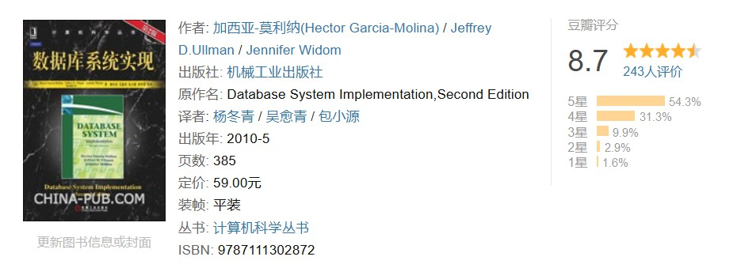
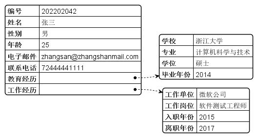
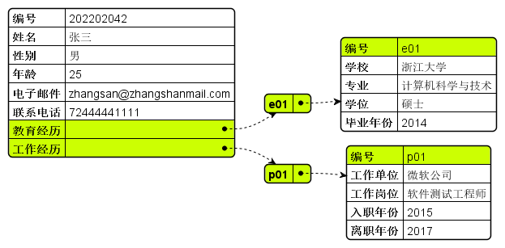
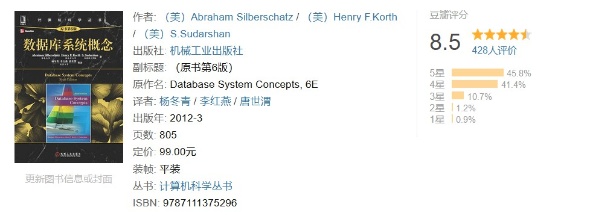
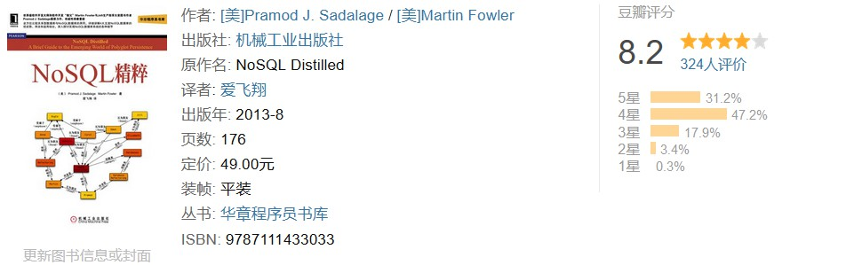

> [!NOTE] 笔记说明
>
> 如今，我们常用“信息时代”这四个字来定义自己所生活的时代。这个时代最基本的特征之一就是人们每天都要处理并传递海量的信息，数据是信息在计算机设备中最基本的存储单元。但这些数据包含了数字、文字、图像、音频和视频等多种形式，它们通常在计算机中各有各的编码和存储方式，非常不利于进行成规模的统一处理。为了解决这一不利因素，人们发明出了一种被称之为 **数据库（database）** 的数据存储系统，以便用某种统一的结构化形式来存储海量的数据。
>
> 在这篇笔记中，我们将聚焦于数据库相关领域的讨论，并以推荐书目的形式来为读者规划在这一课题上的学习路线图，它将被存储在我个人的 [GitHub](https://github.com/owlman/CS_StudyNotes) 仓库中，以供读者参考。

## 数据库系统概述

顾名思义，“数据库”就是一种可以让人们像管理物品仓库一样组织、增减并存储数据的专用软件系统，人们通常用它来解决大规模的数据存取问题。下面，就让我们从数据的*存储结构*的角度来解释一下数据库是如何解决问题的。

从概念上来说，对数据存储结构的描述主要有物理和逻辑两个不同层面上的表述形式，其中，数据在物理层面上的表述形式定义的是它在计算机存储设备上的存储方式，主要记录的是数据在存储设备中所占的空间大小和存储位置。在这种表述形式中，人们通常会用到以下术语。

- **位（bit）**：这是数据在物理层面上的最小存储单位，指的是单个二进制数字在存储设备中所占的空间大小。
- **字节（byte）**：8 个位的数据所占的存储空间可称为一个字节，通常对应的是一个 ASCII 码字符。
- **字（word）**：若干个字节的数据所占的存储空间可称为一个字。一个字所含的二进制位数被称为字长，不同的计算机的字长是不同的，如今常见的计算机字长有 16 位、32 位、64 位、128 位等。
- **块（block）**：这是数据库管理系统读写数据的最小单位，每个块的大小通常在 4KB 到 16KB 之间，具体大小视系统配置而定。
- **卷（volume）**：这是一台输入输出设备所能装载的全部有用信息，例如我们既可以将磁带机的一盘磁带视为一卷，也可以将磁盘设备的一个盘组视为一卷。

而数据在逻辑层面的表述形式则是在定义人们在计算机中操作数据的方式，它的内容主要包含两个层次，一个层次是对现实世界的抽象化描述，另一个层次则是对数据库管理系统的技术支持。在这种表述形式中，人们通常会用到以下术语。

- **实体（entity）**：该术语主要用于描述现实世界中客观存在的东西，它既可以是具体的、有形的对象，也可以是抽象的、无形的对象。例如书、简历都可以被视为一个实体。
- **属性（attribute）**：该术语主要用于描述数据实体的各种特性，例如，书作为一个数据实体应该包括书名、书号、作者、出版社、出版日期、页数、价格等属性。
- **实体集（entities）**：该术语主要用于描述由属性完全相同的同类实体所组成的集合。例如，图书馆所有的书籍可被视为一个实体集，档案库中所有人的简历也可以被视为是一个实体集。
- **标识符（identifier）**：该术语主要指的是可用于在实体集中唯一地标识每个实体的属性或属性集。例如，书号属性就是书这个实体的标识符。

我们可以通过上述两种表述形式来描述现实世界中的数据在数据库中的存储结构，从而实现对这些数据统一而有效的存储。而对于数据库中数据的具体操纵和管理，我们就需要借助于另一种被称作**数据库管理系统（Database Management System）**的大型软件系统来完成了，该软件系统能帮助人们像管理货物仓库中的货物一样来对数据库进行统一地管理，并保证数据在整个处理过程的安全性和完整性。它可以支持多个应用程序和用户用不同的方法在同时或不同时刻去建立，修改和询问数据库。如果读者想全面性地了解一下数据库管理系统的各种实现细节，我个人会推荐大家去阅读一下《数据库系统实现》这本书。

这本书是斯坦福大学在教授数据库系列课程时的御用教科书之一，书中对数据库管理系统的实现原理进行了深入阐述，并具体讨论了组成数据库管理系统的三个主要成分——存储管理器、查询处理器和事务管理器的实现技术。

## 学习路线规划

在了解了数据库的基本概念及其解决问题的思路之后，我们就可以根据自己的工作需求来学习这门专业所需要的相关知识了。下面，就让我们先从数据库的逻辑设计工作开始切入吧。

### 数据库的逻辑设计

众所周知，软件开发这项工作的本质就是将人们在现实世界中可以用中文、英文、阿拉伯文等自然语言描述的客观事物抽象成某种在计算机中可被编码的数据实体。例如在现实世界中，我们描述某个人的简历时应该会提供这份简历的编号、姓名、性别、年龄、教育经历、工作经历、电子邮件、联系电话等信息，那么到了数据库中，我们需要做的就是在计算机中抽象化出一个以这些信息为属性的数据实体。然后，服务端在获取到该数据实体时就会自动将其识别为一份属于某个人的简历数据，并在其符合查询要求时打包成响应数据返回给客户端。而客户端在拿到这份简历数据之后，就会自行将它们填充到指定的简历模板中，呈现给用户一个完整可用的简历文档。所以，我们在设计应用程序的第一步就是要按照用于描述简历这个实体的各项属性来设计它在数据库中的存储结构。

然而，如果我们只按照上述属性来设计简历在数据库中的存储结构的话，很快就会遇到亟待解决的第二个问题。那就是该实体的某部分属性本身也是一个包含了若干属性的实体，例如对于其“教育经历”属性，它本身也需要通过学校、专业、学位以及毕业年份等属性来描述。同样的，其“工作经历”属性也需要通过工作单位、工作岗位、入职年份与离职年份等属性来描述，它们在数据库中的存储结构应该被设计成简历主数据的子数据、例如，对于某个叫张三的人来说，其简历的主数据与子数据在数据库中的存储结构大致上应如下图所示。

当然了，在具体如何实现上述主数据和子数据的存储问题上，当前的数据库设计工作主要有关系型数据库与非关系型数据库两大类解决方案可供选择。下面，我们就分别来介绍一下这两大类解决方案。

### 关系型数据库设计

关系型数据库是以关系代数和集合论为理论基础来设计的数据管理系统，诞生于上世纪七十年代。在非关系型数据库出现之前，我们在实际开发中使用的绝大部分数据库，譬如企业级应用开发中常用的 Oracle、DB2，开源社区常用的 MySQL、PostgreSQL 以及嵌入式程序开发中常用的 SQLite 都属于关系型数据库。

在关系型数据库中，我们通常会用*表（table）*的结构来存储由属性系统的数据实体，表中的各个*字段（field）*对应的就是用于描述数据实体的各项属性。而该数据集合中的每一条数据也就成为了该表中的每一行*记录（record）*。然后，我们要做的就是使用设置*键值（key）*字段等方式在数据表之间建立起某种关联，以表示不同数据集合之间的“*关系（relation）*”。例如对于之前提到的简历这个实体，我们在关系型数据库中通常会先将它的主数据和子数据分别设计成`resumes`、`education`和`professional`这三张表，然后再为其中代表子数据的`education`和`professional`这两张表中各自增加一个可用作标识符的字段，以便在它们与代表主数据的表之间建立起关系，即在`resumes`表中，“教育经历”和“工作经历”这两个字段的值就变成了相关子数据在对应表中的唯一标识，这样三张表之间的关系就建立起来了。例如，张三的简历数据在关系型数据库中的存储应该如下图所示。

在上述数据库设计中，我们首先为`education`和`professional`这两张表各增加了一个名为“编号”的标识符字段，以作为它们各自的键值。然后，我们在`resumes`表中就只需要在“教育经历”和“工作经历”字段中分别填入相应的编号值（考虑到每个人可能都有多个学历和工作经历，所以这里应该是可以填写多个编号值的），就可以建立起这三张数据表之间的关系了。接下来，而我们也就可以根据这些数据表结构和它们之间的关系来对数据库进行操作了。

另外值得一提的是，关系型数据库中的数据操作通常都是通过 SQL 来完成的。SQL 是一种专用于描述关系型数据库中“表”的结构，以及表之间的“关系”的数据查询语言，目前主流的关系型数据库产品都提供了对 SQL 的支持，并且也都各自做了相应的扩展。在这里，如果读者系统性地学习关系型数据库的设计原则及其具体方法，我个人会推荐大家去阅读一下《数据库系统概念》这本书。

这本书是数据库系统方面的经典教材之一，其内容既包含数据库系统基本概念，又反映数据库技术新进展。它目前已被斯坦福大学、耶鲁大学、康奈尔大学等许多国际著名大学所采用，一直在学术界享有很高的权威地位。

总而言之，这本书会让我们在深入学习与使用具体的关系型数据库系统之前，先了解几个贯穿关系型数据库的核心概念，它们是理解后续所有数据库操作的基石。

- **索引（Index）**：索引是一种用于加速数据检索的辅助数据结构，类似于书籍的目录。它通过维护指向数据位置的指针来避免全表扫描，能将查询时间从线性复杂度降低到对数级别甚至常数级别。常见的索引类型包括 B+ 树索引（适用于范围查询和排序）和哈希索引（适用于等值查询）。然而，索引并非越多越好，因为每次数据写入时都需要同步更新索引，这会带来额外的开销。

- **事务与 ACID**：事务是数据库系统中一组不可分割的操作序列，要么全部执行成功，要么全部回滚。它通过 ACID 四个特性来保证数据的可靠性：**原子性（Atomicity）** 确保事务内的操作要么全做要么全不做；**一致性（Consistency）** 确保事务执行前后数据始终符合所有预设规则；**隔离性（Isolation）** 确保并发执行的事务互不干扰；**持久性（Durability）** 确保已提交的事务不会因系统故障而丢失。对 ACID 的理解程度，直接决定了开发者在设计高并发数据系统时能否做出正确的权衡。

- **范式与反范式**：范式（Normalization）是通过拆分表来消除数据冗余和更新异常的设计理论，常见的有第一范式（1NF，消除重复列）、第二范式（2NF，消除部分依赖）和第三范式（3NF，消除传递依赖）。但在实际开发中，为了查询性能有时会故意保留冗余数据，这一做法被称为反范式（Denormalization）。范式与反范式的选择，本质上是在"写入效率与数据一致性"和"查询效率"之间做权衡。

这些概念在我们后续具体学习关系型数据库系统的过程中会反复出现，提前建立认知将有助于读者更快地理解这类数据库的设计思想。

> [!TIP] SQL 基础是前提
>
> 在深入学习关系型数据库之前，建议先掌握 SQL 基础操作，包括 DDL（CREATE、ALTER 等）、DML（SELECT、INSERT、UPDATE、DELETE）、JOIN 多表联合查询、GROUP BY 聚合分组以及子查询等。这些是使用任何关系型数据库的必备技能，也是理解后续索引优化和执行计划的前提。

### 非关系型数据库设计

非关系型数据库通常也被称为 NoSQL 数据库。NoSQL（Not Only SQL）数据库这一概念最早出现于 1998 年，后来逐步发展成了可以不使用 SQL 操作数据的非关系型数据库的统称。相对于传统的关系型数据库来说，NoSQL 数据库提供的是一种弱结构化的数据存取模式，通常不需要事先定义严格的数据表结构以及数据表之间的联系，它允许我们以一种更自由、更松散的方式来操作数据库中的数据。这样做的好处是让人们不再需要为了使用数据库而专门学习 SQL，并且它也提高了相关应用程序与数据库的交互效率，缺点是由于这类数据库本身对其存储数据的结构大多都缺乏强制性的约束，保持数据在结构上的一致性的任务就落在了使用它的应用程序的开发者身上，我们在选择这类数据库的时候需要谨记“能担负多大的责任才能享受多大自由”的原则，至少在程序设计领域，享受无能力承担相应责任的自由绝对会导致一场无法挽回的灾难。

既然是关系型数据库之外数据库系统的统称，那么 NoSQL 数据库必然就有不同的分类。下面，就让我们来简单介绍一下这些分类：

- **以键/值对形式存储的数据库**：这一类数据库主要包括 LevelDB、Redis、Amazon DynamoDB 等，其数据存储结构是一个散列表，以键/值对的形式来存取数据，其主要优势在于使用简单，查询速度快，且容易部署。典型的应用场景包括会话管理、用户配置存储、购物车缓存等，特别适合需要对单个记录进行快速读写的场合。需要注意的是，由于无法像关系型数据库那样按值进行复杂条件查询，它通常被用作缓存层来配合其他数据库一同使用。

- **以列结构形式存储的数据库**：这一类数据库主要包括 Cassandra、HBase、ScyllaDB 等，它通常被用来应对分布式存储的海量数据。与关系型数据库按行存储不同，列族数据库将数据按列族进行组织和压缩，这使得它在处理超大规模数据集（PB 级别以上）时具有极高的写入吞吐量和查询性能。它的典型应用场景包括物联网传感器数据采集、时序日志分析、推荐系统的用户行为记录等。不过，列族数据库的数据模型设计较为复杂，对应用开发者来说学习曲线较陡。

- **以文档形式存储的数据库**：这一类数据库主要包括 MongoDB、CouchDB、Firebase Firestore 等，其文档本身采用了某种类似于 JSON 的半结构化格式来存储数据，所以该类数据库也可以被视为以键/值对形式存储数据形式的一种升级。文档型数据库允许同一个集合中存在结构不同的文档（即天然支持多态数据），非常适合内容管理系统、产品目录、实时分析等场景，也是目前应用最广泛的 NoSQL 数据库类型。

- **以图结构形式存储的数据库**：这一类数据库主要包括 Neo4J、OrientDB、ArangoDB 等，与以刚性结构著称的 SQL 数据库相比，图数据库以节点（node）、边（edge）和属性（property）来组织数据，它能以极其高效的方式处理实体之间多对多的复杂关联查询，例如社交网络中的"朋友的朋友"推荐、知识图谱的推理链路、反欺诈系统的资金流转分析等。在执行此类深层次关联查询时，图数据库的性能往往比关系型数据库高出数个数量级。

在这里，如果读者系统性地了解非关系型数据库的核心概念及其具体使用方法，我个人会推荐大家去阅读一下《NoSQL 精粹》这本书。

这本书为正在考虑是否可以使用，以及如何使用 NoSQL 数据库的开发者提供了可靠的参考依据。它由世界级软件开发大师 Martin Fowler 与 Jolt 生产效率大奖图书作者 Pramod J. Sadalage 共同撰写。书中全方位比较了关系型数据库与 NoSQL 数据库的异同；分别以 Riak、MongoDB、Cassandra 和 Neo4J 为代表，详细讲解了键值数据库、文档数据库、列族数据库和图数据库这 4 大类 NoSQL 数据库的优劣势、用法和适用场合；深入探讨了实现 NoSQL 数据库系统的各种细节，以及与关系型数据库的混用。

### 数据库技术的新发展

在关系型与非关系型数据库这两条技术路线之外，近年来数据库领域还涌现出了一些值得关注的新趋势。

1. **NewSQL 与分布式数据库**：NewSQL 是一类试图在保持关系型数据库 ACID 事务能力和 SQL 接口的同时，实现 NoSQL 级别水平扩展能力的新型数据库系统。它们通常采用分布式架构、共享 Nothing 设计，并通过 Raft 或 Paxos 等共识算法来保证数据一致性。代表产品包括 Google Spanner（全球级分布式数据库）、TiDB（开源分布式 HTAP 数据库）、CockroachDB（云原生分布式 SQL 数据库）等。这类数据库特别适合对数据一致性要求高、业务增长快、需要跨机房部署的互联网应用场景。

2. **云数据库与 Serverless 数据库**：随着云计算成为主流基础设施，越来越多的数据库以托管服务的形式提供给开发者。云数据库（如 Amazon RDS、阿里云 PolarDB、Azure SQL Database）免去了运维层面的负担，让开发者可以专注于业务逻辑而非硬件配置。更进一步的 Serverless 数据库（如 Neon、PlanetScale、Supabase）则实现了按需计费和自动扩缩容，部署一个生产可用的数据库从过去的数小时缩短到了几分钟，极大地降低了中小团队使用数据库的门槛。

3. **多模型数据库**：为了简化技术栈，部分数据库开始支持多种数据模型共存。例如 PostgreSQL 可以通过扩展支持 JSON 文档和键值存储；Microsoft SQL Server 支持图查询；而 ArangoDB、OrientDB 等原生支持文档、图和键值三种模型。对于不想在多个数据库之间做数据同步的团队来说，多模型数据库提供了一种折中的选择。

## 动手实践建议

有了以上理论知识作为铺垫之后，接下来的关键就是动手实践了。这里给出一条循序渐进的上手路径供读者参考。

1. **从 SQLite 开始**：它是零配置、无需安装服务端的关系型数据库，所有数据存储在一个文件中。打开一个 SQLite 命令行或在 Python/Node.js 里接入它，尝试执行 CREATE TABLE、INSERT、SELECT 等基本 SQL 操作，感受关系型数据库的基本工作方式。

2. **迁移到 PostgreSQL**：当你理解了 SQL 基本操作后，建议安装 PostgreSQL（功能最完善的开源关系型数据库），并尝试使用索引优化查询、通过 EXPLAIN 分析执行计划、体验事务的 COMMIT 和 ROLLBACK。这一步是理解关系型数据库"为什么这样设计"的关键。

3. **尝试 NoSQL**：在掌握了关系型数据库之后，可以挑一两种 NoSQL 数据库来体验不同的数据模型。推荐先尝试 Redis（键值型，缓存场景）和 MongoDB（文档型，灵活模式），通过实际使用感受它们与关系型数据库的设计差异以及各自的适用场景。

4. **动手做一个小项目**：将所学综合起来的最好方式就是完成一个完整的小项目。例如设计一个简易博客系统——用关系型数据库存储用户和文章数据，用 Redis 缓存热门文章排名，通过这个项目你就能切身感受到不同数据库在实际场景中的协作方式。

> 📌 关联笔记：  
>
> - [[Sqlite 使用笔记]]：[博客园链接]() （待完成）
> - [[PostgreSQL 使用笔记]]：[博客园链接]() （待完成）
> - [[Redis 使用笔记]]：[博客园链接]() （待完成）
> - [[MongoDB 使用笔记]]：[博客园链接]() （待完成）

## 结束语

最后需要说明的是，我们在这里所规划的只是学习在软件开发工作中使用数据库的基本路线。如果进入到具体的研究工作或软件开发中，读者还需要根据自己使用的数据库产品来阅读更具体的资料。例如，如果我们想使用像 MySQL、SQLite 这样的关系型数据库，那就需要去阅读一下《MySQL 必知必会》、《SQLite 权威指南》这样的书籍。而如果我们想使用 MongoDB、Redis 这样的非关系型数据库，那就需要去参考一些像《MongoDB 实战》、《Redis 开发与运维》这样的书籍。此外，本文写于 2021 年，后续数据库领域又涌现出了不少新趋势（如云数据库、NewSQL、Serverless 数据库等），读者在按本书单学习时，也建议结合当下最新的技术动态来调整学习方向。
