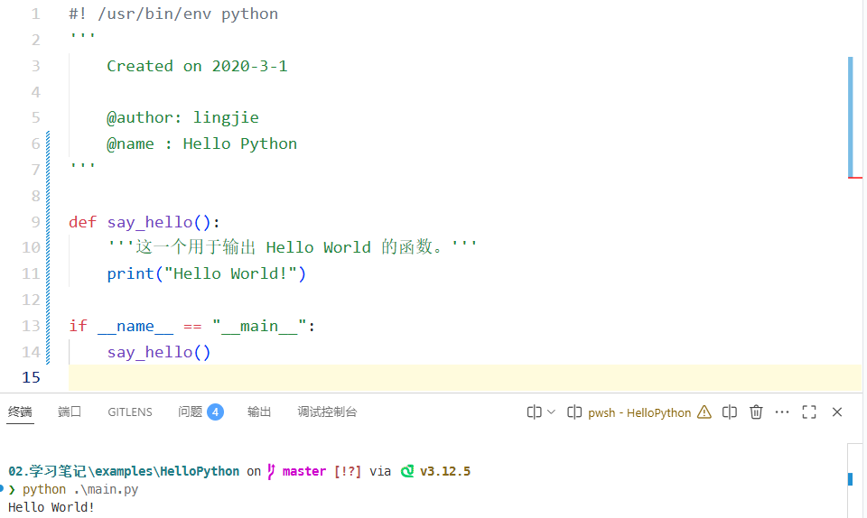

# Python 学习笔记：编程环境

承接之前在[《[[Python 的学习路线图]]》](https://www.cnblogs.com/owlman/p/17546847.html)一文中的规划，接下来，我将会提供一份针对学习 Python 语言基础的笔记（该笔记将会被保存在[我的个人笔记库项目](https://github.com/owlman/study_note)中），目的是帮助读者学习以下技能：

- 安装并配置好 Python 语言的运行时环境与相关的编程工具；
- 熟练掌握 Python 语言的基本语法及其标准库的使用方法；
- 熟练掌握 pip 包管理器的配置方法并使用它安装第三方扩展；

## 编程环境的配置

正所谓工欲善其事，必先利器，虽然 Python 属于跨平台的编程语言，但这种跨平台的特性是依靠一种被称之为*运行时环境（Runtime Environment）*的中间件来实现的。而由于后者本身是平台相关的，所以在正式开始学习 Python 这门编程语言之前，我们的首要任务就是要根据自己所在的平台来安装该语言的运行时环境，并配置好将用于审阅和编辑源代码的编程与调试工具。

### 安装运行时环境

正如之前所说，要想发挥好 Python 这类编程语言的跨平台特性，首先要做的就是要安装并配置好语言的运行时环境。接下来，就让我们分包管理器和图形和向导两种方式来介绍一下安装 Python 运行时环境的具体方法。

- 如果我们选择使用 APT/YUM 这一类软件包管理器来安装 Python 的运行时环境，那么通常是不需要根据自己所在设备的 CPU 架构与操作系统平台来选择要安装的软件包的。但这种方式通常都是以 Shell 命令的方式来使用的，这就意味着我们必须要了解各种操作系统使用的包管理器，以及这项包管理器在安装该运行时环境时所需要执行的 shell 命令。下面是各种常见的包管理器安装 Python 运行时环境的命令。

    ```bash
    # 在 Ubuntu、Deepin 等以 Debian 项目为基础的 Linux 发行版中，
    # 我们使用的是 APT 包管理器，我们可以根据自己的需要选择 Python 2.x 或 3.x。
    # 在本书中，我们选择 Python 3.x，其安装命令如下：
    sudo apt install python3 python-is-python3
  
    # 在 CentOS，Fedora 等以 Redhat 项目为基础的 Linux 发行版中，
    # 我们使用的是 YUM 包管理器，该包管理器中的 Python 3.x 版本是比较老的，
    # 这里安装的是 Python 3.6，其安装命令如下：
    sudo yum install python36 python36-setuptools
    sudo easy_install pip  # 关于 pip，我们稍后会详细介绍

    # 在以 Arch Linux 项目为基础的 Linux 发行版中，
    # 我们使用的是 Pacman 包管理器，它安装 Python 3.x 的命令如下：
    sudo pacman -S python3   

    # 在 macOS 操作系统中，通常自带了 Python 2.x 的运行环境，
    # 但我们也可以使用 Homebrew 包管理器来安装 Python 3.x，安装命令如下：
    brew install python3

    # 在 Windows 7 以上的 Microsoft Windows 操作系统中，
    # 我们也可以使用 Scoop 包管理器来安装软件，它安装 Python 3.x 的命令如下：
    scoop install python
    ```

- 如果我们选择在 macOS 或 Windows 这样的图形化操作系统中，以图形和向导的方式来安装 Python 运行时环境，那么就需先找到并下载与自己所在设备的 CPU 架构与操作系统相匹配的二进制安装包（在 Windows 中通常是一个扩展名为`.exe`的文件，在 macOS 中则是扩展名为`.img`的文件），然后启动它的图形化向导来完成相关的安装操作。例如在 Windows 系统中，Python 3.x 运行时环境的安装步骤主要如下。

  1. 访问 Python 官方网站的下载页面，并根据自身所在设备的 CPU 架构及其所运行的 Windows 版本来下载相应的二进制安装包（例如，我们在这里选择的是名为`python-3.11.2-amd64.exe`的安装包），其官方下载页面如下。
    

  2. 待上述二进制安装包被成功下载到本地计算机上之后，以系统管理员的身份打开该安装包，以便启动其图形化安装向导，如下图所示。

    

    在上述界面中，我们需要先勾选“Add Python.exe to PATH”选项，然后再单击“Customize installation”选项。这个选项用于将 Python 加入到系统的 PATH 环境变量中，这样会让我们日后直接在系统的终端环境中使用 Python 运行时环境，否则我们在后面的操作中可能就需要在该环境变量中手动添加路径。

    3. 在图形化向导的第二个页面中，我们需要选择要安装的 Python 组件，其中的选项“Documentation”表示安装 Python 的帮助文档；选项“pip”表示安装 Python 的第三方包管理工具；选项“tcl/tk and IDLE”表示安装 Python 的集成开发环境；选项“Python test suite”表示安装 Python 的标准测试套件，后两个选项则表示允许版本更新。在这里，我们会建议读者勾选该页面上列出的所有选项，然后单击“Next”按钮继续下一步的安装设置。

       

    4. 在图形化向导的第三个页面中，我们需要设置 Python 的安装路径。通常情况下，读者只需要保持该页面上所有的默认选项即可，当然，也可以选择单击“Browse”按钮，设置好自己想要安装路径。

       

    5. 在设置好安装路径之后，我们就可以单击“Install”按钮正式开始执行 Python 运行时环境的安装操作，读者只需等待下图中的进度条显示完成即可。

        

    6. 待上述安装过程完成之后，我们就会看到如下图所示界面，安装过程已经顺利完成，读者可以通过单击“Close”按钮来退出这个图形化安装向导。

       

最后，如果我们想验证 Python 运行时环境是否已经安装成功，就只需要在自己所在的操作系统中打开 Shell 终端环境，例如 Windows 环境下的 Powershell 或 CMD，或者类 UNIX 系统环境下的 BASH、FISH 等终端模拟程序，并在其中执行`python --version`命令，如果看到如下图所示的版本信息，就证明我们已经成功安装了 Python 运行时环境。


### 配置编程工具

从理论的角度上来说，要想编写一个基于 Python 语言及其运行时环境的应用程序，通常只需要使用任意一款纯文本编辑器就可以了。但在具体的项目实践中，为了在工作过程中获得代码的语法高亮与智能补全等功能以提高编码体验，并能方便地使用各种强大的程序调试工具和版本控制工具，我们通常还是会选择使用一款专用的代码编辑器或集成开发环境来完成项目开发。在这里，我个人会倾向于推荐读者使用 Visual Studio Code 编辑器（以下简称 VS Code 编辑器）来构建所有的项目。读者可以参考下面这篇笔记来学习这款编辑器的安装方法，以及如何将其打造成一款用于编写 Python 应用程序的集成开发环境。

> 关联笔记：[[VS Code 编辑器的基本配置]]

除此之外，Atom 与 Sublime Text 这两款编辑器也与 VS Code 编辑器有着类似的插件生态系统和使用方式，如果读者喜欢的话，也可以使用它们来打造属于自己的项目开发工具，方法是大同小异的。而除了上述专用的代码编辑器之外，如果读者更习惯使用传统的集成开发环境（IDE），JetBrains 公司旗下的 PyCharm 无疑会是一个不错的选择，它在 Windows、macOS 以及各种 Linux 发行版上均可做到所有的功能都是开箱即用，无需进行多余的配置，这对初学者是相对比较友好的。PyCharm 的安装方法非常简单，我们在浏览器中打开它的官方下载页面之后，就会看到如下图所示的内容：


同样地，大家在这里需要根据自己所在的操作系统来下载相应的安装包，待下载完成之后就可以打开安装包来启动它的图形化安装向导了。在安装的开始阶段，安装向导会要求用户设置一些选项，例如选择程序的安装目录，是否添加相应的环境变量、关联的文件类型等，我们在大多数时候都只需采用默认选项，并一路用鼠标单击「Next」按钮就可以完成安装了。当然了，令人比较遗憾的是，PyCharm 的专业版本并非是一款免费的软件，而免费的社区版在功能上则多多少少会受到一些限制。如果考虑到程序员们在实际生产环境中各种可能的需要及其带来的相关开销等因素，我个人还是会倾向于建议大家尽可能地选择开源软件，这篇笔记接下来也将会以 VS Code 编辑器为主要编程工具来展开后续的各种实例演示。

### 学习成果验收：Hello World

现在，为了验证我们已经成功配置好了使用 Python 语言的编程工具，接下来就需要尝试着使用这些工具来编写一个 Python 版本的 Hello World 程序，看看它能否在我们所在的计算机设备上成功运行起来。编写该程序的具体步骤如下。

1. 在自己的计算机设备上设置一个用于存放演示代码的目录（在这里即`examples`目录），并在该目录下创建一个名为`HelloPython`的目录。

2. 使用 VS Code 编辑器打开刚刚创建的`HelloPython`目录，并在该目录下创建一个名为的`say_hello.py`文件，以作为本示例的程序入口文件，然后在其中编写如下代码：

    ```python
    #! /usr/bin/env python
    '''
        Created on 2020-3-1

        @author: lingjie
        @name : Hello Python
    '''

    auther_name = "lingjie"

    def say_hello(name):
        '''this is a function to say hello.'''
        print("Hello World! My name is", name)

    if __name__ == "__main__":
        say_hello(auther_name)
    ```

3. 在保存上述文件之后，打开 VS Code 编辑器中集成的终端环境并进入到`HelloPython`目录下，然后执行`python say_hello.py`命令运行这个 Hello World 程序。如果该程序在终端中输出了如下图所示的信息，就说明我们已经成功配置好了使用 Python 语言的编程工具。

    
