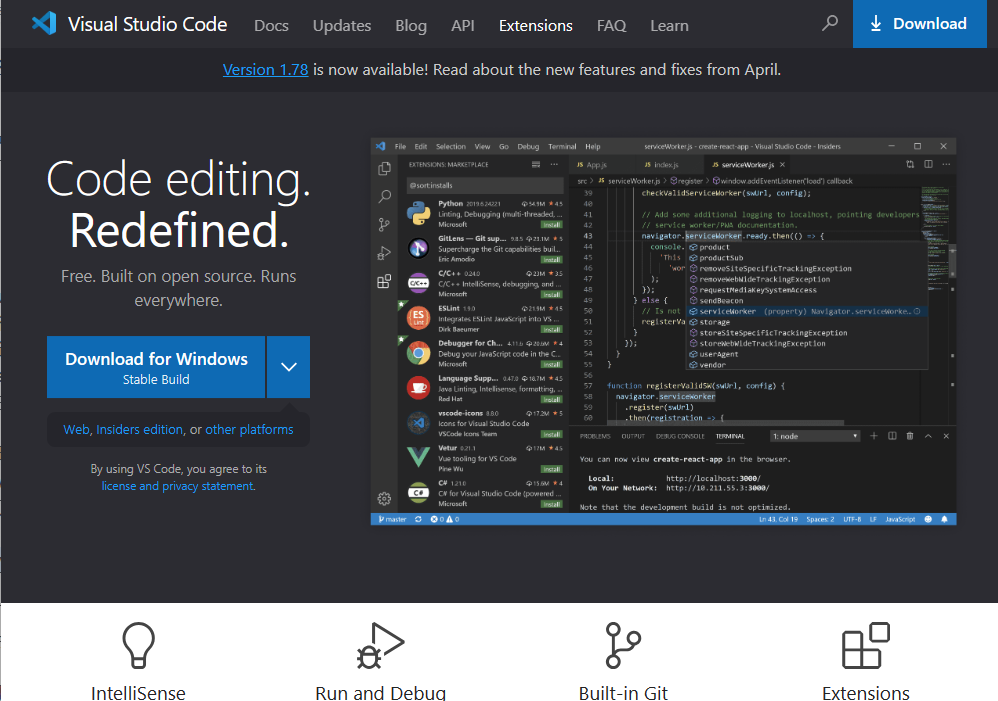
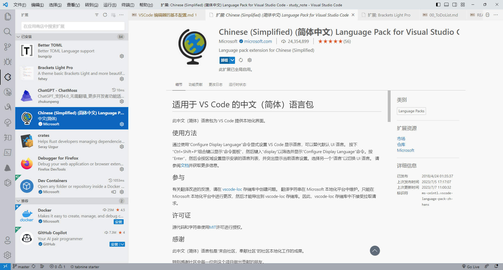
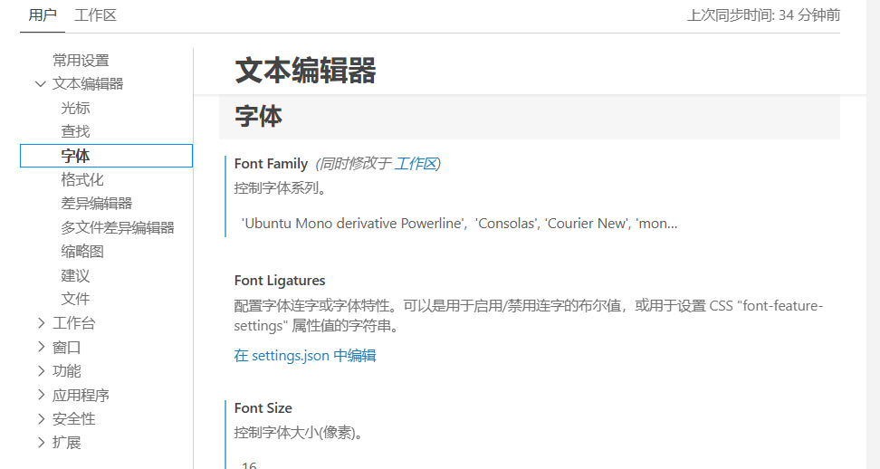
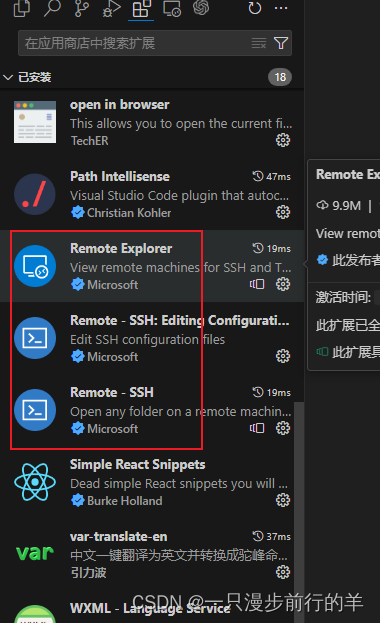
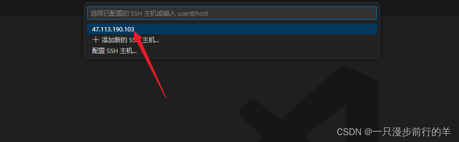
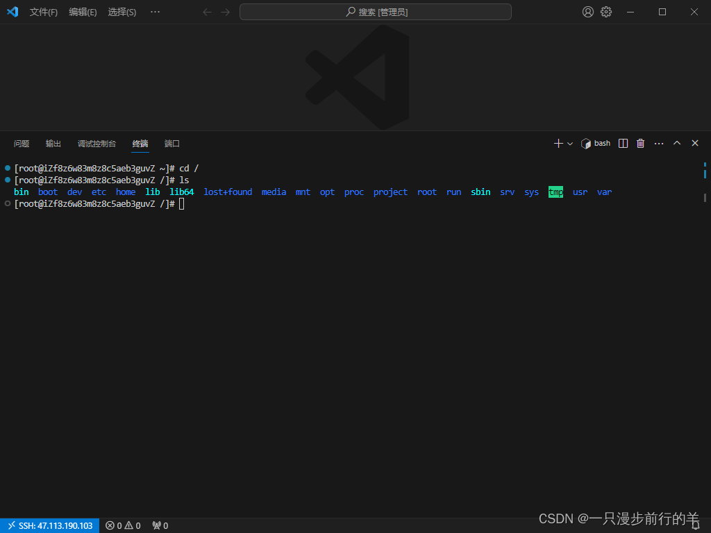
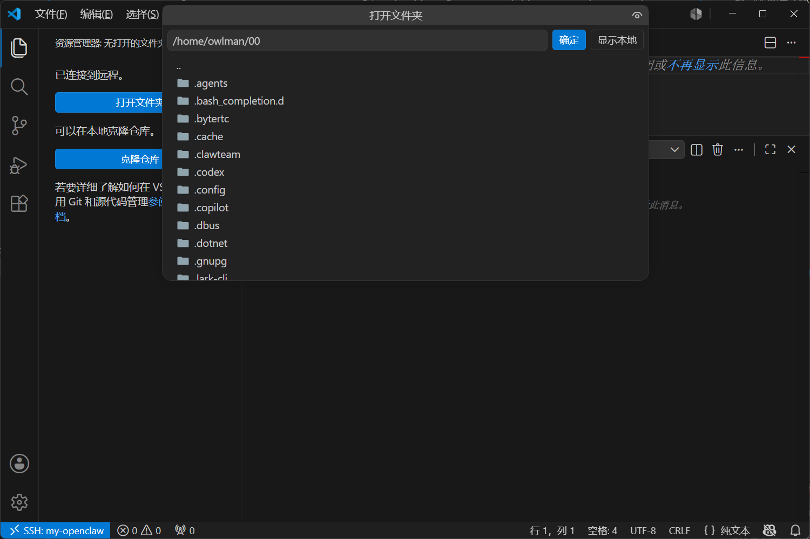
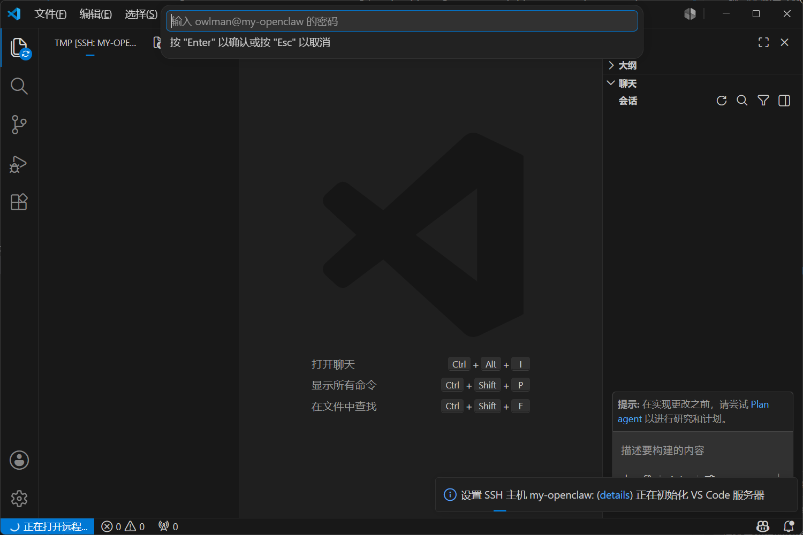

> [!NOTE] **在正式开始本文的内容之前，请允许我先做一些自我介绍：**
>
> 严格来说，我是个自由职业者，经常会参与一些计算机专着的写作与翻译工作，业余偶尔也会有一些机会定期或不定期地参与国内外大学、开源社区中的一些个人研究项目，也帮忙指导过一些硕士论文，所以在编程语言研究、Web 应用开发等领域累积了一定的专业知识和实践经验。所以各位看官在看下面这些建议时，要先理解我是基于这些背景在说话。
>
> 这篇笔记将用于记录本人在使用 VSCode 这款文本编辑器过程中所记录的心得体会，它将会被存储在我个人的[计算机专业笔记库](https://github.com/ChenYilin1015/CS_Studynotes) 中，以便日后查阅。

## 软件安装

Visual Studio Code（以下简称 VSCode）是一款由微软公司开发并维护的现代化代码编辑器，它是一款基于 Node.js 这个跨平台运行时环境的开源项目，所以在 Windows、macOS 以及各种类 UNIX 系统上均可使用。VSCode 编辑器的安装非常简单，在通过搜索引擎找到并打开它的官方下载页面之后，就会看到如下图所示的内容：



然后，读者需要根据自己所在的操作系统平台来下载相应的安装包。待下载完成之后，我们就可以通过鼠标双击安装包的方式来启动它的图形化安装向导了。在安装的开始阶段，安装向导会要求用户设置一些选项，例如选择程序的安装目录、是否在系统中添加环境变量（如果读者想从命令行终端中启动 VSCode 编辑器，就需要激活这个选项）等，大多数时候只需采用默认选项，直接一路点击「Next」就可以完成安装了。

当然，如果读者希望实现不同工作区的隔离，也可以选择安装 VSCode 的开源分支 [VSCodium](https://github.com/VSCodium/vscodium)。这里需要注意的是，VSCodium 开箱配置的扩展源与 VSCode 并不一致，可以参考[这篇文章](https://client.sspai.com/link?arget=https%3A%2F%2Fblog.csdn.net%2Fpythonyzh2019%2Farticle%2Fdetails%2F117395923)中的步骤将其更改为 VSCode 的扩展源。然后就可以搜索并安装自己喜欢的插件和主题了（关于主题的选择，读者可参考《[2022 年的 VSCode 主题排行榜](https://zhuanlan.zhihu.com/p/553669477)》这篇文章中的推荐）。

## 常用插件

众所周知，VSCode 编辑器的最强大之处在于它有一个非常完善的插件生态系统，我们可以通过安装插件的方式将其打造成面向不同编程语言与开发框架的集成开发环境。在 VSCode 编辑器中安装插件的方式非常简单，只需要打开该编辑器的主界面，然后在其左侧纵向排列的图标按钮中找到「扩展」按钮并单击它，或直接在键盘上敲击快捷键「Ctrl + Shift + X」，就会看到如下图所示的插件安装界面：



按照自身的工作需要，笔者会经常在 VSCode 编辑器中安装以下插件。

- **全局增强型插件**：
  - **Bracket Light Pro**：笔者常用的一款 VSCode 界面主题。
  - **Chinese (Simplified) Language Pack**：VSCode 编辑器的简体中文语言包。
  - **GitLens**：用于查看开发者们在 Git 版本控制系统中的提交记录。
  - **Material Icon Theme**：用于为不同类型的文件加上不同的图标，以方便文件管理。
  - **Path Intellisense**：用于在代码中指定文件路径时执行自动补全功能。
  - **CodeGeeX**：一款基于大语言模型的智能编辑助手，可实现针对文字/代码的自动化补全，以及在不同编程语言的代码间实现互译，针对技术和代码问题的智能问答，当然还包括对现有代码进行解释、添加注释、生成单元测试，实现代码审查，修复代码bug 等非常丰富的功能。

- **与写作相关的插件**：
  - **Word Count CJK**：该插件可对 Markdown 文档中的各种中英文字符进行字数统计。
  - **Markdown All in One**：集成了撰写 Markdown 文档时所需要的大部分功能，是笔者在 VSCode 编辑器中使用 Markdown 语言时的必装插件。
  - **markdownlint**：该插件是个功能强大的 Markdown 语法检查器，可以帮助我们书写出规范的 Markdown 文档，避免因书写错误而导致的文档渲染问题。
  - **Paste Image**：可用于将复制到剪贴板中的图片直接通过在 Markdown 文档中粘贴的方式保存到本地计算机中。
  - **Markdown PDF**：一款基于 Pandoc 的文件格式转换器，支持将 Markdown 文件转换为 PDF、HTML、PNG 等格式的文件。
  - **Foam**：用于构建卡片盒笔记系统的工具。（关联资料：[[【收藏】在 VSCode 中实践双链笔记]]）
  - **Latex Workshop**：该插件可用于在 VSCode 编辑器中实现 LaTeX 文档的编译、预览与调试功能。（关联资料：[[LaTeX学习笔记：快速上手指南]]）
  - **Zhihu On VSCode**：可用于 Markdown 文件在知乎上的一键发布。
  - **博客园 cnblogs 客户端**：可用于 Markdown 文件在博客园上的一键发布。

- **与 Web 开发相关的插件**：
  - **HTML Boilerplate**：该插件用于在编写HTML代码时执行一些常见代码片段的自动生成。
  - **HTML CSS Support**：该插件用于在编写CSS代码时执行自动补全功能。
  - **JavaScript Snippet Pack**：该插件用于在编写JavaScript代码时执行自动补全功能。
  - **JavaScript (ES6) Code Snippet**：该插件用于在编写符合ES6标准的代码时执行自动补全功能。
  - **ESlint**：该插件用于自动检测JavaScript代码中存在的语法问题与格式问题。
  - **View In Browser**：该插件可用于快速启动系统默认的网页浏览器，以便即时查看当前正在编写的HTML文档。
  - **Live Server**：该插件可用于在当前计算机上快速构建一个简单的网页服务器，并自动将当前项目部署到该服务器上。
  - **vetur**：该插件可实现针对`.vue`文件中的代码进行语法错误检查、代码高亮与码自动补全（配合 ESLint 插件使用效果更佳）。
  - **npm**：该插件可用`package.json`来校验安装的 npm 包，确保安装包的版本正确。
  - **Node.js Modules IntelliSense**：该插件可用于在 JavaScript 和 TypeScript 导入声明时执行自动补全功能。
  - **Node.js Exec**：该插件可用 Node 命令执行当前文件或被我们选中的代码。
  - **Node Debug**：该插件可实现直接在 VSCode 编辑器中调试后端的 JavaScript 代码。

- **与 Python 语言相关的插件**：
  - **Python extension for Visual Studio Code**：该插件由 Microsoft 官方发布并维护，它提供了代码分析，高亮，规范化等一系列方便程序员们编写 Python 代码的基本功能。
  - **LiveCode for Python**：该插件支持在不运行 Python 代码的情况下实时展示代码中所使用的每一个变量值，且能够识别`print()`并自动打印。这种交互式的编程体验对于初学者们可能会更友好一些。
  - **Python Snippets**：该插件可以让我们的 Python 编程更加高效。它包含了大量的内置方法，以及`string`、`list`、`sets`、`tuple`、`dictionary`、`class`代码片段，并且还为每个代码段提供至少一个示例。
  - **Python Indent**：如果对 VSCode 编辑器对 Python 代码所做的自动缩进格式不太满意，就可以利用这个插件来获得更好的编码体验。
  - **Pip Manager**：该插件能够很好地帮助我们在 VSCode 编辑器中管理在编写 Python 代码时会用到的第三方扩展。

- **与 Rust 语言相关的插件**：
  - **rust syntax**：该插件可以为 Rust 代码文件提供语法高亮功能。
  - **crates**：该插件可以帮助开发者分析当前项目的依赖是否是最新的版本。
  - **rust test lens**：该插件可以用于快速运行某个 Rust 测试。
  - **rust-analyzer**：该插件会实时编译和分析我们编写的 Rust 代码，提示代码中的错误，并对类型进行标注。
  - **better toml**：由于 Rust 开发使用 toml 格式的文件来充当项目配置文件，所以我们通常会需要一个能方便用于编辑该格式文件的插件。

## 配置字体

在 VSCode 编辑器中，为了在编写代码和技术文档时解决中英文之间因字符宽度导致的各种排版问题，我们通常会选用等宽字体。在众多等宽字体中，Ubuntu Mono 字体是一款非常出色的选择，它不仅支持中文，而且对英文字符的宽度控制得非常精准。其具体配置步骤如下：

1. 前往 Ubuntu Mono 字体所在 github 页面，并下载以下这四个`.ttf`文件：

    ```bash
    Ubuntu Mono derivative Powerline Bold Italic.ttf
    Ubuntu Mono derivative Powerline Bold.ttf
    Ubuntu Mono derivative Powerline Italic.ttf
    Ubuntu Mono derivative Powerline.ttf
    ```

2. 将以上四个字体安装到自己当前所在的操作系统中。然后重新打开 VSCode 编辑器，并依次点击菜单栏中的「文件」→「首选项」→「设置」，然后在打开的设置界面中，找到「文本编辑器：字体」选项卡下面的「Font Family」选项，并在其现有的字体列表前面加入`'Ubuntu Mono derivative Powerline'`（注意：字体名称之间是用逗号隔开的），如下图所示：

    

## 远程连接

> 本节补充于 2026 年 5 月，内容参考自《[VSCode：通过 SSH 连接服务器](https://blog.csdn.net/qq812457115/article/details/135533373)》这篇文章。

在 VSCode 中，用户可以通过 SSH 协议连接到局域网或者全球互联网上任意一台提供了 SSH 服务的计算机上，从而实现远程开发。下面是使用 VSCode 连接服务器的详细步骤：

1. 打开 VSCode → 点击左下角（如下图所示）或者按快捷键 Ctrl+Shift+P → 输入“远程：显示远程菜单”，然后在弹出的菜单中选择「连接到主机」。

    

    

2. 第一次选择「连接到主机」时，VSCode 会让用户选择一个用于进行远程连接的方式，我们在这里选择「SSH」。

    

3. 然后，VSCode 会自动去安装以下三个插件：

    

4. 再次启动「连接到主机」菜单，并按照下列  截图所示的步骤对我们要连接的主机进行配置：

    

    

    

5. 如果一切顺利，当我们每次再启动「连接到主机」菜单时，VSCode 就会在随后弹出的菜单中显示出我们之前配置过的主机。然后，我们只需要选择该主机并输入密码即可，如下图所示：

    

    

6. 登录成功后，我们就可以使用快捷键`ctrl + ~`打开命令行终端即可对这台远程主机进行操作了。

    

另外，我们也可以查看、编辑这台远程主机上的文件和目录，步骤如下列截图所示：




