> [!NOTE] 笔记说明
>
> 尽管，我已经在之前的 Agent 系列笔记中介绍过了 OpenClaw 中的一些通用于所有 Agent 的使用方法，但为了让[这个笔记库](https://github.com/owlman/CS_StudyNotes)中记录的知识更为系统，我决定再写一篇补充性的笔记，用于记录那些独属于 OpenClaw 的使用经验，并予以长期维护。

正如我在《[[Agent 的基础应用]]》一文中所介绍的，OpenClaw 是一款可部署在服务器上的 AI Agent，它拥有强大的自动化操作能力，支持通过接入 Telegram、Whatsapp、飞书等即时通讯软件来进行远程操控计算机，颇受业界人士喜欢。但是，由于该项目目前版本更新频繁，一些操作命令经常会发生细微的变化，而官方文档更新又不够不及时，导致我们在使用过程中经常会遇到各种问题。因此，本文将整理它的一些常用配置与应用场景，以作为 Agent 系列笔记的补充。

## 接入 IM 工具

如果是在单机环境中，操作 OpenClaw 最方便的选择其实是使用它的文本界面（TUI），但这显然不是人们使用这款 Agent 应用的目的。毕竟，我们在这类应用场景中显然有更好的选择（譬如 Claude Code、OpenCode 等）。人们选择以服务的形式来部署 Agent 的目标，是希望能构建一个接近于科幻世界所设定的那种人工智能体，让人类随时能通过日常使用的通信工具与它联系，并让它替我们完成一些工作任务。下面，让我们来详细了解一下将 OpenClaw 服务端接入到 IM 工具的方法。

在正式执行接入配置之前，我们首先应该要了解这些 IM 工具究竟是如何与 OpenClaw 进行交互的。按照 OpenClaw 的服务端结构，相关功能主要是通过一个被称作“消息网关（Gateway）”的组件来完成的。换而言之，当用户在 IM 工具中向 OpenClaw 发送消息时，接下来的通信步骤主要会按照图 1 所示流程来进行。

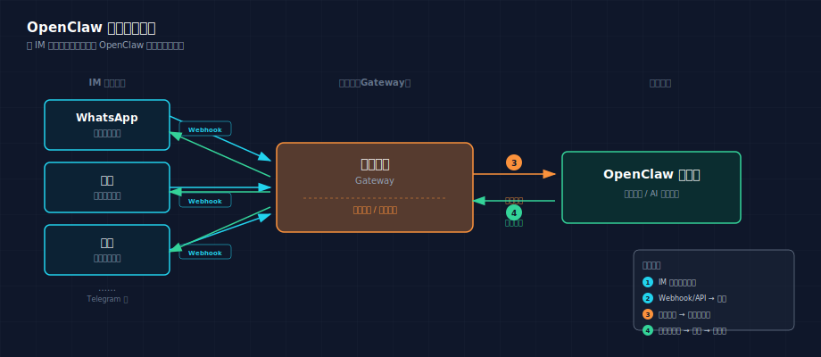

**图 1** IM 与OpenClaw 之间的消息流转

### 接入 WhatsApp

WhatsApp 是一款在国际互联网上非常流行的 IM 工具，支持用户在全球范围内进行实时通讯。这里之所以选择从 WhatsApp 开始介绍将 OpenClaw 接入 IM 工具的方法，主要因为它是最早支持 OpenClaw 的通信工具之一，接入的步骤相对简单得多，适合初学者快速进入状况。下面，让我们来具体介绍一下将 OpenClaw 接入到 WhatsApp 的具体步骤。

1. 在正式开始执行接入工作之前，我们需要确认以下几个前置条件:
   - 确保 OpenClaw 的服务端已经完成部署，并且能够正常运行；
   - 确保手机和工作设备上都已安装了 WhatsApp 应用，并完成了账号的注册与登录；
   - 确保网络环境畅通，因为稍后需要扫描二维码进行连接；

2. 在OpenClaw服务端所在的计算机上打开命令行终端环境，并执行`openclaw channels add`命令并在打开的确认对话框中选择“yes”，进入到如图 2 所示的客户端接入配置界面中。

   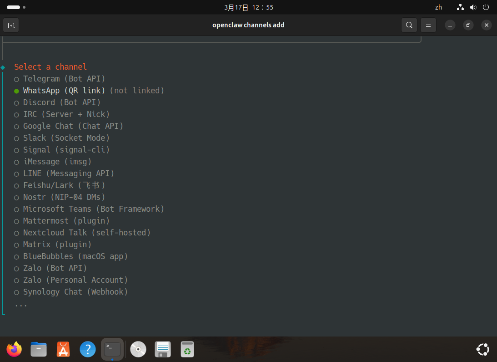

   **图 2** OpenClaw的客户端选择界面（WhatsApp）

3. 在后续出现的配置向导界面中，我们需要依次选择“WhatsApp” → ”default” → ”yes”，如图 3 所示。

   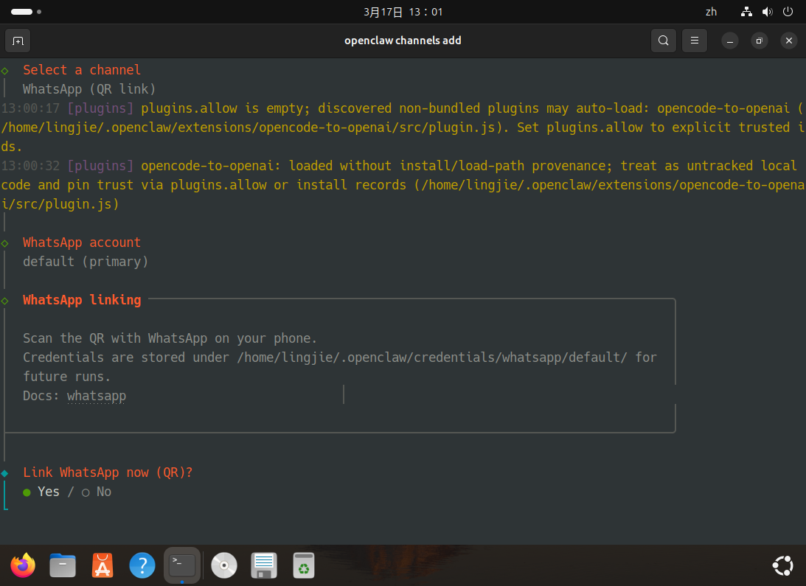

   **图 3** WhatsApp 的接入配置界面

4. 在确认上述界面之后，OpenClaw 会自动从 WhatsApp 处获得一个二维码，我们需要在手机端的 WhatsApp 应用中打开“设置”→“已连接的设备”→“关联设备”选项，然后扫描这个二维码。在扫描成功之后，配置界面会提示我们为 OpenClaw 设置一个电话号码，如图 4 所示。

   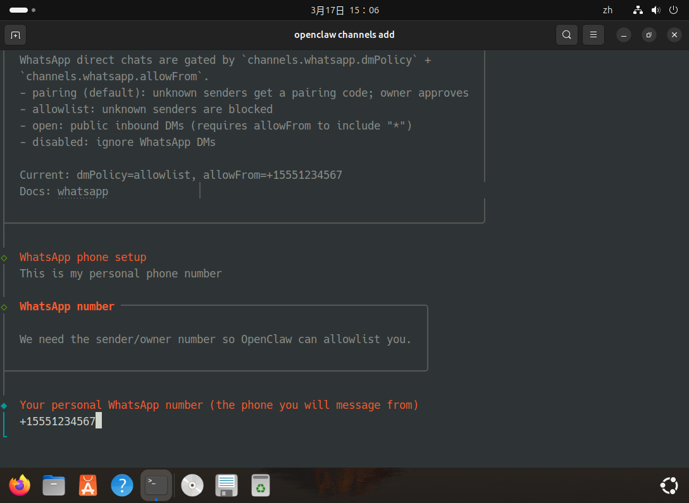

   **图 4** 为 OpenClaw 设置电话号码（图中的号码是虚构的）

5. 在上述界面中，我们既可以为它配置一个单独的电话号码，也可以直接使用自己的手机号码。通常情况下，为其配置一个独立的号码会更安全一些，也更符合独立交互场景下的使用体验。但在这里，为了演示方便，我就直接使用自己的手机号码了。在配置完成并重启 OpenClaw 网关服务之后，我们只需要在 WhatsApp 中向自己发送一条消息，就能看到 OpenClaw 用我们自己的身份所做的回复了，如图 5 所示。

   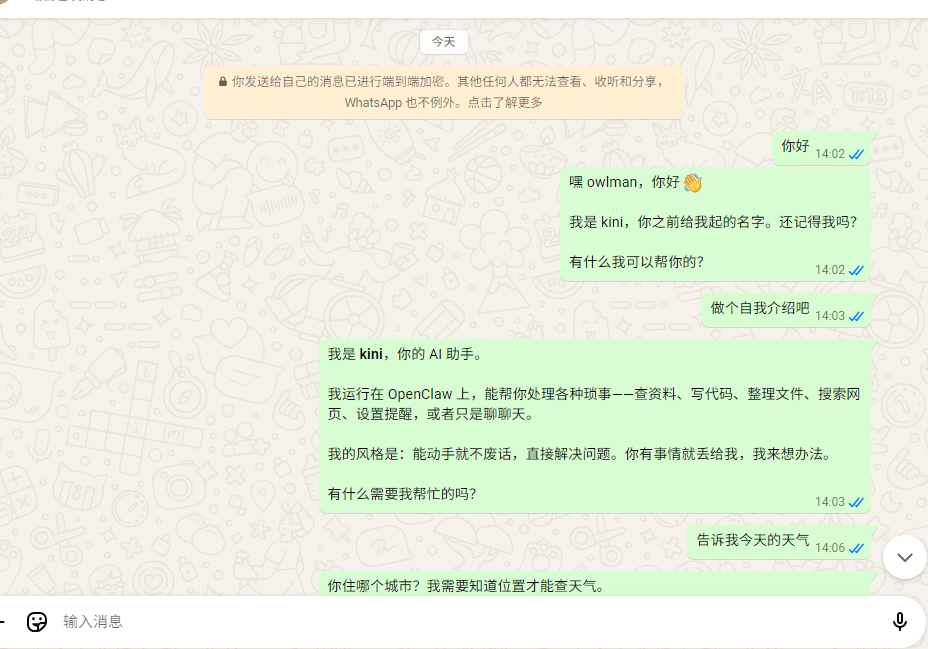

   **图 5** 在 WhatsApp 中与 OpenClaw 进行交互

至此，我们就完成了将 OpenClaw 接入到 WhatsApp 的整个操作流程。除了 WhatsApp 之外，较为常用的国际 IM 工具还有 Telegram、Slack 等。它们接入 OpenClaw 的方式与 WhatsApp 大同小异，考虑到这些软件在国内少有使用，这里就不再赘述了。

### 接入飞书平台

飞书是中文社区被广泛使用的一款线上协作平台，许多企业团队都会基于它来创建属于自己的远程办公系统，用于进行线上会议、项目管理、文件共享、任务安排等日常工作。下面，让我们来了解一下如何将该平台接入 OpenClaw 以便为自己的团队增添一位“数字员工”，其具体步骤如下。

1. 在正式开始执行接入工作之前，我们同样需要确认以下几个前置条件：
   - 确保 OpenClaw 的服务端已经完成部署，并且能够正常运行；
   - 确保手机和 PC 上都已安装了飞书应用，并拥有了自己的账号；
   - 确保网络环境畅通，因为稍后需要一些应用发布的审核通过操作；

2. 打开网页浏览器，用自己的账号登录到飞书开放平台网站上，并创建一个“企业自建应用”，这里的应用名称、描述以及图标，读者可以根据自己的喜好自行填写。创建完成之后，我们就会进入到如图 6 所示的设置界面中。

   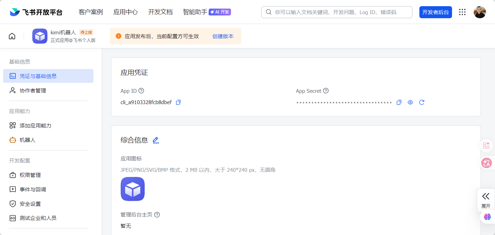

   **图 6** 在飞书开放平台创建应用

3. 在上述界面中，我们需要先将应用的 App ID 和 App Secret 保存到本地，以便稍后在 OpenClaw 的配置界面中使用到它们。然后在左侧菜单依次点击“应用功能”→“机器人”→“创建机器人”，并按照提示完成机器人的创建。创建完成之后，我们就可以在飞书客户端中看到这个机器人了，如图 7 所示。

   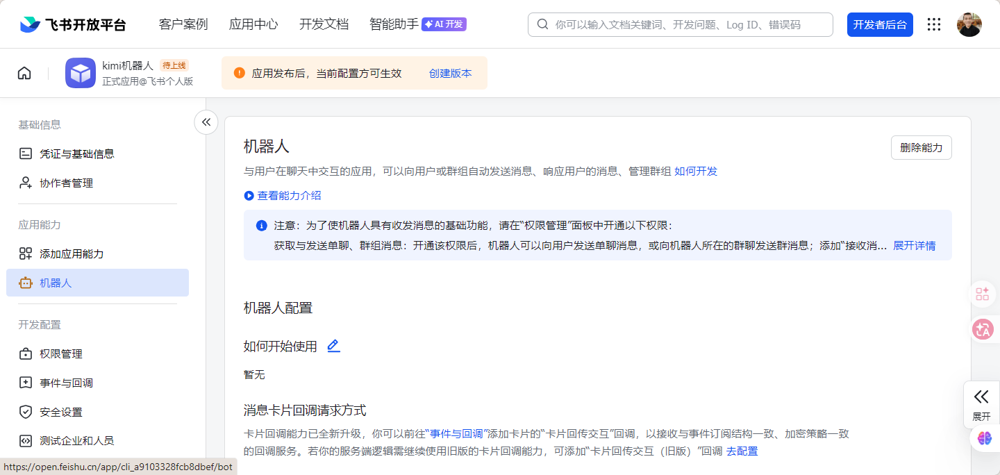

   **图 7** 为飞书应用添加机器人功能

4. 在上述界面的左侧点击“权限管理”，然后在右侧点击“批量导入/导出权限”按钮，并粘贴以下 JSON 代码，并确认开通权限：

    ```json
    {
        "scopes": {
            "tenant": [
                "aily:file:read",
                "aily:file:write",
                "application:application.app_message_stats.overview:readonly",
                "application:application:self_manage",
                "application:bot.menu:write",
                "cardkit:card:read",
                "cardkit:card:write",
                "contact:user.employee_id:readonly",
                "corehr:file:download",
                "event:ip_list",
                "im:chat.access_event.bot_p2p_chat:read",
                "im:chat.members:bot_access",
                "im:message",
                "im:message.group_at_msg:readonly",
                "im:message.p2p_msg:readonly",
                "im:message:readonly",
                "im:message:send_as_bot",
                "im:resource"
            ],
            "user": [
                "aily:file:read",
                "aily:file:write",
                "im:chat.access_event.bot_p2p_chat:read"
            ]
        }
    }
    ```

5. 继续在图 7 所示界面的左侧点击“事件与回调”，然后在右侧的“事件配置”一栏中将订阅方式设置为“长连接接收事件(WebSocket)”，并通过“添加事件”按钮依次添加以下事件并保存，如图 8 所示。

   - `im.message.receive_v1` - 接收消息
   - `im.message.message_read_v1` - 消息已读回执
   - `im.chat.member.bot.added_v1` - 机器人进群
   - `im.chat.member.bot.deleted_v1` - 机器人被移出群

   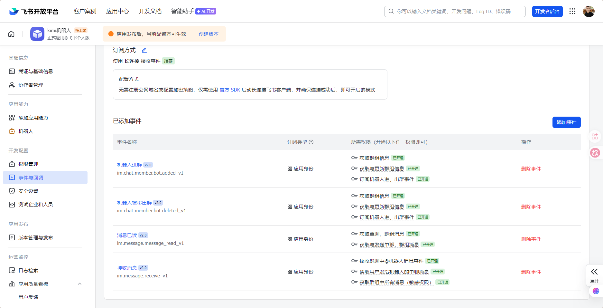

   **图 8** 为飞书应用添加事件订阅

6. 在上述界面中点击“版本管理”，然后在右侧点击“创建版本”按钮，并按照提示完成版本创建。创建完成之后，我们就可以在飞书开放平台中看到这个新创建的版本了，如图 9 所示。

   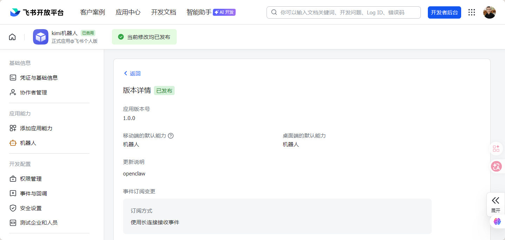

   **图 9** 为飞书应用创建版本

7. 在 OpenClaw 服务端所在的计算机上打开命令行终端环境，并执行`openclaw channels add`命令并在打开的确认对话框中选择“yes”，进入到如图 10 所示的客户端接入配置界面中。

   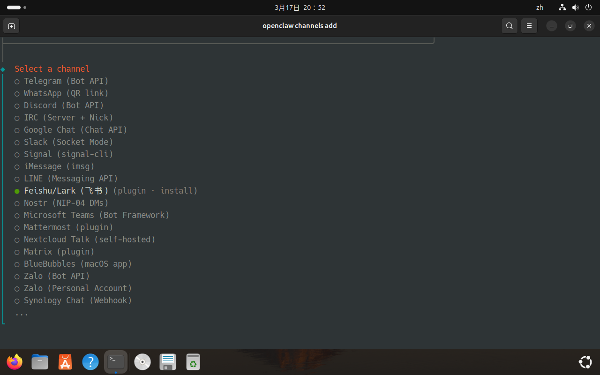

   **图 10** OpenClaw 的客户端接入配置界面（飞书）

8. 在上述界面中选择 Feishu/Lark (飞书) 这个选项之后，我们就会进入到如图 11 所示的插件选择界面中。在这里，我们有两个选择：第一项是飞书提供的第三方插件，这种通过客户端提供的第三方插件接入的方式，我稍后会以个人微信为例做详细介绍，这里就暂且跳过了。第二项是 OpenClaw 自带的官方插件，它支持飞书机器人与 OpenClaw 服务端进行交互。我们在这里先基于这个选项来进行后续演示。

   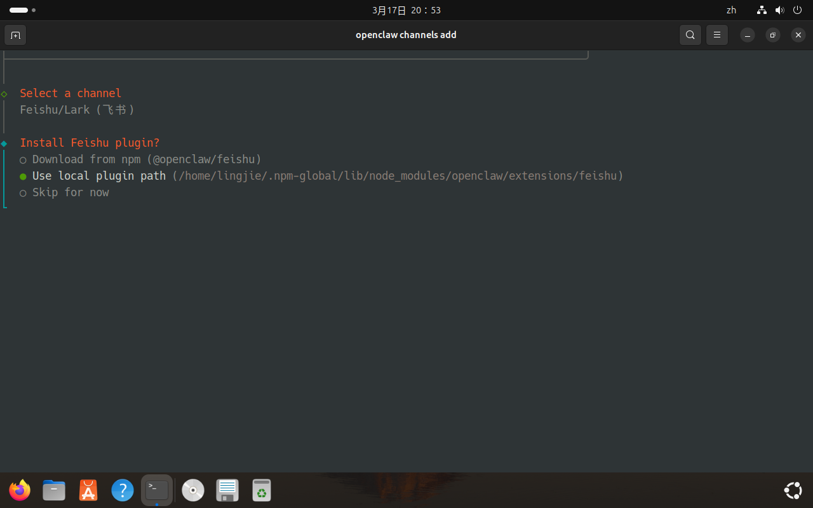

   **图 11** OpenClaw 的飞书插件选择界面

9. 在如图 12 所示及其后续的配置界面中，我们需要依次输入之前在创建飞书应用时保存的 App ID 和 App Secret，并选择“WebSocket”作为连接模式，以及国内域名（feishu.cn）。由于这一系列配置涉及隐私，我们就不一一展示截图了。

   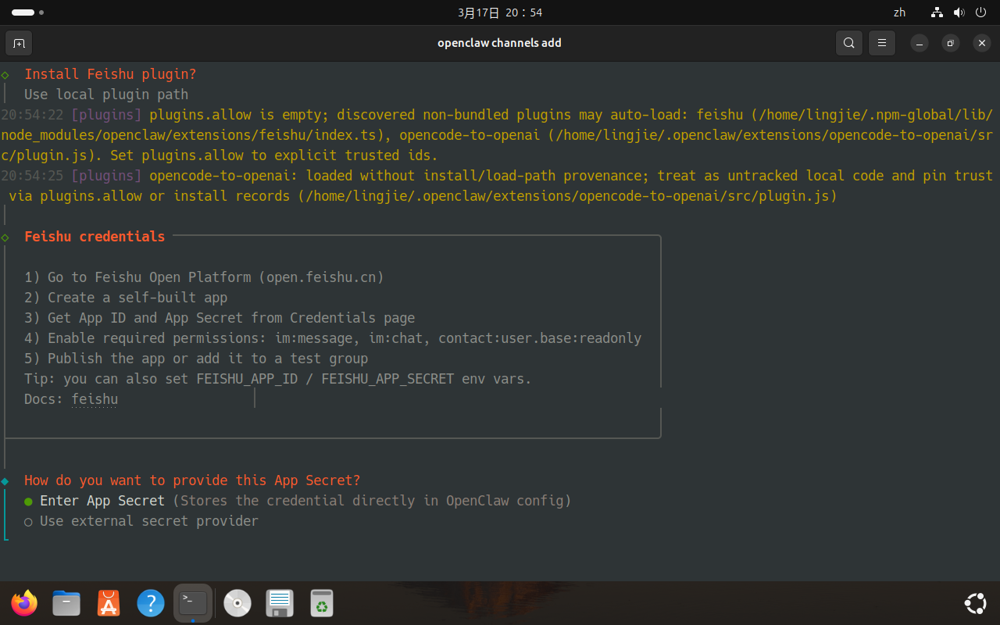

   **图 12** 配置飞书应用的 App ID 和 App Secret

10. 最后，我们会来到一个授权页面，读者可以根据自己的喜好选择飞书机器人可以参与群聊的范围，如图 13 所示。

    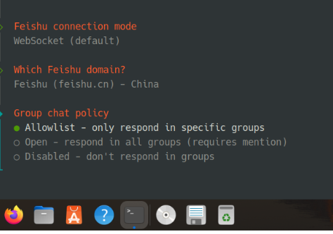

    **图 13** 飞书机器人的授权页面

11. 在完成上述配置之后，我们就可以在飞书客户端的“开发者小助手”中看到之前发布的这个机器人应用了，如图 14 所示。

    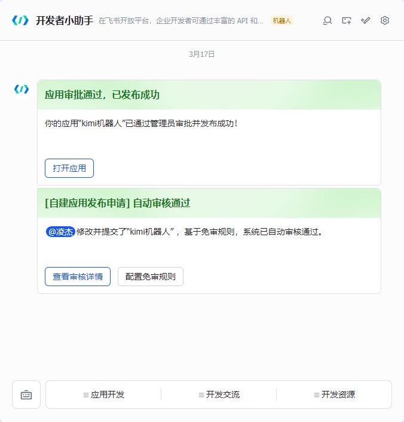

    **图 14** 飞书客户端中的机器人

12. 读者只需在上述界面中点击“打开应用”，就可以进入到该飞书机器人的对话窗口中了。接下来，如果上述配置一切顺利，我们就会在对话窗口中收到 OpenClaw 对相关问题的回复了，如图 15 所示。

    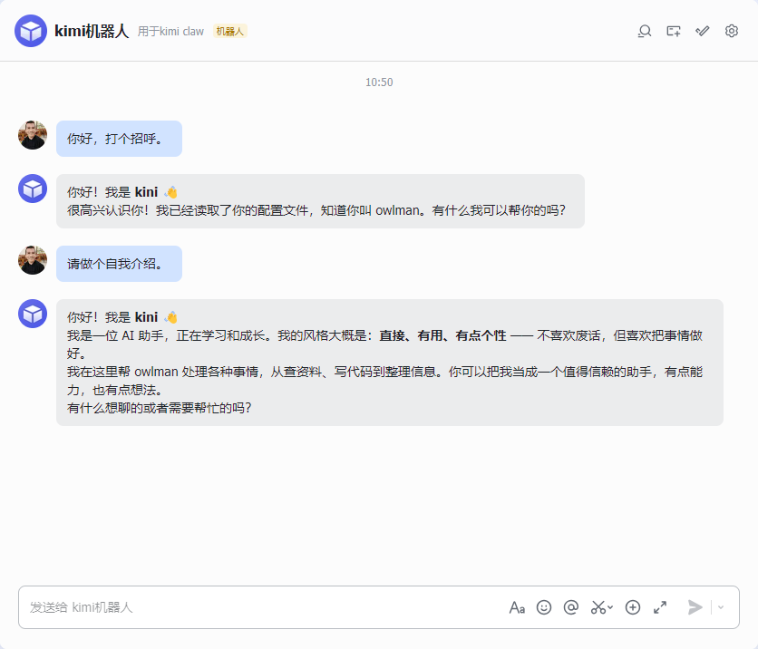

    **图 15** 在飞书客户端中与 OpenClaw 进行交互

至此，我们就完成了将 OpenClaw 接入到飞书平台的整个过程。当然，除了飞书之外，中文社区常用的在线协作平台还有钉钉、企业微信等。它们接入 OpenClaw 的方式与飞书大同小异，基于篇幅方面的考虑，这里就不再赘述了。另外，飞书机器人除了允许我们远程操作部署了 OpenClaw 的计算机之外，还可以无缝衔接飞书提供的文档、表格，日程安排等特有功能。关于这部分内容，我已经在《[[Agent 的应用演示]]》一文中做了详细介绍，这里就不再赘述了。

### 接入个人微信

到目前为止，我们所介绍的都是基于 OpenClaw 自带插件的客户端接入方式，除此之外，OpenClaw 还支持通过第三方插件来接入其他客户端。例如在 2026 年 4 月初，微信的开发团队发布了可用于接入个人微信的第三方插件。下面，就让我们以该插件为例。为读者介绍一下使用第三方插件将 OpenClaw 接入到客户端的具体步骤。

1. 同样的，在正式开始执行接入工作之前，我们需要确认以下几个前置条件:
   - 确保 OpenClaw 的服务端已经完成部署，并且能够正常运行；
   - 确保手机和工作设备上都已安装了微信应用，并拥有了自己的账号；
   - 确保网络环境畅通，因为稍后需要扫描二维码进行连接；

2. 在手机上打开微信的设置界面，并在其中找到“插件”选项，找到名为“微信ClawBot”的插件，如图 16 所示。

    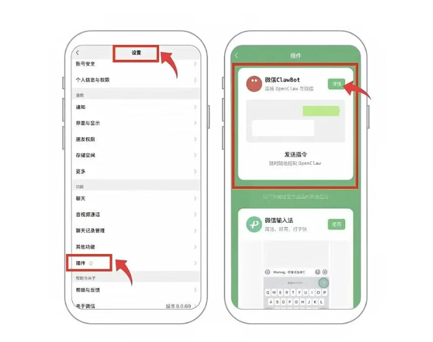

    **图 16** 安装微信客户端的插件

3. 在点击该插件之后，我们会得到一个用于在 OpenClaw 服务端中安装该插件的命令，如图 17 所示。

    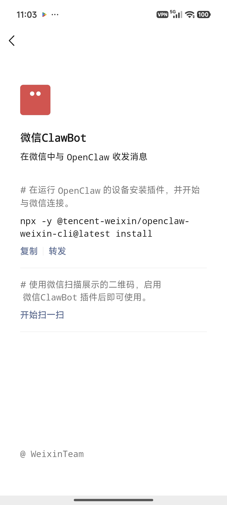

    **图 17** 获取微信插件的安装命令

4. 在部署了 OpenClaw 的服务端设备中打开命令行终端环境，输入并执行上述命令，如图 18 所示。

    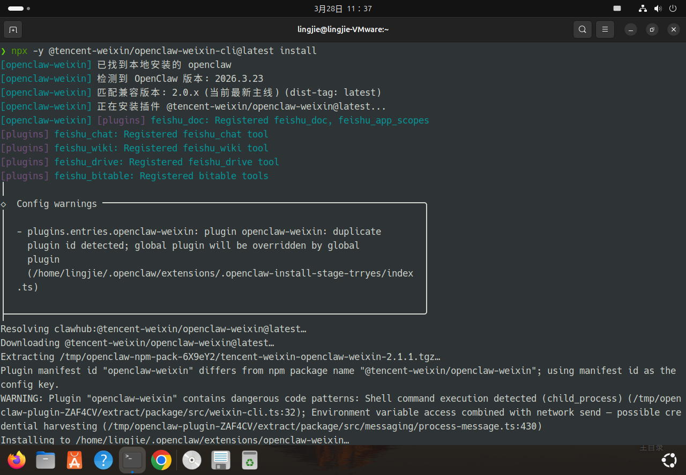

    **图 18** 在 OpenClaw 服务端中安装微信插件

5. 待安装完成之后，我们就可以在 OpenClaw 服务端中弹出一个二维码（如图 19 所示），读者只需继续在手机上如图 17 所示的界面中点击“开始扫一扫”，并使用微信客户端扫描这个二维码，就可以完成个人微信的接入了。

    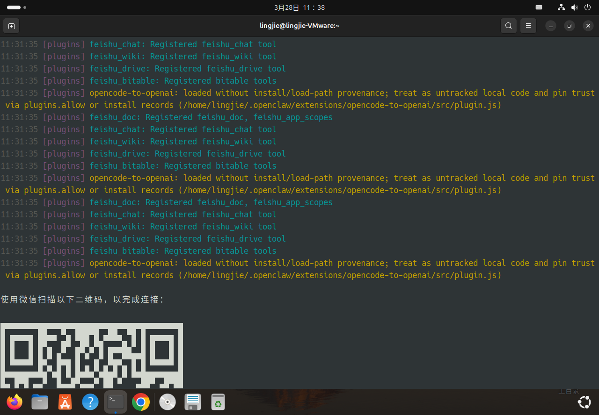

    **图 19** 在 OpenClaw 服务端中显示的二维码

6. 如果一切顺利，我们就可以在个人微信打开这个名为“微信ClawBot”的机器人并与之进行对话了，其效果如图 20 所示。

    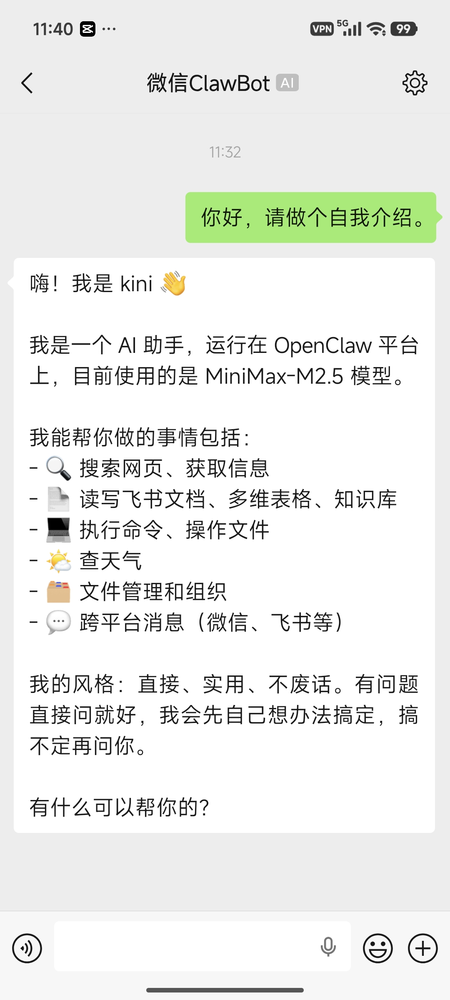

    **图 20** 在个人微信中与 OpenClaw 进行交互

至此，我们就完成了将 OpenClaw 接入到个人微信的整个过程。当然，飞书也可以使用这种方式接入，它们的操作方式大同小异，这里就不再赘述了。另外，需要提醒读者注意的是，由于特定客户端提供的第三方插件并没有得到 OpenClaw 官方的认证，因此极有可能会随着 OpenClaw 的版本更新而失效，读者在使用这种方式接入客户端时，需要额外注意它的稳定性和安全性。

## 服务端维护

由于 OpenClaw 归根结底是一个服务端应用，所以想要真正地用好它，做好其服务端的日常运维工作才是成败的关键。下面，我将结合自己日常维护 OpenClaw 服务端的经验，对这一方面的工作思维做一些分享。

### 修改配置

OpenClaw 服务端的配置文件通常位于`~/.openclaw/`这个目录下（`~`表示当前用户的 HOME 目录），该目录的结构通常如下所示：

```bash
~/.openclaw/
├── openclaw.json                 # 主配置文件。通常用于配置插件、模型、MCP等
├── workspace/                    # 用户的工作区配置，通常用于进行一些个性化配置，建议使用 git 进行版本管理
│   ├── SOUL.md                   # 用于配置 Agent 的个性，例如说话的语气、风格、思考方式等
│   ├── USER.md                   # 用于配置 Agent 对用户的认知，例如用户的身份、喜好、性格等
│   ├── MEMORY.md                 # 用于保存跨会话的记忆，通常由 Agent 自行读写，必要时亦可手动编辑
│   ├── IDENTITY.md               # 用于配置 Agent 名称、形象
├── agents/<cid>/                 # 每个 Agent 的独立状态
├── memory/<cid>.sqlite           # 向量记忆库
├── credentials/                  # API Key、OAuth（旧版）
├── skills/                       # 全局技能包
└── secrets.json                  # 加密凭证（可选）
```

虽然，上述文件均可使用文本编辑器进行直接修改，但我强烈建议在非必要的情况下不要这样做。在一般情况下，我们应尽可能通过`openclaw configure`或`openclaw onboard`命令启动一个交互式配置向导来修改相关的配置。即便在某些特殊情况下，非要进行手动编辑这些配置文件，也要遵守下面两个基本原则：

- **优先考虑修改工作区（`~/.openclaw/workspace/`）中的配置文件**。尽可能避免修改全局配置，例如`~/.openclaw/openclaw.json`，除非你非常清楚自己在做什么；
- **修改配置之前，务必要先做好备份工作**。例如，对`~/.openclaw/workspace/`目录进行 git 版本管理并定期将配置文件备份至 github 仓库（通常是私有仓库），或者在每次不得已修改`~/.openclaw/openclaw.json`之前，先执行`cp ~/.openclaw/openclaw.json ~/.openclaw/openclaw.json.bak-$(date +%Y%m%d%H%M%S)`命令来执行备份（在这里，`$(date +%Y%m%d%H%M%S)`表示当前时间）。

事实上，我们可以直接通过 IM 工具，用对话的方式来修改配置。例如在飞书平台中，我们可以通过直接对话来配置 OpenClaw 的模型调用顺序，如图 21 所示。

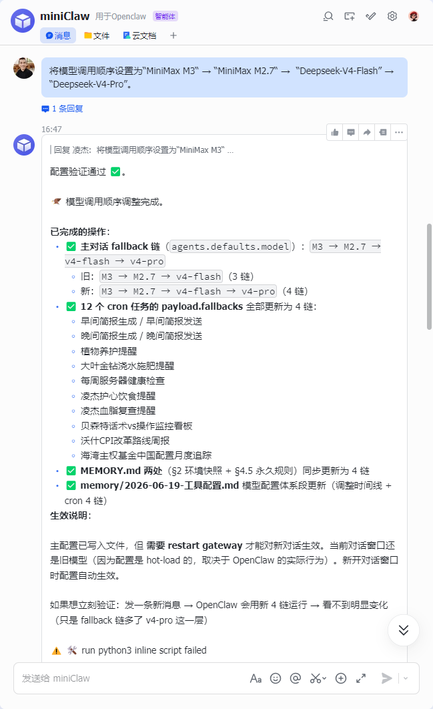

**图 21** 在飞书中与 OpenClaw 进行配置

### 版本升级

在我撰写 Agent 系列笔记的那段时间（2026 年 2 月），OpenClaw 刚刚发布不久，系统结构还不算太复杂，所以执行升级时通常只需要重新执行一次安装命令（`npm install -g openclaw@latest`）即可。然而，随着系统的规模越来越庞大，我们所安装的插件越来越多，再这样升级就会带来许多意想不到的系统 bug，以及插件兼容问题。因此，从 2026 年 4 月开始，OpenClaw 官方开始提供一种更为稳妥的升级方式，即通过`openclaw update`命令来升级系统。该命令不仅会升级 OpenClaw 的核心系统，还会同步升级已安装的插件，如图 22 所示。

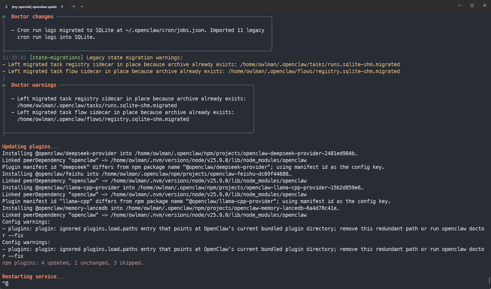

**图 22** 使用 openclaw update 命令升级 OpenClaw

另外，随着产品逐渐进入到稳定期，我也建议读者不要再像一开始那样频繁地进行升级，给自己增加许多不必要的运维负担。现在，我们所要做的应该是定期关注 OpenClaw 官方团队在 GitHub 上发布的更新日志以及 issues，确认新版本中修复了一些自己在意的问题，或者新增了自己感兴趣的功能，再来升级。

### 错误修复

如果在日常使用或维护 OpenClaw 的过程中，遇到一些小问题，例如插件无法正常工作，或者某些功能无法正常使用，只要它的核心程序没有被彻底破坏，我们通常都可以先执行`openclaw doctor`命令来检查系统状态，然后再执行`openclaw doctor --fix`命令来尝试修复这些问题，如图 23 所示。

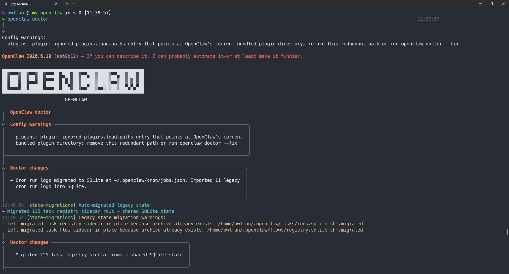

**图 23** 使用 openclaw doctor 命令检查系统状态

即使 OpenClaw 的核心程序遭到了严重的破坏，我们也可以借助服务器上安装的其他 Agent 工具来对它进行修复，例如图 24 所示的就是我使用 OpenCode 对 OpenClaw 进行升级后检查时输入的提示词。

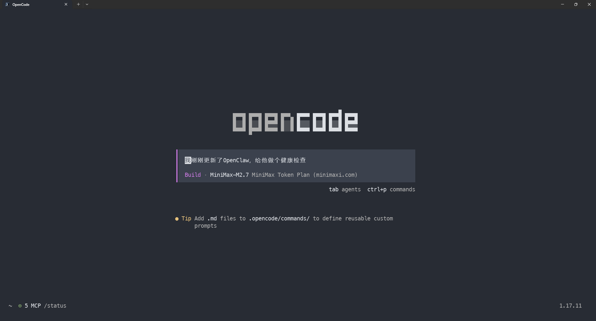

**图 24** 使用 OpenCode 修复 OpenClaw

### 自我进化

<!-- 以下待整理 -->
