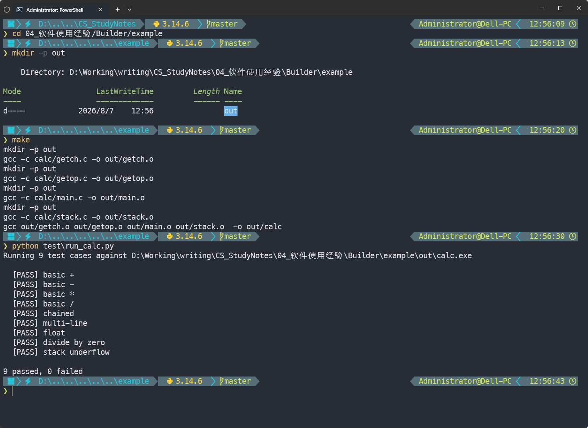

# Makefile     

> [!NOTE] 笔记说明
>
> 这篇笔记将用于记录本人在使用 make 这款项目构建工具过程中所记录的心得体会，它将会被存储在本人的[计算机专业笔记库](https://github.com/owlman/CS_Studynotes) 中，并予以长期维护。

## Makefile 简介

在软件开发中，make 通常被视为一种项目构建工具。该工具主要经由读取一种名为`makefile`或`Makefile`的文件来实现软件项目的自动化构建。它会通过一种被称之为“目标（target）”概念来检查项目文件之间的依赖关系，这种依赖关系的检查系统非常简单，主要通过对比文件的修改时间来实现。在大多数情况下，我们主要用它来编译源代码，生成结果代码，然后把结果代码连接起来生成可执行文件或者库文件。

## 优点与缺点

与大多数古老的 UNIX 工具一样，make 也分别有着人数众多的拥护者和反对者。它在适应现代大型软件项目方面有着许许多多的问题。但是，依然有很多人坚定地认为（包括我）它能应付绝大多数常见的情况，而且使用非常的简单，功能强大，表达清楚。无论如何，make 如今仍然被用来编译很多完整的操作系统，而且它的那些“更为现代”的替代品们在基本操作上与它没有太大差别。

当然，随着现代的集成开发环境（IDE）的诞生，特别是非 UNIX 的平台上，很多程序员不再手动管理依赖关系检查，甚至不用去管哪些文件是这个项目的一部分，而是把这些任务交给了他们的开发环境去做。类似的，很多现代的项目也发展出了自己专属的、能高效管理依赖关系的构建工具（例如 Java 生态中的 Apache Ant、Python 生态中的 SCons 等）。

## 主要版本

> [!NOTE] 本文示例（以及后文所有的 Makefile 代码）均以 **GNU make** 为准。其它实现大体兼容基础语法，但在模式规则、自动变量、函数等扩展点上各有差异，照搬写法前请先参考对应工具的官方文档。

在长达半个多世纪的发展过程中，`make`从最初的 Unix 构建工具逐渐分化出了多个实现和分支，不同操作系统和开发社区也根据自身需求对其进行了扩展。目前较为重要的实现主要包括以下几种。

- **GNU make**：GNU 项目对传统`make`的重新实现，并在兼容基本 Makefile 语法的基础上加入了大量扩展，例如模式规则、自动变量、条件语句、函数以及并行构建等。GNU make 是 Linux 和其他 Unix-like 系统中最常见的`make`实现之一，经常与 GNU 编译器工具链一起使用。

- **BSD make（bmake）**：BSD make 源自 Berkeley Unix 中的`make`，其发展过程中吸收了 Berkeley 社区的多个扩展。其中，亚当·德·布尔（Adam de Boor）在 Berkeley 的 Sprite 操作系统项目中开发的`pmake`尤其重要，它为`make`引入了并行构建能力，并成为后来 BSD make 演进的重要来源之一。现代 BSD 系统中的`make`通常属于这一演进体系，FreeBSD、NetBSD 和 OpenBSD 均有自己的 BSD make 实现或版本。

- **Microsoft NMAKE**：Microsoft 对`make`思想的一种实现，主要用于 Windows 环境下基于 Makefile 的传统 C/C++ 项目构建。需要特别注意的是，Microsoft 的`NMAKE`与 BSD 系统中的`bmake`（BSD make）是两个完全不同的工具，虽然名称相近，但实现、语法扩展和使用环境均有所不同。现代 Visual Studio 项目则主要采用 MSBuild，而不是 NMAKE。

## 从一个简单的例子开始

接下来，让我们用《K&R》在 4.5 节中所展示的那个`calc`程序来做一次紧扣原文的教学演示。在那个示例程序中，我们会看到一份主程序源码文件(`main.c`)、三份组件源码文件(`getop.c`、`stack.c`、`getch.c`)以及一个头文件(`calc.h`)。通常情况下，我们会将这个项目的目录结构安排如下：

```bash
example
├── calc
│   ├── calc.h
│   ├── getch.c
│   ├── getop.c
│   ├── stack.c
│   └── main.c
├── test
│   ├── input.txt
│   └── run_calc.py
├── out
└── makefile
```

在不使用自动化构建工具的情况下，如果我们想要对该项目进行编译，就需要先进入到`calc`目录下，然后再执行如下命令：

```bash
gcc main.c getch.c getop.c stack.c -o ../out/calc 
```

并且，之后在开发+调试这个项目的整个过程中，我们都需要不断地重复输入上面这条编译命令，或者利用 PowerShell、Bash 这样的终端程序所提供的历史功能，不停地按上下键来寻找最近执行过的命令，但这样做会存在以下两个问题。

1. 一旦终端历史记录被丢失，就不得不从头开始输入命令。大家都知道，手工输入命令往往是错误的根源，因此，我们会希望有一个更简短的命令来自动执行编译动作。

2. 任何时候，只要我们修改了项目中任何一个文件，上述编译命令就会重新编译所有的文件，当文件足够多时这样的编译会非常耗时。

那么`make`又能做什么呢？让我们在项目根目录下创建一个名为`makefile`或`Makefile`的文件，然后先试着输入下面这样一条构建规则：

```makefile
out/calc: calc/main.c calc/getch.c calc/getop.c calc/stack.c
    mkdir -p out
    gcc calc/main.c calc/getch.c calc/getop.c calc/stack.c -o out/calc
```

在这里，读者看到的是一条最基本的 Makefile 语句，它主要由三个部分组成：

- 第一行冒号之前的`out/calc`，我们称之为目标（target），被认为是这条语句所要处理的对象，具体到这里就是我们所要编译的这个程序`calc`和它所在的目录`out`。
- 冒号后面的部分（`calc/main.c calc/getch.c calc/getop.c calc/stack.c`），我们称之为依赖关系表，也就是编译`calc`程序所需要的源码文件。
- 这些文件只要有一个发生了变化，就会触发该语句的第三部分，我们称其为命令部分，相信读者也看得出这就是我们之前输入的那条编译命令。

现在只需要直接在项目根目录下打开终端并输入`make`命令，就会看到它按照我们的设定去编译程序了。当然，这里有一点需要特别留意：无论是 make 还是 gcc，都不会自动创建目标文件所在的目录，因此在第一次编译之前，我们必须先手动执行`mkdir -p out`来创建好`out`目录，否则 gcc 会因为找不到输出目录而报错。后面几个版本沿用同样的设计但省略了这条`mkdir`命令，请读者在运行它们前务必要记得先创建`out`目录。

> 请注意，在第二行的 gcc 命令之前必须要有一个 tab 缩进。语法规定 Makefile 中的任何命令之前都必须要有一个 tab 缩进，否则就会报错。下文所有 Makefile 代码块出于排版需要均使用 4 空格代替缩进显示，复制到本地时务必改回 Tab 字符，否则 make 会报 *missing separator* 错误。

当然了，上面这个`makefile`文件中的代码显然有很明显的冗余问题，让我们来试着解决一下这方面的问题，先初步修改一下上面的代码：

```makefile
cc = gcc
prom = out/calc
src = calc/main.c calc/getch.c calc/getop.c calc/stack.c

$(prom): $(src)
    $(cc) $(src) -o $(prom)
```

如读者所见，我们在上述代码中定义了`cc`、`prom`以及`src`这三个变量。它们分别用于告诉 make 我们要使用的编译器、要编译的目标以及源文件。这样一来，今后我们要修改这三者中的任何一项，只需要修改变量的定义即可，而不用再去管后面的代码部分了。

但我们现在依然还是没能解决”只修改一个文件，整个项目就要全部重新编译”的问题。而且 make 是基于文件修改时间（mtime）来判断依赖关系是否发生变化的，如果我们只是修改了`calc.h`而没有将其显式列入目标的依赖关系表，make 就不会察觉到它的变化（所以下面有必要再为头文件专门设置一个变量，并将其加入到依赖关系表中）。下面，我们来想一想如何解决这个问题。考虑到在标准的编译过程中，源文件往往是先被编译成目标文件，然后再由目标文件连接成可执行文件的。我们可以利用这一点来调整一下这些文件之间的依赖关系：

```makefile
cc = gcc
prom = out/calc
deps = calc/calc.h
obj = out/main.o out/getch.o out/getop.o out/stack.o

$(prom): $(obj)
    $(cc) $(obj) -o $(prom)

out/main.o: calc/main.c $(deps)
    $(cc) -c calc/main.c -o out/main.o

out/getch.o: calc/getch.c $(deps)
    $(cc) -c calc/getch.c -o out/getch.o

out/getop.o: calc/getop.c $(deps)
    $(cc) -c calc/getop.c -o out/getop.o

out/stack.o: calc/stack.c $(deps)
    $(cc) -c calc/stack.c -o out/stack.o
```

这样一来，上面的问题显然是解决了，但同时我们又让代码变得非常啰嗦；过多重复的内容既不利于阅读，也不利于后期维护。经过再度观察，我们发现所有`.c`都会被编译成相同名称的`.o`文件。我们可以根据该特点再对其做进一步的简化：

```makefile
cc = gcc
prom = out/calc
deps = calc/calc.h
obj = out/main.o out/getch.o out/getop.o out/stack.o

$(prom): $(obj)
    $(cc) $(obj) -o $(prom)

out/%.o: calc/%.c $(deps)
    $(cc) -c $< -o $@
```

在这里，我们用到了几个自动变量和模式匹配写法。先看模式规则里的`%`。`out/%.o: calc/%.c $(deps)`这条规则表示`out`目录下所有的`.o`目标都依赖于`calc`目录下与它同名的`.c`文件（当然还有变量`deps`中列出的头文件）。再来就是命令部分的`$<`和`$@`，`$<`代表的是依赖关系表中的第一项（如果我们想引用的是整个关系表，那么就应该使用`$^`），具体到这里就是`calc/%.c`。而`$@`代表的是当前语句的构建目标，即`out/%.o`。这样一来，make 就会自动将`calc`目录下所有的`.c`源文件编译成`out`目录下同名的`.o`文件。不用我们一项一项去指定了。整个代码自然简洁了许多。

到目前为止，我们已经有了一个不错的`makefile`文件，至少用来维护这个小型工程是没有什么问题了。当然，如果要进一步增加上面这个项目的可扩展性，我们就会需要用到一些 Makefile 语法中的伪目标和函数规则了。例如，如果我们想增加自动清理编译结果的功能就可以为其定义一个带伪目标的规则；

```makefile
cc = gcc
prom = out/calc
deps = calc/calc.h
obj = out/main.o out/getch.o out/getop.o out/stack.o

$(prom): $(obj)
    $(cc) $(obj) -o $(prom)

out/%.o: calc/%.c $(deps)
    $(cc) -c $< -o $@

.PHONY: clean
clean:
    -rm -f $(obj) $(prom)
```

有了上面最后两行代码，当我们在终端中执行`make clean`命令时，它就会去删除该工程生成的所有编译文件。注意这里把`clean`声明成了伪目标（`.PHONY`）：伪目标不代表真实文件，声明之后即使项目目录下恰好存在一个名为`clean`的文件，`make clean` 也不会被误判为“无需执行”。

另外在上面示例中，`clean`这个伪目标所对应执行的`-rm -f`命令有两层意思：一是`-`前缀告诉 make 即便命令返回非零也继续往下走（GNU make 与 BSD make 等主流实现都支持；Windows 上常见的 Microsoft nmake 不识别此前缀），这样即使某些产物尚未生成也不会让 make 中断；二是`-f`让 `rm` 在文件不存在时也不报错。两者结合在一起，让`clean`成为一个稳定可复用的维护入口。

最后，如果我们还需要往工程中添加一个`.c`或`.h`，可能同时就要再手动为`obj`变量再添加一个`.o`文件，如果这列表很长，代码会非常难看，为此，我们需要用到 Makefile 语法中的函数功能，这里演示其中的两个：

```makefile
# 这个版本不适用于 Windows 系统
cc = gcc
prom = out/calc
deps = $(shell find calc/ -name "*.h")
src = $(shell find calc/ -name "*.c")
obj = $(src:calc/%.c=out/%.o) 

$(prom): $(obj)
    $(cc) $(obj) -o $(prom)

out/%.o: calc/%.c $(deps)
    $(cc) -c $< -o $@

.PHONY: clean
clean:
    -rm -f $(obj) $(prom)
```

其中，`shell`函数主要用于执行`shell`命令，具体到这里就是找出`calc`目录下所有的`.c`和`.h`文件。而`$(src:calc/%.c=out/%.o)`则是 Makefile 提供的替换引用语法（substitution reference），它会将`src`中所有的`calc/*.c`字串替换成`out/*.o`，实际上就等于列出了所有`.c`文件要编译的结果。有了这两个设定，无论我们今后在该工程加入多少`.c`和`.h`文件，`makefile`文件都能自动将其纳入到工程中来。

需要特别留意的是，由于`find`是类 UNIX 系统上的命令，在 Windows 的 cmd / PowerShell 上默认并不存在，因此上面这段 makefile 直接拷贝到 Windows 上是会报错的。如果希望让该 makefile 跨平台运行，读者可以选择以下几种替代方案来解决这个问题：

- **使用 Git Bash / WSL / MSYS 等终端**：这些终端自带 GNU 工具链，`find`命令可以直接使用，makefile 无需任何修改。

- **使用 make 内建的`wildcard`函数**：它可以达到与`$(shell find ...)`相同的效果，而且本身就是跨平台的：

  ```makefile
  deps = $(wildcard calc/*.h)
  src  = $(wildcard calc/*.c)
  ```

- **PowerShell 替代**：如果环境只能用原生 PowerShell，可以用`$(shell ...)`调起`Get-ChildItem`，但写起来很啰嗦：

  ```makefile
  deps = $(shell powershell -NoProfile -Command "Get-ChildItem -Path calc -Filter *.h -Recurse | Select-Object -ExpandProperty FullName")
  src  = $(shell powershell -NoProfile -Command "Get-ChildItem -Path calc -Filter *.c -Recurse | Select-Object -ExpandProperty FullName")
  ```

在这里，我建议读者仅在`wildcard`无法满足需求（例如需要按 mtime 排序、按子目录排除）时才退回到这条路径；其它场景强烈建议直接用上面的`wildcard`写法。

## 运行示例

本文里出现的所有 makefile 版本都已落到仓库的`example/`目录中，结构如下：

```bash
example
├── calc
│   ├── calc.h
│   ├── getch.c
│   ├── getop.c
│   ├── stack.c
│   └── main.c
├── test
│   ├── input.txt   # 手工调试用的 RPN 输入样本（+ - * /），测试套件不使用
│   └── run_calc.py # 9 个针对 out/calc 行为的回归用例
├── out             # make 生成的中间产物（已通过 example/.gitignore 排除）
└── makefile        # 当前激活版（使用 wildcard）；V1–V4 保留为注释掉的对照版本
```

动手跑一遍的最小步骤（GNU Make 适用，Git Bash / WSL / MSYS 或 Linux 上均可）：

```bash
cd 04_软件使用经验/Builder/example
make                   # 仓库激活版（V5）已把 mkdir -p out 嵌入到模式规则里,无需手动建目录
python test/run_calc.py
```

当然，上述操作在 PowerShell 下也同样可用，前提是要确认`make`已在 PATH 上、`python`（或`py`）指向 Python 3，具体效果如图 1 所示：



**图 1** calc 程序的构建与测试

## 小结

本文从 make 的基本概念出发，借助《K&R》中那个名为`calc`的经典小例子，逐步演示了如何由最简单的编译规则演化到支持模式匹配、伪目标和函数的高级写法。尽管如今 cmake、ninja 等更现代的元构建系统已经能够处理大型项目的复杂依赖关系（可参阅同目录下的 [[Ninja 使用笔记]]），但 make 凭借其语法简洁、上手成本低、对系统依赖少等特点，依然是小型项目、嵌入式工程以及日常脚本化构建任务的首选工具。掌握好本文介绍的这些基础语法，便足以应付绝大多数常见的编译场景。

## 常见陷阱

最后再补充几个使用 make 时最容易踩到的坑，供初学者参考：

- **`.PHONY`一定要显式声明**：凡是“目标不是真实文件”的规则（如`clean`、`install`、`all`），都应当显式列入 `.PHONY`。否则一旦项目目录下真的出现了一个同名的文件，make 就会被误判为“目标已是最新，无需执行”，导致相应的命令无法触发。
- **看不见的 Tab 也是 tab**：复制 Makefile 时，编辑器、聊天工具粘贴板、Web 页面、CIM 系统经常会"好心"地把 Tab 替换成等宽空格甚至直接吃掉，结果 make 报 *missing separator*，但看着代码又全是空格，看不出哪里错。碰到这种诡异报错，第一反应应该是用 `cat -A makefile` 或 `od -c makefile | head` 把文件 dump 出来——recipe 行如果不是以 `^I`(即 Tab)开头，罪魁祸首就找到了。这一条用编辑器（如 VS Code）装上 *EditorConfig* 或 *Makefile* 插件后通常会自动用显式箭头标注 Tab 与空格，可作为事后兜底。
- **并行编译`-j`的副作用**：使用 `make -jN` 多线程编译时，各条 recipe 是并发执行的。如果多条命令会写同一个临时文件、或者读取同一份“正在写”的文件，就可能出现竞争问题。常见的规避方式包括：把每个中间产物放到独立的 target 文件名下（`$@`已经替我们做了这件事），以及避免在 recipe 里直接`cd`后再`make`子目录。
- **变量赋值用`=`还是`:=`**：两者的核心差别在于右侧`$(...)`引用的解析时机——`=`（递归展开）只在变量被引用时才解析右侧表达式，因此同一份`$(shell ...)`每次引用都会被重新执行一次；而`:=`（立即展开）在定义时就一次性求值并把结果存为字面量。对于包含`$(shell ...)`或`$(wildcard ...)`等开销较大的变量，更推荐用`:=`。

## 参考资料

- [中文维基百科](https://zh.wikipedia.org/wiki/Make)。
- [一个简单的 Makefile 教程](http://blog.163.com/weidao_xue/blog/static/2045410462012102222755897/)。
- [GNU Make Manual](http://www.cs.utexas.edu/~cannata/cs345/GNU%20Make%20Manual.pdf)
