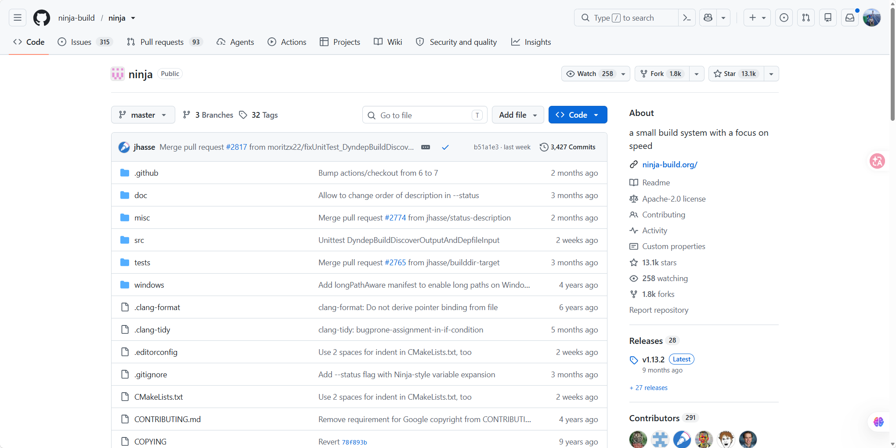
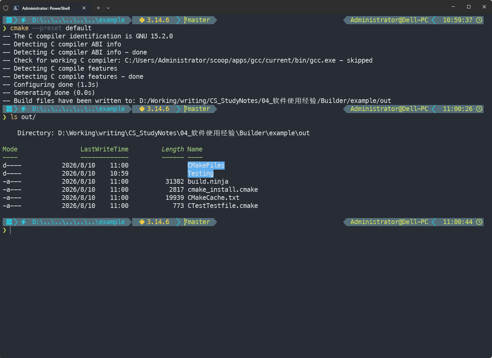
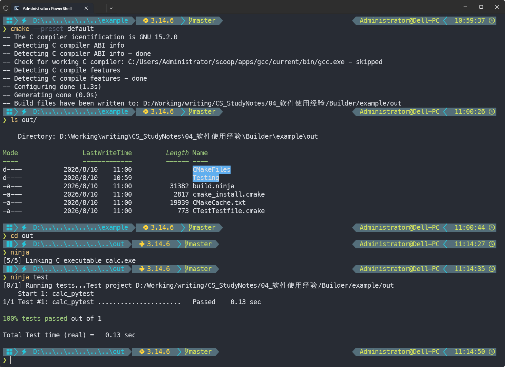

> [!NOTE] 笔记说明
>
> 这篇笔记是《[[Makefile 使用笔记]]》的姊妹篇，将用于记录本人在使用 Ninja 这款项目构建工具过程中所记录的心得体会，它侧重于 Ninja 在现代 C/C++ 工程中的实际使用方式。具体内容包括以 CMake 为元构建系统时所生成的`build.ninja`文件的逐段解析思路，以及日常排错时常用的`ninja`命令与参数，便于在阅读和维护 PyTorch 等采用 CMake + Ninja 范式的大型开源项目时能够快速上手。同样的，本笔记也将会被存储在我个人的[计算机专业笔记库](https://github.com/owlman/CS_Studynotes) 中，并予以长期维护。

## Ninja 简介

Ninja 是时下较为流行的一款项目构建工具，主要用于通过调用代码生成器、编译器、链接器等各种工具来完成软件项目的编译工作。如今的很多大型项目（例如 PyTorch）都是采用基于 Ninja 来进行系统构建的，为了阅读并维护这些项目，我们很有必要学习一下这款工具的基本使用方法。

与我在《[[Makefile 使用笔记]]》中所介绍的那种传统的自动化构建工具不同，ninja 在设计之初就没打算让人类去手动编写项目的构建规则，这些规则基本上是要由专用程序来负责生成的，这可以帮助我们最大限度地避免人类语言不够精确的问题，例如在`makefile`中，我们经常会用`src/*.c`这样的字符串来表示源码文件（其实这包括了文件的路径），这通常需要构建工具去执行遍历目录、匹配文件名才能获得正确的输入。这些操作不仅会拖慢项目的构建速度，且通常还会引入各种不确定的因素。Ninja 选择将这些操作都交给元构建系统（meta-build system，例如 cmake）来处理，自身只负责处理真正需要编译的命令。

因此在本质上，我们可以认为基于 Ninja 的构建规则就只需要一条一条地列出了具体的命令，然后执行它们即可。在执行过程中，Ninja 会自行去分析这一系列命令之间的依赖关系，并根据依赖关系的不同分以下两种方式来进行处理。

- **并行编译**：对彼此没有依赖关系的编译命令采用并行化处理。Ninja 默认使用的并行数为 CPU 数量，除非我们想限制 Ninja 使用的 CPU 数量，一般不用手动设置并行数。
- **增量编译**：对彼此有依赖关系的编译命令，分析目标文件的时间戳，如果发现某个文件的时间戳发生了改变，则依赖于该文件的命令以及其他依赖于这个命令的命令都会被重新执行，以此达到增量编译的效果。

## 安装方法

Ninja 是一个体量很小的 CLI 工具，根据它所要作用的项目环境，我们通常有以下三种安装方式：

- **系统级环境**：可以使用我们所在系统的软件包管理器命令来进行安装，例如 Ubuntu 上的`apt install ninja-build`、Windows 上的`scoop install ninja`、MacOS 上的`brew install ninja`，安装好之后，Ninja 就可以像`ls`、`cat`等系统命令一样被使用了。
- **单一项目环境**：可以使用 pip 或 conda 这样的项目依赖管理器命令来进行安装，例如`conda install ninja`或`pip install ninja`。
- **自定义环境**：在 GitHub 找到 ninja 项目（如图 1 所示）下载它的安装包并解压即可。当然，如果有特殊需求，也可以选择下载它的源码，然后进行本地编译。



**图 1** Ninja 项目在 GitHub 上的主页

需要特别说明的是：Ninja 的官方项目事实上只会通过 GitHub 来发布他们的新版本，其它获取该工具的渠道都是相关的开发社区自己负责维护的。例如，`pip install ninja`命令安装的是 scikit-build 社区维护的 [ninja-python-distributions](https://github.com/scikit-build/ninja-python-distributions)，他们把 Ninja 打包成了一个 pip 包。很多人不知道他们下载的不是官方的版本。同样的，`conda install ninja`命令所安装的也是一个类似的东西。总之，如果读者比较在意 Ninja 的原生功能以及安全问题，那就应该尽可能去 GitHub release 页面下载它的安装包。当然，在大多数情况下，用各种开发社区维护的安装方式已经够满足需求了。

## 理解`build.ninja`

基于 Ninja 的项目构建配置文件一般会被命名为`build.ninja`。虽然该文件通常并不需要我们亲自去编写，但基于项目维护方面的考虑，程序员们还是至少要能看得懂它才行。下面，让我们继续基于《[[Makefile 使用笔记]]》中所使用的那个`calc`示例程序来介绍一下`build.ninja`文件中会出现的常见内容。想必读者还记得，这个示例程序的项目结构如下：

```bash
example
├── calc                     # 源码：main.c / getch.c / getop.c / stack.c / calc.h
├── out                      # 构建产物目标目录（makefile 与 cmake 的构建都会把产物放这里）
├── test                     # 测试：input.txt / run_calc.py
├── makefile                 # 手写 Makefile 版本（详见《Makefile 使用笔记》）
└── .gitignore               # 排除 cmake 产生的中间产物
```

之前，我们是使用 make 这种传统的项目构建工具来处理这个 C 项目的。如果现在想改用 Ninja 来构建这个项目，首先要做的是用 CMake 来生成一个`build.ninja`文件。目前最为常见的操作步骤如下。

1. 确保项目所在的开发环境中已经安装了 gcc/clang 编译器，以及 CMake、Ninja 构建工具。

   > 关联笔记：[[Clang 使用笔记]] [[CMake 使用笔记]]

2. 在项目的根目录下创建一个名为`CMakeLists.txt`的文件，并写入以下内容：

   ```cmake
    cmake_minimum_required(VERSION 3.10)
    project(calc C)

    # ---- 编译选项 ----
    set(CMAKE_C_STANDARD 99)
    set(CMAKE_C_STANDARD_REQUIRED ON)
    set(CMAKE_C_EXTENSIONS OFF)

    if(NOT CMAKE_BUILD_TYPE)
        set(CMAKE_BUILD_TYPE Release CACHE STRING "Build type" FORCE)
    endif()

    if(CMAKE_C_COMPILER_ID MATCHES "GNU|Clang")
        add_compile_options(-Wall -Wextra)
    endif()

    # ---- 目标 ----
    add_executable(calc
        calc/main.c
        calc/getch.c
        calc/getop.c
        calc/stack.c
    )

    target_include_directories(calc PRIVATE calc)

    # 把构建产物（可执行文件）输出到 out/
    # cmake 的配置（CMakeFiles/、CMakeCache.txt、build.ninja）留在源码目录
    set(CMAKE_RUNTIME_OUTPUT_DIRECTORY ${CMAKE_SOURCE_DIR}/out)
    set(CMAKE_ARCHIVE_OUTPUT_DIRECTORY ${CMAKE_SOURCE_DIR}/out)
    set(CMAKE_LIBRARY_OUTPUT_DIRECTORY ${CMAKE_SOURCE_DIR}/out)

    # ---- 测试 ----
    # 集成 test/run_calc.py 作为 ctest 用例
    find_package(Python3 COMPONENTS Interpreter QUIET)

    if(Python3_Interpreter_FOUND)
        enable_testing()
        add_test(
            NAME calc_pytest
            COMMAND ${Python3_EXECUTABLE} ${CMAKE_SOURCE_DIR}/test/run_calc.py
        )
    else()
        message(STATUS "Python3 not found; skipping calc_pytest test target")
    endif()

    # ---- 安装 ----
    include(GNUInstallDirs)
    install(TARGETS calc RUNTIME DESTINATION ${CMAKE_INSTALL_BINDIR})
    ```

3. 在项目根目录下打开命令行终端程序（例如 Powershell、Bash），并执行`cmake --preset default`命令，其执行过程如图 2 所示。

    

    **图 2** cmake 命令执行过程

如果上述过程一切顺利，就会在`example/out/`目录下看到一个名为`build.ninja`的文件（由 `CMakePresets.json` 里 `binaryDir: ${sourceDir}/out` 这一项决定）。该文件的内容虽然有 250+ 行，但结构是高度模板化的，下面按从上到下的"段落"逐段拆解（下面所有片段都直接取自这篇笔记的示例项目）：

- **文件头声明**。最开头是`CMAKE generated file: DO NOT EDIT!`与版本信息，紧跟一段由注释划分的小节：

    ```ninja
    ninja_required_version = 1.5
    CONFIGURATION = Release
    cmake_ninja_workdir = D$:/Working/writing/CS_StudyNotes/04_软件使用经验/Builder/example/out/
    ```

    在这里，`ninja_required_version`的作用是让 Ninja 的低版本在不兼容当前配置文件时提早报错；`CONFIGURATION`用于配置项目当前使用的构建类型（`Debug` / `Release`等），后面 rule 的`FLAGS`会根据它切换；`cmake_ninja_workdir`是当前项目根目录所在的绝对路径。

- **`include CMakeFiles/rules.ninja`**。真正的`rule`定义都被抽出到`CMakeFiles/rules.ninja`里，主文件通过`include`引入。这种**主文件 + 规则子文件**的拆分是 CMake 的惯例：主文件只放`build`条目，规则（编译、链接、自定义命令等）统一放在`rules.ninja`，方便生成器增量更新。

- **order-only phony**。每个可执行目标都先声明一个 order-only phony：

    ```ninja
    build cmake_object_order_depends_target_calc: phony || .
    ```

    它的作用是：在编译任何一个`.o`之前，确保工作目录存在；`||`后面是 order-only dependencies（只保证顺序，不参与 mtime 比较）。

- **`.c` → `.o` 编译条目**。每个源文件一条 build：

    ```ninja
    build CMakeFiles/calc.dir/calc/main.c.obj: C_COMPILER__calc_unscanned_Release
        D$:/Working/writing/CS_StudyNotes/04_软件使用经验/Builder/example/calc/main.c
        || cmake_object_order_depends_target_calc
    CONFIG = Release
    DEP_FILE = CMakeFiles\calc.dir\calc\main.c.obj.d
    FLAGS = -O3 -DNDEBUG -std=c99 -Wall -Wextra
    INCLUDES = -ID:/Working/writing/CS_StudyNotes/04_软件使用经验/Builder/example/calc
    OBJECT_DIR = CMakeFiles/calc.dir
    OBJECT_FILE_DIR = CMakeFiles/calc.dir/calc
    ...
    ```

    在这里，`C_COMPILER__calc_unscanned_Release`是个 rule 名（定义在 `rules.ninja` 里），冒号后面的`calc/main.c`是`$in`。每条 build 自己的局部变量（`FLAGS` / `INCLUDES` / `OBJECT_DIR`等）覆盖同名全局变量，传入对应 rule 的 command。

    另外，请注意`DEP_FILE = CMakeFiles\calc.dir\calc\main.c.obj.d`这一行。它的作用是让编译器在编译时会把"该 build 实际 include 了哪些文件"写到这份`.d`里。这样一来，`ninja`命令下次再执行构建任务时，就会先读`.d`，并把里面的所有路径加入实际依赖列表，再与`.o`的 mtime 比对，任何一个比`.o`新就触发重编。这就是改了`calc.h`也会重编`main.c`的机制基础。

- **链接条目**。将所有`.o`汇总成一个名为`calc`的程序（具体到 Windows 环境，就是`calc.exe`），并链接所需库。

    ```ninja
    build calc.exe: C_EXECUTABLE_LINKER__calc_Release
        CMakeFiles/calc.dir/calc/main.c.obj
        CMakeFiles/calc.dir/calc/getch.c.obj
        CMakeFiles/calc.dir/calc/getop.c.obj
        CMakeFiles/calc.dir/calc/stack.c.obj
    FLAGS = -O3 -DNDEBUG
    LINK_LIBRARIES = -lkernel32 -luser32 -lgdi32 -lwinspool -lshell32 -lole32 -loleaut32 -luuid -lcomdlg32 -ladvapi32
    ```

- **utility 命令**。`test` / `edit_cache` / `rebuild_cache` / `install` / `install/local` / `install/strip` 等子命令也是 build 条目，rule 是 `CUSTOM_COMMAND`，由 `cmake -P` 脚本驱动。例如：

    ```ninja
    build CMakeFiles/test.util: CUSTOM_COMMAND
    COMMAND = C:\Windows\system32\cmd.exe /C "cd /D ... && ctest.exe "
    DESC = Running tests...
    pool = console
    restat = 1
    build test: phony CMakeFiles/test.util
    ```

    在这里，`pool = console`强制让这些命令串行执行（避免与并行编译抢同一行 stdout），`restat = 1`告诉 ninja 在 command 跑完后重新 stat 一次输出文件（很多 custom command 的输出 mtime 不可靠，需要重 stat）。

- **`RERUN_CMAKE` 钩子**。文件末尾有一段很长的 build 条目，触发条件是`CMakeLists.txt`或 CMake 内置 module 发生变化：

    ```ninja
    build build.ninja ... : RERUN_CMAKE | ...
    pool = console
    ```

    它的作用是：如果`CMakeLists.txt`被修改了，就先自动重跑 cmake 重新生成`build.ninja`文件本身，再继续构建。这等于把 CMake 自身的再生也嵌进了 ninja 的 DAG 里。

- **内建目标 + default**。最后三行：

    ```ninja
    build clean: CLEAN
    build help: HELP
    default all
    ```

    在这里，`CLEAN`和`HELP`是 ninja 内建规则。`default all`声明裸跑`ninja`命令，等价于`ninja all`；而`all` 在上面被定义为`phony calc.exe`，所以等价于构建`calc.exe`。

在有了这份 `build.ninja`之后，我们就可以根据自己的需要构建项目了，其常用命令如下：

```bash
ninja              # 等价于 ninja all → 构建 calc.exe
ninja calc         # 只构建 calc alias（phony calc.exe）
ninja test         # 通过 ctest 跑 test/run_calc.py
ninja clean        # 清理全部构建产物
ninja help         # 列出所有可构建目标
```

第一次跑会全量编译`calc/main.c`、`calc/getch.c`、`calc/getop.c`、`calc/stack.c`四个源文件并链接成`calc.exe`，如图 3 所示。之后如果只改了`calc/main.c`，`ninja`就会只重编`main.c.obj`并重新链接。

另外，读者应该会注意到，由于我们在`CMakeLists.txt`里把`CMAKE_RUNTIME_OUTPUT_DIRECTORY`显式设成了`${CMAKE_SOURCE_DIR}/out`，可执行文件最终落在`example/out/calc.exe`（而不是源码根目录）。这条约定把源码管理和构建产物做了物理隔离，方便用`.gitignore`分别处理。



**图 3** ninja 构建 calc.exe

## Ninja 进阶用法

如果读者回头再看看我们在上述示例中生成的那份`build.ninja`文件，会注意到其中用到了大量的`phony`规则。这是 Ninja 的内建规则，它的作用与`makefile`中的伪目标是相同的，只用于在输入和输出之间建立依赖关系，本身并不代表任何真实文件。我们可以理解为：

```ninja
rule phony
    command = :
```

在这里，冒号`:`是类 UNIX 系统里`true`命令的简写，它用于确保不管参数是什么都正常退出；因此`phony`的 command 本身什么都不做，只是把`$in`列为必须先构建好的依赖、把`$out`注册成一个伪目标。仓库的`build.ninja`里至少出现三处：order-only 的`cmake_object_order_depends_target_calc`、聚合用的`calc`、`all`等。

不带参数的`ninja`命令会构建文件里`default`声明的目标（即上一节末尾那些`ninja` / `ninja calc` / `ninja test`之类）。构建多个目标时 Ninja 会展示进度条，每行的内容来自对应`build`条目下方的`DESC = ...`字段。这篇笔记的示例里就有`DESC = Running tests...`、`DESC = Install the project...`等，进度条会按构建顺序依次打印。

Ninja 的高级工具主要在`-t`参数下面，常用的子命令如下。

- `ninja -t targets all`：列出全部构建目标（等价于`ninja help`的内容），适合`grep`过滤；
- `ninja -t clean`：与`ninja clean`（即`build.ninja`里`build clean: CLEAN`这条内建目标）等价，删除全部生成文件；
- `ninja -t deps`：扫描`.ninja_deps`数据库，输出每条 build 的依赖关系，方便定位 "为什么 A 改了会触发 B 重编"；
- `ninja -t browse`：起一个本地 HTTP 服务（默认`http://localhost:8000`）用浏览器可视化整张依赖图；`ninja -t graph`则把同一张图导出成 dot 格式供 Graphviz 渲染；
- `ninja -t compdb`：把每条编译命令以 JSON 数组形式输出，常被 clangd / VS Code 等工具用来反查 "这个 `.c` 对应的编译参数"，对排查 IDE 索引异常很关键。

另外，我们还可以用`ninja -C /path/to/dir -f /path/to/file`命令来切换构建根目录与配置文件。在这里，`-C`用于指定目录后再跑命令（默认 `.`），`-f`用于指定要读的配置文件（默认`build.ninja`）。日常使用`-C`多一些，比如用多份构建目录时切换。

## 总结

与《[[Makefile 使用笔记]]》中介绍的那种需要手写项目构建规则的范式相比，使用 Ninja 的核心工作流是：程序员们负责人工维护`CMakeLists.txt`（项目元信息），而 CMake 负责先将它编译成`build.ninja`文件（执行计划），再交由 Ninja 去执行`build.ninja`。这两件事的解耦让项目复杂度的天花板被推到了 CMake 那侧。这也是为什么 PyTorch 这样的大型项目选择使用 CMake + Ninja 的范式来替代手写`makefile`文件的根本原因。

总而言之，`build.ninja`文件通常不是给人手动维护的：它由 CMake 自动生成、文件头就有`CMAKE generated file: DO NOT EDIT!`。本文逐段拆解它的目的，是让读者在 build 报错时能快速定位问题出在 CMake 那边（`CMakeLists.txt`没写对），还是`ninja`命令这边（命令执行环境有问题）。这样一来，我们在日常开发中只要记住：改`CMakeLists.txt`后跑一次`cmake --preset default`命令来重新生成`build.ninja`，之后再用`ninja`命令做增量即可。工具的简洁本身是设计目标 —— Ninja 的核心语法确实就只有这些值得关心的内容。

## 参考资料

- [Ninja 官方网站](https://ninja-build.org/)
- [Ninja 在 GitHub 上的仓库](https://github.com/ninja-build/ninja)
- [知乎专栏:《一文读懂 ninja 构建系统》（作者：游凯超）](https://zhuanlan.zhihu.com/p/676733751)，
