> [!NOTE] 笔记说明
>
> 在这篇笔记中，我会重点介绍个人配置与使用 Fish 的相关经验。以及如何利用 oh-my-fish 来将其美化。后者是一个简单易用的 Fish shell 框架，允许用户安装功能扩展或更改 Shell 外观的软件包。同样的，它将会被存储在本人 Github 上的[计算机学习笔记库](https://github.com/owlman/CS_StudyNotes) 中，并予以长期维护。

## Fish 的安装与配置

[Fish](https://fishshell.com/) 是一款功能齐全，智能且用户体验良好的 Linux Shell ，它带有一些在大多数 Shell 中都不具备的方便功能，包括自动补全建议、Sane Scripting、手册页补全、基于 Web 的配置器和 Glorious VGA Color。Fish 的安装步骤非常简单，用户可根据自己所在操作系统的命令行终端中选择以下包管理器命令来进行安装。

```bash
# APT 包管理器
sudo apt install fish
# YUM 包管理器
sudo yum install fish
# DNF 包管理器
sudo dnf install fish
# Pacman 包管理器
sudo pacman -S fish
# Zypper
sudo zypper install fish
```

如果一切顺利，读者接下来只需要继续在命令行终端中输入`fish`命令并按回车键，就可以将该终端界面中使用的 Shell 从 bash 切换到 Fish 了。当然了，如果想将 Fish 设置为命令行终端默认使用的 Shell，我们还需要执行如下步骤来进行配置：

1. 使用以下命令获取 Fish Shell 的安装位置。

    ```bash
    $ whereis fish
    fish: /usr/bin/fish /etc/fish /usr/share/fish /usr/share/man/man1/fish.1.gz
    ```

2. 通过运行以下命令将默认 Shell 更改为 fish。

    ```bash
    chsh -s /usr/bin/fish    
    ```

> [!WARNING] 修改默认 Shell 的风险
> 修改系统级默认 Shell 存在一定风险：如果 Fish 的配置出现错误，或者在某些受限环境中 Fish 不可用，可能导致无法正常登录系统。
>
> 建议先执行以下操作来降低风险：
>
> - 确认`/usr/bin/fish`已添加到`/etc/shells`文件中（可通过`cat /etc/shells`查看）。
> - 初次体验时，可以选择**只在终端模拟器中**将默认命令设为`fish`（如 GNOME Terminal、Konsole 等的设置项），而**不修改系统级默认 Shell**。这样即使 Fish 出现问题，回退到 tty 登录时仍可使用 Bash。

下面，让我们来简单介绍一下 Fish Shell 几个最基本的常用功能。

- **自动补全**：当我们在 fish shell 中键入任何命令时，它会在输入几个字母后以浅灰色自动建议一个命令。

    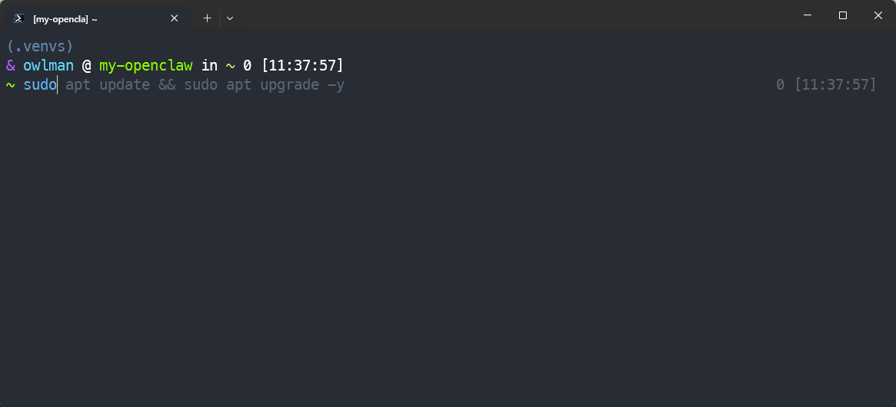

    在这种情况下，如果我们只需要按下向右光标键，就能自动补全完整的命令。

    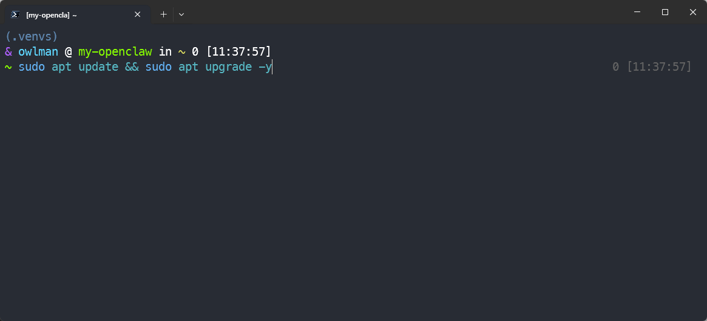

    另外，我们也可以输入某个命令的前几个字母并按下 `Tab` 键，fish 也会列出以这几个字母开头的所有命令。

    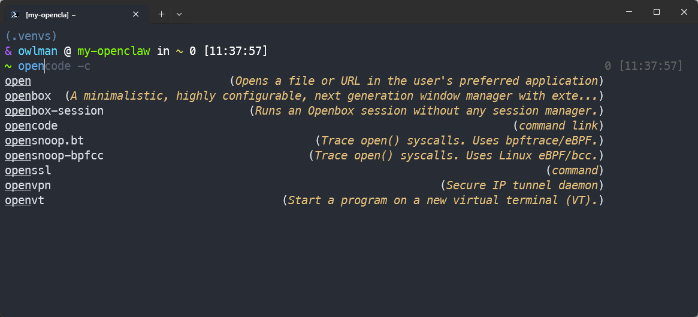

- **目录补全**：当我们输入一个完整的命令并按下空格键 + `Tab`键时，它会自动补全当前可以操作的目录和文件。如果连续按两次`Tab`键，它会进入到一个可以用光标键选择目标目录和文件的列表中。

    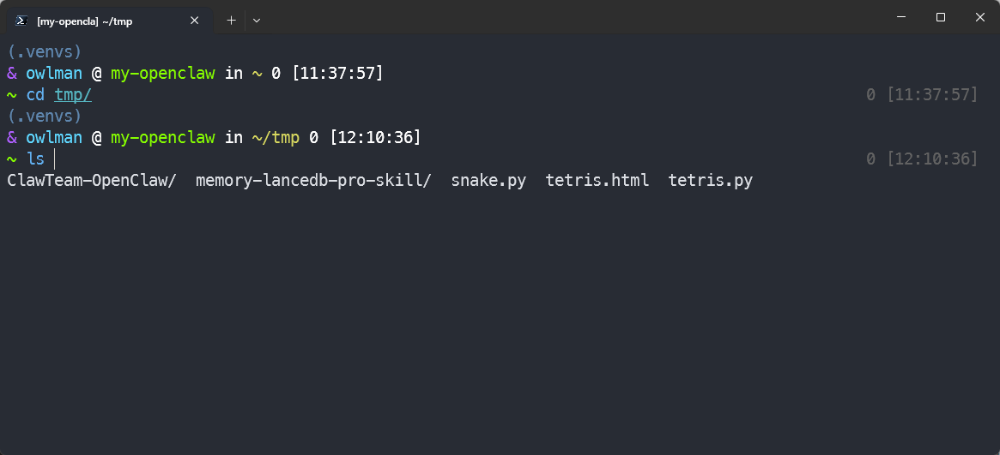

- **历史命令**：Fish shell 中的历史命令功能非常强大。它允许我们使用上下箭头键来查看之前输入的命令。此外，它还允许我们使用 `Ctrl + r` 来搜索历史命令。

    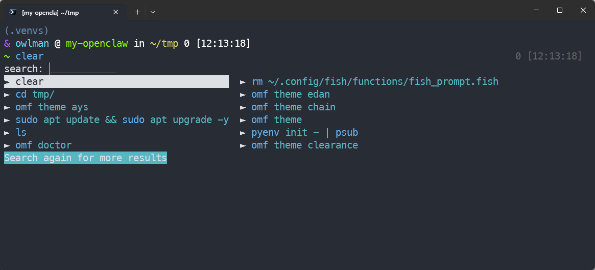

- **语法高亮**：fish 会进行语法高亮显示，我们可以在终端中键入任何命令时看到。无效的命令被标记为红色。

    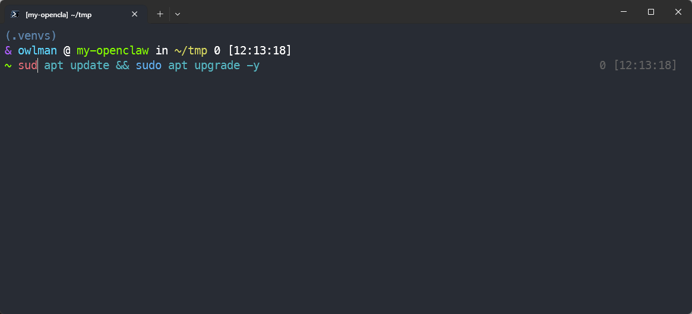

    相应的，有效命令则会以绿色来显示。此外，当我们键入有效的文件路径时，fish 会在其下面加下划线，而如果路径无效，则不会显示下划线。

- **基于 Web 的配置器**：fish shell 中有一个很酷的功能，它允许我们通过网络浏览器设置颜色、提示符、功能、变量、历史和键绑定。在终端上运行`fish_config`命令以启动 Web 配置界面。在完成配置之后，我们只需按下`Ctrl+c`即可退出。

    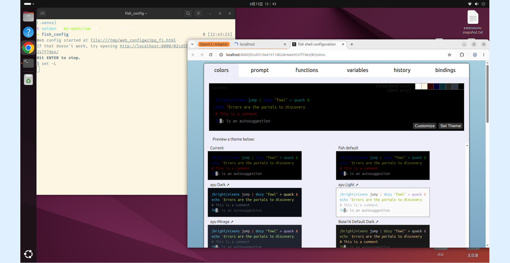

- **手册页补全**：其他 shell 支持可编程的补全，但只有 Fish 可以通过解析已安装的手册页自动生成它们。如果想要使用该功能，请运行以下命令：

    ```bash
    $ fish_update_completions
    Parsing man pages and writing completions to ~/.config/fish/completions
    3466 / 3466 : zramctl.8.gz
    ```

以上只是关于 Fish 的基本用法。如果想进一步深入使用 Fish，就需要来具体了解一下它的配置体系了。该体系的文件默认保存在`~/.config/fish/`目录下，主要由以下文件和目录组成。

- **config.fish**：主配置文件，用于定义启动时自动执行的命令。例如，如果我们想让 Fish 在每次启动时自动激活指定的 Python 虚拟环境（假设它位于`~/.venv`目录下），那么就可以在该文件中添加如下内容。

    ```bash
    if test -f $HOME/.venv/bin/activate.fish
        source $HOME/.venv/bin/activate.fish
    end
    ```

    除此之外，我们还可以在这个主配置文件中给命令设置别名、设置环境变量等，例如像下面这样：

    ```bash
    # 给命令设置别名
    alias ll='ls -lah'
    alias gs='git status'

    # 设置环境变量，用于指定默认的文本编辑器
    set -gx EDITOR nvim

    # 初始化 fzf 插件，用于实现模糊搜索
    fzf --fish | source
    ```

- **functions**：自定义函数目录，用于存放用户自定义的函数。例如，如果我们想定义一个名为`myfunc`的函数，那么就可以在该目录下创建一个名为`say_hello.fish`的文件，并在其中添加如下内容。

    ```bash
    function say_hello
        echo "Hello, World!"
    end
    ```

    然后，我们就可以在 Fish shell 中通过执行`say_hello`命令来调用该函数了，如下图所示。

    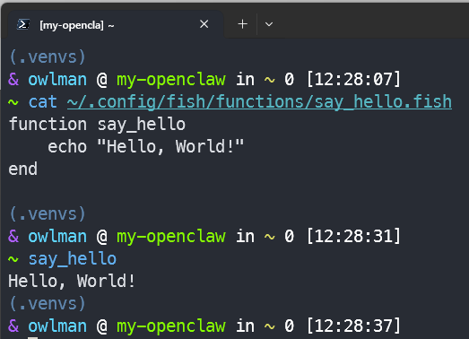

- **completions**：自定义补全目录，用于存放用户自定义的补全脚本。例如，我们之前在执行`fish_update_completions`命令时，fish 就会自动在该目录下生成一些补全脚本。

## 使用 Oh My Fish

就个人习惯来说，相较于 Fish 提供的 Web 配置器，我更喜欢使用 oh my fish 来配置 Fish shell 的外观与功能扩展。oh-my-fish（以下简称 omf）是一个简单易用的 Fish shell 框架，它会将所有内容存储在用户主目录中，不会干扰系统文件。omf 的安装也非常简单。我们要做的只是在 Fish shell 中运行下面的命令即可。

```bash
curl https://raw.githubusercontent.com/oh-my-fish/oh-my-fish/master/bin/install | fish
```

一旦安装完成，我们就注意到当前时间在 shell 窗口的右边。接下来，让我们继续并调整 fish shell。首先，我们可以执行`omf list`命令来查看当前已安装的包。Fish 所有官方和社区支持的包（包括插件和主题）都托管在 Omf 主仓库中。在这个主仓库中，我们可以看到大量的仓库，其中包含大量的插件和主题。

现在，让我们执行`omf theme`命令，先来看一下可用的和已安装的主题列表。读者可以看到，我们只有一个已安装的主题，这是默认的，但是还有大量可用的主题。在安装之前，读者可以先前往 omf 的主仓库查看一下相关文档，以便预览所有可用主题的细节、特性、截图示例。

接下来，假设我在这里选择的是 chain 这个极简风格的主题，那么就只需要执行`omf install chain`命令来安装它即可。该主题启用之后的效果如下图所示。

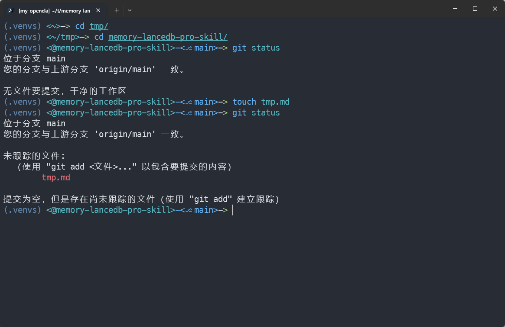

如读者所见，在安装新主题后，Fish shell 的提示立即发生了变化。另外，如果我们安装了多个主题，也可以使用`omf theme <theme-name>`命令来切换主题，例如在执行了`omf theme ays`命令之后，我们就可以看到 Fish shell 的外观回到了之前的样子。

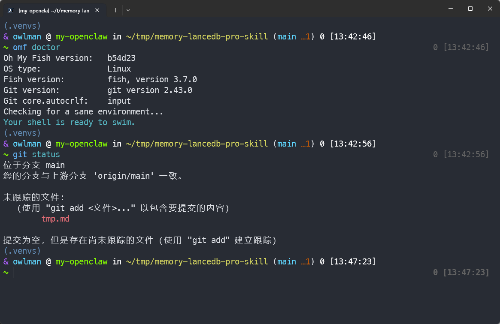

下面，让我们继续来了解一下 oh-my-fish 的插件安装，例如，我想安装一个天气插件，那么只需要执行`omf install weather`命令即可，如下图所示。

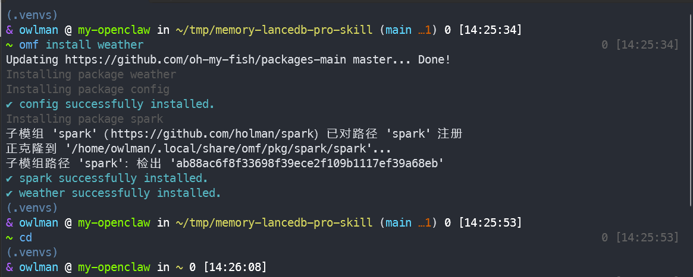

请注意，这个天气插件依赖于一个名为 jq 的轻量级 JSON 处理器，因此，我们需要先使用包管理器来安装它。例如在 ubuntu 系统中执行`sudo apt install jq`命令即可。另外，如果我们想搜索某个插件，可以使用`omf search <search_string>`命令，例如在执行了`omf search python`命令之后，我们就可以看到 omf 返回了关于 Python 插件的相关信息。

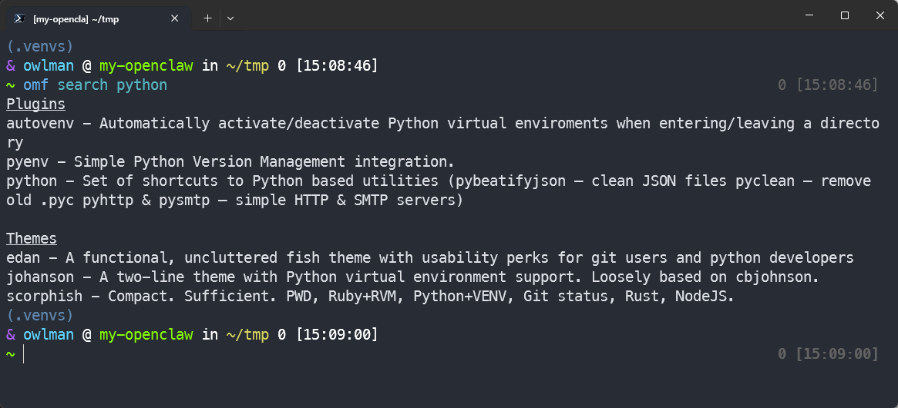

除此之外，当我们想更新 omf 中安装的主题和插件时，可以使用`omf update`命令，例如：

```bash
# 要仅更新核心功能（omf 本身），可执行：
omf update omf
# 要更新指定的主题和插件，可执行：
omf update clearance agnoster
# 要更新所有的主题和插件，可执行：
omf update
```

当我们想知道关于一个主题或插件的信息时，可以使用`omf describe <package-name>`命令，例如当我们执行`omf describe clearance`命令之后，omf 就会返回关于该主题的相关信息。

```bash
Package: clearance
Description: A minimalist fish shell theme for people who use git
Repository: https://github.com/oh-my-fish/theme-clearance
Maintainer:
```

当我们想移除一个主题或插件时，可以使用`omf remove <package-name>`命令，例如在执行了`omf remove weather`命令之后，omf 就会移除 weather 插件。

默认情况下，当我们安装了 Oh My Fish 时，它会自动添加官方仓库。这个仓库包含了开发人员构建的所有包。当我们需要引入并管理来自第三方仓库的主题或插件时，可以使用`omf repositories [list|add|remove]`命令，例如：

```bash
# 列出所有已纳入管理的仓库：
omf repositories list
# 添加一个仓库：
omf repositories add https://github.com/ostechnix/theme-sk
# 移除一个仓库：
omf repositories remove <repository-name>
```

如果出现了错误，omf 也会列出解决问题的方法。例如，我之前在安装 clearance 时遇到了文件冲突错误。然后，我只是简单地运行了`omf doctor`命令，而 omf 就建议我执行`rm ~/.config/fish/functions/fish_prompt.fish`命令来解决问题。最后，如果我们想卸载 omf，可以执行`omf destroy`命令来完成。

## 扩展阅读

如果这篇笔记的内容已经满足不了读者的需求，有以下方向可以进一步地探索：

- **`abbr`缩写机制**：Fish 的`abbr`（缩写）比传统 alias 更智能——它会在输入时展开为完整命令，但命令行中实际显示的是展开后的内容，适合管理带参数的长命令。
- **`tide`主题引擎**：一个现代化的 Fish 主题管理器，支持右侧提示符、异步渲染和丰富的自定义选项，是 Oh My Fish 的热门替代品。
- **`starship`提示符**：跨 Shell 的极简提示符工具，只需在`config.fish`中添加一行`starship init fish | source`即可使用，支持`$rustc`、`$node`等众多语言版本信息。
- **与 `fzf` 深度集成**：除本文提到的初始化之外，还可以利用 `fzf` 实现历史命令模糊搜索、文件路径快速跳转等高级交互功能。
- **函数与事件系统**：Fish 支持事件驱动的编程模型（`fish --event`、`fish_exit`、`fish_preexec`等），可以编写更智能的自动化脚本。

## 参考资料

- 文档资料：
  - [Fish 官方文档](https://fishshell.com/docs/current/index.html)
  - [oh-my-fish 项目](https://github.com/oh-my-fish/oh-my-fish)

- 视频资料：
  - Fish - 颜值与实力并存的现代 Shell：[YouTube 链接](https://www.youtube.com/watch?v=cIItvazBSf4) / [Bilibili 链接](https://www.bilibili.com/video/BV1dfRVYGEPz)
