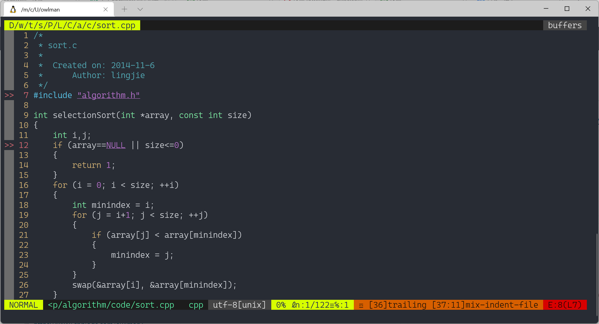
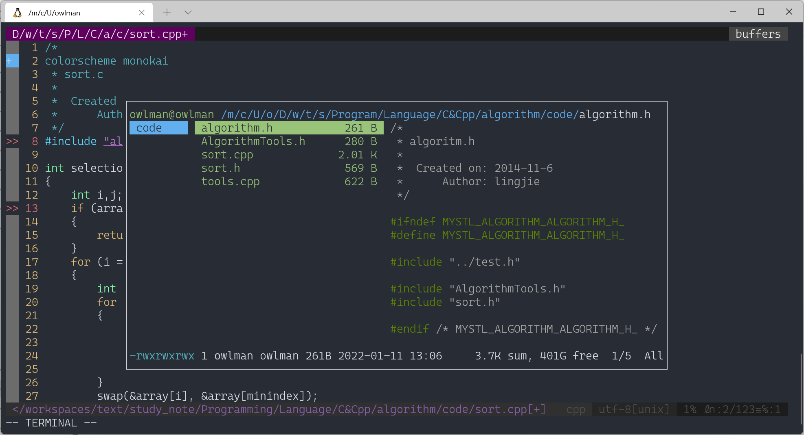
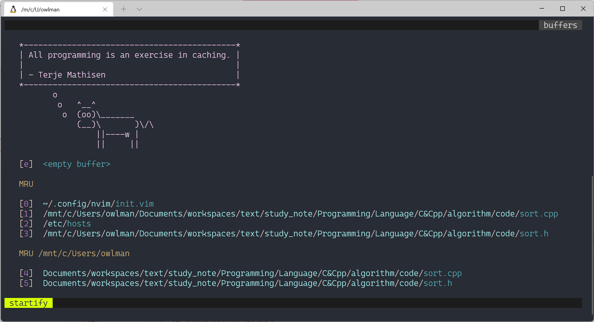
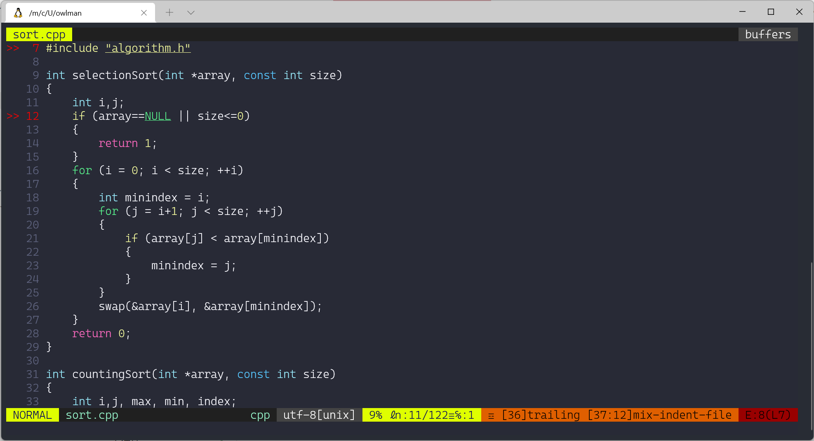

> [!NOTE] 笔记说明
>
> 这篇笔记用于记录本人在使用 NeoVim 这款文本编辑器过程中的心得体会，存储于个人的[计算机专业笔记库](https://github.com/owlman/CS_Studynotes) 中并长期维护。

> [!IMPORTANT] 2026-05 大更新
>
> 自 2020 年首次撰写以来，本文涉及的工具链已经迭代了好几代，本轮一次性同步下列依赖：
>
> | 旧 | 新 | 主要变化 |
> | --- | --- | --- |
> | Node.js 17 | Node.js 20 LTS | Node 17 已 EOL；现以 20.x 长期支持版为基准 |
> | `registry.npm.taobao.org` | `registry.npmmirror.com` | 淘宝镜像整体迁移到 npmmirror |
> | NeoVim 0.4.3 | NeoVim 0.11+ | 内置 LSP / Treesitter / Lua 配置成熟 |
> | vim-plug | lazy.nvim | 主流从 vimscript 插件管理器迁移到 Lua |
> | Coc.nvim + coc-pyls | 内置 LSP + Pyright | 用 NeoVim 0.11 内置 `vim.lsp.*` 替代 Coc 中间层，Pyright 替代停更的 pyls |
> | ranger + rnvimr | yazi + yazi.nvim | ranger 已基本停更，yazi 是当前社区主流 |
> | vim-airline | lualine.nvim | 纯 Lua 实现的状态栏，主题生态更现代 |
>
> 版本基线：本文以 **NeoVim 0.11 / 0.12+**（撰写时最新稳定版 v0.12.5，2026-08 发布）为基准；Node.js 20 LTS；lazy.nvim v11+；yazi v26+。
>
> 图片方面：旧版本中的博客园 CDN 图片已在历次 commit 中统一迁移至本地 `img/` 目录，本文不再保留任何外链图片。
>
> 2026-09-09 实战微调（首轮）：按本文 §3-§7 实际在 Windows 11 + Scoop 环境配置一轮后回写，修正了 7 处与现行社区规范不符的写法（详见 §6 常见问题 Q9-Q15）。
>
> 2026-09-10 实机升级：NeoVim `0.12.4 → 0.12.5`（scoop）实测完成，全套插件 / LSP / Treesitter / yazi 仍全正常。升级过程中的 scoop hash 校验坑已记到 §6 Q15。
>
> 2026-09-10 实战微调（二轮）：完整跑通配置 + LSP attach 验证后再补：
> - Q5 增加「GitHub release 直装 yazi」备选（实测 scoop extras bucket clone 卡在 broken 状态）
> - Q14 补充「build 时机报错的 stack trace 详解」
> - 新增 Q17：lspconfig deprecation warning 在 headless 输出里刷屏
> - §5.1 加 nvim-treesitter「master vs main」对比表
> - §7 附录的 `options.lua` 补全为实战最终版

## 目录

- [1. 学习规划](#1-学习规划)
- [2. 背景知识](#2-背景知识)
  - [2.1 NeoVim 起源](#21-neovim-起源)
  - [2.2 NeoVim 现状](#22-neovim-现状)
- [3. 安装与配置](#3-安装与配置)
  - [3.1 基础环境准备](#31-基础环境准备)
  - [3.2 安装 NeoVim](#32-安装-neovim)
  - [3.3 配置文件结构](#33-配置文件结构)
- [4. 插件管理：lazy.nvim](#4-插件管理lazynvim)
  - [4.1 安装 lazy.nvim](#41-安装-lazynvim)
  - [4.2 插件目录约定](#42-插件目录约定)
- [5. 常用插件推荐](#5-常用插件推荐)
  - [5.1 编辑器基础：Treesitter + 补全 + 模糊搜索](#51-编辑器基础treesitter--补全--模糊搜索)
  - [5.2 LSP：内置 LSP + Pyright](#52-lsp内置-lsp--pyright)
  - [5.3 状态栏：lualine](#53-状态栏lualine)
  - [5.4 文件管理器：yazi](#54-文件管理器yazi)
  - [5.5 Markdown 预览：markdown-preview.nvim](#55-markdown-预览markdown-previewnvim)
  - [5.6 启动页：alpha-nvim](#56-启动页alpha-nvim)
  - [5.7 主题：catppuccin](#57-主题catppuccin)
- [6. 常见问题](#6-常见问题)
- [7. 附录：完整配置骨架](#7-附录完整配置骨架)

## 1. 学习规划

- 学习基础：
  - 掌握 Linux shell 命令的基本使用。
  - 掌握 Vim 编辑器的基本操作方法。
  - 有一两门编程语言的使用经验。
- 学习环境：
  - Ubuntu Linux 24.04+（其他主流发行版 / macOS / Windows 同样可行，本文以 Ubuntu 为示例）。
- 学习资料：
  - NeoVim 官方网站：[neovim.io](https://neovim.io/)
  - NeoVim 项目仓库：[GitHub - neovim/neovim](https://github.com/neovim/neovim)
  - NeoVim 内置文档：`:help`，配合 `:help lua-guide` / `:help lsp` / `:help treesitter` 起步。

## 2. 背景知识

### 2.1 NeoVim 起源

2014 年，巴西程序员 Thiago de Arruda Padilha（aka tarruda）曾经向 Vim 开源编辑器项目递交了两大补丁，其中包含了对 Vim 的架构进行大幅调整的建议，结果遭到了 Vim 作者 Bram Moolenaar 的拒绝。因为后者认为对于 Vim 这样一个成熟的项目进行如此大的改变风险太高。但或许在 tarruda 看来，Vim 这个上个世纪 90 年代初的产物，至今已经 20 多年了，该项目中不仅遗留了大量的历史痕迹，而且该项目的管理层如今在程序的维护、Bug 的修复、以及新特性的添加等问题上的态度都在变得越来越僵化，且难以与时俱进。

总而言之，基于对 Vim 项目的不满，并致力于打造一款面向 21 世纪的代码编辑器，tarruda 先生以众筹资金的方式发起了 Vim 的这个 fork 项目：NeoVim。在这里，Neo 这个单词表达的是其作者对 Vim 编辑器在这个新时代的重生期待。

### 2.2 NeoVim 现状

从 NeoVim 项目的提交记录可以看出，tarruda 先生是个非常有项目维护经验的人，其有条不紊的管理让 NeoVim 的版本迭代相当快速，基本上几天就会推送一个新的版本。目前来说，NeoVim 已经实现 Vim 大部分功能，并兼容了 Vim 百分之九十以上的配置。

NeoVim 项目逐步成为成熟项目，并率先提供了多个 8.0 之前 Vim 所没有的新特性：

- 支持在 Vim 中打开命令行终端窗口，使用户不必退出编辑器就能执行 shell 命令。
- 为 vimscript 提供异步任务支持，之前的 vimscript 只能以同步方式执行任务。
- 重构 Vim 部分代码，实现多平台兼容，并使用更现代化的代码编译工具链。

NeoVim 的成功也反过来唤起了 Vim 项目组的危机意识，加快了 Vim 8.0/8.1 的迭代；Vim 现在也支持异步任务、内置终端等特性。

到 2026 年前后，NeoVim 已经稳定进入了 **0.11 / 0.12 时代**：

- **内置 LSP**：`vim.lsp.config / vim.lsp.enable` 已经覆盖了 server 注册、filetype 关联、capabilities 等核心场景；Coc 这种 Node.js 中间层已不再是必需品。
- **内置 Treesitter**：高亮、缩进、跳转都走 `vim.treesitter.*`，从 0.11 开始官方也提供了内建 parser 安装机制（`:checkhealth vim.treesitter`）。
- **Lua 作为一等公民**：`init.lua` 与 `lua/` 模块成为推荐配置方式，vimscript 配置被逐步淘汰；lazy.nvim 这类 Lua 插件管理器随之成为主流。
- **稳定与 nightly 双轨发布**：每夜构建与稳定版均可通过 GitHub Releases 直接下载 AppImage，不再受发行版仓库拖累。

## 3. 安装与配置

本文以 Ubuntu Linux 24.04 为示例，其他发行版 / macOS / Windows 思路一致。

### 3.1 基础环境准备

#### Node.js 20 LTS

部分 LSP 客户端、Treesitter parser 的远程同步、以及 markdown-preview.nvim 仍依赖 Node.js。Node 17 已 EOL，本文以 20.x LTS 为基准（Node 22 LTS 也已可用，但生态适配目标仍以 20 为主）：

```bash
# Ubuntu / Debian
curl -fsSL https://deb.nodesource.com/setup_20.x | sudo -E bash -
sudo apt install -y nodejs

# 验证
node -v   # v20.x.x
npm -v    # 10.x.x
```

国内用户顺手把 NPM 默认仓库切到 npmmirror（旧的 `registry.npm.taobao.org` 已经停止服务，整个镜像站迁到了 `registry.npmmirror.com`）：

```bash
npm config set registry https://registry.npmmirror.com
npm config get registry # 应输出：https://registry.npmmirror.com
```

#### Python、ripgrep、fd

Pyright LSP、Treesitter 解析器以及若干 formatter 都依赖 Python 与一些 CLI 工具：

```bash
sudo apt install -y python3 python3-pip python3-venv \
                    ripgrep fd-find unzip
pip install --user pynvim
```

> 如果你用 venv 管理 Python 项目，记得在每个 venv 里再装一次 `pynvim` 和 `pyright`，否则 LSP 会读到全局 site-packages。

#### Git / curl

后续装 lazy.nvim、克隆插件必备：

```bash
sudo apt install -y curl git
```

### 3.2 安装 NeoVim

在这里，我会建议读者**不要直接用 Ubuntu 仓库的 `apt install neovim`**，发行版仓库里通常还停留在 0.9 甚至 0.7，缺少内置 LSP / Treesitter 关键改动。推荐以下三种方式之一：

#### AppImage（最简单，跨发行版通用）

```bash
curl -L -o /tmp/nvim.appimage \
  https://github.com/neovim/neovim/releases/download/stable/nvim-linux-x86_64.appimage
chmod +x /tmp/nvim.appimage
sudo mv /tmp/nvim.appimage /usr/local/bin/nvim
```

如果想跟踪 nightly：

```bash
curl -L -o /tmp/nvim.appimage \
  https://github.com/neovim/neovim/releases/download/nightly/nvim-linux-x86_64.appimage
```

#### Ubuntu PPA

```bash
sudo add-apt-repository ppa:neovim-ppa/stable
sudo apt update
sudo apt install -y neovim
```

#### 源码编译

适合追求最新 commit 或自己改源码的场景：

```bash
git clone https://github.com/neovim/neovim.git
cd neovim && make CMAKE_BUILD_TYPE=Release
sudo make install
```

#### 验证

```bash
nvim -v   # NVIM v0.12.x（撰写时最新稳定版 v0.12.5）
nvim --headless +checkhealth +q
```

### 3.3 配置文件结构

NeoVim 0.11+ 的标准做法是把所有配置放进 `~/.config/nvim/`，把 Lua 模块放进 `lua/<user>/`，推荐结构如下：

```Bash
~/.config/nvim/
├── init.lua                 # 入口
├── lua/
│   └── user/
│       ├── lazy.lua         # lazy.nvim bootstrap + setup
│       └── plugins/         # 各插件 spec
│           ├── init.lua
│           ├── edit.lua
│           ├── lsp.lua
│           ├── lualine.lua
│           ├── yazi.lua
│           ├── markdown.lua
│           ├── alpha.lua
│           └── colorscheme.lua
├── after/
└── spell/
```

入口 `init.lua` 一般只需要做两件事：bootstrap lazy、import 各插件 spec：

```lua
-- ~/.config/nvim/init.lua
require("user.lazy")
require("user.options")
```

## 4. 插件管理：lazy.nvim

### 4.1 安装 lazy.nvim

lazy.nvim 的安装脚本会自动判断 `stdpath('data')` 并写入 `lazy.lua`：

```bash
mkdir -p ~/.config/nvim/lua/user
```

然后新建 `~/.config/nvim/lua/user/lazy.lua`（见 §7 模板）。首次启动 NeoVim 时 lazy 会自动 clone 自己到 `~/.local/share/nvim/lazy/lazy.nvim`。

国内网络拉 GitHub 不稳的常见解决：

- 给 git 设代理：`git config --global http.proxy http://127.0.0.1:<port>`
- 把 lazy 的 git 源改成 ghproxy：

  ```lua
  require("lazy").setup({
    git = { url_format = "https://ghproxy.com/https://github.com/%s.git" },
  })
  ```

### 4.2 插件目录约定

lazy.nvim 推荐每个插件一个 spec 文件，由 `lua/user/plugins/init.lua` 统一 import：

```lua
-- lua/user/plugins/init.lua
return {
  require("user.plugins.edit"),
  require("user.plugins.lsp"),
  require("user.plugins.lualine"),
  require("user.plugins.yazi"),
  require("user.plugins.markdown"),
  require("user.plugins.alpha"),
  require("user.plugins.colorscheme"),
}
```

每个 `*.lua` 文件以 `return { ... }` 形式声明该分类下的全部插件 spec：

```lua
-- lua/user/plugins/lualine.lua
return {
  {
    "nvim-lualine/lualine.nvim",
    event = "VeryLazy",
    dependencies = { "nvim-tree/nvim-web-devicons" },
    config = function()
      require("lualine").setup({
        options = { theme = "catppuccin" },
      })
    end,
  },
}
```

> 相比旧文里每加一个插件就把整个 `init.vim` 重新粘贴一遍的写法，lazy 的 spec 文件天然去重，新增/移除插件只动一行。

## 5. 常用插件推荐

> 旧版每节都重复整段 `init.vim`，本节按"按职责分组"的写法，每个 spec 文件只关注自己分类下的插件，不再粘贴重复配置。

### 5.1 编辑器基础：Treesitter + 补全 + 模糊搜索

```lua
-- lua/user/plugins/edit.lua
return {
  -- 语法高亮 / 缩进 / 跳转
  -- 注意：0.12+ 必须切 main 分支（master 冻结不兼容 0.12）、且不能 lazy-load
  {
    "nvim-treesitter/nvim-treesitter",
    branch = "main",
    lazy = false,           -- nvim-treesitter main 分支明确说"This plugin does not support lazy-loading"
    build = ":TSUpdate",
    config = function()
      require("nvim-treesitter").setup({
        install_dir = vim.fn.stdpath("data") .. "/site",
      })
      -- 装常用 parser（新 API 是 nvim-treesitter.install，不是 ensure_installed）
      pcall(function()
        require("nvim-treesitter").install({
          "lua", "python", "cpp", "c", "json", "markdown",
          "bash", "yaml", "toml", "vim", "vimdoc",
        })
      end)
    end,
  },

  -- 自动补全括号 / 引号
  {
    "echasnovski/mini.pairs",
    event = "InsertEnter",
    config = function() require("mini.pairs").setup() end,
  },

  -- 模糊搜索
  {
    "nvim-telescope/telescope.nvim",
    cmd = "Telescope",
    dependencies = { "nvim-lua/plenary.nvim" },
    config = function()
      local telescope = require("telescope.builtin")
      vim.keymap.set("n", "<leader>ff", telescope.find_files, { desc = "查找文件" })
      vim.keymap.set("n", "<leader>fg", telescope.live_grep, { desc = "全局搜索" })
      vim.keymap.set("n", "<leader>fb", telescope.buffers, { desc = "切换 buffer" })
    end,
  },
}
```

> 旧版用 `ervandew/supertab` 做 tab 补全，本节换成了 Treesitter + mini.pairs + Telescope 的现代组合。
>
> [!NOTE] Treesitter 的两条路
>
> NeoVim 0.11+ **已经内置** `vim.treesitter.*` + `:checkhealth vim.treesitter`，外部 `nvim-treesitter` 插件的角色被弱化为"提供大量 parser 与 query 模板"。如果你只用 lua/python/json 等几个语言，可以**完全不装** nvim-treesitter，跳过本节第一个 spec，只保留 mini.pairs + Telescope，启动更快。
>
> [!NOTE] nvim-treesitter `master` vs `main` 分支对比
>
> `nvim-treesitter` 在 2025 年有过一次大重写，仓库 README 上明确写了 **"The `master` branch is frozen"**。必须按 NeoVim 版本选择分支：
>
> | NeoVim 版本 | 分支 | 关键差异 |
> | --- | --- | --- |
> | 0.10 / 0.11 | `master`（默认） | 旧 API：`require("nvim-treesitter.configs").setup({ ensure_installed = {...} })` |
> | 0.12+ | `main`（必须显式指定） | 新 API：`require("nvim-treesitter").setup({ install_dir = ... })` + `require("nvim-treesitter").install({...})` |
>
> 加上 `lazy = false` 因为 main 分支 README 写明 "**This plugin does not support lazy-loading**"。漏写任何一个都会失败：
>
> - 漏 `branch = "main"` → 装上 0.10/0.11 兼容版，启动时报 `require('nvim-treesitter.configs') not found`
> - 漏 `lazy = false` → 启动时报 "module 'nvim-treesitter' not found"（lazy 还在 clone 阶段就调用了 require）
> - 用旧 `require("nvim-treesitter.configs").setup({...})` → `module 'nvim-treesitter.configs' not found`

### 5.2 LSP：内置 LSP + Pyright

NeoVim 0.11 内置 `vim.lsp.*`，配合各语言官方 LSP server 即可获得跳转、引用、重命名、code action 等能力，**无需任何 Node.js 中间层**（这正是替代 Coc 的关键动机）。

```lua
-- lua/user/plugins/lsp.lua
return {
  -- nvim-cmp 必须是顶层 spec：所有 cmp-* 的 after/plugin/*.lua 会第一时间 require("cmp")，
  -- 所以 cmp 要先于它们装好；cmp-* 全列在 cmp 的 dependencies 里。
  {
    "hrsh7th/nvim-cmp",
    event = "InsertEnter",
    dependencies = {
      "hrsh7th/cmp-nvim-lsp",
      "L3MON4D3/LuaSnip",
      "saadparwaiz1/cmp_luasnip",
      "hrsh7th/cmp-path",
      "rafamadriz/friendly-snippets",
    },
    config = function()
      local cmp = require("cmp")
      cmp.setup({
        snippet = require("luasnip").lazy_snippet,
        mapping = cmp.mapping.preset.insert({
          ["<CR>"]   = cmp.mapping.confirm({ select = true }),
          ["<Tab>"]  = cmp.mapping.select_next_item(),
          ["<S-Tab>"] = cmp.mapping.select_prev_item(),
        }),
        sources = cmp.config.sources(
          { { name = "nvim_lsp" }, { name = "luasnip" } },
          { { name = "path" } }
        ),
      })

      -- 诊断显示
      vim.diagnostic.config({
        virtual_text = true,
        signs        = true,
        underline    = true,
        update_in_insert = false,
      })
    end,
  },

  -- nvim-lspconfig 现在退化为"提供 server 默认配置 + capabilities"的角色，
  -- 真正的启用/挂载走 NeoVim 0.11+ 内置 vim.lsp.config / vim.lsp.enable
  -- 注意：必须用 lspconfig.<name>.setup({})，它内部会把 default config (含 cmd) 合并后
  -- 再调 vim.lsp.config。直接 vim.lsp.config("pyright", {}) 会因 cmd 为空报 E5113。
  {
    "neovim/nvim-lspconfig",
    event = { "BufReadPre", "BufNewFile" },
    config = function()
      local lspconfig = require("lspconfig")
      lspconfig.pyright.setup({})
      lspconfig.clangd.setup({})
      lspconfig.lua_ls.setup({})
      lspconfig.bashls.setup({})
      -- jsonls 的 lspconfig 默认 cmd 写的是复数 `vscode-json-languageserver`，
      -- 但 `vscode-langservers-extracted` npm 包实际 shim 是单数 `vscode-json-language-server`。
      -- 这里显式覆盖，否则 :LspInfo 会报 `spawn: not found`。
      lspconfig.jsonls.setup({
        cmd = { "vscode-json-language-server", "--stdio" },
      })
      lspconfig.yamlls.setup({})
    end,
  },

  -- 诊断列表 / LSP 动作面板
  -- 旧名 nvim-web-devicon（单数）仓库已删，要写复数 nvim-web-devicons
  {
    "folke/trouble.nvim",
    cmd = { "Trouble", "TroubleToggle" },
    dependencies = { "nvim-tree/nvim-web-devicons" },
  },
}
```

**LSP server 本身不是 Vim 插件，要在系统 / 虚拟环境里装**：

```bash
# Pyright：替代停更的 coc-pyls
pip install --user pyright

# clangd：替代 coc-clangd
sudo apt install -y clangd

# 其他几个 server 一般走 npm
npm i -g bash-language-server yaml-language-server vscode-langservers-extracted
```

> Coc 时代用 `coc-pyls` 提供 Python 补全；现 Pyright 由微软维护，已是 Python 静态分析的事实标准。如果你更习惯 Coc 生态，也可以装 `coc-pyright`（只是 Coc 扩展的 Pyright 集成），整段 LSP 配置可以无缝替换为 Coc 配置——这是用户友好度的双轨选择。

### 5.3 状态栏：lualine

替代 vim-airline 的纯 Lua 状态栏，主题生态更现代。

```lua
-- lua/user/plugins/lualine.lua
return {
  {
    "nvim-lualine/lualine.nvim",
    event = "VeryLazy",
    -- 旧名 nvim-web-devicon（单数）仓库已删；改用复数 nvim-web-devicons
    dependencies = { "nvim-tree/nvim-web-devicons" },
    config = function()
      require("lualine").setup({
        options = {
          theme = "catppuccin",
          section_separators = { "", "" },
          component_separators = { "", "" },
          icons_enabled = true,
        },
      })
    end,
  },
}
```

效果：



> 旧图保留以便对比 lualine 与 vim-airline 的视觉差异；当前默认主题为 catppuccin。

### 5.4 文件管理器：yazi

ranger 多年未发版，社区已切换到 Rust 写的 [yazi](https://github.com/sxyazi/yazi)。NeoVim 集成用 `mikavilpas/yazi.nvim`：

```bash
# 安装 yazi 本体
cargo install --locked yazi-fm yazi-cli
# 或用包管理器（Ubuntu 24.04+ 仓库已有）
sudo apt install -y yazi
# Windows / Scoop 实测走 release zip 最稳（extras bucket 国内网络容易 broken）：
# 见 Q5 「GitHub release 直装 yazi」详细脚本。
```

```lua
-- lua/user/plugins/yazi.lua
-- 严格按 mikavilpas/yazi.nvim 官方 README 的 spec 写法
return {
  {
    "mikavilpas/yazi.nvim",
    version = "*", -- 锁定到最新稳定 tag
    event = "VeryLazy",
    enabled = function()
      -- 没装 yazi 二进制就整个 spec 跳过，不影响其它插件
      return vim.fn.executable("yazi") == 1
    end,
    dependencies = {
      { "nvim-lua/plenary.nvim", lazy = true },
      -- 注意：之前有人写过 "yazi-org/yazi.nvim"，那个仓库根本不存在（404），
      -- yazi.nvim 真正的依赖只有 plenary.nvim。
    },
    keys = {
      -- 把 keymap 放进去：lazy 看到对应键被按下才加载，更省启动时间
      { "<M-o>",  "<cmd>Yazi toggle<CR>",       desc = "Yazi 切换",   mode = "n" },
      { "<M-+>",  "<cmd>BufferNext<CR>",        desc = "下一标签",   mode = "n" },
      { "<M-->",  "<cmd>BufferPrevious<CR>",    desc = "上一标签",   mode = "n" },
    },
    opts = {
      open_for_directories = true,
      keymaps = { show_help = "<f1>" },
    },
    init = function()
      -- 关掉 netrw，让 yazi.nvim 接管目录浏览
      vim.g.loaded_netrwPlugin = 1
    end,
  },
}
```

效果：



> 旧图保留以便对比 yazi 与 ranger 的视觉差异；`<M-o>` / `<M-+>` / `<M-->` 快捷键沿用。

### 5.5 Markdown 预览：markdown-preview.nvim

`iamcco/markdown-preview.nvim` 在社区里仍是事实标准，迁移到 lazy 之后配置无大变化：

```lua
-- lua/user/plugins/markdown.lua
return {
  {
    "iamcco/markdown-preview.nvim",
    cmd = { "MarkdownPreview", "MarkdownPreviewStop" },
    ft = "markdown",
    -- 注意：原来用 `build = function() vim.fn["mkdp#util#install"]() end`
    -- 会在 lazy 还在 clone 阶段（runtimepath 还没设置）就调用，必报
    -- `Vim:E117: Unknown function: mkdp#util#install`。
    -- 改用 `init` + `vim.schedule` 推迟到插件 source 完成后再装。
    init = function()
      vim.schedule(function()
        pcall(vim.fn["mkdp#util#install"])
      end)
    end,
  },
}
```

使用：

```vim
:MarkdownPreview       " 打开预览
:MarkdownPreviewStop   " 关闭预览
```

> [!WARNING] 维护停滞风险
>
> `iamcco/markdown-preview.nvim` 自 2024-07 之后未再发布新版本（撰写时已 2 年），目前仍可正常使用但已缺乏新功能与适配。如果你不想开浏览器、想在 NeoVim buffer 里直接渲染 Markdown（带加粗、斜体、代码块等格式高亮），可以用 `MeanderingProgrammer/render-markdown.nvim`（与 markdown-preview 是不同范式，二选一即可）；否则继续用 iamcco 的版本问题不大。

### 5.6 启动页：alpha-nvim

旧版的 `mhinz/vim-startify` 已多年未维护，社区主流切换到 alpha-nvim：

```lua
-- lua/user/plugins/alpha.lua
return {
  {
    "goolord/alpha-nvim",
    event = "VimEnter",
    config = function()
      require("alpha").setup(require("alpha.themes.startify").config)
    end,
  },
}
```

效果：



### 5.7 主题：catppuccin

旧版用的 `connorholyday/vim-snazzy` 已停止更新，替换为社区最常用的 `catppuccin/nvim`：

```lua
-- lua/user/plugins/colorscheme.lua
return {
  {
    "catppuccin/nvim",
    name = "catppuccin",
    priority = 1000,
    config = function()
      vim.cmd.colorscheme("catppuccin-mocha")
    end,
  },
}
```

效果：



> 旧图保留以便对比主题切换前后的视觉变化；当前默认主题为 catppuccin-mocha。

## 6. 常见问题

### Q1. `:LspInfo` 显示 `No client` / 跳不到定义

大概率是 LSP server 没装到 PATH 里。先 `which pyright`、`which clangd` 确认；没装就按 §5.2 装。Python 项目尤其要确认打开的是 **项目虚拟环境**里的 pyright，否则会读到全局 site-packages。

### Q2. `:checkhealth` 报 Python provider 缺失

```bash
pip install --user pynvim
# 如果用 venv，必须在 venv 里再装一次
.venv/bin/pip install pynvim
```

### Q3. lazy.nvim 安装时报 `failed to clone`

国内网络环境拉 GitHub 不稳。两种解决：

- 临时给 git 设代理：`git config --global http.proxy http://127.0.0.1:7890`
- 把 lazy 的 git 源改成 ghproxy（见 §4.1）。

### Q4. LSP 启动太慢

- 把 LSP 的触发时机从 `BufReadPre` 收紧到具体文件类型：

  ```lua
  { "neovim/nvim-lspconfig", ft = { "python", "cpp", "lua" } }
  ```

- 或直接用 NeoVim 0.11 的 `vim.lsp.enable({ "pyright", "clangd" })` 配合 `lazy = false` 的 server 配置，跳过 nvim-lspconfig。

### Q5. yazi 启动报 `command not found: yazi`

先确认是否真没装：

```bash
which yazi    # Linux/macOS
where yazi    # Windows (PowerShell)
```

按平台装：

```bash
# macOS
brew install yazi

# Ubuntu 24.04+
sudo apt install -y yazi

# Arch
sudo pacman -S yazi

# 从源码（Rust 工具链）
cargo install --locked yazi-fm yazi-cli
```

**Windows / Scoop**（一条命令即可，无需 extras）：

```powershell
scoop install yazi    # yazi 在 main bucket 里！实测 16 MB，秒级完成
```

> [!IMPORTANT] 不要想当然去加 extras bucket
>
> `yazi` 一直就在 **main** bucket（`scoop search yazi` → `yazi 26.9.1 main`），不需要 `scoop bucket add extras`。这里记下我踩过的坑：
>
> - 我一开始以为 yazi 在 extras，跑了 `scoop bucket add extras`，国内网络 clone 中断 → extras bucket 卡在 broken 状态（`Manifests = 0`）
> - 于是改成手动从 GitHub release 下载 zip + 把**真实 exe**（33 MB）直接拷到 `~/scoop/shims/`
> - 结果 yazi 能用，但 scoop 记不住它（`install.json` 缺失）→ `scoop status` 一直报 `yazi  Install failed`
> - 而且那个 33 MB 的 exe 不是 scoop shim（正常 shim 只有 136 KB），以后 scoop 升级/卸载都会乱
>
> 正规做法就是 `scoop install yazi`。**只有当某个包确实只在 extras 里时**才需要加 extras bucket；那时若 clone 卡住，参考 Q15 的 bucket 修复方法。

若确实需要从 GitHub release 手装（如包不在任何 bucket 里），流程是：下载 zip → 解压到 `~/scoop/apps/<app>/<version>/` → 建 `current` junction → **用 `scoop shim` 或手动写 `.shim` 文件**（别直接拷 exe）。

> [!NOTE] yazi.nvim 首次 clone 比较慢
>
> `mikavilpas/yazi.nvim` 仓库自带子模块 `yazi-plugin/yazi-plugins`（约 1752 个对象），国内网络下 `git clone --recursive` 阶段可能要 20-30s，耐心等。后续 `:Lazy sync` 是 incremental 增量更新会快很多。

### Q6. markdown 预览空白 / 中文乱码

`iamcco/markdown-preview.nvim` 需要 Node.js 18+，且国内网络下要装 markdown-it 等 npm 依赖：

```bash
npm config set registry https://registry.npmmirror.com
:checkhealth markdown-preview
```

### Q7. NeoVim 如何升级到 0.11/0.12+

不要用系统包管理器升级——会卡在发行版仓库的老版本。推荐下载 AppImage 替换 `/usr/local/bin/nvim`，或者直接用社区脚本：

```bash
curl -sL https://raw.githubusercontent.com/neovim/neovim-releases/latest/run.sh | bash
```

### Q8. `:Lazy` 提示某插件加载报错

最常见的是 `dependencies` 写错或 spec 写法不兼容当前 lazy 版本。先 `:Lazy update` 一次；如果还报错，删 `~/.local/share/nvim/lazy/<plugin>` 重装：

```bash
:Lazy clean   # 清掉不用的插件
:Lazy sync    # 重装 + 更新
```

### Q9. `lazy.nvim` clone 报 `Repository not found: .../nvim-web-devicon.git`

仓库 `nvim-tree/nvim-web-devicon`（单数）已删除 / 重命名为 `nvim-tree/nvim-web-devicons`（复数）。把所有依赖里的旧名换成新名：

```diff
- dependencies = { "nvim-tree/nvim-web-devicon" }
+ dependencies = { "nvim-tree/nvim-web-devicons" }
```

同样的坑在 `yazi-org/yazi.nvim` 上也踩过——那个仓库**根本不存在**，`mikavilpas/yazi.nvim` 的真正依赖只有 `nvim-lua/plenary.nvim`。

### Q10. `require('nvim-treesitter.configs') not found`

装了 NeoVim 0.12+ 才会遇到。`nvim-treesitter` 的 `master` 分支已经被冻结只做向后兼容，**不支持 0.12**；所有新功能在 `main` 分支，且 main 是**重大不兼容重写**：

```diff
  {
    "nvim-treesitter/nvim-treesitter",
+   branch = "main",
+   lazy = false,  -- main 分支明确说"This plugin does not support lazy-loading"
    build = ":TSUpdate",
-   event = { "BufReadPost", "BufNewFile" },
    config = function()
-     require("nvim-treesitter.configs").setup({ ... })
+     require("nvim-treesitter").setup({
+       install_dir = vim.fn.stdpath("data") .. "/site",
+     })
+     pcall(function()
+       require("nvim-treesitter").install({ "lua", "python", "json", ... })
+     end)
    end,
  }
```

另外 main 分支要求 `tree-sitter-cli` 0.26.1+，**且不能通过 npm 装**：

```bash
# macOS
brew install tree-sitter
# Ubuntu（scoop / cargo 也行）
cargo install tree-sitter-cli --locked
```

Windows 上 Scoop main bucket 有 `tree-sitter`：

```powershell
scoop install tree-sitter
```

### Q11. `options.lua:35: '=' expected near 'plugin'`

`filetype plugin indent on` 是 vimscript 命令，不能直接写在 `.lua` 文件里。要么用 `vim.cmd(...)` 包装，要么换成 Lua 等价写法：

```lua
-- 错误：vimscript 命令混进 Lua 文件
filetype plugin indent on

-- 正确做法 1
vim.cmd("filetype plugin indent on")

-- 正确做法 2（更显式）
vim.cmd([[
  filetype plugin indent on
]])
```

### Q12. `:LspStart` 报 `module 'cmp' not found` / `cmp_luasnip` after/plugin 失败

`hrsh7th/cmp-nvim-lsp`、`saadparwaiz1/cmp_luasnip`、`hrsh7th/cmp-path` 这类 cmp-* 的 `after/plugin/*.lua` 会在 lazy 加载它们时**第一时间** `require("cmp")`，但 `nvim-cmp` 本身没在 dependencies 顶层。

修法是把 `nvim-cmp` 拆成独立 spec，cmp-* 全列在它的 dependencies 里（参见 §5.2 改写后的代码）：

```lua
{
  "hrsh7th/nvim-cmp",  -- 先
  event = "InsertEnter",
  dependencies = {
    "hrsh7th/cmp-nvim-lsp", "L3MON4D3/LuaSnip",
    "saadparwaiz1/cmp_luasnip", "hrsh7th/cmp-path",
    "rafamadriz/friendly-snippets",
  },
  config = function() require("cmp").setup({ ... }) end,
},
```

### Q13. `:LspInfo` 报 `jsonls: spawn: not found`

`vscode-langservers-extracted` 这个 npm 包实际可执行文件是单数 `vscode-json-language-server.cmd`，但 `nvim-lspconfig` 内置的 jsonls 默认 cmd 写的是复数 `vscode-json-languageserver`（已过时）。在 spec 里显式覆盖 cmd：

```lua
lspconfig.jsonls.setup({
  cmd = { "vscode-json-language-server", "--stdio" },
})
```

同理 `vscode-html-language-server` / `vscode-css-language-server` / `vscode-eslint-language-server` 都是单数。

### Q13b. `:LspStart` 报 `cmd: expected function or table with executable command, got nil`

直接在 spec 里写 `vim.lsp.config("pyright", {})` 会失败——NeoVim 0.12 严格校验 `cmd` 不能为空，它**不会**自动从 lspconfig 拿 default。

正确做法是用 `lspconfig.<name>.setup({})`：lspconfig 内部负责把 default config（含 cmd/filetypes/root_dir）合并后再调 `vim.lsp.config`。

```lua
require("lspconfig").pyright.setup({})
```

> [!NOTE] 0.12 的 lspconfig 状态
>
> nvim-lspconfig 在 NeoVim 0.11+ 已被标记 **deprecated**（`require('lspconfig')` 会打印 `Feature will be removed in nvim-lspconfig v3.0.0`），并直接告诉你"用 `vim.lsp.config`"。但 `lspconfig.<name>.setup({})` 仍是目前最省事的写法——它内部就是合并 default + 调 `vim.lsp.config + vim.lsp.enable`。
>
> 另一个坑：0.12 的 lspconfig 已经**移除了 `require("lspconfig.server_configurations")` 模块**，所以"手动 merge default config"那个备选方案在 0.12 下不可用，必须走 `lspconfig.<name>.setup({})`。

### Q14. `mkdp#util#install` 不存在 / `Vim:E117`

`markdown-preview.nvim` 的 `mkdp#util#install` 函数只在插件 source 之后才存在，lazy 的 `build` 字段在 clone 完成**立即**执行（runtimepath 还没 prepend），必报 `Unknown function`。

实际报错 stack：

```
[markdown-preview.nvim] build  | Running task build
[markdown-preview.nvim] build  | Vim:E117: Unknown function: mkdp#util#install
Error in .../lua/user/plugins/markdown.lua:
  Failed to run `config` for markdown-preview.nvim
```

修法：用 `init` + `vim.schedule` 把 install 推迟到 main loop 下一个 tick，那时 runtimepath 已经 setup：

```lua
{
  "iamcco/markdown-preview.nvim",
  cmd = { "MarkdownPreview", "MarkdownPreviewStop" },
  ft = "markdown",
- build = function() vim.fn["mkdp#util#install"]() end,
+ init = function()
+   vim.schedule(function() pcall(vim.fn["mkdp#util#install"]) end)
+ end,
}
```

> `vim.schedule` 的作用是把 callback 排到 main loop 下一次 event tick，那时 lazy 的整个 setup 已经完成，runtimepath 里已经有 markdown-preview.nvim，`mkdp#util#install` 可用。

### Q15. Windows / Scoop 上跑本笔记配置要做的额外步骤

| 笔记里的命令 | Windows / Scoop 等价 |
| --- | --- |
| `sudo apt install -y ripgrep fd-find unzip` | `scoop install ripgrep fd unzip` |
| `pip install --user pyright` | `pip install pyright`（全局 venv 用） |
| `npm i -g bash-language-server yaml-language-server vscode-langservers-extracted` | 同左（scoop nvm 下的 npm） |
| `sudo apt install -y clangd` | `scoop install llvm`（自带 clangd） |
| `lua-language-server` 没有 npm 包 | `scoop install lua-language-server`（main bucket 里有 v3.19+） |
| `cargo install --locked yazi-fm yazi-cli` | `scoop bucket add extras && scoop install yazi` |
| `~/.config/nvim/` 路径 | `%LOCALAPPDATA%\nvim\`（即 `C:\Users\<u>\AppData\Local\nvim`），**不用建 `~/.config/nvim` 软链** |

> 笔记里 §5 的 spec 文件**跨平台通用**，仅上述几条命令需要换写法；配置文件结构（`init.lua` / `lua/user/*.lua`）在 Windows 上由 NeoVim 的 `stdpath('config')` 自动解析到 `%LOCALAPPDATA%\nvim\`，所以你只要把文件放对地方即可。

#### 升 NeoVim 时踩到的坑：`scoop update` 报 hash 校验失败

Windows 上把 NeoVim 从 0.12.4 升到 0.12.5 时，`scoop update neovim` 报：

```
Checking hash of nvim-win64.zip ... ERROR Hash check failed!
Expected:    de8625ba8cf65ebf40eb80a388ba1ec8e9c15b30218821e2c639119b05920de1
Actual:
Get-FileHash : 无法将"Get-FileHash"项识别为 cmdlet
  + CategoryInfo : ObjectNotFound: (Get-FileHash:String) []
```

**看着像网络/镜像问题，实际是 `Get-FileHash` 这个 cmdlet 不见了**，scoop 算不出实际 hash，校验必然失败。

根因：**PowerShell 5.1 从 PowerShell 7 的模块目录加载了 `Microsoft.PowerShell.Utility 7.0.0.0`**。PS7 版模块在 PS 5.1（Desktop 版）下不导出 `Get-FileHash`，于是命令凭空消失。触发条件是 `PSModulePath` 里 **PS7 路径排在 Windows PowerShell 原生目录之前**：

```
# 有害顺序（PS7 在前）
D:\Working\PowerShell\Modules;C:\Program Files\PowerShell\Modules;c:\program files\powershell\7\Modules;C:\Program Files\WindowsPowerShell\Modules;C:\Windows\system32\WindowsPowerShell\v1.0\Modules

# 系统级环境变量本身是干净的，是某些 shell（如已加载 PS7 路径的会话）注入的
[Environment]::GetEnvironmentVariable('PSModulePath','Machine')
# → C:\Program Files\WindowsPowerShell\Modules;C:\Windows\system32\WindowsPowerShell\v1.0\Modules
```

验证与修法：

```powershell
# 1. 确认症状
Get-Command Get-FileHash              # MISSING
Get-Module Microsoft.PowerShell.Utility | Select Name, Version
# → 7.0.0.0（C:\Program Files\PowerShell\7\...)  ← 被 PS7 版覆盖

# 2. 修法 A（推荐）：直接用 pwsh（PS7）跑 scoop，版本天然匹配
pwsh -NoProfile -Command "scoop update neovim"

# 3. 修法 B：在当前 PS 5.1 会话里强制导入 5.1 原版模块
Import-Module Microsoft.PowerShell.Utility -RequiredVersion 3.1.0.0 -Force
Get-Command Get-FileHash              # 现已可见
scoop update neovim
```

> 另外：scoop 下载中断时会在 `~/scoop/cache/` 留一个 `neovim#0.12.5#.zip.download` 不完整文件（hash 段为空）。重跑前删掉它；若已经下载完整了，可以手动放到 `~/scoop/cache/neovim#<version>#<hash前7位>.zip`（hash 取 manifest 里的值）让 scoop 直接命中缓存。

#### 进阶：bucket clone 中断导致 broken，如何就地修复

`scoop bucket add extras` 被中断后，`scoop bucket list` 报：

```
fatal: your current branch appears to be broken

Name   Source                                     Manifests
extras https://github.com/ScoopInstaller/Extras             0
```

**诊断**（关键：看 `bucket/` 目录和 `refs` 是否还在）：

```powershell
$d = "$env:USERPROFILE\scoop\buckets\extras"
git -C $d rev-parse HEAD          # → fatal: ambiguous argument 'HEAD'
git -C $d branch -a               # → failed to resolve HEAD
ls "$d\bucket"                    # → 目录不存在（checkout 从未完成）
ls "$d\.git\refs\remotes\origin"  # → master 还在！
ls "$d\.git\objects\pack"         # → pack 文件在 + 残留 tmp_pack_xxx
```

**关键判断**：只要 `refs/remotes/origin/master` 和 `objects/pack/*.pack` 还在，**数据其实已经下载了**，只是 checkout 阶段被打断、HEAD 没写成功 → **可以就地恢复，不用重下来**：

```powershell
$d = "$env:USERPROFILE\scoop\buckets\extras"

# 1. 清掉中断残留的临时 pack
Remove-Item "$d\.git\objects\pack\tmp_pack_*" -Force

# 2. 从远程引用恢复本地分支（一条命令搞定）
git -C $d checkout -f master
# → Switched to a new branch 'master'
# → branch 'master' set up to track 'origin/master'

# 3. 验证：本地 HEAD 应等于远程 master
$local  = (git -C $d rev-parse HEAD).Trim()
$remote = (git -C $d ls-remote https://github.com/ScoopInstaller/Extras.git master) -split '\s+' | Select-Object -First 1
if ($local -eq $remote) { Write-Host 'OK: 恢复完整，数据一致' }
```

恢复后 `scoop bucket list` 会正常显示 manifest 数（Extras 当前是 2383 个）。

> 如果 `refs/remotes/origin/master` 也丢了（极端情况），就只能 `scoop bucket rm <name>` 后重新 add。重新 add 时若又卡，可先手动 `git clone --depth=1 https://github.com/ScoopInstaller/Extras.git ~/scoop/buckets/extras`（浅克隆快很多），scoop 会自动识别这个目录。

### Q16. `nvim --headless` 验证时 LSP clients 一直为 0，但 GUI 终端 nvim 里能正常 attach

这是 `headless` 模式的特性，不是配置错。`nvim --headless -u <script> <file>` 启动时：
- buffer 1 在命令行参数处理时**已经创建**但没 `loaded`（`vim.api.nvim_buf_is_loaded(1) == false`）
- filetype 自动检测需要 BufReadPost 真正触发，但 buffer 没 loaded → 没触发 → ft 留空 → LSP 不 attach

正确做法是在脚本里**用 `:e` 命令显式打开文件**，模拟用户交互：

```lua
-- 错的:命令行参数打开,headless 下 buffer 不 loaded
-- nvim --headless -u full-check.lua test.py

-- 对的:在脚本里 schedule 后 :e 打开
require("user.lazy")
vim.schedule(function()
  vim.cmd("e test.py")  -- 手动触发 BufReadPre → filetype → LSP attach
  vim.wait(5000, function() return #vim.lsp.get_clients() > 0 end)
  print("clients:", #vim.lsp.get_clients())
end)
vim.wait(10000, function() return false end)
```

> 真实 GUI/终端 nvim 里没有这个问题：用户 `:e file` 或 vim 启动时 UI 已经 ready，buffer 正常 loaded 并跑 filetype 检测。本节专门给做 headless 自动化测试的人看。

### Q17. nvim 启动日志被 lspconfig deprecation warning + LSP stderr 误报刷屏

每次打开 .py / .c 等文件，stderr / lsp.log 都会看到两类"看着像报错"的输出，**但都不是真错误**。

#### 问题 1：lspconfig 0.12 deprecation warning + stack traceback

```
The `require('lspconfig')` "framework" is deprecated, use vim.lsp.config (see :help lspconfig-nvim-0.11) instead.
Feature will be removed in nvim-lspconfig v3.0.0
stack traceback:
  .../nvim-lspconfig/lua/lspconfig.lua:81: in function '__index'
  .../lua/user/plugins/lsp.lua:49: in function 'config'
  ...
```

来源是 `lspconfig.<name>.setup({})` 访问 metatable `__index` 触发的 deprecation 提示，**功能仍正常**（LSP 仍会 attach）。

#### 问题 2：`~/.local/share/nvim-data/lsp.log` 把所有 LSP server stderr 标 `[ERROR]`

```
[ERROR] "rpc" "...\clangd.exe" "stderr" "I[11:55:07.341] clangd version 22.1.8 ..."
[ERROR] "rpc" "...\clangd.exe" "stderr" "I[11:55:07.350] Starting LSP over stdin/stdout"
[ERROR] "rpc" "...\clangd.exe" "stderr" "I[11:55:07.681] Built preamble ..."
```

但这些内容**全是 clangd 的 INFO 日志**（"Initialized" / "Built preamble" / "Indexed c17 standard library" 等），LSP stdio 协议把它们发到 stderr 只是约定，不代表真错误。原因：nvim 0.12 在 `vim/lsp/_transport.lua:36` 把 LSP server stderr **强制以 ERROR 级别写日志**，绕过了 `vim.lsp.log.set_level()`。

#### 终极修法（写到 `lua/user/plugins/lsp.lua` 顶部）

```lua
-- 静音 lspconfig 0.12 deprecation warning
vim.deprecate = function() end

-- 过滤 LSP server stderr 的 [I/D/T/W] 误报（保留 [E/F] 真错误）
do
  local orig_log_error = vim.lsp.log.error
  vim.lsp.log.error = function(...)
    local args = { ... }
    -- _transport.lua:36 调 log.error('rpc', cmd[1], 'stderr', chunk)
    if args[1] == 'rpc' and args[3] == 'stderr' and type(args[4]) == 'string' then
      local level = args[4]:match('^%[([%a])%]')
      -- I/D/T/W 静默；E/F 才放行
      if level ~= 'E' and level ~= 'F' then
        return
      end
    end
    return orig_log_error(...)
  end
end
```

修后实测（打开 `test.c`，清空 lsp.log 重新跑）：

- **stderr**：仅 `LSP clients attached: { "clangd" }`，无 deprecation warning，无 stack trace
- **lsp.log**：只留 `[START] LSP logging initiated` 一行
- **LSP**：clangd 仍 attach、semanticTokens、publishDiagnostics 全流程 status 0 完成

> 长期：等 nvim-lspconfig v3 出来后改用纯 `vim.lsp.config / vim.lsp.enable` 路径，**绕过 lspconfig 框架**。届时 `vim.deprecate` 静音和 monkey-patch 都可以撤掉。

## 7. 附录：完整配置骨架

下面给出最小可用的全套配置，把它们按路径放好后，第一次启动 NeoVim 就会进入 lazy.nvim 的安装界面，按提示完成即可。

```lua
-- ~/.config/nvim/init.lua
require("user.lazy")
require("user.options")
```

```lua
-- ~/.config/nvim/lua/user/options.lua
-- 全局选项
vim.g.mapleader = " "
vim.g.maplocalleader = " "

vim.opt.number = true
vim.opt.relativenumber = true
vim.opt.expandtab = true
vim.opt.shiftwidth = 2
vim.opt.tabstop = 2
vim.opt.softtabstop = 2
vim.opt.smartindent = true

-- 鼠标在终端模式下不干扰复制
vim.opt.mouse = "a"

-- 剪贴板走 Windows 系统剪贴板（Linux 改 "unnamed" 即可）
vim.opt.clipboard = "unnamedplus"

-- 搜索高亮 / 增量搜索 / 智能大小写
vim.opt.hlsearch = true
vim.opt.incsearch = true
vim.opt.ignorecase = true
vim.opt.smartcase = true

-- 状态栏行号列 / 更短的 updatetime 让光标移动更快刷新 statusline
vim.opt.signcolumn = "yes"
vim.opt.updatetime = 300
vim.opt.timeoutlen = 400

-- 不创建 swap / undo 文件，跨机器同步更友好
vim.opt.swapfile = false
vim.opt.undofile = false

-- 文件类型检测 + 缩进：vimscript 命令必须 vim.cmd 包裹（见 Q11）
vim.cmd("filetype plugin indent on")

-- 编码
vim.opt.encoding = "utf-8"
vim.opt.fileencoding = "utf-8"
```

> 上面的 `options.lua` 是实战最终版（2026-09），涵盖 vim.cmd 修复（Q11）、Windows 剪贴板、不写 swap/undo、leader/localleader 同时设置等。

```lua
-- ~/.config/nvim/lua/user/lazy.lua
local lazypath = vim.fn.stdpath("data") .. "/lazy/lazy.nvim"
if not (vim.uv or vim.loop).fs_stat(lazypath) then
  vim.fn.system({
    "git", "clone", "--filter=blob:none", "--branch=stable",
    "https://github.com/folke/lazy.nvim.git", lazypath,
  })
end
vim.opt.rtp:prepend(lazypath)

require("lazy").setup({
  spec = { { import = "user.plugins" } },
  install_missing_modules = true,
  checker = { enabled = true },
})
```

```lua
-- ~/.config/nvim/lua/user/plugins/init.lua
return {
  require("user.plugins.edit"),
  require("user.plugins.lsp"),
  require("user.plugins.lualine"),
  require("user.plugins.yazi"),
  require("user.plugins.markdown"),
  require("user.plugins.alpha"),
  require("user.plugins.colorscheme"),
}
```

`edit.lua` / `lsp.lua` / `lualine.lua` / `yazi.lua` / `markdown.lua` / `alpha.lua` / `colorscheme.lua` 的内容见 §5 各小节。
