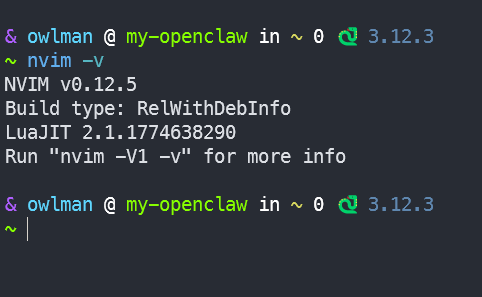
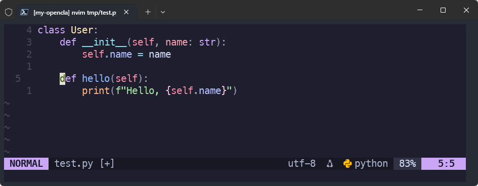
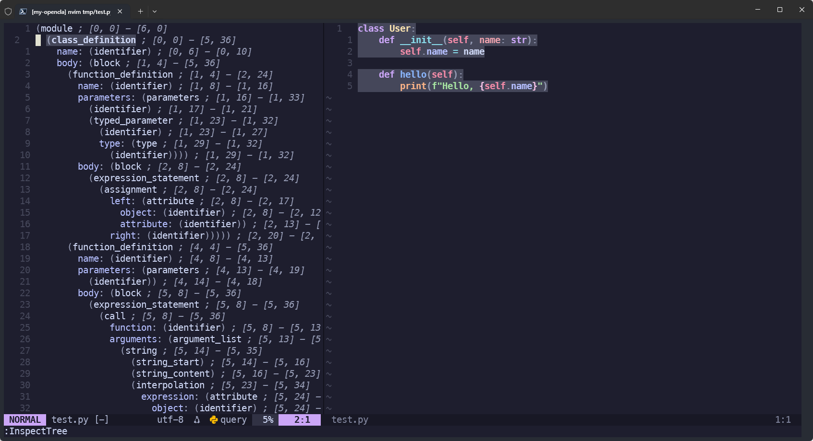
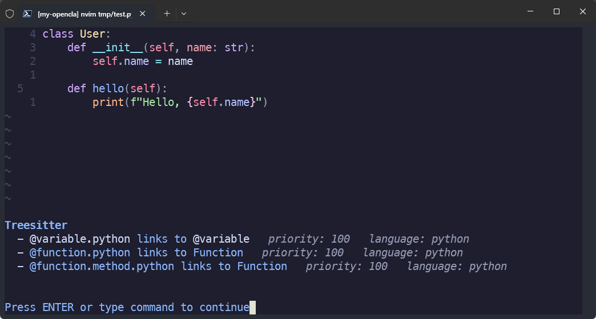
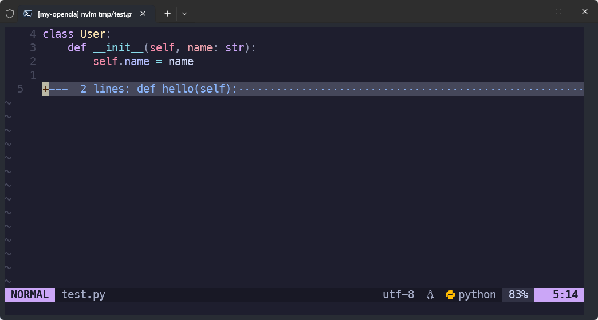
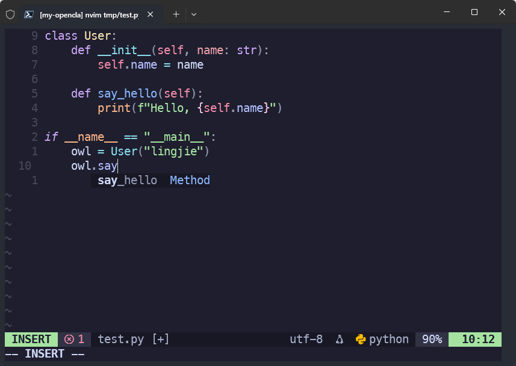
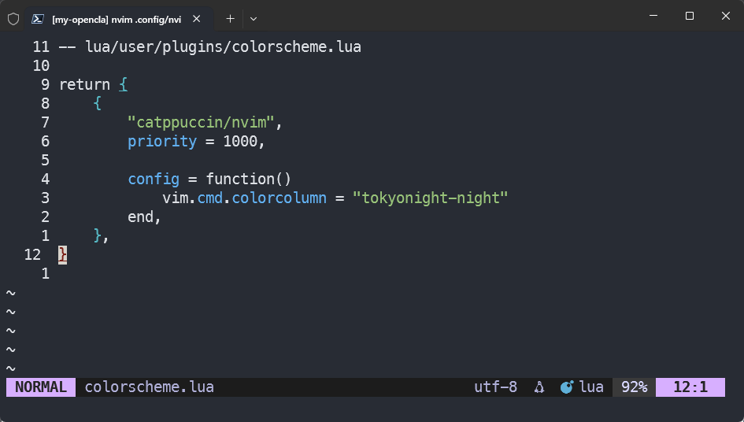
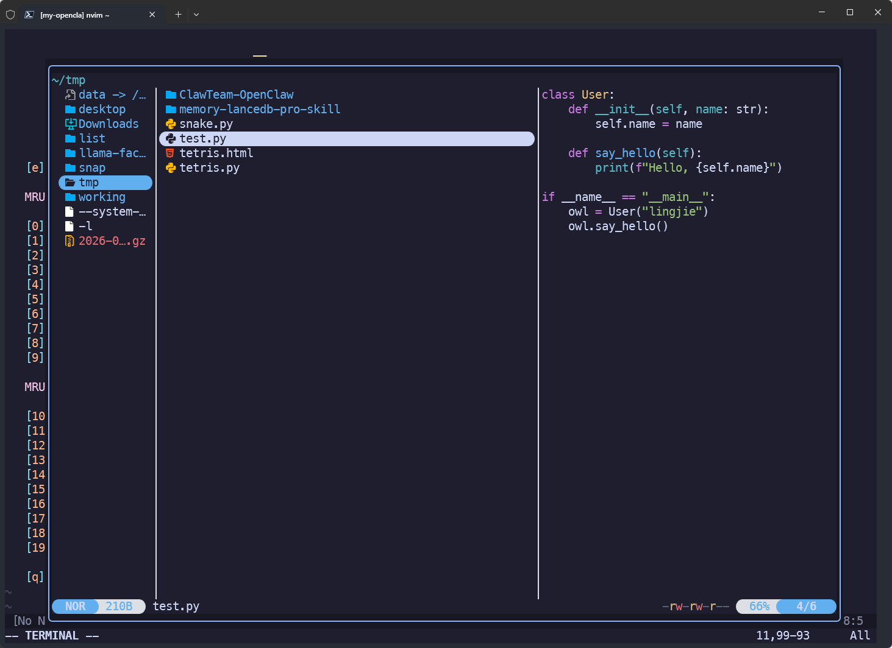
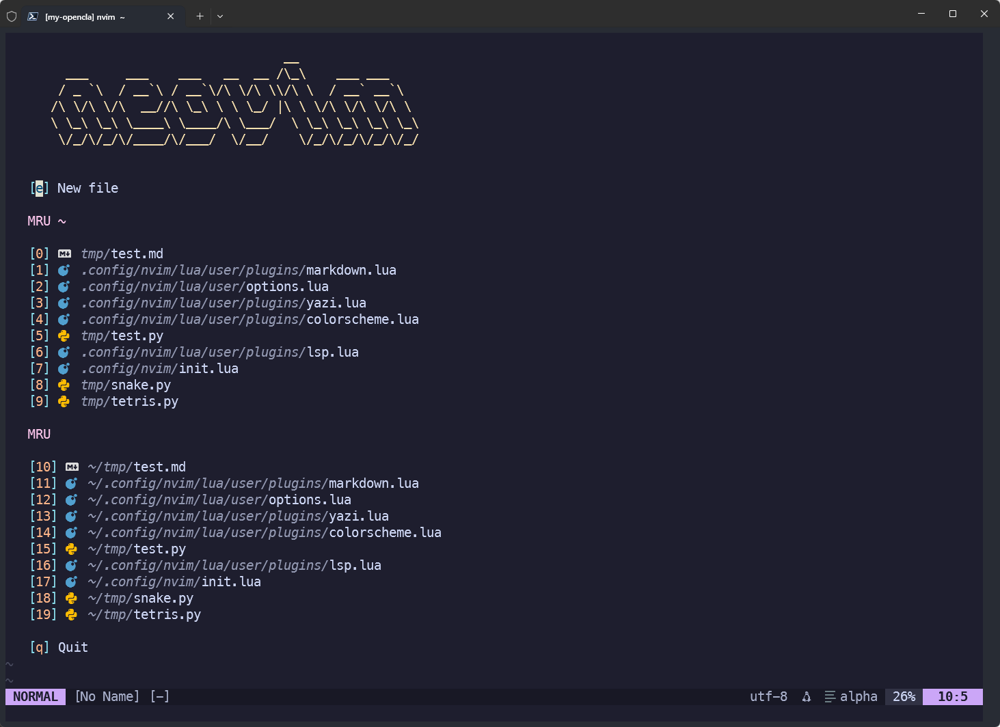

> [!NOTE] 笔记说明
>
> 这篇笔记用于记录本人在使用 Neovim 这款文本编辑器过程中的心得体会，存储于个人的[计算机专业笔记库](https://github.com/owlman/CS_Studynotes) 中并长期维护。
>
> [!IMPORTANT] 2026-05 大更新
>
> 自 2020 年首次撰写这篇笔记以来，它所涉及的工具链已经迭代了好几代，本轮修改将针对这些变化进行一次技术同步，主要内容如下：
>
> | 旧 | 新 | 主要变化 |
> | --- | --- | --- |
> | Node.js 17 | Node.js 22 LTS | Node 17 已 EOL；现以 22.x 长期支持版为基准（24.x 也已 LTS，生态以 22 为主） |
> | `registry.npm.taobao.org` | `registry.npmmirror.com` | 淘宝镜像整体迁移到 npmmirror |
> | Neovim 0.4.3 | Neovim 0.11+ | 内置 LSP / Treesitter / Lua 配置成熟 |
> | vim-plug | lazy.nvim | 主流从 vimscript 插件管理器迁移到 Lua |
> | Coc.nvim + coc-pyls | 内置 LSP + Pyright | 用 Neovim 0.11 内置 `vim.lsp.*` 替代 Coc 中间层，Pyright 替代停更的 pyls |
> | ranger + rnvimr | yazi + yazi.nvim | ranger 已基本停更，yazi 是当前社区主流 |
> | vim-airline | lualine.nvim | 纯 Lua 实现的状态栏，主题生态更现代 |

## 目录

- [1. 学习规划](#1-学习规划)
- [2. 背景知识](#2-背景知识)
  - [2.1 Neovim 起源](#21-neovim-起源)
  - [2.2 Neovim 现状](#22-neovim-现状)
- [3. 安装与配置](#3-安装与配置)
  - [3.1 基础环境准备](#31-基础环境准备)
  - [3.2 安装 Neovim](#32-安装-neovim)
  - [3.3 配置文件的目录结构](#33-配置文件的目录结构)
- [4. 插件管理：lazy.nvim](#4-插件管理lazynvim)
  - [4.1 安装 lazy.nvim](#41-安装-lazynvim)
  - [4.2 插件目录约定](#42-插件目录约定)
- [5. 常用插件推荐](#5-常用插件推荐)
  - [5.1 编辑器增强：edit](#51-编辑器增强edit)
  - [5.2 编程语言支持：LSP](#52-编程语言支持lsp)
  - [5.3 主题设置：lualine + catppuccin](#53-主题设置lualine--catppuccin)
  - [5.4 文件管理器：yazi](#54-文件管理器yazi)
  - [5.5 Markdown 预览：markdown-preview.nvim](#55-markdown-预览markdown-previewnvim)
  - [5.6 启动页：alpha-nvim](#56-启动页alpha-nvim)
- [6. 常见问题](#6-常见问题)
- [7. 附录：完整配置骨架](#7-附录完整配置骨架)

## 1. 学习规划

- 学习基础：
  - 掌握 Linux shell 命令的基本使用。
  - 掌握 Vim 编辑器的基本操作方法。
  - 有一两门编程语言的使用经验。
- 学习环境：
  - Ubuntu Linux 24.04+（其他主流发行版 / macOS / Windows 同样可行，本文以 Ubuntu 为示例）。
- 学习资料：
  - Neovim 官方网站：[neovim.io](https://neovim.io/)
  - Neovim 项目仓库：[GitHub - neovim/neovim](https://github.com/neovim/neovim)
  - Neovim 内置文档：`:help`，配合 `:help lua-guide` / `:help lsp` / `:help treesitter` 起步。

## 2. 背景知识

### 2.1 Neovim 起源

2014 年，巴西程序员 Thiago de Arruda Padilha（aka tarruda）曾经向 Vim 开源编辑器项目递交了两大补丁，其中包含了对 Vim 的架构进行大幅调整的建议，结果遭到了 Vim 作者 Bram Moolenaar 的拒绝。后者认为对于 Vim 这样一个成熟的项目进行如此大的改变风险太高。但或许在 tarruda 看来，Vim 这个上个世纪 90 年代初的产物，至今已经 20 多年了，该项目中不仅遗留了大量的历史痕迹，而且该项目的管理层如今在程序的维护、Bug 的修复、以及新特性的添加等问题上的态度都在变得越来越僵化，且难以与时俱进。

总而言之，基于对 Vim 项目的不满，并致力于打造一款面向 21 世纪的代码编辑器，tarruda 先生以众筹资金的方式发起了 Vim 的这个 fork 项目：Neovim。在这里，Neo 这个单词表达的是其作者对 Vim 编辑器在这个新时代的重生期待。

### 2.2 Neovim 现状

从 Neovim 项目的提交记录可以看出，tarruda 先生是个非常有项目维护经验的人，其有条不紊的管理让 Neovim 的版本迭代相当快速，基本上几天就会推送一个新的版本。目前来说，Neovim 已经实现 Vim 大部分功能，并兼容了 Vim 百分之九十以上的配置。

Neovim 项目逐步成为成熟项目，并率先提供了多个 8.0 之前 Vim 所没有的新特性：

- 支持在 Vim 中打开命令行终端窗口，使用户不必退出编辑器就能执行 shell 命令。
- 为 vimscript 提供异步任务支持，之前的 vimscript 只能以同步方式执行任务。
- 重构 Vim 部分代码，实现多平台兼容，并使用更现代化的代码编译工具链。

Neovim 的成功也反过来唤起了 Vim 项目组的危机意识，加快了 Vim 8.0/8.1 的迭代；Vim 现在也支持异步任务、内置终端等特性。到 2026 年前后，Neovim 已经稳定进入了 0.11 / 0.12 时代：

- **内置 LSP**：`vim.lsp.config / vim.lsp.enable`已经覆盖了 server 注册、filetype 关联、capabilities 等核心场景。换言之，我在之前版本中介绍的 Coc 这种 Node.js 中间层已不再是必需品。
- **内置 Treesitter**：高亮、缩进、跳转都走`vim.treesitter.*`，从 0.11 开始官方也提供了内建 parser 安装机制（`:checkhealth vim.treesitter`）。
- **Lua 作为一等公民**：`init.lua`与`lua/`模块成为推荐配置方式，之前版本中介绍的 vimscript 配置方式被逐步淘汰，lazy.nvim 这类 Lua 插件管理器随之成为主流。
- **稳定与 nightly 双轨发布**：每夜构建与稳定版均可通过 GitHub Releases 直接下载 AppImage，不再受发行版仓库拖累。

## 3. 安装与配置

在正式开始之前，有一件事需要先和读者做个说明：虽然这篇笔记是以 Ubuntu 24.04 为演示环境来展开的，但它在 Linux 的其他发行版 / macOS / Windows 中的安装与配置的方式基本一致，读者可自行根据官方文档对这些内容进行调整。

### 3.1 基础环境准备

- **Node.js 运行时环境**：本文使用的部分语言服务器和插件依赖 Node.js，例如 Pyright、bash-language-server、yaml-language-server、markdown-preview.nvim 等。因此，如果希望完整使用本文后续介绍的配置，建议预先安装 Node.js。需要特别的说明的是，我在这篇笔记中会以 **Node.js 22 LTS** 为基准来展开演示（22 "Jod" / 20 "Iron" / 24 "Krypton" 都是当前仍在维护期的 LTS）。如果你想用别的 LTS，把下面的 `setup_22.x` 换成对应主版本即可。

    ```bash
    # Ubuntu / Debian
    curl -fsSL https://deb.nodesource.com/setup_22.x | sudo -E bash -
    sudo apt install -y nodejs

    # 验证
    node -v   # 如果输出 v22.x.x，则说明 Node.js 安装成功
    npm -v    # 如果输出 10.x.x，则说明 Node.js 的 npm 包管理器安装成功
    ```

    在这里，我会建议国内的用户顺手把 NPM 默认仓库切到`registry.npmmirror.com`，这可以提高后续安装插件的下载速度。

    ```bash
    npm config set registry https://registry.npmmirror.com
    npm config get registry # 应输出：https://registry.npmmirror.com
    ```

- **Python、ripgrep、fd**：Pyright LSP、Treesitter 解析器以及若干 formatter 都依赖 Python 与一些 CLI 工具：

    ```bash
    sudo apt install -y python3 python3-pip python3-venv ripgrep fd-find unzip
    pip install --user pynvim
    ```

    在这里，如果读者用 venv 管理 Python 项目，记得在每个 venv 里再装一次 `pynvim` 和 `pyright`，否则 LSP 会读到全局 site-packages。

- **Git / curl**：后续装 lazy.nvim、克隆插件必备：

    ```bash
    sudo apt install -y curl git
    ```

### 3.2 安装 Neovim

在这里，我会建议读者**不要直接基于 Ubuntu 的默认仓库来执行`apt install neovim`命令**，发行版仓库里通常还停留在 0.9 甚至 0.7，缺少内置 LSP / Treesitter 关键改动。推荐以下三种方式之一：

- **AppImage**：这种方式最简单，也适用于所有的 Linux 发行版，但缺点是每次更新都需要重新下载。

    ```bash
    curl -L -o /tmp/nvim.appimage \
    https://github.com/neovim/neovim/releases/download/stable/nvim-linux-x86_64.appimage
    chmod +x /tmp/nvim.appimage
    sudo mv /tmp/nvim.appimage /usr/local/bin/nvim
    ```

    如果想跟踪 nightly：

    ```bash
    curl -L -o /tmp/nvim.appimage \
    https://github.com/neovim/neovim/releases/download/nightly/nvim-linux-x86_64.appimage
    ```

- **PPA（Ubuntu / Debian）**：这种方式适合 Ubuntu / Debian 用户，缺点是更新不及时。

    ```bash
    sudo add-apt-repository ppa:neovim-ppa/stable
    sudo apt update
    sudo apt install -y neovim
    ```

- **源码编译**：适合追求最新 commit 或自己改源码的场景，缺点是编译时间较长，且需要手动处理依赖。

    ```bash
    git clone https://github.com/neovim/neovim.git
    cd neovim && make CMAKE_BUILD_TYPE=Release
    sudo make install
    ```

    待安装完成之后，我们可以通过执行`nvim -v`命令来验证 Neovim 是否安装成功，如图 1 所示。

    

    **图 1** 验证 Neovim 是否安装成功

### 3.3 配置文件的目录结构

按照 Neovim 0.11+ 的标准做法，我们通常会把所有配置文件放进`~/.config/nvim/`目录中，而其中的 Lua 模块则通常会被放在该目录下的`lua/user/`这个子目录下，其常见目录结构如下所示。

```bash
~/.config/nvim/                 # 配置文件根目录
├── init.lua                    # 配置入口
├── lua/                        # Lua 模块
│   └── user/                   # 用户自定义模块
│       ├── lazy.lua            # lazy.nvim bootstrap + setup
│       └── plugins/            # 各插件 spec
│           ├── init.lua        # 插件配置入口
│           ├── edit.lua        # 编辑器配置
│           ├── lsp.lua         # LSP 配置
│           ├── lualine.lua     # 状态栏配置
│           ├── yazi.lua        # Yazi 文件管理器配置
│           ├── markdown.lua    # Markdown 预览配置
│           ├── alpha.lua       # 启动屏配置
│           └── colorscheme.lua # 主题配置
├── after/                      # 插件后置配置
└── spell/                      # 词典配置
```

在上述结构中，Neovim 的配置入口文件是`init.lua`，它一般只做两件事：启动 Lazy.nvim 插件管理器，并使用该管理器加载我们为 Neovim 配置的各种插件，内容如下所示：

```lua
-- ~/.config/nvim/init.lua

require("user.lazy")      -- 启动 lazy.nvim
require("user.options")   -- 配置全局选项
```

## 4. 插件管理：lazy.nvim

近年来，lazy.nvim 已经日益成为 Neovim 生态中主流的插件管理器之一。它的主要特点是允许用户通过 Lua 脚本来声明、管理和配置插件，从而使插件的安装、更新和配置更加自动化、模块化，也更便于维护。

### 4.1 安装 lazy.nvim

lazy.nvim 的安装方式非常简单。按照官方推荐的 bootstrap 安装方式，我们只需在上述`~/.config/nvim/lua/user`目录下创建一个名为`lazy.lua`的配置文件，并在其中输入如下代码（该文件用于自动安装 lazy.nvim 并将其加载到 Neovim 的`runtimepath`中，完整的配置模版可参考我在本文第 7 节中所做的介绍）：

```lua
local lazypath = vim.fn.stdpath("data") .. "/lazy/lazy.nvim"

if not (vim.uv or vim.loop).fs_stat(lazypath) then
    vim.fn.system({
        "git",
        "clone",
        "--filter=blob:none",
        "https://github.com/folke/lazy.nvim.git",
        "--branch=stable", -- 使用 stable 分支
        lazypath,
    })
end

vim.opt.rtp:prepend(lazypath)
```

在这里，`vim.fn.stdpath("data")`是 Neovim 提供的 API，用于获取 Neovim 的数据目录。在 Linux 系统中，该目录通常为`~/.local/share/nvim`，因此上述代码会将 lazy.nvim 的安装路径设置为`~/.local/share/nvim/lazy/lazy.nvim`这个目录。

然后，当我们首次启动 Neovim 时，bootstrap 代码会检查 lazy.nvim 是否已经安装。如果尚未安装，就会自动执行 `git clone`；安装完成后，再通过 `vim.opt.rtp:prepend()` 将 lazy.nvim 加入 Neovim 的 `runtimepath`。最后，我们还需要通过之前添加在`init.lua`中的`require("user.lazy")`这行代码来加载这个插件管理器的配置。

> [!TIP] 关于 GitHub 拉取慢的问题
>
> 如果想解决国内网络拉取 GitHub 不稳的的问题，可以给 git 设代理，配置命令为：`git config --global url."https://gh-proxy.com/github.com/".insteadof "https://github.com/"`

### 4.2 插件目录约定

lazy.nvim 支持将插件配置拆分到多个 Lua 文件中。通常可以按照插件或功能将配置分别组织到不同文件，并在这些文件中按照`return { ... }`的形式来配置插件。例如，下面是 Neovim 状态栏插件 lualine 所对应的配置文件，路径是`~/.config/nvim/lua/user/plugins/lualine.lua`：

```lua
-- lua/user/plugins/lualine.lua

return {
    {
        "nvim-lualine/lualine.nvim", -- 插件名
        event = "VeryLazy", -- 绑定的事件
        dependencies = { "nvim-tree/nvim-web-devicons" }, -- 依赖项

        config = function()
            require("lualine").setup({
                options = {
                    theme = "auto", -- 主题
                },
            })
        end,
    },
}```

在配置好所有的插件之后，我们就可以将这些配置文件交给`lua/user/plugins/init.lua`这个文件统一负责加载。例如下面是我目前所使用的插件，关于这些插件的具体作用和配置方式，稍后会在第 5 节中做详细介绍：

```lua
-- lua/user/plugins/init.lua
return {
    require("user.plugins.edit"),        -- 编辑器增强
    require("user.plugins.lsp"),         -- LSP 服务
    require("user.plugins.lualine"),     -- 状态栏
    require("user.plugins.yazi"),        -- 文件管理器
    require("user.plugins.markdown"),    -- Markdown 预览
    require("user.plugins.alpha"),       -- 启动屏
    require("user.plugins.colorscheme"), -- 主题
}
```

相比将所有插件配置集中在一个文件中的做法，lazy.nvim 可以将不同插件的配置拆分到独立的 Lua 文件中。这样每个插件的安装、加载和配置都可以独立管理，也更便于维护规模较大的 Neovim 配置。

## 5. 常用插件推荐

在这一节中，我将会以自己常用的七款插件为例，具体介绍一下如何基于 lazy.nvim 插件管理器来扩展 Neovim 的功能，以便让它符合自己的使用需求。

### 5.1 编辑器增强：edit

这款插件主要用于增强 Neovim 的编辑体验，功能包括语法高亮、语法解析、代码的缩进与折叠等，其具体配置与使用方式如下。

1. 在`~/.config/nvim/lua/user/plugins/`目录下创建一个名为`edit.lua`的文件，并在其中输入如下代码：

    ```lua
    -- lua/user/plugins/edit.lua

    return {

        -- Tree-sitter：语法解析、语法高亮、折叠、缩进等
        {
            "nvim-treesitter/nvim-treesitter",
            branch = "main",       -- main 是面向 Neovim 0.12+ 的新版实现
            lazy = false,          -- main 分支不支持 lazy-loading
            build = ":TSUpdate",

            config = function()
                require("nvim-treesitter").setup({
                    install_dir = vim.fn.stdpath("data") .. "/site",
                })

                -- 安装常用 parser
                require("nvim-treesitter").install({
                    "lua",
                    "python",
                    "cpp",
                    "c",
                    "json",
                    "markdown",
                    "bash",
                    "yaml",
                    "toml",
                    "vim",
                    "vimdoc",
                })

                -- 启用 Tree-sitter 功能
                vim.api.nvim_create_autocmd("FileType", {
                    pattern = {
                        "lua",
                        "python",
                        "cpp",
                        "c",
                        "json",
                        "markdown",
                        "bash",
                        "yaml",
                        "toml",
                        "vim",
                        "help",
                    },

                    callback = function()
                        -- 语法高亮
                        vim.treesitter.start()

                        -- Tree-sitter 折叠
                        vim.wo.foldexpr =
                            "v:lua.vim.treesitter.foldexpr()"
                        vim.wo.foldmethod = "expr"

                        -- Tree-sitter 缩进
                        vim.bo.indentexpr =
                            "v:lua.require'nvim-treesitter'.indentexpr()"
                    end,
                })
            end,
        },

        -- 自动补全括号 / 引号
        {
            "echasnovski/mini.pairs",
            event = "InsertEnter",

            config = function()
                require("mini.pairs").setup()
            end,
        },

        -- 模糊搜索
        {
            "nvim-telescope/telescope.nvim",
            cmd = "Telescope",

            dependencies = {
                "nvim-lua/plenary.nvim",
            },

            config = function()
                local telescope = require("telescope.builtin")

                vim.keymap.set(
                    "n",
                    "<leader>ff",
                    telescope.find_files,
                    { desc = "查找文件" }
                )

                vim.keymap.set(
                    "n",
                    "<leader>fg",
                    telescope.live_grep,
                    { desc = "全局搜索" }
                )

                vim.keymap.set(
                    "n",
                    "<leader>fb",
                    telescope.buffers,
                    { desc = "切换 buffer" }
                )
            end,
        },
    }
    ```

2. 由于我们之前已经将该插件注册到了`init.lua`这个全局配置中，如今只需在保存上述文件之后，重启 Neovim，并执行`:Lazy update`命令，即可完成插件的安装和配置。这时候，如果我们再次用 Neovim 打开一个 Python 文件，就会看到该插件的语法高亮效果了，如图 2 所示。

    

    **图 2** 语法高亮效果

3. 如果我们在打开上上述文件的状态下执行`:InspectTree`命令，还能看到该插件对 Python 文件进行了语法解析，如图 3 所示。

    

    **图 3** 语法解析效果

4. 如果我们将光标移动到上述代码的某个关键字、函数名或变量上，并执行`:Inspect`命令，就能了解到该插件对 Python 语法的具体理解，如图 4 所示。

    

    **图 4** 插件对 Python 的语法理解

5. 除语法解析方面的功能之外，我们还可以利用该插件提供的折叠功能，将代码折叠成更小的段落，以便更好地阅读和理解代码，这方面的相关命令如表 1 所示。

    | 操作                     | 命令 |
    | ------------------------ | ---- |
    | 当前折叠展开/关闭        | `za` |
    | 当前折叠关闭             | `zc` |
    | 当前折叠展开             | `zo` |
    | 当前折叠及其内部全部关闭 | `zC` |
    | 当前折叠及其内部全部展开 | `zO` |
    | 全部打开                 | `zR` |
    | 全部关闭                 | `zM` |
    | 切换是否启用折叠         | `zi` |

    **表 1** 折叠相关命令

    例如在上述代码中，如果我们在普通模式下将光标移动到`hello()`函数上，并依次在键盘上按下`z`、`c`两个键，就会看到该函数被折叠起来，如图 5 所示。

    

    **图 5** 代码的折叠效果

### 5.2 编程语言支持：LSP

这款插件主要用于提供代码补全、跳转、引用、重命名、code action 等功能，具体配置与使用方法如下：

1. 在`~/.config/nvim/lua/user/plugins/`目录下创建一个名为`lsp.lua`的文件，并在其中输入如下代码：

    ```lua
    -- lua/user/plugins/lsp.lua

    return {
        -- 自动补全
        {
            "hrsh7th/nvim-cmp",
            event = "InsertEnter",
            dependencies = {
                "hrsh7th/cmp-nvim-lsp",
                "L3MON4D3/LuaSnip",
                "saadparwaiz1/cmp_luasnip",
                "hrsh7th/cmp-path",
                "rafamadriz/friendly-snippets",
            },

            config = function()
                local cmp = require("cmp")
                local luasnip = require("luasnip")

                cmp.setup({
                    snippet = {
                        expand = function(args)
                            luasnip.lsp_expand(args.body)
                        end,
                    },

                    mapping = cmp.mapping.preset.insert({
                        ["<CR>"] = cmp.mapping.confirm({
                            select = true,
                        }),

                        ["<Tab>"] = cmp.mapping.select_next_item(),
                        ["<S-Tab>"] = cmp.mapping.select_prev_item(),
                    }),

                    sources = cmp.config.sources({
                        { name = "nvim_lsp" },
                        { name = "luasnip" },
                    }, {
                        { name = "path" },
                    }),
                })

                -- 诊断显示
                vim.diagnostic.config({
                    virtual_text = true,
                    signs = true,
                    underline = true,
                    update_in_insert = false,
                })
            end,
        },

        -- LSP server 配置
        {
            -- LSP server 配置（Neovim 0.11+ 原生 API）
            -- nvim-lspconfig 在这里仅作为"server defaults 提供者"（lsp/*.lua），不用 setup()。
            -- 详见上方"架构关系"段：vim.lsp.enable 是入口，vim.lsp.config 用于自定义 settings。
            "neovim/nvim-lspconfig",
            event = {
                "BufReadPre",
                "BufNewFile",
            },

            config = function()
                -- Quickstart：vim.lsp.enable 会自动拉 lspconfig 的 defaults（cmd/filetypes/root_dir）。
                vim.lsp.enable({
                    "pyright",
                    "clangd",
                    "lua_ls",
                    "bashls",
                    "jsonls",
                    "yamlls",
                })

                -- 自定义某个 server 的 settings（可选，合并到 defaults 上）：
                vim.lsp.config("pyright", {
                    settings = {
                        python = {
                            analysis = {
                                typeCheckingMode = "basic",
                            },
                        },
                    },
                })
            end,
        },

        -- LSP 诊断 / 操作面板
        {
            "folke/trouble.nvim",
            cmd = {
                "Trouble",
                "TroubleToggle",
            },
            dependencies = {
                "nvim-tree/nvim-web-devicons",
            },
        },
    }```

2. 同样的，在保存上述文档之后，重启 Neovim，并执行`:Lazy update`命令，即可使该插件的安装与配置生效。当然了，这里需要说明的是，**LSP server 本身不是 Vim 插件，要在系统 / 虚拟环境里装**，其相关的安装命令如下。

    ```bash
    # Pyright：Python LSP
    pip install --user pyright

    # clangd：C/C++ LSP
    sudo apt install -y clangd

    # lua-language-server：Lua LSP
    sudo apt install -y lua-language-server

    # bash-language-server：Bash LSP
    npm i -g bash-language-server

    # yaml-language-server：YAML LSP
    npm i -g yaml-language-server

    # vscode-langservers-extracted：VS Code LSP 扩展包
    npm i -g vscode-langservers-extracted
    ```

    在安装完 LSP server 之后，需要重启 Neovim，并执行`:Lazy update`命令，才能使 LSP server 生效。

    > [!WARNING] cmd 路径必须在系统 PATH 中
    >
    > 上面 `vim.lsp.config(...)` 中的 cmd 字符串（如 `"pyright-langserver"`、`"clangd"`）依赖 PATH 找得到：
    > - Windows 上 `pip install --user pyright` 默认装到 `%APPDATA%\Python\Python3x\Scripts`（不会自动加 PATH），可在 PowerShell 中 `Get-Command pyright-langserver` 验证；找不到就把上述路径手动加到用户 PATH（设置 → 系统 → 环境变量）。
    > - Linux / macOS 上 `pip install --user` 会装到 `~/.local/bin`，需确保 `~/.local/bin` 在 PATH（多数发行版默认在）。
    > - `scoop install llvm` / `scoop install lua-language-server` 等会自动把 `~/scoop/shims` 加到 PATH（见 §3）。
    > - `npm i -g ...` 默认装到 npm 全局 bin（Node 22 LTS 默认 `%APPDATA%\npm` 或 `~/.npm-global`，已在 PATH）。

3. 如果上述操作一切顺利，我们现在如果打开一个 Python 文件，并在其中输入一些代码，就看到该插件提供的代码补全功能了，如图 6 所示。

    

    **图 6** 代码补全效果

> [!NOTE] 架构关系（必读）
>
> **当前官方架构**：Neovim 0.11 起 LSP 已内置到核心。`nvim-lspconfig` 提供的是"**LSP server configurations 集合**"——每个 server 的 default 配置写在 `lsp/<server>.lua`（含 cmd / filetypes / root_dir / settings）。**`vim.lsp.config()` 会自动从 runtimepath 上的 `lsp/` 目录发现并合并这些 defaults**。
>
> **三个原语**：
>
> - `vim.lsp.enable(name)` —— 启动某个 server（用 lspconfig defaults + 你自己的 settings）
> - `vim.lsp.config(name, opts)` —— 自定义某个 server 的 settings（与 defaults **合并**，不是"取代"）
> - `require('lspconfig').<name>.setup({})` —— 旧 framework 写法，**已 deprecated**，v3.0 将移除
>
> **Quickstart**（官方 README）：
>
> ```lua
> vim.lsp.enable('pyright')
> ```
>
> 不需要 `vim.lsp.config`，因为 lspconfig 自动提供所有 defaults（cmd、filetypes、root_dir）。
>
> **自定义示例**：
>
> ```lua
> vim.lsp.config('pyright', {
>   settings = {
>     python = { analysis = { typeCheckingMode = "basic" } },
>   },
> })
> vim.lsp.enable('pyright')
> ```
>
> **Config 优先级**（从低到高）：
>
> 1. `lsp/` 在 runtimepath 上（nvim-lspconfig 等 plugin 提供）
> 2. `after/lsp/` 在 runtimepath 上（用户扩展）
> 3. `vim.lsp.config()` 调用（最高优先级）
>
> **关于 cmd**：绝大多数 lspconfig 提供 default cmd，不必显式填。只有 PATH 找不到的 server（如 `jdtls` / `elixirls`）才需要手动设：
>
> ```lua
> vim.lsp.config('jdtls', { cmd = { '/path/to/jdtls' } })
> vim.lsp.enable('jdtls')
> ```
>
> **lspconfig 状态**：
>
> - 被 deprecated 的是 `require('lspconfig')` 这个**旧 framework 层**（会打 `Feature will be removed in v3.0.0` 警告），**nvim-lspconfig 插件本身没有 deprecated**。
> - v3 的主要变化是**删除旧 framework**，**新 API 在 v2.x 上已经是当前推荐**（不是 v3 才引入）。
> - 0.12 已经移除了 `require("lspconfig.server_configurations")` 模块——别再想"手 merge default config"那条退路。
> - 版本要求：**Neovim ≥ 0.11.3**（0.10 支持即将移除）。

### 5.3 主题设置：lualine + catppuccin

该插件主要用于设置 Neovim 的状态栏外观，相较于早期的`vim-airline`插件，其主题生态更现代，配置也更简单且灵活。具体配置方法如下：

1. 在`~/.config/nvim/lua/user/plugins/`目录下创建一个名为`lualine.lua`的文件，并在其中输入如下代码：

    ```lua
    -- lua/user/plugins/lualine.lua
    
    return {
        {
            "nvim-lualine/lualine.nvim",
            event = "VeryLazy",
            dependencies = { "nvim-tree/nvim-web-devicons" },

            config = function()
                require("lualine").setup({
                    options = {
                        theme = "auto",
                    },
                })
            end,
        },
    }
    ```

    `theme = "auto"`是默认值，效果是沿用我们当前使用用的主题。其具体效果，读者其实在之前的截图中已经看到了，这里就不重复再单独展示了。

2. 如果我们对 Neovim 当前的外观不满意，那就需要再安装一个名为`catppuccin`的插件，该插件提供了多种主题，包括我们之前提到的`mocha`主题。具体做法是继续在`~/.config/nvim/lua/user/plugins/`目录下创建一个名为`catppuccin.lua`的文件，并在其中输入如下代码：

    ```lua
    -- lua/user/plugins/colorscheme.lua

    return {
        {
            "catppuccin/nvim",
            priority = 1000,

            config = function()
                vim.cmd.colorscheme("catppuccin-mocha")
            end,
        },
    }
    ```

    在这里，我们可以通过`vim.cmd.colorscheme()`这个 API 来设置 Neovim 的主题。Neovim 社区中常见的主题插件如表 2 所示。

    | 主题            | 风格                       | 配置值             |
    | --------------- | -------------------------- | ------------------ |
    | **Catppuccin**  | 柔和、现代、色彩丰富       | `catppuccin-mocha` |
    | **Tokyo Night** | 深色、蓝紫、现代 IDE 感    | `tokyonight-night` |
    | **Gruvbox**     | 暖色、复古、经典 Vim 风格  | `gruvbox`          |
    | **Kanagawa**    | 日式水墨、低饱和           | `kanagawa-wave`    |
    | **Rose Pine**   | 深色、低饱和、简洁         | `rose-pine`        |
    | **Everforest**  | 绿色、柔和、长时间阅读     | `everforest`       |
    | **Nord**        | 冷色、蓝灰、克制           | `nord`             |
    | **Dracula**     | 紫色系、高对比             | `dracula`          |
    | **Solarized**   | 经典、低对比度             | `solarized`        |
    | **OneDark**     | 类 VS Code / Atom 风格     | `onedark`          |

    **表 2** Neovim 社区中常见的主题插件

    例如，我们将主题设置为`tokyonight-night`的话，重启 Neovim 后的效果如图 7 所示（同样的，前提是之前在`init.lua`文件中已经注册好了上面这两款插件）。

    

    **图 7** `tokyonight-night`主题效果

    > [!NOTE] 我在这里保留了基于`vim-snazzy`设置的旧图，以便对比主题切换前后的视觉变化。
    >
    > 

### 5.4 文件管理器：yazi

该插件主要用于在 Neovim 中集成文件管理器，其效果类似于`ranger`，但比`ranger`更现代。具体配置方法如下：

1. 根据自己所在的操作系统安装`yazi`二进制，具体命令如下：

    ```bash
    # 使用 Cargo 安装
    cargo install --locked yazi-fm yazi-cli
    # 或用 APT 包管理器
    sudo apt install -y yazi
    # Windows / Scoop 实测走 release zip 最稳（extras bucket 国内网络容易 broken）：
    scoop install yazi
    ```

2. 在`~/.config/nvim/lua/user/plugins/`目录下创建一个名为`yazi.lua`的文件，并在其中输入如下代码：

    ```lua
    -- lua/user/plugins/yazi.lua

    return {
        {
            "mikavilpas/yazi.nvim",
            version = "*",
            event = "VeryLazy",

            -- 没有安装 Yazi 二进制时不加载插件
            enabled = function()
                return vim.fn.executable("yazi") == 1
            end,

            dependencies = {
                { "nvim-lua/plenary.nvim", lazy = true },
            },

            keys = {
                {
                    "<leader>e",
                    "<cmd>Yazi<cr>",
                    desc = "打开 Yazi",
                },
                {
                    "<leader>E",
                    "<cmd>Yazi cwd<cr>",
                    desc = "打开工作目录",
                },
                {
                    "<c-up>",
                    "<cmd>Yazi toggle<cr>",
                    desc = "恢复 Yazi",
                },
            },

            opts = {
                open_for_directories = true,

                keymaps = {
                    show_help = "<f1>",
                },
            },

            init = function()
                -- 禁用 netrw，让 Yazi 接管目录浏览
                vim.g.loaded_netrwPlugin = 1
            end,
        },
    }
    ```

3. 同样的，考虑到我们之前已经在`init.lua`文件中注册好了`yazi.nvim`插件，所以这里只需要在保存上述文件后重启 Neovim，并执行`:Yazi`命令即可打开文件管理器，效果如图 8 所示。

    

    **图 8** Yazi 文件管理器效果

    > [!NOTE] 我在这里保留了基于`ranger`设置的旧图，以便对比 yazi 与 ranger 的视觉差异。
    >
    > 

### 5.5 Markdown 预览：markdown-preview.nvim

插件`iamcco/markdown-preview.nvim`在 Vim/Neovim 社区里仍是事实标准，迁移到 lazy 之后的配置方式无太大变化，具体步骤如下。

1. 在`~/.config/nvim/lua/user/plugins/`目录下创建一个名为`markdown.lua`的文件，并在其中输入如下代码：

    ```lua
    -- lua/user/plugins/markdown.lua

    return {
        {
            "iamcco/markdown-preview.nvim",

            cmd = {
                "MarkdownPreview",
                "MarkdownPreviewStop",
                "MarkdownPreviewToggle",
            },

            ft = "markdown",

            build = function()
                vim.fn["mkdp#util#install"]()
            end,
        },
    }
    ```

2. 同样的，考虑到我们之前已经在`init.lua`文件中注册好了`markdown-preview.nvim`插件，所以这里只需要在保存上述文件后重启 Neovim，然后通过执行如下命令即可使用该插件了 。

    ```vim
    :MarkdownPreview       " 打开预览
    :MarkdownPreviewStop   " 关闭预览
    :MarkdownPreviewToggle " 切换预览
    ```

> [!WARNING] 维护停滞风险
>
> `iamcco/markdown-preview.nvim` 自 2024-07 之后未再发布新版本（撰写时已 2 年），目前仍可正常使用但已缺乏新功能与适配。如果你不想开浏览器、想在 Neovim buffer 里直接渲染 Markdown（带加粗、斜体、代码块等格式高亮），可以用 `MeanderingProgrammer/render-markdown.nvim`（与 markdown-preview 是不同范式，二选一即可）；否则继续用 iamcco 的版本问题不大。

### 5.6 启动页：alpha-nvim

该插件主要用于在 Neovim 启动时显示一个启动页，类似于 VS Code 的欢迎页。具体配置方法如下：

1. 在`~/.config/nvim/lua/user/plugins/`目录下创建一个名为`alpha.lua`的文件，并在其中输入如下代码：

    ```lua
    -- lua/user/plugins/alpha.lua

    return {
        {
            "goolord/alpha-nvim",
            event = "VimEnter",
            config = function()
                require("alpha").setup(require("alpha.themes.startify").config)
            end,
        },
    }
    ```

2. 同样的，考虑到我们之前已经在`init.lua`文件中注册好了`alpha-nvim`插件，所以这里只需要在保存上述文件后重启 Neovim，即可看到启动页，效果如图 9 所示。

    

    **图 9** alpha-nvim 启动页效果

    > [!NOTE] 我在这里保留了基于`startify`设置的旧图，以便对比 alpha-nvim 与 startify 的视觉差异。
    >
    > 

## 6. 常见问题

### Q1. `:LspInfo` 显示 `No client` / 跳不到定义

大概率是 LSP server 没装到 PATH 里。先 `which pyright`、`which clangd` 确认；没装就按 §5.2 装。

> [!NOTE] Python 项目中"pyright / 虚拟环境 / site-packages"的层次
>
> 这三者不是一个层面，混淆会导致排查方向跑偏：
>
> ```text
> pyright executable         ← 你在命令行 `which pyright` 看到的那个
>       ↓ 调用
> Pyright language server    ← Pyright 本身的 Python 实现，启动后是 stdio 进程
>       ↓ 用某个 Python interpreter
> Python interpreter         ← Pyright 内部跑用的 Python（与项目虚拟环境未必相关）
>       ↓ 解析 import
> site-packages              ← 来自 interpreter，可能装在虚拟环境也可能装在全局
> ```
>
> 因此：
>
> - "全局 pyright" 并不必然"读全局 site-packages"——Pyright 自己用 embedded Python
> - 如果诊断结果与项目实际环境不一致，应检查 **Pyright 的 Python interpreter / environment 配置**（`pyrightconfig.json` 的 `venv` / `pythonPath`），而不是依赖 `which pyright` 的位置
>
> 真正决定 Python 环境的是 Pyright 使用的 interpreter，而不是 `pyright` 命令装在哪里。

### Q2. `:checkhealth` 报 Python provider 缺失

```bash
pip install --user pynvim
# 如果用 venv，必须在 venv 里再装一次
.venv/bin/pip install pynvim
```

### Q3. lazy.nvim 安装时报 `failed to clone`

国内网络环境拉 GitHub 不稳。两种解决：

- 临时给 git 设代理：`git config --global http.proxy http://127.0.0.1:7890`
- 把 lazy 的 git 源改成 ghproxy（见 §4.1）。

### Q4. LSP 启动太慢

- 把 LSP 的触发时机从 `BufReadPre` 收紧到具体文件类型：

  ```lua
  { "neovim/nvim-lspconfig", ft = { "python", "cpp", "lua" } }
  ```

- 或直接用 Neovim 0.11 的 `vim.lsp.enable({ "pyright", "clangd" })` 配合 `lazy = false` 的 server 配置，跳过 nvim-lspconfig。
- 检查 server 是否活着用 **`:lsp info`**（0.12+）/ `:LspInfo`（0.11）。

### Q5. yazi 启动报 `command not found: yazi`

先确认是否真没装：

```bash
which yazi    # Linux/macOS
where yazi    # Windows (PowerShell)
```

按平台装：

```bash
# macOS
brew install yazi

# Ubuntu 24.04+
sudo apt install -y yazi

# Arch
sudo pacman -S yazi

# 从源码（Rust 工具链）
cargo install --locked yazi-fm yazi-cli
```

**Windows / Scoop**（一条命令即可，无需 extras）：

```powershell
scoop install yazi    # yazi 在 main bucket 里！实测 16 MB，秒级完成
```

> [!IMPORTANT] 不要想当然去加 extras bucket
>
> `yazi` 一直就在 **main** bucket（`scoop search yazi` → `yazi 26.9.1 main`），不需要 `scoop bucket add extras`。这里记下我踩过的坑：
>
> - 我一开始以为 yazi 在 extras，跑了 `scoop bucket add extras`，国内网络 clone 中断 → extras bucket 卡在 broken 状态（`Manifests = 0`）
> - 于是改成手动从 GitHub release 下载 zip + 把**真实 exe**（33 MB）直接拷到 `~/scoop/shims/`
> - 结果 yazi 能用，但 scoop 记不住它（`install.json` 缺失）→ `scoop status` 一直报 `yazi  Install failed`
> - 而且那个 33 MB 的 exe 不是 scoop shim（正常 shim 只有 136 KB），以后 scoop 升级/卸载都会乱
>
> 正规做法就是 `scoop install yazi`。**只有当某个包确实只在 extras 里时**才需要加 extras bucket；那时若 clone 卡住，参考 Q15 的 bucket 修复方法。

若确实需要从 GitHub release 手装（如包不在任何 bucket 里），流程是：下载 zip → 解压到 `~/scoop/apps/<app>/<version>/` → 建 `current` junction → **用 `scoop shim` 或手动写 `.shim` 文件**（别直接拷 exe）。

> [!NOTE] yazi.nvim 首次 clone 比较慢
>
> `mikavilpas/yazi.nvim` 仓库自带子模块 `yazi-plugin/yazi-plugins`（约 1752 个对象），国内网络下 `git clone --recursive` 阶段可能要 20-30s，耐心等。后续 `:Lazy sync` 是 incremental 增量更新会快很多。

### Q6. markdown 预览空白 / 中文乱码

`iamcco/markdown-preview.nvim` 需要 Node.js 18+，且国内网络下要装 markdown-it 等 npm 依赖：

```bash
npm config set registry https://registry.npmmirror.com
:checkhealth markdown-preview
```

### Q7. Neovim 如何升级到 0.11/0.12+

不要用系统包管理器升级——会卡在发行版仓库的老版本。推荐下载 AppImage 替换 `/usr/local/bin/nvim`，或者直接用社区脚本：

```bash
curl -sL https://raw.githubusercontent.com/neovim/neovim-releases/latest/run.sh | bash
```

### Q8. `:Lazy` 提示某插件加载报错

最常见的是 `dependencies` 写错或 spec 写法不兼容当前 lazy 版本。先 `:Lazy update` 一次；如果还报错，删 `~/.local/share/nvim/lazy/<plugin>` 重装：

```bash
:Lazy clean   # 清掉不用的插件
:Lazy sync    # 重装 + 更新
```

### Q9. `lazy.nvim` clone 报 `Repository not found: .../nvim-web-devicon.git`

仓库 `nvim-tree/nvim-web-devicon`（单数）已删除 / 重命名为 `nvim-tree/nvim-web-devicons`（复数）。把所有依赖里的旧名换成新名：

```diff
- dependencies = { "nvim-tree/nvim-web-devicon" }
+ dependencies = { "nvim-tree/nvim-web-devicons" }
```

同样的坑在 `yazi-org/yazi.nvim` 上也踩过——那个仓库**根本不存在**，`mikavilpas/yazi.nvim` 的真正依赖只有 `nvim-lua/plenary.nvim`。

### Q10. `require('nvim-treesitter.configs') not found`

装了 Neovim 0.12+ 才会遇到。`nvim-treesitter` 的 `master` 分支已经被冻结只做向后兼容，**不支持 0.12**；所有新功能在 `main` 分支，且 main 是**重大不兼容重写**：

```diff
  {
    "nvim-treesitter/nvim-treesitter",
+   branch = "main",
+   lazy = false,  -- main 分支明确说"This plugin does not support lazy-loading"
    build = ":TSUpdate",
-   event = { "BufReadPost", "BufNewFile" },
    config = function()
-     require("nvim-treesitter.configs").setup({ ... })
+     require("nvim-treesitter").setup({
+       install_dir = vim.fn.stdpath("data") .. "/site",
+     })
+     pcall(function()
+       require("nvim-treesitter").install({ "lua", "python", "json", ... })
+     end)
    end,
  }
```

另外 main 分支要求 `tree-sitter-cli` 0.26.1+，**且不能通过 npm 装**（npm 上确实有 `tree-sitter` 这个包，但只是 Node.js bindings，不是 CLI；`@tree-sitter/cli`、`@tree-sitter/install`、`@anthropic-ai/tree-sitter-cli` 等都 404 不存在）：

```bash
# macOS
brew install tree-sitter
# Ubuntu（scoop / cargo 也行）
cargo install tree-sitter-cli --locked
```

Windows 上 Scoop main bucket 有 `tree-sitter`：

```powershell
scoop install tree-sitter
```

### Q11. `options.lua:35: '=' expected near 'plugin'`

`filetype plugin indent on` 是 vimscript 命令，不能直接写在 `.lua` 文件里。要么用 `vim.cmd(...)` 包装，要么换成 Lua 等价写法：

```lua
-- 错误：vimscript 命令混进 Lua 文件
filetype plugin indent on

-- 正确做法 1
vim.cmd("filetype plugin indent on")

-- 正确做法 2（更显式）
vim.cmd([[
  filetype plugin indent on
]])
```

### Q12. `module 'cmp' not found` / `cmp_luasnip` after/plugin 失败

`hrsh7th/cmp-nvim-lsp`、`saadparwaiz1/cmp_luasnip`、`hrsh7th/cmp-path` 这类 cmp-* 的 `after/plugin/*.lua` 会在 lazy 加载它们时**第一时间** `require("cmp")`，但 `nvim-cmp` 本身没在 dependencies 顶层。

修法是把 `nvim-cmp` 拆成独立 spec，cmp-* 全列在它的 dependencies 里（参见 §5.2 改写后的代码）：

```lua
{
  "hrsh7th/nvim-cmp",  -- 先
  event = "InsertEnter",
  dependencies = {
    "hrsh7th/cmp-nvim-lsp", "L3MON4D3/LuaSnip",
    "saadparwaiz1/cmp_luasnip", "hrsh7th/cmp-path",
    "rafamadriz/friendly-snippets",
  },
  config = function() require("cmp").setup({ ... }) end,
},
```

### Q13. `:LspInfo` 报 `jsonls: spawn: not found`

`vscode-langservers-extracted` 这个 npm 包实际可执行文件是单数 `vscode-json-language-server.cmd`，但 `nvim-lspconfig` 内置的 jsonls 默认 cmd 写的是复数 `vscode-json-languageserver`（已过时）。在 spec 里显式覆盖 cmd：

```lua
lspconfig.jsonls.setup({
  cmd = { "vscode-json-language-server", "--stdio" },
})
```

同理 `vscode-html-language-server` / `vscode-css-language-server` / `vscode-eslint-language-server` 都是单数。

### Q13b. 自定义 LSP 配置 vs 使用 nvim-lspconfig 内置 defaults

`vim.lsp.config()` 本身支持**配置合并**——如果安装了 nvim-lspconfig（plugin 本体没 deprecated），server 对应的 default 配置（cmd / filetypes / root_dir）会从其 `lsp/<server>.lua` 自动发现并合并。

所以对于普通 server，**直接 `vim.lsp.enable` 即可**：

```lua
vim.lsp.enable("pyright")
```

如果你自己定义了一个**不存在**于 nvim-lspconfig `lsp/` 目录的 server config，例如：

```lua
vim.lsp.config("myserver", {})
```

那当然必须显式提供 `cmd` 等必要字段（0.12 严格校验 `cmd` 不能为空）——因为 nvim-lspconfig 没有给你这个 server 的 default。

**排错命令**：

```vim
:checkhealth vim.lsp
```

```lua
vim.print(vim.lsp.config["pyright"])   -- 看 nvim-lspconfig 给 pyright 合并的最终 config
```

> [!NOTE] 从旧写法迁移
>
> 旧写法 `require("lspconfig").<name>.setup({})` 是 nvim-lspconfig v2.x 的"framework 入口"——它内部就是把 default config 合并到 `vim.lsp.config()`，然后 `vim.lsp.enable()`。v2.x 仍可用，但**v3.0 会删除整个 framework 层**：
>
> ```lua
> -- 旧写法（v2.x 兼容入口，v3.0 后将被移除）
> require("lspconfig").pyright.setup({})
> ```
>
> **v3 的主要变化是删除旧 framework，新 API 在 v2.x 上已经是当前推荐**（不是 v3 才引入）。
>
> - 被 deprecated 的是 `require('lspconfig')` 这个**旧 framework 层**（会打印 `Feature will be removed in v3.0.0` 警告），**nvim-lspconfig 插件本身没有 deprecated**
> - 0.12 已经移除了 `require("lspconfig.server_configurations")` 模块——别再想"手 merge default config"那条退路
> - 版本要求：**Neovim ≥ 0.11.3**（0.10 支持即将移除）

### Q14. `mkdp#util#install` 不存在 / `Vim:E117`

**官方推荐的 lazy.nvim 配置**（来自 `iamcco/markdown-preview.nvim` README）：

```lua
{
    "iamcco/markdown-preview.nvim",
    cmd = { "MarkdownPreviewToggle", "MarkdownPreview", "MarkdownPreviewStop" },
    ft = { "markdown" },
    build = function() vim.fn["mkdp#util#install"]() end,
}
```

这个写法在大多数环境下能直接跑通——不要无脑套下面的 workaround。

**但在我的实测环境（Windows + Scoop + PowerShell 5.1 + lazy.nvim）下遇到 E117**：

```bash
[markdown-preview.nvim] build  | Running task build
[markdown-preview.nvim] build  | Vim:E117: Unknown function: mkdp#util#install
Error in .../lua/user/plugins/markdown.lua:
  Failed to run `config` for markdown-preview.nvim
```

可能原因：`lazy.nvim` 的 `build = function()` 会在 plugin clone 完成、`runtimepath` 还没 prepend 的阶段执行，导致 `vim.fn["mkdp#util#install"]` 找不到。这是 lazy.nvim 在某些时序下的行为（与 `markdown-preview.nvim` 本身无关）。

**实测 workaround**：用 `init` + `vim.schedule` 把 install 推迟到 main loop 下一个 tick，那时 `runtimepath` 已经 setup：

```lua
{
  "iamcco/markdown-preview.nvim",
  cmd = { "MarkdownPreview", "MarkdownPreviewStop" },
  ft = "markdown",
- build = function() vim.fn["mkdp#util#install"]() end,
+ init = function()
+   vim.schedule(function() pcall(vim.fn["mkdp#util#install"]) end)
+ end,
}
```

> [!WARNING] Workaround 适用范围有限
>
> 这个 workaround 是针对**我当前环境**的——lazy.nvim 的 `build` 时序 + markdown-preview.nvim 的 install 时机。如果官方写法在你那里能直接跑通，**优先用官方写法**。不要把这段 diff 当成"lazy.nvim 通用方案"。

### Q15. Windows / Scoop 上跑本笔记配置要做的额外步骤

| 笔记里的命令 | Windows / Scoop 等价 |
| --- | --- |
| `sudo apt install -y ripgrep fd-find unzip` | `scoop install ripgrep fd unzip` |
| `pip install --user pyright` | `pip install pyright`（全局 venv 用） |
| `npm i -g bash-language-server yaml-language-server vscode-langservers-extracted` | 同左（scoop nvm 下的 npm） |
| `sudo apt install -y clangd` | `scoop install llvm`（自带 clangd） |
| `lua-language-server` 没有 npm 包 | `scoop install lua-language-server`（main bucket 里有 v3.19+） |
| `cargo install --locked yazi-fm yazi-cli` | `scoop bucket add extras && scoop install yazi` |
| `~/.config/nvim/` 路径 | `%LOCALAPPDATA%\nvim\`（即 `C:\Users\<u>\AppData\Local\nvim`），**不用建 `~/.config/nvim` 软链** |

> 笔记里 §5 的 spec 文件**跨平台通用**，仅上述几条命令需要换写法；配置文件结构（`init.lua` / `lua/user/*.lua`）在 Windows 上由 Neovim 的 `stdpath('config')` 自动解析到 `%LOCALAPPDATA%\nvim\`，所以你只要把文件放对地方即可。

#### 升 Neovim 时踩到的坑：`scoop update` 报 hash 校验失败

Windows 上把 Neovim 从 0.12.4 升到 0.12.5 时，`scoop update neovim` 报：

```bash
Checking hash of nvim-win64.zip ... ERROR Hash check failed!
Expected:    de8625ba8cf65ebf40eb80a388ba1ec8e9c15b30218821e2c639119b05920de1
Actual:
Get-FileHash : 无法将"Get-FileHash"项识别为 cmdlet
  + CategoryInfo : ObjectNotFound: (Get-FileHash:String) []
```

**看着像网络/镜像问题，实际是 `Get-FileHash` 这个 cmdlet 不见了**，scoop 算不出实际 hash，校验必然失败。

根因：**PowerShell 5.1 从 PowerShell 7 的模块目录加载了 `Microsoft.PowerShell.Utility 7.0.0.0`**。PS7 版模块在 PS 5.1（Desktop 版）下不导出 `Get-FileHash`，于是命令凭空消失。触发条件是 `PSModulePath` 里 **PS7 路径排在 Windows PowerShell 原生目录之前**：

> [!NOTE] 这是会话级污染，不是系统设置
>
> 注意：系统级 `PSModulePath` 环境变量本身干净（`[Environment]::GetEnvironmentVariable('PSModulePath','Machine')` 返回的是正确的 `C:\Program Files\WindowsPowerShell\Modules;C:\Windows\system32\WindowsPowerShell\v1.0\Modules`）。污染来自**当前 shell 进程**——某些从 PS7 派生的 bash / pwsh 工具会在 `PSModulePath` 里追加 PS7 路径，**用户在本地直接打开 PowerShell 跑 scoop 完全没问题**。所以这条只影响从某些执行环境（如集成 bash 工具）调用 PS 5.1 跑 scoop 的场景。

```powershell
# 有害顺序（PS7 在前）
D:\Working\PowerShell\Modules;C:\Program Files\PowerShell\Modules;c:\program files\powershell\7\Modules;C:\Program Files\WindowsPowerShell\Modules;C:\Windows\system32\WindowsPowerShell\v1.0\Modules

# 系统级环境变量本身是干净的，是某些 shell（如已加载 PS7 路径的会话）注入的
[Environment]::GetEnvironmentVariable('PSModulePath','Machine')
# → C:\Program Files\WindowsPowerShell\Modules;C:\Windows\system32\WindowsPowerShell\v1.0\Modules
```

验证与修法：

```powershell
# 1. 确认症状
Get-Command Get-FileHash              # MISSING
Get-Module Microsoft.PowerShell.Utility | Select Name, Version
# → 7.0.0.0（C:\Program Files\PowerShell\7\...)  ← 被 PS7 版覆盖

# 2. 修法 A（推荐）：直接用 pwsh（PS7）跑 scoop，版本天然匹配
pwsh -NoProfile -Command "scoop update neovim"

# 3. 修法 B：在当前 PS 5.1 会话里强制导入 5.1 原版模块
Import-Module Microsoft.PowerShell.Utility -RequiredVersion 3.1.0.0 -Force
Get-Command Get-FileHash              # 现已可见
scoop update neovim
```

> 另外：scoop 下载中断时会在 `~/scoop/cache/` 留一个 `neovim#0.12.5#.zip.download` 不完整文件（hash 段为空）。重跑前删掉它；若已经下载完整了，可以手动放到 `~/scoop/cache/neovim#<version>#<hash前7位>.zip`（hash 取 manifest 里的值）让 scoop 直接命中缓存。

#### 进阶：bucket clone 中断导致 broken，如何就地修复

`scoop bucket add extras` 被中断后，`scoop bucket list` 报：

```bash
fatal: your current branch appears to be broken

Name   Source                                     Manifests
extras https://github.com/ScoopInstaller/Extras             0
```

**诊断**（关键：看 `bucket/` 目录和 `refs` 是否还在）：

```powershell
$d = "$env:USERPROFILE\scoop\buckets\extras"
git -C $d rev-parse HEAD          # → fatal: ambiguous argument 'HEAD'
git -C $d branch -a               # → failed to resolve HEAD
ls "$d\bucket"                    # → 目录不存在（checkout 从未完成）
ls "$d\.git\refs\remotes\origin"  # → master 还在！
ls "$d\.git\objects\pack"         # → pack 文件在 + 残留 tmp_pack_xxx
```

**关键判断**：只要 `refs/remotes/origin/master` 和 `objects/pack/*.pack` 还在，**数据其实已经下载了**，只是 checkout 阶段被打断、HEAD 没写成功 → **可以就地恢复，不用重下来**：

```powershell
$d = "$env:USERPROFILE\scoop\buckets\extras"

# 1. 清掉中断残留的临时 pack
Remove-Item "$d\.git\objects\pack\tmp_pack_*" -Force

# 2. 从远程引用恢复本地分支（一条命令搞定）
git -C $d checkout -f master
# → Switched to a new branch 'master'
# → branch 'master' set up to track 'origin/master'

# 3. 验证：本地 HEAD 应等于远程 master
$local  = (git -C $d rev-parse HEAD).Trim()
$remote = (git -C $d ls-remote https://github.com/ScoopInstaller/Extras.git master) -split '\s+' | Select-Object -First 1
if ($local -eq $remote) { Write-Host 'OK: 恢复完整，数据一致' }
```

恢复后 `scoop bucket list` 会正常显示 manifest 数（Extras 当前是 2383 个）。

> 如果 `refs/remotes/origin/master` 也丢了（极端情况），就只能 `scoop bucket rm <name>` 后重新 add。重新 add 时若又卡，可先手动 `git clone --depth=1 https://github.com/ScoopInstaller/Extras.git ~/scoop/buckets/extras`（浅克隆快很多），scoop 会自动识别这个目录。

### Q16. `nvim --headless` 验证时 LSP clients 一直为 0，但 GUI 终端 nvim 里能正常 attach

这是 `headless` 模式的特性，不是配置错。`nvim --headless -u <script> <file>` 启动时：

- buffer 1 在命令行参数处理时**已经创建**但没 `loaded`（`vim.api.nvim_buf_is_loaded(1) == false`）
- filetype 自动检测需要 BufReadPost 真正触发，但 buffer 没 loaded → 没触发 → ft 留空 → LSP 不 attach

正确做法是在脚本里**用 `:e` 命令显式打开文件**，模拟用户交互：

```lua
-- 错的:命令行参数打开,headless 下 buffer 不 loaded
-- nvim --headless -u full-check.lua test.py

-- 对的:在脚本里 schedule 后 :e 打开
require("user.lazy")
vim.schedule(function()
  vim.cmd("e test.py")  -- 手动触发 BufReadPre → filetype → LSP attach
  vim.wait(5000, function() return #vim.lsp.get_clients() > 0 end)
  print("clients:", #vim.lsp.get_clients())
end)
vim.wait(10000, function() return false end)
```

> 真实 GUI/终端 nvim 里没有这个问题：用户 `:e file` 或 vim 启动时 UI 已经 ready，buffer 正常 loaded 并跑 filetype 检测。本节专门给做 headless 自动化测试的人看。

### Q17. nvim 启动日志被 lspconfig deprecation warning + LSP stderr 误报刷屏

每次打开 .py / .c 等文件，stderr / lsp.log 都会看到两类"看着像报错"的输出，**但都不是真错误**。

#### 问题 1：lspconfig 0.12 deprecation warning + stack traceback

```bash
The `require('lspconfig')` "framework" is deprecated, use vim.lsp.config (see :help lspconfig-nvim-0.11) instead.
Feature will be removed in nvim-lspconfig v3.0.0
stack traceback:
  .../nvim-lspconfig/lua/lspconfig.lua:81: in function '__index'
  .../lua/user/plugins/lsp.lua:49: in function 'config'
  ...
```

来源是 `lspconfig.<name>.setup({})` 访问 metatable `__index` 触发的 deprecation 提示，**功能仍正常**（LSP 仍会 attach）。

#### 问题 2：`~/.local/share/nvim-data/lsp.log` 把所有 LSP server stderr 标 `[ERROR]`

```bash
[ERROR] "rpc" "...\clangd.exe" "stderr" "I[11:55:07.341] clangd version 22.1.8 ..."
[ERROR] "rpc" "...\clangd.exe" "stderr" "I[11:55:07.350] Starting LSP over stdin/stdout"
[ERROR] "rpc" "...\clangd.exe" "stderr" "I[11:55:07.681] Built preamble ..."
```

但这些内容**全是 clangd 的 INFO 日志**（"Initialized" / "Built preamble" / "Indexed c17 standard library" 等），LSP stdio 协议把它们发到 stderr 只是约定，不代表真错误。原因：nvim 0.12 在 `vim/lsp/_transport.lua:36` 把 LSP server stderr **强制以 ERROR 级别写日志**，绕过了 `vim.lsp.log.set_level()`。

#### 终极修法（写到 `lua/user/plugins/lsp.lua` 顶部）

```lua
-- 静音 lspconfig 0.12 deprecation warning
vim.deprecate = function() end

-- 过滤 LSP server stderr 的 [I/D/T/W] 误报（保留 [E/F] 真错误）
do
  local orig_log_error = vim.lsp.log.error
  vim.lsp.log.error = function(...)
    local args = { ... }
    -- _transport.lua:36 调 log.error('rpc', cmd[1], 'stderr', chunk)
    if args[1] == 'rpc' and args[3] == 'stderr' and type(args[4]) == 'string' then
      local level = args[4]:match('^%[([%a])%]')
      -- I/D/T/W 静默；E/F 才放行
      if level ~= 'E' and level ~= 'F' then
        return
      end
    end
    return orig_log_error(...)
  end
end
```

修后实测（打开 `test.c`，清空 lsp.log 重新跑）：

- **stderr**：仅 `LSP clients attached: { "clangd" }`，无 deprecation warning，无 stack trace
- **lsp.log**：只留 `[START] LSP logging initiated` 一行
- **LSP**：clangd 仍 attach、semanticTokens、publishDiagnostics 全流程 status 0 完成

> 长期：等 nvim-lspconfig v3 出来后改用纯 `vim.lsp.config / vim.lsp.enable` 路径，**绕过 lspconfig 框架**。届时 `vim.deprecate` 静音和 monkey-patch 都可以撤掉。

> [!WARNING] 仅用于临时排查/个人环境，不建议作为长期配置
>
> 这段 monkey-patch 实际上是在**全局关闭 Neovim 的 deprecation notification**（`vim.deprecate`）+ 改写 `vim.lsp.log.error` 的行为。它**不会破坏功能**，但会：
>
> - 让你错过 Neovim / plugin 的真实 deprecation 警告
> - 在 plugin 升级后仍按旧行为走，可能掩盖真实问题
>
> 仅在你**已经理解自己**在做什么、需要短期静噪排查时使用。写进 spec 之前问自己一句："下个 plugin 升级时我能记得撤掉这段吗？"——如果答案是"会忘"，就别放进去。

### Q18. 启动弹 `lualine: There are some issues with your config`

`lualine` 在启动时登记了一条 config issue，并提示：

```bash
lualine: There are some issues with your config. Run :LualineNotices for details
```

触发写法（§5.3 的旧版）：

```lua
require("lualine").setup({
  options = { theme = "catppuccin" },   -- 问题就在这一行
})
```

**根因**：`lualine` 的内置主题表里**没有 `catppuccin`**（它自带的是 `auto` / `nord` / `dracula` / `gruvbox` 等一批），而新版的 `catppuccin/nvim` 插件也**不再提供 `integrations.lualine`**（旧版本曾自动注册过）。于是传字符串 `"catppuccin"` 时 lualine 找不到该主题 → 走 fallback，并在启动时登记一条 issue。

状态栏最终仍能显示（fallback 生效），但每次启动都有提示，`:messages` / `:checkhealth` 里也会留下噪音。

**修法 A（推荐）：用 catppuccin 的色板手工拼 theme table**：

`lualine` 的 `theme` 参数除了字符串，也接受 table：

```lua
local theme
local ok_pal, palettes = pcall(require, "catppuccin.palettes")
if ok_pal then
  local p = palettes.get_palette("mocha")
  local accent = {
    normal = p.mauve, insert = p.green, visual = p.peach,
    replace = p.red, command = p.blue, terminal = p.teal,
  }
  theme = {}
  for mode, col in pairs(accent) do
    theme[mode] = {
      a = { fg = p.base,     bg = col,        gui = "bold" },
      b = { fg = p.text,     bg = p.surface0 },
      c = { fg = p.subtext0, bg = p.mantle   },
    }
  end
  theme.inactive = {
    a = { fg = p.overlay1, bg = p.mantle },
    b = { fg = p.overlay1, bg = p.mantle },
    c = { fg = p.overlay1, bg = p.mantle },
  }
end

require("lualine").setup({
  options = { theme = theme or "auto" },   -- 色板取不到时退回 auto，同样不会报错
})
```

完整 spec 见 §5.3。

**修法 B：改用 lualine 内置主题**：

```lua
options = { theme = "auto" }   -- 从当前 colorscheme 推断，最省事
options = { theme = "nord" }   -- 或挑一个内置主题名
```

**验证**：

```vim
:LualineNotices    " 应为空
:messages          " 确认启动时不再出现该提示
```

> 排查 lualine 配置类问题，第一步永远是 `:LualineNotices` —— 它会直接列出 lualine 收集到的 config 问题。

## 7. 附录：完整配置骨架

下面给出最小可用的全套配置。按顺序做三件事即可：

1. 建目录：`mkdir -p ~/.config/nvim/lua/user/plugins`（Windows 是 `%LOCALAPPDATA%\nvim\lua\user\plugins`）
2. 依次创建下面 4 个文件，内容照抄
3. 敲 `nvim`：首次启动会自动进入 lazy.nvim 的安装界面，等它 clone 完（3–5 分钟），退出重进就生效了

> 只想先跑个最小集？那 4 个文件照抄，但把 `plugins/init.lua` 里的 `require` 精简成三行（见文末）。

```lua
-- ~/.config/nvim/init.lua

require("user.lazy")
require("user.options")
```

```lua
-- ~/.config/nvim/lua/user/options.lua
-- 全局选项

vim.g.mapleader = " "
vim.g.maplocalleader = " "

vim.opt.number = true
vim.opt.relativenumber = true
vim.opt.expandtab = true
vim.opt.shiftwidth = 2
vim.opt.tabstop = 2
vim.opt.softtabstop = 2
vim.opt.smartindent = true

-- 鼠标在终端模式下不干扰复制
vim.opt.mouse = "a"

-- 剪贴板走 Windows 系统剪贴板（Linux 改 "unnamed" 即可）
vim.opt.clipboard = "unnamedplus"

-- 搜索高亮 / 增量搜索 / 智能大小写
vim.opt.hlsearch = true
vim.opt.incsearch = true
vim.opt.ignorecase = true
vim.opt.smartcase = true

-- 状态栏行号列 / 更短的 updatetime 让光标移动更快刷新 statusline
vim.opt.signcolumn = "yes"
vim.opt.updatetime = 300
vim.opt.timeoutlen = 400

-- 不创建 swap / undo 文件，跨机器同步更友好
vim.opt.swapfile = false
vim.opt.undofile = false

-- 文件类型检测 + 缩进：vimscript 命令必须 vim.cmd 包裹（见 Q11）
vim.cmd("filetype plugin indent on")

-- 编码
vim.opt.encoding = "utf-8"
vim.opt.fileencoding = "utf-8"
```

> 上面的 `options.lua` 是实战最终版（2026-09），涵盖 vim.cmd 修复（Q11）、Windows 剪贴板、不写 swap/undo、leader/localleader 同时设置等。

```lua
-- ~/.config/nvim/lua/user/lazy.lua
local lazypath = vim.fn.stdpath("data") .. "/lazy/lazy.nvim"
if not (vim.uv or vim.loop).fs_stat(lazypath) then
  vim.fn.system({
    "git", "clone", "--filter=blob:none", "--branch=stable",
    "https://github.com/folke/lazy.nvim.git", lazypath,
  })
end
vim.opt.rtp:prepend(lazypath)

require("lazy").setup({
  spec = { { import = "user.plugins" } },
  install_missing_modules = true,
  checker = { enabled = true },
})
```

```lua
-- ~/.config/nvim/lua/user/plugins/init.lua
return {
  require("user.plugins.edit"),
  require("user.plugins.lsp"),
  require("user.plugins.lualine"),
  require("user.plugins.yazi"),
  require("user.plugins.markdown"),
  require("user.plugins.alpha"),
  require("user.plugins.colorscheme"),
}
```

`edit.lua` / `lsp.lua` / `lualine.lua` / `yazi.lua` / `markdown.lua` / `alpha.lua` / `colorscheme.lua` 这 7 个文件同样放在 `lua/user/plugins/` 下，内容见 §5 各小节。

如果想先跑一个最小集、少装几个插件，把上面那份 `plugins/init.lua` 换成这三行即可（其余按需再加）：

```lua
-- ~/.config/nvim/lua/user/plugins/init.lua（最小集）
return {
  require("user.plugins.colorscheme"),  -- 主题，§5.3
  require("user.plugins.lsp"),          -- LSP + 补全，§5.2（记得先装好 LSP server）
  require("user.plugins.lualine"),      -- 状态栏，§5.3
}
```

对应的三个文件内容也只需抄 §5.3 / §5.2 / §5.3 那三段。跑通之后再逐个补 Treesitter（§5.1）、yazi（§5.4）、markdown-preview（§5.5）、alpha（§5.6）都不迟——每加一个，lazy 会自动补装它，不用重装整个配置。
