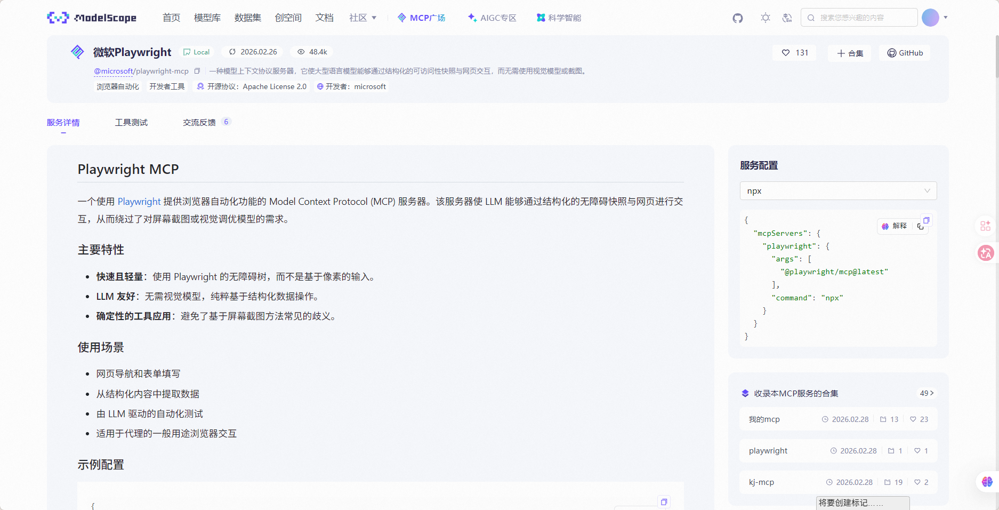
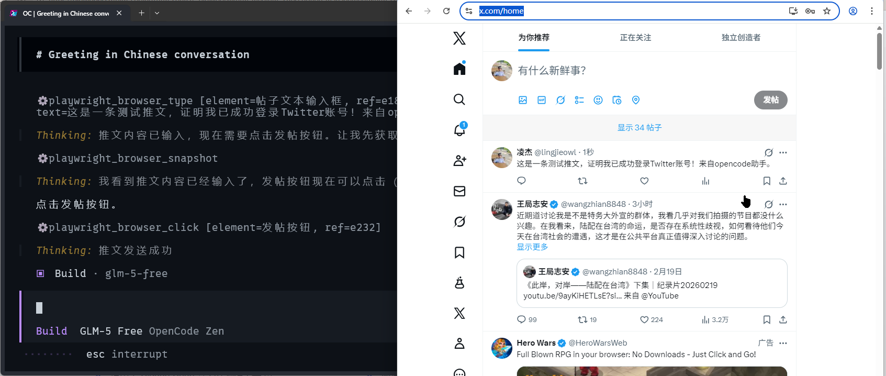
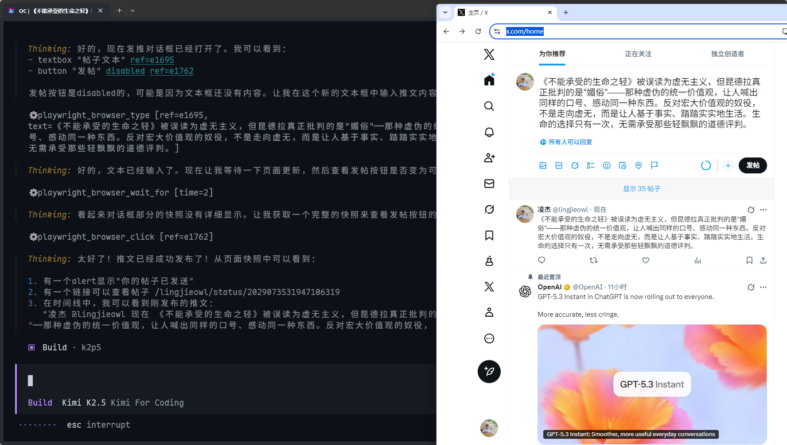

> [!NOTE] 笔记说明
>
> 这篇笔记是《[[Agent 的基础应用]]》一文的后续。其中记录了我学习 Agent 应用的能力体系（提示词、MCP、skills），并将其运用于实际工作场景的心得体会。同样的，这些内容也将作为我 AI 系列笔记的一部分，被存储在本人 Github 上的[计算机学习笔记库](https://github.com/owlman/CS_StudyNotes)中，并予以长期维护。

在《[[Agent 的基础应用]]》一文中，我对于 Agent 的应用演示都是基于简单的提示词（Prompt）来进行的。但在实际生产环境中，人们要描述的问题会远比这些演示复杂得多，这不仅需要掌握更专业的提示词写法，而且还需要充分利用 Agent 提供的各种扩展能力来提高提示词的命中率。现在，让我们从提示词本身及其能力边界来开始介绍，逐步展开接下来的学习之旅。

## 提示词及其能力边界

在将 Agent 具体应用到实际的生产环境中之前，人们首先需要弄清楚的是：提示词在这类应用中的作用到底是什么？它的能力边界在哪里？如果我们在这两个问题上的理解出现了偏差，那么后续所有针对 Agent 应用的能力扩展都会被错误地理解为是一种更高级的提示词技巧。

考虑到 LLM 的核心训练机制是在高维参数空间中寻找一个在给定数据分布上表现足够好的函数近似，它的具体推理过程永远都是在根据某一概率分布来输出下一个文本单元（在专业术语中，我们称之为“Token”，关于这个单位的具体计算方法，读者可参考我稍后在“参考资料”一节中所提供的视频教程：《关于 Token 的科普》）。换言之，LLM 并不是一个基于显式规则或程序控制流的命令执行系统，因此当我们向 LLM 提供一个提示词时，需要记得自己并非是在对它下“命令”，而是在为其提供符合当前环境需求的上下文信息，以便影响它输出的概率分布。这就意味着：

> 提示词调整的是 LLM 输出的概率倾向，它无法改变 LLM 的能力边界。

举个例子，当我们在 Agent 应用中输入并提交如下语句作为提示词时，它们的功能分别是：

- **“你是一名专业的法律顾问”**：用于角色塑造（Persona），目的是影响语气、知识调用倾向与表达方式。
- **“请以 JSON 格式输出”**：用于输出约束（Format Constraints），目的是规范结果结构，提高可读性与可解析性。
- **“请分步骤推理”**：用于任务定义（Task Framing），目的是明确问题范围，限制 LLM 的推理方向。

由此可见，提示词的作用本质上都是在向 LLM 注入用于影响其行为模式的额外上下文信息。尽管学习提示词的使用技巧可以在一定程度上提高任务完成质量。但它们终归只是一种“软控制”手段，并非系统层面的强约束。换言之，无论我们如何编写提示词，它们都免不了会具有以下三个典型特征。

1. **不确定性**：相同的提示词，在不同时间、不同上下文长度、甚至不同模型版本下，都可能产生差异结果。提示词并不能保证稳定行为。
2. **非隔离性**：多轮对话中的历史信息可能影响当前输出；规则之间也可能互相干扰。提示词并不具备真正的“作用域隔离”。
3. **不可验证性**：提示词很难像代码一样做单元测试。一次微小改动，可能影响多个场景；而这种影响往往难以预判。

因此，当问题涉及到针对 Agent 应用的“能力扩展”时，我们需要做的就不再仅仅是“写好提示词”那么简单了。因为提示词虽然可以很好地引导 LLM 的推理路径、规范其输出格式并优化文本的表达质量，从而在一定程度上提升任务的成功率，但对于面向生产环境的具体应用，以下能力是提示词无法提供的：

- **调用外部的服务/工具**：因为这需要独立于 LLM 之外的代码执行环境，以及相关的程序逻辑支持；
- **管理应用的执行状态**：因为这需要执行面向数据库管理系统、文件管理系统的增删改查操作；
- **保证行为逻辑的可复用**：因为即使是相同的提示词，它在不同时空条件下会产生不同的结果；

除了能力层面的限制之外，提示词还存在着工程与经济层面的约束，它给 LLM 带来的计算成本在一定程度上也会成为 Agent 应用的另一种能力边界。毕竟，如今的主流 LLM 服务提供商（例如 OpenAI、Google、Anthropic 等公司）都是以 Token 为单位来进行计费的。众所周知，用户与 LLM 的每次对话，都会产生一定数量的 Token 消耗，越复杂的对话消耗的 Token 数量就越多。因此，当我们在对话中叠加越来越多的提示词时，免不了会导致系统成本的大幅上升。在个人使用场景中，这个成本或许还尚可承受，一旦进入到具体的生产环境中，问题就会迅速被放大，它主要体现在以下四个方面。

1. **版本管理困难**：提示词通常以自然语言形式存在，缺乏清晰的版本结构，很难精确追踪到具体的变更；
2. **行为回归问题**：一次看似微小的改动，可能导致多个下游场景输出变化，而这些变化难以预估；
3. **可读性下降**：当规则不断叠加时，提示词会逐渐演变成“规则堆砌文本”。新成员难以理解设计意图；
4. **知识隐性化**：大量设计经验隐藏在自然语言中，无法结构化复用，也无法模块化组合。

这意味着：如果我们在实际生产环境中不可避免地需要高频调用 LLM，那么其“臃肿的系统提示词”无疑就会成为长期的成本负担，这将大大限制 Agent 应用的能力扩展空间。也正是在这样的背景下，业界才会一直持续不断地寻求在更高层次上对 Agent 应用的能力体系展开进一步的探索，这探索的结果中就包括了由 Anthropic 公司提出的 MCP 服务与 Skills 机制，它们也正是我们接下来要讨论的重点。

## MCP 服务

MCP（即 Model Context Protocol，中文可翻译为“模型上下文协议”）是由 Anthropic 公司提出并推广的，一种用于连接 LLM 与外部服务/工具的通信协议，它的设计目标是寻求在 Agent 应用的底层架构上解决以下三个问题：

1. **工具接入的标准化问题**：在 MCP 出现之前，每一个 LLM 平台都需要自行定义工具调用方式（例如 OpenAI 所推出的 function calling 机制），Agent 应用的开发者们往往需要针对不同 LLM 重复编写适配逻辑。现在，MCP 让这些工具能以统一协议的形式被 LLM 调用了，这显然有助于 Agent 应用与 LLM 的耦合度。

2. **跨平台复用问题**：如果工具能以统一协议的形式被 LLM 调用，而非绑定在某一个 API 上，那么理论上它就可以被不同的 LLM 实例调用，这有助于提高 Agent 应用的可移植性。

3. **安全边界与能力隔离问题**：LLM 本身并不直接拥有执行权限，想要发挥其执行功能往往需要通过操作系统进行精确地授权，这类授权通常都存在着一定的误操作风险。有了 MCP 协议之后，我们就可以轻松地让它在被授权的范围内调用外部服务/工具。这种“能力显式声明”的方式，有助于建立清晰的安全边界。

总而言之，该协议的最大作用是为 LLM 与其要调用的外部工具建立通信桥梁，Agent 应用通常会基于该协议接入用于连接特定工具的中间件来构建这样的桥梁，从而实现“能力扩展”。在专业术语中，这样的中间件被称为“MCP 服务（MCP Server）”。那么在实际生产环境中，我们该如何使用 MCP 服务呢？

### MCP 服务的接入与使用

为了让读者对 MCP 服务能有一个更直观的认识，我接下来将继续以 OpenCode 这个 Agent 应用为例，里具体演示一下 MCP 服务在 Agent 应用中的接入与使用方法。一般来说，当我们决定在 Agent 应用中接入一个 MCP 服务时，需要完成以下三个配置步骤。

1. **根据要调用的外部服务/工具找到要接入的 MCP 服务**：这一步骤可以通过搜索 MCP 服务列表来完成。例如，如果我们想在 Agent 应用中调用网页浏览器，那么就可以到以下几个目前比较常用的 MCP 服务列表网站中搜索“浏览器自动化”这样的关键字，这些网站通常都会返回`chrome-devtools-mcp`、`playwright`这些 MCP 服务。

   - [Anthropic MCP Directory](https://github.com/modelcontextprotocol/servers)：Anthropic 官方提供的 MCP 服务列表。
   - [Awesome MCP Servers](https://mcpservers.org/)：这是一个按照经典的"Awesome"系列风格来组织的 MCP 服务列表，目前在 Github 上很受欢迎。
   - [MCP.so](https://mcp.so/)：这是目前全球最大的 MCP 资源聚合平台，现已收录超过 8000+ 个 MCP 服务，并且还在不断更新中。
   - [魔塔社区的 MCP 广场](https://modelscope.cn/mcp)：由魔塔社区维护的中文 MCP 服务列表，收录了 1000+ 个 MCP 服务。

2. **选择要接入 MCP 服务并查阅其说明文档**：目前主要的 MCP 服务都会提供详尽的说明文档，其中会包含它们的各种接入参数，以及面向各种 Agent 应用的配置方法。例如，`playwright`这个 MCP 服务的说明文档如图 1 所示。

    <!--  -->
    

    **图 1**：playwright 的说明文档

3. **根据 MCP 服务的说明文档来完成接入配置**：这一步骤需要我们根据 Agent 应用的官方文档将 MCP 服务的接入参数填写到相应的配置文件中。例如在 OpenCode 中，我们可以通过在其配置文件（即`opencode.json`文件）中添加如下内容来接入`playwright`这个 MCP 服务。

    ```json
    {
        "mcp": {
            "playwright": {
                "type": "local",
                "command": [
                    "npx",
                    "-y",
                    "@playwright/mcp@latest"
                ]
            }
        }
    }
    ```

根据 OpenCode 的官方文档，MCP 服务的配置信息需要被放置在`mcp`字段下，每一个 MCP 服务都需要以一个唯一的名称（例如`playwright`）来进行配置，其配置方式主要分为本地接入与远程接入两种类型，具体如下：

- **远程接入**：在这种配置类型下，MCP 服务的配置参数主要包含`type`、`url`、`enabled`等字段。其中`type`字段的值应固定为`"remote"`，而`url`字段用于指定该 MCP 服务所在的地址，`enabled`字段用于指定是否启用该服务。例如，以下是远程接入`jira`这个 MCP 服务的官方示例：

    ```json
    {
        "$schema": "https://opencode.ai/config.json",
        "mcp": {
            "jira": {
                "type": "remote",
                "url": "https://jira.example.com/mcp",
                "enabled": true
            }
        }
    }
    ```

- **本地接入**：在这种配置类型下，MCP 服务的配置参数主要包含`type`、`command`、`environment`、`enabled`等字段。其中`type`字段的值应固定为`"local"`，而`command`字段用于指定该 MCP 服务的启动命令及其参数，`environment`字段用于指定启动该服务所需设置的环境变量，`enabled`字段用于指定是否启用该服务。例如，以下是本地接入`github`这个 MCP 服务的示例：

    ```json
    {
        "$schema": "https://opencode.ai/config.json",
        "mcp": {
            "github": {
                "type": "local",
                "command": [
                    "npx",
                    "-y",
                    "@modelcontextprotocol/server-github"
                ],
                "environment": { 
                    // 此处的 token 需要用户自行前往 GitHub 获取
                    "GITHUB_PERSONAL_ACCESS_TOKEN": "<your github personal access token>"
                },
                "enabled": true
            }
        }
    }
    ```

    目前的 MCP 服务主要有 NPM 和 UV 两种打包方式，所以它们的启动命令通常是`npx`或`uvx`。例如，之前配置的`playwright`这个 MCP 服务的启动命令是`npx -y @playwright/mcp@latest`，而`fetch`这个用于抓取网页信息的 MCP 服务的启动命令就是`uvx mcp-server-fetch`了。

在完成了上述配置之后，我们只需在 OpenCode TUI 中执行`/mcps`命令，就可以看到所有已配置的 MCP 服务，并管理它们的接入状态了，如图 2 所示。

<!--  -->


**图 2**：在 OpenCode TUI 中确认 MCP 服务的接入状态

在确认`playwright`这个 MCP 服务已成功接入之后，我们就可以试着在 OpenCode TUI 中使用提示词让它去调用网页浏览器打开 Twitter/X，并发一个测试推文来检查这个 MCP 服务的功能是否可用了，如图 3 所示。

<!--  -->


**图 3**：试用 playwright 服务

### 接入 MCP 服务的成本与风险

在计算机的世界中，任何针对应用程序的能力扩展都会引入新的复杂度。MCP 服务也不例外。在实际生产环境中，它至少带来三类新的成本：

1. **部署复杂度提升**：接入 MCP 服务意味着我们所使用的 Agent 应用已从简单的“LLM + 提示词”结构，变成了“LLM + MCP + 外部服务/工具”的复杂结构，这无疑会增加应用的部署与维护难度。

2. **安全风险扩大**：一旦 LLM 具备了调用外部能力的通道，我们就必须开始考虑系统权限的管理、输入校验与调用审计。否则 LLM 输出的错误判断很可能会被转化为真实的程序执行风险。

3. **依赖管理问题**：外部服务/工具的可用性、版本变更以及接口兼容性等因素，都会直接影响到 Agent 应用的稳定性。能力扩展的同时，也意味着更多外部依赖。

因此，对于 Agent 应用来说，MCP 服务从来都不是“多多益善”的能力增强工具，它们只应被用于那些确实有必要使用外部工具的应用场景。如果仅仅是文本生成与结构化输出，过早在 Agent 应用中引入 MCP 服务反而会造成不必要的资源浪费，用户应根据自己的实际需求来决定启用哪些 MCP 服务。为了解决这个问题，我们通常会分以下两个作用域的配置文件来管理 MCP 服务。

- **系统级配置文件**：该文件的存储路径通常为`~/.config/opencode/opencode.json`，我们在其中配置的 MCP 服务往往是所有应用场景都会用到的通用服务，例如`playwright`、`fetch`等；

- **项目级配置文件**：该文件的存储路径通常为`<项目根目录>/.opencode/opencode.json`，我们在其中配置的 MCP 服务往往是针对特定项目或应用场景的专用工具，例如用于操作数据库的`MongoDB`，或者用于 WebUI 设计的`figma`等。

如果从能力体系的层次来看，MCP 服务属于“能力接入层”。它解决的是 LLM 的外部调用能力，而提示词则是用于控制 LLM 的单次推理行为与输出表现的。二者并不冲突，但也不在同一层级。理解这一点，才能避免将 MCP 误解为一种“高级提示词技巧”，从而在架构设计上做出错误决策。

> 顺带一提，如果读者想了解更多常用的 MCP 服务，以及它们在 Claude Code/Codex CLI 中的配置方法，也可以参考本文在“参考资料”一节中提供的视频教程：《15 款常用 MCP 服务的配置方法》。

## Skills 机制

在实际生产环境中，我们要处理的许多任务场景都是高频度重复出现的（例如：将会议记录整理为结构化纪要，将长文档重写为对外发布版本，将需求说明转换为技术实现步骤，将代码进行安全审查与重构建议，等等）。如果我们每次都依赖临时编写提示词的方式来完成这些任务，不仅会让工作效率低下，而且还极易让 Agent 应用产生行为漂移。因为对提示词的任何一点小小的改动，都可能导致输出风格或逻辑结构的整体变化。为解决这些问题，Anthropic 公司提出了一种被称为 Skills 机制的技能封装方法，实现该机制的核心步骤是：

1. 将 Agent 应用中高频率出现的行为模式固化为可独立命名的 Skill；
2. 在 Skill 的定义中为 Agent 应用的输入/输出结构设置明确的规范；
3. 将该 Skill 设置为 Agent 应用中的一个可被直接调用的模块化组件；

从工程化的角度来看，上述步骤本质上就是一个实现“行为封装（Behavior Encapsulation）”的过程。如果说提示词是用于控制 LLM 的单次推理行为与输出表现，而 MCP 服务提供的是 LLM 的外部接入能力，那么这个封装机制要解决的就是行为模式的可复用性问题了。换言之，当我们决定在 Agent 应用中引入 Skills 机制时，其主要的出发点应该是：

> 如何将已被验证有效的“行为模式”固化下来，并使其能够被重复调用、版本管理与组合使用？

### Skills 机制的实现与使用

为了让读者对 Skills 机制有一个直观的认识，我接下来会试着用实例来演示一下如何在 Agent 应用中使用该机制完成某一类特定的任务。假设，我们现在希望将之前演示的，使用 Agent 应用在 Twitter/X 发推的行为逻辑封装起来，以便日后重复使用，就需要通过以下步骤来实现：

1. **确定 Skill 的作用域**：和 MCP 服务一样，Skills 机制也是一项会在使用过程中消耗 Token 的扩展能力， Agent 应用在同一时间内加载的 Skill 也同样不是越多越好。因此，我们在封装 Skill 时，通常也会将其划分为系统级与项目级两种作用域。其中，适用于所有应用场景的 Skill 会被存储在 Agent 应用的系统级配置目录中，而专用于特定应用场景的 Skill 则会被存储在目标项目下的 Agent 应用配置目录中。例如，具体到 OpenCode 这款 Agent 应用，其系统级 Skill 的存储路径通常为`~/.config/opencode/skills`，而项目级 Skill 的存储路径通常为`<项目根目录>/.opencode/skills`。

2. **设置输入/输出规范**；在选择好配置目录中创建一个以待创建的 Skill 命名的目录，并在该目录下创建一个`SKILL.md`文件，用于描述该 Skill 的输入/输出规范。例如，以下是用于在 Twitter/X 发推的 Skill 的`SKILL.md`文件内容：

    ```markdown
    ---
    name: twitter
    description:  将用户提供的文本压缩成合适的篇幅，并发布到 Twitter/X 上。
    ---

    ## 工作流程描述

    - 步骤1：将用户要发布到 Twitter/X 的文本压缩成合适的篇幅（140 个汉字以内）。
    - 步骤2：使用网页浏览器打开 Twitter/X 网站，并登录 lingjieowl 这个账号（如需密码可查看`pw.md`）。
    - 步骤3：在 Twitter/X 网站上发布步骤1中压缩后的文本。
    ```

3. **在必要时设置可调用资源**：在`SKILL.md`文件所描述的工作流程中，我提到“如需密码可查看`pw.md`”，这里用到的是 Skills 机制中的“引用资源”功能。该功能允许 Agent 应用根据实际执行需要来决定是否要读取某个文件，以节省 Token 的消耗。例如在当前这个 Skill 中，Agent 应用只有在其打开的网页浏览器中没有存储 lingjieowl 这个账号的登录密码时，才会去读取`pw.md`文件中的内容。而我所需要做的就是在`SKILL.md`文件所在的目录中创建一个`pw.md`文件，并在其中存储 lingjieowl 这个账号的登录密码。

  当然了，如果读者觉得将密码明文存储在`pw.md`文件中不够安全（这的确不值得鼓励），也不必担心。Skills 机制中的引用资源除了用于存储的信息文件之外，也能是可执行的程序/脚本。例在这里，我们也可以选择让 Agent 应用通过执行一个名为`pw.py`的脚本来获取目标账号的登录密码。

在完成了上述操作之后，我们只需在 OpenCode TUI 中执行`/skills`命令，就可以看到该 Agent 应用在当前作用域下可用的所有 Skill 了，如图 4 所示。

<!--  -->


**图 4**：在 OpenCode TUI 中确认当前可用的 Skill

在确认`twitter`这个 Skill 可用之后，我们就可以试着在 OpenCode TUI 中使用提示词来调用这个 Skill。例如在这里，我让 OpenCode 将[一篇约 1000 字的书评](https://book.douban.com/review/10277456/)发布为一则推文，如图 5 所示。

<!--  -->


**图 5**：试用自定义的 twitter Skill

当然了，考虑到人们在工作中遇到的任务场景是大同小异的，本着“不重复发明轮子”的原则，我在这里会建议读者在亲手开始封装某个 Skill 之前，先去 Github 这样的地方搜索一下，看看是否有人已经封装好了类似的功能。如果有的话，例如 [Anthropic 官方提供的 Skills](https://github.com/anthropics/skills)，我们就只需直接将其`git clone`下来，并将它`skills`目录下的所有内容复制到相应的 Agent 应用配置目录中即可，如图 6 所示。

<!--  -->


**图 6**：Anthropic 官方提供的 Skills

> 顺带一提，如果读者想基于 Anthropic 的官方产品 Claude Code 进一步研究 Skills 机制的构建与使用方法，也可以参考本文在“参考资料”一节中提供的官方文档：《Agent Skills 构建指南》。

### Skills 机制 VS 提示词模板

在学习了 Skills 机制的实现方法之后，读者很可能会将它理解为一种可被存储为文件，并能重复使用的“提示词模板”，因为它们看起来确实非常相似，例如：两者都是一段预设的上下文说明，都包含一组输入参数，也都对输出格式有稳定要求。但事实上，Skills 机制与提示词模板在工程层面上存在着以下明显的差异：

1. **技术层面的差异**：提示词模板通常只是自然语言文本的拼接，其结构往往隐含在文本描述之中。而基于 Skills 机制实现的 Skill 则会明确规范 Agent 应用的输入/输出结构，并对其行为进行标准化定义。这意味着，我们所封装的 Skill 更接近一种声明式的接口规范，而不仅仅是一段提示词文本。

2. **工程层面的差异**：提示词模板通常存在于聊天记录、文档片段、或个人经验中，它们通常缺乏版本控制、缺乏变更记录，也难以在团队之间共享。而基于 Skills 机制实现的 Skill 则往往以结构化形式的存在，这让我们可对这些 Skill 进行版本管理，集中维护，并在不同 Agent 实例之间复用它们。从这个角度来看，它们也更像是 Agent 应用内部的一层行为抽象接口，而非简单的文本工具。另外，它与 MCP 这样的外部能力接入机制也属于不同层级的设计问题。

3. **维护成本的差异**：随着系统复杂度提升，如果所有行为逻辑都依赖提示词堆叠，那么系统提示会变得越来越庞大，修改风险也随之增加。而通过 Skills 将高频行为模块化，可以降低系统提示的体积，减少行为回归的风险，提高系统整体的可读性与可维护性。很明显，这是一种典型的“将隐性知识显性化”的工程策略。

### Skills 的使用边界

在计算机系统中，任何封装机制都会引入新的复杂度，Skills 机制的实现自然也不例外。这意味着，我们在实践中至少需要思考两个问题：

1. 什么行为模式值得被封装？基本上，当一个行为同时满足以下条件时，通常值得被封装：

   - 具有明确的输入与输出边界；
   - 在多个场景中被重复调用；
   - 对输出结构有稳定要求；
   - 行为逻辑不依赖高度随机的创造性生成；

   例如：Agent 应用在处理标准文档格式的转换、结构化的信息抽取这些常见任务时的行为，通常都适合被封装为固定的 Skill 。

2. 什么行为不适合被封装？当 Agent 应用要执行的任务本身具有高度开放性时，例如像创意写作、战略规划、头脑风暴这样的任务，如果我们强行将其封装为 Skill ，反而往往会限制了 LLM 的表达自由度，并不利于产生高质量的输出。此外，如果一个行为只在单一场景中偶尔出现，过早封装只会增加系统复杂度。

如果从 Agent 应用的能力体系来看，提示词解决的是表达控制问题，MCP 服务解决的是外部能力接入问题，而 Skills 机制解决的是行为模式固化与复用问题。三者并不冲突，但各自作用在不同层级。理解这一点非常关键。否则我们很容易将 Skills 机制的实现结果误解为“高级提示词模板”，或将 MCP 误解为“更强的技能系统”，而实际上，提示词属于概率分布层，MCP 属于协议通信层，Skills 则属于行为抽象层。Agent 应用的这三层能力体系需要协同运作，才会构成真正稳定的工程架构。

总而言之，如果说提示词是一种“软控制”手段，那么 Skills 则是一种“结构化控制”手段。它主要用于稳定行为输出，降低系统复杂度，提高复用效率。在我个人看来，只有当初学者们理解了 Skills 机制在生产环境中的作用并不是对提示词的锦上添花，而是一种对复杂度进行主动管理的工具，才真正有可能让自己手里的 Agent 应用从“个人玩具”升级为一个可发挥出生产力的工程化系统。

## 结束语

当我们讨论提示词、MCP 服务、Skills 机制时，很容易被具体实现细节吸引，例如，初学者们都很关心提示怎么写？外部工具怎么调用？本地化模块如何封装？但如果退后一步看，我们就会发现这些讨论其实都指向同一个问题：

> 如何在一个本质上是概率模型的系统之上，构建可预测、可维护、可扩展的工程体系？

提示词解决的是我们如何更好地向 LLM 表达意图，MCP 服务解决的是如何让 LLM 安全地使用外部能力，Skills 机制解决的是如何将 Agent 应用的复杂行为结构化、模块化。换言之，它们本质上都是在用软件工程的方法，约束并组织 LLM 基于概率计算的不确定性。而这正是 LLM 应用与传统软件在工程化运用上的最大区别：我们不再完全控制执行路径，而是通过设计接口、分层结构和行为边界，对一个概率系统施加工程约束。

真正成熟的大模型应用，并不是提示词堆砌得多复杂，也不是接入了多少外部工具，而是是否清晰地划分了能力边界。当我们理解了这一点，提示词就不再是技巧，MCP 服务不再是工具集合，Skills 机制也不再是模板封装。我们会很清楚楚地看到，Agent 应用的这三层能力体系所构成的是一套全新的工程方法论，目的是在不确定中构建确定性。或许，这才是 AI 时代真正值得学习的能力。

## 参考资料

- 官方文档：
  - [Anthropic 对 MCP 服务的官方简介](https://www.anthropic.com/news/model-context-protocol)
  - [Agent Skills 构建指南](https://resources.anthropic.com/hubfs/The-Complete-Guide-to-Building-Skill-for-Claude.pdf)

- 视频教程
  - 关于 Token 的科普：[YouTube 链接](https://www.youtube.com/watch?v=QNiaoD5RxPA) / [Bilibili 链接](https://www.bilibili.com/video/BV1S5miBvEsu)
  - MCP 教程（基础篇）： [YouTube 链接](https://www.youtube.com/watch?v=yjBUnbRgiNs) / [Bilibili 链接](https://www.bilibili.com/video/BV1uronYREWR/)
  - MCP 教程（进阶篇）：[YouTube 链接](https://www.youtube.com/watch?v=zrs_HWkZS5w) / [Bilibili 链接](https://www.bilibili.com/video/BV1Y854zmEg9)
  - 15 款常用 MCP 服务的配置方法：[YouTube 链接](https://www.youtube.com/watch?v=UW5iQGE3264) / [Bilibili 链接](https://www.bilibili.com/video/BV1ZJsBznEt3)
  - Agent Skills 教程：[YouTube 链接](https://www.youtube.com/watch?v=yDc0_8emz7M) / [Bilibili 链接](https://www.bilibili.com/video/BV1cGigBQE6n)
