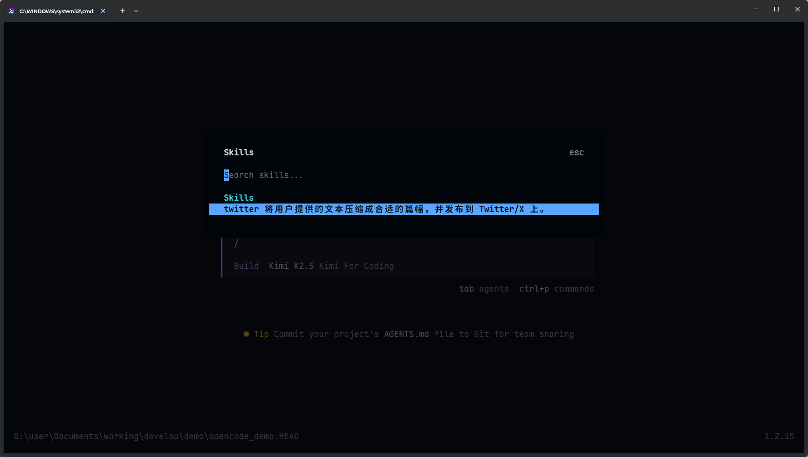

> [!NOTE] 笔记说明
>
> 这篇笔记是《[[Agent 的基础应用]]》一文的后续。其中记录了我学习并使用 Agent 应用的扩展机制，并将其运用于实际工作场景的全过程，以及在该过程中所获得的心得体会。同样的，这些内容也将成为我 AI 系列笔记的一部分，被存储在本人 Github 上的[计算机学习笔记库](https://github.com/owlman/CS_StudyNotes)中，并予以长期维护。

在《[[Agent 的基础应用]]》一文中，我对于 Agent 的应用演示都是基于简单的提示词（Prompt）来进行的。但在实际生产环境中，我们要描述的问题会远比这些演示复杂得多，这不仅需要掌握更专业的提示词写法，而且还需要充分利用 Agent 提供的各种扩展机制来提高提示词的命中率。现在，让我们从提示词本身及其能力边界来开始介绍，逐步展开接下来的进阶之旅。

## 提示词及其能力边界

在将 Agent 工具具体应用到实际的生产环境中之前，人们首先需要弄清楚的是：提示词在这类应用中的作用到底是什么？它的能力边界在哪里？如果我们在这两个问题上的理解出现了偏差，那么后续的一切扩展机制都会被错误地理解为一种更高级的提示词技巧。

考虑到 LLM 的核心训练机制是在高维参数空间中寻找一个在给定数据分布上表现足够好的函数近似，它的具体推理过程永远都是在根据某一概率分布来输出下一个文本单元（在专业术语中，我们称之为“Token”，关于这个单位的具体计算方法，读者可参考我稍后在“参考资料”一节中所提供的视频教程：《关于 Token 的科普》）。换言之，这不是一个基于显式规则或程序控制流的命令执行系统。因此从技术本质上看，当我们向 LLM 提供一个提示词时，并不是在下“命令”或写“代码”，而是在向它注入符合当前环境需求的上下文信息，从而改变其输出的概率分布。这就意味着：

> 提示词调整的是 LLM 输出的概率倾向，它无法改变 LLM 的能力边界。

举个例子，当我们在 Agent 应用中输入并提交如下语句作为提示词时，它们的功能分别是：

- “你是一名专业的法律顾问”：用于角色塑造（Persona），影响语气、知识调用倾向与表达方式。
- “请以 JSON 格式输出”：用于输出约束（Format Constraints），规范结果结构，提高可读性与可解析性。
- “请分步骤推理”：用于任务定义（Task Framing），明确问题范围，限制推理方向。

由此可见，提示词的作用本质上都是在向 LLM 注入用于影响其行为模式的额外上下文信息。我们使用提示词的技巧或许可以显著提高任务完成质量。但这些终归只是一种“软控制”的手段。其有效性取决于 LLM 的内部能力，而非系统层面的强约束。它具有三个典型特征。

1. **不确定性**：相同的提示词，在不同时间、不同上下文长度、甚至不同模型版本下，都可能产生差异结果。提示词并不能保证稳定行为。
2. **非隔离性**：多轮对话中的历史信息可能影响当前输出；规则之间也可能互相干扰。提示词并不具备真正的“作用域隔离”。
3. **不可验证性**：提示词很难像代码一样做单元测试。一次微小改动，可能影响多个场景；而这种影响往往难以预判。

因此，当问题涉及到 Agent 应用的“能力扩展”时，我们需要做的就不再仅仅是“写好提示词”那么简单了。因为提示词虽然可以很好地引导 LLM 的推理路径、规范其输出格式并优化文本的表达质量，从而在一定程度上提升任务的成功率，但对于面向生产环境的具体应用，以下能力是提示词无法提供的：

- **调用外部的服务/工具**：因为这需要独立于 LLM 之外的代码执行环境，以及相关的程序逻辑支持；
- **管理应用的执行状态**：因为这需要执行面向数据库管理系统、文件管理系统的增删改查操作；
- **保证行为逻辑的可复用**：因为即使是相同的提示词，它在不同时空条件下会产生不同的结果；

除了能力层面的限制，提示词还存在工程与经济层面的约束，它所带来的 LLM 计算成本也会给 Agent 应用带来另一种意义上的能力边界。众所周知，如今的主流 LLM 服务提供商（例如 OpenAI、Anthropic 等公司）都是以 Token 为单位来计费的。用户与 LLM 的每次对话，都会产生一定数量的 Token 消耗，越复杂的对话消耗的 Token 数量就越多。因此，当我们在对话中叠加越来越多的提示词时，免不了会导致系统成本的大幅上升。在个人使用场景中，这个成本或许还尚可承受，一旦进入到具体的生产环境中，问题就会迅速被放大，它主要体现在以下四个方面。

1. **版本管理困难**：提示词通常以自然语言形式存在，缺乏清晰的版本结构，很难精确追踪到具体的变更；
2. **行为回归问题**：一次看似微小的改动，可能导致多个下游场景输出变化，而这些变化难以预估；
3. **可读性下降**：当规则不断叠加时，提示词会逐渐演变成“规则堆砌文本”。新成员难以理解设计意图；
4. **知识隐性化**：大量设计经验隐藏在自然语言中，无法结构化复用，也无法模块化组合。

这意味着：如果我们需要在一个生产系统需要高频调用 LLM，那么一个“臃肿的系统提示词”会成为长期成本负担，这会大大限制我们扩展 Agent 能力的空间。也正是在这样的背景下，才会出现对更高层扩展方式的探索，例如由 Anthropic 公司提出的 MCP 服务与 Skills 机制。这些都是他们在“如何系统性地扩展能力”这个问题上的探索成果。而这，正是我们接下来要讨论的重点。

## MCP 服务

MCP 是 Model Context Protocol 的缩写，中文可以翻译为“模型上下文协议”。它是由 Anthropic 公司提出并推动标准化的，一种用于连接 LLM 与外部服务/工具的通信协议，主要致力于在 Agent 应用的底层架构上解决以下三个问题：

1. **工具接入的标准化问题**：在 MCP 出现之前，每一个 LLM 平台都需要自行定义工具调用方式（例如之前OpenAI 等平台提供的 function calling 机制），Agent 的开发者们往往需要针对不同 LLM 重复编写适配逻辑。现在，这些工具能以统一协议的形式被调用了，有助于降低 Agent 应用与 LLM 的耦合度。
2. **跨平台复用问题**：如果工具能以统一协议的形式被调用，而非绑定在某一个 LLM API 上，那么理论上它可以被不同的 LLM 实例调用，有助于提高 Agent 应用的可移植性。
3. **安全边界与能力隔离问题**：LLM 本身并不直接拥有执行权限，其执行能力需要通过外部系统进行显式授权。通过 MCP 协议，它就只能在被授权的范围内调用外部服务/工具。这种“能力显式声明”的方式，有助于建立清晰的安全边界。

总而言之，该协议的最大作用是为 LLM 与其要调用的外部工具建立通信桥梁，Agent 应用通常会基于该协议接入用于连接特定工具的中间件来构建这样的桥梁，从而实现“能力扩展”。在专业术语中，这样的中间件通常被称为“MCP 服务（MCP Server）”。那么在实际生产环境中，我们该如何使用 MCP 服务呢？

### MCP 服务的接入与使用

为了让读者对 MCP 服务能有一个更直观的认识，我接下来将以 OpenCode 这个 Agent 应用为例，具体演示一下 MCP 服务在 Agent 应用中的接入与使用方法。一般来说，当我们决定在 Agent 应用中接入一个 MCP 服务时，需要完成以下三个配置步骤。

1. **根据要调用的外部服务/工具找到要接入的 MCP 服务**：这一步骤可以通过搜索 MCP 服务列表来获取。例如，如果我们想在 Agent 应用中调用网页浏览器，那么就可以到以下几个目前比较常用的 MCP 服务列表网站中搜索“浏览器自动化”这样的关键字，这些网站通常都会返回`chrome-devtools-mcp`、`playwright`这些 MCP 服务。

   - [Anthropic MCP Directory](https://github.com/modelcontextprotocol/servers)：Anthropic 官方提供的 MCP 服务列表。
   - [Awesome MCP Servers](https://mcpservers.org/)：这是一个按照经典的"Awesome"系列风格来组织的 MCP 服务列表，目前在 Github 上很受欢迎。
   - [MCP.so](https://mcp.so/)：这是目前全球最大的 MCP 资源聚合平台，现已收录超过 8000 个 MCP 服务，并且还在不断更新中。
   - [魔塔社区的 MCP 广场](https://modelscope.cn/mcp)：由魔塔社区维护的中文 MCP 服务列表，收录了 1000+ 个 MCP 服务。

2. **选择要接入 MCP 服务并查阅其说明文档**：目前主要的 MCP 服务都会提供详尽的说明文档，其中会包含它们的各种接入参数，以及面向各种 Agent 应用的配置方法。例如，`playwright`这个 MCP 服务的说明文档如图 1 所示。

    

    **图 1**：playwright 的说明文档

3. **根据 MCP 服务的说明文档来完成接入配置**：这一步骤需要我们根据 Agent 应用的官方文档将 MCP 服务的接入参数填写到相应的配置文件中。例如在 OpenCode 中，我们可以通过在其配置文件（即`opencode.json`文件）中添加如下内容来接入`playwright`这个 MCP 服务。

    ```json
    {
        "mcp": {
            "playwright": {
                "type": "local",
                "command": [
                    "npx",
                    "-y",
                    "@playwright/mcp@latest"
                ]
            }
        }
    }
    ```

根据 OpenCode 的官方文档，MCP 服务的配置信息需要被放置在`mcp`字段下，每一个 MCP 服务都需要以一个唯一的名称（例如`playwright`）来进行配置，其配置方式主要分为本地接入与远程接入两种类型，具体如下：

- **远程接入**：在这种配置类型下，MCP 服务的配置参数主要包含`type`、`url`、`enabled`等字段。其中`type`字段的值应固定为`"remote"`，而`url`字段用于指定该 MCP 服务所在的地址，`enabled`字段用于指定是否启用该服务。例如，以下是远程接入`jira`这个 MCP 服务的官方示例：

    ```json
    {
        "$schema": "https://opencode.ai/config.json",
        "mcp": {
            "jira": {
                "type": "remote",
                "url": "https://jira.example.com/mcp",
                "enabled": true
            }
        }
    }
    ```

- **本地接入**：在这种配置类型下，MCP 服务的配置参数主要包含`type`、`command`、`environment`、`enabled`等字段。其中`type`字段的值应固定为`"local"`，而`command`字段用于指定该 MCP 服务的启动命令及其参数，`environment`字段用于指定启动该服务所需设置的环境变量，`enabled`字段用于指定是否启用该服务。例如，以下是本地接入`github`这个 MCP 服务的示例：

    ```json
    {
        "$schema": "https://opencode.ai/config.json",
        "mcp": {
            "github": {
                "type": "local",
                "command": [
                    "npx",
                    "-y",
                    "@modelcontextprotocol/server-github"
                ],
                "environment": { 
                    // 此处的 token 需要用户自行前往 GitHub 获取
                    "GITHUB_PERSONAL_ACCESS_TOKEN": "<your github personal access token>"
                },
                "enabled": true
            }
        }
    }
    ```

    目前的 MCP 服务主要有 NPM 和 UV 两种打包方式，所以它们的启动命令通常是`npx`或`uvx`。例如，之前配置的`playwright`这个 MCP 服务的启动命令是`npx -y @playwright/mcp@latest`，而`fetch`这个用于抓取网页信息的 MCP 服务的启动命令就是`uvx mcp-server-fetch`了。

在完成了上述配置之后，我们只需在 OpenCode TUI 中执行`/mcps`命令，就可以看到所有已配置的 MCP 服务，并管理它们的接入状态了，如图 2 所示。


**图 2**：在 OpenCode TUI 中确认 MCP 服务的接入状态

在确认`playwright`这个 MCP 服务已成功接入之后，我们就可以试着在 OpenCode TUI 中使用提示词让它去调用网页浏览器打开 Twitter/X，并发一个测试推文来检查这个 MCP 服务的功能是否可用了，如图 3 所示。


**图 3**：试用 playwright 服务

### 接入 MCP 服务的成本与风险

在计算机的世界中，任何能力扩展机制都会引入新的复杂度。MCP 服务也不例外。在实际生产环境中，它至少带来三类新的成本：

1. **部署复杂度提升**：接入 MCP 服务意味着我们所使用的 Agent 应用已从简单的“LLM + 提示词”结构，变成了“LLM + MCP + 外部服务/工具”的复杂结构，这无疑会增加应用的部署与维护难度。

2. **安全风险扩大**：一旦 LLM 具备了调用外部能力的通道，我们就必须开始考虑系统权限的管理、输入校验与调用审计。否则 LLM 输出的错误判断很可能会被转化为真实的程序执行风险。

3. **依赖管理问题**：外部服务/工具的可用性、版本变更以及接口兼容性等因素，都会直接影响到 Agent 应用的稳定性。能力扩展的同时，也意味着更多外部依赖。

因此，对于 Agent 应用来说，MCP 服务并不是“多多益善”的能力增强工具，它们适用于那些确实需要真实的程序执行环境、跨系统交互或复杂工具编排的场景。如果仅仅是文本生成与结构化输出，过早在 Agent 应用中引入 MCP 服务反而会造成不必要的资源浪费，用户应根据自己的实际需求来决定启用哪些 MCP 服务。为了解决这个问题，我们通常会按照以下两个等级的配置文件来管理 MCP 服务。

- **系统级配置文件**：该文件的存储路径通常为`~/.config/opencode/opencode.json`，我们在其中配置的 MCP 服务往往是所有应用场景都会用到的通用服务，例如`playwright`、`fetch`等；
- **项目级配置文件**：该文件的存储路径通常为`<项目根目录>/.opencode/opencode.json`，我们在其中配置的 MCP 服务往往是针对特定项目或应用场景的专用工具，例如用于操作数据库的`MongoDB`，或者用于 WebUI 设计的`figma`等。

总而言之，如果从能力分层的角度来看，MCP 服务属于“能力接入层”。它解决的是 LLM 的外部调用能力，而提示词则是用于控制 LLM 的单次推理行为与输出表现的。二者并不冲突，但也不在同一层级。理解这一点，才能避免将 MCP 误解为一种“高级提示词技巧”，从而在架构设计上做出错误决策。

> 顺带一提，如果读者想了解更多常用的 MCP 服务，以及它们在 Claude Code/Codex CLI 中的配置方法，也可以参考本文在“参考资料”一节中提供的视频教程：《15 款常用 MCP 服务的配置方法》。

## Skills 机制

在实际生产环境中，我们要处理的许多任务场景都是高频度重复出现的（例如：将会议记录整理为结构化纪要，将长文档重写为对外发布版本，将需求说明转换为技术实现步骤，将代码进行安全审查与重构建议，等等）。如果我们每次都依赖临时编写提示词的方式来完成这些任务，不仅会让工作效率低下，而且还极易让 Agent 应用产生行为漂移。因为对提示词的任何一点小小的改动，都可能导致输出风格或逻辑结构的整体变化。为解决这些问题，Anthropic 公司提出了一种被称之为 AI Skills 的能力单元封装机制，实现该机制的核心步骤是：

1. 将 Agent 应用中高频率出现的行为模式固化为可独立命名的能力单元；
2. 在该能力单元中，为 Agent 应用的输入/输出结构设置明确的规范；
3. 将该能力单元设置为 Agent 应用中的一个可被直接调用的模块化组件；

从工程化的角度来看，上述步骤本质上就是一个实现“行为封装（Behavior Encapsulation）”的过程。如果说提示词是用于控制 LLM 的单次推理行为与输出表现，而 MCP 服务提供的是 LLM 的外部接入能力，那么这个封装机制要解决的就是行为模式的可复用性问题了。换言之，当我们决定在 Agent 应用中引入 Skills 机制时，其主要的出发点应该是：

> 如何将已被验证有效的“行为模式”固化下来，并使其能够被重复调用、版本管理与组合使用？

### Skills 机制的实现与使用

为了让读者对 Skills 机制有一个直观的认识，我接下来会试着用实例来演示一下如何在 Agent 应用中使用该机制完成某一类特定的任务。假设，我们现在希望将之前演示的，使用 Agent 应用在 Twitter/X 发推的行为逻辑封装起来，以便日后重复使用，就需要通过以下步骤来实现：

1. **确定能力单元的作用域**：和 MCP 服务一样，Skills 机制也是一项会在使用过程中消耗一定数量 Token 的扩展能力， Agent 应用在同一时间内加载的能力单元也并不是越多越好。因此，我们在封装能力单元时，通常也会将其划分为系统级与项目级两种作用域。其中，适用于所有应用场景的能力单元会被存储在 Agent 应用的系统级配置目录中，而专用于特定应用场景的能力单元则会被存储在目标项目下的 Agent 应用配置目录中。例如，具体到 OpenCode 这款 Agent 应用，其系统级能力单元的存储路径通常为`~/.config/opencode/skills`，而项目级能力单元的存储路径通常为`<项目根目录>/.opencode/skills`。

2. **设置输入/输出规范**；在选择好配置目录中创建一个以待创建的能力单元命名的目录，并在该目录下创建一个`SKILL.md`文件，用于描述该能力单元的输入/输出规范。例如，以下是用于在 Twitter/X 发推的能力单元的`SKILL.md`文件内容：

    ```markdown
    ---
    name: twitter
    description:  将用户提供的文本压缩成合适的篇幅，并发布到 Twitter/X 上。
    ---

    ## 工作流程描述

    - 步骤1：将用户要发布到 Twitter/X 的文本压缩成合适的篇幅（140 个汉字以内）。
    - 步骤2：使用网页浏览器打开 Twitter/X 网站，并登录 lingjieowl 这个账号（如需密码可查看`pw.md`）。
    - 步骤3：在 Twitter/X 网站上发布步骤1中压缩后的文本。
    ```

3. **在必要时设置可调用资源**：在`SKILL.md`文件所描述的工作流程中，我提到“如需密码可查看`pw.md`”，这里用到的是 Skills 机制中的“引用资源”功能。该功能允许 Agent 应用根据实际执行需要来决定是否要读取某个文件，以节省 Token 消耗。例如在当前这个能力单元中，Agent 应用只有在其打开的网页浏览器中没有存储 lingjieowl 这个账号的登录密码时，才会去读取`pw.md`文件中的内容。而我所需要做的就是在`SKILL.md`文件所在的目录中创建一个`pw.md`文件，并在其中存储 lingjieowl 这个账号的登录密码。

  当然了，如果读者觉得将密码明文存储在`pw.md`文件中不够安全，也不必担心。Skills 机制中的引用资源除了用于存储的信息文件之外，也能是可执行的程序/脚本。例在这里，我们也可以选择让 Agent 应用通过执行一个名为`pw.py`的脚本来获取目标账号的登录密码。

在完成了上述操作之后，我们只需在 OpenCode TUI 中执行`/skills`命令，就可以看到该 Agent 应用在当前作用域下可用的所有能力单元了，如图 4 所示。



**图 4**：在 OpenCode TUI 中确认当前可用的能力单元

在确认`twitter`这个能力单元可用之后，我们就可以试着在 OpenCode TUI 中使用提示词来调用这个能力单元，如图 5 所示。


**图 5**：试用 twitter 能力单元

### Skills 机制的优势与局限

### Skills 机制 VS 提示词模板

在学习了 Skills 机制的实现方法之后，读者很可能会将它理解为一种可被存储为文件，并能重复使用的“提示词模板”，因为它们看起来确实非常相似，例如：两者都是一段预设的上下文说明，都包含一组输入参数，也都对输出格式有稳定要求。但事实上，Skills 机制与提示词模板在工程层面上的差异非常明显，具体如下：

1. **技术层面的差异**：提示词模板通常只是自然语言文本的拼接，其结构往往隐含在文本描述之中。而 Skills 机制则会：

   - 明确声明输入字段；
   - 明确约定输出结构；
   - 对行为进行标准化定义；

   这意味着 Skills 更接近一种“声明式接口”，而不仅仅是一段提示语。

2. **工程层面的差异**：提示词模板通常存在于聊天记录、文档片段、或个人经验中，它们通常缺乏版本控制、缺乏变更记录，也难以在团队之间共享。而 Skills 机制的实现则往往以结构化形式的存在，这让它们：

   - 可进行版本管理；
   - 可集中维护；
   - 可在不同 Agent 实例之间复用；

    从这个角度来看，Skills 更像是 Agent 应用的内部 API，而非简单的文本工具。

3. **维护成本的差异**：随着系统复杂度提升，如果所有行为逻辑都依赖提示词堆叠，那么系统提示会变得越来越庞大，修改风险也随之增加。而通过 Skills 将高频行为模块化，可以：

   - 降低系统提示的体积；
   - 降低行为回归风险；
   - 提高系统整体的可读性与可维护性；

   这是一种典型的“将隐性知识显性化”的工程策略。

### Skills 的使用边界

任何封装机制都会引入新的复杂度。Skills 也不例外。

在实践中，我们至少需要思考两个问题：

1. 何时适合封装为 Skill？当一个行为同时满足以下条件时，通常值得被封装：

   - 具有明确的输入与输出边界；
   - 在多个场景中被重复调用；
   - 对输出结构有稳定要求；
   - 行为逻辑不依赖高度随机的创造性生成；

   例如：

   - 标准格式转换；
   - 结构化抽取；
   - 固定流程的文档处理；

   这些都适合被抽象为 Skill。

2. 何时不应封装？当任务本身具有高度开放性时，例如：

   - 创意写作；
   - 战略规划；
   - 头脑风暴；

   强行将其封装为 Skill，往往会限制模型的表达自由度，反而降低结果质量。

   此外，如果一个行为只在单一场景中偶尔出现，过早封装只会增加系统复杂度。

### Skills 在能力分层中的位置

从能力分层的角度来看：

- 提示词解决的是“表达控制问题”；
- MCP 服务解决的是“外部能力接入问题”；
- Skills 机制解决的是“行为模式固化与复用问题”。

三者并不冲突，但各自作用在不同层级。

理解这一点非常关键。否则我们很容易：

- 将 Skills 误解为“高级提示词模板”；
- 或将 MCP 误解为“更强的技能系统”；

而实际上，它们分别作用于：

- 概率分布层；
- 协议通信层；
- 行为抽象层；

当一个 Agent 系统逐渐走向复杂时，这三层机制的协同运作，才会构成真正稳定的工程架构。

如果说提示词是一种“软控制”手段，那么 Skills 则是一种“结构化控制”手段。

它不会改变 LLM 的能力上限，但会：

- 稳定行为输出；
- 降低维护成本；
- 提高复用效率；
- 减少系统提示膨胀；

在生产环境中，Skills 机制并不是锦上添花，而是一种对复杂度进行主动管理的工具。

而这，也正是 Agent 从“个人工具”走向“工程系统”的关键一步。


## 结束语

不要只总结“学到了什么”。

总结：

- 能力扩展的层级模型
- 架构决策原则
- 未来可能的演化方向

## 参考资料

- 官方文档：
  - [Anthropic 对 MCP 服务的官方简介](https://www.anthropic.com/news/model-context-protocol)
  - [Agent Skills 构建指南](https://resources.anthropic.com/hubfs/The-Complete-Guide-to-Building-Skill-for-Claude.pdf)

- 视频教程
  - 关于 Token 的科普：[YouTube 链接](https://www.youtube.com/watch?v=QNiaoD5RxPA) / [Bilibili 链接](https://www.bilibili.com/video/BV1S5miBvEsu)
  - MCP 教程（基础篇）： [YouTube 链接](https://www.youtube.com/watch?v=yjBUnbRgiNs) / [Bilibili 链接](https://www.bilibili.com/video/BV1uronYREWR/)
  - MCP 教程（进阶篇）：[YouTube 链接](https://www.youtube.com/watch?v=zrs_HWkZS5w) / [Bilibili 链接](https://www.bilibili.com/video/BV1Y854zmEg9)
  - 15 款常用 MCP 服务的配置方法：[YouTube 链接](https://www.youtube.com/watch?v=UW5iQGE3264) / [Bilibili 链接](https://www.bilibili.com/video/BV1ZJsBznEt3)
  - Agent Skills 教程：[YouTube 链接](https://www.youtube.com/watch?v=yDc0_8emz7M) / [Bilibili 链接](https://www.bilibili.com/video/BV1cGigBQE6n)
