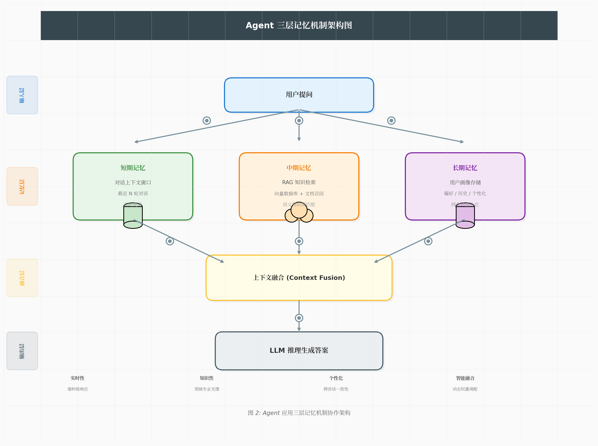

> [!NOTE] 笔记说明
>
> 这篇笔记是《[[Agent 的能力体系]]》一文的后续。其中记录了我学习如何为 Agent 应用构建记忆机制（包括 RAG 架构、LLM Wiki），并将其运用于实际工作场景的实践经验与心得体会。同样的，这些内容也将作为我 AI 系列笔记的一部分，被存储在本人 Github 上的[计算机学习笔记库](https://github.com/owlman/CS_StudyNotes)中，并予以长期维护。

## Agent 应用的记忆机制

由于，人工智能这项技术归根结底是机器对于人类智能的一种模拟，而人类智能大致上可以分为处理问题的“技能”和储存信息的“记忆”两部分，之前在[[Agent 的能力体系]]一文中所讨论的基本上是 Agent 应用对于人类技能的模拟。所以接下来，让我们继续来看看 Agent 应用对于人类记忆的模拟。

### 基于 RAG 架构的记忆机制

和能力体系一样，Agent 的记忆机制也是一个基于分层结构来实现的**工程系统**，其目前最典型的实现方式是一个被称为 RAG 架构的三层结构设计，具体如图 1 所示。

**图 1** 基于 RAG 架构的 Agent 记忆机制

下面，让我们从系统概念的层面来为读者具体介绍一下这三层结构中所涉及的技术。

- **上下文窗口（Context Window）**：这是 Agent 应用的记忆机制中最基础的一层，负责的是 Agent 应用的短期记忆。它的作用是保存 Agent 应用在当前窗口中的对话记录，确保该应用能够“记得”用户刚刚说了什么（因而在专业术语中，它被称为“上下文窗口”）。很显然，该窗口的容量是相当有限的，当其中的对话记录过长时，它可能就会被 Agent 应用截断或遗忘，这就会在某种程度上严重影响应用的用户体验，从而使其无法真正参与到实际生产环境中去。

- **检索增强生成（Retrieval-Augmented Generation，以下简称 RAG）**：为了解决上下文窗口容量有限、LLM 的知识过时以及它无法访问用户的私有数据等问题，AI 的研究者们引入了 RAG 技术。它的工作机制是：先将用户的查询语句转化为向量表示，然后在向量数据库中检索与之最相关的若干文本片段，并将这些检索结果与用户输入拼接为上下文一并输入到 LLM 中，以此来生成最终响应。但需要注意的是，RAG 不是记忆系统，而是“记忆访问机制”，它并不主动记忆，只会在需要时“查资料”。
  
  这也就意味着，Agent 应用还可以在处理用户查询时，动态地引入来自外部的知识（例如通过搜索引擎获得的信息），这就是为什么尽管 LLM 的预训练知识库在时间上普遍存在滞后，但 Agent 应用仍可用于处理当前最新信息的原因。

- **向量数据库（Vector Database）**：这是 Agent 应用中用于实现长期记忆的核心层，它会具体负责持久化地存储历史对话、用户偏好以及任务经验，属于真正的“记忆”。它的具体实现方式有很多种，例如向量数据库（如 LanceDB / FAISS / Milvus）、键值存储（Key-Value Store）以及日志系统（Logging System）等。

从上述每一层结构所展现的技术特性，读者应该可以大致判断出，基于 RAG 架构的 Agent 记忆机制通常会具备以下四大特征：

1. **并行检索**：用户提问同时激活三层记忆，非串行流程；
2. **独立存储**：每层记忆独立维护和优化，互不影响；
3. **智能融合**：Context Fusion 层动态调配权重（如客服场景中期记忆权重高）；
4. **统一输出**：融合后的上下文一次性输入 LLM，保证回答一致性；

需要特别指出的是，RAG 架构并非是由单一技术或组件构成的，其中的向量数据库与 RAG 技术之间存在着配套关系。尤其对于中长期记忆的实现来说，没有向量数据库提供可持久化的存储，RAG 就无法工作；而没有 RAG 技术的支持，向量数据库中存储的信息也没有什么价值。理解这一点是非常关键的，不然在后续的学习中很容易出现理解的碎片化，这不利于我们在生产环境对 Agent 应用的实际操作。

### 基于长上下文窗口的记忆机制

在从系统概念的层面对 Agent 应用的记忆机制有了一个初步的了解之后，我们接下来将以在仅本地运行的 OpenCode 和可部署在服务端的 OpenClaw 这两种典型的 Agent 应用为例，继续从工程实践的角度来探讨如何为 Agent 应用构建记忆机制。

## 基于 RAG 架构的实践

### 实践1：增强长会话记忆

### 实践2：增强跨会话记忆

对于OpenClaw 这类需要以系统服务形式长期运行的 Agent 应用来说，增强跨会话的长期记忆能力可能比保证它在单一长会话的短期记忆更重要一些，因为这直接关系到它作为一款服务端应用，能否长期与用户保持协作关系的能力，这需要它能记住用户之前执行过操作，制定的解决方案，甚至在某程度上了解用户的使用习惯与偏好，形成某种意义上的任务协同经验，我会推荐读者直接借助 GitHub 上一款名为`memory-lancedb-pro`的开源项目来为其增强长期记忆能力，以便在实践中去体验 RAG 架构的实际效果，其具体步骤如下。

1. 在 Github 上搜索`memory-lancedb-pro-skill`，找到该项目的作者为方便用户安装这个插件提供的 Skill，如图  所示。

    

    **图 **：memory-lancedb-pro-skill

2. 使用`git clone`命令将这个 Skill 下载到本地，并复制到 OpenClaw 的用户自定义 Skills 目录中（`~/.openclaw/workspace/skills`），然后在飞书客户端中确认该 Skill 是否已经成功加载，如图5-8所示。

    

    **图5-8**：确认`memory-lancedb-pro-skill`加载成功

3. 继续在飞书客户端中输入内容为“请通过这个 skill，替我自动从零安装 memory-lancedb-pro 插件”的提示词，让 OpenClaw 自动安装`memory-lancedb-pro`插件，如图5-9所示。

    

    **图5-9**：自动安装`memory-lancedb-pro`插件

4. 接着输入内容为“请按照你的理解自动帮我配置”的提示词，让 OpenClaw 自动选择配置`memory-lancedb-pro`插件的最佳方案，如图5-10所示。

    

    **图5-10**：自动配置`memory-lancedb-pro`插件

5. 待配置完成之后，我们就可以继续在飞书客户端中输入内容为“请为我测试写入与检索记忆”的提示词，让OpenClaw自动测试`memory-lancedb-pro`插件的效果。如果一切顺利，读者应该会看到类似于图5-11的回复效果。

    

    **图5-11**：测试`memory-lancedb-pro`插件的效果

至此，我们就赋予了 OpenClaw 长期记忆能力。这意味着，OpenClaw 在执行任务时，可以借助记忆能力来增强其生成效果，从而解决幻觉现象、知识滞后、数据孤岛等问题。与此同时，读者也应该从上述过程中看到 Agent Skills 在工程化应用中的实际价值：通过封装 Skills，我们可以将复杂行为模块化，降低系统复杂度，提高复用效率。

## 基于长上下文窗口的实践

## 参考资料

- 开源项目
  - 

- 视频资料
  - 