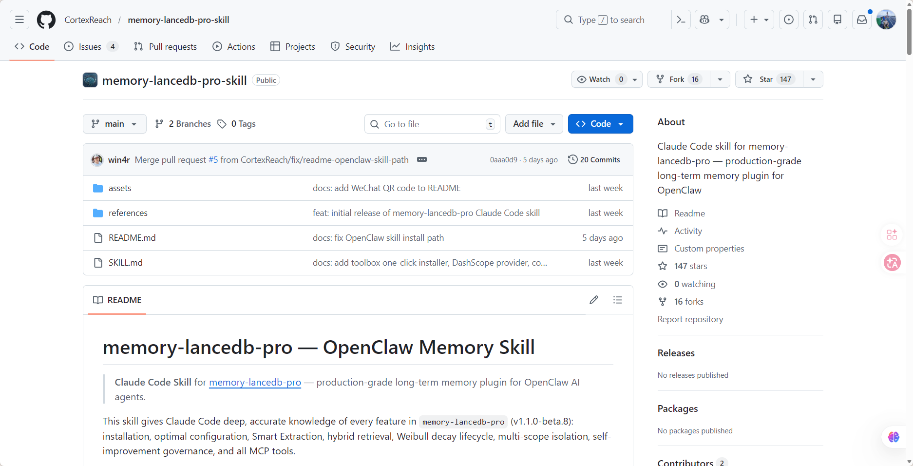
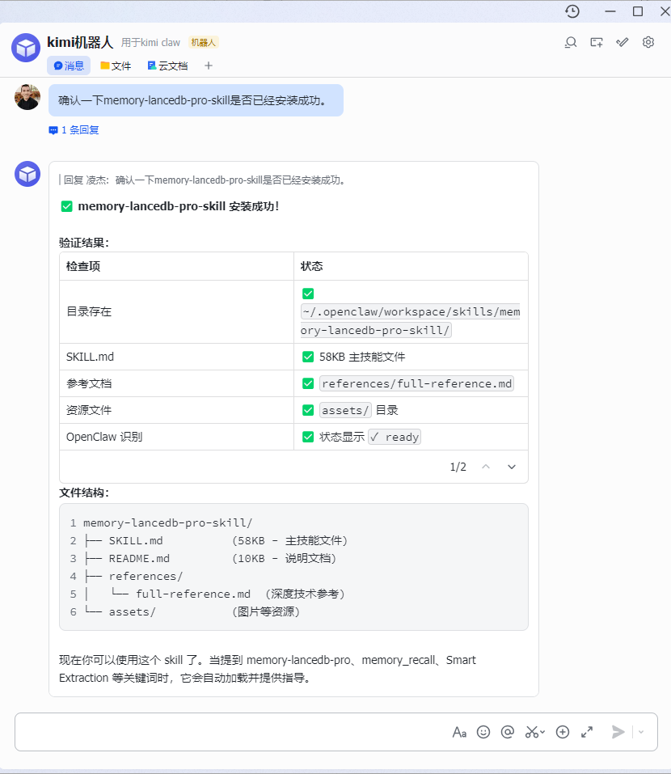
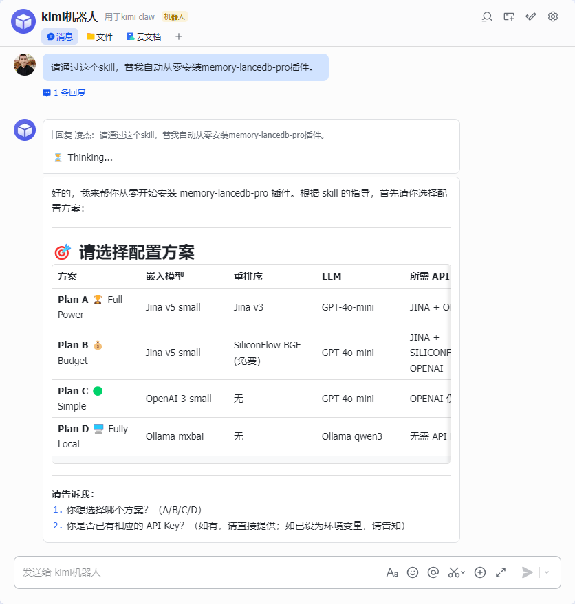
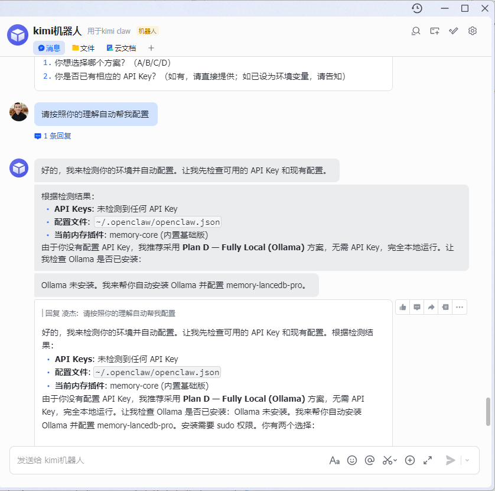
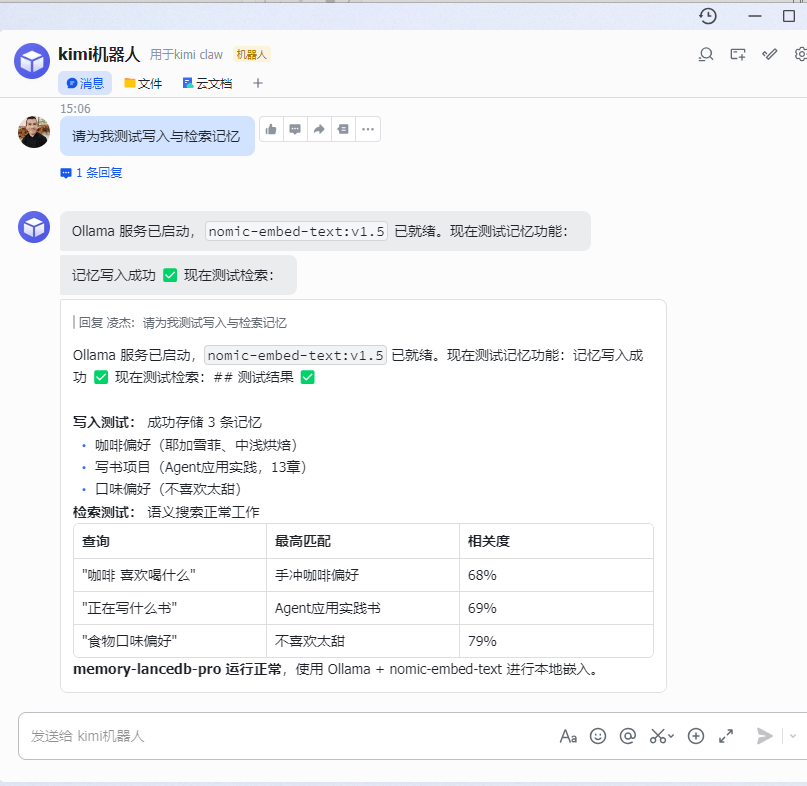

> [!NOTE] 笔记说明
>
> 这篇笔记是《[[Agent 的能力体系]]》一文的后续。其中记录了我学习如何为 Agent 应用构建记忆机制，并将其运用于实际工作场景的实践经验与心得体会。同样的，这些内容也将作为我 AI 系列笔记的一部分，被存储在本人 Github 上的[计算机学习笔记库](https://github.com/owlman/CS_StudyNotes)中，并予以长期维护。

## Agent 应用的记忆机制

从工程实践的角度看，Agent 应用的记忆能力并非单一机制，而是由多个层级的记忆结构共同构成。根据时间尺度与存储方式的不同，可以将其划分为三类：

短期记忆：基于上下文窗口（Context Window），用于维持当前对话状态
中期记忆：基于检索增强（RAG），用于在单次任务中动态引入外部知识
长期记忆：基于向量数据库的持久化存储，用于跨会话的信息积累

这三类记忆机制共同构成了 Agent 应用的完整记忆体系。

## 上下文窗口：管理短期记忆

## 引入 RAG 架构：增强长期记忆

随着 Agent 应用逐步走向复杂化和生产化，LLM 在实际落地中暴露出一系列关键问题，例如幻觉（hallucination）、参数化知识的时效性不足、私有数据利用成本较高，以及微调（fine-tuning）开销较大等。这些因素逐渐成为制约 Agent 系统能力提升的核心瓶颈。

为应对上述问题，人们在工程实践中逐渐形成了一种被称为 RAG（即 Retrieval-Augmented Generation，在中文中可译为“检索增强生成”）的架构。其核心思想是将“知识获取（retrieval）”与“文本生成（generation）”解耦，从而避免将知识完全固化在模型参数之中。在该架构中，Agent 应用会首先通过嵌入模型（Embedding Model）将文本映射为高维语义向量（embedding），并将这些向量与对应的原始文本片段一同存储于向量数据库中，用于后续基于向量相似度（如余弦相似度或内积）的高效检索。与此同时，LLM 本身仅负责基于输入上下文进行语言生成。然后，Agent 应用在推理阶段就可以通过执行如下流程来完成任务了。

1. 将用户查询编码为向量表示，并在向量数据库中检索与之最相关的若干文本片段；
2. 将这些检索结果与用户输入拼接为上下文，一并输入 LLM 生成最终响应。

由此，Agent 应用的输出就建立在了“外部知识 + 推理能力”的基础之上，这也解释了为什么尽管 LLM 的预训练知识库在时间上普遍存在滞后，但 Agent 应用仍可通过在推理阶段动态引入外部信息来让自己具备处理最新数据的能力。需要注意的是，RAG 并不等同于“记忆机制”。其本质是一种基于检索的知识增强方法。只有当系统将历史对话或外部数据持续写入向量数据库，并在后续任务中反复参与检索时，才会表现出类似“记忆”的效果。因此，RAG 可以被视为构建 Agent 长期记忆能力的重要基础设施之一。

### 实践1：增强长会话记忆

### 实践2：增强跨会话记忆

对于OpenClaw 这类需要以系统服务形式长期运行的 Agent 应用来说，增强跨会话的长期记忆能力可能比保证它在单一长会话的短期记忆更重要一些，因为这直接关系到它作为一款服务端应用，能否长期与用户保持协作关系的能力，这需要它能记住用户之前执行过操作，制定的解决方案，甚至在某程度上了解用户的使用习惯，形成类似于宠物”认主人“的行为，我会推荐读者直接借助 GitHub 上一款名为`memory-lancedb-pro`的开源项目来为其增强长期记忆能力，以便在实践中去体验 RAG 架构的实际效果，其具体步骤如下。

1. 在Github上搜索`memory-lancedb-pro-skill`，找到该项目的作者为方便用户安装这个插件提供的Skill，如图  所示。

    

    **图**：memory-lancedb-pro-skill

2. 使用`git clone`命令将这个Skill库下载到本地，并复制到OpenClaw的用户自定义Skill目录中（`~/.openclaw/workspace/skills`），然后在飞书客户端中确认该Skill库是否已经成功加载，如图5-8所示。

    

    **图5-8**：确认`memory-lancedb-pro-skill`加载成功

3. 继续在飞书客户端中输入内容为“请通过这个skill，替我自动从零安装memory-lancedb-pro插件”的提示词，让OpenClaw自动安装memory-lancedb-pro插件，如图5-9所示。

    

    **图5-9**：自动安装`memory-lancedb-pro`插件

4. 接着输入内容为“请按照你的理解自动帮我配置”的提示词，让OpenClaw自动选择配置`memory-lancedb-pro`插件的最佳方案，如图5-10所示。

    

    **图5-10**：自动配置`memory-lancedb-pro`插件

5. 待配置完成之后，我们就可以继续在飞书客户端中输入内容为“请为我测试写入与检索记忆”的提示词，让OpenClaw自动测试`memory-lancedb-pro`插件的效果。如果一切顺利，读者应该会看到类似于图5-11的回复效果。

    

    **图5-11**：测试`memory-lancedb-pro`插件的效果

至此，我们就赋予了OpenClaw长期记忆能力。这意味着，OpenClaw在执行任务时，可以借助记忆能力来增强其生成效果，从而解决幻觉现象、知识滞后、数据孤岛等问题。与此同时，读者也应该从上述过程中看到Agent Skills在工程化应用中的实际价值：通过封装Skills，我们可以将复杂行为模块化，降低系统复杂度，提高复用效率。

总而言之，如果说提示词是一种“软控制”手段，那么Skill则是一种“结构化控制”手段。它主要用于稳定行为输出，降低系统复杂度，提高复用效率。在我个人看来，只有当初学者们理解了Agent Skills在Agent应用中的作用并不是对提示词的锦上添花，而是一种对复杂度进行主动管理的工具，才真正有可能让自己手里的Agent应用从“个人玩具”升级为一个可发挥出生产力的工程化系统。

当我们讨论提示词、MCP服务、Agent Skills时，很容易被具体实现细节吸引，例如，初学者们都很关心提示词应怎么写、外部工具怎么调用、Skill如何封装。但如果退后一步看，我们就会发现这些讨论其实都指向同一个问题：

> 如何在一个本质上是概率模型的系统之上，构建可预测、可维护、可扩展的工程体系？

提示词解决的是我们如何更好地向 LLM 表达意图，MCP 服务解决的是如何让 LLM 安全地使用外部能力，Skills 机制解决的是如何将 Agent 应用的复杂行为结构化、模块化。换言之，它们本质上都是在用软件工程的方法，约束并组织 LLM 基于概率计算的不确定性。而这正是 LLM 应用与传统软件在工程化运用上的最大区别：我们不再完全控制执行路径，而是通过设计接口、分层结构和行为边界，对一个概率系统施加工程约束。

真正成熟的大模型应用，并不是提示词堆砌得多复杂，也不是接入了多少外部工具，而是是否清晰地划分了能力边界。当我们理解了这一点，提示词就不再是技巧，MCP服务不再是工具集合，Agent Skills也不再是模板封装。我们会很清楚地看到，Agent 应用的这三层能力体系所构成的是一套全新的工程方法论，目的是在不确定中构建确定性。或许，这才是 AI 时代真正值得学习的能力。

## 参考资料

- 开源项目
  - 

- 视频资料
  - 