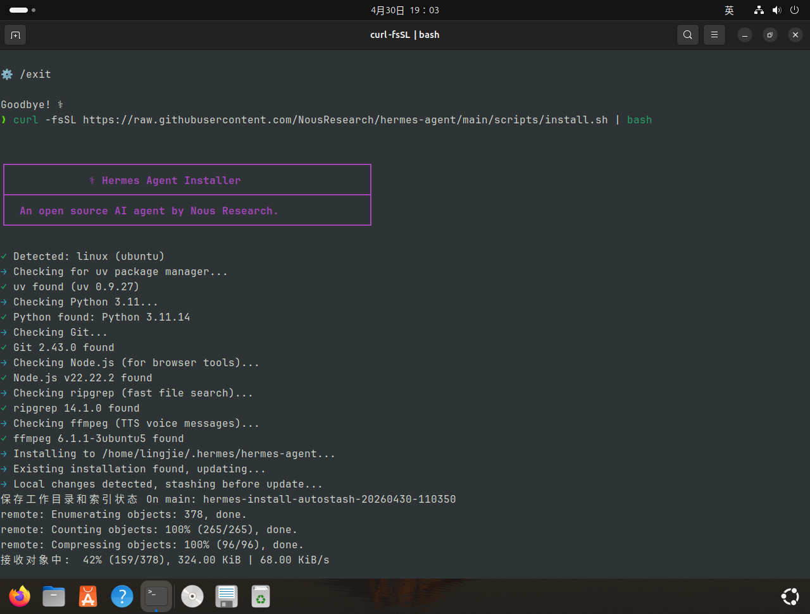
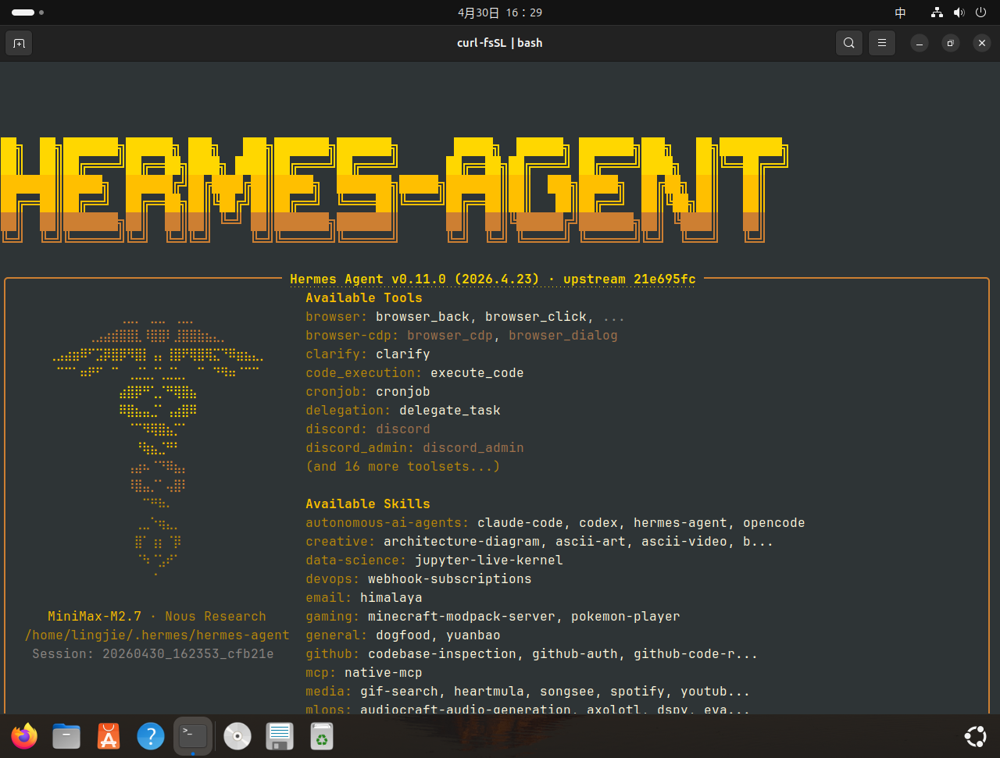
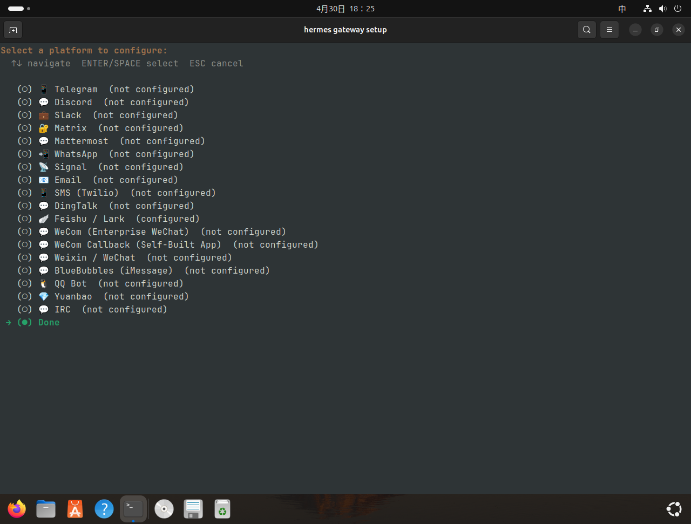
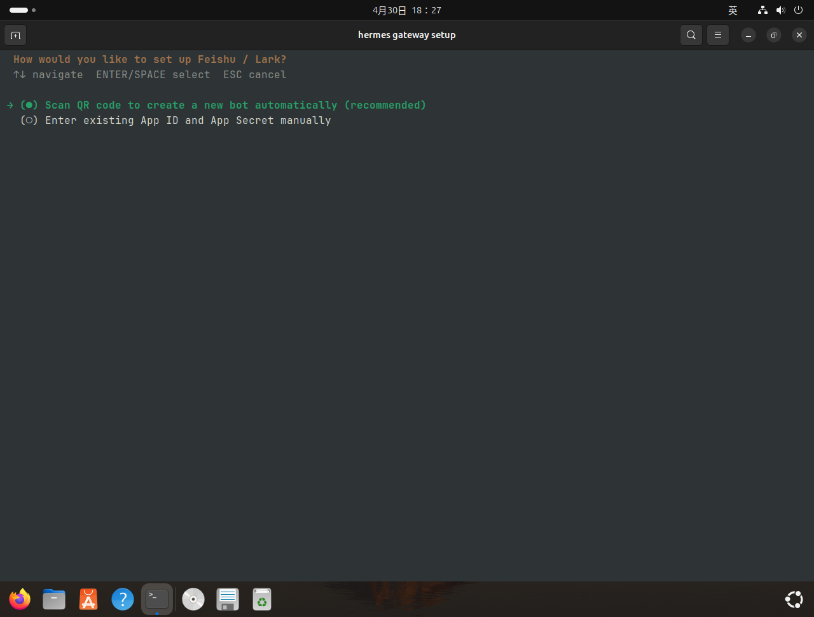
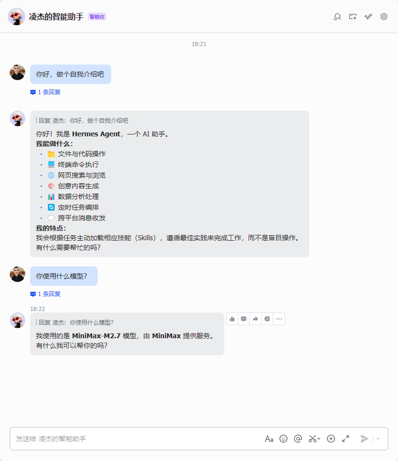

> [!NOTE] 笔记说明
>
> 这篇笔记是对 Agent 系列笔记的补充，主要用于补充介绍 Hermes Agent 的使用方法。同样的，这些内容也将成为我 AI 系列笔记的一部分，被存储在本人 Github 上的[计算机学习笔记库](https://github.com/owlman/CS_StudyNotes)中，并予以长期维护。

## Hermes Agent 简介

Hermes Agent 于 2026 年 2 月由一家名为 Nous Research 公司发布在 Github 上，首月即斩获 2.2 万个 stars，截至 2026 年 4 月中旬，其周均新增 stars 数达 9500 个，增速达同期主流智能代理产品的三倍以上，连续两周登顶 GitHub 全球趋势榜首位。Hermes Agent 的核心竞争力源于其独特的技术架构设计，构建了”记忆-技能-训练数据”的三层闭环体系，这让它具备了如下主要特性：

### 1. 拥有四级的分层记忆系统

Hermes Agent 打破了传统的全量存储模式，它借鉴 CPU 缓存的设计思想打造出了一个分层记忆系统，这一解决方案在一定程度上缓解了 OpenClaw 在持久记忆方面的缺陷所带来的问题，为 Agent 的持久记忆机制提供了一种更稳定的工程实现。具体来说，这个记忆系统主要有如下四个分层结构组成。

- L1 核心记忆：相关记忆数据存储于`MEMORY.md`文件，这可以被视为 Agent 的记事本，容量严格限制在 800 tokens 以内。每次会话启动时冻结为快照注入系统提示词，确保关键上下文不丢失。例如在代码调试场景中，能精准保留错误堆栈、变量状态等核心信息。

- L2 用户画像：相关记忆数据存储于`USER.md`文件，约 500 tokens 的容量，主要用于通过分析历史对话自动记录用户的技术栈偏好（如 Python/JavaScript/C++ 倾向）、沟通风格（简洁/详细）等维度标签，以便实现与用户的个性化交互。

- L3 会话记忆：相关记忆数据会被全量存储在 SQLite 数据库中，并利用 FTS5 全文索引支持毫秒级检索。Hermes Agent 不会自动加载所有历史，而是仅在需要时通过 session_search 工具主动查询。

- L4 技能系统：相关记忆数据存储于`~/.hermes/skills`目录下，Hermes Agent 能将复杂任务的解决路径自动提炼为各种可复用的`SKILL.md`文件。

总而言之，与 OpenClaw 相比，Hermes Agent 拥有更接近人类的记忆能力，这使它能根据信息的价值和新鲜度进行分层、压缩与主动遗忘，实现跨会话的“举一反三”。而 OpenClaw 的持久记忆功能则相对更基础一些，如果我们想要让它具备这种内化的、分层管理的能力，就得借助 [memory-lancedb-pro](https://github.com/CortexReach/memory-lancedb-pro) 或 [memory-powermem](https://github.com/ob-labs/memory-powermem) 这样的第三方插件来实现，但这些第三方插件又正是 OpenClaw 每次版本更新会引发兼容性问题的根源。有时候，计算机世界就是这样，牺牲自由度就会换来便利性，反之亦然。

### 2. 拥有完整的技能扩展框架

Hermes Agent 提供了标准化技能开发接口，支持通过 YAML 配置快速集成新功能。例如，如果想添加数据库查询技能仅需进行如下定义：

```yaml
skills:
- name: database_query
    type: sql
    connection:
    driver: postgresql
    endpoint: ${DB_ENDPOINT}
    templates:
    - "查询{{table}}表中{{condition}}的记录"
```

技能市场已收录 200+ 预训练技能，覆盖数据分析、运维监控、创意生成等八大场景。开发者可基于模板库在 10 分钟内完成新技能开发。

### 3. 提供有简单易用的部署方案

Hermes Agent 支持 Linux/macOS/Windows/Android Termux 环境，用户通过执行一条安装命令即可完成部署，其执行过程如图 1 所示。和 OpenClaw 一样，Hermes Agent 在网关服务启动前，也会要求用户指定要连接的 LLM 提供商（包括 API Key），由于操作方式大同小异，这里就不再赘述了。

```bash
curl -fsSL https://raw.githubusercontent.com/NousResearch/hermes-agent/main/scripts/install.sh | bash
```



**图 1**：Hermes Agent 的安装过程

如果一切顺利，我们只需要继续在命令行终端中执行`hermes`命令，Hermes Agent 就会启动一个如图 2 所示的 TUI 对话窗口，它的作用和我们之前在[[Agent 的基础应用]]这篇笔记中介绍过的 OpenClaw TUI 是一样的，只不过它的界面更美观一些。



**图 2**：Hermes Agent TUI 的对话窗口

### 4. 支持多通信平台接入

内置统一消息网关，通过适配器模式支持包括微信、飞书在内的 15+ 个主流通讯平台。记忆与技能数据在各平台间完全互通，解决传统智能代理”平台孤岛”问题。用户通过执行`hermes gateway setup`命令即可完成通信平台的接入配置，如图 3 所示：



**图 3**：Hermes 的通讯平台接入配置

例如，如果我们在上述界面中选择飞书（Feishu / lark），就会看到如图 4 所示的接入方式界面。然后，我们在这里既可以选择第一项，然后用手机端的飞书通过扫二维码方式自动在飞书开放平台中创建机器人（它会按照指定的智能体模版配置好机器人被赋予的执行权限）；也可以和之前在 OpenClaw 种所做的一样，先去飞书开放平台手动创建机器人，并为它配置好你想赋予的权限，然后再回到这里选择第二项，将该机器人的 App ID 和 App Secret 填入。前者比较方便，后者则比较自由，我们可以根据自己的需求来做出选择。



**图 4**：Hermes 的飞书接入方式

如果一切顺利，我们就可以利用配置的飞书机器人与 Hermes Agent 进行对话了，如图 5 所示：



**图 5**：Hermes 的对话窗口

## 参考资料

- 文档资料
  - [Hermes Agent 官方文档](https://hermes-agent.nousresearch.com/docs/)
  - [Hermes Agent 中文文档](https://hermesagent.org.cn/docs/getting-started/quickstart)

- 视频资料：
  - [Hermes Agent 安装与配置演示](https://www.bilibili.com/video/BV1PMRTBYEdV)

#未完成