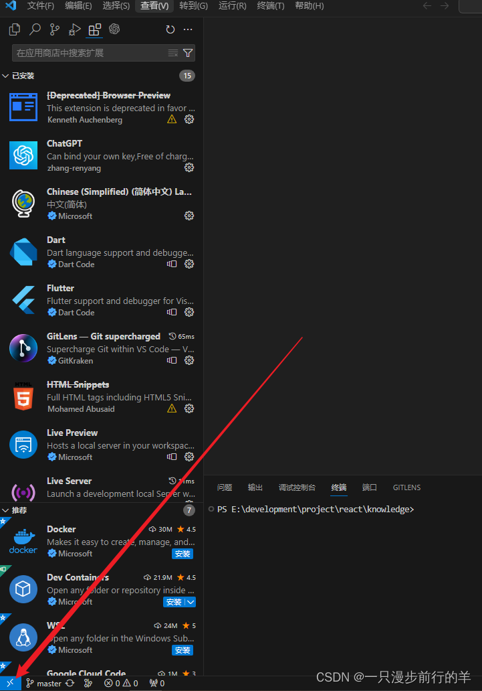
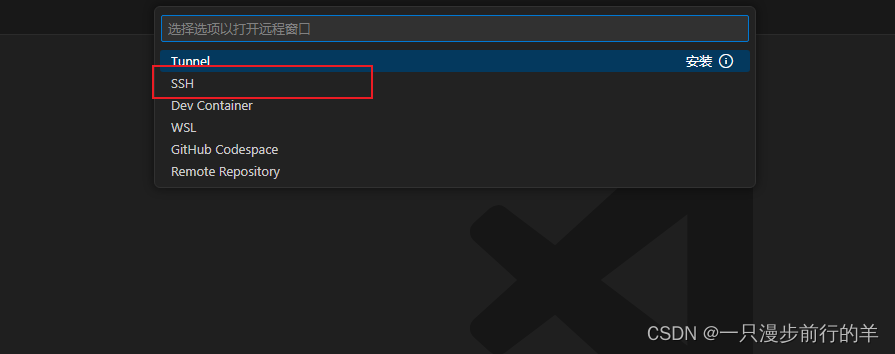
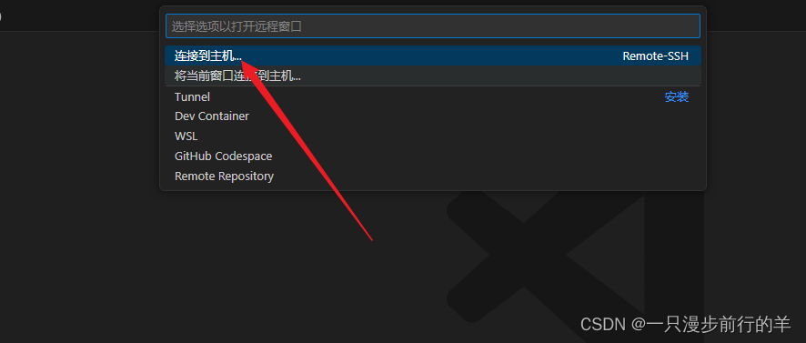
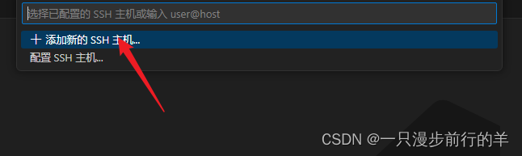
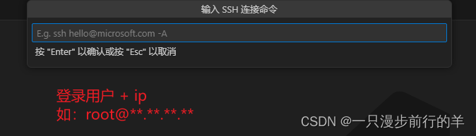
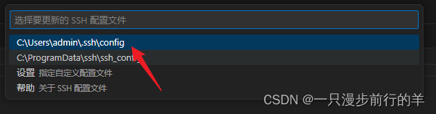
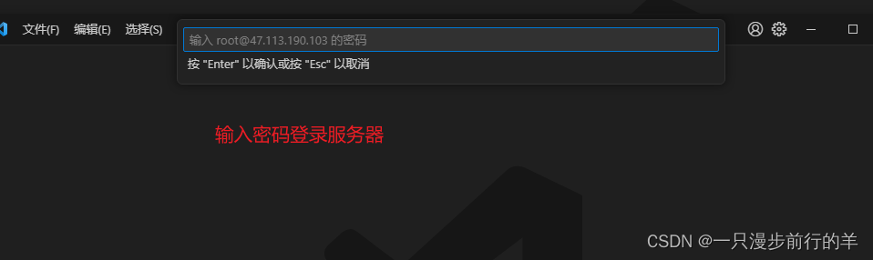
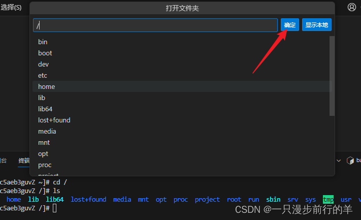
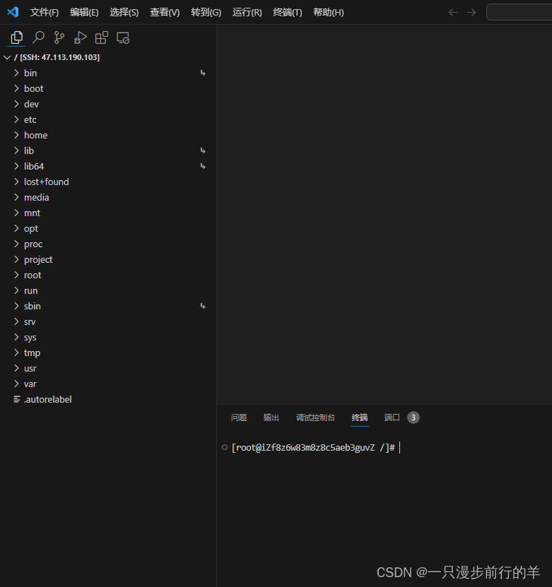

# Vscode——通过SSH连接服务器

本文详细介绍了如何在VSCode中设置SSH连接，包括安装相关插件、连接服务器、使用终端以及操作服务器文件的步骤，为开发者提供便捷的远程开发环境配置。

## 1、打开vscode —— 点击左下角

## 2、选择SSH

## 3、点击后会自动安装三个插件

## 4、点击左下角——连接服务器

## 5、再次点击左下角——连接服务器

## 6、登录成功后打开终端即可操作 快捷键：`ctrl + ~`

## 7、查看编辑服务器文件目录 点击文件——打开文件夹

## 8、确定后再次输入登录密码即可

